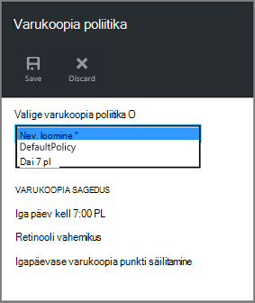
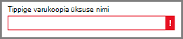

<properties
    pageTitle="Ressursihaldur juurutatud virtuaalse masina varukoopiate haldamine | Microsoft Azure'i"
    description="Saate teada, kuidas hallata ja jälgida ressursihaldur juurutatud virtuaalse masina varukoopiate"
    services="backup"
    documentationCenter=""
    authors="trinadhk"
    manager="shreeshd"
    editor=""/>

<tags
    ms.service="backup"
    ms.workload="storage-backup-recovery"
    ms.tgt_pltfrm="na"
    ms.devlang="na"
    ms.topic="article"
    ms.date="08/11/2016"
    ms.author="jimpark; markgal; trinadhk"/>

# Azure virtuaalse masina varukoopiate haldamine

> [AZURE.SELECTOR]
- [Azure'i VM varukoopiate haldamine](backup-azure-manage-vms.md)
- [Klassikaline VM varukoopiate haldamine](backup-azure-manage-vms-classic.md)

Selles artiklis antakse juhiseid VM varukoopiate haldamise ja selgitatakse portaali armatuurlaua sisalduvat teavet varukoopia teatised. Selles artiklis on juhised kehtib taastamise teenused võlvid VMs abil. See artikkel ei sisalda virtuaalmasinates loomine ega tähendab seda selgitatakse, kuidas kaitsta virtuaalmasinates. On esimene Azure'i ressursihaldur juurutatud VMs Azure taastamise teenused vault koos kaitsmise kohta, vaadake teemat [tutvustus: varundamine taastamise teenused vault VMs](backup-azure-vms-first-look-arm.md).

## Võlvid ja kaitstud virtuaalse masinad haldamine

Azure'i portaalis taastamise teenused vault armatuurlaud on vault, sh teave:

- Viimati tehtud varukoopia hetktõmmise, mis on ka Viimane punkt taastamine < br\>
- varukoopia poliitika < br\>
- kokku kõik varukoopia pilte suurus < br\>
- arv, mis on kaitstud vault virtuaalmasinates < br\>

Mitme haldustoimingute virtuaalse masina varundamise algavad avamine vault armatuurlaual. Kuna võlvid abil saab kaitsta mitu üksust (või mitme VMs), eriti VM üksikasjade kuvamiseks avage vault üksust armatuurlaud. Järgnevalt näidatakse, kuidas avada *vault armatuurlaua* ja seejärel jätkake *vault üksust armatuurlaud*. "Näpunäited" on nii toiminguid, mis osutavad, kuidas lisada vault ja võlvkelder üksuse Azure armatuurlaud armatuurlaua käsk PIN-koodi abil. PIN-koodi armatuurlaud on võimalus luua otsetee vault või üksuse juurde. Otsetee kaudu saate teostada ka tavaliste tööriistarea.

>[AZURE.TIP] Kui teil on mitu armatuurlaudade ja labad avada, kasutage liugurit tume – sinine akna allosas slaidipaigutuse Azure armatuurlaua edasi ja tagasi.

### Avage taastamise teenused vault armatuurlaud.

1. [Azure'i portaali](https://portal.azure.com/)sisse logida.

2. Jaoturi menüü, klõpsake nuppu **Sirvi** ja tippige ressursid loendis **Taastamise teenused**. Kui alustate tippimist, loendi filtrid põhjal sisendit. Klõpsake **taastamise teenused vault**.

      

    Loendis kuvatakse võlvid taastamise teenused.

      

    >[AZURE.TIP] Kui kinnitate võlvkelder Azure'i armatuurlaud, et vault on kohe juurdepääsetav Azure portaali avamisel. Armatuurlaud, võlvkelder vault loendis, paremklõpsake vault ja valige **Kinnita armatuurlaud**.

3. Valige loendist võlvid, vault avamiseks selle armatuurlaua. Kui valite vault, vault armatuurlaua ja **sätted** tera avada. Järgmisel pildil on esile tõstetud **Contoso-vault** armatuurlaud.

    

### Avage vault üksust armatuurlaud

Eelmise jaotise avamist vault armatuurlaud. Vault üksuse armatuurlaua avamiseks tehke järgmist.

1. Klõpsake paani **Üksuste varundamine** armatuurlaual vault **Azure'i Virtuaalmasinates**.

    

    Tera **Varukoopia üksuste** loendid viimase Varundustöö iga üksuse jaoks. Selles näites on üks virtuaalse masina, demovm markgal, selle vault kaitstud.  

    

    >[AZURE.TIP] Hõlbustus, võite kinnitada vault üksuse Azure'i armatuurlaud. Vault üksuse, vault loendist üksus, paremklõpsake üksust ja valige **Kinnita armatuurlaud**.

2. **Üksuste varundamine** tera, klõpsake üksust avamiseks vault üksust armatuurlaud.

    

    Armatuurlaua vault üksuse ja selle **sätted** tera avada.

    

    Üksuse vault armatuurlaual saate täita paljusid võtme haldamise toiminguid, näiteks:

    - muuta poliitikate või luua uue varukoopia poliitika < br\>
    - taastamine punktide kuvada, ja nende järjepidevuse olek < br\>
    - nõudmisel varukoopia virtuaalse masina < br\>
    - Peata kaitse virtuaalmasinates < br\>
    - elulookirjelduse virtuaalse masina kaitse < br\>
    - varundatud andmete (või taastamise punkti) kustutamine < br\>
    - [taastamine varukoopia (või taastamise punkti)](./backup-azure-arm-restore-vms.md#restore-a-recovery-point) < br\>

Järgmistest toimingutest, alguspunkt on vault üksust armatuurlaud.

## Varukoopia poliitikate haldamine

1. [Vault üksust armatuurlaud](backup-azure-manage-vms.md#open-a-vault-item-dashboard), klõpsake nuppu **Kõik sätted** , et avada tera **sätted** .

    

2. Enne **sätted** , klõpsake **varundamise poliitika** avamiseks selle tera.

    Enne, kuvatakse varukoopia sagedus ja säilituspoliitikate vahemiku andmed.

    

3. **Valige varukoopia poliitika** menüüst:
    - Poliitika muutmiseks valige muu poliitika ja klõpsake nuppu **Salvesta**. Uue poliitika rakendatakse kohe vault. < br\>
    - Poliitika loomiseks valige **Uus**.

    

    Varukoopia poliitika loomise juhised leiate teemast [varukoopia poliitikast](backup-azure-manage-vms.md#defining-a-backup-policy).

[AZURE.INCLUDE [backup-create-backup-policy-for-vm](../../includes/backup-create-backup-policy-for-vm.md)]

## Nõudmisel varukoopia virtuaalse masina
Kui see on konfigureeritud kaitse, saate mõne nõudmisel varukoopia virtuaalse masina teha. Kui algset varundus on ootel, loob tellitavate varundamise taastamise teenused võlvkelder virtuaalse masina täielik koopia. Kui algset varundamine on lõpule jõudnud, kuvatakse nõudmisel varukoopia ainult saadab muudatuste kaudu eelmise hetktõmmis vault taastamise teenused. See on edaspidised varukoopiate on alati suureneva.

>[AZURE.NOTE] Säilituspoliitika vahemiku jaoks mõne nõudmisel varundus on iga päev varukoopia punkti poliitika jaoks määratud säilituspoliitika väärtus. Kui ükski igapäevane varukoopia punkt on valitud, kasutatakse nädala varukoopia punkti.

Kuvatakse nõudmisel varukoopia virtuaalse masina käivitamiseks:

- [Vault üksust armatuurlaud](backup-azure-manage-vms.md#open-a-vault-item-dashboard), klõpsake nuppu **Varunda kohe**.

    

    Portaali saab kontrollida, kas soovite alustada ka nõudmisel detailse. Klõpsake nuppu **Jah** Varundustöö käivitamiseks.

    

    Varundustöö loob taastamine punkti. Erinevatele taastamise punkti on sama säilituspoliitika vahemiku määratud seostatud virtuaalse masina poliitika. Töö vault armatuurlaual edenemise jälgimiseks klõpsake paani **Varundamise tööde haldamine** .  

## Peata kaitse virtuaalmasinates
Kui valite peatamiseks kaitsmine virtuaalse masina, küsitakse, kas soovite säilitada taastamise punkte. On kaks võimalust lõpetamiseks kaitsmine virtuaalmasinates.
- Kõik varukoopia tulevaste projektide peatada ja kustutada kõik taastamise punkte, või
- Lõpeta kõik varukoopia tulevaste projektide, kuid on jätnud taastamise punkte  

On seostatud jättes taastamise punkte salvestusruumi. Kasu jättes taastamise punkte aga saate taastada virtuaalse masina hiljem, kui soovitud. Täpsemat teavet maksumuse lahkumise taastamise punkte, [hinnad üksikasjad](https://azure.microsoft.com/pricing/details/backup/). Kui otsustate kustutada kõik taastamise punkte, ei saa taastada virtuaalse masina.

Kaitse virtuaalse masina lõpetamiseks tehke järgmist.

1. [Vault üksust armatuurlaud](backup-azure-manage-vms.md#open-a-vault-item-dashboard), klõpsake nuppu **Peata varundus**.

    

    Varundamise peatamine tera avaneb.

    

2. **Lõpeta varukoopia** enne valida, kas säilitada või kustutada andmete varukoopia. Teave väljale üksikasju tehtud valikust.

    

3. Kui valisite varundatud andmete säilitamise, jätkake juhisega 4. Kui valisite varukoopia andmed kustutada, kinnitada, et soovite peatada varukoopia töö ja kustutada taastamise punkte – Tippige üksuse nimi.

    

    Kui te pole kindel, et üksuse nime, hoidke kursorit hüüumärk nime kuvamiseks. Samuti on üksuse nimi jaotises **Peata varundus** tera ülaosas.

4. Soovi korral lisage **põhjus** või **kommentaari**.

5. Praeguse üksuse Varundustöö peatamiseks klõpsake käsku  

    Vastav teade, mis teavitab teid varukoopia tööd on peatatud.

    

## Kaitse virtuaalse masina jätkamine
Kui suvand **Varundamise andmete säilitamise** valiti kui virtuaalse masina kaitse on peatatud, siis on võimalik jätkata kaitse. Kui on valitud suvand **Kustuta varundamise andmed** , seejärel virtuaalse masina kaitse ei saa jätkata.

Kui soovite jätkata virtuaalse masina kaitse

1. Klõpsake [vault üksuse armatuurlaua](backup-azure-manage-vms.md#open-a-vault-item-dashboard) **jätkamine varukoopia**.

    

    Varundus poliitika tera avaneb.

    >[AZURE.NOTE] Kui virtuaalse masina uuesti kaitsmisele saate valida muu poliitika, kui poliitika, millega virtuaalse masina kaitstud algselt.

2. Juhised [poliitika või Loo uus varukoopia poliitika](backup-azure-manage-vms.md#change-policies-or-create-a-new-backup-policy), virtuaalse masina poliitika määramine.

    Kui varukoopia poliitika on rakendatud virtuaalse masina, kuvatakse järgmine teade.

    

## Varundus andmete kustutamine
Saate kustutada varukoopia virtuaalse masina seotud andmete **varundamise peatamine** töö käigus või igal ajal pärast varukoopia töö on valmis. See võib olla isegi kasulik oodata päeva või nädala enne kustutamist taastamise punkte. Erinevalt taastamine taastamise punkte, kui varundatud andmete kustutamine, ei saa valida kindla taastamise punkte kustutada. Kui valite oma varundatud andmete kustutamiseks, saate kustutada kõik taastamise punkte selle üksusega seotud.

Järgnev toiming eeldab, virtuaalse masina töö varundus on peatatud või keelatud. Pärast varukoopia töö on keelatud, **elulookirjeldus varundus** ja **kustutada varundamise** suvandid on saadaval vault üksust armatuurlaud.

Varundatud andmete virtual arvutisse, kuhu *varundus keelatud*kustutamiseks tehke järgmist.

1. Klõpsake [vault üksuse armatuurlaua](backup-azure-manage-vms.md#open-a-vault-item-dashboard) **kustutamine varukoopia**.

    

    **Varundus andmete kustutamise** tera avaneb.

    

2. Tippige nimi, üksuse kinnitamiseks kustutada taastamise punkte.

    

    Kui te pole kindel, et üksuse nime, hoidke kursorit hüüumärk nime kuvamiseks. Samuti on üksuse nimi **Varukoopia andmete kustutamise** tera ülaosas.

3. Soovi korral lisage **põhjus** või **kommentaari**.

4. Praeguse üksuse varundatud andmete kustutamiseks valige  

    Vastav teade, mis teavitab teid varukoopia andmed on kustutatud.

## Järgmised sammud

Uuesti luua virtuaalse masina punktist taastamise kohta lisateabe saamiseks lugege teemat [Azure VMs taastamine](backup-azure-restore-vms.md). Kui soovite oma virtuaalmasinates kaitsmise kohta lisateavet, lugege teemat [tutvustus: varundamine taastamise teenused vault VMs](backup-azure-vms-first-look-arm.md). Jälgimise sündmuste kohta leiate teavet teemast [jälgimine teatiste Azure virtuaalse masina varukoopiad](backup-azure-monitor-vms.md).
