<properties
    pageTitle="Azure'i varundus võlvid ja serverid Azure'i klassikaline juurutamise näidise haldamine | Microsoft Azure'i"
    description="Selle õpetuse abil saate teada, kuidas hallata Azure varukoopia võlvid ja serverites."
    services="backup"
    documentationCenter=""
    authors="markgalioto"
    manager="jwhit"
    editor="tysonn"/>

<tags
    ms.service="backup"
    ms.workload="storage-backup-recovery"
    ms.tgt_pltfrm="na"
    ms.devlang="na"
    ms.topic="article"
    ms.date="09/27/2016"
    ms.author="jimpark;markgal"/>

# Azure'i varundus võlvid ja klassikaline juurutamise näidise serverite haldamine

> [AZURE.SELECTOR]
- [Ressursihaldur](backup-azure-manage-windows-server.md)
- [Klassikaline](backup-azure-manage-windows-server-classic.md)

Selles artiklis leiate Azure'i klassikaline portaali ja Microsoft Azure varukoopia agendi kaudu saadaolevad varukoopia juhtimine tööülesanded ülevaade.

[AZURE.INCLUDE [learn-about-deployment-models](../../includes/learn-about-deployment-models-classic-include.md)]Ressursihaldur juurutamise mudel.

## Portaali haldustoimingud.
1. Logige sisse [haldusportaali](https://manage.windowsazure.com).

2. Klõpsake **Taastamise teenused**ja seejärel klõpsake Kiirkäivituse lehe vaatamiseks varukoopiate hoidla nime.

    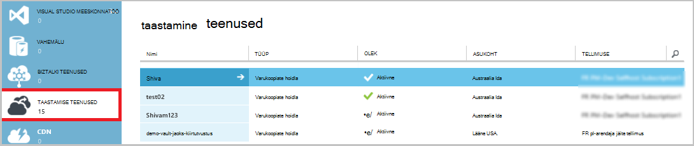

Kui valite suvandi Kiirkäivituse lehe ülaosas, näete saadaval haldamise toiminguid.

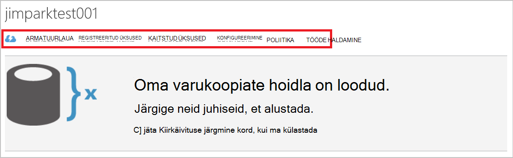

### Armatuurlaua
Valige **armatuurlaud** kuvamiseks serveri kasutus ülevaade. **Ülevaade kasutus** sisaldab järgmist:

- Windowsi serverite arv registreeritud pilveteenusesse
- Azure'i virtuaalmasinates kaitstud pilveteenuses arv
- Kogu talletusmaht tarbitud Azure
- Tehtud töö oleku

Armatuurlaua allosas saate teha järgmisi toiminguid:

- **Serdi haldamine** – kui server registreerida ja seejärel kasutage seda serti värskendamiseks kasutatud sert. Kui kasutate hoidla mandaat, kasutage **haldamine sert**.
- **Kustutamine** – kustutab praeguse varukoopiate hoidla. Kui varukoopiate hoidla enam ei kasutata, saate ruumi vabastamiseks kustutada. **Kustutamine** on lubatud ainult pärast kõigi registreeritud serverid on kustutatud soovitud hoidlast.

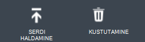

## Registreeritud üksused
Valige **Registreeritud üksuste** kuvamiseks selle vault registreeritud serverite nimed.

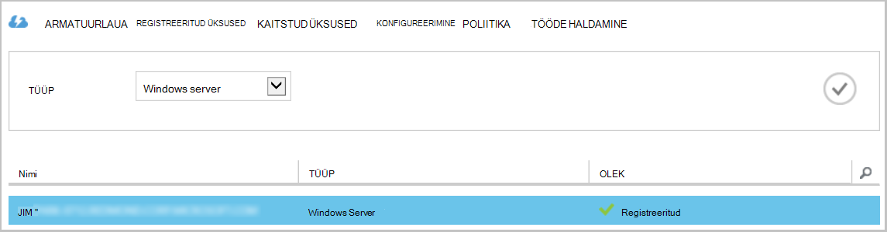

**Tippige** filtri vaikimisi Azure virtuaalse masina. Serverid, mis on registreeritud selle vault nimede vaatamiseks valige rippmenüüst **Windows server** .

Siin saate teha järgmisi toiminguid:

- **Luba registreerimisel** – selle suvandi valimisel serveri abil saate **Registreerimise viisardi** kohapealse Microsoft Azure varukoopia agent registreerida serveri varukoopiate hoidla teist korda. Peate uuesti registreerida serdi tõrke tõttu või kui server oli uuesti koostada.
- **Kustutamine** – kustutab serveri varukoopia hoidlast. Kõik talletatud andmed seotud server kustutatud kohe.

    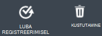

## Kaitstud üksused
Valige **Kaitstud üksuste** kuvamiseks üksused, mis on varundatud serverid.

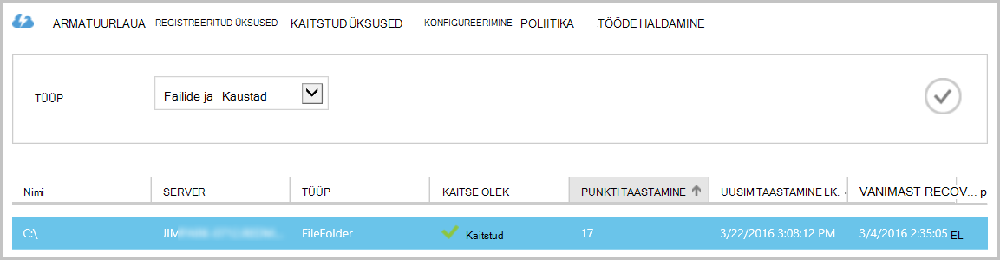

## Konfigureerimine

**Konfigureerimine** vahekaardil saate valida suvandi asjakohased koondamise. Valida parima aja salvestusruumi koondamise suvand on õige võlvkelder loomise järel ja enne selle mis tahes masinad registreeritud.

>[AZURE.WARNING] Kui üksus on vault registrisse kantud, salvestusruumi koondamine suvand on lukus ja seda ei saa muuta.

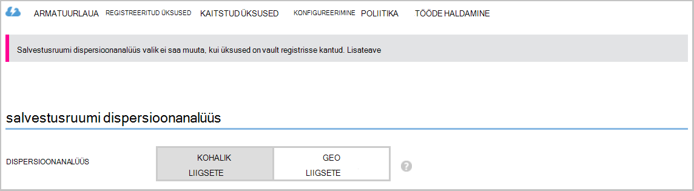

Lugege artiklit [salvestusruumi koondamise](../storage/storage-redundancy.md)kohta lisateavet.

## Microsoft Azure varukoopia agent tööülesanded

### Konsooli

Avage **Microsoft Azure varukoopia agent** (leiate selle arvuti otsides *Microsoft Azure varukoopia*).

Paremas servas varukoopia agent konsooli saadaolevad **toimingud** kaudu saate teha järgmisi haldamise toiminguid:

- Server registreerimine
- Ajakava varundamine
- Varundamine kohe
- Atribuutide muutmine

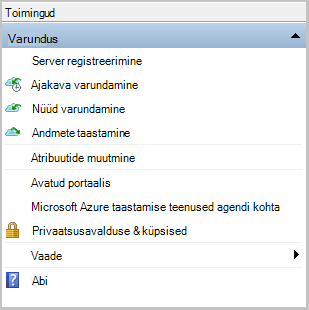

>[AZURE.NOTE] **Andmete taastamine**, lugege teemat [taastada faile Windows server või Windows klientarvutis](backup-azure-restore-windows-server.md).

### Olemasoleva varukoopia muutmine

1. Klõpsake Microsoft Azure varukoopia agent **Ajakava varukoopia**.

    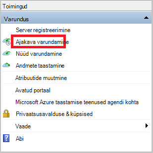

2. Jätke **Ajakava varukoopia viisardi** **muutused varukoopia üksused või kellaaegade** märgituks ja klõpsake nuppu **edasi**.

    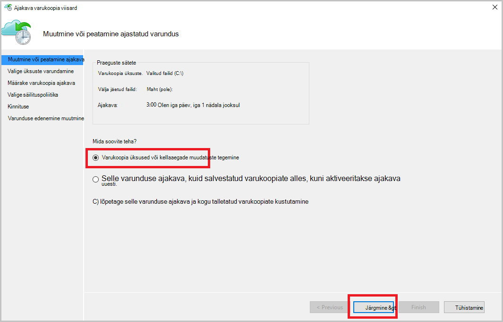

3. Kui soovite lisada või muuta üksuste **Varundamine üksuste valige** kuval nuppu **Lisa üksusi**.

    Samuti saate sellelt lehelt viisardi **Välistamist sätted** . Kui soovite välistada failide või failitüüpide lugeda kord lisamise [välistamist sätted](#exclusion-settings).

4. Valige failid ja kaustad, mida soovite varundada, ja klõpsake nuppu **Okay**.

    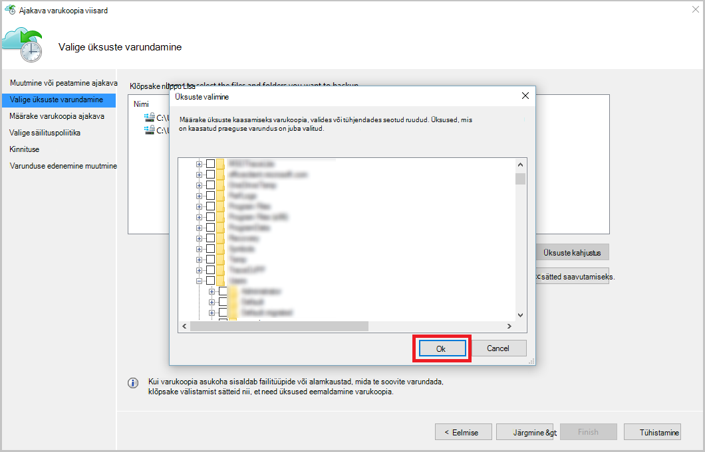

5. Määrake **varukoopia ajakava** ja klõpsake nuppu **edasi**.

    Saate ajastada (kuni 3 korda päevas) päevas või nädala varukoopiad.

    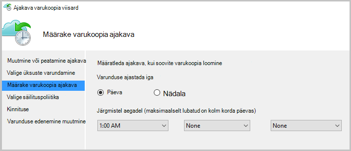

    >[AZURE.NOTE] Varunduse ajakava täpsustades selgitatakse üksikasjalikult selles [artiklis](backup-azure-backup-cloud-as-tape.md).

6. Valige **Säilituspoliitika** varukoopia nimi ja klõpsake nuppu **edasi**.

    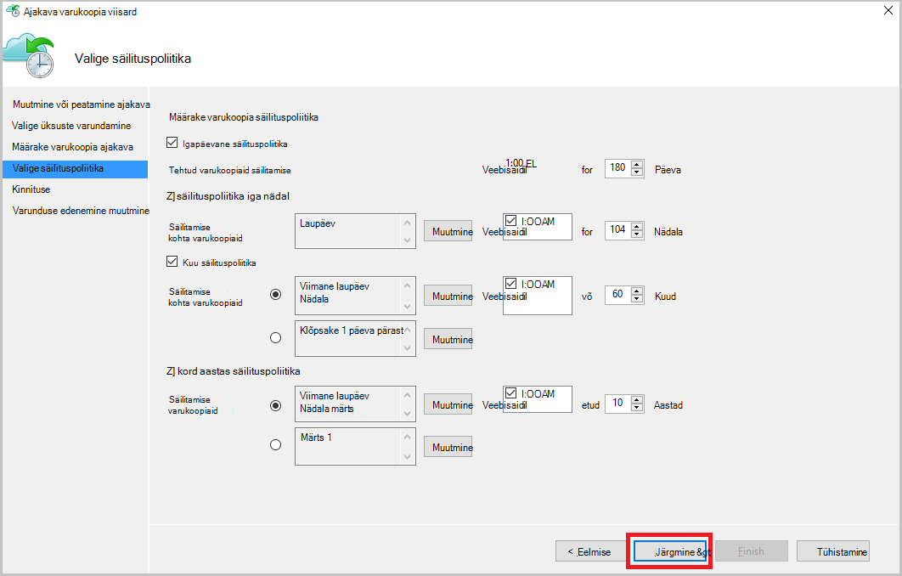

7. Kuval **kinnituse** teave üle ja klõpsake nuppu **valmis**.

8. Kui viisard lõpule **varunduse ajakava**loomine, klõpsake nuppu **Sule**.

    Pärast muutmine kaitse, saate kinnitada varukoopiate käivitavad õigesti ja **klõpsake vahekaarti** , mis kinnitab, muudatused kajastuvad varukoopia tööde haldamine.

### Luba võrgus ahendamine  
Azure'i varundus agent pakub Throttling menüü, kus saate reguleerida võrgu läbilaskevõime kasutamise ajal andmeedastus. Selle kontrolli võib olla kasulik, kui teil on vaja, varundada andmete ajal töötada, kuid ei taha häirida muid Interneti-liikluse varundamist. Pidurdamise andmete edastamine kehtib varundamine ja taastamine tegevusi.  

Pidurdamise lubamiseks tehke järgmist.

1. **Varundus agent**nuppu **Muuda atribuute**.

2. Märkige ruut **Luba Interneti läbilaskevõime kasutuse varukoopia toimingute pidurdamise** .

    

3. Kui olete lubanud pidurdamise, määrake lubatud läbilaskevõime varukoopia andmete edastamiseks **töötundide** ja **mitte - töötundide**ajal.

    Läbilaskevõime väärtused algavad 512 KB sekundis (KB/s) ja minna kuni 1023 megabaiti (MB) sekundis. Saate määrata algus ja valmis **töö**tundi ja millised nädalapäevad, käsitletakse töö päeva. Töötundide-peetakse väljaspool määratud töötundide ajal.

4. Klõpsake nuppu **OK**.

## Välistamist sätted

1. Avage **Microsoft Azure varukoopia agent** (leiate selle arvuti otsides *Microsoft Azure varukoopia*).

    

2. Klõpsake Microsoft Azure varukoopia agent **Ajakava varukoopia**.

    

3. Jätke ajakava varukoopia viisardi **muutused varukoopia üksused või kellaaegade** märgituks ja klõpsake nuppu **edasi**.

    

4. Klõpsake nuppu **välistamised sätted**.

    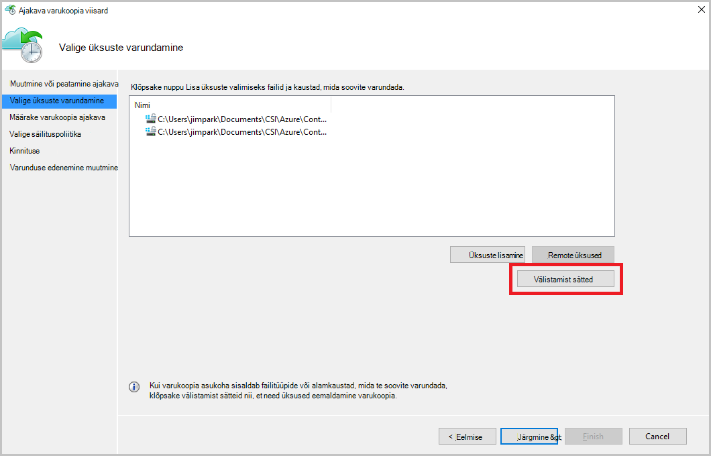

5. Klõpsake **Lisa välistamist**.

    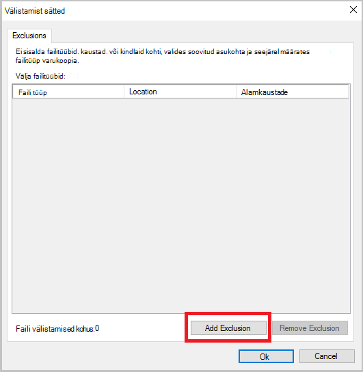

6. Valige asukoht ja seejärel klõpsake nuppu **OK**.

    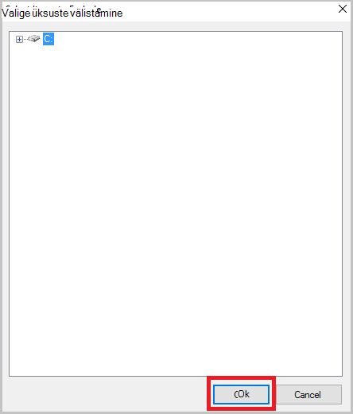

7. Lisage faili laiend väljal **Faili tüüp** .

    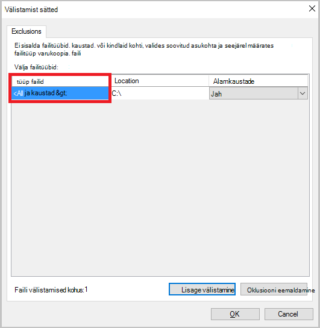

    Laiendi MP3 lisamine

    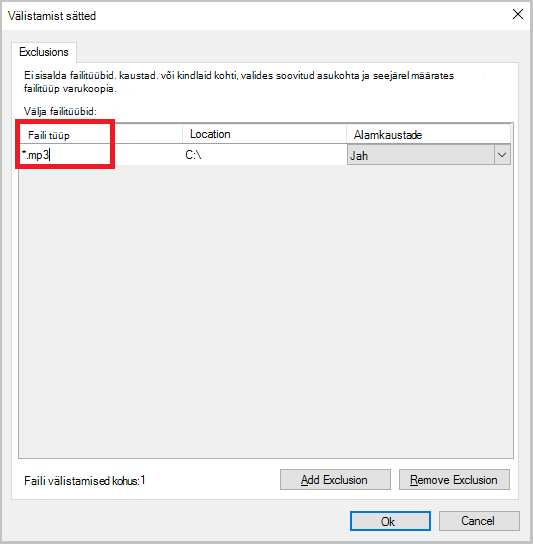

    Lisada mõne muu laiend, klõpsake nuppu **Lisa välistamist** ja sisestage teise failitüübi laiendit (lisades .jpeg laiend).

    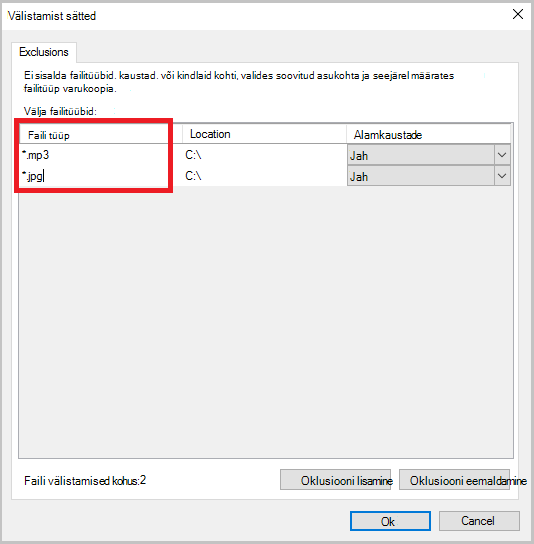

8. Kui olete lisanud kõik laiendid, klõpsake nuppu **OK**.

9. Jätkake viisardiga ajakava varundamise, klõpsates **lehel Confirmation**kuni **järgmise** ja seejärel klõpsake nuppu **valmis**.

    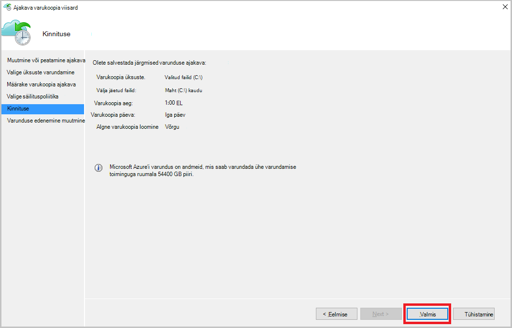

## Järgmised sammud
- [Azure'i Windows Serveri või Windowsi kliendi taastamine](backup-azure-restore-windows-server.md)
- Azure'i varundamise kohta leiate lisateavet teemast [Azure varundus ülevaade](backup-introduction-to-azure-backup.md)
- Külastage [Azure varukoopia Foorum](http://go.microsoft.com/fwlink/p/?LinkId=290933)
