<properties
    pageTitle="Azure'i taastamine teenuste võlvid ja serverite haldamine | Microsoft Azure'i"
    description="Selle õpetuse abil saate teada, kuidas hallata Azure taastamise teenused võlvid ning serverites."
    services="backup"
    documentationCenter=""
    authors="markgalioto"
    manager="cfreeman"
    editor="tysonn"/>

<tags
    ms.service="backup"
    ms.workload="storage-backup-recovery"
    ms.tgt_pltfrm="na"
    ms.devlang="na"
    ms.topic="article"
    ms.date="10/19/2016"
    ms.author="jimpark; markgal"/>


# <a name="monitor-and-manage-azure-recovery-services-vaults-and-servers-for-windows-machines"></a>Jälgimine ja haldamine Azure taastamise teenused võlvid ja serverite Windowsi masinad

> [AZURE.SELECTOR]
- [Ressursihaldur](backup-azure-manage-windows-server.md)
- [Klassikaline](backup-azure-manage-windows-server-classic.md)

Selles artiklis leiate ülevaate varukoopia juhtimine saadaolevatele Azure portaali ja Microsoft Azure varukoopia agendi kaudu.

[AZURE.INCLUDE [learn-about-deployment-models](../../includes/learn-about-deployment-models-rm-include.md)]klassikaline juurutamise mudel.

## <a name="management-portal-tasks"></a>Portaali haldamisega seotud toiminguid

### <a name="access-your-recovery-services-vaults"></a>Juurdepääs teie taastamise teenused võlvid

1. Logige sisse [Azure portaali](https://portal.azure.com/) Azure tellimuse abil.

2. Jaoturi menüü, klõpsake nuppu **Sirvi** ja tippige ressursid loendis **Taastamise teenused**. Kui alustate tippimist, loendit filtreeritakse sisendit põhjal. Klõpsake **taastamise teenused võlvid**.

    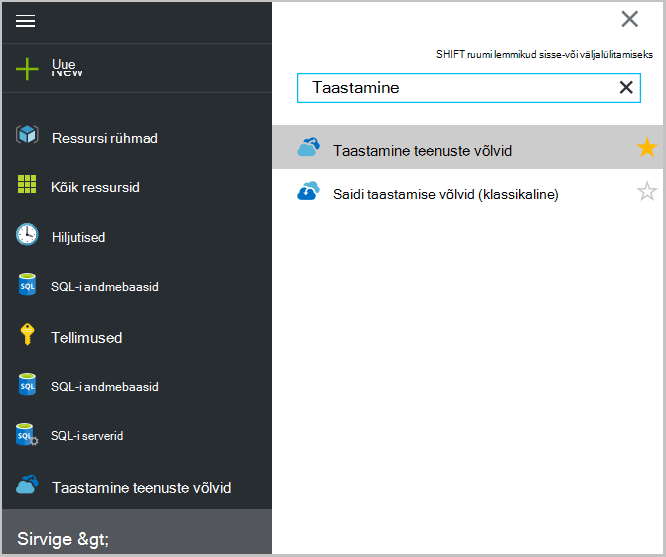 <br/>

2. Valige Vault kuvamiseks avada taastamise teenused vault armatuurlaua tera loendist soovitud nimi.

    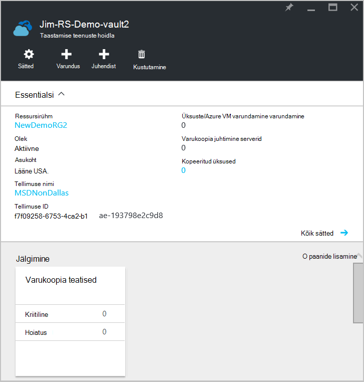 <br/>

## <a name="monitor-jobs-and-alerts"></a>Töö jälgimine ja teatised
Saate jälgida töö ja teatiste taastamise teenused vault armatuurlaud, kus kuvatakse:

- Varukoopia teatiste üksikasjad
- Failide ja kaustade, samuti kaitstud pilveteenuses Azure'i virtuaalmasinates
- Azure tarbitud saadaoleva salvestus
- Detailse oleku vaatamine

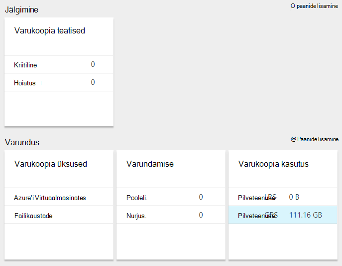

Teavet iga need paanid klõpsates avatakse seotud blade, kus saate hallata seotud toimingud.

Armatuurlaua ülaosas:

- Sätted võimaldab saadaval varundamise tööülesanded.
- Varundus - aitab uusi faile ja kaustu (või Azure VMs) taastamise teenused vault varundada.
- Kustutamine – kui taastamise teenuste hoidla enam ei kasutata, võite selle kustutada ruumi vabastamiseks. Kustuta on lubatud ainult pärast kõigi kaitstud serverid on kustutatud soovitud hoidlast.

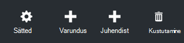
## <a name="alerts-for-backups-using-azure-backup-agent"></a>Teatiste abil Azure varukoopia agent varufailide:
| Hoiatustase  | Saadetud teatiste |
| ------------- | ------------- |
| Kriitiline | Varukoopia rikkumine, taastamine  |
| Hoiatus  | Varundamine on lõpule hoiatused (kui see on vähem kui 100 faile pole varundada tõttu hoida andmebaasifailide probleemide ja rohkem kui üks miljon failid on edukalt varundatud)  |
| Teatised  | Ükski  |
## <a name="manage-backup-alerts"></a>Varundus teatiste haldamine
Klõpsake paani **Varundamise teatiste** **Varundamise teatiste** tera avamiseks ja teatiste haldamine.

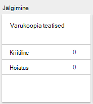

Varundus teatiste paani kuvatakse arvu.

- kriitiline teatiste lahendamata viimase 24 tunni jooksul
- Hoiatus teatiste lahendamata viimase 24 tunni jooksul

Iga neid linke klõpsates suunab teid **Varundamise teatiste** abaluuga filtreeritud vaate järgmisi teatisi (kriitiline või Hoiatus).

Varundus teatiste keelest, saate:

- Valige lisatav teatiste vajalik teave.

    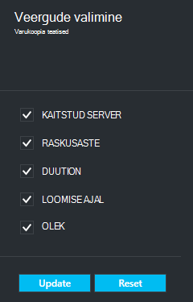

- Teatiste filtreerivad raskusaste, oleku ja algus ja lõpp.

    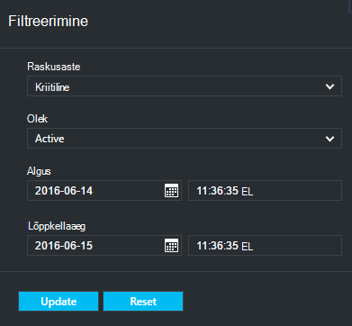

- Konfigureerida teatiste raskusaste, sageduse ja adressaadid, samuti teatiste sisse või välja lülitada.

    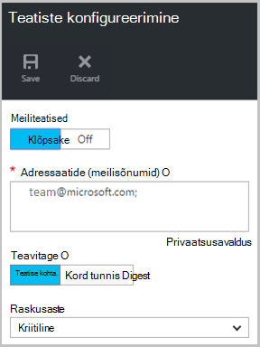

Kui **Kohta teatiste** on valitud **Teata** sagedus esineb pole rühmitamise või e-kirju vähenemine. Iga teatisega tulemuseks 1 teatis. See on vaikimisi ja eraldusvõime meilisõnum saadetakse ka kohe.

Kui on valitud **Kord tunnis Digest** **Teata** sagedus ühe meilisõnumi saatmise räägib neile on olemas, viimase tunni lahendamata uue teatised kasutaja. Eraldusvõime meilisõnumi saatmise tunni lõpus.

Teatiste saab saata raskusaste tasemete puhul järgmist.

- kriitiline
- Hoiatus
- teave

Saate desaktiveerige teatise töö üksikasjad tera nupuga **inaktiveerida** . Kui klõpsate inaktiveerida, saate sisestada eraldusvõime märkmed.

Soovite kuvada osana teatise **Valige veerud** nuppu veergude valimine

>[AZURE.NOTE] Keelest **sätete** haldamine varukoopia teatised, valides **jälgimine ja aruanded > teatiste ja sündmused > varukoopia teatiste** ja seejärel käsku **Filtreeri** või **Konfigureerida teatiste**.

## <a name="manage-backup-items"></a>Üksuste varundamine haldamine
Kohapealse varukoopiate haldamine on nüüd saadaval haldusportaal. Armatuurlaua jaotises varundamise paani **Varukoopia üksused** kuvatakse kaitstud vault varukoopia üksuste arvu.

Klõpsake paani üksuste varundamine **- Failikaustade** .

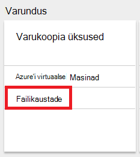

Varukoopia üksuste tera avaneb filtri seadmine faili kausta, kus näete iga üksuse loetletud teatud varukoopia.

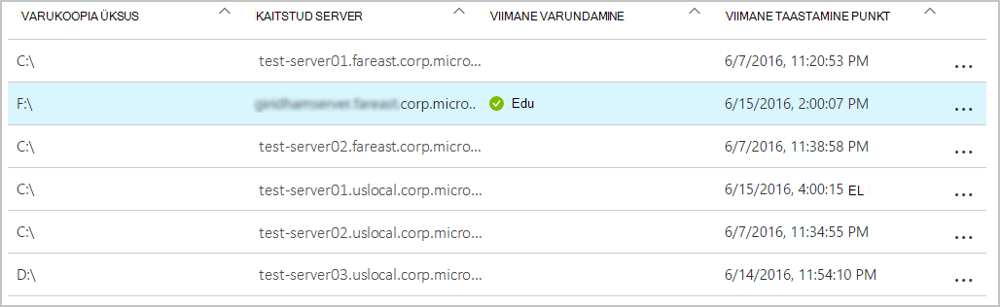

Kui valite loendist varukoopia kindla üksuse, näete selle üksuse olulisi üksikasju.

>[AZURE.NOTE] Keelest **sätted** saate hallata faile ja kaustu, valides **kaitstud üksused > varundus üksuste** ning seejärel valides **Failikaustade** rippmenüüst.

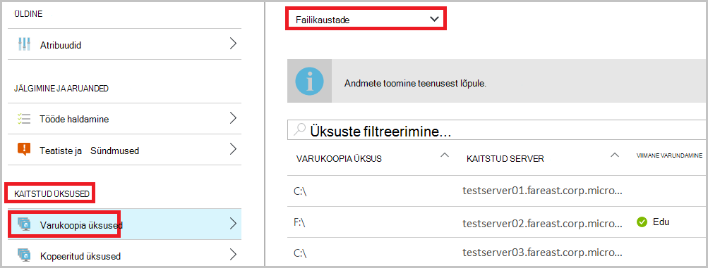

## <a name="manage-backup-jobs"></a>Hallata varundamine
Varundus töö nii kohapealse (kui kohapealses serveris varundada Azure) ja Azure varukoopiaid on nähtavad armatuurlaual.

Armatuurlaua varundamise jaotise kuvatakse paani varundamise töö töökohtade arv:

- pooleli.
- Viimased 24 tundi nurjus.

Hallata oma varukoopia, klõpsake paani **Varundamise** , mis avab varundamise tera.

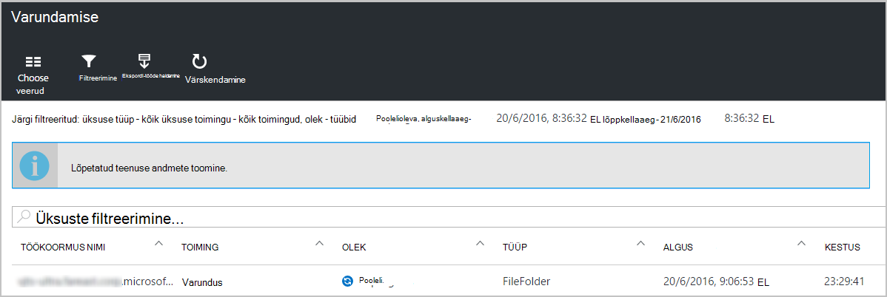

Saate teavet, mis on saadaval varundamise töö tera lehe ülaosas nuppu **Vali veerud** muuta.

Valige failide ja kaustade ja Azure virtuaalse masina varundamise vahel nuppu **Filter** abil.

Kui te ei näe varundatud faile ja kaustu, klõpsake lehe ülaosas nuppu **Filter** , ja valige **failide ja kaustade** menüüst üksuse tüüp.

>[AZURE.NOTE] Keelest **sätete** haldamine varundamise, valides **jälgimine ja aruanded > töö > varundamise** ja valige rippmenüüst soovitud **- Failikaustade** .

## <a name="monitor-backup-usage"></a>Jälgida varundamise kasutamine
Armatuurlaua varundamise jaotise Kuva paani varundamise kasutus tarbitud Azure talletamist. Salvestusruumi kasutuse kohta on esitatud.
- Pilveteenuse LRS salvestusruumi kasutuse seostatud vault
- Pilveteenuse GRS salvestusruumi kasutuse seostatud vault

## <a name="production-servers"></a>Tootmisserverid
Teie tootmisserverid haldamiseks valige **sätted**. Klõpsake jaotises Halda **varundamise taristu > tootmisserverid**.

Kõigi saadaolevate serverite loendid tootmisserverid tera. Klõpsake loendis serveris serveri andmete avamiseks.

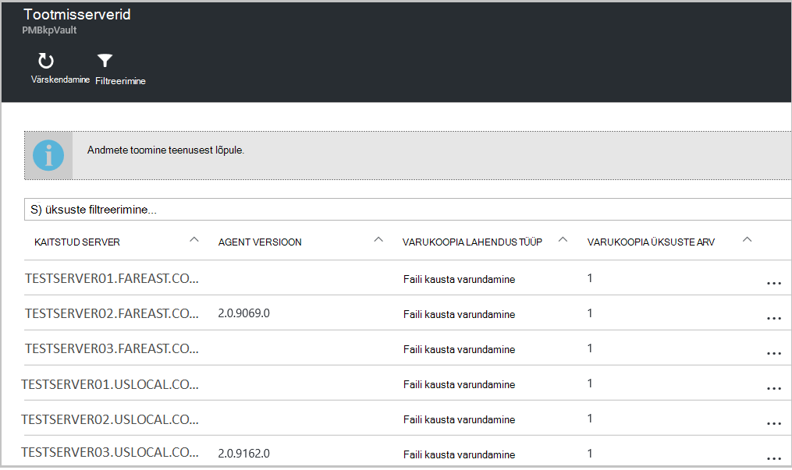

## <a name="microsoft-azure-backup-agent-tasks"></a>Microsoft Azure varukoopia agent tööülesanded

## <a name="open-the-backup-agent"></a>Avage varukoopia agent

Avage **Microsoft Azure varukoopia agent** (saate otsida, kui otsite *Microsoft Azure varukoopia*arvuti).

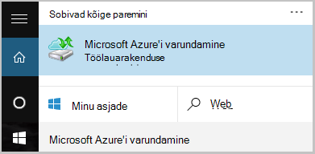

**Toimingud** saadaval paremas servas varukoopia agent konsooli tehke halduse järgmisi toiminguid:

- Server registreerimine
- Ajakava varundamine
- Varundamine kohe
- Atribuutide muutmine

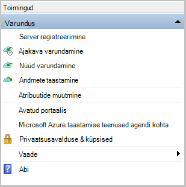

>[AZURE.NOTE] **Andmete taastamine**, lugege teemat [taastada faile Windows server või Windows klientarvutis](backup-azure-restore-windows-server.md).

## <a name="modify-an-existing-backup"></a>Olemasoleva varukoopia muutmine

1. Klõpsake Microsoft Azure varukoopia agent **Ajakava varukoopia**.

    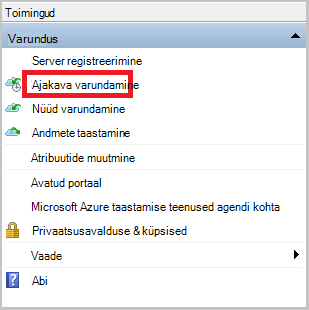

2. Jätke **Ajakava varukoopia viisardi** **muutused varukoopia üksused või kellaaegade** märgituks ja klõpsake nuppu **edasi**.

    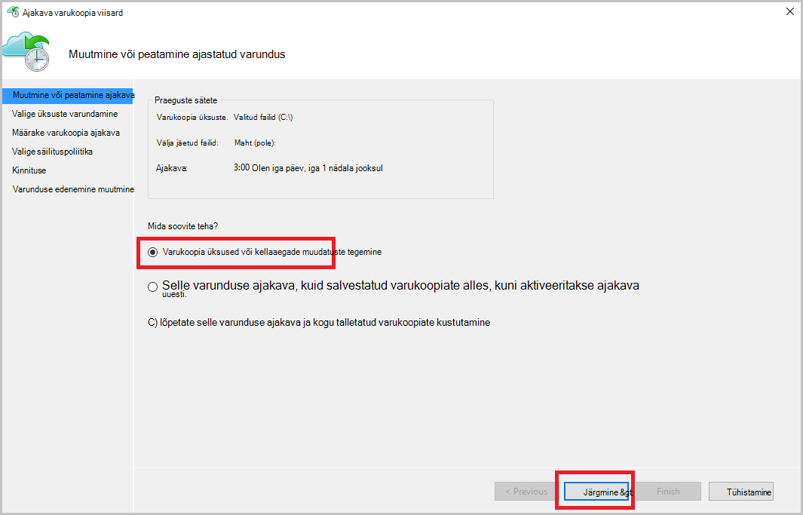

3. Kui soovite lisada või muuta üksuste **Varundamine üksuste valige** kuval nuppu **Lisa üksusi**.

    Samuti saate sellelt lehelt viisardi **Välistamist sätted** . Kui soovite välistada failide või failitüüpide lugeda kord lisamise [välistamist sätted](#exclusion-settings).

4. Valige failid ja kaustad, mida soovite varundada, ja klõpsake nuppu **Okay**.

    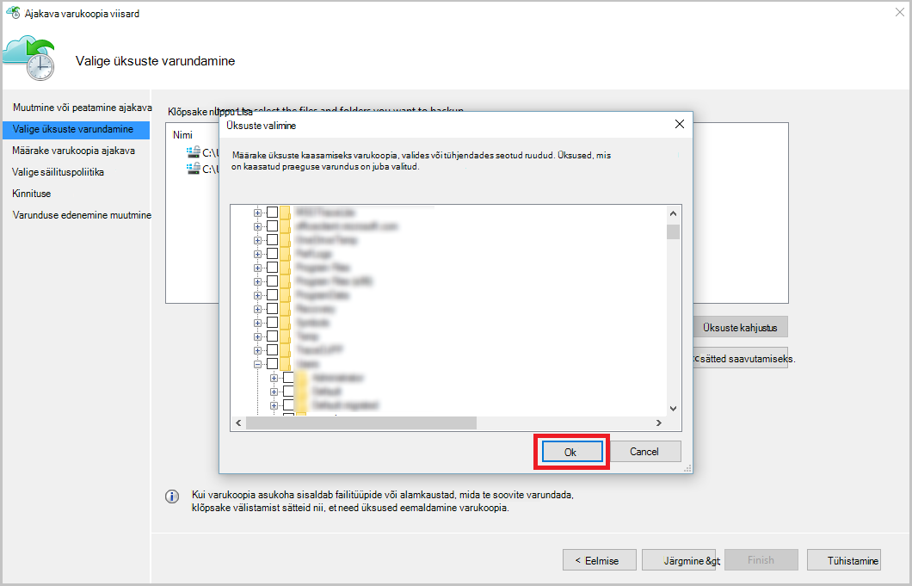

5. Määrake **varukoopia ajakava** ja klõpsake nuppu **edasi**.

    Saate ajastada (kuni 3 korda päevas) päevas või nädala varukoopiad.

    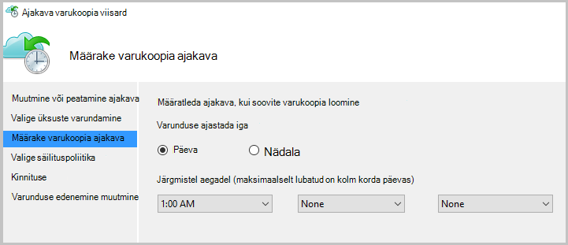

    >[AZURE.NOTE] Varunduse ajakava täpsustades selgitatakse üksikasjalikult selles [artiklis](backup-azure-backup-cloud-as-tape.md).

6. Valige **Säilituspoliitika** varukoopia nimi ja klõpsake nuppu **edasi**.

    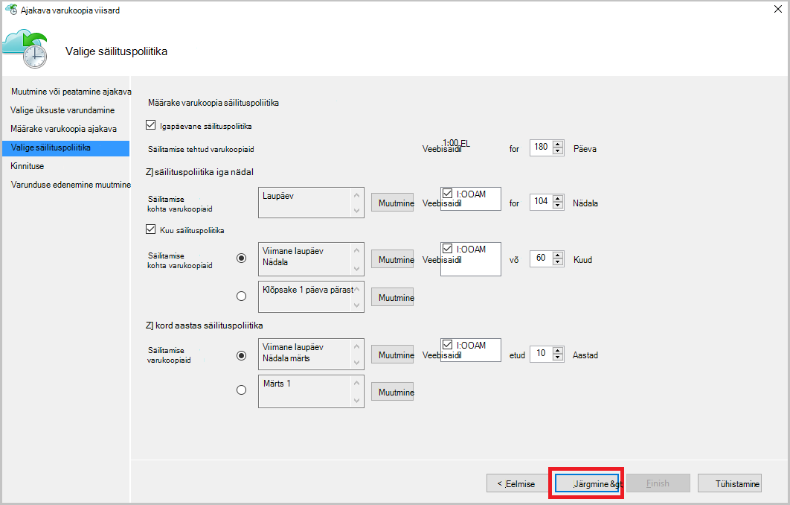

7. Kuval **kinnituse** teave üle ja klõpsake nuppu **valmis**.

8. Kui viisard lõpule **varunduse ajakava**loomine, klõpsake nuppu **Sule**.

    Pärast muutmine kaitse, saate kinnitada varukoopiate käivitavad õigesti ja **klõpsake vahekaarti** , mis kinnitab, muudatused kajastuvad varukoopia tööde haldamine.

## <a name="enable-network-throttling"></a>Luba võrgus ahendamine  
Azure'i varundus agent pakub Throttling vahekaarti, mis võimaldab teil määrata, kuidas võrgu läbilaskevõime kasutatakse andmeedastuse ajal. Selle kontrolli võib olla kasulik, kui teil on vaja, varundada andmete ajal töötada, kuid ei taha häirida muid Interneti-liikluse varundamist. Pidurdamise andmete edastamine kehtib varundamine ja taastamine tegevusi.  

Pidurdamise lubamiseks tehke järgmist.

1. **Varundus agent**nuppu **Muuda atribuute**.

2. Klõpsake **menüü pidurdamise valige **luba Interneti läbilaskevõime kasutuse pidurdamise määramine varukoopia toimingute **.

    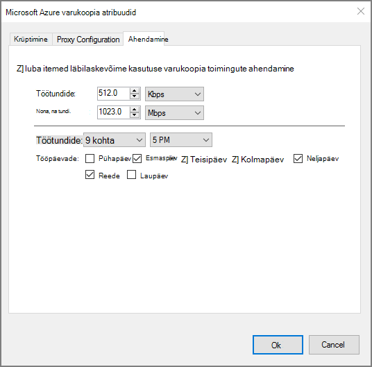

    Kui olete lubanud pidurdamise, määrake lubatud läbilaskevõime varukoopia andmete edastamiseks **töötundide** ja **mitte - töötundide**ajal.

    Läbilaskevõime väärtused algavad 512 KB sekundis (KB/s) ja minna kuni 1023 megabaiti (MB) sekundis. Saate määrata algus ja valmis **töö**tundi ning millised nädalapäevad, käsitletakse töö päeva. Töötundide-peetakse väljaspool määratud töötundide ajal.

3. Klõpsake nuppu **OK**.

## <a name="manage-exclusion-settings"></a>Välistamist sätete haldamine

1. Avage **Microsoft Azure varukoopia agent** (leiate selle arvuti otsides *Microsoft Azure varukoopia*).

    

2. Klõpsake Microsoft Azure varukoopia agent **Ajakava varukoopia**.

    

3. Jätke ajakava varukoopia viisardi **muutused varukoopia üksused või kellaaegade** märgituks ja klõpsake nuppu **edasi**.

    

4. Klõpsake nuppu **välistamised sätted**.

    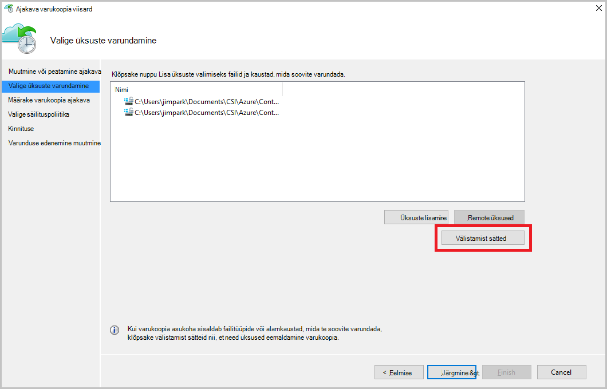

5. Klõpsake **Lisa välistamist**.

    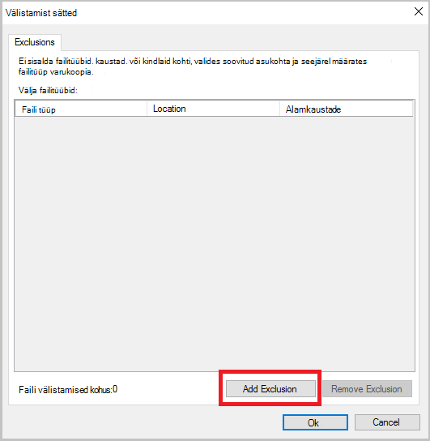

6. Valige asukoht ja seejärel klõpsake nuppu **OK**.

    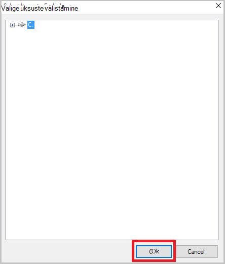

7. Lisage faililaiendit väljal **Faili tüüp** .

    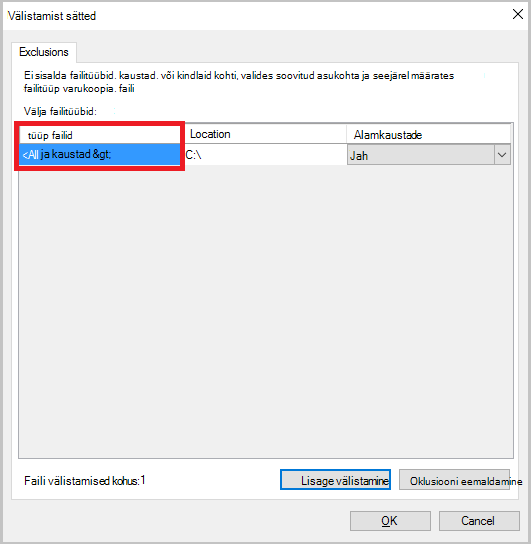

    MP3 laiendi lisamine

    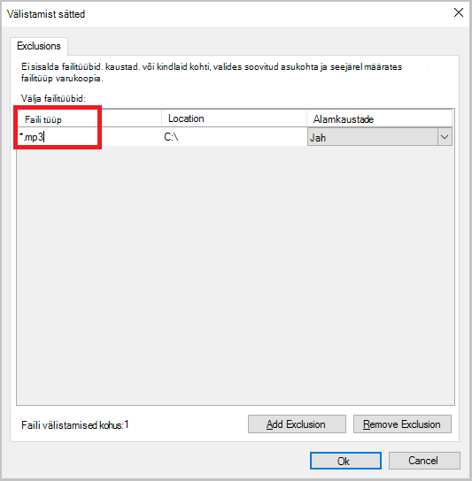

    Lisada mõne muu laiend, klõpsake nuppu **Lisa välistamist** ja sisestage teise failitüübi laiendit (lisades .jpeg laiend).

    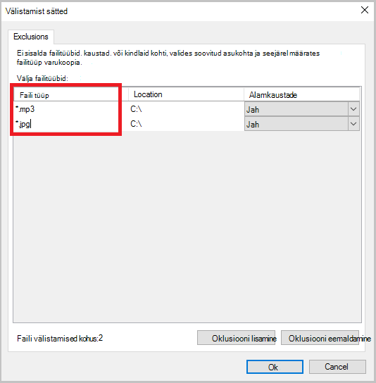

8. Kui olete lisanud kõik laiendid, klõpsake nuppu **OK**.

9. Jätkake viisardiga ajakava varundamise, klõpsates **lehel Confirmation**kuni **järgmise** ja seejärel klõpsake nuppu **valmis**.

    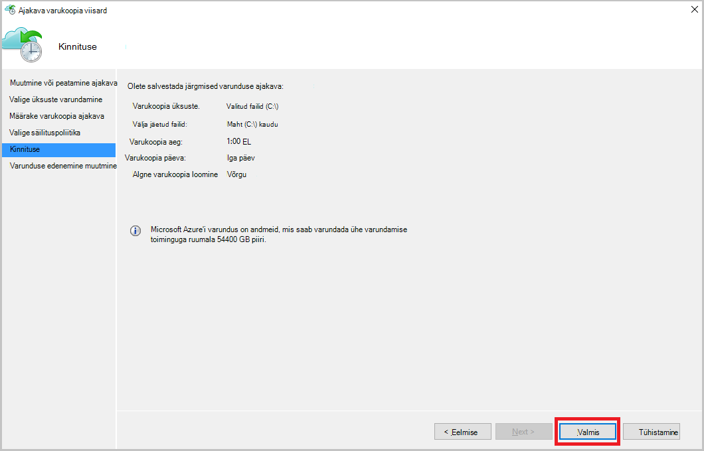

## <a name="frequently-asked-questions"></a>Korduma kippuvad küsimused
**KV1. Detailse oleku näitab lõpetatuks Azure varukoopia agent, miks ei see hankida kajastub kohe portaali?**

A1. Seal kuni 15 minutit vahel detailse oleku Delay kajastub Azure varukoopia agent ja Azure portaali.

**Q.2 Varundustöö nurjub, kui kaua võtab teatise tõsta?**

A.2 teatise tõstetakse sees 20 minutit Azure varukoopia tõrke.

**KVARTAL3. Kas juhul, kui e-posti ei saadeta kui teatised on konfigureeritud?**

A3. Allpool on juhul, kui teatist ei saadeta teatis müra vähendamiseks:

   - Kui teatised on konfigureeritud tunni ja teatise on kasvanud ja lahendatud tunni jooksul
   - Töö on tühistatud.
   - Teine Varundustöö nurjus, kuna algse Varundustöö on pooleli.

## <a name="troubleshooting-monitoring-issues"></a>Jälgimisega seotud probleemide tõrkeotsing

**Probleem:** Töö ja/või Azure varukoopia agendi teatised ei kuvata portaalis.

**Tõrkeotsingu samme:** Protsessi ```OBRecoveryServicesManagementAgent```, Azure varukoopia teenus saadab töö ja teatise andmed. Aeg-ajalt seda toimingut saavad kinni või sulgemine.

1. Veenduge, et protsessi ei tööta, avage **Tegumihaldur** ja märkige ruut, kui selle ```OBRecoveryServicesManagementAgent``` protsess töötab.

2. Eeldades, et protsessi ei tööta, avage **Juhtpaneel** ja Sirvige teenuste loend. Käivitamisel või taaskäivitage **Microsoft Azure taastamise teenuste haldus Agent**.

    Lisateavet sirvige veebisaidil logid.<br/>
`<AzureBackup_agent_install_folder>\Microsoft Azure Recovery Services Agent\Temp\GatewayProvider*`. Näiteks:<br/> `C:\Program Files\Microsoft Azure Recovery Services Agent\Temp\GatewayProvider0.errlog`.

## <a name="next-steps"></a>Järgmised sammud
- [Azure'i Windows Serveri või Windowsi kliendi taastamine](backup-azure-restore-windows-server.md)
- Azure'i varundamise kohta leiate lisateavet teemast [Azure varundus ülevaade](backup-introduction-to-azure-backup.md)
- Külastage [Azure varukoopia Foorum](http://go.microsoft.com/fwlink/p/?LinkId=290933)
