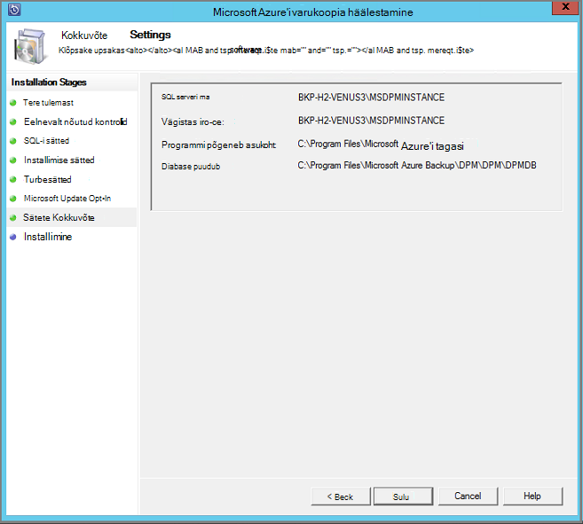

<properties
  pageTitle="Varundage töökoormus Azure varukoopia Serveri kasutamine keskkonna ettevalmistamise | Microsoft Azure'i"
  description="Veenduge, et teie keskkonnas õigesti valmis varundamine töökoormus Azure varukoopia Serveri kasutamine"
  services="backup"
  documentationCenter=""
  authors="pvrk"
  manager="shivamg"
  editor=""
  keywords="Azure varukoopia server; varukoopiate hoidla"/>

<tags
  ms.service="backup"
  ms.workload="storage-backup-recovery"
  ms.tgt_pltfrm="na"
  ms.devlang="na"
  ms.topic="article"
  ms.date="08/22/2016"
  ms.author="jimpark;trinadhk;pullabhk; markgal"/>

# <a name="preparing-to-back-up-workloads-using-azure-backup-server"></a>Ettevalmistamine varundamiseks töökoormus Azure varukoopia Serveri kasutamine

> [AZURE.SELECTOR]
- [Azure varukoopia Server](backup-azure-microsoft-azure-backup.md)
- [SCDPM](backup-azure-dpm-introduction.md)
- [Azure varukoopia Server (klassikaline)](backup-azure-microsoft-azure-backup-classic.md)
- [SCDPM (klassikaline)](backup-azure-dpm-introduction-classic.md)


See artikkel kehtib varundada töökoormus Azure varukoopia Serveri kasutamine keskkonna ettevalmistamise kohta. Azure'i varundus serveriga, saate rakenduse töökoormus nagu Hyper-V VMs, Microsoft SQL Server, SharePoint Server, Microsoft Exchange ja Windowsi klientide ühelt konsoolilt kaitsta.

>[AZURE.WARNING] Azure varukoopia Serveri pärib töökoormus varundamise funktsionaalsus andmete kaitse Manager (DPM). Siit leiate viitu DPM dokumentatsioonist mõni järgmised võimalused. Samas Server Azure'i varundus kaitse lindile või System Center integreerida.

## <a name="1-windows-server-machine"></a>1. Windows Serveri


Esimene samm saada Azure varukoopia serverisse ja töötab on Windows Server kohapeal.

| Asukoht | Miinimumnõuded | Täiendavad juhised |
| -------- | -------------------- | ----------------------- |
| Azure'i | Azure'i IaaS virtuaalse masina<br><br>A2 Standard: 2 tuuma 3,5 GB RAM-i | Saate alustada lihtne Galerii Windows Server 2012 R2 andmekeskuse. [Azure'i varundus Server (DPM) abil kaitsmine IaaS töökoormus](https://technet.microsoft.com/library/jj852163.aspx) on palju nüansse. Veenduge, et te lugege artiklit täielikult enne juurutamist masina. |
| Kohapealse | Hyper-V VM,<br> Vmware'i VM,<br> või füüsilise host<br><br>2 ja -vormid 4GB RAM-i | Saate deduplicate DPM talletamist Windows Server korduste eemaldamise abil. Lisateavet selle kohta, kuidas [DPM ja korduste eemaldamise](https://technet.microsoft.com/library/dn891438.aspx) töötavad koos Hyper-V VMs juurutamisel. |

> [AZURE.NOTE] Soovitatav on Windows Server 2012 R2 andmekeskuse koos arvutisse olema installitud Server Azure'i varundus. Eeltingimused palju automaatselt kaetud Windowsi operatsioonisüsteemi uusim versioon.

Kui plaanite see server liita mingil hetkel domeeni, on soovitatav domeeni liitumise tegevuse teha enne Azure varukoopia Serveri install. Mõne olemasoleva Server Azure'i varundus arvutisse teisaldamine uue domeeni pärast juurutamise *ei*toetata.

## <a name="2-backup-vault"></a>2 varukoopiate hoidla


Kas Azure varukoopia andmeid saata või kohalikult alles jätta, tarkvara peab olema ühendatud Azure. Rohkem teatud, Azure varukoopia Serveri arvuti peab olema registreeritud varukoopiate hoidla.

Varukoopiate hoidla loomiseks tehke järgmist.

1. Logige sisse [haldusportaali](http://manage.windowsazure.com/).

2. Klõpsake nuppu **Uus** > **Data Services** > **taastamise teenused** > **varukoopiate hoidla** > **kiire loomine**. Kui teil on oma ettevõtte kontoga seotud mitu tellimust, valige õige tellimuse varukoopiate hoidla seostada.

3. Sisestage väljale **nimi**sõbralik nimi, mis tähistavad vault. See peab olema kordumatu iga tellimuse jaoks.

4. **Piirkond**, valige piirkonnas vault jaoks. Tavaliselt valitakse vault on piirkond, andmete suveräänsust või võrgu latentsuse piiranguid põhjal.

    

5. Klõpsake nuppu **Loo Vault**. Võib kuluda aega varukoopiate hoidla luua. Jälgida Olekuteatised, portaali allosas.

    

6. Sõnumi kinnitab, et vault on loodud see kirjas taastamise teenused lehel aktiivsed.
    

  > [AZURE.IMPORTANT] Veenduge, et suvand hoidmise koondamise valitakse kohe pärast vault on loodud. Lisateavet [geograafilise liigne](../storage/storage-redundancy.md#geo-redundant-storage) ja selle [Ülevaade](../storage/storage-redundancy.md) [kohalikult liigsete](../storage/storage-redundancy.md#locally-redundant-storage) suvandid.


## <a name="3-software-package"></a>3. tarkvarapaketi


### <a name="downloading-the-software-package"></a>Tarkvarapaketi allalaadimine

Sarnaselt võlvkelder mandaat, saate alla laadida Microsoft Azure varukoopia rakenduse töökoormus varukoopiate hoidla **Kiirülevaate avalehele** .

1. Klõpsake **rakenduse töökoormus (ketta kettale Cloud)**. See viib teid allalaadimiskeskuse lehele, kust tarkvarapaketi alla laadida.

    

2. Klõpsake nuppu **Laadi alla**.

    

3. Valige kõik failid ja klõpsake nuppu **edasi**. Kõik failid, mis on pärit Microsoft Azure'i varundus allalaadimise lehelt alla laadida ja kõik failid paigutada samas kaustas.


    Kuna alla suurust kõik failid on koos > 3G, on 10Mbps laadida võib kuluda kuni 60 minutit lõpuleviimiseks allalaadimise link.


### <a name="extracting-the-software-package"></a>Tarkvarapaketi ekstraktimiseks

Kui olete kõik failid alla laadinud, klõpsake **MicrosoftAzureBackupInstaller.exe**. See käivitab **Microsoft Azure'i varundus häälestusviisardi** ekstrakti häälestamise failid teie määratud asukohta. Jätkake viisardiga ja eraldamine alustamiseks nuppu **ekstrakti** .

> [AZURE.WARNING] Installifailid eraldamiseks on vaja vähemalt 4GB vaba ruumi.


Kui soovitud eraldamine protsess lõpule jõudnud, märkige ruut käivitada värskelt ekstraktitud *setup.exe* Microsoft Azure'i varundus serveri installimise alustamiseks ja klõpsake nuppu **valmis** .

### <a name="installing-the-software-package"></a>Tarkvarapaketi installimine

1. Klõpsake **Microsoft Azure varukoopia** häälestamise viisardi käivitamiseks.

    

2. Tervituskuval klõpsake nuppu **edasi** . See viib teid *Eelnevalt nõutud kontrollib* jaotis. Klõpsake Kuva, **märkige** nuppu, et kindlaks teha, kui Server Azure'i varundus riist- ja eeltingimused on täidetud. Kui kõik eeltingimused on täidetud edukalt, kuvatakse teade, mis näitab, et arvuti vastab. Klõpsake nuppu **edasi** .

    

3. Microsoft Azure'i varundus Server nõuab SQL Server Standard ja Azure varukoopia Serveri installimise tootepakendil on kogumisse seotud vastav SQL Server binaarkujul, mis on vaja. Uue Azure varukoopia Serveri installiga käivitamisel peaks valige suvand **Installi uus eksemplar ja SQL Server selle setup** ja nuppu **kontrollida ja installida** . Kui eeltingimused on installitud, klõpsake nuppu **edasi**.

    

    Tõrke ilmnemisel arvuti soovitusega teha ja klõpsake **Märkige ruut uuesti**.

    > [AZURE.NOTE] Azure'i varundus Server ei tööta remote SQL serveri eksemplar. Azure'i varundus Server kasutab eksemplari peab olema kohalik.

4. Sisestage installi Microsoft Azure varukoopia dokumendihaldusserveri ühisfailide jaoks asukoht ja klõpsake nuppu **edasi**.

    

    Tühjalt asukoht on Azure varundada. Veenduge, et nullist asukoht on vähemalt 5% andmete kavandatud pilve varundada. Ketas kaitse, tuleb eraldi ketast konfigureeritud, kui installimine on lõpule jõudnud. Salvestusruumi kaustu kohta leiate lisateavet teemast [konfigureerimine salvestusruumi kaustu ja kettaruumi](https://technet.microsoft.com/library/hh758075.aspx).

5. Keeruka parooli ette piiratud kohaliku Kasutajakontod ja klõpsake nuppu **edasi**.

    

6. Valige, kas soovite kasutada *Microsoft Update* värskenduste kontroll ning klõpsake nuppu **edasi**.

    >[AZURE.NOTE] Soovitame teil on Windows Update Microsoft Update'i, mis pakub turbe- ja olulisi värskendusi Windows ja muude toodete nagu Microsoft Azure'i varundus serveri ümber suunata.

    

7. Kontrollige *Kokkuvõte sätted,* ja klõpsake nuppu **Installi**.

    

8. Installimise juhtub etapist. Esimesel etapil serverisse installitud Microsoft Azure taastamise Services Agent. Viisard otsib ka Interneti-ühendus. Kui Interneti-ühendus on saadaval pidage installimisega, kui ei, peate sisestama puhverserveri üksikasju, et Interneti-ühenduse.

    Järgmiseks on konfigureerida Microsoft Azure taastamise Services Agent. Osana konfiguratsiooni, on teil esitada olete hoidla mandaat varukoopiate hoidla seadme registreerimiseks. Samuti annab parooli abil krüptimine/dekrüptimine saadetud Azure ja oma ettevõttes andmeid. Saate automaatselt luua parooli või sisestada oma minimaalne 16-kohaline parool. Jätkake viisardiga, kuni agent on konfigureeritud.

    

9. Kui registreerimine server Microsoft Azure'i varundus on edukalt lõpule jõudnud, üldine häälestusviisardi tulu installimine ja konfigureerimine SQL serveri ja Azure varukoopia Serveri komponendid. Kui SQL Serveri komponendi installimine on lõpule jõudnud, Azure varukoopia Serveri komponendid on installitud.

    


Kui installimise toiming on lõpule viidud, toote töölaua ikoonid on loodud ka. Lihtsalt topeltklõpsake ikooni toote käivitamiseks.

### <a name="add-backup-storage"></a>Varukoopia salvestusruumi lisamine

Esimese varukoopia hoitakse salvestusruumi Azure varukoopia Serveri masina külge. Ketast lisamise kohta leiate lisateavet teemast [konfigureerimine salvestusruumi kaustu ja kettaruumi](https://technet.microsoft.com/library/hh758075.aspx).

> [AZURE.NOTE] Peate isegi juhul, kui kavatsete andmeid saata Azure varukoopia salvestusruumi lisamiseks. Praeguse arhitektuur Azure varukoopia Server, Azure'i varukoopiate hoidla hoiab andmeid *teine* koopia ajal kohalik talletusruum on esimene (ja kohustuslik) varukoopia.  

## <a name="4-network-connectivity"></a>4. võrguühenduse


Azure'i varundus serveri jaoks on vaja ühenduvust Azure varukoopia teenusega toote edukalt töötada. Saate kontrollida, kas seade on Ühenduvus Azure, kasutage funktsiooni ```Get-DPMCloudConnection``` Azure varundus serveri PowerShelli konsooli abil. Kui selle abil väljund on TRUE, siis, kui ühendus on olemas, on veel seal pole Ühenduvus.

Samal ajal Azure tellimuse peab olema terve olekus. Tellimuse oleku leida ja hallata, logige sisse [tellimuse portaalis]( https://account.windowsazure.com/Subscriptions).

Kui teate Azure Ühenduvus ja Azure'i tellimus, saate välja selgitada osa varundus ja taaste võimalusi mõju järgmises tabelis.

| Ühenduvus olek | Azure'i tellimus | Azure'i varundus| Varundus kettale | Azure'i taastamine | Kettalt taastamine |
| -------- | ------- | --------------------- | ------------------- | --------------------------- | ----------------------- |
| Ühendatud | Aktiivne | Lubatud | Lubatud | Lubatud | Lubatud |
| Ühendatud | Aegunud | Peatatud | Peatatud | Lubatud | Lubatud |
| Ühendatud | Eemaldatud | Peatatud | Peatatud | Peatatud ja Azure taastamise punkte kustutatud | Peatatud |
| Kadunud Ühenduvus > 15 päeva | Aktiivne | Peatatud | Peatatud | Lubatud | Lubatud |
| Kadunud Ühenduvus > 15 päeva | Aegunud | Peatatud | Peatatud | Lubatud | Lubatud |
| Kadunud Ühenduvus > 15 päeva | Eemaldatud | Peatatud | Peatatud |  Peatatud ja Azure taastamise punkte kustutatud | Peatatud |

### <a name="recovering-from-loss-of-connectivity"></a>Katkemise taastamine
Kui teil on tulemüür või puhverserver, mis takistab juurdepääsu Azure, peate nimekiri järgmised domeeni aadressid, tulemüüri ja puhverserveri profiili:

- www.msftncsi.com
- \*. Saidi Microsoft.com
- \*. WindowsAzure.com
- \*. microsoftonline.com
- \*. windows.net

Kui Ühenduvus Azure on taastatud Azure varukoopia serveri arvutisse, on Azure tellimuse riigi määratud toimingud, mida saab teha. Ülaltoodud tabelis on lubatud, kui seade on "ühendatud" üksikasjad.

### <a name="handling-subscription-states"></a>Tellimuse olekus töötlemise

On võimalik teha Azure tellimuse *aegunud* või *Deprovisioned* olekust *aktiivse* oleku. Kuid see mõjutab mõne toote käitumise olek on mitte *aktiivne*:

- Tellimuse *Deprovisioned* lähevad kaotsi funktsioonid perioodi, et see on eemaldatud. Sisse lülitada, *aktiivne*, toote funktsionaalsust varundus ja taaste on taastatud. Varundatud andmete kohalikule kettale saate laadida ka juhul, kui see on piisavalt suur säilitusperiood abil. Varundatud andmete Azure aga pöördumatult pärast tellimuse sisestab *Deprovisioned* olekus.
- *Aegunud* tellimuse ainult lähevad kaotsi funktsioonid enne, kui see on *aktiivne* uuesti. Mis tahes perioodi, et tellimus on *aegunud* ajastatud varukoopiaid ei tööta.


## <a name="troubleshooting"></a>Tõrkeotsing

Kui server Microsoft Azure'i varukoopia nurjub tõrgetega ajal seadistamise (või varundamine või taastamine), vaadake selle [tõrke koodide dokumendi](https://support.microsoft.com/kb/3041338) lisateabe saamiseks.
Samuti leiate [Azure'i varundus seotud KKK](backup-azure-backup-faq.md)


## <a name="next-steps"></a>Järgmised sammud

Microsoft TechNeti saidil saate üksikasjalikku teavet [DPM keskkonna ettevalmistamise](https://technet.microsoft.com/library/hh758176.aspx) kohta. See sisaldab ka teavet toetatud konfiguratsioone, millel saab Server Azure'i varundus juurutada ja kasutada.

Saate artiklitest mõistmiseks töökoormus kaitse Microsoft Azure varukoopia Serveri kasutamine süvitsi.

- [SQL serveri varukoopia](backup-azure-backup-sql.md)
- [SharePoint serveri varukoopia](backup-azure-backup-sharepoint.md)
- [Alternatiivse serveri varukoopia](backup-azure-alternate-dpm-server.md)
