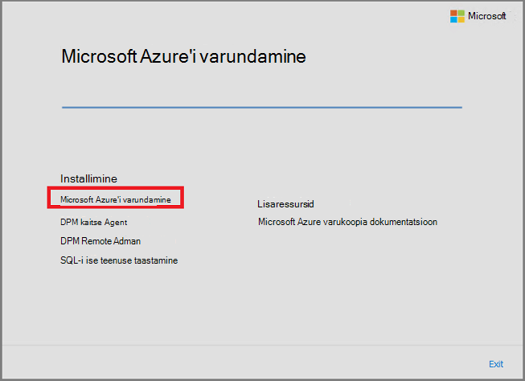
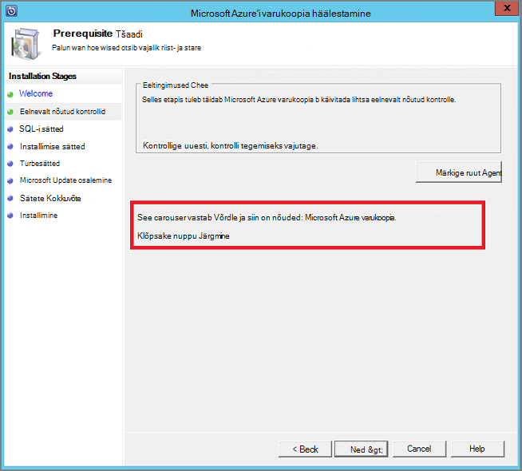
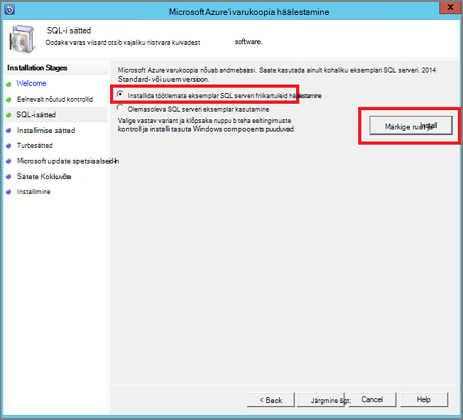
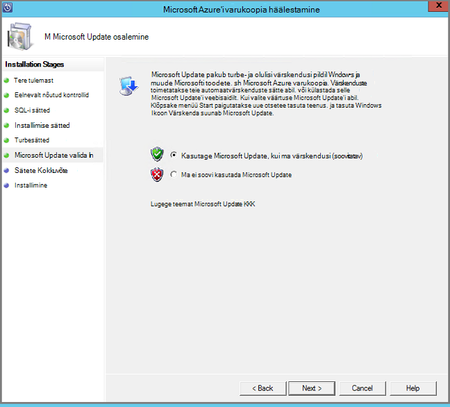
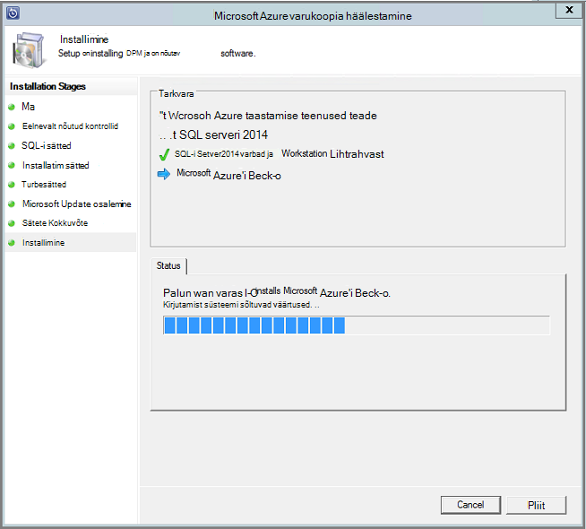

<properties
  pageTitle="Varundage töökoormus Azure varukoopia Serveri kasutamine keskkonna ettevalmistamise | Microsoft Azure'i"
  description="Azure'i varundus serveri abil kaitsta või varundamine töökoormus keskkonna ettevalmistamiseks."
  services="backup"
  documentationCenter=""
  authors="PVRK"
  manager="shivamg"
  editor=""
  keywords="Azure varukoopia server; kaitse töökoormus; töökoormus varundamine"/>

<tags
  ms.service="backup"
  ms.workload="storage-backup-recovery"
  ms.tgt_pltfrm="na"
  ms.devlang="na"
  ms.topic="article"
  ms.date="09/27/2016"
  ms.author="jimpark;trinadhk;pullabhk;markgal"/>

# <a name="preparing-to-back-up-workloads-using-azure-backup-server"></a>Ettevalmistamine varundamiseks töökoormus Azure varukoopia Serveri kasutamine

> [AZURE.SELECTOR]
- [Azure varukoopia Server](backup-azure-microsoft-azure-backup.md)
- [SCDPM](backup-azure-dpm-introduction.md)
- [Azure varukoopia Server (klassikaline)](backup-azure-microsoft-azure-backup-classic.md)
- [SCDPM (klassikaline)](backup-azure-dpm-introduction-classic.md)

Selles artiklis selgitatakse, kuidas varundada töökoormus Azure varukoopia Serveri kasutamine keskkonna ettevalmistamiseks. Azure'i varundus serveriga, saate rakenduse töökoormus nagu Hyper-V VMs, Microsoft SQL Server, SharePoint Server, Microsoft Exchange ja Windowsi klientide ühelt konsoolilt kaitsta. Saate kaitsta ka teavet server (IaaS) töökoormus, nt Azure VMs.

> [AZURE.NOTE] Azure'i on kaks juurutamise mudelite loomise ja ressursside töötamine: [ressursihaldur ja klassikaline](../resource-manager-deployment-model.md). Sellest artiklist leiate teavet ja juhiseid taastamine VMs juurutatud ressursihaldur mudeli abil.

Azure varukoopia Serveri pärib palju töökoormus varukoopia funktsionaalsuse kaudu andmete kaitse Manager (DPM). See artikkel sisaldab linke DPM dokumentatsiooni selgitada mõningaid ühiskasutusega funktsioonid. Kuigi Server Azure'i varundus jagab palju samu funktsioone, mis DPM. Azure'i varundus Server ei lindile varundada ega ei integreerida System Center.

## <a name="1-choose-an-installation-platform"></a>1. valida mõne installi platvorm

Esimene samm saada Azure varukoopia serverisse ja töötab on häälestamine Windows Server. Azure'i või kohapealse võib olla teie server.

### <a name="using-a-server-in-azure"></a>Azure'i serveri kasutamine

Valides server Azure'i varundus Server töötab, on soovitatav Galerii Windows Server 2012 R2 andmekeskuse alustada. Artikkel, [luua oma esimese Windowsi virtuaalse masina Azure portaali](..\virtual-machines\virtual-machines-windows-hero-tutorial.md), pakub õpetus jaoks kasutamise alustamine soovitatav virtuaalse masina Azure, isegi siis, kui te pole varem Azure'i enne. Soovitatav miinimumnõuded serveri virtuaalse masina (VM) peaks olema: A2 Standard 2 ja -vormid 3,5 GB RAM-i.

Kaitsmine töökoormus Azure varundus serveriga on palju nüansse. See artikkel [On Azure virtuaalse masina nimega DPM installida](https://technet.microsoft.com/library/jj852163.aspx), aitab selgitada need nüansid. Lugege artiklit täielikult enne juurutamist seade.

### <a name="using-an-on-premises-server"></a>Kohapealse serveri kasutamine

Kui te ei soovi käivitamiseks base server Azure'i, käivitada server Hyper-V VM, VMware VM või füüsilise host. Soovitatav serveri riistvara miinimumnõuded on 2 ja -vormid 4 GB RAM-i. Järgmises tabelis on loetletud toetatud operatsioonisüsteemid.

| Operatsioonisüsteem        | Platvorm           | SKU-GA  |
| :------------- |-------------| :-----|
|Windows Server 2012 R2 ja uusima rakendamise| 64-bitise| Standard andmekeskuses, Foundation|
|Windows Server 2012 ja uusima rakendamise|    64-bitise| Andmekeskuse Foundation, Standard|
|Windowsi salvestusruumi Server 2012 R2 ja uusima rakendamise  |64-bitise|    Standard töörühm|
|Windows salvestusruumi Server 2012 ja uusima rakendamise |64-bitise |Standard töörühm|


Saate deduplicate DPM talletamist Windows Server korduste eemaldamise abil. Lisateavet selle kohta, kuidas [DPM ja korduste eemaldamise](https://technet.microsoft.com/library/dn891438.aspx) töötavad koos Hyper-V VMs juurutamisel.

> [AZURE.NOTE]  Te ei saa installida Azure varundus Server töötab domeenikontrolleri arvutisse.

Liitute Azure varukoopia Serveri domeeniga. Kui plaanite serveri teisaldamine mõnda muusse domeeni, on soovitatav liituda enne installimist Azure varukoopia serveri uus domeen server. Mõne olemasoleva Server Azure'i varundus arvutisse teisaldamine uue domeeni pärast juurutamise *ei*toetata.

## <a name="2-recovery-services-vault"></a>2 taastamise teenuste hoidla

Kas Azure varukoopia andmeid saata või kohalikult alles jätta, tarkvara peab olema ühendatud Azure. Rohkem teatud, Azure varukoopia Serveri arvuti peab taastamise teenuste hoidla registreerida.

Taastamise teenuste hoidla loomiseks tehke järgmist.

1. [Azure'i portaali](https://portal.azure.com/)sisse logida.

2. Jaoturi menüü, klõpsake nuppu **Sirvi** ja tippige ressursid loendis **Taastamise teenused**. Kui alustate tippimist, loendit filtreeritakse sisendit põhjal. Klõpsake **taastamise teenused vault**.

     <br/>

    Kuvatakse loend taastamise teenused võlvid.

3. Menüü **võlvid taastamise teenused** nuppu **Lisa**.

    

    Taastamise teenused vault tera avaneb, palub teil **nime** **tellimuse** **ressursirühm**ning **asukoht**.

    

4. Sisestage **nimi**sõbralik nimi, mis tähistavad vault. Nimi peab olema kordumatu Azure tellimuse jaoks. Tippige nimi, mis sisaldab 2 – 50 märki. See peab algama tähega ja võib sisaldada ainult tähti, numbreid ja sidekriipse.

5. Klõpsake **tellimuse** saadaolevate tellimuste loendi kuvamiseks. Kui te pole kindel, milline tellimus kasutada, kasutage vaikeväärtust (või soovitatud) tellimus. Seal on mitu valikud ainult juhul, kui ettevõtte konto on seotud mitu Azure tellimust.

6. **Ressursirühm** on saadaval loendi kuvamiseks valige või klõpsake nuppu **Uus** , et luua uue ressursirühma. Ressursi rühmade kohta, leiate [Azure'i ressursihaldur ülevaade](../azure-resource-manager/resource-group-overview.md)

7. Klõpsake **asukoha** valimiseks piirkonnas vault jaoks.

8. Klõpsake nuppu **Loo**. Võib kuluda aega taastamise teenused vault luua. Jälgida Olekuteatised portaalis paremas ülanurgas alal.
Kui teie vault on loodud, avatakse portaalis.

### <a name="set-storage-replication"></a>Seadmine salvestusruumi Dispersioonanalüüs

Salvestusruumi dispersioonanalüüs suvand võimaldab valida geograafilise liigne salvestusruumi ja kohalikult liigsete salvestusruumi. Vaikimisi on teie vault geograafilise liigne salvestusruumi. Jätke suvand, kui see peamine varukoopia geograafilise liigne salvestusruumi väärtuseks. Kui soovite odavamad, mis pole päris nii püsival, valige kohalik liigsete salvestusruumi. Lisateavet [geograafilise liigne](../storage/storage-redundancy.md#geo-redundant-storage) ja [kohalikult liigsete](../storage/storage-redundancy.md#locally-redundant-storage) talletamise võimalused [Azure Storage dispersioonanalüüs ülevaade](../storage/storage-redundancy.md).

Salvestusruumi dispersioonanalüüs säte redigeerimiseks tehke järgmist.

1. Valige oma vault vault armatuurlaua ja tera sätted avamiseks. Kui tera **sätted** ei avane, klõpsake vault armatuurlaua **Kõik sätted** .

2. Enne **sätted** , klõpsake nuppu **Varundus taristu** > **Varukoopia konfiguratsiooni** **Varukoopia konfiguratsiooni** tera avamiseks. Enne **Varukoopia konfiguratsiooni** , valige oma vault salvestusruumi dispersioonanalüüs suvandi.

    

    Pärast valides oma vault salvestusruumi suvandi, olete valmis vault VM seostada. Kõigepealt seost, tuleks leida ja Azure'i virtuaalmasinates registreerida.

## <a name="3-software-package"></a>3. tarkvarapaketi

### <a name="downloading-the-software-package"></a>Tarkvarapaketi allalaadimine
1. [Azure'i portaali](https://portal.azure.com/)sisse logida.

2. Kui teil on juba taastamise teenused vault Ava, jätkake 3. Kui te ei saa taastamise teenused, võlvkelder avatud, kuid on Azure portaalis menüü keskuses nuppu **Sirvi**.

    - Tippige väljale ressursid loendis **Taastamise teenused**.
    - Kui alustate tippimist, loendit filtreeritakse sisendit põhjal. Kui näete **taastamise teenused võlvid**, klõpsake seda.

    

    Kuvatakse loend taastamise teenused võlvid.

    - Valige loendist taastamise teenused võlvid võlvkelder.

    Avab valitud vault armatuurlaud.

    

3. Vaikimisi avab blade sätted. Kui see on suletud, klõpsake nuppu **sätted** , et avada tera sätted.

    

4. **Varundamise** **Alustamine** alustamine viisardi avamiseks klõpsake nuppu.

    

5. Alustamine avatavas, saab varundamise eesmärgid kuva Automaatne märgitud.
    

    Valige jaotises **varundamise eesmärgid** *kohapealse* jaoks, *kus töötab teie töökoormus*.

    

6. Valige töökoormus, mida soovite kaitsta, *mis töökoormus, mida soovite kaitsta* Azure varukoopia Serveri kasutamine ja klõpsake nuppu **OK**.

    > [AZURE.NOTE] Kui kavatsete kaitsmiseks, vaid faile ja kaustu, siis soovitame kasutada Azure varukoopia agent. Kui kavatsete kaitse rohkem kui lihtsalt failide ja kaustade töökoormus või tulevikus kavatsete kaitse vajadustele laiendada, valige kõik need töökoormus.

    See muudab alustamine viisardi töökoormus kaitsmine kohapealse Azure taristu ettevalmistamine.

    

7. Klõpsake **ettevalmistamine taristu** tera, mis avab, installige Azure'i varundus serveri ja allalaadimine hoidla mandaat linkide **alla laadida** . Kasutage hoidla mandaat taastamise teenuste hoidla Azure varukoopia Serveri registreerimise käigus. Lingid viivad teid allalaadimiskeskus, kust saate alla laadida tarkvarapaketi.

    

8. Valige kõik failid ja klõpsake nuppu **edasi**. Kõik failid, mis on pärit Microsoft Azure'i varundus allalaadimise lehelt alla laadida ja kõik failid paigutada samas kaustas.

    

    Kuna alla suurust kõik failid on koos > 3G, on 10Mbps laadida võib kuluda kuni 60 minutit lõpuleviimiseks allalaadimise link.


### <a name="extracting-the-software-package"></a>Tarkvarapaketi ekstraktimiseks

Kui olete kõik failid alla laadinud, klõpsake **MicrosoftAzureBackupInstaller.exe**. See käivitab **Microsoft Azure'i varundus häälestusviisardi** ekstrakti häälestamise failid teie määratud asukohta. Jätkake viisardiga ja eraldamine alustamiseks nuppu **ekstrakti** .

> [AZURE.WARNING] Installifailid eraldamiseks on vaja vähemalt 4GB vaba ruumi.


Kui soovitud eraldamine protsess lõpule jõudnud, märkige ruut käivitada värskelt ekstraktitud *setup.exe* Microsoft Azure'i varundus serveri installimise alustamiseks ja klõpsake nuppu **valmis** .

### <a name="installing-the-software-package"></a>Tarkvarapaketi installimine

1. Klõpsake **Microsoft Azure varukoopia** häälestamise viisardi käivitamiseks.

    

2. Tervituskuval klõpsake nuppu **edasi** . See viib teid *Eelnevalt nõutud kontrollib* jaotis. Klõpsake Kuva, **märkige** nuppu, et kindlaks teha, kui Server Azure'i varundus riist- ja eeltingimused on täidetud. Kui kõik eeltingimused on täidetud edukalt, kuvatakse teade, mis näitab, et arvuti vastab. Klõpsake nuppu **edasi** .

    

3. Microsoft Azure'i varundus Server nõuab SQL Server Standard ja Azure varukoopia Serveri installimise tootepakendil on kogumisse seotud vastav SQL Server binaarkujul, mis on vaja. Uue Azure varukoopia Serveri installiga käivitamisel peaks valige suvand **Installi uus eksemplar ja SQL Server selle setup** ja nuppu **kontrollida ja installida** . Kui eeltingimused on installitud, klõpsake nuppu **edasi**.

    

    Tõrke ilmnemisel arvuti soovitusega teha ja klõpsake **Märkige ruut uuesti**.

    > [AZURE.NOTE] Azure'i varundus Server ei tööta remote SQL serveri eksemplar. Azure'i varundus Server kasutab eksemplari peab olema kohalik.

4. Sisestage installi Microsoft Azure varukoopia dokumendihaldusserveri ühisfailide jaoks asukoht ja klõpsake nuppu **edasi**.

    

    Tühjalt asukoht on Azure varundada. Veenduge, et nullist asukoht on vähemalt 5% andmete kavandatud pilve varundada. Ketas kaitse, tuleb eraldi ketast konfigureeritud, kui installimine on lõpule jõudnud. Salvestusruumi kaustu kohta leiate lisateavet teemast [konfigureerimine salvestusruumi kaustu ja kettaruumi](https://technet.microsoft.com/library/hh758075.aspx).

5. Keeruka parooli ette piiratud kohaliku Kasutajakontod ja klõpsake nuppu **edasi**.

    

6. Valige, kas soovite kasutada *Microsoft Update* värskenduste kontroll ning klõpsake nuppu **edasi**.

    >[AZURE.NOTE] Soovitame teil on Windows Update Microsoft Update'i, mis pakub turbe- ja olulisi värskendusi Windows ja muude toodete nagu Microsoft Azure'i varundus serveri ümber suunata.

    

7. Kontrollige *Kokkuvõte sätted,* ja klõpsake nuppu **Installi**.

    

8. Installimise juhtub etapist. Esimesel etapil serverisse installitud Microsoft Azure taastamise Services Agent. Viisard otsib ka Interneti-ühendus. Kui Interneti-ühendus on saadaval pidage installimisega, kui ei, peate sisestama puhverserveri üksikasju, et Interneti-ühenduse.

    Järgmiseks on konfigureerida Microsoft Azure taastamise Services Agent. Osana konfiguratsiooni, on teil esitada oma hoidla mandaat taastamise teenuste hoidla seadme registreerimiseks. Samuti annab parooli abil krüptimine/dekrüptimine saadetud Azure ja oma ettevõttes andmeid. Saate automaatselt luua parooli või sisestada oma minimaalne 16-kohaline parool. Jätkake viisardiga, kuni agent on konfigureeritud.

    

9. Kui registreerimine server Microsoft Azure'i varundus on edukalt lõpule jõudnud, üldine häälestusviisardi tulu installimine ja konfigureerimine SQL serveri ja Azure varukoopia Serveri komponendid. Kui SQL Serveri komponendi installimine on lõpule jõudnud, Azure varukoopia Serveri komponendid on installitud.

    


Kui installimise toiming on lõpule viidud, toote töölaua ikoonid on loodud ka. Lihtsalt topeltklõpsake ikooni toote käivitamiseks.

### <a name="add-backup-storage"></a>Varukoopia salvestusruumi lisamine

Esimese varukoopia hoitakse salvestusruumi Azure varukoopia Serveri masina külge. Ketast lisamise kohta leiate lisateavet teemast [konfigureerimine salvestusruumi kaustu ja kettaruumi](https://technet.microsoft.com/library/hh758075.aspx).

> [AZURE.NOTE] Peate isegi juhul, kui kavatsete andmeid saata Azure varukoopia salvestusruumi lisamiseks. Praeguse arhitektuur Azure varukoopia Server, Azure'i varukoopiate hoidla hoiab andmeid *teine* koopia ajal kohalik talletusruum on esimene (ja kohustuslik) varukoopia.

## <a name="4-network-connectivity"></a>4. võrguühenduse

Azure'i varundus serveri jaoks on vaja ühenduvust Azure varukoopia teenusega toote edukalt töötada. Saate kontrollida, kas seade on Azure ühenduvust, kasutage funktsiooni ```Get-DPMCloudConnection``` konsooli Azure varukoopia Serveri PowerShelli cmdlet-käsu. Kui cmdlet väljund on TRUE, siis, kui ühendus on olemas, on veel seal pole Ühenduvus.

Samal ajal Azure tellimuse peab olema terve olekus. Tellimuse oleku leida ja hallata, logige sisse [tellimuse portaalis]( https://account.windowsazure.com/Subscriptions).

Kui teate Azure Ühenduvus ja Azure'i tellimus, saate välja selgitada osa varundus ja taaste võimalusi mõju järgmises tabelis.

| Ühenduvus olek | Azure'i tellimus | Azure'i varundus| Varundus kettale | Azure'i taastamine | Kettalt taastamine |
| -------- | ------- | --------------------- | ------------------- | --------------------------- | ----------------------- |
| Ühendatud | Aktiivne | Lubatud | Lubatud | Lubatud | Lubatud |
| Ühendatud | Aegunud | Peatatud | Peatatud | Lubatud | Lubatud |
| Ühendatud | Eemaldatud | Peatatud | Peatatud | Peatatud ja Azure taastamise punkte kustutatud | Peatatud |
| Kadunud Ühenduvus > 15 päeva | Aktiivne | Peatatud | Peatatud | Lubatud | Lubatud |
| Kadunud Ühenduvus > 15 päeva | Aegunud | Peatatud | Peatatud | Lubatud | Lubatud |
| Kadunud Ühenduvus > 15 päeva | Eemaldatud | Peatatud | Peatatud |  Peatatud ja Azure taastamise punkte kustutatud | Peatatud |

### <a name="recovering-from-loss-of-connectivity"></a>Katkemise taastamine
Kui teil on tulemüür või puhverserver, mis takistab juurdepääsu Azure, peate nimekiri järgmised domeeni aadressid, tulemüüri ja puhverserveri profiili:

- www.msftncsi.com
- \*. Saidi Microsoft.com
- \*. WindowsAzure.com
- \*. microsoftonline.com
- \*. windows.net

Kui Ühenduvus Azure on taastatud Azure varukoopia serveri arvutisse, on Azure tellimuse riigi määratud toimingud, mida saab teha. Ülaltoodud tabelis on lubatud, kui seade on "ühendatud" üksikasjad.

### <a name="handling-subscription-states"></a>Tellimuse olekus töötlemise

On võimalik teha Azure tellimuse *aegunud* või *Deprovisioned* olekust *aktiivse* oleku. Kuid see mõjutab mõne toote käitumise olek on mitte *aktiivne*:

- Tellimuse *Deprovisioned* lähevad kaotsi funktsioonid perioodi, et see on eemaldatud. Sisse lülitada, *aktiivne*, toote funktsionaalsust varundus ja taaste on taastatud. Varundatud andmete kohalikule kettale saate laadida ka juhul, kui see on piisavalt suur säilitusperiood abil. Varundatud andmete Azure aga pöördumatult pärast tellimuse sisestab *Deprovisioned* olekus.
- *Aegunud* tellimuse ainult lähevad kaotsi funktsioonid enne, kui see on *aktiivne* uuesti. Mis tahes perioodi, et tellimus on *aegunud* ajastatud varukoopiaid ei tööta.


## <a name="troubleshooting"></a>Tõrkeotsing

Kui server Microsoft Azure'i varukoopia nurjub tõrgetega ajal seadistamise (või varundamine või taastamine), vaadake selle [tõrke koodide dokumendi](https://support.microsoft.com/kb/3041338) lisateabe saamiseks.
Samuti leiate [Azure'i varundus seotud KKK](backup-azure-backup-faq.md)


## <a name="next-steps"></a>Järgmised sammud

Microsoft TechNeti saidil saate üksikasjalikku teavet [DPM keskkonna ettevalmistamise](https://technet.microsoft.com/library/hh758176.aspx) kohta. See sisaldab ka teavet toetatud konfiguratsioone, millel saab Server Azure'i varundus juurutada ja kasutada.

Saate artiklitest mõistmiseks töökoormus kaitse Microsoft Azure varukoopia Serveri kasutamine süvitsi.

- [SQL serveri varukoopia](backup-azure-backup-sql.md)
- [SharePoint serveri varukoopia](backup-azure-backup-sharepoint.md)
- [Alternatiivse serveri varukoopia](backup-azure-alternate-dpm-server.md)
