<properties
   pageTitle="Kuvari ressursihaldur juurutatud virtuaalse masina varukoopiate | Microsoft Azure'i"
   description="Jälgida sündmuste ja teatiste ressursihaldur juurutatud virtuaalse masina varukoopiate põhjal. Teatiste põhineva meilisõnumi saatmine."
   services="backup"
   documentationCenter="dev-center-name"
   authors="markgalioto"
   manager="cfreeman"
   editor=""/>

<tags
ms.service="backup"
ms.workload="storage-backup-recovery"
ms.tgt_pltfrm="na"
ms.devlang="na"
ms.topic="article"
ms.date="08/25/2016"
ms.author="trinadhk; giridham;"/>

# <a name="monitor-alerts-for-azure-virtual-machine-backups"></a>Teatiste Azure virtuaalse masina varufailide jälgimine

Teatiste on vastust, et mõni sündmus lävi on täidetud või ületanud teenuse. Saate teada, kui probleemide algus võib olla äärmiselt oluline hoida kulud alla. Teatiste tavaliselt ei esine ajakava ja seega on kasulik teada nii kiiresti kui võimalik pärast teatiste tekkida. Näiteks kui varundus ja taaste töö nurjub, teatise ilmneb tõrge viie minuti jooksul. Vault armatuurlaud, kuvab paani varundamise teatiste kriitiline ja hoiatustase sündmused. Varundus Teatiste sätete, kuvatakse kõik sündmused. Kuid mida teha, kui teatise juhul, kui töötate eraldi probleem? Kui te ei tea, kui teate, mis juhtub, võib põhjus olla mõnevõrra ebamugavuste või see võib andmeid kahjustada. Veenduge, et õige inimesed on teadlikud teatise - ilmnemisel, konfigureerida teatiste e-posti teel saatmine teenuse. Meiliteatised häälestamise kohta leiate teemast [konfigureerimine teatised](backup-azure-monitor-vms.md#configure-notifications).

## <a name="how-do-i-find-information-about-the-alerts"></a>Kuidas leiavad teavet teatisi?

Saate vaadata teavet juhul, kui viskasin teatise, peate avama varundamise teatiste tera. On kaks võimalust avamiseks varundamise teatiste tera: kas varundamise teatiste paani vault armatuurlaua või teatiste ja sündmuste keelest.

Varundus teatiste paani avamine varundamise teatiste tera abil

- Klõpsake armatuurlaual vault **Varundamise teatiste** paani **kriitiline** või **hoiatus** vaadata selle raskusaste taseme funktsionaalseid sündmused.

    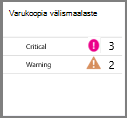


Teatiste ja sündmuste keelest varundamise teatiste tera avamiseks tehke järgmist.

1. Klõpsake armatuurlaual vault **Kõik sätted**. 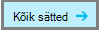

2. Enne **sätted** , klõpsake **teatiste ja sündmused**. 

3. **Teatiste ja sündmuste** enne nuppu **Varundus teatised**. 

    **Varundus teatiste** tera avatakse ja kuvatakse filtreeritud teatised.

    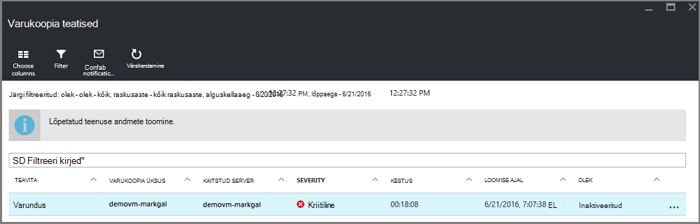

4. Konkreetses teates, sündmused, loendist kohta täpsema teabe kuvamiseks klõpsake selle **üksikasjad** tera avamiseks teatist.

    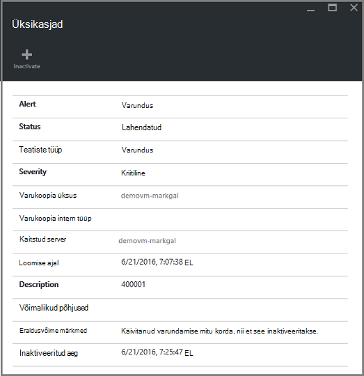

    Kohandada loendis kuvatakse atribuute, lugege teemat [Kuva täiendavad sündmuse atribuudid](backup-azure-monitor-vms.md#view-additional-event-attributes)

## <a name="configure-notifications"></a>Teatiste konfigureerimine

 Saate konfigureerida teenuse saatmine meiliteatised toimunud üle tunnis või kui konkreetset tüüpi sündmuste teatised.

Kui soovite kohta teatiste saamiseks meiliteatiste häälestamine

1. Klõpsake menüü varundamise teatiste **konfigureerimine teatised**

    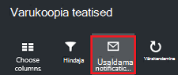

    Teatiste konfigureerimine tera avaneb.

    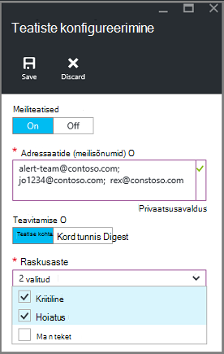

2. **Klõpsake**nuppu Konfigureeri teatised enne, meiliteatised.

    Adressaatide ja raskusaste dialoogid on täht nende kõrval, sest see teave on nõutav. Sisestage vähemalt üks meiliaadress ja valige vähemalt üks raskusaste.

3. Tippige dialoogiboksis **adressaatide (meilisõnumid)** kes teateid meiliaadressid. Kasutage vormingut: username@domainname.com. Eraldi mitme meiliaadressid semikooloniga (;).

4. Valige jaotises **Teavita** **Kohta teatise** saadetava teatise määratud teatise või **Kord tunnis Digest** saata Kokkuvõte tunnis.

5. Valige dialoogiboksis **raskusaste** käivitava meiliteatise tasemed.

6. Klõpsake nuppu **Salvesta**.
### <a name="what-alert-types-are-available-for-azure-iaas-vm-backup"></a>Teatiste tüübid on saadaval varundamise Azure IaaS VM?
| Hoiatustase  | Saadetud teatiste |
| ------------- | ------------- |
| Kriitiline | Varukoopia rikkumine, taastamine  |
| Hoiatus  | Ükski |
| Teatised  | Ükski  |

### <a name="are-there-situations-where-email-isnt-sent-even-if-notifications-are-configured"></a>Kas on veel saadaval olukordades, kus e-posti ei saadeta isegi juhul, kui teatised on konfigureeritud?

On olukordi, kus saadetakse teatis, isegi juhul, kui teatised on õigesti konfigureeritud. Järgmised olukordades meilisõnumite teatised ei saadeta teatis müra vältimiseks:

- Kui teatised on konfigureeritud kord tunnis seedimine ja teatise on kasvanud ja tunni jooksul lahendatud.
- Töö on tühistatud.
- Varundustöö käivitatakse ja seejärel nurjub ja muu Varundustöö on pooleli.
- Käivitab ajastatud Varundustöö VM ressursihaldur lubatud, kuid VM pole enam olemas.

## <a name="customize-your-view-of-events"></a>Sündmuste vaate kohandamine

**Auditilogide** säte on eelmääratletud kogum, filtrite ja veergudega funktsionaalseid sündmuse teabe kuvamine. Saate kohandada vaadet, et **sündmuste** tera avamisel see näitab teile soovitud teavet.

1. Liikuge sirvides [vault armatuurlaud](./backup-azure-manage-vms.md#open-a-recovery-services-vault-in-the-dashboard), ja klõpsake nuppu **Auditilogi** **sündmused** tera avamiseks.

    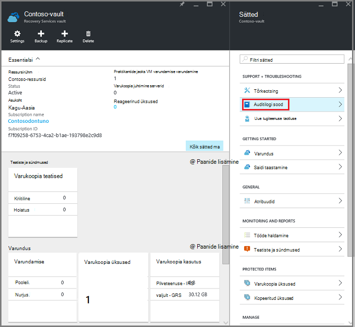

    **Sündmuste** tera avaneb funktsionaalseid sündmused, mis on filtreeritud ainult praegune vault.

    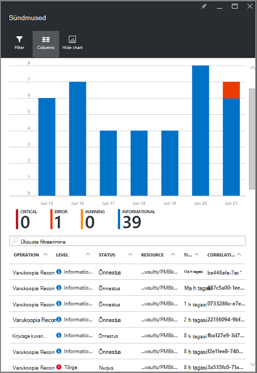

    Tera kuvatakse kriitiline, tõrge, hoiatus ja teavitavad sündmused toimunud viimase nädala jooksul. Aja jooksul on **Filter**seada vaikeväärtuse. **Sündmuste** tera näitab ka jälgimise sündmuste ilmnemise lintdiagrammi. Kui te ei soovi lintdiagrammil **sündmusi** , klõpsake menüü **peitmine diagrammi** diagrammi väljalülitamiseks. Sündmuste vaikevaates kuvatakse toiming, taset, olek, ressursside ja aja teave. Asetades täiendavad sündmuse atribuutide kohta leiate teavet teemast jaotise [laiendamine sündmuse teabe](backup-azure-monitor-vms.md#view-additional-event-attributes).

2. Sündmuse funktsionaalseid veerus **toiming** kohta lisateabe saamiseks klõpsake selle tera avamiseks funktsionaalseid sündmust. Tera sisaldab üksikasjalikku teavet sündmuste kohta. Sündmuste rühmitatud nende korrelatsiooni ID ja sündmusi, mis ajavahemiku toimunud loendit.

    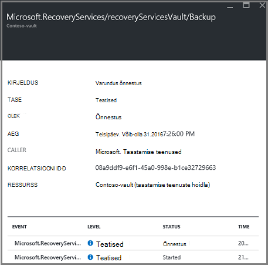

3. Saate vaadata üksikasjalikku teavet teatava sündmuse loendist sündmusi, klõpsake sündmuse **üksikasjad** blade selle avamiseks.

    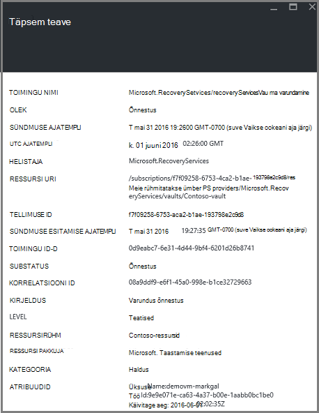

    Sündmuse taseme teave on nii üksikasjalik kui teave saab. Kui eelistate näha nii palju teavet iga sündmuse ja **sündmuste** tera nii palju üksikasju lisada, vt jaotist [laiendamine sündmuse teabe](backup-azure-monitor-vms.md#view-additional-event-attributes).


## <a name="customize-the-event-filter"></a>Sündmuse filter kohandamine
**Filtri** abil saate reguleerida või valida kindla blade kuvatava teabe. Sündmuse teabe filtreerimiseks:

1. Liikuge sirvides [vault armatuurlaud](./backup-azure-manage-vms.md#open-a-recovery-services-vault-in-the-dashboard), ja klõpsake nuppu **Auditilogi** **sündmused** tera avamiseks.

    

    **Sündmuste** tera avaneb funktsionaalseid sündmused, mis on filtreeritud ainult praegune vault.

    

2. Klõpsake menüü **sündmuste** **filtri** avamiseks selle tera.

    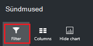

3. **Filtri** enne, saate reguleerida **, **aja**ja **helistaja** **filtrid. Muud filtrid pole saadaval, kuna need määratud taastamise teenused vault praegust teavet.

    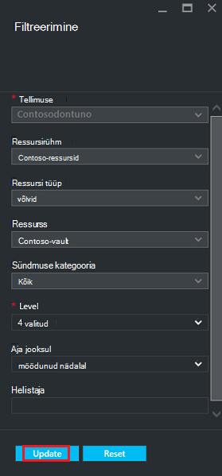

    Saate määrata sündmuse **tase** : kriitiline, tõrge, hoiatus või teatised. Saate valida suvalist kombinatsiooni sündmuse taset, kuid peab teil olema vähemalt üks tase valitud. Taseme sisse või välja lülitada. **Aja** filter võimaldab teil määrata aeg hõivamine sündmuste jaoks. Kui kasutate kohandatud ajavahemiku, saate määrata algus- ja lõpukellaajad.

4. Kui olete valmis päringu toimingute logid oma filtreerimine abil, klõpsake nuppu **Värskenda**. Tulemused kuvatakse **sündmuste** tera.

    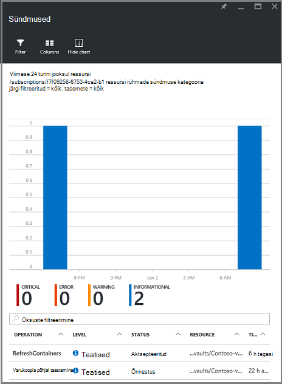


### <a name="view-additional-event-attributes"></a>Kuva täiendavad sündmuse atribuudid
**Veergude** nupu abil saate lubada täiendavaid sündmuse atribuute kuvada **sündmuste** enne loendis. Sündmuste loendi Vaikimisi kuvatakse teave toiming, taset, olek, ressursside ja kellaaeg. Täiendavate atribuutide lubamiseks tehke järgmist.

1. Enne **sündmusi** , nuppu **veerud**.

    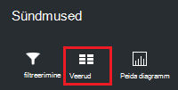

    **Valige veerud** tera avaneb.

    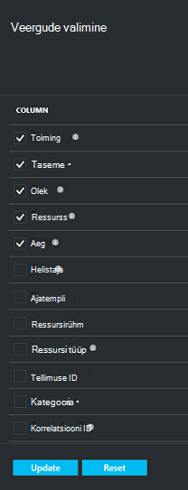

2. Valige atribuut, märkige ruut. Atribuut ruut lülitab sisse ja välja.

3. Klõpsake nuppu **Lähtesta** atribuutide **sündmuste** tera loendis lähtestada. Pärast lisamine või eemaldamine loendist atribuute, abil saate **lähtestada** uue sündmuse atribuutide loendi vaatamiseks.

4. Klõpsake nuppu **Värskenda** sündmuse atribuute andmete värskendamiseks. Järgmine tabel sisaldab teavet iga atribuut.

| Veeru nimi      |Kirjeldus|
| -----------------|-----------|
| Toiming|Toimingu nimi|
| Tase|Selle toimingu väärtused võivad olla: teatised, hoiatus, viga või kriitiline|
|Olek|Kirjeldav toimimine|
|Ressurss|URL-i, mille abil tuvastatakse ressurss; tuntud ka kui ressursi ID|
|Aeg|Praeguse kellaaja, kui sündmusele mõõdetuna aeg|
|Helistaja|Kes või mida nimetatakse või vallandanud sündmust; saab süsteemi või kasutaja|
|Ajatempli|Kui sündmus on vallandanud aeg|
|Ressursirühm|Seotud ressursirühm|
|Ressursi tüüp|Sisemiste ressursside kasutatavad ressursihaldur järgi|
|Tellimuse ID|Seotud tellimuse ID|
|Kategooria|Sündmuse kategooria|
|Korrelatsiooni ID|Levinud ID seotud sündmuste jaoks.|


## <a name="use-powershell-to-customize-alerts"></a>PowerShelli kasutamine teatiste kohandamine
Saate kohandatud teatiste jaoks tööde portaalis. Määratleda need tööd saamiseks PowerShelli teatiste reeglite funktsionaalseid logid sündmuste kohta. Kasutage *PowerShelli versioon 1.3.0 või uuem versioon*.

Määratleda kohandatud teate Teavita jaoks varukoopia tõrkeid, kasutage käsk, näiteks järgmise skripti:

```
PS C:\> $actionEmail = New-AzureRmAlertRuleEmail -CustomEmail contoso@microsoft.com
PS C:\> Add-AzureRmLogAlertRule -Name backupFailedAlert -Location "East US" -ResourceGroup RecoveryServices-DP2RCXUGWS3MLJF4LKPI3A3OMJ2DI4SRJK6HIJH22HFIHZVVELRQ-East-US -OperationName Microsoft.Backup/RecoveryServicesVault/Backup -Status Failed -TargetResourceId /subscriptions/86eeac34-eth9a-4de3-84db-7a27d121967e/resourceGroups/RecoveryServices-DP2RCXUGWS3MLJF4LKPI3A3OMJ2DI4SRJK6HIJH22HFIHZVVELRQ-East-US/providers/microsoft.backupbvtd2/RecoveryServicesVault/trinadhVault -Actions $actionEmail
```

**ResourceIdkasutamisel** : saate ResourceIdkasutamisel auditilogide. Funktsiooni ResourceIdkasutamisel on esitatud ressursi veerus Toiming logid URL.

**OperationName** : OperationName on kujul "Microsoft.RecoveryServices/recoveryServicesVault/*EventName*" kui *EventName* võib olla:<br/>
- Registreeru <br/>
- Registreerimise tühistamine <br/>
- ConfigureProtection <br/>
- Varundus <br/>
- Taastamine <br/>
- StopProtection <br/>
- DeleteBackupData <br/>
- CreateProtectionPolicy <br/>
- DeleteProtectionPolicy <br/>
- UpdateProtectionPolicy <br/>

**Olek** : toetatud väärtused on alustamine, õnnestus või nurjus.

**ResourceGroup** : see on ressursirühm, kuhu ressurss kuulub. Ressursirühm veeru lisamiseks loodud logid. Ressursirühm on üks saadaval tüüpi sündmuse teabe.

**Nimi** : reegli nimi.

**CustomEmail** : saate määrata kohandatud meiliaadress, millele soovite saada teatis teatis

**SendToServiceOwners** : see suvand saadab teatiste kõik administraatorid ja kaasadministraatorite tellimuse. Seda saate kasutada cmdlet-käsu **New-AzureRmAlertRuleEmail**

### <a name="limitations-on-alerts"></a>Teatiste piirangud
Teatiste sündmus põhinev on järgmised piirangud.

1. Teatisi luuakse kõik virtuaalmasinates võlvkelder taastamise teenused. Ei saa kohandada teatise virtuaalmasinates taastamise teenused võlvkelder alamhulga.
2. See funktsioon on eelvaates. [Lisateave](../monitoring-and-diagnostics/insights-powershell-samples.md#create-alert-rules)
3. Teatised saadetakse "alerts-noreply@mail.windowsazure.com". Praegu ei saa muuta e-posti saatja.


## <a name="next-steps"></a>Järgmised sammud

Sündmuselogide luba suurepärane tapajärgse ja audit tugi varukoopia toimingud. Järgmised toimingud on sisse logitud:

- Registreeru
- Registreerimise tühistamine
- Kaitse konfigureerimine
- Varundus (nii ajastatud samuti nõudmisel varukoopia)
- Taastamine
- Kaitse eemaldamine
- Varundatud andmete kustutamine
- Teabehalduspoliitika lisamine
- Poliitika kustutamine
- Poliitika
- Katkestamine

Sündmuste laialdane selgitus toimingute ja auditilogid Azure teenustes, leiate artiklist, [Vaade sündmuste ja auditilogid](../monitoring-and-diagnostics/insights-debugging-with-events.md).

Uuesti luua virtuaalse masina punktist taastamise kohta lisateabe saamiseks lugege teemat [Azure VMs taastamine](backup-azure-restore-vms.md). Kui soovite oma virtuaalmasinates kaitsmise kohta lisateavet, lugege teemat [tutvustus: varundamine taastamise teenused vault VMs](backup-azure-vms-first-look-arm.md). Lisateavet haldustoimingud VM varufailide artikli, [hallata Azure virtuaalse masina varukoopiad](backup-azure-manage-vms.md).
