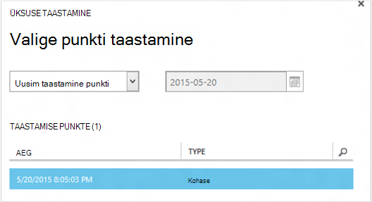

<properties
    pageTitle="Varukoopia põhjal taastamine on virtuaalmasinates | Microsoft Azure'i"
    description="Saate teada, kuidas taastada mõni Azure virtuaalse masina taastamise punkti"
    services="backup"
    documentationCenter=""
    authors="trinadhk"
    manager="shreeshd"
    editor=""
    keywords="taastamine varukoopia; Kuidas taastada; punkti taastamine;"/>

<tags
    ms.service="backup"
    ms.workload="storage-backup-recovery"
    ms.tgt_pltfrm="na"
    ms.devlang="na"
    ms.topic="article"
    ms.date="08/02/2016"
    ms.author="trinadhk; jimpark;"/>

# Azure'i virtuaalmasinates taastamine

> [AZURE.SELECTOR]
- [Azure'i portaalis VMs taastamine](backup-azure-arm-restore-vms.md)
- [Klassikaline portaalis VMs taastamine](backup-azure-restore-vms.md)

Taastage virtuaalse masina uue VM varukoopiate, mis on talletatud on Azure varukoopiate hoidla, tehke järgmist.

## Töövoo taastamine

### 1. Klõpsake üksuse taastamine

1. Liikuge menüü **Kaitstud üksused** ja valige uus VM taastatava virtuaalse masina.

    

    **Üksuste kaitstud** lehe veeru **Taastamine punkti** on teile virtuaalse masina taastamise punktide arv. **Uusimast taastamine punkti** veerust teada aega, millest saab taastada virtuaalse masina Viimane varukoopia.

2. Klõpsake nuppu **Taasta** **üksuse taastamine** viisardi avamiseks.

    

### 2. Valige taastamine

1. **Valige taastamine punkti** ekraanil, saate taastada uusim taastamine punkti või eelmises punktis kellaaja. Valitud viisardi avanemisel vaikevalik on *uusimast taastamine*.

    

2. Valige varasema kellaaja, rippmenüüst valik **Valige kuupäev** ja valige kuupäeva kalendri juhtelement klõpsates **kalendriikooni**. Juhtelemendi kõik kuupäevad, mis on taastamise punkte täidetakse hele halli varju ja on võimalik valida kasutaja.

    

    Kui klõpsate nuppu kalendri juhtelement kuupäeva, suunab taastamis saadaval kuupäev kuvatakse taastamine punktide allpool tabelis. **Kellaaja** veerg näitab aega, mil on võetud hetktõmmis. Veerus **Tüüp** kuvatakse [järjepidevuse](https://azure.microsoft.com/documentation/articles/backup-azure-vms/#consistency-of-recovery-points) taastamise punkti. Tabelipäises kuvatakse sulgudes sel päeval arvu taastamise punkte saadaval.

    

3. Valige taastamise punkti **Taastamise punkte** tabelist ja järgmise noolt ja valige järgmisel kuval.

### 3. Määrake sihtkoht

1. Määrake andmed virtuaalse masina taastamiseks **Valige Taasta eksemplari** ekraani.

  - Määrake virtuaalse masina nimi: antud pilveteenuses virtuaalse masina nimi peavad olema kordumatud. Me ei toeta üle kirjutamine olemasoleva VM. 
  - Valige pilveteenus VM: on kohustuslik VM loomise kohta. Saate kasutada mõne olemasoleva pilveteenuses või luua uue pilveteenusesse.

        Whatever cloud service name is picked should be globally unique. Typically, the cloud service name gets associated with a public-facing URL in the form of [cloudservice].cloudapp.net. Azure will not allow you to create a new cloud service if the name has already been used. If you choose to create select create a new cloud service, it will be given the same name as the virtual machine – in which case the VM name picked should be unique enough to be applied to the associated cloud service.

        We only display cloud services and virtual networks that are not associated with any affinity groups in the restore instance details. [Learn More](../virtual-network/virtual-networks-migrate-to-regional-vnet.md).

2. Valige salvestusruumi konto VM: on kohustuslik VM loomise kohta. Saate valida olemasoleva salvestusruumi kontodelt sama piirkonna vault Azure varukoopia. Me ei toeta on Zone liigsete või Premium salvestusruumi tüüpi salvestusruumi kontod.

    Kui pole toetatud konfiguratsiooni salvestusruumi kontod, looge salvestusruumi konto toetatud konfiguratsiooni enne alustamist taastetoimingu.

    

3. Valige virtuaalse võrgu: virtuaalse masina virtuaalse võrgu (VNET) peaks olema valitud ajal luua VM. Taastamine UI kuvatakse kõik selle VNETs sees see tellimus, mida saab kasutada. Ei ole kohustuslik, valige soovitud VNET taastatud VM – saab ühenduse taastatud virtuaalse masina Interneti kaudu isegi siis, kui selle VNET pole rakendatud.

    Kui pilveteenuses, valitud on seostatud virtuaalse võrgus, siis ei saa muuta virtuaalse võrgu.

    

4. Valige soovitud alamvõrgu: on VNET on alamvõrku, vaikimisi on valitud esimese alamvõrgu. Valige ripploendi suvandite alamvõrgu oma valik. Alamvõrgu üksikasjade kuvamiseks avage võrkude laiend [videoportaali avalehel](https://manage.windowsazure.com/), minge **Virtuaalse võrgu** ja valige virtuaalse võrgu ja alamvõrgu üksikasjade kuvamiseks konfigureerimine süvitsiminek.

    

5. Esitage üksikasjad ja taaste töö loomine viisardi ikooni **Esita** .

## Taastetoimingu jälgimine
Kui olete sisestusmeetodi kogu teabe taastamine viisard ja esitanud proovib Azure varukoopia loomine töö, mida soovite jälgida taastetoimingu.

Kui töökohtade õnnestub, kuvatakse soovitud töölauateatis teatis, mis näitab, töö loodud. Võite saada rohkem üksikasju, klõpsates nuppu **Kuva töö** , mis viivad teid **klõpsake vahekaarti** .

Kui taastetoimingu on lõpule jõudnud, on märgitud lõpetatuks **klõpsake vahekaarti** .

Pärast taastamist virtuaalse masina peate uuesti installimiseks olemasoleva algse VM ja [muuta lõpp-punktid](../virtual-machines/virtual-machines-windows-classic-setup-endpoints.md) virtuaalse masina Azure'i portaalis laiendid.

## Toimingud pärast taastamine
Leviloendi pilveteenuses – käivitamise vastavalt Linux Ubuntu, nt kasutamisel turvalisuse põhjustel parool on blokeeritud postitada taastamine. Kasutage VMAccess laiendi taastatud VM [parool](../virtual-machines/virtual-machines-linux-classic-reset-access.md)lähtestada. Soovitame SSH klahvide abil klõpsake nende jaotuse vältimiseks lähtestamise parooli postituse taastamine. 

## Taastatud vms varundamine
Sama nime nagu algselt varundatud VM taastamisel VM sama pilveteenusesse, jätkub VM postituse taastamine varukoopia. Kui olete taastada Vm erinevate pilveteenusesse või määratud taastatud VM teine nimi, seda käsitleda uue VM ja soovite häälestamise varundamise taastatud VM.

## Azure'i andmekeskuse katastroofi ajal VM taastamine
Azure'i varukoopiad võimaldab taastada varundatud VMs andmepunktipaaride andmekeskuse juhuks, kui lähteandmeid keskele, kus VMs töötavad kogemusi katastroofi ja varundamise vault geograafilise liigne olema konfigureeritud. Ajal sellised stsenaariumid, peate valima salvestusruumi konto, mis on olemas andmepunktipaaride andmekeskuse ja ülejäänud taastamine jääb sama. Azure'i varukoopiad kasutab Arvuta teenuse andmepunktipaaride geo taastatud virtuaalse masina loomiseks. 

## Domeeni domeenikontrolleri VMs taastamine
Domeeni domeenikontrolleri d c virtuaalmasinates varukoopia on toetatud stsenaarium Azure'i varundamise. Kuid mõned tuleb taastamine käigus. Taastamine kogemus on väga erinevad domeeni domeenikontrolleri vms ühe – näiteks Põhiliselt konfiguratsiooni vs VMs mitme – näiteks Põhiliselt konfiguratsiooni.

### Ühe AV
VM saab taastada (nt VM), on Azure portaali või PowerShelli kaudu.

### Mitme DCs
Kui teil on mitme – näiteks Põhiliselt keskkonnas, on domeenikontrollerid oma viis andmete sünkroonis hoida. Kui mõne vanema varukoopia punkti on taastatud *ilma sobivad ettevaatusabinõud*, võivad The USN tagasipööramine protsessi saada kaose mitme – näiteks Põhiliselt keskkonnas. Õige taastada sellise VM on selle käivitamiseks DSRM režiimis.

Juures on keerukas tekib, kuna DSRM režiimis pole Azure. Et sellist VM taastamiseks ei saa kasutada Azure portaali. Ainus toetatud taastamine on kettapõhiste taastamine PowerShelli kaudu.

>[AZURE.WARNING] Domeeni domeenikontrolleri vms mitme – näiteks Põhiliselt keskkonnas, kasutage Azure portaali taastamine! Toetatakse ainult PowerShelli põhjal taastamine

Lisateavet [USN tagasipööramine probleemi](https://technet.microsoft.com/library/dd363553) ja seda parandada soovitatud strateegiad.

## Teisiti võrgu konfiguratsioone VMs taastamine
Azure'i varukoopiad toetab jälgimise teisiti võrgu konfiguratsioone virtuaalmasinates varukoopia.

- VMs jaotises Laadi koormusetasakaalustusteenuse (sise- ja)
- Mitme reserveeritud IP-d VMs
- Mitu NICs VMs

Neid konfiguratsioone kohustavad teid jälgima ajal taastamise peaksite arvesse võtma.

>[AZURE.TIP] Kasutage PowerShelli põhjal taastamine meilivoo VMs postituse taastamine teisiti võrgukonfiguratsioon uuesti luua.

### Taastamine UI:
Taastamisel kasutajaliidese, **alati valida uue pilveteenusesse**. Pange tähele, et kuna portaali võtab vaid kohustuslik parameetrite ajal taastamine voo VMs taastamist Kasutajaliidese abil kaotate neil teisiti võrgukonfiguratsioon. Teisisõnu, taastamine VMs on tavaline VMs ilma laadi koormusetasakaalustusteenuse või mitme konfiguratsiooni NIC või mitme reserveeritud IP.

### Taastamine PowerShelli:
PowerShelli on võimalus just varukoopia põhjal taastamine VM ketast ja ei saa luua virtuaalse masina. See on kasulik, kui virtuaalmasinates, mis nõuavad spetsiaalne konfiguratsioone mentined ülaltoodud taastamine.

Selleks, et täielikult uuesti luua virtuaalse masina postituse taastamine ketast, toimige järgmiselt.

1. Varukoopiate hoidla [Azure varukoopia PowerShelli](../backup-azure-vms-classic-automation.md#restore-an-azure-vm) kaudu soovitud ketast taastamine

2. Luua nõutavaid laadi koormusetasakaalustusteenuse VM config / mitme NIC mitu reserveeritud IP PowerShelli cmdlet-käskude ja kasutage seda, et luua VM, soovitud konfiguratsioon.
    - Pilveteenuses koos [sisemise koormuse koormusetasakaalustusteenuse](https://azure.microsoft.com/documentation/articles/load-balancer-internal-getstarted/) VM loomine
    - VM [Internet vastastikuste laadi koormusetasakaalustusteenuse] ühenduse loomine (https://azure.microsoft.com/en-us/documentation/articles/load-balancer-internet-getstarted/)
    - [Mitu NICs](https://azure.microsoft.com/documentation/articles/virtual-networks-multiple-nics/) VM loomine
    - Luua VM [mitme reserveeritud IP-d](https://azure.microsoft.com/documentation/articles/virtual-networks-reserved-public-ip/)

## Järgmised sammud
- [Tõrkeotsing](backup-azure-vms-troubleshoot.md#restore)
- [Virtuaalmasinates haldamine](backup-azure-manage-vms.md)
