<properties
   pageTitle="Windows Serveri või Windowsi kliendi andmete taastamine Azure'i klassikaline juurutamise mudeli abil | Microsoft Azure'i"
   description="Saate teada, kuidas taastada Windows Serveri või Windowsi kliendi."
   services="backup"
   documentationCenter=""
   authors="saurabhsensharma"
   manager="shivamg"
   editor=""/>

<tags
   ms.service="backup"
   ms.workload="storage-backup-recovery"
     ms.tgt_pltfrm="na"
     ms.devlang="na"
     ms.topic="article"
     ms.date="08/02/2016"
     ms.author="trinadhk; jimpark; markgal;"/>

# Failide taastamiseks Windows Serveri või Windowsi kliendi seadme klassikaline juurutamise mudeli kasutamine

> [AZURE.SELECTOR]
- [Klassikaline portaal](backup-azure-restore-windows-server-classic.md)
- [Azure'i portaal](backup-azure-restore-windows-server.md)

Selles artiklis käsitletakse toiminguid, täitma taastamine kaht tüüpi:

- Andmete taastamine, mis pärinevad varukoopiaid samasse arvutisse.
- Mis tahes muu seadme andmeid taastada.

Mõlemal juhul tuuakse andmed hoidlast Azure varukoopia.

[AZURE.INCLUDE [learn-about-deployment-models](../../includes/learn-about-deployment-models-classic-include.md)]

## Kui soovite samasse arvutisse andmete taastamine
Kui teid kogemata kustutatud faili taastamiseks (kust varukoopia võetakse) samasse arvutisse, järgmised juhised aitavad teil andmeid taastada.

1. Avage **Microsoft Azure varukoopia** snap.
2. Klõpsake töövoo käivitamiseks **Andmete taastamine** .

    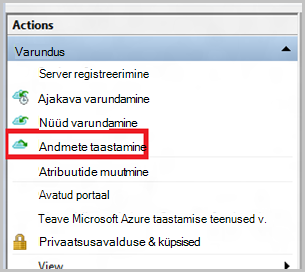

3. Valige soovitud * *see server (*yourmachinename*) ** võimaluse taastada varundatud samasse arvutisse fail üles.

    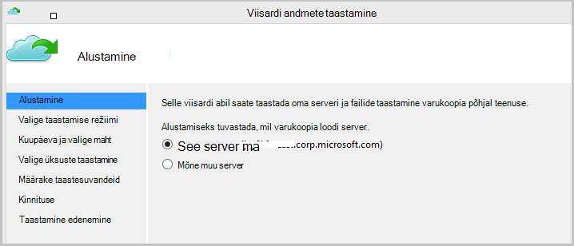

4. Valige **Otsi faile** või **failide otsimine**.

    Kui plaanite taastada üks või mitu faili, mille tee on teada, jätke vaikesuvand. Kui te ei ole kindel kausta ülesehitust, kuid soovite otsida faili, valige suvand **failide otsimine** . Käesolevas jaotises jätkame koos vaikesuvand.

    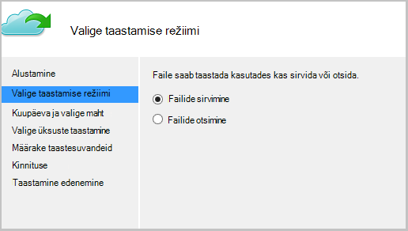

5. Valige, kust soovite taastada faili maht.

    Saate taastada mis tahes ajal. Kuupäevad, mis **paks** kalender kontrolli näitavad taastamine punkti olemasolu. Kui valitud on kuupäev, põhineb varunduse ajakava (ja varukoopia toimingu õnnestumise), saate valida punkti **kellaaeg** rippmenüüst aeg alla.

    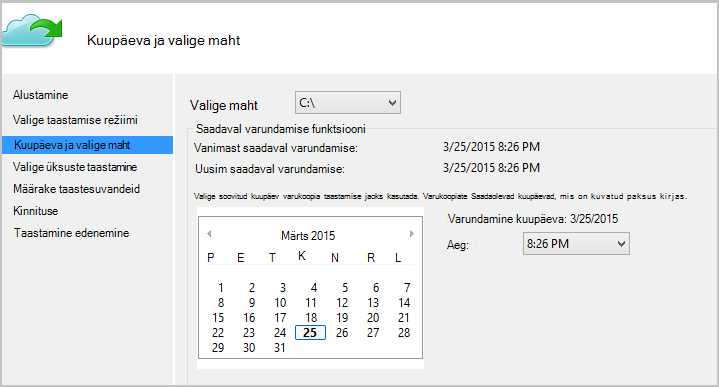

6. Valige üksusi taastada. Saate hulgivaliku kaustad/failid, mida soovite taastada.

    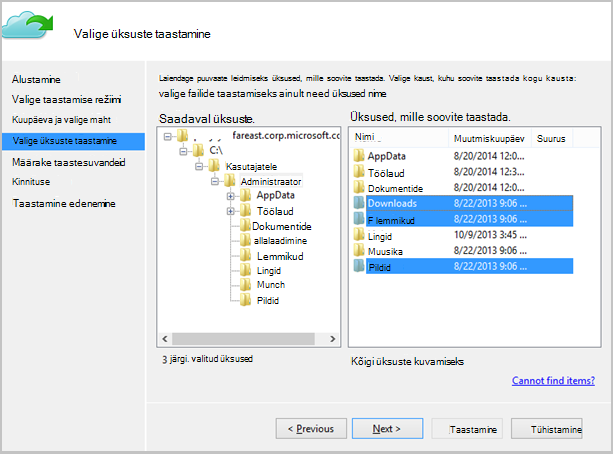

7. Määrake taastamine parameetrid.

    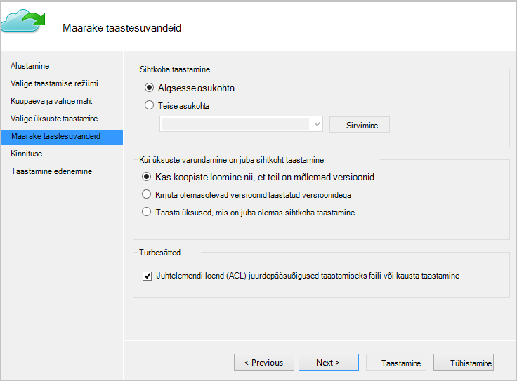

  - Teil on võimalus taastamiseks selle algsesse asukohta (kus faili/kausta tuleks üle kirjutada) või mõnda muusse asukohta samasse arvutisse.
  - Kui sihtkoht on olemas faili/kausta, mida soovite taastada, saate luua eksemplaride (kaks versiooni sama faili), kirjutada sihtkoht failid või faile, mis Sihtvaluuta taastamise vahele jätta.
  - See on soovitatav jätta vaikesuvand ACL-ID, mis on on taastatud faile taastada.

8. Pärast nende sisendeid on olemas, klõpsake nuppu **edasi**. Taastamine töövoo, mis taastab faile selles arvutis, hakkavad.

## Mõne alternatiivse arvutis taastamine
Kui teie kogu server läheb kaotsi, saate siiski taastada andmete Azure varukoopia soovite mõnda teise arvutisse. Järgmised sammud kirjeldavad töövoo.  

Kasutatakse järgmist terminid sisaldab järgmist:

- *Andmeallika kohapeal* – algse arvutisse, mis võeti varundamine ja mis on praegu saadaval.
- *Sihtarvutis* -arvuti, kuhu andmete taastamine.
- *Valimi vault* – The varundamise vault, mis on registreeritud *Allika arvuti* ja *sihtarvutis* .  

> [AZURE.NOTE] Varukoopiate tehtud seadmes ei saa taastada arvutisse, kus töötab operatsioonisüsteem varasemas versioonis. Näiteks kui varukoopiate võetakse Windows 7 arvutist, taastamist opsüsteemis Windows 8 või seadme kohale. Siiski, selle vastupidi ei kehti tõene.

1. Avage **Microsoft Azure varukoopia** snap *sihtarvutis*.
2. Veenduge, et *sihtarvutis* ja *Allika kohapeal* registreeritud sama varukoopiate hoidla.
3. Klõpsake töövoo käivitamiseks **Andmete taastamine** .

    

4. Valige **muu server**

    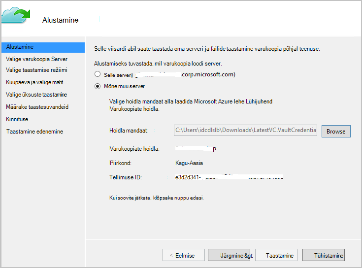

5. *Valimi vault*vault mandaati faili, mis vastab pakkumiseks. Kui vault mandaati fail on sobimatu (või aegunud) laadida *valimi vault* Azure klassikaline portaalis vault mandaati uue faili. Kui vault mandaati fail on saadaval, kuvatakse varukoopiate hoidla vault mandaati faili suhtes.

6. Valige loendis kuvatud masinad *Allika kohapeal* .

    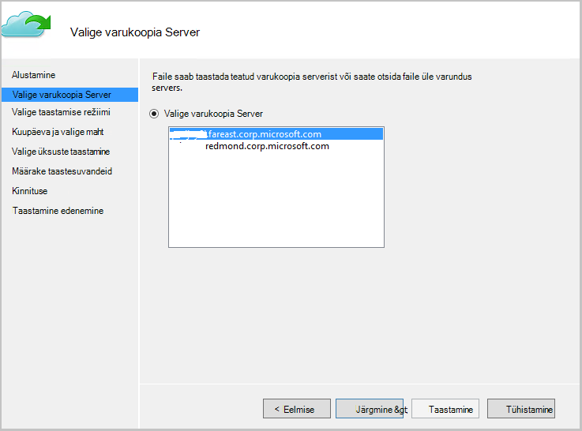

7. Valige suvand **failide otsimine** või **failide sirvimine** . Käesolevas jaotises kasutame otsingut **failide jaoks** .

    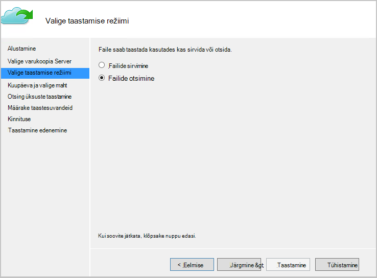

8. Valige järgmisel kuval helitugevust ja kuupäeva. Otsige soovite taastada kausta/faili nime.

    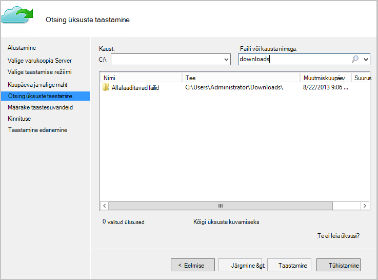

9. Valige asukoht, kus failid tuleb taastada.

    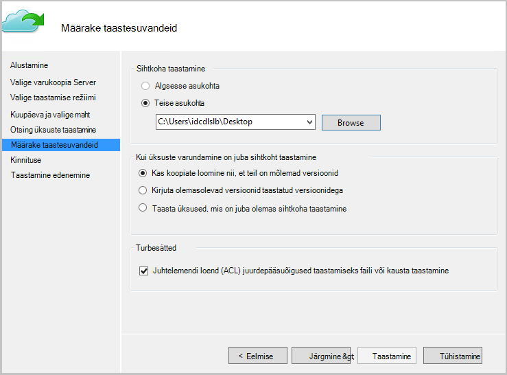

10. Sisestage *Allika seadme* registreerimise käigus antud *valimi vault*krüptimise parool.

    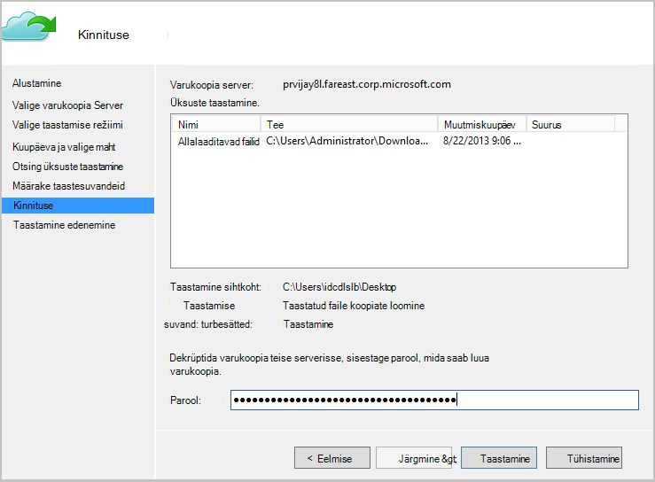

11. Kui sisendi on esitatud, klõpsake **taastada**, mis käivitab taastada varundatud failide esitatud sihtkohta.

## Järgmised sammud
- [Azure varukoopia KKK](backup-azure-backup-faq.md)
- Külastage [Azure varukoopia Foorum](http://go.microsoft.com/fwlink/p/?LinkId=290933).

## Lisateave
- [Azure varukoopia ülevaade](http://go.microsoft.com/fwlink/p/?LinkId=222425)
- [Varukoopia Azure'i virtuaalmasinates](backup-azure-vms-introduction.md)
- [Varundus Microsoft töökoormus häälestamine](backup-azure-dpm-introduction.md)
