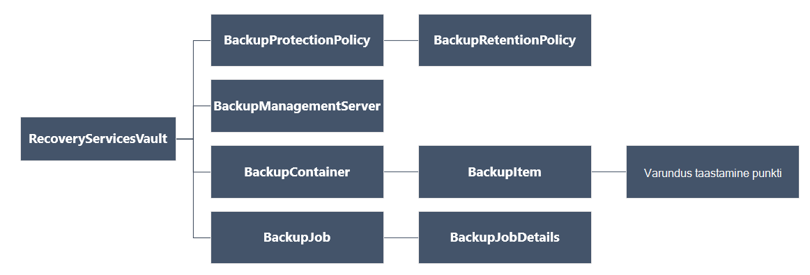

<properties
   pageTitle="Juurutada ja hallata varukoopiate ressursihaldur juurutatud vms PowerShelli kaudu | Microsoft Azure'i"
   description="PowerShelli abil saate juurutada ja hallata varukoopiate Azure ressursihaldur juurutatud vms"
   services="backup"
   documentationCenter=""
   authors="markgalioto"
   manager="cfreeman"
   editor=""/>

<tags
   ms.service="backup"
   ms.devlang="na"
   ms.topic="article"
   ms.tgt_pltfrm="na"
   ms.workload="storage-backup-recovery"
   ms.date="08/03/2016"
   ms.author="markgal; trinadhk"/>

# <a name="deploy-and-manage-backups-for-resource-manager-deployed-vms-using-powershell"></a>Juurutada ja hallata varukoopiate ressursihaldur juurutatud vms PowerShelli abil

> [AZURE.SELECTOR]
- [Ressursihaldur](backup-azure-vms-automation.md)
- [Klassikaline](backup-azure-vms-classic-automation.md)

Selles artiklis kirjeldatakse, kuidas varundamiseks ja taastamiseks Azure virtuaalse masina (VM) on taastamise teenused hoidlast Azure PowerShelli cmdlet-käskude abil. Mõne taastamise teenused hoidla on Azure ressursihaldur ressurss ja kasutatakse andmete ja Azure varundus-ja Azure saidi taastamise varade kaitsmiseks. Saate kaitsta Azure Service Manager juurutatud VMs Azure'i ressursihaldur juurutatud VMs taastamise teenused vault.

>[AZURE.NOTE] Azure'i on kaks juurutamise mudelite loomise ja ressursside töötamine: [ressursihaldur ja klassikaline](../resource-manager-deployment-model.md). Selles artiklis on mõeldud kasutamiseks koos ressursihaldur mudeli abil loodud VMs.

Selles artiklis tutvustatakse kaitsta VM ja andmete taastamine taastamise punkti PowerShelli kaudu.

## <a name="concepts"></a>Mõisted

Kui te ei tunne teenusega Azure varukoopia ülevaate teenuse, lugege teemat [mis on Azure varukoopia?](backup-introduction-to-azure-backup.md) Enne alustamist veenduge, et te katta olulised eeltingimused, mis on vaja teha koostööd Azure varukoopia ja praeguse VM varukoopia lahendus piirangud.

PowerShelli tõhusaks kasutamiseks on vaja mõista hierarhia, objektide ja kust alustada.



AzureRmRecoveryServicesBackup PowerShelli cmdleti viide, leiate [Azure'i varundus - taastamine teenuste cmdlettide](https://msdn.microsoft.com/library/mt723320.aspx) Azure teegis.
AzureRmRecoveryServicesVault PowerShelli cmdleti viide, leiate [Azure'i taastamise teenuse cmdlet-käsud](https://msdn.microsoft.com/library/mt643905.aspx).


## <a name="setup-and-registration"></a>Häälestamine ja

Alustamiseks:

1. [Alla laadida Office'i uusima versiooni PowerShelli](https://github.com/Azure/azure-powershell/releases) (on nõutav vähemalt versioon: 1.4.0)

2. Leida Azure varundus PowerShelli cmdlet-käsud saadaval, tippige järgmine käsk:

```
PS C:\> Get-Command *azurermrecoveryservices*

CommandType     Name                                               Version    Source
-----------     ----                                               -------    ------
Cmdlet          Backup-AzureRmRecoveryServicesBackupItem           1.4.0      AzureRM.RecoveryServices.Backup
Cmdlet          Disable-AzureRmRecoveryServicesBackupProtection    1.4.0      AzureRM.RecoveryServices.Backup
Cmdlet          Enable-AzureRmRecoveryServicesBackupProtection     1.4.0      AzureRM.RecoveryServices.Backup
Cmdlet          Get-AzureRmRecoveryServicesBackupContainer         1.4.0      AzureRM.RecoveryServices.Backup
Cmdlet          Get-AzureRmRecoveryServicesBackupItem              1.4.0      AzureRM.RecoveryServices.Backup
Cmdlet          Get-AzureRmRecoveryServicesBackupJob               1.4.0      AzureRM.RecoveryServices.Backup
Cmdlet          Get-AzureRmRecoveryServicesBackupJobDetails        1.4.0      AzureRM.RecoveryServices.Backup
Cmdlet          Get-AzureRmRecoveryServicesBackupManagementServer  1.4.0      AzureRM.RecoveryServices.Backup
Cmdlet          Get-AzureRmRecoveryServicesBackupProperties        1.4.0      AzureRM.RecoveryServices
Cmdlet          Get-AzureRmRecoveryServicesBackupProtectionPolicy  1.4.0      AzureRM.RecoveryServices.Backup
Cmdlet          Get-AzureRMRecoveryServicesBackupRecoveryPoint     1.4.0      AzureRM.RecoveryServices.Backup
Cmdlet          Get-AzureRmRecoveryServicesBackupRetentionPolic... 1.4.0      AzureRM.RecoveryServices.Backup
Cmdlet          Get-AzureRmRecoveryServicesBackupSchedulePolicy... 1.4.0      AzureRM.RecoveryServices.Backup
Cmdlet          Get-AzureRmRecoveryServicesVault                   1.4.0      AzureRM.RecoveryServices
Cmdlet          Get-AzureRmRecoveryServicesVaultSettingsFile       1.4.0      AzureRM.RecoveryServices
Cmdlet          New-AzureRmRecoveryServicesBackupProtectionPolicy  1.4.0      AzureRM.RecoveryServices.Backup
Cmdlet          New-AzureRmRecoveryServicesVault                   1.4.0      AzureRM.RecoveryServices
Cmdlet          Remove-AzureRmRecoveryServicesProtectionPolicy     1.4.0      AzureRM.RecoveryServices.Backup
Cmdlet          Remove-AzureRmRecoveryServicesVault                1.4.0      AzureRM.RecoveryServices
Cmdlet          Restore-AzureRMRecoveryServicesBackupItem          1.4.0      AzureRM.RecoveryServices.Backup
Cmdlet          Set-AzureRmRecoveryServicesBackupProperties        1.4.0      AzureRM.RecoveryServices
Cmdlet          Set-AzureRmRecoveryServicesBackupProtectionPolicy  1.4.0      AzureRM.RecoveryServices.Backup
Cmdlet          Set-AzureRmRecoveryServicesVaultContext            1.4.0      AzureRM.RecoveryServices
Cmdlet          Stop-AzureRmRecoveryServicesBackupJob              1.4.0      AzureRM.RecoveryServices.Backup
Cmdlet          Unregister-AzureRmRecoveryServicesBackupContainer  1.4.0      AzureRM.RecoveryServices.Backup
Cmdlet          Unregister-AzureRmRecoveryServicesBackupManagem... 1.4.0      AzureRM.RecoveryServices.Backup
Cmdlet          Wait-AzureRmRecoveryServicesBackupJob              1.4.0      AzureRM.RecoveryServices.Backup
```


PowerShelli abil automatiseerida järgmisi toiminguid:

- Taastamise teenused vault loomine
- Varundamine või kaitse Azure VMs
- Varundustöö käivitamine
- Varundustöö jälgimine
- Azure'i VM taastamine

## <a name="create-a-recovery-services-vault"></a>Taastamise teenuste hoidla loomine

Järgmised toimingud juhatab teid läbi taastamise teenused vault loomine. Taastamise teenused vault erineb varundamise vault.

1. Kui kasutate Azure varukoopia esimest korda, peate kasutama **[Register-AzureRMResourceProvider](https://msdn.microsoft.com/library/mt679020.aspx)** cmdlet registreerida Azure taastamise teenusepakkuja tellimus.

    ```
    PS C:\> Register-AzureRmResourceProvider -ProviderNamespace "Microsoft.RecoveryServices"
    ```

2. Vault taastamise teenused on ressursihaldur vahend, seega peate aset ressursirühma. Saate kasutada olemasolevat ressursi rühma või luua uue ressursirühma cmdlet-käsu **[New-AzureRmResourceGroup](https://msdn.microsoft.com/library/mt678985.aspx)** . Kui loote uue ressursirühma, määrake nimi ja asukoht ressursirühma.  

    ```
    PS C:\> New-AzureRmResourceGroup –Name "test-rg" –Location "West US"
    ```

3. **[Uus-AzureRmRecoveryServicesVault](https://msdn.microsoft.com/library/mt643910.aspx)** cmdlet-käsu abil saate luua uue vault. Ärge unustage vault sama asukoha määramiseks, mida kasutati ressursirühma.

    ```
    PS C:\> New-AzureRmRecoveryServicesVault -Name "testvault" -ResourceGroupName " test-rg" -Location "West US"
    ```

4. Määrake tüübi talletusruumi koondamise kasutama; saate kasutada [Kohalikult liigsete salvestusruumi (LRS)](../storage/storage-redundancy.md#locally-redundant-storage) või [Geo liigsete salvestusruumi (GRS)](../storage/storage-redundancy.md#geo-redundant-storage). Järgmises näites on kujutatud - BackupStorageRedundancy suvandi testVault väärtuseks GeoRedundant.

    ```
    PS C:\> $vault1 = Get-AzureRmRecoveryServicesVault –Name "testVault"
    PS C:\> Set-AzureRmRecoveryServicesBackupProperties  -Vault $vault1 -BackupStorageRedundancy GeoRedundant
    ```

    > [AZURE.TIP] Paljud Azure varukoopia cmdlet-käsud on vaja sisendina taastamise teenused vault objekti. Seetõttu on mugav talletada varukoopia taastamise teenused vault objekti muutujana.

## <a name="view-the-vaults-in-a-subscription"></a>Tellimuse võlvid kuvamine
**[Get-AzureRmRecoveryServicesVault](https://msdn.microsoft.com/library/mt643907.aspx)** abil saate vaadata kõiki võlvid praeguse tellimuse. Kontrollige, et on loodud uue vault või vaadata, millised võlvid on saadaval tellimuse, saate selle käsu.

Käivitage käsk Get-AzureRmRecoveryServicesVault ja kõik võlvid tellimus on loetletud.

```
PS C:\> Get-AzureRmRecoveryServicesVault
Name              : Contoso-vault
ID                : /subscriptions/1234
Type              : Microsoft.RecoveryServices/vaults
Location          : WestUS
ResourceGroupName : Contoso-docs-rg
SubscriptionId    : 1234-567f-8910-abc
Properties        : Microsoft.Azure.Commands.RecoveryServices.ARSVaultProperties
```


## <a name="backup-azure-vms"></a>Varukoopia Azure VMs
Nüüd, kui olete loonud taastamise teenuste hoidla, saate seda kasutada virtuaalse masina kaitsta. Aga enne, kui rakendate kaitse, peate määrama vault konteksti ja te soovite kontrollida kaitse poliitika. Vault kontekstis määratleb autoriloomingut tüüpi andmeid, mis on kaitstud. Kaitse poliitika on ajakava kui Varundustöö töötab ja kui kaua säilitatakse iga varukoopia hetktõmmis.

Enne kaitse VM, peate määrama vault kontekstis. Konteksti rakendatakse kõigi järgmiste cmdlet-käsud.

```
PS C:\> Get-AzureRmRecoveryServicesVault -Name testvault | Set-AzureRmRecoveryServicesVaultContext
```

### <a name="create-a-protection-policy"></a>Kaitse poliitika loomine

Kui loote uue vault, kaasas vaikepoliitika. Selle poliitika käivitab Varundustöö iga päev määratud ajal. Kohta vaikepoliitika, säilitatakse varukoopia hetktõmmise 30 päeva. Vaikepoliitika abil saate kiiresti kaitsta oma VM ning hiljem eri üksikasjadega poliitika redigeerimine.

Kasutage **[Get-AzureRmRecoveryServicesBackupProtectionPolicy](https://msdn.microsoft.com/library/mt723300.aspx)** vault poliitikate saadaval loendi kuvamiseks.

```
PS C:\> Get-AzureRmRecoveryServicesBackupProtectionPolicy -WorkloadType AzureVM
Name                 WorkloadType       BackupManagementType BackupTime                DaysOfWeek
----                 ------------       -------------------- ----------                ----------
DefaultPolicy        AzureVM            AzureVM              4/14/2016 5:00:00 PM
```

> [AZURE.NOTE] Ajavöönd BackupTime välja PowerShellis on UTC. Juhul, kui varundamise kellaaeg kuvatakse Azure'i portaalis, aeg on kohandatud teie kohaliku ajavöönd.

Varukoopia kaitse poliitika on seotud vähemalt üks säilituspoliitika.  Säilituspoliitika määratleb, kui kaua taastamine punkti hoitakse Azure'i varundamise. **Get-AzureRmRecoveryServicesBackupRetentionPolicyObject** abil saate vaadata vaikimisi säilituspoliitika.  Samuti saate **Get-AzureRmRecoveryServicesBackupSchedulePolicyObject** saada ajakava vaikepoliitika. **Uus-AzureRmRecoveryServicesBackupProtectionPolicy** cmdlet sisendina kasutatakse ajakava ja säilituspoliitikate rühmapoliitika objektid.

Varukoopia kaitse poliitika määratleb, millal ja kuidas üksuse varundamine on lõpule jõudnud. Cmdlet-käsu New-AzureRmRecoveryServicesBackupProtectionPolicy loob PowerShelli objekt, mis varukoopia teave. Luba-AzureRmRecoveryServicesBackupProtection cmdlet sisendina kasutatakse varukoopia poliitika.

```
PS C:\> $schPol = Get-AzureRmRecoveryServicesBackupSchedulePolicyObject -WorkloadType "AzureVM"
PS C:\>  $retPol = Get-AzureRmRecoveryServicesBackupRetentionPolicyObject -WorkloadType "AzureVM"
PS C:\>  New-AzureRmRecoveryServicesBackupProtectionPolicy -Name "NewPolicy" -WorkloadType AzureVM -RetentionPolicy $retPol -SchedulePolicy $schPol
Name                 WorkloadType       BackupManagementType BackupTime                DaysOfWeek
----                 ------------       -------------------- ----------                ----------
NewPolicy           AzureVM            AzureVM              4/24/2016 1:30:00 AM
```

### <a name="enable-protection"></a>Kaitse lubamine

Kaitse lubamine hõlmab kahte objektide – üksuse ja poliitika. Mõlemad objektid on nõutav vault kaitse. Kui poliitika on seostatud vault, käivitatakse töövoog varukoopia ajal määratletud poliitika ajakava.

Lubamiseks klõpsake ARM-krüptitud VMs kaitse

```
PS C:\> $pol=Get-AzureRmRecoveryServicesBackupProtectionPolicy -Name "NewPolicy"
PS C:\> Enable-AzureRmRecoveryServicesBackupProtection -Policy $pol -Name "V2VM" -ResourceGroupName "RGName1"
```

Krüptitud VMs [krüptitud BEK ja KEK] kaitse lubamiseks peate õiguste andmiseks Azure varukoopia teenuse, et lugeda võtmed ja saladused võtme hoidlast. 

```
PS C:\> Set-AzureRmKeyVaultAccessPolicy -VaultName 'KeyVaultName' -ResourceGroupName 'RGNameOfKeyVault' -PermissionsToKeys backup,get,list -PermissionsToSecrets get,list -ServicePrincipalName 262044b1-e2ce-469f-a196-69ab7ada62d3
PS C:\> $pol=Get-AzureRmRecoveryServicesBackupProtectionPolicy -Name "NewPolicy"
PS C:\> Enable-AzureRmRecoveryServicesBackupProtection -Policy $pol -Name "V2VM" -ResourceGroupName "RGName1"
```

ASM vastavalt VMs

```
PS C:\>  $pol=Get-AzureRmRecoveryServicesBackupProtectionPolicy -Name "NewPolicy"
PS C:\>  Enable-AzureRmRecoveryServicesBackupProtection -Policy $pol -Name "V1VM" -ServiceName "ServiceName1"
```

### <a name="modify-a-protection-policy"></a>Kaitse poliitika muutmine

Selleks, et muuta poliitika, BackupSchedulePolicyObject või BackupRetentionPolicy objekti muuta ja muuta poliitika Set-AzureRmRecoveryServicesBackupProtectionPolicy abil

Järgmises näites muutub 365 säilituspoliitika loendus.

```
PS C:\> $retPol = Get-AzureRmRecoveryServicesBackupRetentionPolicyObject -WorkloadType "AzureVM"
PS C:\> $retPol.DailySchedule.DurationCountInDays = 365
PS C:\> $pol= Get-AzureRmRecoveryServicesBackupProtectionPolicy -Name NewPolicy
PS C:\> Set-AzureRmRecoveryServicesBackupProtectionPolicy -Policy $pol  -RetentionPolicy  $RetPol
```

## <a name="run-an-initial-backup"></a>Käivitage mõni algse varundamine

Varunduse ajakava käivitab täielik varundamine esialgse tagasi üles üksus. Klõpsake järgmise, tagasi varundada on suureneva eksemplar. Kui soovite algse varukoopia juhtub teatud ajal või isegi kohe ja seejärel kasutage **[Varundus-AzureRmRecoveryServicesBackupItem](https://msdn.microsoft.com/library/mt723312.aspx)** cmdlet-käsk:

```
PS C:\> $namedContainer = Get-AzureRmRecoveryServicesBackupContainer -ContainerType "AzureVM" -Status "Registered" -Name "V2VM"
PS C:\> $item = Get-AzureRmRecoveryServicesBackupItem -Container $namedContainer -WorkloadType "AzureVM"
PS C:\> $job = Backup-AzureRmRecoveryServicesBackupItem -Item $item
WorkloadName     Operation            Status               StartTime                 EndTime                   JobID
------------     ---------            ------               ---------                 -------                   ----------
V2VM              Backup               InProgress            4/23/2016 5:00:30 PM                       cf4b3ef5-2fac-4c8e-a215-d2eba4124f27
```

> [AZURE'I. Märkus: Ajavöönd PowerShelli StartTime ja EndTime väljad on UTC. Juhul, kui aeg on näidatud Azure portaali, aeg on kohandatud teie kohaliku ajavöönd.

## <a name="monitoring-a-backup-job"></a>Varundustöö jälgimine

Enamik toiminguid Azure varukoopia on kujundatud tööd. See on lihtne ilma säilitada Azure portaali edenemise jälgimiseks avatud igal ajal.

Viimane on pooleli töö oleku saamiseks kasutage Get-AzureRmRecoveryservicesBackupJob cmdlet-käsk.

```
PS C:\ > $joblist = Get-AzureRmRecoveryservicesBackupJob –Status InProgress
PS C:\ > $joblist[0]
WorkloadName     Operation            Status               StartTime                 EndTime                   JobID
------------     ---------            ------               ---------                 -------                   ----------
V2VM             Backup               InProgress            4/23/2016 5:00:30 PM           cf4b3ef5-2fac-4c8e-a215-d2eba4124f27
```

Küsitlused asemel kasutada nende tööde lõpetamise - st mittevajalike täiendavad koodi - **[Ootamine-AzureRmRecoveryServicesBackupJob](https://msdn.microsoft.com/library/mt723321.aspx)** cmdlet-käsk. Selle cmdlet-käsu peatab täitmise kuni kas töö lõpulejõudmist või määratud ajalõpu väärtust saavutamiseni.

```
PS C:\> Wait-AzureRmRecoveryServicesBackupJob -Job $joblist[0] -Timeout 43200
```

## <a name="restore-an-azure-vm"></a>Azure'i VM taastamine

On oluline vahe taastamine Azure'i portaalis VM ja taastamine VM PowerShelli kaudu. PowerShelli abil, taastetoimingu on lõpule jõudnud, kui ketast ja konfiguratsiooniteavet taastamine punktist on loodud. Taastetoimingu ei Loo virtuaalse masina. Juhised loomine virtuaalse masina ketast on olemas. Siiski VM täielikult taastamiseks peate läbige teha järgmist:

- Valige VM
- Valige punkti taastamine
- Funktsiooni ketast taastamine
- Salvestatud ketast VM loomine

Allolevat pilti näitab objekti hierarhia RecoveryServicesVault soovitud BackupRecoveryPoint allapoole.


Varundatud andmete taastamine, et tuvastada varundatud üksuse ja mis hoiab punkti /-kellaaja andmete taastamine punkti. Seejärel soovitud hoidlast andmete taastamiseks kliendi konto **[Taastamine-AzureRmRecoveryServicesBackupItem](https://msdn.microsoft.com/library/mt723316.aspx)** cmdlet-käsu abil.

### <a name="select-the-vm"></a>Valige VM

PowerShelli objekti, mis tuvastab paremale varukoopia üksuse saamiseks container autoriloomingut käivitamine ja tööd teed alla objekti hierarhia. Valige ümbris, mis tähistab VM, **[Get-AzureRmRecoveryServicesBackupContainer](https://msdn.microsoft.com/library/mt723319.aspx)** cmdlet-käsu kasutamine ja toru mis **[Get-AzureRmRecoveryServicesBackupItem](https://msdn.microsoft.com/library/mt723305.aspx)** cmdlet-i.

```
PS C:\> $namedContainer = Get-AzureRmRecoveryServicesBackupContainer  -ContainerType AzureVM –Status Registered -Name 'V2VM'
PS C:\> $backupitem = Get-AzureRmRecoveryServicesBackupItem –Container $namedContainer  –WorkloadType "AzureVM"
```

### <a name="choose-a-recovery-point"></a>Valige punkti taastamine

**[Get-AzureRmRecoveryServicesBackupRecoveryPoint](https://msdn.microsoft.com/library/mt723308.aspx)** cmdlet-käsu abil saate loendi taastamise punkte varukoopia üksuse. Valige taastamise punkti taastada. Kui te pole kindel, millist taastamine punkti kasutada, on mõistlik valida viimase RecoveryPointType = AppConsistent punkt loendis.

Järgmine skript, muutuja, **$rp**, on valitud üksuse varukoopia taastamise punkte massiivi. Massiiv on sorditud vastupidises järjekorras aega taastamine Viimane punkt, index 0. Standard PowerShelli massiiv indekseerimise abil saate valida taastamine punkti. Näide: $rp [0] valib taastamine Viimane punkt.

```
PS C:\> $startDate = (Get-Date).AddDays(-7)
PS C:\> $endDate = Get-Date
PS C:\> $rp = Get-AzureRmRecoveryServicesBackupRecoveryPoint -Item $backupitem -StartDate $startdate.ToUniversalTime() -EndDate $enddate.ToUniversalTime()
PS C:\> $rp[0]
RecoveryPointAdditionalInfo :
SourceVMStorageType         : NormalStorage
Name                        : 15260861925810
ItemName                    : VM;iaasvmcontainer;RGName1;V2VM
RecoveryPointId             : /subscriptions/XX/resourceGroups/ RGName1/providers/Microsoft.RecoveryServices/vaults/testvault/backupFabrics/Azure/protectionContainers/IaasVMContainer;iaasvmcontainer;RGName1;V2VM/protectedItems/VM;iaasvmcontainer; RGName1;V2VM
                              /recoveryPoints/15260861925810
RecoveryPointType           : AppConsistent
RecoveryPointTime           : 4/23/2016 5:02:04 PM
WorkloadType                : AzureVM
ContainerName               : IaasVMContainer;iaasvmcontainer; RGName1;V2VM
ContainerType               : AzureVM
BackupManagementType        : AzureVM
```


### <a name="restore-the-disks"></a>Funktsiooni ketast taastamine

**[Taastamine-AzureRmRecoveryServicesBackupItem](https://msdn.microsoft.com/library/mt723316.aspx)** cmdlet abil saate taastada andmed ja konfiguratsiooni üksuse varundamine, taastamine punkti. Kui olete kindlaks taastamine punkti kasutada seda väärtust **- RecoveryPoint** parameeter. Eelmise näite kood, **$rp [0]** valitud taastamine punkti kasutada. Proovi kood allpool, **$rp [0]** on määratud punkti taastamise jaoks kettale taastamine.

Ketast ja konfiguratsiooniteavet taastamine

```
PS C:\> $restorejob = Restore-AzureRmRecoveryServicesBackupItem -RecoveryPoint $rp[0] -StorageAccountName DestAccount -StorageAccountResourceGroupName DestRG
PS C:\> $restorejob
WorkloadName     Operation          Status               StartTime                 EndTime            JobID
------------     ---------          ------               ---------                 -------          ----------
V2VM              Restore           InProgress           4/23/2016 5:00:30 PM                        cf4b3ef5-2fac-4c8e-a215-d2eba4124f27
```

Kui Taasta töö on valmis, **[Get-AzureRmRecoveryServicesBackupJobDetails](https://msdn.microsoft.com/library/mt723310.aspx)** cmdlet-käsu abil saate taastetoimingu üksikasju. JobDetails on taastada VM vajalik teave.

```
PS C:\> $restorejob = Get-AzureRmRecoveryServicesBackupJob -Job $restorejob
PS C:\> $details = Get-AzureRmRecoveryServicesBackupJobDetails
```

Kui taastate soovitud ketast, minge järgmise jaotise teavet VM loomise kohta.

### <a name="create-a-vm-from-restored-disks"></a>Taastatud ketast VM loomine

Pärast taastamist on ketast, kasutage neid juhiseid loomiseks ja konfigureerimiseks virtuaalse masina kettalt.

1. Päringu taastatud kettal atribuutide töö üksikasjad.

    ```
    PS C:\> $properties = $details.properties
    PS C:\> $storageAccountName = $properties["Target Storage Account Name"]
    PS C:\> $containerName = $properties["Config Blob Container Name"]
    PS C:\> $blobName = $properties["Config Blob Name"]
    ```

2. Azure'i salvestusruumi konteksti määramine ja JSON konfiguratsioonifail taastada.

    ```
    PS C:\> Set-AzureRmCurrentStorageAccount -Name $storageaccountname -ResourceGroupName testvault
    PS C:\> $destination_path = "C:\vmconfig.json"
    PS C:\> Get-AzureStorageBlobContent -Container $containerName -Blob $blobName -Destination $destination_path
    PS C:\> $obj = ((Get-Content -Path $destination_path -Encoding Unicode)).TrimEnd([char]0x00) | ConvertFrom-Json
    ```

3. Konfiguratsioonifail JSON abil saate luua VM konfigureerimine.

    ```
  PS C:\> $vm = New-AzureRmVMConfig -VMSize $obj.HardwareProfile.VirtualMachineSize -VMName "testrestore"
    ```

4. Kinnitage OS kettale ja andmete ketast.

      Mitte-krüptitud vms,

       ```
       PS C:\> Set-AzureRmVMOSDisk -VM $vm -Name "osdisk" -VhdUri $obj.StorageProfile.OSDisk.VirtualHardDisk.Uri -CreateOption “Attach”
       PS C:\> $vm.StorageProfile.OsDisk.OsType = $obj.StorageProfile.OSDisk.OperatingSystemType foreach($dd in $obj.StorageProfile.DataDisks)
       {
       $vm = Add-AzureRmVMDataDisk -VM $vm -Name "datadisk1" -VhdUri $dd.VirtualHardDisk.Uri -DiskSizeInGB 127 -Lun $dd.Lun -CreateOption Attach
       }
       ```
      Krüptitud vms, peate määrama [klahvi vault teavet](https://msdn.microsoft.com/library/dn868052.aspx) , enne kui saate manustada ketast.
      
      ```
      PS C:\> Set-AzureRmVMOSDisk -VM $vm -Name "osdisk" -VhdUri $obj.StorageProfile.OSDisk.VirtualHardDisk.Uri -DiskEncryptionKeyUrl "https://ContosoKeyVault.vault.azure.net:443/secrets/ContosoSecret007" -DiskEncryptionKeyVaultId "/subscriptions/abcdedf007-4xyz-1a2b-0000-12a2b345675c/resourceGroups/ContosoRG108/providers/Microsoft.KeyVault/vaults/ContosoKeyVault" -KeyEncryptionKeyUrl "https://ContosoKeyVault.vault.azure.net:443/keys/ContosoKey007" -KeyEncryptionKeyVaultId "subscriptions/abcdedf007-4xyz-1a2b-0000-12a2b345675c/resourceGroups/ContosoRG108/providers/Microsoft.KeyVault/vaults/ContosoKeyVault" -CreateOption "Attach" -Windows
      PS C:\> $vm.StorageProfile.OsDisk.OsType = $obj.StorageProfile.OSDisk.OperatingSystemType foreach($dd in $obj.StorageProfile.DataDisks)
       {
       $vm = Add-AzureRmVMDataDisk -VM $vm -Name "datadisk1" -VhdUri $dd.VirtualHardDisk.Uri -DiskSizeInGB 127 -Lun $dd.Lun -CreateOption Attach
       }
      ```
      
5. Määrake võrgu sätteid.

    ```
    PS C:\> $nicName="p1234"
    PS C:\> $pip = New-AzureRmPublicIpAddress -Name $nicName -ResourceGroupName "test" -Location "WestUS" -AllocationMethod Dynamic
    PS C:\> $vnet = Get-AzureRmVirtualNetwork -Name "testvNET" -ResourceGroupName "test"
    PS C:\> $nic = New-AzureRmNetworkInterface -Name $nicName -ResourceGroupName "test" -Location "WestUS" -SubnetId $vnet.Subnets[$subnetindex].Id -PublicIpAddressId $pip.Id
    PS C:\> $vm=Add-AzureRmVMNetworkInterface -VM $vm -Id $nic.Id
    ```

6. Saate luua virtuaalse masina.

    ```
    PS C:\> $vm.StorageProfile.OsDisk.OsType = $obj.StorageProfile.OSDisk.OperatingSystemType
    PS C:\> New-AzureRmVM -ResourceGroupName "test" -Location "WestUS" -VM $vm
    ```

## <a name="next-steps"></a>Järgmised sammud

Kui eelistate PowerShelli abil saate suhelda oma Azure ressursse, lugege teemat PowerShelli artiklis kaitsmine Windows Server, [Deploy ja hallata varundamise Windows Server](./backup-client-automation.md). Olemas on ka PowerShelli artiklis haldamise DPM varukoopiate, [Deploy ja DPM varundus haldamine](./backup-dpm-automation.md). Mõlemad nendest artiklitest on ressursihaldur juurutuste samuti klassikaline juurutuste versiooni.  
