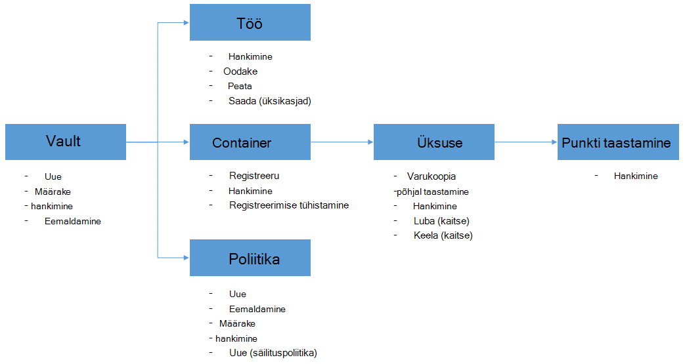

<properties
    pageTitle="Juurutada ja hallata varundamise Azure VMs PowerShelli kaudu | Microsoft Azure'i"
    description="Saate teada, kuidas juurutada ja hallata Azure varukoopia PowerShelli abil"
    services="backup"
    documentationCenter=""
    authors="markgalioto"
    manager="cfreeman"
    editor=""/>

<tags
    ms.service="backup"
    ms.workload="storage-backup-recovery"
    ms.tgt_pltfrm="na"
    ms.devlang="na"
    ms.topic="article"
    ms.date="08/08/2016"
    ms.author="markgal;trinadhk;jimpark" />


# <a name="deploy-and-manage-backup-for-azure-vms-using-powershell"></a>Juurutada ja hallata varundamise Azure VMs PowerShelli abil

> [AZURE.SELECTOR]
- [Ressursihaldur](backup-azure-vms-automation.md)
- [Klassikaline](backup-azure-vms-classic-automation.md)

Selles artiklis kirjeldatakse, kuidas Azure'i PowerShelli kasutamine varundamise ja taastamise Azure VMs. Azure'i on kaks eri juurutamise mudelite loomise ja ressursside töötamine: Resouce juhataja ja klassikaline. Selles artiklis antakse ülevaade klassikaline juurutamise mudeli abil. Microsoft soovitab, et kõige uue juurutuste ressursihaldur mudeli kasutamine.

## <a name="concepts"></a>Mõisted


Sellest artiklist leiate teavet PowerShelli cmdlet-käskude kasutada virtuaalmasinates varundada. Sissejuhatav leiate Azure'i VMs kaitsmise kohta leiate [VM varukoopia taristu Azure kavandamine](backup-azure-vms-introduction.md).

> [AZURE.NOTE] Enne alustamist lugege [eeltingimused](backup-azure-vms-prepare.md) töötada Azure varukoopia ja praeguse VM varukoopia lahendus [piirangud](backup-azure-vms-prepare.md#limitations) .

PowerShelli kasutamine tõhus mõne hetke mõista hierarhia, objektide ja kust alustada.



Kaks kõige olulisemad puhul on kaitse VM lubamine ja andmete taastamine taastamise punkti. Selles artiklis keskendutakse on aitavad teil saada vilunud töötamine PowerShelli cmdlet-käsud lubamiseks neid kahte järgmist stsenaariumi.


## <a name="setup-and-registration"></a>Häälestamine ja
Alustamiseks:

1. [Laadige uusimad PowerShelli](https://github.com/Azure/azure-powershell/releases) (on nõutav vähemalt versioon: 1.0.0)

2. Leida Azure varundus PowerShelli cmdlet-käsud saadaval, tippige järgmine käsk:

```
PS C:\> Get-Command *azurermbackup*

CommandType     Name                                               Version    Source
-----------     ----                                               -------    ------
Cmdlet          Backup-AzureRmBackupItem                           1.0.1      AzureRM.Backup
Cmdlet          Disable-AzureRmBackupProtection                    1.0.1      AzureRM.Backup
Cmdlet          Enable-AzureRmBackupContainerReregistration        1.0.1      AzureRM.Backup
Cmdlet          Enable-AzureRmBackupProtection                     1.0.1      AzureRM.Backup
Cmdlet          Get-AzureRmBackupContainer                         1.0.1      AzureRM.Backup
Cmdlet          Get-AzureRmBackupItem                              1.0.1      AzureRM.Backup
Cmdlet          Get-AzureRmBackupJob                               1.0.1      AzureRM.Backup
Cmdlet          Get-AzureRmBackupJobDetails                        1.0.1      AzureRM.Backup
Cmdlet          Get-AzureRmBackupProtectionPolicy                  1.0.1      AzureRM.Backup
Cmdlet          Get-AzureRmBackupRecoveryPoint                     1.0.1      AzureRM.Backup
Cmdlet          Get-AzureRmBackupVault                             1.0.1      AzureRM.Backup
Cmdlet          Get-AzureRmBackupVaultCredentials                  1.0.1      AzureRM.Backup
Cmdlet          New-AzureRmBackupProtectionPolicy                  1.0.1      AzureRM.Backup
Cmdlet          New-AzureRmBackupRetentionPolicyObject             1.0.1      AzureRM.Backup
Cmdlet          New-AzureRmBackupVault                             1.0.1      AzureRM.Backup
Cmdlet          Register-AzureRmBackupContainer                    1.0.1      AzureRM.Backup
Cmdlet          Remove-AzureRmBackupProtectionPolicy               1.0.1      AzureRM.Backup
Cmdlet          Remove-AzureRmBackupVault                          1.0.1      AzureRM.Backup
Cmdlet          Restore-AzureRmBackupItem                          1.0.1      AzureRM.Backup
Cmdlet          Set-AzureRmBackupProtectionPolicy                  1.0.1      AzureRM.Backup
Cmdlet          Set-AzureRmBackupVault                             1.0.1      AzureRM.Backup
Cmdlet          Stop-AzureRmBackupJob                              1.0.1      AzureRM.Backup
Cmdlet          Unregister-AzureRmBackupContainer                  1.0.1      AzureRM.Backup
Cmdlet          Wait-AzureRmBackupJob                              1.0.1      AzureRM.Backup
```

PowerShelli abil automatiseerida häälestamine ja järgmist:

- Varukoopiate hoidla loomine
- Azure'i varundus teenuse VMs registreerimine

### <a name="create-a-backup-vault"></a>Varukoopiate hoidla loomine

> [AZURE.WARNING] Klientidele, kes kasutavad Azure varukoopia esimest korda, peate registreeruma Azure varukoopia pakkuja koos teie tellimus. Seda saab teha, käivitage järgmine käsk: Register-AzureRmResourceProvider - ProviderNamespace "Microsoft.Backup"

Saate luua uue varukoopiate hoidla cmdlet-käsu **New-AzureRmBackupVault** abil. Varukoopiate hoidla on ARM ressurss, seega peate aset ressursirühma. Laiendatud Azure PowerShelli konsooli, käivitage järgmine käsk:

```
PS C:\> New-AzureRmResourceGroup –Name “test-rg” –Location “West US”
PS C:\> $backupvault = New-AzureRmBackupVault –ResourceGroupName “test-rg” –Name “test-vault” –Region “West US” –Storage GeoRedundant
```

Antud tellimuse **Get-AzureRmBackupVault** cmdlet-käsu abil saate avada varukoopia võlvid loendit.

> [AZURE.NOTE] See on mugav talletamiseks varukoopiate hoidla objekti üheks muutujat. Vault objekt on vaja sisendina jaoks paljud Azure varukoopia cmdlet-käsud.


### <a name="registering-the-vms"></a>VMs registreerimine
Esimene samm konfigureerimise abil Azure varukoopia varundus on Registreerige oma arvuti või VM on Azure varukoopiate hoidla. **Register-AzureRmBackupContainer** cmdlet võtab mõne Azure'i IaaS virtuaalse masina sisend andmeid ja registreerib selle määratud vault. Registri toimingu Azure virtuaalse masina seostab varukoopiate hoidla ja rajad VM varukoopia elutsükli kaudu.

Registreerimisel oma VM Azure varukoopia teenuse loob ülataseme container objekti. Ümbris tavaliselt sisaldab mitut üksust, mida saab varundada, kuid VMs puhul saab ainult ühe varukoopia üksuse jaoks ümbris.

```
PS C:\> $registerjob = Register-AzureRmBackupContainer -Vault $backupvault -Name "testvm" -ServiceName "testvm"
```

## <a name="backup-azure-vms"></a>Varukoopia Azure VMs

### <a name="create-a-protection-policy"></a>Kaitse poliitika loomine
See ei ole kohustuslik alustamiseks varukoopia oma vms kaitse uue poliitika loomiseks. Vault on "vaikimisi poliitika' saab kasutada kiiresti kaitse ja seejärel redigeerida hiljem õige üksikasjad. Saate loendi saadaval autoriloomingut poliitikate abil **Get-AzureRmBackupProtectionPolicy** cmdlet-käsk:

```
PS C:\> Get-AzureRmBackupProtectionPolicy -Vault $backupvault

Name                      Type               ScheduleType       BackupTime
----                      ----               ------------       ----------
DefaultPolicy             AzureVM            Daily              26-Aug-15 12:30:00 AM
```

> [AZURE.NOTE] Ajavöönd BackupTime välja PowerShellis on UTC. Juhul, kui varundamise kellaaeg kuvatakse Azure'i portaalis, soovitud ajavöönd on joondatud oma UTC-ajavahe koos kohalik süsteem.

Varukoopia poliitika on seotud vähemalt üks säilituspoliitika. Säilituspoliitika määratleb, kui kaua taastamine punkti hoitakse Azure'i varundamise. Cmdlet-käsu **New-AzureRmBackupRetentionPolicy** loob PowerShelli objektide reguleerivad säilituspoliitika teave. Sisendina cmdlet-käsu *New-AzureRmBackupProtectionPolicy* või *Luba-AzureRmBackupProtection* cmdletiga kasutatakse neid säilituspoliitika rühmapoliitika objektid.

Varukoopia poliitika määratleb, millal ja kuidas üksuse varundamine on lõpule jõudnud. Cmdlet-käsu **New-AzureRmBackupProtectionPolicy** loob PowerShelli objekt, mis varukoopia teave. *Luba-AzureRmBackupProtection* cmdlet sisendina kasutatakse varukoopia poliitika.

```
PS C:\> $Daily = New-AzureRmBackupRetentionPolicyObject -DailyRetention -Retention 30
PS C:\> $newpolicy = New-AzureRmBackupProtectionPolicy -Name DailyBackup01 -Type AzureVM -Daily -BackupTime ([datetime]"3:30 PM") -RetentionPolicy $Daily -Vault $backupvault

Name                      Type               ScheduleType       BackupTime
----                      ----               ------------       ----------
DailyBackup01             AzureVM            Daily              01-Sep-15 3:30:00 PM
```

### <a name="enable-protection"></a>Kaitse lubamine
Kaitse lubamine hõlmab kahte objektide – üksuse ja poliitika, ja mõlemad on vaja sama vault kuuluvad. Kui poliitika on seostatud üksus, algavad varukoopia töövoo aastal määratletud ajakava.

```
PS C:\> Get-AzureRmBackupContainer -Type AzureVM -Status Registered -Vault $backupvault | Get-AzureRmBackupItem | Enable-AzureRmBackupProtection -Policy $newpolicy
```

### <a name="initial-backup"></a>Algne varundamine
Varunduse ajakava hoolitseb seda esialgse täieliku eksemplari üksuse ja selle suureneva edaspidised varukoopiaid. Juhul, kui soovite algse varukoopia juhtub teatud ajal või isegi kohe siis kasutada **Varundus-AzureRmBackupItem** cmdlet-käsk:

```
PS C:\> $container = Get-AzureRmBackupContainer -Vault $backupvault -Type AzureVM -Name "testvm"
PS C:\> $backupjob = Get-AzureRmBackupItem -Container $container | Backup-AzureRmBackupItem
PS C:\> $backupjob

WorkloadName    Operation       Status          StartTime              EndTime
------------    ---------       ------          ---------              -------
testvm          Backup          InProgress      01-Sep-15 12:24:01 PM  01-Jan-01 12:00:00 AM
```

> [AZURE.NOTE] Väljade näidatud PowerShelli StartTime ja EndTime ajavöönd on UTC. Juhul, kui sarnaseid teave on esitatud Azure portaali, joondatakse soovitud ajavöönd kellaaja kohalik süsteem.

### <a name="monitoring-a-backup-job"></a>Varundustöö jälgimine
Enamik toiminguid Azure varukoopia on kujundatud tööd. See on lihtne ilma säilitada Azure portaali edenemise jälgimiseks avatud igal ajal.

Viimane on pooleli töö oleku saamiseks kasutage **Get-AzureRmBackupJob** cmdlet-käsk.

```
PS C:\> $joblist = Get-AzureRmBackupJob -Vault $backupvault -Status InProgress
PS C:\> $joblist[0]

WorkloadName    Operation       Status          StartTime              EndTime
------------    ---------       ------          ---------              -------
testvm          Backup          InProgress      01-Sep-15 12:24:01 PM  01-Jan-01 12:00:00 AM
```

Selle asemel, et need tööd lõpetamise - st mittevajalike ja täiendavad kood - Küsitlused on lihtsam **Ootamine-AzureRmBackupJob** cmdlet-käsu kasutamine. Skripti kasutamisel, viige cmdlet-käsu täitmine kuni kas töö lõpulejõudmist või määratud ajalõpu väärtust on jõudnud.

```
PS C:\> Wait-AzureRmBackupJob -Job $joblist[0] -Timeout 43200
```


## <a name="restore-an-azure-vm"></a>Azure'i VM taastamine

Varundatud andmete taastamine, peate varundatud üksuse ja taastamise punkt, mis hoiab punkti /-kellaaja andmete tuvastamiseks. Selle teabe taastamine-AzureRmBackupItem cmdlet algatada taastamine andmete soovitud hoidlast kliendi kontole.

### <a name="select-the-vm"></a>Valige VM

PowerShelli objekti, mis tuvastab paremale varukoopia üksuse saamiseks peate alustada Container autoriloomingut ja tööd teed alla objekti hierarhia. Valige ümbris, mis tähistab VM, **Get-AzureRmBackupContainer** cmdlet-käsu kasutamine ja toru mis **Get-AzureRmBackupItem** cmdlet-i.

```
PS C:\> $backupitem = Get-AzureRmBackupContainer -Vault $backupvault -Type AzureVM -name "testvm" | Get-AzureRmBackupItem
```

### <a name="choose-a-recovery-point"></a>Valige punkti taastamine

Nüüd saate loendis taastamise punkte varukoopia üksuse **Get-AzureRmBackupRecoveryPoint** cmdlet-käsu abil ja valige taastamine punkti taastada. Tavaliselt valige kasutajate loendi viimase *AppConsistent* punkti.

```
PS C:\> $rp =  Get-AzureRmBackupRecoveryPoint -Item $backupitem
PS C:\> $rp

RecoveryPointId    RecoveryPointType  RecoveryPointTime      ContainerName
---------------    -----------------  -----------------      -------------
15273496567119     AppConsistent      01-Sep-15 12:27:38 PM  iaasvmcontainer;testvm;testv...
```

Muutuja ```$rp``` massiivi taastamise punkte on valitud varukoopia üksus, sorditud vastupidises järjekorras aja-uusimate taastamine punkt on index 0. Standard PowerShelli massiiv indekseerimise abil saate valida taastamine punkti. Näide: ```$rp[0]``` valib taastamine Viimane punkt.

### <a name="restoring-disks"></a>Ketast taastamine

On oluline vahe taastamine toiminguid teha Azure portaali kaudu ja Azure PowerShelli kaudu. PowerShelli, peatub taastetoimingu taastamine ketast ja config teabe põhjal taastamine punkti. See ei Loo virtuaalse masina.

> [AZURE.WARNING] Taastamine-AzureRmBackupItem ei loo VM. See taastab ainult selle ketast määratud salvestusruumi konto. See pole samalaadne käitumine ilmneb Azure portaalis.

```
PS C:\> $restorejob = Restore-AzureRmBackupItem -StorageAccountName "DestAccount" -RecoveryPoint $rp[0]
PS C:\> $restorejob

WorkloadName    Operation       Status          StartTime              EndTime
------------    ---------       ------          ---------              -------
testvm          Restore         InProgress      01-Sep-15 1:14:01 PM   01-Jan-01 12:00:00 AM
```

Saate abil **Get-AzureRmBackupJobDetails** cmdlet-käsk Taasta töö täidetud taastetoimingu üksikasju. Atribuut *ErrorDetails* on taastada VM vajalik teave.

```
PS C:\> $restorejob = Get-AzureRmBackupJob -Job $restorejob
PS C:\> $details = Get-AzureRmBackupJobDetails -Job $restorejob
```

### <a name="build-the-vm"></a>VM koostamine

Koostamise VM välja taastatud ketast saab teha kasutamine vanem Azure teenuse haldus PowerShelli cmdletid, Azure'i ressursihaldur uusi malle, või isegi kasutades Azure portaali. Lihtne näide, näitame sattusid Azure'i Teenusehaldus cmdlettide kasutamise kohta.

```
 $properties  = $details.Properties

 $storageAccountName = $properties["Target Storage Account Name"]
 $containerName = $properties["Config Blob Container Name"]
 $blobName = $properties["Config Blob Name"]

 $keys = Get-AzureStorageKey -StorageAccountName $storageAccountName
 $storageAccountKey = $keys.Primary
 $storageContext = New-AzureStorageContext -StorageAccountName $storageAccountName -StorageAccountKey $storageAccountKey


 $destination_path = "C:\Users\admin\Desktop\vmconfig.xml"
 Get-AzureStorageBlobContent -Container $containerName -Blob $blobName -Destination $destination_path -Context $storageContext


$obj = [xml](((Get-Content -Path $destination_path -Encoding UniCode)).TrimEnd([char]0x00))
 $pvr = $obj.PersistentVMRole
 $os = $pvr.OSVirtualHardDisk
 $dds = $pvr.DataVirtualHardDisks
 $osDisk = Add-AzureDisk -MediaLocation $os.MediaLink -OS $os.OS -DiskName "panbhaosdisk"
 $vm = New-AzureVMConfig -Name $pvr.RoleName -InstanceSize $pvr.RoleSize -DiskName $osDisk.DiskName

 if (!($dds -eq $null))
 {
     foreach($d in $dds.DataVirtualHardDisk)
     {
         $lun = 0
         if(!($d.Lun -eq $null))
         {
             $lun = $d.Lun
         }
         $name = "panbhadataDisk" + $lun
     Add-AzureDisk -DiskName $name -MediaLocation $d.MediaLink
     $vm | Add-AzureDataDisk -Import -DiskName $name -LUN $lun
    }
}

New-AzureVM -ServiceName "panbhasample" -Location "SouthEast Asia" -VM $vm
```

Lugege lisateavet selle kohta, kuidas koostada VM kaudu taastatud ketast järgmised cmdlet-käsud:

- [Lisage AzureDisk](https://msdn.microsoft.com/library/azure/dn495252.aspx)
- [Uue AzureVMConfig](https://msdn.microsoft.com/library/azure/dn495159.aspx)
- [Uue AzureVM](https://msdn.microsoft.com/library/azure/dn495254.aspx)

## <a name="code-samples"></a>Koodinäiteid

### <a name="1-get-the-completion-status-of-job-sub-tasks"></a>1. saada lõpetamise olekut sub tööülesanded

Lõpetatusoleku sub üksikute tööülesannete jälgimiseks saate **Get-AzureRmBackupJobDetails** cmdlet-käsk:

```
PS C:\> $details = Get-AzureRmBackupJobDetails -JobId $backupjob.InstanceId -Vault $backupvault
PS C:\> $details.SubTasks

Name                                                        Status
----                                                        ------
Take Snapshot                                               Completed
Transfer data to Backup vault                               InProgress
```

### <a name="2-create-a-dailyweekly-report-of-backup-jobs"></a>2 päeva/nädala aruande varukoopia töökohtade loomine

Administraatorid tavaliselt soovite teada, mis varundamise parandusfunktsiooni viimase 24 tunni jooksul nende varukoopia tööde oleku. Lisaks edastatavate andmete maht annab administraatorid viis prognoosimiseks nende iga kuu andmete kasutamist. Allpool skripti tõmbab toorandmetega teenusest Azure varukoopia ja kuvatakse teave PowerShelli konsooli.

```
param(  [Parameter(Mandatory=$True,Position=1)]
        [string]$backupvaultname,

        [Parameter(Mandatory=$False,Position=2)]
        [int]$numberofdays = 7)


#Initialize variables
$DAILYBACKUPSTATS = @()
$backupvault = Get-AzureRmBackupVault -Name $backupvaultname
$enddate = ([datetime]::Today).AddDays(1)
$startdate = ([datetime]::Today)

for( $i = 1; $i -le $numberofdays; $i++ )
{
    # We query one day at a time because pulling 7 days of data might be too much
    $dailyjoblist = Get-AzureRmBackupJob -Vault $backupvault -From $startdate -To $enddate -Type AzureVM -Operation Backup
    Write-Progress -Activity "Getting job information for the last $numberofdays days" -Status "Day -$i" -PercentComplete ([int]([decimal]$i*100/$numberofdays))

    foreach( $job in $dailyjoblist )
    {
        #Extract the information for the reports
        $newstatsobj = New-Object System.Object
        $newstatsobj | Add-Member -Type NoteProperty -Name Date -Value $startdate
        $newstatsobj | Add-Member -Type NoteProperty -Name VMName -Value $job.WorkloadName
        $newstatsobj | Add-Member -Type NoteProperty -Name Duration -Value $job.Duration
        $newstatsobj | Add-Member -Type NoteProperty -Name Status -Value $job.Status

        $details = Get-AzureRmBackupJobDetails -Job $job
        $newstatsobj | Add-Member -Type NoteProperty -Name BackupSize -Value $details.Properties["Backup Size"]
        $DAILYBACKUPSTATS += $newstatsobj
    }

    $enddate = $enddate.AddDays(-1)
    $startdate = $startdate.AddDays(-1)
}

$DAILYBACKUPSTATS | Out-GridView
```

Kui soovite lisada diagrammifunktsioonide selle aruande väljundi, õppida TechNeti ajaveebipostituse [Charting PowerShelli abil](http://blogs.technet.com/b/richard_macdonald/archive/2009/04/28/3231887.aspx)

## <a name="next-steps"></a>Järgmised sammud

Kui eelistate PowerShelli abil saate suhelda oma Azure ressursse, lugege teemat PowerShelli artiklis kaitsmine Windows Server, [Deploy ja hallata varundamise Windows Server](./backup-client-automation-classic.md). Olemas on ka PowerShelli artiklis haldamise DPM varukoopiate, [Deploy ja DPM varundus haldamine](./backup-dpm-automation-classic.md). Mõlemad nendest artiklitest on ressursihaldur juurutuste samuti klassikaline juurutuste versiooni.
