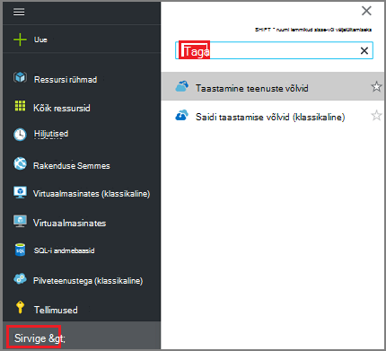
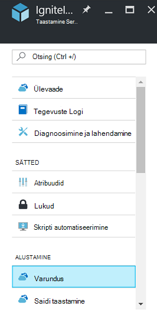
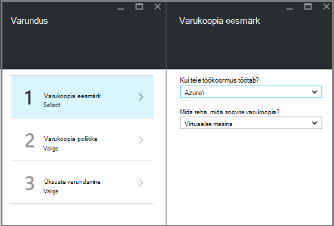
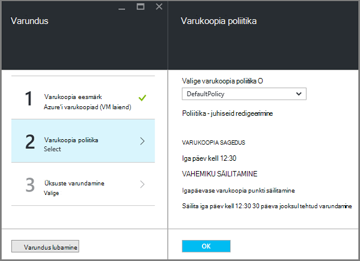
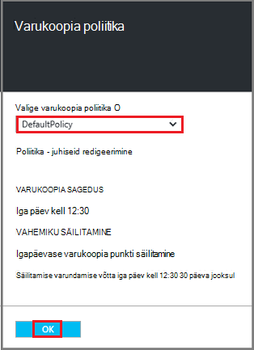
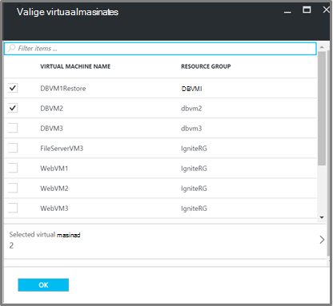
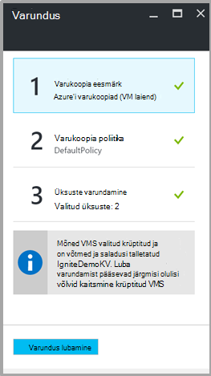

<properties
   pageTitle="Varundus ja taaste krüptitud VMs Azure'i varundamise"
   description="Selles artiklis kirjeldatakse varundamine ja taastamine kogemus VMs krüptitud Azure'i ketas."
   services="backup"
   documentationCenter=""
   authors="JPallavi"
   manager="vijayts"
   editor=""/>
<tags
   ms.service="backup"
   ms.devlang="na"
   ms.topic="article"
   ms.tgt_pltfrm="na"
   ms.workload="storage-backup-recovery"
   ms.date="10/25/2016"
   ms.author="markgal; jimpark; trinadhk"/>

# Varundus ja taaste krüptitud VMs Azure'i varundamise

Selles artiklis kirjeldatakse varundus ja taaste abil varukoopia Azure'i virtuaalmasinates juhiseid. See sisaldab ka veaväärtuse juhul üksikasjade toetatud stsenaariumid, eeltingimused ja tõrkeotsingutoiminguid.

## Toetatud stsenaariumid

> [AZURE.NOTE]
1.  Varundus ja taaste krüptitud vms on toetatud ainult juurutatud ressursihaldur virtuaalmasinates. See klassikaline virtuaalmasinates ei toetata.  
2.  See on toetatud ainult krüptitud BitLockeri krüptimise klahvi ja klahvi krüptovõtme virtuaalmasinates. See on krüptitud BitLockeri krüptovõtme ainult virtuaalmasinates ei toetata.  

## Eeltingimused

1.  Virtuaalse masina krüptitud [Azure'i ketta krüptimise](../security/azure-security-disk-encryption.md)abil. Olema krüptitud BitLockeri krüptovõtme ja klahvi krüptovõtme abil.
2.  Taastamise teenuste hoidla on loodud ja salvestusruumi dispersioonanalüüs seadmine kasutamise [ettevalmistamine varundamise keskkonna](backup-azure-arm-vms-prepare.md)artiklis kirjeldatud juhiseid.

## Varundus krüptitud VM
Järgmiste juhiste abil määrata varukoopia eesmärk, määratleda poliitika, üksused ja päästik varundamise konfigureerimine.

### Varundus konfigureerimine

1. Kui teil on juba taastamise teenused võlvkelder avamine, jätkake järgmise juhisega. Kui te ei saa taastamise teenused, võlvkelder avatud, kuid on Azure portaalis menüü keskuses nuppu **Sirvi**.

  - Tippige väljale ressursid loendis **Taastamise teenused**.
  - Kui alustate tippimist, loendi filtrid põhjal sisendit. Kui näete **taastamise teenused võlvid**, klõpsake seda.
  
        

    Kuvatakse loend taastamise teenused võlvid. Valige loendist taastamise teenused võlvid võlvkelder.

    Avab valitud vault armatuurlaud.

2. Üksuste loend, mis kuvatakse jaotises vault, klõpsake nuppu **varundus** varukoopia tera avamiseks.

       
    
3. Enne varukoopia, klõpsake **varundamise eesmärk** varundamise eesmärk tera avamiseks.

       
    
4.   Enne varukoopia eesmärk, määrata **kus töötab teie töökoormus** Azure ja **mida teha, mida soovite varukoopia** virtuaalse masina, seejärel klõpsake nuppu **OK**.

    Varundamise eesmärk tera suletakse ja varundamise poliitika tera.

       

5. Enne varukoopia poliitika, valige varukoopia poliitika, mida soovite rakendada vault ja klõpsake nuppu **OK**.

       

    Vaikepoliitika üksikasjad on loetletud üksikasjad. Kui soovite poliitika loomiseks, valige rippmenüüst menüü **Loo uus** . Pärast nupu **OK**klõpsamist varukoopia poliitika on seostatud vault.

    Valige järgmine VMs vault seostada.
    
6. Valige krüptitud virtuaalmasinates seostada määratud poliitika ja klõpsake nuppu **OK**.

      
   
7. Sellel lehel kuvatakse valitud krüptitud vms seotud võtme vault sõnum. Varukoopia teenus nõuab võtmed ja saladusi võtme võlvkelder kirjutuskaitstud juurdepääsu. Kasutab järgmisi õigusi varukoopia võti ja salajane koos seotud VMs. 

      

      Nüüd, kui olete määratlenud võlvkelder varundamise tera kõik sätted nuppu Luba varundamise lehe allosas. Luba varundamise juurutamine poliitika on hoidla ja VMs.

8. Järgmise etapi ettevalmistamisel on installimise VM Agent või veenduge, et VM Agent on installitud. Sama, kasutage [ettevalmistamine varundamise keskkonna](backup-azure-arm-vms-prepare.md)artiklis kirjeldatud juhiseid. 

### Varundustöö käivitamise
Järgige juhiseid artiklis [Varukoopia Azure'i VMs taastamise teenuste hoidla](backup-azure-arm-vms.md) päästik detailse mainitud.

## Krüptitud VM taastamine
Krüptitud ja mitte-krüptitud virtuaalmasinates taastamine kogemus on sama. Mainitud [taastamine portaalis Azure'i virtuaalmasinates](backup-azure-arm-restore-vms.md) juhiste abil saate taastada krüptitud VM. Juhuks, kui soovite taastada, võtmed ja saladused, veenduge, et klahv vault taastamise peaks juba olemas.

## Tõrkeotsing

| Toiming | Tõrke üksikasjade | Eraldusvõime |
| -------- | -------- | -------|
| Varundus | Valideerimine nurjus, nagu BEK eraldi virtuaalse masina on krüptitud. Varukoopiate saab lubada ainult krüptitud nii BEK ja KEK virtuaalmasinates. | Virtuaalse masina peaks krüptitud BEK ja KEK abil. Pärast seda, peaks olema lubatud varukoopia. |
| Taastamine | Selle krüptitud VM ei saa taastada, kuna võtme vault seostatud selle VM pole olemas. | Saate luua võtme vault kasutamise [Alustamine Azure'i klahvi Vault](../key-vault/key-vault-get-started.md). Lugege artiklit [taastamine võtme vault võti ja Azure varundamise salajane](backup-azure-restore-key-secret.md) võti ja salajane taastada, kui nad pole. |
| Taastamine | Selle krüptitud VM ei saa taastada, kuna võti ja seostatud selle VM salajane pole olemas. | Lugege artiklit [taastamine võtme vault võti ja Azure varundamise salajane](backup-azure-restore-key-secret.md) võti ja salajane taastada, kui nad pole. |
