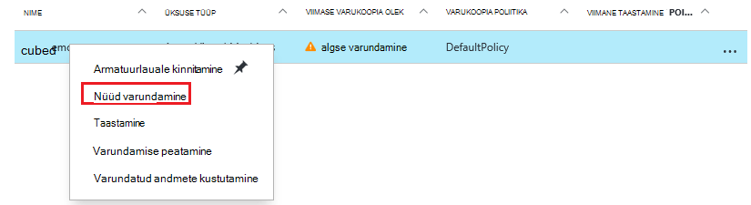

<properties
    pageTitle="Tutvustus: kaitsta Azure VMs taastamise teenuste hoidla | Microsoft Azure'i"
    description="Kaitse Azure VMs taastamise teenuste hoidla. Andmete kaitsmine varukoopiate ressursihaldur juurutatud VMs, klassikaline juurutatud VMs ja Premium salvestusruumi VMs abil. Luua ja registreerida taastamise teenuste hoidla. Registreerida VMs, poliitika loomine ja kaitsmine Azure VMs."
    services="backup"
    documentationCenter=""
    authors="markgalioto"
    manager="cfreeman"
    editor=""
    keyword="backups; vm backup"/>

<tags
    ms.service="backup"
    ms.workload="storage-backup-recovery"
    ms.tgt_pltfrm="na"
    ms.devlang="na"
    ms.topic="hero-article"
    ms.date="10/13/2016"
    ms.author="markgal; jimpark"/>

# Tutvustus: kaitsta Azure VMs taastamise teenuste hoidla

> [AZURE.SELECTOR]
- [Kaitsta VMs taastamise teenuste hoidla](backup-azure-vms-first-look-arm.md)
- [Varukoopiate hoidla VMs kaitsta](backup-azure-vms-first-look.md)

Selle õpetuse juhatab teid läbi juhiseid taastamise teenuste hoidla loomise ja varundada Azure virtuaalse masina (VM). Taastamine teenuste võlvid kaitse:

- Azure'i ressursihaldur juurutatud VMs
- Klassikaline VMs
- Standardse salvestusruumi VMs
- Premium mälu VMs
- Krüptitud Azure'i ketas, BEK ja KEK VMs

Premium salvestusruumi VMs kaitsmise kohta leiate lisateavet teemast [varundamine ja taastamine Premium salvestusruumi VMs](backup-introduction-to-azure-backup.md#back-up-and-restore-premium-storage-vms)

>[AZURE.NOTE] Selle õpetuse eeldab, et teil on juba VM Azure tellimuse ja, et teil on võtnud varukoopia teenuse VM juurdepääsu lubamine.

[AZURE.INCLUDE [learn-about-Azure-Backup-deployment-models](../../includes/backup-deployment-models.md)]

Kõrge, siin on toimingud, mida saate lõpule viia.  

1. Looge taastamise teenuste hoidla VM.
2. Valige stsenaarium, poliitika määramine ja kaitsmiseks üksuste tuvastamine Azure portaali abil.
3. Käivitage algse varukoopia.

## VM taastamise teenuste hoidla loomine

Taastamise teenuste hoidla on üksus, mis salvestab varukoopiate ja taastamise punkte, mis on loodud aja jooksul. Taastamise teenuste hoidla sisaldab ka varukoopia kaitstud VMs rakendatud poliitika.

>[AZURE.NOTE] Varundada VMs on kohalik protsess. Te ei saa varundada VMs ühest kohast taastamise teenuste hoidla teise asukohta. Nii, et iga Azure'i kohta, kus on VMs varundada, vähemalt üks taastamise teenuste hoidla peab olemas asukohta.

Taastamise teenuste hoidla loomiseks tehke järgmist.

1. [Azure'i portaali](https://portal.azure.com/)sisse logida.

2. Jaoturi menüü, klõpsake nuppu **Sirvi** ja tippige ressursid loendis **Taastamise teenused**. Kui alustate tippimist, loendi filtrid põhjal sisendit. Klõpsake **taastamise teenused vault**.

      

    Kuvatakse taastamine teenuste võlvid loendit.

3. Menüü **võlvid taastamise teenused** nuppu **Lisa**.

    

    Avaneb taastamise teenused vault tera, mis palub teil esitada **nimi**, **tellimuse**, **ressursirühm**ja **asukohaga**.

    

4. Sisestage **nimi**sõbralik nimi, mis tähistavad vault. Nimi peab olema kordumatu Azure tellimuse jaoks. Tippige nimi, mis sisaldab 2 – 50 märki. See peab algama tähega ja võib sisaldada ainult tähti, numbreid ja sidekriipse.

5. Klõpsake **tellimuse** saadaolevate tellimuste loendi kuvamiseks. Kui te pole kindel, milline tellimus kasutada, kasutage vaikeväärtust (või soovitatud) tellimus. Ainult juhul, kui ettevõtte konto on seotud mitme Azure'i tellimused on mitu valikuid.

6. **Ressursirühm** on saadaval loendi kuvamiseks klõpsake või loomiseks klõpsake käsku **Uus** ressursirühma. Ressursi rühmade kohta, leiate [Azure'i ressursihaldur ülevaade](../azure-resource-manager/resource-group-overview.md)

7. Klõpsake **asukoha** valimiseks piirkonnas vault jaoks. Vault **peab** asuma samas piirkonnas virtuaalmasinates, mida soovite kaitsta.

    >[AZURE.IMPORTANT] Kui olete kindel, asukoht, kus teie VM olemas, välja vault loomise dialoogiboks sulgege ja minge portaali Virtuaalmasinates loendit. Kui teil on mitu piirkondades virtuaalmasinates, luua iga piirkonna taastamise teenuste hoidla. Looge vault esimene asukoht enne järgmise asukohta. Ei ole vaja määramiseks salvestusruumi kontod varukoopia andmete--taastamise teenuste hoidla talletamiseks ja Azure varukoopia teenuse teeb seda automaatselt.

8. Klõpsake nuppu **Loo**. Võib kuluda aega taastamise teenuste hoidla luua. Jälgida Olekuteatised portaalis paremas ülanurgas alal. Kui teie vault on loodud, kuvatakse see taastamine teenuste võlvid loendit.

    

Nüüd, kui olete loonud oma vault, saate teada, kuidas määrata salvestusruumi kopeerimine.

### Seadmine salvestusruumi Dispersioonanalüüs

Salvestusruumi dispersioonanalüüs suvand võimaldab teil valida geograafilise liigne ja kohalikult liigsed. Vaikimisi on teie vault geograafilise liigne salvestusruumi. Jätke suvand, kui see peamine varukoopia geograafilise liigne salvestusruumi väärtuseks. Valige kohalik liigsete salvestusruumi, kui soovite odavamad, mis pole nii püsival. Lisateavet [geograafilise liigne](../storage/storage-redundancy.md#geo-redundant-storage) ja [kohalikult liigsete](../storage/storage-redundancy.md#locally-redundant-storage) talletamise võimalused [Azure Storage dispersioonanalüüs ülevaade](../storage/storage-redundancy.md).

Salvestusruumi dispersioonanalüüs säte redigeerimiseks tehke järgmist.

1. Valige oma vault avamiseks vault armatuurlaua ning tera sätted. Kui tera **sätted** ei avane, klõpsake vault armatuurlaua **Kõik sätted** .

2. Enne **sätted** , klõpsake nuppu **Varundus taristu** > **Varukoopia konfiguratsiooni** **Varukoopia konfiguratsiooni** tera avamiseks. Enne **Varukoopia konfiguratsiooni** , valige oma vault salvestusruumi dispersioonanalüüs suvandi.

    

    Pärast valides oma vault salvestusruumi suvandi, olete valmis vault VM seostada. Kõigepealt seost, tuleks leida ja Azure'i virtuaalmasinates registreerida.

## Valige varukoopia eesmärk, poliitika määramine ja kaitsmiseks üksuste määratlemine

Enne registreerumist võlvkelder VM, käivitage discovery uue virtuaalmasinates, mis on lisatud tellimuse registreerida. Protsessi päringute Azure'i virtuaalmasinates tellimus, koos täiendavat teavet loendi nagu cloud teenuse nimi ja piirkonna. Azure'i portaalis stsenaariumi viitab kavatsete kasutusele võtta taastamise teenuste hoidla. Poliitika on ajakava võetakse sageduse ja kui taastamise punkte. Poliitika sisaldab ka erinevatele taastamise punktid.

1. Kui teil on juba taastamise teenused, avage vault, jätkake juhisega 2. Kui teil pole enam teenuste võlvkelder avatud, kuid on Azure portaalis menüü jaoturi, klõpsake nuppu **Sirvi**.

  - Tippige väljale ressursid loendis **Taastamise teenused**.
  - Kui alustate tippimist, loendi filtrid põhjal sisendit. Kui näete **taastamise teenused võlvid**, klõpsake seda.

      

    Kuvatakse võlvid taastamine teenuste loend.
  - Valige loendist taastamine teenuste võlvid, võlvkelder.

    Avab valitud vault armatuurlaud.

    

2. Klõpsake menüü vault armatuurlaua **varundamise** varundamise tera avamiseks.

    

    Tera avamisel otsib varundamise teenuse ühtegi VMs uus tellimus.

    

3. Enne varukoopia, klõpsake **varundamise eesmärk** varundamise eesmärk tera avamiseks.

    

4. Enne varukoopia eesmärk, määrata **kus töötab teie töökoormus** Azure ja **mida teha, mida soovite varukoopia** virtuaalse masina, seejärel klõpsake nuppu **OK**.

    Varundamise eesmärk tera suletakse ja varundamise poliitika tera.

    

5. Enne varukoopia poliitika, valige varukoopia poliitika, mida soovite rakendada vault ja klõpsake nuppu **OK**.

    

    Vaikepoliitika üksikasjad on loetletud üksikasjad. Kui soovite poliitika loomiseks, valige rippmenüüst menüü **Loo uus** . Rippmenüüst menüü võimaldab ka aeg, millal hetktõmmis tehtud – 19.00 aktiveerimine. Juhised varukoopia poliitika määratlemise kohta leiate teemast [varukoopia poliitikast](backup-azure-vms-first-look-arm.md#defining-a-backup-policy). Pärast nupu **OK**klõpsamist varukoopia poliitika on seostatud vault.

    Valige järgmine VMs vault seostada.

6. Valige soovitud virtuaalmasinates seostada määratud poliitika ja klõpsake nuppu **Vali**.

    

    Kui te ei näe soovitud VM, kontrollige, kas see on olemas taastamise teenused vault Azure samasse asukohta.

7. Nüüd, kui olete määratlenud võlvkelder varundamise tera kõik sätted nuppu **Luba varundamise** lehe allosas. See juurutamine poliitika on hoidla ja VMs.

    

## Algne varundamine

Kui virtual arvutisse, mis ei tähenda varukoopia poliitika kasutusele võetud andmed on varundada. Vaikimisi on esimene ajastatud varundus (nagu on määratletud varukoopia poliitika) algse varukoopia. Kuni algse varundamise ilmneb, viimase varukoopia oleku **Varundamise** enne näitab **hoiatus (algse varukoopia ootel)**.

Kui algset varukoopia on tähtaja kiiresti alustada, on soovitatav **Varunda kohe**käivitada.

**Nüüd varundamine**käivitamiseks tehke järgmist.

1. Klõpsake paani **varundamise** armatuurlaual vault **Azure'i Virtuaalmasinates**  
    

    **Varundus üksuste** tera avaneb.

2. Enne **Üksuste varundamine** , paremklõpsake vault, mida soovite varundada, ja klõpsake käsku **varundus kohe**.

    

    Käivitatakse varundus töö.  

    

3. Vaadata, et algne varukoopia on lõppenud, armatuurlaual vault **Varundamise** paanil klõpsake **Azure'i virtuaalmasinates**.

    

    Varundus töö tera avaneb.

4. Varundus töö tera, näete kõiki töid olekut.

    

    >[AZURE.NOTE] Varukoopia toimingu osana Azure varukoopia teenus annab käsu varukoopia laiendamine iga VM tühjendage Alustuseks kõik kirjutab ja ühtsete hetktõmmis.

    Varundustöö lõpetades olek on *lõpule viidud*.

[AZURE.INCLUDE [backup-create-backup-policy-for-vm](../../includes/backup-create-backup-policy-for-vm.md)]

## Virtuaalse masina VM agendi installimine

See teave on esitatud juhuks, kui see on vajalik. Azure'i VM Agent peab olema installitud Azure virtuaalne arvutisse varundamise pikendamise töötamiseks. Juhul, kui teie VM loodi Azure galeriist, siis VM Agent on juba olemas virtuaalse masina. VMs, mis migreeritakse kohapealse andmekeskuste oleks ei VM Agent installitud. Sellisel juhul VM Agent peab olema installitud. Kui teil on probleeme Azure VM varundada, kontrollige, et Azure VM Agent on õigesti virtual arvutisse installitud (vt järgmine tabel). Kui loote kohandatud VM, [veenduge, et oleks märgitud ruut **installida VM Agent** ](../virtual-machines/virtual-machines-windows-classic-agents-and-extensions.md) enne virtuaalse masina on ette valmistatud.

Lisateavet [VM Agent](https://go.microsoft.com/fwLink/?LinkID=390493&clcid=0x409) ja [Kuidas seda installida](../virtual-machines/virtual-machines-windows-classic-manage-extensions.md).

Järgmine tabel annab Lisateavet VM Agent for Windows ja Linux VMs.

| **Toiming** | **Windows** | **Linux** |
| --- | --- | --- |
| Installimise VM Agent | <li>Laadige alla ja installige [agent MSI](http://go.microsoft.com/fwlink/?LinkID=394789&clcid=0x409). Peate installimise lõpuleviimiseks administraatoriõigused. <li>[VM atribuudi värskendamiseks](http://blogs.msdn.com/b/mast/archive/2014/04/08/install-the-vm-agent-on-an-existing-azure-vm.aspx) , näitamaks, et ta on installitud. | <li> Installige uusim [Linux agent](https://github.com/Azure/WALinuxAgent) GitHub. Peate installimise lõpuleviimiseks administraatoriõigused. <li> [VM atribuudi värskendamiseks](http://blogs.msdn.com/b/mast/archive/2014/04/08/install-the-vm-agent-on-an-existing-azure-vm.aspx) , näitamaks, et ta on installitud. |
| VM Agent värskendamine | Värskendamise VM Agent on sama lihtne nagu [VM Agent kahendfaile](http://go.microsoft.com/fwlink/?LinkID=394789&clcid=0x409)taasinstallimine.  Veenduge, et ilma varukoopia toiming töötab VM agent värskendamise ajal. | Järgige [Linux VM Agent värskendamise ](../virtual-machines-linux-update-agent.md)kohta.  Veenduge, et ilma varukoopia toiming töötab VM Agent värskendamise ajal. |
| VM agendi installimise kontrollimine | <li>Liikuge kausta *C:\WindowsAzure\Packages* Azure VM. <li>Tuleb leida WaAppAgent.exe faili esitus.<li> Paremklõpsake faili, valige **Atribuudid**ja seejärel valige vahekaart **üksikasjad** . Toote versioon välja peaks olema 2.6.1198.718 või uuem versioon. | N/A |

### Varukoopia laiend

Kui virtual arvutisse on installitud VM Agent, installib Azure varukoopia teenuse varukoopia laiend VM Agent. Azure'i varukoopia teenuse sujuvalt uuendab ja plaastrid varukoopia laiend täiendavad kasutaja sekkumiseta.

Varukoopia laiend on installitud varukoopia teenus, kas VM töötab. Töötava VM pakub suurim võimalus saada mõne rakenduse ühtsete taastamine punkti. Azure'i varundus teenuse jätkuvalt varundamine VM isegi juhul, kui see on välja lülitatud ja laiendamine ei saanud installida. Seda nimetatakse ühenduseta VM. Sel juhul on taastamine punkti *ühtsete krahh*.

## Tõrkeotsingu teave
Kui teil on probleeme, täites mõned toimingud, mida selles artiklis, konsulteerige [tõrkeotsingu juhiseid](backup-azure-vms-troubleshoot.md).

## Hinnad
Azure'i VM varundamise tuleb tasuda alusel kaitstud juhul mudel. Lisateavet [Varundamise](https://azure.microsoft.com/pricing/details/backup/) hinna

## Teil on küsimusi?
Kui teil on küsimusi või on mis tahes funktsiooni, mida soovite näha kaasatud, [saatke meile tagasiside](http://aka.ms/azurebackup_feedback).
