<properties
    pageTitle="Esimene pilk: Kaitsta Azure VMs varukoopiate hoidla | Microsoft Azure'i"
    description="Kaitse Azure VMs varundamise vault. Õppeteema selgitatakse loomine vault, registreerida VMs, poliitika loomine ja kaitse Azure VMs."
    services="backup"
    documentationCenter=""
    authors="markgalioto"
    manager="cfreeman"
    editor=""/>

<tags
    ms.service="backup"
    ms.workload="storage-backup-recovery"
    ms.tgt_pltfrm="na"
    ms.devlang="na"
    ms.topic="hero-article"
    ms.date="09/15/2016"
    ms.author="markgal; jimpark"/>

# Tutvustus: Azure'i virtuaalmasinates varundamine

> [AZURE.SELECTOR]
- [Kaitsta VMs taastamise teenuste hoidla](backup-azure-vms-first-look-arm.md)
- [Varukoopiate hoidla Azure VMs kaitsta](backup-azure-vms-first-look.md)

Selle õpetuse juhatab teid läbi juhiseid Azure virtuaalse masina (VM) varundamiseks Azure varukoopiate hoidla. Selles artiklis kirjeldatakse klassikaline mudel või Service Manager juurutamise mudeli VMs varundamiseks. Kui olete huvitatud varundamise VM on taastamise teenused hoidla, mis kuulub rühma ressursi abil, vt [tutvustus: taastamise teenuste hoidla VMs kaitse](backup-azure-vms-first-look-arm.md). Selle õpetuse lõpuleviimiseks peab olemas eeltingimused:

- Olete loonud VM Azure tellimuse.
- VM on Ühenduvus Azure avaliku IP-aadressid. Lisateabe saamiseks vt [võrguühendus](./backup-azure-vms-prepare.md#network-connectivity).

Varundage VM, on viis toimingut.  

 varukoopiate hoidla loomine või mõne olemasoleva varukoopiate hoidla ära tunda.  
 Azure klassikaline portaali abil üles leida ja selle virtuaalmasinates registreerida.  
 installida VM Agent.  
 poliitika on virtuaalmasinates kaitseks luua.  
 varunduse käivitada.

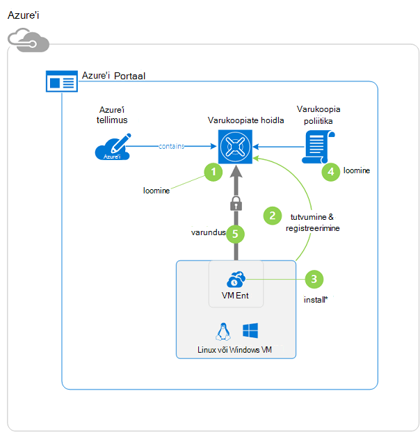

>[AZURE.NOTE] Azure'i on kaks juurutamise mudelite loomise ja ressursside töötamine: [ressursihaldur ja klassikaline](../resource-manager-deployment-model.md). Selles õpetuses on Azure klassikaline portaali loodud VMs jaoks. Azure'i varundus teenuse toetab ressursihaldur-põhise VMs. Et taastamise teenuste hoidla VMs varundamise kohta leiate teemast [esimese ilme: taastamise teenuste hoidla VMs kaitse](backup-azure-vms-first-look-arm.md).

## Samm 1 - VM varukoopiate hoidla loomine

Varukoopiate hoidla on üksus, mis salvestab varukoopiate ja taastamise punkte, mis on loodud aja jooksul. Varukoopiate hoidla sisaldab ka varukoopia poliitikad, mis on rakendatud virtuaalmasinates, varundamine.

1. [Azure'i klassikaline portaali](http://manage.windowsazure.com/)sisse logida.

2. Azure'i portaalis vasakus allnurgas nuppu **Uus**

    

3. Klõpsake viisardis kiiresti luua **Data Services** > **Taastamise teenused** > **Varundamise Vault** > **Kiiresti luua**.

    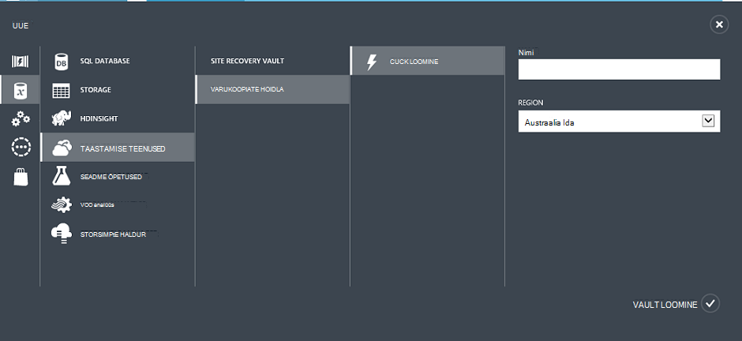

    Viisard teilt **nime** ja **piirkond**. Kui olete mitu tellimust, kuvatakse dialoogiboksi valimise tellimus.

4. Sisestage **nimi**sõbralik nimi, mis tähistavad vault. Nimi peab olema kordumatu Azure tellimuse jaoks.

5. **Piirkond**, valige piirkonnas vault jaoks. Vault **peab** asuma samas piirkonnas virtuaalmasinates, kaitseb.

    Kui te ei tea, kus on olemas oma VM piirkonna, viisardi sulgemiseks ja klõpsake **Virtuaalmasinates** Azure'i teenuste loend. Veeru asukoht pakub piirkonna nimi. Kui teil on mitu piirkondades virtuaalmasinates, luua iga piirkonna varukoopiate hoidla.

6. Kui viisard on ole **tellimuse** dialoog, vahele jätta järgmise juhisega. Kui töötate mitu tellimust, valige tellimus uue varukoopiate hoidla seostada.

    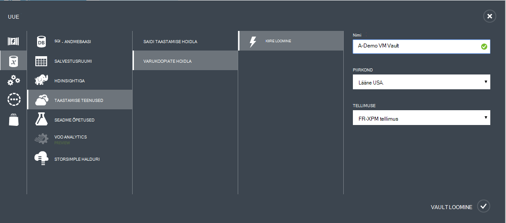

7. Klõpsake nuppu **Loo Vault**. Võib kuluda aega varukoopiate hoidla luua. Jälgida Olekuteatised, portaali allosas.

    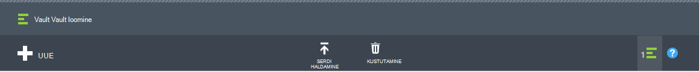

    Sõnumi kinnitab vault on loodud. See on loetletud lehel **taastamise teenused** **aktiivsed**.

    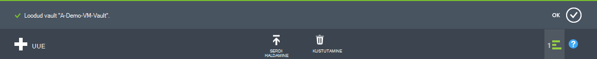

8. Valige võlvid **Taastamise teenused** lehel loendis loodud käivitada **Kiirkäivituse** lehe vault.

    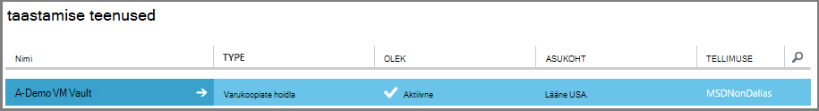

9. Klõpsake lehel **Kiirkäivituse** **konfigureerimine** suvandi salvestusruumi kopeerimine avamiseks.
    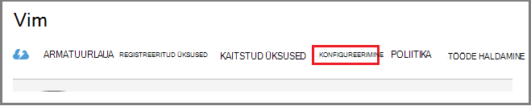

10. Valige suvand **salvestusruumi dispersioonanalüüs** dispersioonanalüüs suvandi oma vault.

    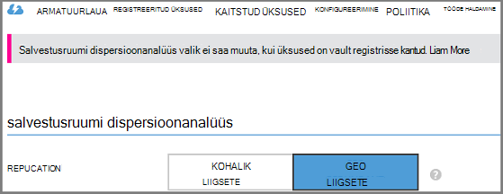

    Vaikimisi on teie vault geograafilise liigne salvestusruumi. Valige geograafilise liigne salvestusruumi, kui see on esmane varukoopia. Kui soovite odavamad, mis pole päris nii püsival, valige kohalik liigsete salvestusruumi. Lugege lisateavet geograafilise liigne ja kohalikult liigsete talletamise võimalused [Azure Storage dispersioonanalüüs ülevaade](../storage/storage-redundancy.md).

Pärast valides oma vault salvestusruumi suvandi, olete valmis vault VM seostada. Kõigepealt seost, leida ja Azure'i virtuaalmasinates registreerida.

## Samm 2 - tuvastada ja registreerida Azure'i virtuaalmasinates
Enne registreerumist võlvkelder VM, käivitage discovery mis tahes uue VMs tuvastamiseks. See tagastab loendi virtuaalmasinates koos täiendavat teavet, nt pilvepõhise teenuse nimi ja piirkonna tellimusest.

1. [Azure'i klassikaline portaali](http://manage.windowsazure.com/) sisselogimine

2. Klõpsake Azure klassikaline portaalis **Taastamise teenused** taastamise teenused võlvid loendi avamiseks.
    

3. Valige loendist võlvid, vault VM varundada.

    Kui valite oma vault, avaneb **Kiirkäivituse** lehel

4. Klõpsake menüü vault nuppu **Registreeritud üksused**.

    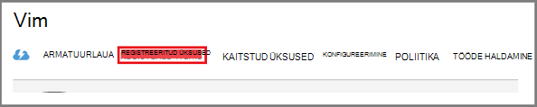

5. Valige menüüst **Tüüp** **Azure virtuaalse masina**.

    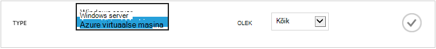

6. Klõpsake lehe allosas **avastamine** .
    

    On discovery protsess võib kuluda mõni minut ajal virtuaalmasinates on esitatud tabelina. Saate teada, et protsess töötab kuva allosas teatis on.

    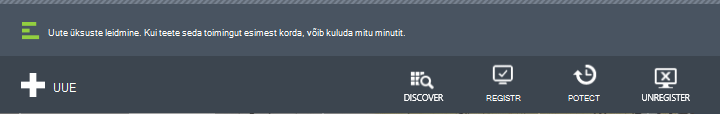

    Teatise muudatused protsess on lõpule viia.

    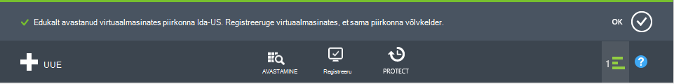

7. Klõpsake lehe allosas **registreerida** .
    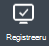

8. Valige kiirmenüüs **Registreerida üksuste** virtuaalmasinates, mida soovite registreerida.

    >[AZURE.TIP] Mitme virtuaalmasinates saab korraga registreerida.

    Töö luuakse iga virtuaalse masina valitud.

9. Klõpsake nuppu **Kuva töö** teatise **töö** lehele.

    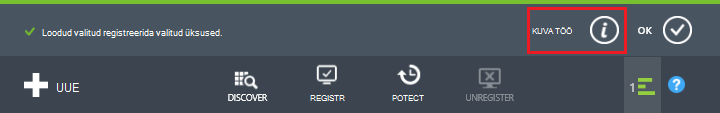

    Virtuaalse masina kuvatakse ka loendis registreeritud üksust registreerimise toimingu olekut.

    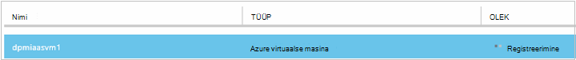

    Kui toiming on lõpule jõudnud, olek muutub kajastavad *registreeritud* .

    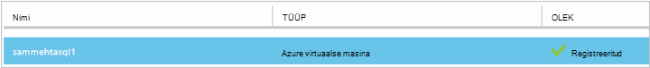

## Samm 3 – VM Agent virtual arvutisse installida

Azure'i VM Agent peab olema installitud Azure virtuaalne arvutisse varundamise pikendamise töötamiseks. Kui teie VM loodi Azure galeriist, VM Agent on juba olemas VM. Võite kaitsta [oma VMs](backup-azure-vms-first-look.md#step-4-protect-azure-virtual-machines)vahele jätta.

Kui teie VM migreeritud on kohapealse andmekeskuses, VM ilmselt ei ole installitud VM Agent. Peate installima VM Agent virtuaalse masina enne jätkamist kaitsta VM. Leiate üksikasjalikud juhised VM agendi installimise kohta leiate [artikli varundamise VMs VM Agent jaotises](backup-azure-vms-prepare.md#vm-agent).

## Juhis 4 – saate luua varukoopia poliitika
Enne kui saate käivitada algse Varundustöö, Määrake sätte ajakava varukoopia hetktõmmiseid võtmisel. Kui varukoopia pilte on tehtud, ja aeg neid pilte säilitatakse, on varukoopia poliitika ajakava. Säilituspoliitika teave põhineb vanaisa-isa-poja varukoopia pööre värviskeemi.

1. Liikuge varukoopiate hoidla jaotises **Taastamise teenused** Azure'i klassikaline portaali ja klõpsake **Üksust registreeritud**.
2. Valige rippmenüüst menüü **Azure virtuaalse masina** .

    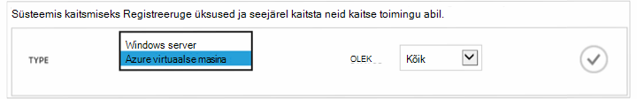

3. Klõpsake lehe allosas **kaitse** .
    

    **Kaitse üksuste viisardis** kuvatakse ja on loetletud *ainult* virtuaalmasinates, mis on registreeritud ja pole kaitstud.

    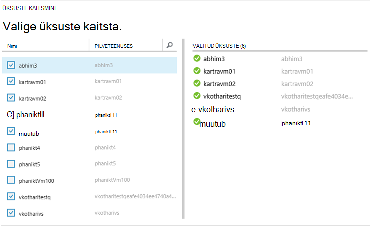

4. Valige virtuaalmasinates, mida soovite kaitsta.

    Kui loendis on kahe või enama virtuaalmasinates sama nimega, pilveteenusesse abil soovitud virtuaalmasinates eristada.

5. Menüü **konfigureerimine kaitse** valige olemasolev poliitika või luua uue poliitika virtuaalmasinates, mille te kaitsta.

    Uue varundamise võlvid on seostatud vault vaikepoliitika. Selle poliitika võtab iga päev, iga õhtused hetktõmmise ja päevane hetktõmmis säilib 30 päeva. Iga varukoopia poliitika võib olla mitu virtuaalmasinates seotud. Siiski virtuaalse masina saab ainult ühe korra seostatud korraga.

    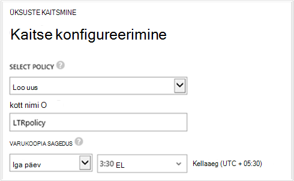

    >[AZURE.NOTE] Varukoopia poliitika sisaldab säilituspoliitika värviskeemi ajastatud varukoopiaid. Kui valite olemasoleva varukoopia poliitika, ei saa muuta säilituspoliitika suvandid järgmise juhise juurde.

6. Klõpsake **Vahemiku säilitamine** piiritleda iga päev, nädala, kuu ja aasta teatud varukoopia punktid.

    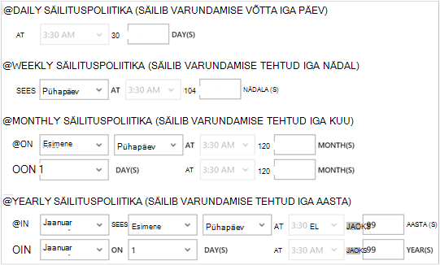

    Säilituspoliitika määrab aeg varukoopia talletamiseks. Saate määrata, kui varukoopia põhjal erinevate Säilituspoliitikad.

7. Klõpsake **töö** **Konfigureerimine kaitse** tööde loendi kuvamiseks.

    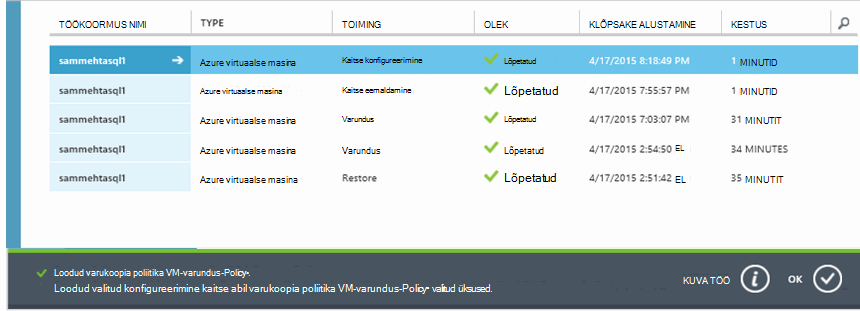

    Nüüd, kui olete loonud poliitika, minge järgmise juhise juurde ja käivitada algse varundamise.

## Juhis 5 – algne varundamine

Kui poliitika on kaitstud virtuaalse masina, saate vaadata vahekaardil **Kaitstud üksuste** kustutamist seose. Kuni algse varundamise ilmneb, näitab **Kaitse oleku** **kaitstud - (ootel algse varukoopia)**. Vaikimisi on esimene ajastatud varundus *algse varukoopia*.

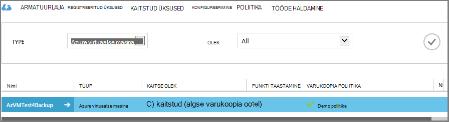

Algne varundamise nüüd alustamiseks tehke järgmist.

1. **Kaitstud üksusi** , klõpsake lehe **Varundamise nüüd** lehe allosas.
    

    Azure'i varukoopia teenus loob Varundustöö esialgse varundatud toimingu jaoks.

2. Klõpsake **tööde loendi kuvamiseks klõpsake vahekaarti** .

    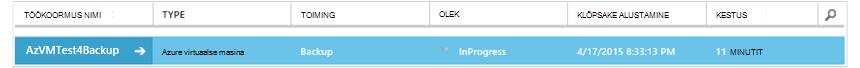

    Kui algset varundamine on lõpule jõudnud, virtuaalse masina **Kaitstud üksuste** vahekaardil olek on *kaitstud*.

    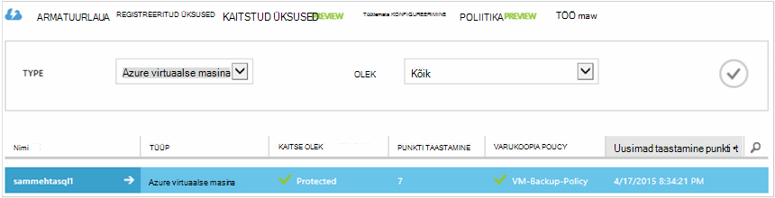

    >[AZURE.NOTE] Varundada virtuaalmasinates on kohalik protsess. Te ei saa varundada virtuaalmasinates ühe piirkonna varukoopiate hoidla teises regioonis. Nii, et iga Azure'i piirkond, mis sisaldab VMs, mida soovite varundada, vähemalt üks varukoopiate hoidla tuleb luua selle piirkonna.

## Järgmised sammud
Nüüd, kui teil on edukalt varundanud VM, on mitu järgmised toimingud, mis võib huvi. Kõige loogilisem samm on tutvuda andmete taastamine VM. Kuid on haldamise toiminguid, mis aitavad teil mõista, kuidas hoida oma andmed turvalised ja minimeerida kulusid.

- [Hallata ja jälgida oma virtuaalmasinates](backup-azure-manage-vms.md)
- [Virtuaalmasinates taastamine](backup-azure-restore-vms.md)
- [Juhised tõrkeotsing](backup-azure-vms-troubleshoot.md)

## Teil on küsimusi?
Kui teil on küsimusi või on mis tahes funktsiooni, mida soovite näha kaasatud, [saatke meile tagasiside](http://aka.ms/azurebackup_feedback).
