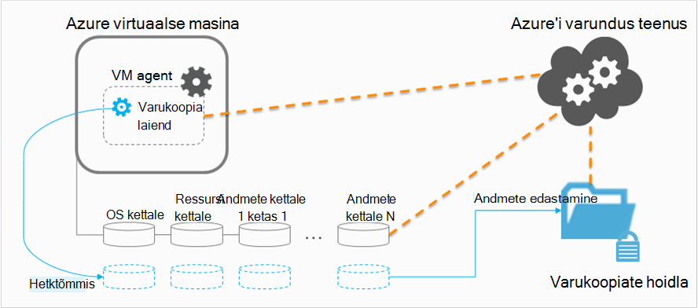

<properties
    pageTitle="Kavandamise VM varukoopia taristu Azure | Microsoft Azure'i"
    description="Oluline teave, kui plaanite varundada Azure'i virtuaalmasinates"
    services="backup"
    documentationCenter=""
    authors="markgalioto"
    manager="cfreeman"
    editor=""
    keywords="varukoopia vms, varundamine virtuaalmasinates"/>

<tags
    ms.service="backup"
    ms.workload="storage-backup-recovery"
    ms.tgt_pltfrm="na"
    ms.devlang="na"
    ms.topic="article"
    ms.date="10/19/2016"
    ms.author="trinadhk; jimpark; markgal;"/>

# <a name="plan-your-vm-backup-infrastructure-in-azure"></a>VM varukoopia taristu Azure kavandamine
Selles artiklis antakse jõudlus ja ressursside soovituste abil oma VM varukoopia taristu. Samuti määratletakse võtme aspektide varundamise teenuse; neid aspekte saab kriitiline teie arhitektuur, kindlaks teha, võimsuse plaanimise. Kui olete [valmis oma keskkonnas](backup-azure-vms-prepare.md), see on järgmise juhise juurde enne alustamist [varukoopia vms](backup-azure-vms.md). Kui vajate Azure'i virtuaalmasinates kohta lisateavet, lugege teemat [Virtuaalmasinates dokumentatsiooni](https://azure.microsoft.com/documentation/services/virtual-machines/).

## <a name="how-does-azure-back-up-virtual-machines"></a>Kuidas saab Azure'i virtuaalmasinates varundamine?
Kui Azure varukoopia teenus käivitab Varundustöö määratud ajal, see käivitab varukoopia laiend punkti /-kellaaja hetktõmmis. Selle hetktõmmise koordineerituna koos helitugevuse vari Copy Service (VSS) on võetud saada soovitud ketast ühtsete hetktõmmise virtuaalse masina ilma seda sulgeda.

Pärast hetktõmmis andmed on üle Azure varukoopia teenuse varukoopiate hoidla. Varundamist tõhustamiseks teenuse tuvastab ja suunati ümber ainult plokid andmeid, mis on muutunud pärast viimast varundamist.



Kui andmeedastus on lõpule jõudnud, eemaldatakse hetktõmmis ja taastamise punkti on loodud.

### <a name="data-consistency"></a>Andmete järjepidevus
Varundus ja taaste business kriitiliste andmete on keeruline asjaolu, et kriitilised äriandmete tuleb varundada ajal rakendusi, millega andmed töötavad. Sellega tegelemiseks Azure varukoopia pakub rakenduse ühtsete varukoopiate Microsoft töökoormus VSS abil tagada, et andmed on kirjutatud õigesti salvestusruumi.

>[AZURE.NOTE] Jaoks Linux virtuaalmasinates, ainult faili ühtsete varukoopiate on võimalik, kuna Linux ei ole on samaväärne platvormi rakendust

Azure'i varukoopiad võtab VSS täielikult varukoopiaid Windowsi VMs (lähemalt [VSS täielik varukoopia](http://blogs.technet.com/b/filecab/archive/2008/05/21/what-is-the-difference-between-vss-full-backup-and-vss-copy-backup-in-windows-server-2008.aspx)). Lubamiseks VSS Kopeeri varukoopiaid, kuvatakse registri all klahvi peab olema määratud VM.

```
[HKEY_LOCAL_MACHINE\SOFTWARE\MICROSOFT\BCDRAGENT]
"USEVSSCOPYBACKUP"="TRUE"
```


Selles tabelis kirjeldatakse järjepidevuse tüübid ja tingimused, millele nad jaotises ajal toimuda Azure VM varundamine ja taastamine toimingutest.

| Järjepidevus | VSS-põhine. | Selgituse ja üksikasjad |
|-------------|-----------|---------|
| Rakenduse järjepidevus | Jah | See on Microsofti töökoormus optimaalne järjepidevuse tüüp, nagu see tagab:<ol><li> Funktsiooni VM *käivitub*. <li>On *pole rikutud*. <li>Ei *ole andmete kaotsimineku*.<li> Andmed on vaja rakendus, mis kasutab andmed, milles rakendatakse ajal varundamise--kasutades rakendust</ol> Enamik Microsofti teenustest olla VSS poolt, mida teha töökoormus kohased toimingud, mis on seotud andmete järjepidevuse. Microsoft SQL Server on näiteks VSS-kirjuti tagab kirjutab tehingulogi faili ja andmebaasi teha õigesti.<br><br> Azure VM varukoopiate, saada mõne rakenduse ühtsete taastamine punkti tähendab, et varukoopia laiend suutis autonoomsest VSS töövoo ja täitke *õigesti* , enne VM hetktõmmis. Loomulikult, tähendab see, et kasutada ka VSS poolt kõigi rakenduste Azure VM.<br><br>(Teavet [VSS põhitõdesid](http://blogs.technet.com/b/josebda/archive/2007/10/10/the-basics-of-the-volume-shadow-copy-service-vss.aspx) ja sukelduda sellesse, üksikasjad, [Kuidas see toimib](https://technet.microsoft.com/library/cc785914%28v=ws.10%29.aspx)). |
| Faili süsteemi järjepidevuse | Jah – Windowsi-põhises arvutis | On kaks stsenaariumid, kus saab taastamine punkti *failisüsteemi ühtsete*.<ul><li>Varukoopiate Linux vms Azure, kuna Linux ei ole on samaväärne platvormi rakendust<li>Windows Azure'i VMs varukoopia VSS tõrge.</li></ul> Mõlemal juhul on kõige paremini, mida saab teha tagamaks, et: <ol><li> Funktsiooni VM *käivitub*. <li>On *pole rikutud*.<li>Ei *ole andmete kaotsimineku*.</ol> Rakenduste vaja rakendada oma "lahendus üles" süsteem taastatud andmed.|
| Vormindusühtsuse ootamatult sulguda | Ei | Olukord on võrdne virtuaalse masina probleeme "krahhi" (kas pehmed või raske lähtestamine) kaudu. See juhtub tavaliselt siis, kui Azure virtuaalse masina sulgub varundamise ajal. Azure virtuaalse masina varufailide, saada krahh ühtsete taastamine punkti tähendab see Azure varukoopia annab garantiid ümber andmete järjepidevuse salvestusruumi keskmise--operatsioonisüsteem seisukohast või rakenduse seisukohast. Ainult andmeid, mis on juba olemas kettal varundamise ajal on mis saab registreerimise ning varundada. <br/> <br/> Kuigi pole garantiid, enamasti operatsioonisüsteem ei käivitu. Tavaliselt järgnevad ketta kontrollimine protseduuri chkdsk, nagu mis tahes tõrked parandada. Kirjutab, mis on ei ole täielikult kettale ega -mälu andmed lähevad kaotsi. Rakenduse järgib tavaliselt oma kontrollimise abil juhuks, kui andmete tagasipööramine on vaja teha. <br><br>Näiteks kui tehingulogi on kirjed, mis ei ole andmebaasis, siis andmebaasi tarkvara ei a tagasipööramine enne, kui andmed on ühtsete. Kui andmed on jaotatud mitme virtuaalse ketast (nt jaotatud mahud), annab krahh ühtsete taastamine punkti garantiid andmete õigsust.|


## <a name="performance-and-resource-utilization"></a>Jõudluse ja ressursside kasutamine
Varundustarkvara, mis on juurutatud asutusesisese, nt peaks plaanite võimsus ja ressursi kasutamine vajadustele kui VMs Azure varundada. [Azure'i salvestuslimiidi](azure-subscription-service-limits.md#storage-limits) määrata, kuidas struktureerimine VM juurutuste saada maksimaalse jõudluse minimaalse mõjuga töötab töökoormus.

Tähelepanu järgmised Azure salvestuslimiidi varukoopia jõudluse kavandamisel:

- Max sealt salvestusruumi konto kohta
- Kokku taotluse määr salvestusruumi konto kohta

### <a name="storage-account-limits"></a>Salvestuslimiitide konto
Iga kord, kui varundatud andmed kopeeritakse salvestusruumi konto, see loeb suunas sisend toimingute sekundis (IOPS) ja sealt (või läbilaskevõime) mõõdikute salvestusruumi konto. Samal ajal soovitud virtuaalmasinates töötab ja tarbimine IOPS ja läbilaskevõime. Eesmärk on kokku liikluse - varukoopia ja virtuaalse masina - ei ületaks salvestuslimiidi konto.

### <a name="number-of-disks"></a>Arvu ketast.
Varundamist proovib lõpuleviimine Varundustöö nii kiiresti kui võimalik. Seda tehes kulub nii palju ressursse, sest see on võimalik. Siiski, / v-toimingud on piiratud *Target läbilaskevõime ühe bloobimälu jaoks*, mis on piiratud 60 MB sekundis. Püüdes maksimeerimine selle kiirus varundamist proovib iga soovitud VM ketast *paralleelselt*varundada. Jah, kui VM on neli plaati, Azure varundus proovib varundada kõik neli ketast paralleelselt. Seetõttu kõige olulisem tegur varukoopia liikluse väljumist salvestusruumi kliendikonto on **arv ketast** varundamist salvestusruumi konto kaudu.

### <a name="backup-schedule"></a>Varunduse ajakava
Täiendavad tegur, mis mõjutab jõudlust on **varukoopia ajakava**. Kui konfigureerite poliitika nii, et kõik VMs varundatakse samal ajal, planeeritud turvaline. Varundamist proovib varundada kõik ketast paralleelselt. Üks võimalus vähendada varukoopia liikluse salvestusruumi konto - tagada eri VMs varundatakse päev, ei kattu eri ajal.

## <a name="capacity-planning"></a>Võimsuse planeerimine
Lihtsate koos kõigi teguritest tähendab, et mäluruumi konto kasutamine peab korralikult kavandada. Laadige alla [VM varukoopia võimsus kavandamise Exceli arvutustabeli](https://gallery.technet.microsoft.com/Azure-Backup-Storage-a46d7e33) mõju ketas ja varunduse ajakava valikute kuvamiseks.

### <a name="backup-throughput"></a>Varukoopia läbilaskevõime
Iga ketta varundab, Azure varukoopia loeb plokid kettal ja salvestab ainult muudetud andmed (varundamist). Selles tabelis on kuvatud väärtuste keskmine läbilaskevõime, et eeldatavaid Azure varukoopia. Selle abil saate hinnata aeg, mis kulub antud suurusega kettal varundamine.

| Varundamise | Muutujatel läbilaskevõime |
| ---------------- | ---------- |
| Algne varundamine | 160 Mbps |
| Varundamist (DR) | 640 Mbps <br><br> Selle läbilaskevõime saate kukutage märkimisväärselt, kui seal on palju hajutatud piimapütt kettal, mida on vaja, varundada. |

## <a name="total-vm-backup-time"></a>Kogu VM varukoopia aeg
Kuigi enamik varukoopia aega kulub lugemis-ja andmete kopeerimine, on muid toiminguid, mis moodustavad vaja, varundada VM koguaeg.

- Aega, et [installida või värskendada varukoopia laiendamine](backup-azure-vms.md#offline-vms).
- Hetktõmmis aega, mis on hetktõmmise käivitamiseks kuluv aeg. Hetktõmmiseid käivitatakse ajastatud varukoopia kellaaja.
- Järjekorda ootama aega. Kuna varundamise teenuse töötleb varukoopiate mitme klientidele, kopeerimine varundatud andmete hetktõmmis varundamise ja taastamise teenused vault ei käivitu kohe. Laadimise ajal tippväärtus, võib oodata venitada töödeldavate varukoopiate arvu tõttu kaheksa tundi. VM varukoopia koguaeg on siiski iga päev varukoopia poliitikaid vähem kui 24 tundi.

## <a name="best-practices"></a>Head tavad
Soovitame pärast nende toimingute jaoks virtuaalmasinates varukoopiate konfigureerimisel:

- Rohkem kui neli klassikaline VMs sama pilveteenuselt korraga varundada ei plaanimine. Soovitame uskumatud varukoopia algusaegade tunni võrra, kui soovite sama pilveteenusesse mitme VMs varundamiseks.
- Plaanimine rohkem kui 40 ressursihaldur juurutatud VMs korraga varundada.
- Plaanimine – tippväärtus tunni jooksul VM varukoopiaid nii, et varukoopia teenus kasutab IOPS andmeedastuse salvestusruumi kliendikonto varundamine või taastamise teenused võlvkelder.
- Veenduge, et poliitika aadressid VMs laiali eri salvestusruumi kontod. Soovitame mitte rohkem kui 20 ketast ühe salvestusruumi konto kaitstakse ühe korra. Kui teil on suurem kui 20 ketast salvestusruumi konto, need laiali mitu poliitika saada vajalik IOPS varundamist faasis edastamine.
- Taastada VM töötavate Premium salvestusruumi sama salvestusruumi kontole. Kui Taasta toiming protsessi kattub varukoopia toiming, vähendab see saadaval IOPS varundamiseks.
- Soovitame, et käivitada iga Premium VM erinevate premium salvestusruumi konto varukoopia optimaalse jõudluse tagamiseks.

## <a name="data-encryption"></a>Andmete krüptimine

Azure'i varukoopiad Krüpti andmeid varundamist osana. Siiski saate krüptida VM andmete ja sujuvalt kaitstud andmetest varukoopiad (lähemalt [varukoopia krüptitud andmed](backup-azure-vms-encryption.md)).


## <a name="how-are-protected-instances-calculated"></a>Kuidas kaitstud eksemplarid arvutatakse?
Azure'i virtuaalmasinates, mida varundatakse kaudu Azure'i varundus kehtivad [hinnad Azure varukoopia](https://azure.microsoft.com/pricing/details/backup/). Kaitstud eksemplarid arvutus põhineb *tegeliku* suuruse virtuaalse masina, mis on kõik andmed virtuaalse masina – välja arvatud "ressursi ketas" summa.

Olete *ei* eest tuleb tasuda vastavalt maksimaalne suurus, mis ei toeta iga virtuaalse masina lisatud andmed kettale, kuid tegelik andmed kettale talletatud andmed. Samuti põhineb varukoopia salvestusruumi arve andmehulga, mis on talletatud koos Azure varukoopia, mis on väljal tegelike andmete taastamine iga punkti summa.

Näiteks võtta A2 Standard suurusega virtuaalse masina, millel on kaks täiendavate andmete plaati maksimaalse suurusega 1 TB. Tabel annab salvestatud iga ketast tegelik andmed:

|Ketta tüüp|Max suurus|Tegelike andmete esitamine|
|---------|--------|------|
| Operatsioonisüsteemi ketta | 1023 GB | 17 GB |
| Kohalikule kettale / ressursi kettale | 135 GB | 5 GB (ei sisalda varukoopia) |
| Andmete kettale 1 | 1023 GB | 30 GB |
| Andmete kettale 2 | 1023 GB | 0 GB |

*Tegeliku* suuruse virtuaalse masina sel juhul on 17 GB + 30 GB + 0 GB = 47 GB. See muutub kaitstud eksemplari suuruse igakuise arve põhjal. Andmehulga virtual kohapeal kasvab, muutub vastavalt kasutada ka arveldus kaitstud eksemplari suuruse.

Arveldamine ei käivitu kuni esimese eduka varundamine on lõpule viidud. Selles etapis hakkab arveldamine salvestusruumi-ja kaitstud eksemplarid. Arveldamine ei lahene, kui virtuaalse masina *varukoopia andmed koos Azure varukoopia* . Peata kaitse toimingut peatada arveldamine, kui varukoopia andmed säilivad.

Arveldamine jaoks määratud virtuaalse masina on peatatud ainult juhul, kui kaitse on peatatud *ja* mis tahes varundatud andmed on kustutatud. Kui pole aktiivne varukoopia töid (kui on peatatud kaitse), virtuaalse masina viimase eduka varundamise ajal suurus muutub igakuise arve aluseks oleva kaitstud eksemplari suuruse.

## <a name="questions"></a>Teil on küsimusi?
Kui teil on küsimusi või on mis tahes funktsiooni, mida soovite näha kaasatud, [saatke meile tagasiside](http://aka.ms/azurebackup_feedback).

## <a name="next-steps"></a>Järgmised sammud

- [Virtuaalmasinates varundamine](backup-azure-vms.md)
- [Virtuaalse masina varundamise haldamine](backup-azure-manage-vms.md)
- [Virtuaalmasinates taastamine](backup-azure-restore-vms.md)
- [VM varukoopia probleemide tõrkeotsing](backup-azure-vms-troubleshoot.md)
