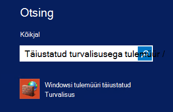
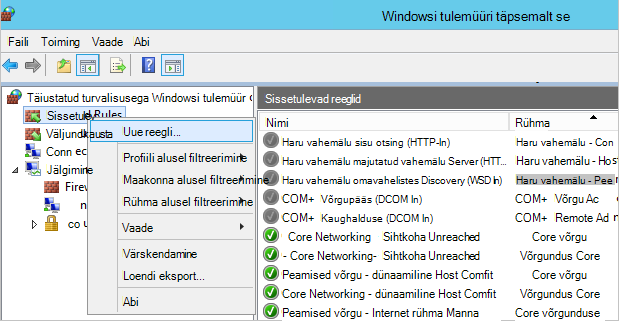
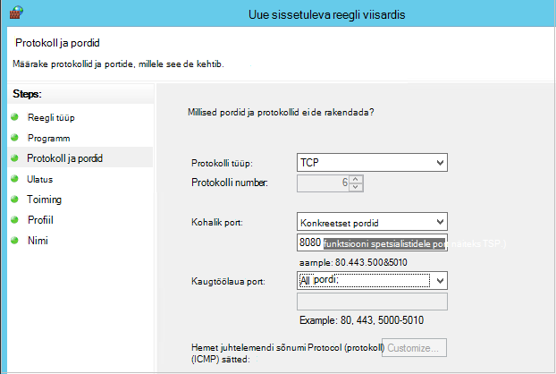

<properties
    pageTitle="Azure'i virtuaalmasinates varundada keskkonna ettevalmistamise | Microsoft Azure'i"
    description="Veenduge, et teie keskkond on valmis varundamiseks Azure'i virtuaalmasinates"
    services="backup"
    documentationCenter=""
    authors="markgalioto"
    manager="cfreeman"
    editor=""
    keywords="varukoopiate; varundamise;"/>

<tags
    ms.service="backup"
    ms.workload="storage-backup-recovery"
    ms.tgt_pltfrm="na"
    ms.devlang="na"
    ms.topic="article"
    ms.date="08/26/2016"
    ms.author="trinadhk; jimpark; markgal;"/>


# <a name="prepare-your-environment-to-back-up-azure-virtual-machines"></a>Azure'i virtuaalmasinates varundada keskkonna ettevalmistamiseks

> [AZURE.SELECTOR]
- [Ressursi juhi mudel](backup-azure-arm-vms-prepare.md)
- [Klassikaline mudel](backup-azure-vms-prepare.md)

Enne kui saate varundada Azure virtuaalse masina (VM), on kolm tingimust, mis peavad olema.

- Peate varukoopiate hoidla loomine või mõne olemasoleva varukoopiate hoidla *oma VM sama piirkonna*tuvastamine.
- Luua võrguühendus Azure avaliku Interneti-aadresside ja Azure storage lõpp-punktid.
- Installige VM agent VM.

Kui teate, et teie keskkonnas olemas need tingimused siis jätkake [oma VMs artiklis varundada](backup-azure-vms.md). Muul juhul lugege edasi, selles artiklis viib teid läbi juhiseid varundamiseks on Azure VM keskkonna ettevalmistamiseks.


## <a name="limitations-when-backing-up-and-restoring-a-vm"></a>Kui varundus ja taaste VM piirangud

>[AZURE.NOTE] Azure'i on kaks juurutamise mudelite loomise ja ressursside töötamine: [ressursihaldur ning klassikaline](../resource-manager-deployment-model.md). Järgnev loend annab piirangud klassikaline juurutamisel.

- Rohkem kui 16 andmete ketast virtuaalmasinates varundada ei toetata.
- Varundada virtuaalmasinates reserveeritud IP-aadress ja pole määratletud lõpp-punkti ei toetata.
- Varundatud andmete ei sisalda seotud VM võrku ühendatud draivid. 
- Asendades olemasoleva virtuaalarvuti taastamisel ei toetata. Olemasoleva virtuaalse masina ja mis tahes seotud ketast kustutama ja seejärel varukoopia põhjal taastamine andmed.
- Rist-piirkond varundus ja taaste ei toetata.
- Varundada virtuaalmasinates Azure varukoopia teenuse abil toetatakse kõikide avaliku regioonide Azure (vt toetatud regioonide [kontroll-loend](https://azure.microsoft.com/regions/#services) ). Kui täna ei toetata piirkond, mida otsite, ei kuvata ripploendis vault loomise ajal.
- Varundada virtuaalmasinates Azure varukoopia teenuse abil on toetatud ainult valige operatsioonisüsteemi versiooni:
  - **Linux**: Azure'i varukoopiad toetab [jaotuse, mis on kinnitatud Azure'i loendi](../virtual-machines/virtual-machines-linux-endorsed-distros.md) peale Core OS Linux. Muude Too-oma-omanik-Linuxi ka võivad töötada, kui VM on saadaval virtual arvutisse ja tugi Python olemas.
  - **Windows Server**: Windows Server 2008 R2 versioonides ei toetata.
- Domeenikontrolleri taastamine (näiteks Põhiliselt) VM, mis on osa mitme – näiteks Põhiliselt konfiguratsiooni toetatakse ainult PowerShelli kaudu. Lisateavet [mitme – näiteks Põhiliselt domeenikontrolleri taastamine](backup-azure-restore-vms.md#restoring-domain-controller-vms).
- Taastamine on spetsiaalne järgmised toetatakse ainult PowerShelli kaudu. UI Taasta töövoog abil loodud VMs ei pea neid konfiguratsioone võrgu kui taastetoimingu on lõpule jõudnud. Lisateavet leiate teemast [Teisiti võrgu konfiguratsioone VMs taastamine](backup-azure-restore-vms.md#restoring-vms-with-special-netwrok-configurations).
    - Virtuaalmasinates jaotises Laadi koormusetasakaalustusteenuse konfigureerimine (sise- ja)
    - Virtuaalmasinates mitme reserveeritud IP-aadressid
    - Mitme võrguadapteri koos virtuaalmasinates

## <a name="create-a-backup-vault-for-a-vm"></a>Varukoopiate hoidla VM loomine

Varukoopiate hoidla on üksus, mis salvestab varukoopiate ja taastamise punkte, mis on loodud aja jooksul. Varukoopiate hoidla sisaldab ka varukoopia poliitika, mis rakendatakse virtuaalmasinates, varundamine.

Sellel pildil on kuvatud erinevate Azure varukoopia üksuste vahelisi seoseid:     

Varukoopiate hoidla loomiseks tehke järgmist.

1. [Azure'i portaali](http://manage.windowsazure.com/)sisse logida.

2. Azure'i portaalis nuppu **Uus** > **Hübriid integreerimine** > **varukoopia**. **Varundus**klõpsamisel kuvatakse automaatselt aktiveerige klassikaline portaali (vt märkus pärast).

    

    >[AZURE.NOTE] Kui teie tellimus viimati kasutatud klassikaline portaalis, siis tellimuse võib avada klassikaline portaali. Sellisel juhul varukoopiate hoidla loomiseks nuppu **Uus** > **Data Services** > **Taastamise teenused** > **Varukoopiate hoidla** > **Kiire loomine** (vt allpool olevat pilti).

    

3. Sisestage **nimi**sõbralik nimi, mis tähistavad vault. Nimi peab olema kordumatu Azure tellimuse jaoks. Tippige nimi, mis sisaldab 2 – 50 märki. See peab algama tähega ja võib sisaldada ainult tähti, numbreid ja sidekriipse.

4. **Piirkond**, valige piirkonnas vault jaoks. Vault peab olema sama piirkonna virtuaalmasinates, mida soovite kaitsta. Kui teil on mitu piirkondades virtuaalmasinates, peate looma varukoopiate hoidla iga piirkonna. Ei ole vaja määrata salvestusruumi kontod varukoopiate hoidla ja Azure varukoopia teenus--varukoopia andmete talletamiseks käsitleda seda automaatselt.

5. Valige **tellimus** see tellimus, mida soovite seostada varukoopiate hoidla. Seal on mitu valikud ainult juhul, kui ettevõtte konto on seotud mitu Azure tellimust.

6. Klõpsake nuppu **Loo Vault**. Võib kuluda aega varukoopiate hoidla luua. Jälgida Olekuteatised, portaali allosas.

    

7. Sõnumi kinnitab, et vault on edukalt loodud. See kirjas **taastamine teenuste** lehel **aktiivsed**. Veenduge, et valida asjakohased koondamise suvand õige pärast vault loomist. Lugege lisateavet [mäluruumi koondamine suvand varukoopiate hoidla seadmise](backup-configure-vault.md#azure-backup---storage-redundancy-options)kohta.

    

8. Klõpsake varukoopiate hoidla avamiseks **Kiirkäivituse** lehe, kus kuvatakse juhised Azure'i virtuaalmasinates varundada.

    


## <a name="network-connectivity"></a>Võrguühendus

VM hetktõmmiste haldamiseks peab varukoopia laiend Ühenduvus Azure avaliku IP-aadresse. Ilma õige Interneti-ühenduse, virtuaalse masina HTTP taotleb ajalõpuni ja varukoopia toiming nurjub. Juhul, kui teie juurutusega on juurdepääsupiirangud (kaudu võrgu turberühma (NSG), näiteks), seejärel valige üks järgmistest suvanditest, pakkudes selge varukoopia liikluse.

- [Valge Azure andmekeskuse IP-vahemikke](http://www.microsoft.com/en-us/download/details.aspx?id=41653) - artiklist juhised selle kohta, kuidas nimekirja nimekiri IP-aadressid.
- Juurutada marsruutimise liikluse HTTP-puhverserver.

Otsustamisel, milline võimalus kasutada, on selle kompromisse vahel hallatavust, Varundustöö kontrolli ja maksumus.

|Suvand|Eelised|Puudused|
|------|----------|-------------|
|Nimekiri IP-aadresside vahemikud| Lisatasu.<br><br>Accessi avamise on NSG, kasutada cmdlet <i>Set-AzureNetworkSecurityRule</i> . | Keerukate hallata selle kannatavas IP-aadresside vahemikud aja jooksul muutuda.<br><br>Saab kasutada kogu Azure ja mitte ainult salvestusruumi.|
|HTTP-puhverserver| Talletamist Varundustöö juhtida puhverserveri URL-id lubatud.<br>Ühe punkti Interneti-ühendus vms.<br>Ei kuulu Azure'i IP-aadress muutub.| Täiendavad kulud töötab VM puhverserveri tarkvara.|

### <a name="whitelist-the-azure-datacenter-ip-ranges"></a>Valge Azure andmekeskuse IP-vahemikke

Nimekirja nimekiri Azure andmekeskuse IP-vahemikke, leiate [Azure'i veebisaidi](http://www.microsoft.com/en-us/download/details.aspx?id=41653) andmed IP-aadresside vahemikud ja juhiseid.

### <a name="using-an-http-proxy-for-vm-backups"></a>HTTP-puhverserver VM varufailide abil
Kui varundamine VM, varukoopia laiend VM saadab hetktõmmise haldamise käske Azure Storage API HTTPS-i abil. Marsruutimine varukoopia laiend liikluse kaudu HTTP-puhverserver, kuna see on ainult osa, mis on konfigureeritud lubama avaliku Interneti-ühendus.

>[AZURE.NOTE] Ei ole soovitust puhvri tarkvara, mida tuleks kasutada. Veenduge, et valite puhverserveri, mis ühildub konfiguratsiooni alltoodud juhiseid.

Näide alloleval pildil on näha kolme konfigureerimistoimingute vaja kasutada HTTP-puhverserver:

- Rakenduse VM marsruudib kogu HTTP-liikluse jaoks avaliku Interneti kaudu puhverserveri VM seotud.
- Puhverserveri VM võimaldab virtuaalse võrgu kaudu VMs liiklust.
- Selle võrgu turvalisus jaotises NSG nimega NSF-lukustatud peab on turvalisus reegel võimaldab väljaminev Interneti-liikluse puhverserveri VM.


HTTP-puhverserver suhelda avaliku Interneti kasutamiseks tehke järgmist.

#### <a name="step-1-configure-outgoing-network-connections"></a>Samm 1. Väljaminevate võrguühenduste konfigureerimine
###### <a name="for-windows-machines"></a>Windowsi masinad
Kohalik süsteem konto seadistamine puhverserveri server setup.

1. [PsExec](https://technet.microsoft.com/sysinternals/bb897553) allalaadimine
2. Käivitage järgmine käsk administraatoriõigustes käsuviibas kaudu

     ```
     psexec -i -s "c:\Program Files\Internet Explorer\iexplore.exe"
     ```
     Avaneb internet Exploreri aknas.
3. Minge Tööriistad -> Interneti-suvandid -> ühendused -> Kohtvõrgu sätted.
4. Kontrollige puhverserveri sätted süsteem konto. Määrake puhverserveri IP ja port.
5. Sulgege Internet Explorer.

See loob hõlmav puhverserveri konfigureerimine ja mis tahes väljamineva liikluse HTTP-või HTTPS kasutatakse.

Kui teil on häälestamise puhverserveri Praegune kasutajakonto (mitte kohalik süsteem konto), kasutage järgmist skripti rakendamiseks SYSTEMACCOUNT:

```
   $obj = Get-ItemProperty -Path Registry::”HKEY_CURRENT_USER\Software\Microsoft\Windows\CurrentVersion\Internet Settings\Connections"
   Set-ItemProperty -Path Registry::”HKEY_USERS\S-1-5-18\Software\Microsoft\Windows\CurrentVersion\Internet Settings\Connections" -Name DefaultConnectionSettings -Value $obj.DefaultConnectionSettings
   Set-ItemProperty -Path Registry::”HKEY_USERS\S-1-5-18\Software\Microsoft\Windows\CurrentVersion\Internet Settings\Connections" -Name SavedLegacySettings -Value $obj.SavedLegacySettings
   $obj = Get-ItemProperty -Path Registry::”HKEY_CURRENT_USER\Software\Microsoft\Windows\CurrentVersion\Internet Settings"
   Set-ItemProperty -Path Registry::”HKEY_USERS\S-1-5-18\Software\Microsoft\Windows\CurrentVersion\Internet Settings" -Name ProxyEnable -Value $obj.ProxyEnable
   Set-ItemProperty -Path Registry::”HKEY_USERS\S-1-5-18\Software\Microsoft\Windows\CurrentVersion\Internet Settings" -Name Proxyserver -Value $obj.Proxyserver
```

>[AZURE.NOTE] Kui märkate puhverserveri server log "(407) puhverserveri autentimine nõutav", kontrollige oma authrntication on õigesti häälestatud.

######<a name="for-linux-machines"></a>Linux masinad

Lisage järgmine rida on ```/etc/environment``` faili:

```
http_proxy=http://<proxy IP>:<proxy port>
```

Lisage järgmised read on ```/etc/waagent.conf``` faili:

```
HttpProxy.Host=<proxy IP>
HttpProxy.Port=<proxy port>
```

#### <a name="step-2-allow-incoming-connections-on-the-proxy-server"></a>Samm 2. Puhverserveri sissetulevaid ühendusi lubamiseks tehke järgmist.

1. Puhverserver, avage Windowsi tulemüür. Lihtsaim viis tulemüüri juurdepääsu on otsida täiustatud turvalisusega Windowsi tulemüür.

    

2. Dialoogiboksis Windowsi tulemüür Paremklõpsake **Sissetulevad reeglid** ja nuppu **Uus reegel …**.

    

3. **Uue sissetuleva reegli viisardis**valige **Reegli tüüp** **kohandatud** suvand ja klõpsake nuppu **edasi**.

4. Klõpsake lehel Valige **programmi**, valige käsk **Kõik programmid** ja klõpsake nuppu **edasi**.

5. Lehel **pordid ja Protocol (protokoll)** , sisestage järgmine teave ja klõpsake nuppu **edasi**.

    

    - valida *TCP* *protokolli tüüp*
    - Valige *kohalik* Port *Konkreetset pordid*, määrake väljal allpool olevat ```<Proxy Port>``` mis on konfigureeritud.
    - Valige *Remote pordi* *Kõik pordid*

    Kõik viis lõpetamiseks klõpsake viisardi ülejäänud ja pange selle reegli nimi.

#### <a name="step-3-add-an-exception-rule-to-the-nsg"></a>Samm 3. Funktsiooni NSG reegli erandi lisamiseks tehke järgmist.

Azure'i PowerShelli Käsuviip ja sisestage järgmine käsk:

Järgmine käsk lisab selle NSG erandi. Seda erandit võimaldab TCP-liikluse kaudu mis tahes porti 10.0.0.5 pordi 80 (HTTP) või 443 (HTTPS) mis tahes Interneti-aadressi. Kui vajate kindla pordi avaliku Interneti, lisage kindlasti pordinumber, et selle ```-DestinationPortRange``` ka.

```
Get-AzureNetworkSecurityGroup -Name "NSG-lockdown" |
Set-AzureNetworkSecurityRule -Name "allow-proxy " -Action Allow -Protocol TCP -Type Outbound -Priority 200 -SourceAddressPrefix "10.0.0.5/32" -SourcePortRange "*" -DestinationAddressPrefix Internet -DestinationPortRange "80-443"
```

*Veenduge, et nimed näites asendamiseks asjakohane juurutamise üksikasju.*


## <a name="vm-agent"></a>VM agent

Enne kui saate varundada Azure virtuaalse masina, veenduge, et agent Azure VM on õigesti virtual arvutisse installitud. Kuna VM agent on valikuline komponent ajal, mis on loodud virtuaalse masina, veenduge, et ruut VM agent on valitud enne virtuaalse masina on ette valmistatud.

### <a name="manual-installation-and-update"></a>Käsitsi installimine ja uuendamine

VM agent on juba olemas VMs, mis on loodud Azure galeriist. Siiski ei oleks virtuaalmasinates, mis migreeritakse kohapealse andmekeskuste installitud VM agent. Sellise vms VM agent peab olema installitud otseselt. Lugege lisateavet [VM agent mõne olemasoleva VM installimise](http://blogs.msdn.com/b/mast/archive/2014/04/08/install-the-vm-agent-on-an-existing-azure-vm.aspx)kohta.

| **Toiming** | **Windows** | **Linux** |
| --- | --- | --- |
| Installimise VM agent | <li>Laadige alla ja installige [agent MSI](http://go.microsoft.com/fwlink/?LinkID=394789&clcid=0x409). Peate installimise lõpuleviimiseks administraatoriõigused. <li>[VM atribuudi värskendamiseks](http://blogs.msdn.com/b/mast/archive/2014/04/08/install-the-vm-agent-on-an-existing-azure-vm.aspx) , näitamaks, et ta on installitud. | <li> Installige uusim [Linux agent](https://github.com/Azure/WALinuxAgent) GitHub. Peate installimise lõpuleviimiseks administraatoriõigused. <li> [VM atribuudi värskendamiseks](http://blogs.msdn.com/b/mast/archive/2014/04/08/install-the-vm-agent-on-an-existing-azure-vm.aspx) , näitamaks, et ta on installitud. |
| VM agent värskendamine | Värskendamise VM agent on sama lihtne nagu [VM agent kahendfaile](http://go.microsoft.com/fwlink/?LinkID=394789&clcid=0x409)uuesti installida. <br><br>Veenduge, et ilma varukoopia toiming töötab VM agent värskendamise ajal. | Järgige [Linux VM agent värskendamise ](../virtual-machines-linux-update-agent.md)kohta. <br><br>Veenduge, et ilma varukoopia toiming töötab VM agent värskendamise ajal. |
| VM agendi installimise kontrollimine | <li>Liikuge kausta *C:\WindowsAzure\Packages* Azure VM. <li>Tuleb leida WaAppAgent.exe faili esitus.<li> Paremklõpsake faili, valige **Atribuudid**ja seejärel valige vahekaart **üksikasjad** . Toote versioon välja peaks olema 2.6.1198.718 või uuem versioon. | N/A |


Teavet [VM agent](https://go.microsoft.com/fwLink/?LinkID=390493&clcid=0x409) - ja [Kuidas seda installida](https://azure.microsoft.com/blog/2014/04/15/vm-agent-and-extensions-part-2/).

### <a name="backup-extension"></a>Varukoopia laiend

Varundage virtuaalse masina, Azure varukoopia teenuse installib laiendamine VM agent. Azure'i varukoopia teenuse sujuvalt uuendab ja plaastrid varukoopia laiend täiendavad kasutaja sekkumiseta.

Varukoopia laiendi on installitud, kui VM töötab. Töötava VM pakub suurim võimalus saada mõne rakenduse ühtsete taastamine punkti. Siiski Azure varukoopia teenuse jätkab varundamine VM--isegi juhul, kui see on välja lülitatud ja laiendamine ei saanud installida (ehk ühenduseta VM). Sel juhul saab taastamine punkti nagu eespool *ühtsete krahh* .


## <a name="questions"></a>Teil on küsimusi?
Kui teil on küsimusi või on mis tahes funktsiooni, mida soovite näha kaasatud, [saatke meile tagasiside](http://aka.ms/azurebackup_feedback).

## <a name="next-steps"></a>Järgmised sammud
Nüüd, kui olete valmis keskkonna varundada oma VM, saate järgmiseks loogika on varukoopia. Kavandamise artiklis antakse täpsemat teavet VMs varundada.

- [Virtuaalmasinates varundamine](backup-azure-vms.md)
- [Teie VM varukoopia taristu kavandamine](backup-azure-vms-introduction.md)
- [Virtuaalse masina varukoopiate haldamine](backup-azure-manage-vms.md)
