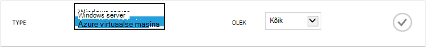
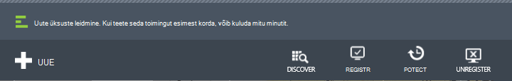
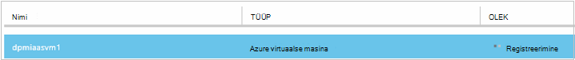
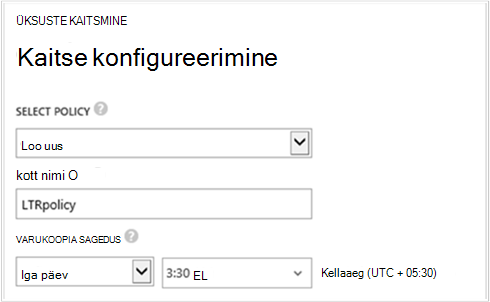
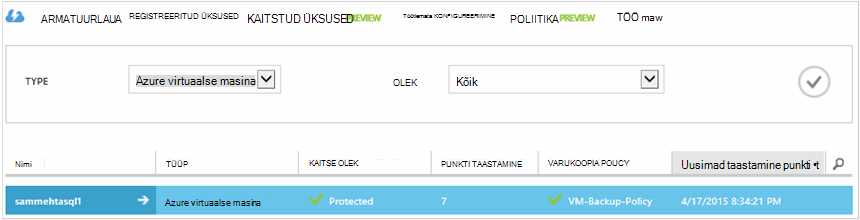

<properties
    pageTitle="Varundamine Azure'i virtuaalmasinates | Microsoft Azure'i"
    description="Tuvastada, registreerida ja varundada oma virtuaalmasinates koos Azure virtuaalse masina varundamise järgmisi toiminguid."
    services="backup"
    documentationCenter=""
    authors="markgalioto"
    manager="jwhit"
    editor=""
    keywords="virtuaalse masina varundamise; varundamine virtuaalse masina; Varundus- ja Avariijärgne taaste; VM varundamine"/>

<tags
    ms.service="backup"
    ms.workload="storage-backup-recovery"
    ms.tgt_pltfrm="na"
    ms.devlang="na"
    ms.topic="article"
    ms.date="09/28/2016"
    ms.author="trinadhk; jimpark; markgal;"/>

# Azure'i virtuaalmasinates varundamine

> [AZURE.SELECTOR]
- [Varundage VMs taastamise teenused vault](backup-azure-arm-vms.md)
- [Varundus vault VMs varundamine](backup-azure-vms.md)

Sellest artiklist leiate toiminguid varundate varundamise vault klassikaline juurutada Azure virtuaalse masina (VM). On mõned toimingud, mida peate enne, kui varundate on Azure virtuaalse masina eest. Kui te pole seda juba teinud, täitke [eeltingimused](backup-azure-vms-prepare.md) varundada oma VMs keskkonna ettevalmistamiseks.

Lisateabe saamiseks lugege artikleid [VM varukoopia taristu Azure kavandamise](backup-azure-vms-introduction.md) ja [Azure'i virtuaalmasinates](https://azure.microsoft.com/documentation/services/virtual-machines/).

>[AZURE.NOTE] Azure'i on kaks juurutamise mudelite loomise ja ressursside töötamine: [ressursihaldur ja klassikaline](../resource-manager-deployment-model.md). Varundus vault saate kaitsta ainult klassikaline juurutatud VMs. Ei saa kaitsmine varundamise vault VMs ressursihaldur juurutatud. Üksikasjad taastamise teenused võlvid töötamise kohta leiate [VMs taastamise teenused vault varundada](backup-azure-arm-vms.md) .

Azure'i virtuaalmasinates varundada hõlmab kolmeks:

>[AZURE.NOTE] Varundada virtuaalmasinates on kohalik protsess. Te ei saa varundada virtuaalmasinates ühe piirkonna varukoopiate hoidla teises regioonis. Nii, et peate looma varukoopiate hoidla iga Azure'i ala, kus on VMs, mida varundatakse.

## Samm 1 - avastamine Azure'i virtuaalmasinates
Käivitage tuvastatakse mis tahes uue virtuaalmasinates (VM) lisatakse tellimuse enne registreerumist tagamiseks on discovery protsess. Protsessi päringute Azure'i virtuaalmasinates tellimus, koos täiendavat teavet loendi nagu pilvepõhise teenuse nimi ja piirkond.

1. [Klassikaline portaali](http://manage.windowsazure.com/) sisselogimine

2. Azure'i teenuste loend, klõpsake **Taastamise teenused** varundamine ja taastamine saidi võlvid loendi avamiseks.
    

3. Varundus võlvid loendis Valige vault VM varundada.

    Kui tegemist on uue vault portaali avatakse **Kiirkäivituse** lehele.

    

    Kui vault on eelnevalt konfigureeritud, avaneb portaali viimati kasutatud menüüsse.

4. Klõpsake menüü vault (lehe ülaservas) nuppu **Registreeritud üksused**.

    

5. Valige menüüst **Tüüp** **Azure virtuaalse masina**.

    

6. Klõpsake lehe allosas **avastamine** .
    

    On discovery protsess võib kuluda mõni minut ajal virtuaalmasinates on esitatud tabelina. Saate teada, et protsess töötab kuva allosas teatis on.

    

    Teatise muudatused protsess on lõpule viia. Kui see on discovery protsessi ei leidnud soovitud virtuaalmasinates, esmalt tagada VMs olemas. Kui VMs olemas, veenduge, et VMs on sama piirkonna varukoopiate hoidla. Kui VMs olemas ja piirkonna, veenduge, et VMs ei ole juba registreeritud varukoopiate hoidla. Kui seda ei saa määrata varukoopia võlvid varukoopiate hoidla on määratud VM.

    

    Kui olete avastanud uued üksused, minge etapp 2 ja registreerida oma VMs.

##  Samm 2 - Register Azure'i virtuaalmasinates
Registreerige Azure virtuaalse masina seostada teenuse Azure varukoopia. See on tavaliselt ühekordse tegevus.

1. Liikuge jaotises **Taastamise teenused** varukoopiate hoidla Azure portaali ja siis nuppu **Registreeritud üksused**.

2. Valige rippmenüüst menüü **Azure virtuaalse masina** .

    

3. Klõpsake lehe allosas **registreerida** .
    

4. Valige kiirmenüüs **Registreerida üksuste** virtuaalmasinates, mida soovite registreerida. Kui loendis on kahe või enama virtuaalmasinates sama nimega, kasutage pilveteenusesse nende vahel vahet teha.

    >[AZURE.TIP] Mitme virtuaalmasinates saab korraga registreerida.

    Töö luuakse iga virtuaalse masina valitud.

5. Klõpsake nuppu **Kuva töö** teatise **töö** lehele.

    

    Virtuaalse masina kuvatakse ka loendis registreeritud üksust registreerimise toimingu olekut.

    

    Kui toiming on lõpule jõudnud, olek muutub kajastavad *registreeritud* .

    

## Samm 3 – kaitse Azure'i virtuaalmasinates
Nüüd saate häälestada virtuaalse masina varundus ja säilitamise poliitika. Mitme virtuaalmasinates saab kaitsta, kasutades ühte kaitse toiming.

Azure'i varundus võlvid loodud pärast mai 2015 tulla vault sisse ehitatud vaikepoliitika. Selle vaikepoliitika on vaikimisi 30 päeva ja üks kord päevas varukoopia ajakava säilitamine.

1. Liikuge jaotises **Taastamise teenused** varukoopiate hoidla Azure'i portaalis, ja seejärel nuppu **Registreeritud üksused**.
2. Valige rippmenüüst menüü **Azure virtuaalse masina** .

    

3. Klõpsake lehe allosas **kaitse** .

    Kuvatakse **üksuste kaitsta viisard** . Viisard on loetletud ainult virtuaalmasinates, mis on registreeritud ja pole kaitstud. Valige virtuaalmasinates, mida soovite kaitsta.

    Kui loendis on kahe või enama virtuaalmasinates sama nimega, pilveteenusesse abil soovitud virtuaalmasinates eristada.

    >[AZURE.TIP] Saate korraga mitme virtuaalmasinates kaitsta.

    

4. Valige **varukoopia ajakava** valitud virtuaalmasinates varundada. Saate valida mõne olemasoleva määra poliitika või määratleda uue.

    Iga varukoopia poliitika võib olla mitu virtuaalmasinates seotud. Siiski virtuaalse masina saab ainult seostatud ühe poliitika, mis tahes ajal.

    

    >[AZURE.NOTE] Varukoopia poliitika sisaldab säilituspoliitika värviskeemi ajastatud varukoopiaid. Kui valite olemasoleva varukoopia poliitika, ei saa muuta säilituspoliitika suvandid järgmise juhise juurde.

5. Valige **vahemiku säilitamine** varukoopiaid seostada.

    

    Säilituspoliitika määrab aeg varukoopia talletamiseks. Saate määrata, kui varukoopia põhjal erinevate Säilituspoliitikad. Näiteks võib 90 päeva säilitada varukoopia punkti tehtud iga päev (mis toimib mõnda taastamist punkti). Võrdlus, peate säilitada paljude kuude või aastate varukoopia punkti tehtud (kontrollimiseks) iga kvartali lõpu seisuga.

    

    Selles näites pildil:

    - **Igapäevane säilituspoliitika**: varukoopiate tehtud iga päev on talletatud 30 päeva.
    - **Nädala säilituspoliitika**: varukoopiate tehtud iga nädal pühapäevaga säilitatakse 104 nädala jooksul.
    - **Igakuine säilituspoliitika**: iga kuu viimase pühapäeval tehtud varukoopiate säilivad 120 kuud.
    - **Aastane säilituspoliitika**: varukoopiate tehtud igal esimese pühapäeva säilivad 99 aastaks.

    Töö luuakse konfigureerimine kaitse poliitika ja selle poliitika jaoks iga virtuaalse masina, valitud on virtuaalmasinates seostada.

6. **Kaitse konfigureerimine** tööd, klõpsake menüü võlvid loendi vaatamiseks klõpsake **töö** ja valige **Kaitse konfigureerimine** filtrist **toiming** .

    

## Algne varundamine
Kui poliitika on kaitstud virtuaalse masina, see näitab üles vahekaardil **Kaitstud üksuste** olekuga *kaitstud - (ootel algse varukoopia)*. Vaikimisi on esimene ajastatud varundus *algse varukoopia*.

Algse varundamise käivitamiseks kohe pärast konfigureerimise kaitse:

1. **Üksuste kaitstud** lehe allosas nuppu **Varundus kohe**.

    Azure'i varukoopia teenus loob Varundustöö esialgse varundatud toimingu jaoks.

2. Klõpsake **tööde loendi kuvamiseks klõpsake vahekaarti** .

    

>[AZURE.NOTE] Varukoopia töötamise ajal Azure varukoopia teenuse käsib varukoopia laiend iga virtual kohapeal tühjendage Alustuseks kõik kirjutamine tööd ja ühtsete hetktõmmis.

Algne varundamise lõpulejõudmisel virtuaalse masina **Kaitstud üksuste** vahekaardil olek on *kaitstud*.

## Varunduse olek ja üksikasjade kuvamine
Kui kaitstud, virtuaalse masina arv suureneb ka **armatuurlaua** lehe kokkuvõte. **Armatuurlaua** leht kuvatakse ka viimase 24 tunni jooksul, mis ei *õnnestunud*, on *nurjunud*ja on *pooleli*tööde arv. Klõpsake lehel **töö** kasutada tööde **olek**, **toiming**või **saatja** ja **Adressaat** menüüd.

Väärtuste armatuurlaua värskendatakse iga 24 tunni järel.

## Tõrkeotsing
Kui tekib probleeme varundamise ajal virtual masinat, vaadake [VM tõrkeotsingu artikkel](backup-azure-vms-troubleshoot.md) abi.

## Järgmised sammud

- [Hallata ja jälgida oma virtuaalmasinates](backup-azure-manage-vms.md)
- [Virtuaalmasinates taastamine](backup-azure-restore-vms.md)
