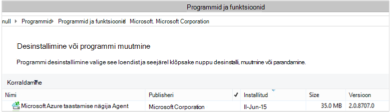

<properties
    pageTitle="Juurutada ja hallata varundamise jaoks Windows Server/kliendi PowerShelli kaudu | Microsoft Azure'i"
    description="Saate teada, kuidas juurutada ja hallata Azure varukoopia PowerShelli abil"
    services="backup"
    documentationCenter=""
    authors="saurabhsensharma"
    manager="shivamg"
    editor=""/>

<tags
    ms.service="backup"
    ms.workload="storage-backup-recovery"
    ms.tgt_pltfrm="na"
    ms.devlang="na"
    ms.topic="article"
    ms.date="09/01/2016"
    ms.author="saurabhsensharma;markgal;jimpark;nkolli;trinadhk"/>


# <a name="deploy-and-manage-backup-to-azure-for-windows-serverwindows-client-using-powershell"></a>Juurutada ja hallata varundamise kliendile Azure'i jaoks Windows Server/Windows PowerShelli abil

> [AZURE.SELECTOR]
- [ARM](backup-client-automation.md)
- [Klassikaline](backup-client-automation-classic.md)

Selles artiklis kirjeldatakse, kuidas PowerShelli kasutamine Windows Server või mõnda muud klienti Windows Azure'i varukoopia loomise ja haldamise varundamine ja taastamine.

## <a name="install-azure-powershell"></a>Azure'i PowerShelli installimine

[AZURE.INCLUDE [learn-about-deployment-models](../../includes/learn-about-deployment-models-include.md)]

See artikkel keskendub võimaldavad kasutada taastamise teenused vault ressursirühma Azure'i ressursi Manager (ARM) PowerShelli cmdlet-käskude.

Oktoober 2015 ilmus Azure PowerShelli 1.0. See väljaanne õnnestus soovitud 0.9.8 versioon ja toodud mõned olulised muudatused, eriti nimede muster cmdlet-käskude kohta. Järgige 1.0 cmdletid nimede muster {tegusõna} – {nimisõna}; AzureRm Seetõttu on 0.9.8 nimed ei sisalda **Rm** (nt New-AzureRmResourceGroup New-AzureResourceGroup asemel). Azure'i PowerShelli 0.9.8 kasutamisel peate esmalt lubama ressursihaldur režiimi **Aktiveerimine-AzureMode AzureResourceManager** käsu. See käsk pole vaja 1.0 või uuem versioon.

Kui soovite kasutada oma skriptide jaoks soovitud 0.9.8 kirjutatud keskkonnas, 1.0 või uuem keskkonnas, peaks hoolikalt testida skriptide tootmiseelse keskkonnas enne nende kasutamist valmistamisel ootamatu mõju vältimiseks.

[Laadige alla PowerShelli uusim versioon](https://github.com/Azure/azure-powershell/releases) (on nõutav vähemalt versioon: 1.0.0)


[AZURE.INCLUDE [arm-getting-setup-powershell](../../includes/arm-getting-setup-powershell.md)]

## <a name="create-a-recovery-services-vault"></a>Taastamise teenuste hoidla loomine

Järgmised toimingud juhatab teid läbi taastamise teenused vault loomine. Taastamise teenused vault erineb varundamise vault.

1. Kui kasutate Azure varukoopia esimest korda, peate kasutama **Register-AzureRMResourceProvider** cmdlet registreerida Azure taastamise teenusepakkuja tellimus.

    ```
    PS C:\> Register-AzureRmResourceProvider -ProviderNamespace "Microsoft.RecoveryServices"
    ```

2. Vault taastamise teenused on ARM ressurss, seega peate aset ressursirühma. Saate kasutada olemasolevat rühma ressursi või looge uus. Kui loote uue ressursirühma, määrake nimi ja asukoht ressursirühma.  

    ```
    PS C:\> New-AzureRmResourceGroup –Name "test-rg" –Location "West US"
    ```

3. **Uus-AzureRmRecoveryServicesVault** cmdlet-käsu abil saate luua uue vault. Ärge unustage vault sama asukoha määramiseks, mida kasutati ressursirühma.

    ```
    PS C:\> New-AzureRmRecoveryServicesVault -Name "testvault" -ResourceGroupName " test-rg" -Location "West US"
    ```

4. Määrake tüübi talletusruumi koondamise kasutama; saate kasutada [Kohalikult liigsete salvestusruumi (LRS)](../storage/storage-redundancy.md#locally-redundant-storage) või [Geo liigsete salvestusruumi (GRS)](../storage/storage-redundancy.md#geo-redundant-storage). Järgmises näites on kujutatud - BackupStorageRedundancy suvandi testVault väärtuseks GeoRedundant.

    > [AZURE.TIP] Paljud Azure varukoopia cmdlet-käsud on vaja sisendina taastamise teenused vault objekti. Seetõttu on mugav talletada varukoopia taastamise teenused vault objekti muutujana.

    ```
    PS C:\> $vault1 = Get-AzureRmRecoveryServicesVault –Name "testVault"
    PS C:\> Set-AzureRmRecoveryServicesBackupProperties  -vault $vault1 -BackupStorageRedundancy GeoRedundant
    ```

## <a name="view-the-vaults-in-a-subscription"></a>Tellimuse võlvid kuvamine
**Get-AzureRmRecoveryServicesVault** abil saate vaadata kõiki võlvid praeguse tellimuse. Kontrollige, et on loodud uue vault või vaadata, millised võlvid on saadaval tellimuse, saate selle käsu.

Käivitage käsk Get-AzureRmRecoveryServicesVault, ja kõik võlvid tellimuse on loetletud.

```
PS C:\> Get-AzureRmRecoveryServicesVault
Name              : Contoso-vault
ID                : /subscriptions/1234
Type              : Microsoft.RecoveryServices/vaults
Location          : WestUS
ResourceGroupName : Contoso-docs-rg
SubscriptionId    : 1234-567f-8910-abc
Properties        : Microsoft.Azure.Commands.RecoveryServices.ARSVaultProperties
```


## <a name="installing-the-azure-backup-agent"></a>Azure'i varundus agent installimine
Enne installimist Azure varukoopia agent, peate olema serveris Windows Installeri allalaaditud ja esitamine. Installiprogrammi uusima versiooni saate [Microsofti allalaadimiskeskusest](http://aka.ms/azurebackup_agent) või taastamise teenused vault armatuurlaua lehe kaudu. Salvestage installer kergesti juurdepääsetavad kohta, nt * C:\Downloads\*.

Agent installimiseks käivitage järgmine käsk administraatoriõigustes PowerShelli konsooli:

```
PS C:\> MARSAgentInstaller.exe /q
```

See installib agent vaikimisi valikuid. Installimine võtab paar minutit taustal. Kui te ei määra */nu* suvand avatakse aken **Windows Update** värskendusi mis tahes installimise lõpus. Kui installitud, kuvatakse agent installitud programmide loendis.

Installitud programmide loendi kuvamiseks avage **Juhtpaneelil** > **programmide** > **programmid ja funktsioonid**.



### <a name="installation-options"></a>Installimise suvandid

Kõik käsurea kaudu saadaolevate suvandite kuvamiseks kasutage järgmist käsku:

```
PS C:\> MARSAgentInstaller.exe /?
```

Saadaolevad suvandid on järgmised.

| Suvand | Üksikasjad | Vaikimisi |
| ---- | ----- | ----- |
| /q | Vaikne installimine | - |
| /p: "asukoht" | Azure'i varundus agent installi kausta tee. | C:\Program Files\Microsoft Azure taastamise teenused agendi |
| Sissejuhtimise "asukoht" | Azure'i varundus agent vahemälu kausta tee. | C:\Program Files\Microsoft Azure taastamise teenused Agent\Scratch |
| /m | Osalemine Microsoft Update | - |
| /nu | Vaata värskendusi pärast installimist | - |
| d | Microsoft Azure taastamise teenused agendi desinstallitakse. | - |
| /pH | Puhverserveri hosti aadress | - |
| /Po | Puhverserveri Host pordi Number | - |
| /PU | Puhverserveri Host kasutajanimi | - |
| /pw | Puhverserveri parooli | - |


## <a name="registering-windows-server-or-windows-client-machine-to-a-recovery-services-vault"></a>Windows Serveri või Windowsi kliendi masina taastamise teenuste hoidla registreerimine

Kui olete loonud taastamise teenused võlvkelder uusim agent ja hoidla mandaat alla laadida ja salvestada selle asukoht, nt C:\Downloads.

```
PS C:\> $credspath = "C:\downloads"
PS C:\> $credsfilename = Get-AzureRmRecoveryServicesVaultSettingsFile -Backup -Vault $vault1 -Path  $credspath
PS C:\> $credsfilename C:\downloads\testvault\_Sun Apr 10 2016.VaultCredentials
```

Käivitage Windows Server või Windows klientarvutis, [Algus-OBRegistration](https://technet.microsoft.com/library/hh770398%28v=wps.630%29.aspx) cmdlet masina registreeruma vault.

```
PS C:\> $cred = $credspath + $credsfilename
PS C:\> Start-OBRegistration-VaultCredentials $cred -Confirm:$false
CertThumbprint      :7a2ef2caa2e74b6ed1222a5e89288ddad438df2
SubscriptionID      : ef4ab577-c2c0-43e4-af80-af49f485f3d1
ServiceResourceName: testvault
Region              :West US
Machine registration succeeded.
```

> [AZURE.IMPORTANT] Kasutage suhtelised teed faili vault mandaadi määramiseks. Peate esitama sisendina cmdlet absoluutne tee.

## <a name="networking-settings"></a>Võrgunduse sätted
Kui Windows seadme Interneti ühenduvus on puhverserveri kaudu, võivad puhverserveri sätete ette ka agent. Selles näites on puhverserver, et meil on konkreetselt tühjendada puhverserveri seotud teabe.

Läbilaskevõime kasutuse saab kontrollida ka suvandite ```work hour bandwidth``` ja ```non-work hour bandwidth``` antud hulk nädalapäevadele.

Sätte puhverserveri ja läbilaskevõime üksikasjad tehakse cmdlet-käsu [Set-OBMachineSetting](https://technet.microsoft.com/library/hh770409%28v=wps.630%29.aspx) abil:

```
PS C:\> Set-OBMachineSetting -NoProxy
Server properties updated successfully.

PS C:\> Set-OBMachineSetting -NoThrottle
Server properties updated successfully.
```

## <a name="encryption-settings"></a>Krüptimise sätted
Varundatud andmete saadetud Azure varukoopia on krüptitud konfidentsiaalsusega andmete kaitsmiseks. Krüptimise parool on "parool" andmeid dekrüptida ajal taastada.

```
PS C:\> ConvertTo-SecureString -String "Complex!123_STRING" -AsPlainText -Force | Set-OBMachineSetting
Server properties updated successfully
```

> [AZURE.IMPORTANT] Parooli teavet säilitada turvalise kui see on määratud. Te ei saa andmete taastamine Azure'i ilma selle parool.

## <a name="back-up-files-and-folders"></a>Failide ja kaustade varundamine
Kõigi varukoopiaid Azure varukoopia Windowsi serverid ja kliendid on reguleeritud poliitika. Poliitika koosneb kolmest osast:

1. **Varunduse ajakava** , mis määrab, kui on vaja varukoopiate tehtud ja sünkroonida teenuse.
2. **Säilituspoliitika ajakava** , mis määrab, kui kaua säilitamise taastamise punkte Azure.
3. **Faili lisamine/välistamist määratlus** , mis ütleb, mis peaks.

Selles dokumendis, kuna me ei automatiseerimine varundamise, Oletame midagi on konfigureeritud. Alustame loomisega uue varukoopia poliitika cmdlet-käsu [New-OBPolicy](https://technet.microsoft.com/library/hh770416.aspx) abil.

```
PS C:\> $newpolicy = New-OBPolicy
```

Sel ajal poliitika on tühi ja muude cmdlet-käsud on vaja määratleda üksusi saab kaasata või välja jäetud, kui varukoopiate käivitavad ja koht, kus talletatakse varukoopiaid.

### <a name="configuring-the-backup-schedule"></a>Varunduse ajakava konfigureerimine
Esimene 3 osa poliitika on varukoopia ajakava, mis on loodud cmdlet-käsu [New-OBSchedule](https://technet.microsoft.com/library/hh770401) abil. Varunduse ajakava määratleb, millal on vaja võtta varukoopiad. Ajakava loomisel peate määrama 2 parameetrid:

- **Nädalapäevadel** , mis peaks töötama varukoopia. Saate käivitada ainult üks päev Varundustöö või iga päev nädala või mis tahes kombinatsiooni vahel.
- **Korda päeva** käitamise varukoopia. Saate määratleda kuni 3 korda, kui käivitatakse varukoopia päeva.

Näiteks saanud konfigureerida varukoopia poliitika, mis töötab kell 4 iga laupäevast ja pühapäevast.

```
PS C:\> $sched = New-OBSchedule -DaysofWeek Saturday, Sunday -TimesofDay 16:00
```

Varunduse ajakava peab olema seostatud poliitika ja selle saavutamiseks cmdlet [Set-OBSchedule](https://technet.microsoft.com/library/hh770407) abil.

```
PS C:> Set-OBSchedule -Policy $newpolicy -Schedule $sched
BackupSchedule : 4:00 PM Saturday, Sunday, Every 1 week(s) DsList : PolicyName : RetentionPolicy : State : New PolicyState : Valid
```
### <a name="configuring-a-retention-policy"></a>Säilituspoliitika konfigureerimine
Säilituspoliitika määratleb, kui kaua säilitatakse taastamise punkte loodud varundamise. Kui loote uue säilituspoliitika cmdlet-käsu [New-OBRetentionPolicy](https://technet.microsoft.com/library/hh770425) abil, saate määrata varukoopia taastamise punkte tuleb säilitada koos Azure varukoopia päevade arv. Järgmises näites määrab säilituspoliitika 7 päevaks.

```
PS C:\> $retentionpolicy = New-OBRetentionPolicy -RetentionDays 7
```

Säilituspoliitika tuleb seotud peamine poliitika cmdlet-käsu [Set-OBRetentionPolicy](https://technet.microsoft.com/library/hh770405)abil:

```
PS C:\> Set-OBRetentionPolicy -Policy $newpolicy -RetentionPolicy $retentionpolicy

BackupSchedule  : 4:00 PM
                  Saturday, Sunday,
                  Every 1 week(s)
DsList          :
PolicyName      :
RetentionPolicy : Retention Days : 7

                  WeeklyLTRSchedule :
                  Weekly schedule is not set

                  MonthlyLTRSchedule :
                  Monthly schedule is not set

                  YearlyLTRSchedule :
                  Yearly schedule is not set

State           : New
PolicyState     : Valid
```
### <a name="including-and-excluding-files-to-be-backed-up"></a>Sh ja välja arvatud varundada failid
Mõne ```OBFileSpec``` objekti määratleb failid sisalduv ja välistatud varukoopia. See on reeglikomplekti, mille ulatus kaitstud faile ja kaustu arvutisse. Saate määrata mitme faili kaasamine või välistamine reeglid vastavalt vajadusele ning poliitika seostada. Kui loote uue OBFileSpec objekti, saate teha järgmist.

- Määrake faile ja kaustu lisada
- Määrake faile ja kaustu välja jätta
- Määrake Rekursiivsed varukoopia kausta (või) kas ainult kõrgeima taseme failid määratud kausta peaks andmed üles.

Viimane on saavutada käsu New-OBFileSpec - NonRecursive lipu abil.

Järgmises näites, vaatame varundamine helitugevuse c ja d ja välistamine OS kahendfaile Windowsi kausta ja kõik ajutised kaustad. Selleks loome kaks faili tehnilised andmed, kasutades [New-OBFileSpec](https://technet.microsoft.com/library/hh770408) cmdlet - üks lisamise ja üks välistamist. Kui faili tehnilised andmed on loodud, nad on seostatud [Lisa-OBFileSpec](https://technet.microsoft.com/library/hh770424) cmdlet-käsu abil poliitika.

```
PS C:\> $inclusions = New-OBFileSpec -FileSpec @("C:\", "D:\")

PS C:\> $exclusions = New-OBFileSpec -FileSpec @("C:\windows", "C:\temp") -Exclude

PS C:\> Add-OBFileSpec -Policy $newpolicy -FileSpec $inclusions

BackupSchedule  : 4:00 PM
                  Saturday, Sunday,
                  Every 1 week(s)
DsList          : {DataSource
                  DatasourceId:0
                  Name:C:\
                  FileSpec:FileSpec
                  FileSpec:C:\
                  IsExclude:False
                  IsRecursive:True

                  , DataSource
                  DatasourceId:0
                  Name:D:\
                  FileSpec:FileSpec
                  FileSpec:D:\
                  IsExclude:False
                  IsRecursive:True

                  }
PolicyName      :
RetentionPolicy : Retention Days : 7

                  WeeklyLTRSchedule :
                  Weekly schedule is not set

                  MonthlyLTRSchedule :
                  Monthly schedule is not set

                  YearlyLTRSchedule :
                  Yearly schedule is not set

State           : New
PolicyState     : Valid


PS C:\> Add-OBFileSpec -Policy $newpolicy -FileSpec $exclusions

BackupSchedule  : 4:00 PM
                  Saturday, Sunday,
                  Every 1 week(s)
DsList          : {DataSource
                  DatasourceId:0
                  Name:C:\
                  FileSpec:FileSpec
                  FileSpec:C:\
                  IsExclude:False
                  IsRecursive:True
                  ,FileSpec
                  FileSpec:C:\windows
                  IsExclude:True
                  IsRecursive:True
                  ,FileSpec
                  FileSpec:C:\temp
                  IsExclude:True
                  IsRecursive:True

                  , DataSource
                  DatasourceId:0
                  Name:D:\
                  FileSpec:FileSpec
                  FileSpec:D:\
                  IsExclude:False
                  IsRecursive:True

                  }
PolicyName      :
RetentionPolicy : Retention Days : 7

                  WeeklyLTRSchedule :
                  Weekly schedule is not set

                  MonthlyLTRSchedule :
                  Monthly schedule is not set

                  YearlyLTRSchedule :
                  Yearly schedule is not set

State           : New
PolicyState     : Valid
```

### <a name="applying-the-policy"></a>Poliitika rakendamist
Nüüd rühmapoliitika objekti on lõppenud ja on seotud varunduse ajakava, säilituspoliitika ja failide lisamine/välistamist loendit. Selle poliitika saab nüüd investeerida Azure varukoopia kasutada. Enne rakendamist vastloodud poliitika tagada, et ei olemasoleva varukoopia poliitikat, mis on seotud server [Eemalda-OBPolicy](https://technet.microsoft.com/library/hh770415) cmdleti abil. Poliitika eemaldamine küsib kinnituse. Kinnituse kasutamine vahele soovitud ```-Confirm:$false``` cmdlet lipp.

```
PS C:> Get-OBPolicy | Remove-OBPolicy
Microsoft Azure Backup Are you sure you want to remove this backup policy? This will delete all the backed up data. [Y] Yes [A] Yes to All [N] No [L] No to All [S] Suspend [?] Help (default is "Y"):
```

Rühmapoliitika objekti toime on lõpule jõudnud cmdlet-käsu [Set-OBPolicy](https://technet.microsoft.com/library/hh770421) abil. See küsib kinnitust. Kinnituse kasutamine vahele soovitud ```-Confirm:$false``` cmdlet lipp.

```
PS C:> Set-OBPolicy -Policy $newpolicy
Microsoft Azure Backup Do you want to save this backup policy ? [Y] Yes [A] Yes to All [N] No [L] No to All [S] Suspend [?] Help (default is "Y"):
BackupSchedule : 4:00 PM Saturday, Sunday, Every 1 week(s)
DsList : {DataSource
         DatasourceId:4508156004108672185
         Name:C:\
         FileSpec:FileSpec
         FileSpec:C:\
         IsExclude:False
         IsRecursive:True,

         FileSpec
         FileSpec:C:\windows
         IsExclude:True
         IsRecursive:True,

         FileSpec
         FileSpec:C:\temp
         IsExclude:True
         IsRecursive:True,

         DataSource
         DatasourceId:4508156005178868542
         Name:D:\
         FileSpec:FileSpec
         FileSpec:D:\
         IsExclude:False
         IsRecursive:True
    }
PolicyName : c2eb6568-8a06-49f4-a20e-3019ae411bac
RetentionPolicy : Retention Days : 7
              WeeklyLTRSchedule :
              Weekly schedule is not set

              MonthlyLTRSchedule :
              Monthly schedule is not set

              YearlyLTRSchedule :
              Yearly schedule is not set
State : Existing PolicyState : Valid
```

[Get-OBPolicy](https://technet.microsoft.com/library/hh770406) cmdlet-käsu abil olemasoleva varukoopia poliitika üksikasjade kuvamine Te saate süvitsimineku varunduse ajakava ja säilituspoliitikate [Get-OBRetentionPolicy](https://technet.microsoft.com/library/hh770427) cmdlet-käsk [Get-OBSchedule](https://technet.microsoft.com/library/hh770423) cmdlet täpsemaks abil

```
PS C:> Get-OBPolicy | Get-OBSchedule
SchedulePolicyName : 71944081-9950-4f7e-841d-32f0a0a1359a
ScheduleRunDays : {Saturday, Sunday}
ScheduleRunTimes : {16:00:00}
State : Existing

PS C:> Get-OBPolicy | Get-OBRetentionPolicy
RetentionDays : 7
RetentionPolicyName : ca3574ec-8331-46fd-a605-c01743a5265e
State : Existing

PS C:> Get-OBPolicy | Get-OBFileSpec
FileName : *
FilePath : \?\Volume{b835d359-a1dd-11e2-be72-2016d8d89f0f}\
FileSpec : D:\
IsExclude : False
IsRecursive : True

FileName : *
FilePath : \?\Volume{cdd41007-a22f-11e2-be6c-806e6f6e6963}\
FileSpec : C:\
IsExclude : False
IsRecursive : True

FileName : *
FilePath : \?\Volume{cdd41007-a22f-11e2-be6c-806e6f6e6963}\windows
FileSpec : C:\windows
IsExclude : True
IsRecursive : True

FileName : *
FilePath : \?\Volume{cdd41007-a22f-11e2-be6c-806e6f6e6963}\temp
FileSpec : C:\temp
IsExclude : True
IsRecursive : True
```

### <a name="performing-an-ad-hoc-backup"></a>Läbimiseks on ajutine varundamine
Kui varukoopia poliitika on seatud juhtub varukoopiaid ajakava kohta. Käivitamise on ajutine varundus on võimalik [Algus-OBBackup](https://technet.microsoft.com/library/hh770426) cmdlet-käsu abil:

```
PS C:> Get-OBPolicy | Start-OBBackup
Taking snapshot of volumes...
Preparing storage...
Estimating size of backup items...
Estimating size of backup items...
Transferring data...
Verifying backup...
Job completed.
The backup operation completed successfully.
```

## <a name="restore-data-from-azure-backup"></a>Andmete Azure varukoopia põhjal taastamine
Selles jaotises juhendab teid juhiseid automatiseerimiseks andmete taastamine Azure varukoopia põhjal. Seda tehes hõlmab järgmist:

1. Valige allikas maht
2. Valige taastamine varukoopia põhjal punkti
3. Valige üksuse taastamine
4. Käivitab toimingu taastamine

### <a name="picking-the-source-volume"></a>Valides allika maht
Azure'i varundus üksuse taastamine, et peate esmalt tuvastada allikas üksust. Kuna me ei käivitamisel käske Windows Serveri või Windowsi kliendi kontekstis, et arvutisse juba tuvastatud. Järgmise sammuna tuvastamise allika on draivi, mis sisaldab seda tuvastamiseks. Mahud või sellest arvutist varundamist allikate loendit saab tuua täites [Get-OBRecoverableSource](https://technet.microsoft.com/library/hh770410) cmdlet-käsk. See käsk tagastab massiivi kõik selle serveri/kliendilt varundatud allikad.

```
PS C:> $source = Get-OBRecoverableSource
PS C:> $source
FriendlyName : C:\
RecoverySourceName : C:\
ServerName : myserver.microsoft.com

FriendlyName : D:\
RecoverySourceName : D:\
ServerName : myserver.microsoft.com
```

### <a name="choosing-a-backup-point-to-restore"></a>Taastamine varukoopia põhjal punkti valimine
[Get-OBRecoverableItem](https://technet.microsoft.com/library/hh770399.aspx) cmdlet vastav parameetritega täites saab tuua nimekirja, mille varukoopia. Selles näites me valige Viimane varukoopia punkti allika mahu *D:* ja seda kasutada taastada mingit kindlat tüüpi failiga.

```
PS C:> $rps = Get-OBRecoverableItem -Source $source[1]
IsDir : False
ItemNameFriendly : D:\
ItemNameGuid : \?\Volume{b835d359-a1dd-11e2-be72-2016d8d89f0f}\
LocalMountPoint : D:\
MountPointName : D:\
Name : D:\
PointInTime : 18-Jun-15 6:41:52 AM
ServerName : myserver.microsoft.com
ItemSize :
ItemLastModifiedTime :

IsDir : False
ItemNameFriendly : D:\
ItemNameGuid : \?\Volume{b835d359-a1dd-11e2-be72-2016d8d89f0f}\
LocalMountPoint : D:\
MountPointName : D:\
Name : D:\
PointInTime : 17-Jun-15 6:31:31 AM
ServerName : myserver.microsoft.com
ItemSize :
ItemLastModifiedTime :
```
Objekti ```$rps``` on massiiv varukoopia punkte. Esimene element on Viimane punkt ja n. element on vanimast punkti. Kui soovite valida Viimane punkt, kasutame ```$rps[0]```.

### <a name="choosing-an-item-to-restore"></a>Üksuse taastamine valimine
Täpse fail või kaust taastada tuvastamiseks rekursiivselt cmdletiga [Get-OBRecoverableItem](https://technet.microsoft.com/library/hh770399.aspx) . Kaustahierarhias saate sirvida üksnes abil nii on ```Get-OBRecoverableItem```.

Selles näites kui soovime taastada faili *finances.xls* me saate viide mis objekti abil ```$filesFolders[1]```.

```
PS C:> $filesFolders = Get-OBRecoverableItem $rps[0]
PS C:> $filesFolders
IsDir : True
ItemNameFriendly : D:\MyData\
ItemNameGuid : \?\Volume{b835d359-a1dd-11e2-be72-2016d8d89f0f}\MyData\
LocalMountPoint : D:\
MountPointName : D:\
Name : MyData
PointInTime : 18-Jun-15 6:41:52 AM
ServerName : myserver.microsoft.com
ItemSize :
ItemLastModifiedTime : 15-Jun-15 8:49:29 AM

PS C:> $filesFolders = Get-OBRecoverableItem $filesFolders[0]
PS C:> $filesFolders
IsDir : False
ItemNameFriendly : D:\MyData\screenshot.oxps
ItemNameGuid : \?\Volume{b835d359-a1dd-11e2-be72-2016d8d89f0f}\MyData\screenshot.oxps
LocalMountPoint : D:\
MountPointName : D:\
Name : screenshot.oxps
PointInTime : 18-Jun-15 6:41:52 AM
ServerName : myserver.microsoft.com
ItemSize : 228313
ItemLastModifiedTime : 21-Jun-14 6:45:09 AM

IsDir : False
ItemNameFriendly : D:\MyData\finances.xls
ItemNameGuid : \?\Volume{b835d359-a1dd-11e2-be72-2016d8d89f0f}\MyData\finances.xls
LocalMountPoint : D:\
MountPointName : D:\
Name : finances.xls
PointInTime : 18-Jun-15 6:41:52 AM
ServerName : myserver.microsoft.com
ItemSize : 96256
ItemLastModifiedTime : 21-Jun-14 6:43:02 AM
```

Samuti saate otsida üksusi taastada, kasutades funktsiooni ```Get-OBRecoverableItem``` cmdlet-käsk. Selles näites otsimiseks *finances.xls* saaksime pidet faili selle käsu abil:

```
PS C:\> $item = Get-OBRecoverableItem -RecoveryPoint $rps[0] -Location "D:\MyData" -SearchString "finance*"
```

### <a name="triggering-the-restore-process"></a>Käivitamise taastamine
Taastamine protsessi käivitamiseks läheb vaja esmalt taastamise suvandite määramiseks. Seda saab teha [New-OBRecoveryOption](https://technet.microsoft.com/library/hh770417.aspx) cmdleti abil. Näiteks Oletame, soovime *C:\temp*failide taastamiseks. Oletame ka, et soovime failid, mis on juba olemas kaust *C:\temp*vahele jätta. Kasutage sellist taastamise võimalust loomiseks järgmine käsk:

```
PS C:\> $recovery_option = New-OBRecoveryOption -DestinationPath "C:\temp" -OverwriteType Skip
```

Nüüd käivitamine taastamine abil nupp [Start-OBRecovery](https://technet.microsoft.com/library/hh770402.aspx) valitud ```$item``` väljundi soovitud ```Get-OBRecoverableItem``` cmdlet-käsk:

```
PS C:\> Start-OBRecovery -RecoverableItem $item -RecoveryOption $recover_option
Estimating size of backup items...
Estimating size of backup items...
Estimating size of backup items...
Estimating size of backup items...
Job completed.
The recovery operation completed successfully.
```


## <a name="uninstalling-the-azure-backup-agent"></a>Azure'i varundus agent desinstallimine
Desinstallimine Azure varukoopia agent saab teha, kasutades järgmine käsk:

```
PS C:\> .\MARSAgentInstaller.exe /d /q
```

Desinstallimine agent kahendfaile arvutis on mõned tagajärjed silmas pidada.

- See eemaldab arvutist faili-filtri ja muutuste jälitus on peatatud.
- Kogu teave on eemaldatud arvutist, kuid endiselt poliitika teave talletatakse teenuse.
- Eemaldatakse kõik varukoopia ajakavasid ja pole veel varukoopiate on võetud.

Siiski andmed talletatakse Azure jääb ja säilivad teie säilitamise poliitikat häälestamise kohta. Vanema punktide olete automaatselt.

## <a name="remote-management"></a>Kaughalduse
Kõik ümber Azure varukoopia agent, poliitika ja andmeallikate haldamine saab teha eemalt PowerShelli kaudu. Arvuti, mida haldab kaugühenduse teel peab olema õigesti valmis.

Vaikimisi on konfigureeritud kaughalduse teenuse käsitsi käivitamine. Sätte Käivitustüüp peab olema seatud *automaatse* ja teenuse alustada. Veenduge, et WinRM teenus töötab, tuleks olek atribuudi väärtus *töötab*.

```
PS C:\> Get-Service WinRM

Status   Name               DisplayName
------   ----               -----------
Running  winrm              Windows Remote Management (WS-Manag...
```

PowerShelli peaks olema konfigureeritud remoting.

```
PS C:\> Enable-PSRemoting -force
WinRM is already set up to receive requests on this computer.
WinRM has been updated for remote management.
WinRM firewall exception enabled.

PS C:\> Set-ExecutionPolicy unrestricted -force
```

Seadme saab nüüd hallata kaugühenduse teel – alates agendi installimine. Näiteks järgmine skript kopeerib agent kaugarvuti ja installib.

```
PS C:\> $dloc = "\\REMOTESERVER01\c$\Windows\Temp"
PS C:\> $agent = "\\REMOTESERVER01\c$\Windows\Temp\MARSAgentInstaller.exe"
PS C:\> $args = "/q"
PS C:\> Copy-Item "C:\Downloads\MARSAgentInstaller.exe" -Destination $dloc - force

PS C:\> $s = New-PSSession -ComputerName REMOTESERVER01
PS C:\> Invoke-Command -Session $s -Script { param($d, $a) Start-Process -FilePath $d $a -Wait } -ArgumentList $agent $args
```

## <a name="next-steps"></a>Järgmised sammud
Lisateabe saamiseks Windows Server/kliendi Azure'i varundus jaoks, vaadake teemat

- [Azure'i varukoopiad tutvustus](backup-introduction-to-azure-backup.md)
- [Windows serverite varundamine](backup-configure-vault.md)
