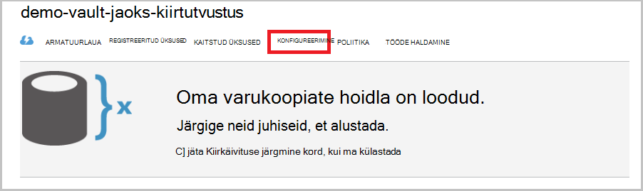
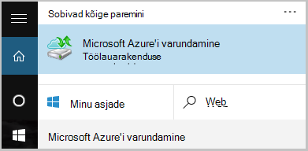

<properties
    pageTitle="Windows Serveri või kliendi Azure'i klassikaline juurutamise näidise varundamine | Microsoft Azure'i"
    description="Varukoopia Windowsi serverid või kliendid Azure loomise varukoopiate hoidla, identimisteabe allalaadimise, installimise varukoopia agent ja lõpetamist mõni algse varukoopia faile ja kaustu."
    services="backup"
    documentationCenter=""
    authors="markgalioto"
    manager="cfreeman"
    editor=""
    keywords="varukoopiate hoidla; varundamine Windows server; varukoopia Windowsi;"/>

<tags
    ms.service="backup"
    ms.workload="storage-backup-recovery"
    ms.tgt_pltfrm="na"
    ms.devlang="na"
    ms.topic="article"
    ms.date="08/08/2016"
    ms.author="jimpark; trinadhk; markgal"/>

# Windows Serveri või kliendi Azure'i klassikaline juurutamise näidise varundamine

> [AZURE.SELECTOR]
- [Klassikaline portaal](backup-configure-vault-classic.md)
- [Azure'i portaal](backup-configure-vault.md)

Selles artiklis käsitletakse toiminguid, mida peate järgima keskkonna ettevalmistamiseks ja Windows server (või kliendi) varundamiseks Azure. See hõlmab ka kaalutluste kohta juurutamine varukoopia lahendus. Kui olete huvitatud üritab Azure varukoopia esmakordselt, selles artiklis kiiresti juhatab teid läbi protsessi.

>[AZURE.IMPORTANT] Azure'i on kaks eri juurutamise mudelite loomise ja ressursside töötamine: ressursihaldur ja klassikaline. Selles artiklis antakse ülevaade klassikaline juurutamise mudeli abil. Microsoft soovitab, et kõige uue juurutuste ressursihaldur mudeli kasutamine.

## Enne alustamist
Varundage serveri või kliendi Azure'i, peate Azure'i konto. Kui teil pole ühte, saate luua ka [tasuta konto](https://azure.microsoft.com/free/) vaid paar minutit.

## Samm 1: Loo varukoopiate hoidla
Varundage faile ja kaustu serveri või klient, peate looma varukoopiate hoidla geograafilised piirkonna, kuhu soovite andmed salvestada.

### Varukoopiate hoidla loomine

1. [Klassikaline portaali](https://manage.windowsazure.com/)sisse logima.

2. Klõpsake nuppu **Uus** > **Data Services** > **Taastamise teenused** > **Varundamise Vault**, ja seejärel valige **Kiiresti luua**.

3. Parameetri **nimi** , sisestage varukoopiate hoidla sõbralik nimi. Tippige nimi, mis sisaldab 2 – 50 märki. See peab algama tähega ja võib sisaldada ainult tähti, numbreid ja sidekriipse. See nimi peab olema kordumatu iga tellimuse jaoks.

4. Valige parameeter **piirkond** geograafilised piirkonna varukoopiate hoidla. See valik määrab geograafilised piirkond, kus teie varundatud andmete saadetakse. Valides geograafilise asukoha lähedane piirkonnas, saate vähendada võrgu latentsus, kui Azure varundada.

5. Klõpsake nuppu **Loo Vault**.

    

    Võib kuluda aega varukoopiate hoidla luua. Oleku kontrollimine jälgimine teatiste klassikaline portaali allosas.

    Pärast varukoopiate hoidla on loodud, kuvatakse teile teade, et vault on edukalt loodud. Samuti ilmub **aktiivseks** **Taastamise teenused** ressursside loend.

    

4. Klõpsake raadionuppu salvestusruumi koondamise siin kirjeldatud juhiseid järgides.

    >[AZURE.IMPORTANT] Parima aega tuvastada teie salvestusruumi koondamise suvand on kohe pärast vault loomine ja enne mis tahes masinad on registreeritud vault. Pärast üksuse registreerimist vault salvestusruumi koondamise suvand on lukus ja seda ei saa muuta.

    Kui kasutate Azure esmane varukoopia salvestusruumi endpoint (nt varundate Azure'i Windows Server), kaaluge [geograafilise liigne salvestusruumi](../storage/storage-redundancy.md#geo-redundant-storage) suvandi valimisel (vaikesäte).

    Kui kasutate Azure on kolmanda taseme varukoopia salvestusruumi lõpp-punkti (nt kasutate süsteemi andmete kaitse Manager poe kohapealse kohaliku varukoopia ja kasutamine Azure pikaajaline säilitus peab), kaaluge [kohalikult liigsete salvestusruumi](../storage/storage-redundancy.md#locally-redundant-storage). See toob hinna andmete salvestamiseks Azure, tagades kestvus madalama taseme korral võivad olla lubatud kolmanda taseme eksemplaride andmete alla.

    **Salvestusruumi koondamise suvandi valimine**

    lisamine. Klõpsake äsja loodud vault.

    b. Valige lehel Kiirkäivituse **konfigureerimine**.

    

    c. Valige suvand hoidmise koondamine.

    Kui valite **Kohalikult liigsed**, peate nuppu **Salvesta** (Kuna **Geo-tarbetud** on vaikimisi valitud).

    d. Klõpsake vasakpoolsel navigeerimispaanil nuppu **Taastamise teenused** naasmiseks ressursside loendi taastamine teenuste jaoks.

## Samm 2: Vault mandaati faili alla laadida
Kohapealse arvuti peab olema kinnitatud varukoopiate hoidla enne selle saate varundada Azure. Autentimine on saavutada *hoidla mandaat*. Vault mandaati faili alla laadida klassikaline portaalist turvalise kanali kaudu. Serdi privaatvõti püsivad portaalis või teenuse.

Lisateave [identimisteabe autentida varundamise teenuse abil võlvkelder](backup-introduction-to-azure-backup.md#what-is-the-vault-credential-file).

### Kohalikus arvutis vault mandaati faili allalaadimiseks

1. Klõpsake vasakpoolsel navigeerimispaanil nuppu **Taastamise teenused**, ja valige varukoopiate hoidla, mille lõite.

    

2.  Klõpsake lehel kiirjuhendi **allalaadimine hoidla mandaat**.

    Klassikaline portaali loob vault mandaati vault nime ja praeguse kuupäeva kombinatsiooni abil. Vault identimisteabe faili kasutatakse ainult registreerimise töövoo käigus ja 48 tundi pärast aegumist.

    Vault mandaati faili saab alla laadida portaalist.

3. Klõpsake faili alla laadida vault mandaati kohaliku konto kausta Allalaaditavad failid **salvestada** . Võite valida ka **Salvesta nimega** **salvestamine** menüüst vault mandaati faili asukoha määramiseks.

    >[AZURE.NOTE] Veenduge, et vault mandaati fail on salvestatud kohta, kuhu pääseb juurde teie arvutist. Kui see on salvestatud failide ühiskasutus või serveri sõnumi blokeerimise, veenduge, et teil on õigused pääsete neile juurde.

## Samm 3: Allalaadimine, installimine ja varundamise agent registreerimine
Kui loote varukoopiate hoidla ja vault mandaati faili alla laadida, agent peab olema installitud iga teie Windowsi masinad.

### Alla laadida, installida ja registreerida agent

1. **Taastamise teenused**klõpsake ja valige varukoopiate hoidla, soovitud serveri registreerida.

2. Klõpsake lehel Kiirkäivituse agent **agenti Windows Server või süsteemi andmed kaitse Manager või Windowsi kliendi**. Klõpsake nuppu **Salvesta**.

    

3. Pärast MARSagentinstaller.exe fail on alla laaditud, klõpsake nuppu **Käivita** (või topeltklõpsake **MARSAgentInstaller.exe** salvestatud asukohast).

4. Valige installi kausta ja vahemälu kausta, mis on nõutavad agent, ja klõpsake nuppu **edasi**. Teie määratud vahemälu asukoht peab olema varundatud andmete võrdne vähemalt 5 protsenti vaba ruumi.

5. Saate jätkata puhverserveri vaikesätete kaudu Interneti-ühenduse.          Kui kasutate puhverserverit, klõpsake lehel puhverserveri konfigureerimine Interneti-ühenduse **kohandatud puhverserveri sätete kasutamiseks** märkige ruut ja Sisestage puhverserveri server üksikasjad. Kui kasutate autenditud puhverserverit, sisestage kasutaja nimi ja parool üksikasjad ja seejärel klõpsake nuppu **edasi**.

7. Klõpsake **installida** agent installimise alustamiseks. Varundus agent installib Windows PowerShelli .NET Framework 4.5 ja (kui see pole juba installitud) installimise lõpuleviimiseks.

8. Kui agent on installitud, klõpsake **jätkata registreerimise** jätkamiseks töövoog.

9. Lehel Vault ID Sirvige ja valige vault mandaati fail, mille olete varem allalaaditud.

    Vault mandaati fail on lubatud ainult 48 tundi pärast seda, kui see on alla laaditud portaali. Kui teil ilmneb tõrge, klõpsake selle lehe (nt "hoidla mandaat fail on aegunud"), portaali sisse logida ja vault mandaati faili uuesti alla laadida.

    Veenduge, et vault mandaati fail on saadaval kohas, kus pääseb installi rakenduse. Accessi seotud tõrgete ilmnemisel vault mandaati faili kopeerimine samasse arvutisse ajutine asukoht ja proovige uuesti.

    Kui teil tekib vault mandaati tõrge, näiteks "lubamatud hoidla mandaat esitatud", fail on vigane või ei ole on uusim identimisteabe teenusega seotud taastamine. Pärast allalaadimist vault mandaati uue faili portaali toimingut korrata. See tõrge võib ilmneda ka juhul, kui kasutaja klõpsab **allalaadimine vault mandaati** suvand kiirülevaate järjest mitu korda. Sel juhul kehtib ainult Viimane vault mandaati fail.

9. Lehel krüptimise säte saate luua parooli või sisestage parool (minimaalselt 16 märki). Ärge unustage Salvesta parool turvalises asukohas.

10. Klõpsake nuppu **valmis**. Registreerida serveri viisardi registrite server varundamise.

    >[AZURE.WARNING] Kui te kaotate või unusta parool, Microsoft ei saa aidata varundatud andmete taastamine. Te oma krüptimine parooli ja Microsoft ei ole nähtavus parool, mida kasutate. Salvestage fail turvalises asukohas, sest see on nõutav taastamine töötamise ajal.

11. Pärast krüptovõtme on määratud, jätke ruut **Käivita Microsoft Azure taastamise Services Agent** valitud, ja seejärel klõpsake nuppu **Sule**.

## Samm 4: Täielik algse varundamine

Algne varukoopia sisaldab kahte põhitoimingute.

- Varunduse ajakava loomine
- Failide ja kaustade varundamise esimest korda

Pärast varukoopia poliitika algse varundus lõpule jõudnud, loob varukoopia punkte, mida saate kasutada siis, kui teil on vaja andmeid taastada. Varukoopia poliitika see põhineb mis määratleda ajakava.

### Plaanida varundamine

1. Avage Microsoft Azure varukoopia agent. (See avatakse automaatselt kui jätate **Käivitage Microsoft Azure taastamise Services Agent** ruut valimisega, kui sulgesite registreerida serveri viisardi.) Leiate oma seadme otsides **Microsoft Azure varukoopia**.

    

2. Klõpsake varundamise agent, **Ajakava varukoopia**.

    

3. Ajakava varundamise viisardi lehel alustamine nuppu **edasi**.

4. Valige üksuste varundamine lehele, klõpsake nuppu **Lisa üksusi**.

5. Valige failid ja kaustad, mida soovite varundada, ja klõpsake **Okay**.

6. Klõpsake nuppu **edasi**.

7. Klõpsake lehel **Määrake varukoopia ajakava** Määrake **varukoopia ajakava** ja klõpsake nuppu **edasi**.

    Saate ajastada iga päev (tempos kuni kolm korda päevas) või nädala varukoopiad.

    

    >[AZURE.NOTE] Lisateavet selle kohta, kuidas määrata varunduse ajakava leiate artiklist [Kasutamine Azure varukoopia asendamine oma lint taristu](backup-azure-backup-cloud-as-tape.md).

8. Valige lehel **Valige säilituspoliitika** **Säilituspoliitika** varukoopia.

    Säilituspoliitika määrab kestus, salvestatakse varukoopia. Asemel ainult täpsustades "tasapinnalise poliitika" kõik varukoopia punktid, saate määrata ilmnemisel varukoopia põhjal erinevate Säilituspoliitikad. Saate muuta iga päev, nädala, kuu ja aasta säilituspoliitikate teie vajadustele.

9. Valige lehel Valige esialgse varundatud tüüp esialgse varundatud tüüp. Jätke **automaatselt üle võrgu** valitud suvand ja seejärel klõpsake nuppu **edasi**.

    Saate varundada automaatselt võrgu kaudu või saate varundada ühenduseta. Ülejäänud selles artiklis kirjeldatakse varundamiseks automaatselt. Kui eelistate teha varukoopia, ühenduseta ülevaate artiklist [ühenduseta varukoopia töövoo Azure varukoopia](backup-azure-backup-import-export.md) lisateabe saamiseks.

10. Klõpsake lehel Confirmation teave üle ja seejärel klõpsake nuppu **valmis**.

11. Kui viisard on lõpule jõudnud, luua varukoopia ajakava, klõpsake nuppu **Sule**.

### Luba võrgus ahendamine (valikuline)

Varundus agent pakub võrgu pidurdamise. Võrgu läbilaskevõime kasutamise andmeedastuse ajal juhtelementide pidurdamise. Selle kontrolli võib olla kasulik, kui teil on vaja, varundada andmete ajal töötada, kuid ei taha häirida muid Interneti-liikluse varundamist. Pidurdamise kehtib varundamine ja taastamine tegevusi.

**Võrgu pidurdamise lubamiseks**

1. Varundus agent, klõpsake nuppu **Muuda atribuudid**.

    

2. Menüü **Throttling** märkige ruut **Luba Interneti läbilaskevõime kasutuse varukoopia toimingute pidurdamise** .

    

3. Kui olete lubanud pidurdamise, määrake lubatud läbilaskevõime varukoopia andmete edastamiseks **töötundide** ja **mitte - töötundide**ajal.

    Läbilaskevõime väärtused algavad 512 kilobitti sekundis (KB/s) ja minna kuni 1023 megabaiti (MB) sekundis. Saate määrata algus ja valmis **töö**tundi ja millist päeva nädalas on tööpäevade peetakse. Tunni väljaspool määratud töö tundi peetakse mitte-töö tundi.

4. Klõpsake nuppu **OK**.

### Nüüd varundamine

1. Varundus agent, klõpsake nuppu **Varunda kohe** lõpuleviimiseks esialgne külv võrgu kaudu.

    

2. Klõpsake lehel Confirmation kontrollige sätteid uuesti üles nüüd viisardi abil masina varundamine. Seejärel klõpsake nuppu **Varunda**.

3. Klõpsake viisardi sulgemiseks **sulgeda** . Kui te seda teete enne varundamist lõpetab, viisard endiselt taustal.

Pärast algse varundamine on lõpule jõudnud, kuvatakse **töö valmis** oleku varundamise konsooli.

## Järgmised sammud
- Registreeruda [tasuta Azure'i konto](https://azure.microsoft.com/free/).

VMs või muude töökoormused varundamise kohta lisateabe saamiseks vt

- [IaaS VMs varundamine](backup-azure-vms-prepare.md)
- [Microsoft Azure'i varundus server Azure'i töökoormus varundamine](backup-azure-microsoft-azure-backup.md)
- [Azure'i DPM-i töökoormus varundamine](backup-azure-dpm-introduction.md)
