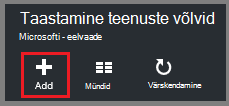

<properties
    pageTitle="Windows Serveri või kliendi Azure'i Azure varundamise ressursihaldur juurutamise näidise varundamine | Microsoft Azure'i"
    description="Varukoopia Windowsi serverid või kliendid Azure loomise varukoopiate hoidla, identimisteabe allalaadimise, installimise varukoopia agent ja lõpetamist mõni algse varukoopia faile ja kaustu."
    services="backup"
    documentationCenter=""
    authors="markgalioto"
    manager="cfreeman"
    editor=""
    keywords="varukoopiate hoidla; varundamine Windows server; varukoopia Windowsi;"/>

<tags
    ms.service="backup"
    ms.workload="storage-backup-recovery"
    ms.tgt_pltfrm="na"
    ms.devlang="na"
    ms.topic="article"
    ms.date="08/10/2016"
    ms.author="jimpark; trinadhk; markgal"/>

# Windows Serveri või kliendi Azure'i ressursihaldur juurutamise näidise varundamine

> [AZURE.SELECTOR]
- [Azure'i portaal](backup-configure-vault.md)
- [Klassikaline portaal](backup-configure-vault-classic.md)

Selles artiklis selgitatakse, kuidas Windows Server (või Windowsi kliendi) varundamiseks failide ja kaustade Azure'i Azure varundamise ressursihaldur juurutamise mudeli abil.

[AZURE.INCLUDE [learn-about-deployment-models](../../includes/backup-deployment-models.md)]

## Enne alustamist
Varundage serveri või kliendi Azure'i, peate Azure'i konto. Kui teil pole ühte, saate luua ka [tasuta konto](https://azure.microsoft.com/free/) vaid paar minutit.

## Samm 1: Loo taastamise teenused vault

Taastamise teenused vault on üksus, mis salvestab varukoopiate ja taastamise punkte loote aja jooksul. Vault taastamise teenused sisaldab ka varukoopia poliitika rakendatud kaitstud faile ja kaustu. Taastamise teenused vault loomisel saate märkida ka hoidmise koondamise suvand.

### Taastamise teenused vault loomiseks

1. Kui te pole seda juba teinud, [Azure portaali](https://portal.azure.com/) kaudu Azure tellimuse Logi sisse.

2. Jaoturi menüü, klõpsake nuppu **Sirvi** ja tippige ressursid loendis **Taastamise teenused**. Kui alustate tippimist, loendit filtreeritakse sisendit põhjal. Klõpsake **taastamise teenused võlvid**.

      

    Kuvatakse loend taastamise teenused võlvid.

3. Menüü **võlvid taastamise teenused** nuppu **Lisa**.

    

    Avaneb taastamise teenused vault tera, mis palub teil esitada **nimi**, **tellimuse**, **ressursirühm**ja **asukohaga**.

    

4. Sisestage **nimi**sõbralik nimi, mis tähistavad vault. Nimi peab olema kordumatu Azure tellimuse jaoks. Tippige nimi, mis sisaldab 2 – 50 märki. See peab algama tähega ja võib sisaldada ainult tähti, numbreid ja sidekriipse.

5. Klõpsake **tellimuse** saadaolevate tellimuste loendi kuvamiseks. Kui te pole kindel, milline tellimus kasutada, kasutage vaikeväärtust (või soovitatud) tellimus. Seal on mitu valikud ainult juhul, kui ettevõtte konto on seotud mitu Azure tellimust.

6. **Ressursirühm** on saadaval loendi kuvamiseks valige või klõpsake nuppu **Uus** , et luua uue ressursirühma. Ressursi rühmade kohta, leiate [Azure'i ressursihaldur ülevaade](../azure-resource-manager/resource-group-overview.md)

7. Klõpsake **asukoha** valimiseks piirkonnas vault jaoks. See valik määrab geograafilised piirkond, kus teie varundatud andmete saadetakse. Valides geograafilise asukoha lähedane piirkonnas, saate vähendada Võrgu latentsuse kui Azure varundada.

8. Klõpsake nuppu **Loo**. Võib kuluda aega taastamise teenused vault luua. Jälgida Olekuteatised portaalis paremas ülanurgas alal. Kui teie vault on loodud, see avatakse portaalis. Kui te ei näe oma vault pärast seda, kui see on lõpule viidud, klõpsake nuppu **Värskenda**. Kui loendis värskendab, klõpsake selle nime Vault.

### Määratlemiseks salvestusruumi koondamine
Taastamise teenused vault loomisel saate määratleda, kuidas on kopeeritud salvestusruumi.

1. Klõpsake **sätete** teravik, mis avaneb automaatselt armatuurlauale vault, **Varundamise taristu**.

2. Klõpsake varundamise taristu labale **Varundamise konfiguratsiooni** kuvamiseks **salvestusruumi dispersioonanalüüs tüüp**.

    

3. Valige suvandi salvestusruumi dispersioonanalüüs oma vault.

    

    Vaikimisi on teie vault geograafilise liigne salvestusruumi. Kui kasutate Azure esmane varukoopia salvestusruumi endpoint, jätkake geograafilise liigne salvestusruumi. Kui kasutate Azure-esmane varukoopia salvestusruumi endpoint, valige kohalikult liigsete salvestusruumi, mis vähendab maksumus Azure andmete salvestamiseks. Lisateavet [geograafilise liigne](../storage/storage-redundancy.md#geo-redundant-storage) ja [kohalikult liigsete](../storage/storage-redundancy.md#locally-redundant-storage) talletamise võimalused sellest [Ülevaade](../storage/storage-redundancy.md).

    Pärast valides oma vault salvestusruumi suvandi, olete valmis seostada vault faile ja kaustu.

Nüüd, kui olete loonud võlvkelder, failide ja kaustade varundamiseks allalaadimine ja installimine Microsoft Azure taastamise teenused agendi, hoidla mandaat alla laadida ja registreerida agent vault mandaadi abil infrastruktuuri ettevalmistamine.

## Samm 2 - faile alla laadida

>[AZURE.NOTE] Azure portaali kaudu võimaldab varundus on tulekul. Sel ajal, kasutage Microsoft Azure taastamise Services Agent asutusesisese varundada faile ja kaustu.

1. Klõpsake armatuurlaual taastamise teenused vault **sätted** .

    

2. Klõpsake **Alustamine > varundus** enne sätted.

    

3. Klõpsake nuppu varundus enne **varundamise eesmärk** .

    

4. Valige **kohapealse** , kus on teie töökoormus töötab? menüü.

5. Valige **failid ja kaustad** , mida soovite varukoopia? menüüd ja klõpsake siis nuppu **OK**.

#### Laadige alla teenuste taastamise agent

1. Klõpsake **allalaadimine agenti Windows Server või Windowsi kliendi** **ettevalmistamine taristu** tera.

    

2. Klõpsake hüpikakna allalaadimine nuppu **Salvesta** . Vaikimisi **MARSagentinstaller.exe** fail on salvestatud kausta Allalaaditavad failid.

#### Hoidla mandaat allalaadimine

1. Klõpsake **allalaadimine > Salvesta** ettevalmistamine taristu enne.

    

## Samm 3 - installi ja registreerimist agent

1. Otsige üles ja topeltklõpsake **MARSagentinstaller.exe** allalaaditavad failid kausta (või muud salvestatud asukoht).

2. Microsoft Azure taastamise teenused agendi häälestusviisardi lõpuleviimine. Viisardi lõpuleviimine, peate:

    - Valige installi ja vahemälu kausta asukoht.
    - Kui kasutate puhverserverit Interneti-ühenduse, sisestage oma puhverserveri serveri teave.
    - Esitage oma kasutaja nimi ja parool üksikasjad, kui te ei kasuta autenditud puhverserverit.
    - Sisestage allalaaditud hoidla mandaat
    - Salvestage krüptimine parooli turvalises asukohas.

    >[AZURE.NOTE] Kui kaotate või unustate parooli, ei saa Microsoft spikker varundatud andmete taastamine. Salvestage fail turvalises asukohas. See on vajalik taastamine varukoopia.

Agent on installitud ja teie arvuti on registreerunud vault. Olete valmis, konfigureerida ja ajastada varukoopia.

### Kinnitage installimine

Veenduge, et agent on installitud ja õigesti registreeritud, saate nende üksuste varundatud jaotise **Tootmise Server** management portaali. Soovitud toiming

1. Logige sisse [Azure portaali](https://portal.azure.com/) Azure tellimuse abil.

2. Jaoturi menüü, klõpsake nuppu **Sirvi** ja tippige ressursid loendis **Taastamise teenused**. Kui alustate tippimist, loendit filtreeritakse sisendit põhjal. Klõpsake **taastamise teenused võlvid**.

      

    Kuvatakse loend taastamise teenused võlvid.

2. Valige loodud Vault nimi.

    Taastamise teenused vault armatuurlaua tera avaneb.

      

3. Klõpsake lehe ülaservas nuppu **sätted** .

4. Klõpsake **varundamine taristu > tootmisserverid**.

    

Kui näete oma serverite loendist, on teil kinnitada, et agent on installitud ja õigesti registreeritud.

## Samm 4: Täielik algse varundamine

Algne varukoopia sisaldab kahte põhitoimingute.

- Ajakava varundamine
- Failide ja kaustade varundamine esimest korda

Algse varukoopia tegemiseks saate kasutada Microsoft Azure varukoopia agent.

### Plaanida varundamine

1. Avage Microsoft Azure varukoopia agent. Leiate oma seadme otsides **Microsoft Azure varukoopia**.

    

2. Klõpsake varundamise agent, **Ajakava varukoopia**.

    

3. Ajakava varundamise viisardi lehel alustamine nuppu **edasi**.

4. Valige üksuste varundamine lehele, klõpsake nuppu **Lisa üksusi**.

5. Valige failid ja kaustad, mida soovite varundada, ja klõpsake **Okay**.

6. Klõpsake nuppu **edasi**.

7. Klõpsake lehel **Määrake varukoopia ajakava** Määrake **varukoopia ajakava** ja klõpsake nuppu **edasi**.

    Saate ajastada iga päev (tempos kuni kolm korda päevas) või nädala varukoopiad.

    

    >[AZURE.NOTE] Lisateavet selle kohta, kuidas määrata varunduse ajakava leiate artiklist [Kasutamine Azure varukoopia asendamine oma lint taristu](backup-azure-backup-cloud-as-tape.md).

8. Valige lehel **Valige säilituspoliitika** **Säilituspoliitika** varukoopia.

    Säilituspoliitika määrab kestus, salvestatakse varukoopia. Asemel ainult nimetades "tasapinnalise poliitika" kõik varukoopia punktid saate määrata ilmnemisel varukoopia põhjal erinevate Säilituspoliitikad. Saate muuta iga päev, nädala, kuu ja aasta säilituspoliitikate teie vajadustele.

9. Valige lehel Valige esialgse varundatud tüüp esialgse varundatud tüüp. Jätke **automaatselt üle võrgu** valitud suvand ja seejärel klõpsake nuppu **edasi**.

    Saate varundada automaatselt võrgu kaudu või saate varundada ühenduseta. Ülejäänud selles artiklis kirjeldatakse varundamiseks automaatselt. Kui eelistate teha varukoopia, ühenduseta ülevaate artiklist [ühenduseta varukoopia töövoo Azure varukoopia](backup-azure-backup-import-export.md) lisateabe saamiseks.

10. Klõpsake lehel Confirmation teave üle ja seejärel klõpsake nuppu **valmis**.

11. Kui viisard on lõpule jõudnud, luua varukoopia ajakava, klõpsake nuppu **Sule**.

### Luba võrgus pidurdamise (valikuline)

Varukoopia agent pakub võrgu pidurdamise. Võrgu läbilaskevõime kasutamise andmeedastuse ajal juhtelementide pidurdamise. Selle kontrolli võib olla kasulik, kui teil on vaja, varundada andmete ajal töötada, kuid ei taha häirida muid Interneti-liikluse varundamist. Pidurdamise kehtib varundamine ja taastamine tegevusi.

>[AZURE.NOTE] Võrgu pidurdamise pole saadaval Windows Server 2008 R2 SP1, Windows Server 2008 hoolduspaketiga SP2 või Windows 7 (koos hoolduspaketid). Azure'i varundus võrgu ahendamise funktsioon tegeleb kohaliku operatsioonisüsteem teenuse kvaliteedi (QoS). Kuigi Azure varukoopia saate kaitsta nende opsüsteemide, QoS saadaval need platvormid versioon ei tööta Azure varukoopia võrgu pidurdamise. Võrgu pidurdamise saab kasutada kõigi muude [toetatud operatsioonisüsteemid](backup-azure-backup-faq.md#installation-amp-configuration).

**Võrgu pidurdamise lubamiseks**

1. Varukoopia agent, klõpsake nuppu **Muuda atribuute**.

    

2. Menüü **Throttling** märkige ruut **Luba Interneti läbilaskevõime kasutuse varukoopia toimingute pidurdamise** .

    

3. Kui olete lubanud pidurdamise, määrake lubatud läbilaskevõime varukoopia andmete edastamiseks **töötundide** ja **mitte - töötundide**ajal.

    Läbilaskevõime väärtused algavad 512 kilobitti sekundis (KB/s) ja minna kuni 1023 megabaiti (MB) sekundis. Saate määrata algus ja valmis **töö**tundi ja millist nädalapäevade on peetakse tööpäevade. Tunni väljaspool määratud töö tundi peetakse mitte-töö tundi.

4. Klõpsake nuppu **OK**.

### Failide ja kaustade varundamiseks esimest korda

1. Varukoopia agent, klõpsake nuppu **Varunda kohe** lõpuleviimiseks esialgne külv võrgu kaudu.

    

2. Klõpsake lehel Confirmation kontrollige sätteid uuesti üles nüüd viisardi abil masina varundamine. Seejärel klõpsake nuppu **Varunda**.

3. Klõpsake viisardi sulgemiseks **sulgeda** . Kui te seda teete enne varundamist lõpetab, viisard endiselt taustal.

Pärast algse varundamine on lõpule jõudnud, kuvatakse **töö valmis** oleku varundamise konsooli.

## Teil on küsimusi?
Kui teil on küsimusi või on mis tahes funktsiooni, mida soovite näha kaasatud, [saatke meile tagasiside](http://aka.ms/azurebackup_feedback).

## Järgmised sammud
VMs või muude töökoormused varundamise kohta lisateabe saamiseks vt

- Nüüd, kui olete varundada faile ja kaustu, saate [hallata oma võlvid ja serverid](backup-azure-manage-windows-server.md).
- Kui teil on vaja taastamine varukoopia, kasutage seda artiklit [Windowsi arvuti failide](backup-azure-restore-windows-server.md)taastamiseks.
