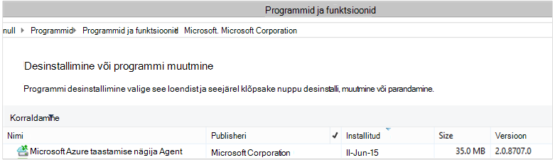

<properties
    pageTitle="Azure'i varundamine – juurutada ja hallata tagasi üles DPM PowerShelli kaudu | Microsoft Azure'i"
    description="Saate teada, kuidas juurutada ja hallata Azure varukoopia jaoks andmete kaitse Manager (DPM) PowerShelli abil"
    services="backup"
    documentationCenter=""
    authors="NKolli1"
    manager="shreeshd"
    editor=""/>

<tags
    ms.service="backup"
    ms.workload="storage-backup-recovery"
    ms.tgt_pltfrm="na"
    ms.devlang="na"
    ms.topic="article"
    ms.date="09/01/2016"
    ms.author="jimpark; anuragm;trinadhk;markgal"/>


# <a name="deploy-and-manage-backup-to-azure-for-data-protection-manager-dpm-servers-using-powershell"></a>Juurutada ja hallata Azure varundus kaitse Manager (DPM) serverite PowerShelli abil

> [AZURE.SELECTOR]
- [ARM](backup-dpm-automation.md)
- [Klassikaline](backup-dpm-automation-classic.md)

Selles artiklis kirjeldatakse, kuidas PowerShelli abil DPM server Azure'i varukoopia häälestamise ja haldamise varundamine ja taastamine.

## <a name="setting-up-the-powershell-environment"></a>PowerShelli keskkonna häälestamine

[AZURE.INCLUDE [learn-about-deployment-models](../../includes/learn-about-deployment-models-include.md)]

Enne PowerShelli abil saate hallata varukoopiate andmete kaitse Manager Azure, peate olema õige keskkonna PowerShelli. PowerShelli seansi alguses veenduge, et te käivitage järgmine käsk importida õige moodulid ja võimaldavad viide õigesti DPM cmdlet-käsud:

```
PS C:> & "C:\Program Files\Microsoft System Center 2012 R2\DPM\DPM\bin\DpmCliInitScript.ps1"

Welcome to the DPM Management Shell!

Full list of cmdlets: Get-Command
Only DPM cmdlets: Get-DPMCommand
Get general help: help
Get help for a cmdlet: help <cmdlet-name> or <cmdlet-name> -?
Get definition of a cmdlet: Get-Command <cmdlet-name> -Syntax
Sample DPM scripts: Get-DPMSampleScript
```

## <a name="setup-and-registration"></a>Häälestamine ja
Alustamiseks:

1. [Laadige uusimad PowerShelli](https://github.com/Azure/azure-powershell/releases) (on nõutav vähemalt versioon: 1.0.0)
2. Luba, saate aktiveerida *AzureResourceManager* režiimi **Aktiveerimine-AzureMode** abil abil Azure varukoopia cmdlet-käsud:

```
PS C:\> Switch-AzureMode AzureResourceManager
```

PowerShelli abil automatiseerida häälestamine ja järgmist:

- Taastamise teenused vault loomine
- Azure'i varundus agent installimine
- Azure'i varundus teenuse registreerimine
- Võrgunduse sätted
- Krüptimise sätted

## <a name="create-a-recovery-services-vault"></a>Taastamise teenuste hoidla loomine

Järgmised toimingud juhatab teid läbi taastamise teenused vault loomine. Taastamise teenused vault erineb varundamise vault.

1. Kui kasutate Azure varukoopia esimest korda, peate kasutama **Register-AzureRMResourceProvider** cmdlet registreerida Azure taastamise teenusepakkuja tellimus.

    ```
    PS C:\> Register-AzureRmResourceProvider -ProviderNamespace "Microsoft.RecoveryServices"
    ```

2. Vault taastamise teenused on ARM ressurss, seega peate aset ressursirühma. Saate kasutada olemasolevat rühma ressursi või looge uus. Kui loote uue ressursirühma, määrake nimi ja asukoht ressursirühma.  

    ```
    PS C:\> New-AzureRmResourceGroup –Name "test-rg" –Location "West US"
    ```

3. **Uus-AzureRmRecoveryServicesVault** cmdlet-käsu abil saate luua uue vault. Ärge unustage vault sama asukoha määramiseks, mida kasutati ressursirühma.

    ```
    PS C:\> New-AzureRmRecoveryServicesVault -Name "testvault" -ResourceGroupName " test-rg" -Location "West US"
    ```

4. Määrake tüübi talletusruumi koondamise kasutama; saate kasutada [Kohalikult liigsete salvestusruumi (LRS)](../storage/storage-redundancy.md#locally-redundant-storage) või [Geo liigsete salvestusruumi (GRS)](../storage/storage-redundancy.md#geo-redundant-storage). Järgmises näites on kujutatud - BackupStorageRedundancy suvandi testVault väärtuseks GeoRedundant.

    > [AZURE.TIP] Paljud Azure varukoopia cmdlet-käsud on vaja sisendina taastamise teenused vault objekti. Seetõttu on mugav talletada varukoopia taastamise teenused vault objekti muutujana.

    ```
    PS C:\> $vault1 = Get-AzureRmRecoveryServicesVault –Name "testVault"
    PS C:\> Set-AzureRmRecoveryServicesBackupProperties  -vault $vault1 -BackupStorageRedundancy GeoRedundant
    ```


## <a name="view-the-vaults-in-a-subscription"></a>Tellimuse võlvid kuvamine
**Get-AzureRmRecoveryServicesVault** abil saate vaadata kõiki võlvid praeguse tellimuse. Kontrollige, et on loodud uue vault või vaadata, millised võlvid on saadaval tellimuse, saate selle käsu.

Käivitage käsk Get-AzureRmRecoveryServicesVault ja kõik võlvid tellimus on loetletud.

```
PS C:\> Get-AzureRmRecoveryServicesVault
Name              : Contoso-vault
ID                : /subscriptions/1234
Type              : Microsoft.RecoveryServices/vaults
Location          : WestUS
ResourceGroupName : Contoso-docs-rg
SubscriptionId    : 1234-567f-8910-abc
Properties        : Microsoft.Azure.Commands.RecoveryServices.ARSVaultProperties
```


## <a name="installing-the-azure-backup-agent-on-a-dpm-server"></a>DPM Server Azure'i varundus agent installimine
Enne installimist Azure varukoopia agent, peate olema serveris Windows Installeri allalaaditud ja esitamine. Installiprogrammi uusima versiooni saate [Microsofti allalaadimiskeskusest](http://aka.ms/azurebackup_agent) või taastamise teenused vault armatuurlaua lehe kaudu. Salvestage installer kergesti juurdepääsetavad kohta, nt * C:\Downloads\*.

Agent installimiseks käivitage järgmine käsk on administraatoriõigustes PowerShelli konsooli **DPM server**:

```
PS C:\> MARSAgentInstaller.exe /q
```

See installib agent vaikimisi valikuid. Installimine võtab paar minutit taustal. Kui te ei määra */nu* suvand, mis tahes värskendusi installimise lõpus avaneb aken **Windows Update** .

Installitud programmide loendis kuvatakse agent. Installitud programmide loendi kuvamiseks avage **Juhtpaneelil** > **programmide** > **programmid ja funktsioonid**.



### <a name="installation-options"></a>Installimise suvandid
Näha kõiki võimalusi kaudu käsureal, kasutage järgmist käsku:

```
PS C:\> MARSAgentInstaller.exe /?
```

Saadaolevad suvandid on järgmised.

| Suvand | Üksikasjad | Vaikimisi |
| ---- | ----- | ----- |
| /q | Vaikne installimine | - |
| /p: "asukoht" | Azure'i varundus agent installi kausta tee. | C:\Program Files\Microsoft Azure taastamise teenused agendi |
| Sissejuhtimise "asukoht" | Azure'i varundus agenti vahemälu kausta tee. | C:\Program Files\Microsoft Azure taastamise teenused Agent\Scratch |
| /m | Osalemine Microsoft Update | - |
| /nu | Vaata värskendusi pärast installimist | - |
| d | Microsoft Azure taastamise teenused agendi desinstallitakse. | - |
| /pH | Puhverserveri hosti aadress | - |
| /Po | Puhverserveri Host pordi Number | - |
| /PU | Puhverserveri Host kasutajanimi | - |
| /pw | Puhverserveri parooli | - |

## <a name="registering-dpm-to-a-recovery-services-vault"></a>Registreerimise DPM enam teenuste Vault

Kui olete loonud taastamise teenused võlvkelder uusim agent ja hoidla mandaat alla laadida ja salvestada selle asukoht, nt C:\Downloads.

```
PS C:\> $credspath = "C:\downloads"
PS C:\> $credsfilename = Get-AzureRmRecoveryServicesVaultSettingsFile -Backup -Vault $vault1 -Path  $credspath
PS C:\> $credsfilename
C:\downloads\testvault\_Sun Apr 10 2016.VaultCredentials
```

DPM server, käivitage [Start-OBRegistration](https://technet.microsoft.com/library/hh770398%28v=wps.630%29.aspx) cmdlet-käsk masinat registreeruma vault.

```
PS C:\> $cred = $credspath + $credsfilename
PS C:\> Start-OBRegistration-VaultCredentials $cred -Confirm:$false
CertThumbprint      :7a2ef2caa2e74b6ed1222a5e89288ddad438df2
SubscriptionID      : ef4ab577-c2c0-43e4-af80-af49f485f3d1
ServiceResourceName: testvault
Region              :West US
Machine registration succeeded.
```

### <a name="initial-configuration-settings"></a>Esialgne konfiguratsioon sätted
Kui DPM Server on registreeritud taastamise teenused vault, see algab tellimuse vaikesätted. Nende sätete tellimuse kaasata võrgunduse ja krüptimise koondusalal. Tellimuse sätete muutmiseks peate esmalt mitmesuguste kalendrivaadete [Get-DPMCloudSubscriptionSetting](https://technet.microsoft.com/library/jj612793) cmdlet-käsu abil olemasoleva (vaikeväärtus) sätted:

```
$setting = Get-DPMCloudSubscriptionSetting -DPMServerName "TestingServer"
```

Kõik muudatused selle kohaliku PowerShelli objekti ```$setting``` ja seejärel täielik objekt on kinnitatud DPM ja Azure varukoopia salvestada, neile cmdlet-käsu [Set-DPMCloudSubscriptionSetting](https://technet.microsoft.com/library/jj612791) abil. Peate kasutama funktsiooni ```–Commit``` tagamaks, et muudatused on jätkunud lipp. Sätete pole rakendatud ja kasutada Azure varukoopia, kui kinnitatud.

```
PS C:\> Set-DPMCloudSubscriptionSetting -DPMServerName "TestingServer" -SubscriptionSetting $setting -Commit
```

## <a name="networking"></a>Võrgunduse
Kui DPM masina Azure varukoopia teenusega Interneti ühenduvus on puhverserveri kaudu, siis puhverserveri sätted tuleks ette eduka varukoopiaid. Seda tehakse, kasutades funktsiooni ```-ProxyServer```ning ```-ProxyPort```, ```-ProxyUsername``` ning ```ProxyPassword``` parameetrite cmdlet [Set-DPMCloudSubscriptionSetting](https://technet.microsoft.com/library/jj612791) . Selles näites on puhverserver nii, et meil on konkreetselt tühjendada puhverserveri seotud teavet.

```
PS C:\> Set-DPMCloudSubscriptionSetting -DPMServerName "TestingServer" -SubscriptionSetting $setting -NoProxy
```

Läbilaskevõime kasutuse saab kontrollida ka suvandid ```-WorkHourBandwidth``` ning ```-NonWorkHourBandwidth``` antud hulk nädalapäevadele. Selles näites me on säte, mis tahes pidurdamise.

```
PS C:\> Set-DPMCloudSubscriptionSetting -DPMServerName "TestingServer" -SubscriptionSetting $setting -NoThrottle
```

## <a name="configuring-the-staging-area"></a>Koondusalal konfigureerimine
Azure'i varundus agent DPM serveris vajab ajutiste salvestusruumi andmeid taastada pilvest (kohaliku koondusalal). Cmdlet-käsu [Set-DPMCloudSubscriptionSetting](https://technet.microsoft.com/library/jj612791) abil koondusalal konfigureerimine ja ```-StagingAreaPath``` parameeter.

```
PS C:\> Set-DPMCloudSubscriptionSetting -DPMServerName "TestingServer" -SubscriptionSetting $setting -StagingAreaPath "C:\StagingArea"
```

Ülaltoodud näites seatakse koondusalal *C:\StagingArea* PowerShelli objekti ```$setting```. Veenduge, et määratud kaust on juba olemas, muidu ei õnnestu lõplik kinnitus tellimuse sätted.


### <a name="encryption-settings"></a>Krüptimise sätted
Varundatud andmete saadetud Azure varukoopia on krüptitud konfidentsiaalsusega andmete kaitsmiseks. Krüptimise parool on "parool" andmeid dekrüptida ajal taastada. See on tähtis hoida seda teavet turvalise, kui see on määratud.

Järgmises näites, esimese käsu teisendab stringi ```passphrase123456789``` turvaline stringi ja määrab turvaline stringi muutuja nimega ```$Passphrase```. teine käsk seab turvaline stringi ```$Passphrase``` krüptimiseks varukoopiate parool.

```
PS C:\> $Passphrase = ConvertTo-SecureString -string "passphrase123456789" -AsPlainText -Force

PS C:\> Set-DPMCloudSubscriptionSetting -DPMServerName "TestingServer" -SubscriptionSetting $setting -EncryptionPassphrase $Passphrase
```

> [AZURE.IMPORTANT] Parooli teavet säilitada turvalise kui see on määratud. Te ei saa andmete taastamine Azure'i ilma selle parool.

Selles etapis peaks tehtud kõik vajalikud muudatused, et selle ```$setting``` objekti. Pidage meeles, et muudatuste kinnitamine.

```
PS C:\> Set-DPMCloudSubscriptionSetting -DPMServerName "TestingServer" -SubscriptionSetting $setting -Commit
```

## <a name="protect-data-to-azure-backup"></a>Azure varukoopia andmete kaitsmine
Selle jaotise lisamine DPM tootmise server ja seejärel kaitsta andmete kohaliku DPM salvestusruumi ja seejärel Azure varukoopia. Näited, demonstreerime, failide ja kaustade varundamine. Loogika saate hõlpsasti laiendada varundada kõik DPM toetatud andmeallikas. Teie DPM varukoopiate reguleeritakse, on kaitse rühma (lk) neli osad:

1. **Rühma liikmete** loend kõik autoril objektid (tuntud ka kui *andmeallikatele* rakenduses DPM) soovitud sama kaitse jaotises kaitse. Näiteks võite tootmise VMs ühe kaitse rühma ja SQL serveri andmebaasi teise kaitse jaotises kaitse, nagu nad võivad olla erinevad varukoopia nõuded. Enne kui saate varundada kõik andmeallika tootmise server veendumaks, et peate DPM Agent serverisse installitud ja haldab DPM. Järgige [installimise DPM Agent](https://technet.microsoft.com/library/bb870935.aspx) ja linkimine DPM Sisselogimisserverisse.
2. **Andmete kaitsmine meetod** määrab target varukoopia asukohad - lint, ketas ja pilve. Käesolevas näites kaitseme andmeid kohalikule kettale ja pilveteenusesse.
3. **Varunduse ajakava** , mis määrab, millal on vaja võtta varukoopiate ja sageduse andmeid sünkroonitakse DPM serveri ja tootmise vahel.
4. **Säilituspoliitika ajakava** , mis määrab, kui kaua säilitamise taastamise punkte Azure.

### <a name="creating-a-protection-group"></a>Kaitse rühma loomine
Alustuseks cmdlet-käsu [New-DPMProtectionGroup](https://technet.microsoft.com/library/hh881722) abil kaitse uue rühma loomine.

```
PS C:\> $PG = New-DPMProtectionGroup -DPMServerName " TestingServer " -Name "ProtectGroup01"
```

Ülaltoodud cmdlet loob kaitse rühma nimega *ProtectGroup01*. Kaitse olemasolevasse rühma saate muuta ka hiljem lisada varundamise Azure pilveteenusesse. Siiski muuta kaitse rühma - uude või olemasolevasse – peame mitmesuguste kalendrivaadete *muudetavate* objekti [Get-DPMModifiableProtectionGroup](https://technet.microsoft.com/library/hh881713) cmdlet-käsu abil.

```
PS C:\> $MPG = Get-ModifiableProtectionGroup $PG
```

### <a name="adding-group-members-to-the-protection-group"></a>Rühma liikmete lisamiseks rühma kaitse
Iga DPM Agent teab andmeallikatele serveris, kus see on installitud loendit. Andmeallikas lisamiseks rühma kaitse DPM Agent tuleb esmalt saata loend on andmeallikatele tagasi DPM server. Ühe või mitme andmeallikatele seejärel on valitud ja kaitse rühma lisada. Juhised PowerShelli neid on.

1. Kõikides serverites DPM DPM agendi kaudu hallata loendi toomiseks.
2. Valige teatud server.
3. Kõigile andmeallikatele loendi toomiseks serveris.
4. Valige üks või mitu andmeallikatele ning jaotises kaitse lisamine

[Get-DPMProductionServer](https://technet.microsoft.com/library/hh881600) cmdletiga omandatud nimekirja serverid DPM Agent on installitud- ja haldab DPM Server. Selles näites me filtreerimiseks ja ainult konfigureerida PS varukoopia nimi *productionserver01* .

```
PS C:\> $server = Get-ProductionServer -DPMServerName "TestingServer" | where {($_.servername) –contains “productionserver01”
```

Nüüd toomiseks klõpsake loendit andmeallikatele ```$server``` [Get-DPMDatasource](https://technet.microsoft.com/library/hh881605) cmdlet-käsu abil. Selles näites me filtreerimine helitugevuse *D:\* , soovime varundamise konfigureerimine. Selle andmeallika lisatakse rühma kaitse [Lisamine-DPMChildDatasource](https://technet.microsoft.com/library/hh881732) cmdlet-käsu abil. Pidage meeles, et kasutada funktsiooni *muudetavate * kaitse rühma objekti ```$MPG``` täiendusi teha.

```
PS C:\> $DS = Get-Datasource -ProductionServer $server -Inquire | where { $_.Name -contains “D:\” }

PS C:\> Add-DPMChildDatasource -ProtectionGroup $MPG -ChildDatasource $DS
```

Korrake seda toimingut nii mitu korda vastavalt vajadusele, kuni olete lisanud kõik valitud andmeallikatele kaitse rühma. Saate alustada ainult ühe andmeallika, ja töövoog kaitse rühma loomise ja hiljem lisada rohkem andmeallikatele kaitse rühma.

### <a name="selecting-the-data-protection-method"></a>Andmete kaitsmine meetodi valimine
Kui soovitud andmeallikatele lisatud kaitse rühma, on järgmiseks kaitse viisi cmdlet-käsu [Set-DPMProtectionType](https://technet.microsoft.com/library/hh881725) abil määrata. Selles näites on kaitse rühma setup kohalikule kettale ja pilveteenuse varukoopia. Samuti peate määrama andmeallika, mida soovite kaitsta pilveteenusesse, kasutades [Lisa-DPMChildDatasource](https://technet.microsoft.com/library/hh881732.aspx) cmdlet - Online lipp.

```
PS C:\> Set-DPMProtectionType -ProtectionGroup $MPG -ShortTerm Disk –LongTerm Online
PS C:\> Add-DPMChildDatasource -ProtectionGroup $MPG -ChildDatasource $DS –Online
```

### <a name="setting-the-retention-range"></a>Vahemiku säilitamine
Määrake varukoopia punktid, kasutades cmdlet [Set-DPMPolicyObjective](https://technet.microsoft.com/library/hh881762) säilitus. Kuigi see võib tunduda paaritu seadmine säilitamine enne varukoopia ajakava on määratletud, kasutades funktsiooni ```Set-DPMPolicyObjective``` cmdlet-käsk määrab automaatselt varukoopia vaikeajakava, mida saab muuta. Alati on võimalik varukoopia plaanimine esmalt määramine ja pärast säilituspoliitika.

Alltoodud näites määrab cmdlet säilituspoliitika parameetrite ketta varufailide. See säilitab varukoopiate päeva ja sünkroonimine andmed iga 6 tunni tootmise server ja DPM serveri vahel. Funktsiooni ```SynchronizationFrequencyMinutes``` ei määra, kui sageli varukoopia punkti on loodud, aga kuidas sageli andmed kopeeritakse DPM serveriga.  See säte takistab varukoopiate muutumas liiga suur.

```
PS C:\> Set-DPMPolicyObjective –ProtectionGroup $MPG -RetentionRangeInDays 10 -SynchronizationFrequencyMinutes 360
```

Varufailide kavatse Azure (DPM viitab neile kui Online varukoopiate) säilituspoliitika vahemikud saab konfigureerida [pikaajaline säilitamine vanaisa-isa-poja värviskeemi (GFS) abil](backup-azure-backup-cloud-as-tape.md). Seega saate määratleda iga päev, nädala, kuu ja kord aastas säilituspoliitikate kombineeritud säilituspoliitika. Selles näites tähistav keerukate säilituspoliitika värviskeemi, mille soovime massiivi loomine, ja konfigureerimist erinevatele cmdlet-käsu [Set-DPMPolicyObjective](https://technet.microsoft.com/library/hh881762) abil.

```
PS C:\> $RRlist = @()
PS C:\> $RRList += (New-Object -TypeName Microsoft.Internal.EnterpriseStorage.Dls.UI.ObjectModel.OMCommon.RetentionRange -ArgumentList 180, Days)
PS C:\> $RRList += (New-Object -TypeName Microsoft.Internal.EnterpriseStorage.Dls.UI.ObjectModel.OMCommon.RetentionRange -ArgumentList 104, Weeks)
PS C:\> $RRList += (New-Object -TypeName Microsoft.Internal.EnterpriseStorage.Dls.UI.ObjectModel.OMCommon.RetentionRange -ArgumentList 60, Month)
PS C:\> $RRList += (New-Object -TypeName Microsoft.Internal.EnterpriseStorage.Dls.UI.ObjectModel.OMCommon.RetentionRange -ArgumentList 10, Years)
PS C:\> Set-DPMPolicyObjective –ProtectionGroup $MPG -OnlineRetentionRangeList $RRlist
```

### <a name="set-the-backup-schedule"></a>Määrake varukoopia ajakava
DPM määrab varukoopia vaikeajakava automaatselt, kui määrate kaitse eesmärk abil soovitud ```Set-DPMPolicyObjective``` cmdlet-käsk. Saate muuta vaikimisi ajakavade, millele järgneb [Set-DPMPolicySchedule](https://technet.microsoft.com/library/hh881723) cmdlet-käsk [Get-DPMPolicySchedule](https://technet.microsoft.com/library/hh881749) cmdlet-käsk.

```
PS C:\> $onlineSch = Get-DPMPolicySchedule -ProtectionGroup $mpg -LongTerm Online
PS C:\> Set-DPMPolicySchedule -ProtectionGroup $MPG -Schedule $onlineSch[0] -TimesOfDay 02:00
PS C:\> Set-DPMPolicySchedule -ProtectionGroup $MPG -Schedule $onlineSch[1] -TimesOfDay 02:00 -DaysOfWeek Sa,Su –Interval 1
PS C:\> Set-DPMPolicySchedule -ProtectionGroup $MPG -Schedule $onlineSch[2] -TimesOfDay 02:00 -RelativeIntervals First,Third –DaysOfWeek Sa
PS C:\> Set-DPMPolicySchedule -ProtectionGroup $MPG -Schedule $onlineSch[3] -TimesOfDay 02:00 -DaysOfMonth 2,5,8,9 -Months Jan,Jul
PS C:\> Set-DPMProtectionGroup -ProtectionGroup $MPG
```

Ülaltoodud näites ```$onlineSch``` on neli elementidega massiivi sisaldava olemasoleva Online'i kaitseteenus ajakava GFS värviskeemi kaitse rühma:

1. ```$onlineSch[0]```sisaldab päevakava
2. ```$onlineSch[1]```Nädala ajakava sisaldab
3. ```$onlineSch[2]```sisaldab igakuine ajakava
4. ```$onlineSch[3]```sisaldab aasta ajakava

Nii, et teil on vaja muuta nädala ajakava, peate viitama selle ```$onlineSch[1]```.

### <a name="initial-backup"></a>Algne varundamine
Kui varundamise andmeallikas esimest korda, DPM vajadustele loob algne koopia, mis loob andmeallikas kaitstava draivil DPM koopia täielik koopia. Selle tegevuse saab ajastada kas teatud aja jooksul või saab käivitada käsitsi, kasutades cmdlet [Set-DPMReplicaCreationMethod](https://technet.microsoft.com/library/hh881715) koos parameetriga ```-NOW```.

```
PS C:\> Set-DPMReplicaCreationMethod -ProtectionGroup $MPG -NOW
```
### <a name="changing-the-size-of-dpm-replica--recovery-point-volume"></a>DPM koopia ja taastamise punkti helitugevuse suuruse muutmine
Suurus ja DPM koopia helitugevuse varju Kopeeri helitugevust, nagu järgmises näites [Set-DPMDatasourceDiskAllocation](https://technet.microsoft.com/library/hh881618.aspx) cmdlet-käsu abil saate muuta ka: Get-DatasourceDiskAllocation - andmeallika $DS Set-DatasourceDiskAllocation - andmeallika $DS - ProtectionGroup $MPG-käsitsi - ReplicaArea (2 gb) – ShadowCopyArea (2 gb)

### <a name="committing-the-changes-to-the-protection-group"></a>Kaitse rühma muudatuste rakendamist
Lõpuks muudatused peavad olema kinnitatud enne DPM varundus uue konfiguratsiooni kaitse rühma kohta. Selle saavutamiseks cmdlet-käsu [Set-DPMProtectionGroup](https://technet.microsoft.com/library/hh881758) abil.

```
PS C:\> Set-DPMProtectionGroup -ProtectionGroup $MPG
```
## <a name="view-the-backup-points"></a>Varukoopia-punkte vaadata
[Get-DPMRecoveryPoint](https://technet.microsoft.com/library/hh881746) cmdlet-käsu abil saate hankida kõigi taastamise punkte loendi andmeallikas. Selles näites me:
- Kõik PGs toomiseks DPM server ja massiivis```$PG```
- saada andmeallikatele, mis vastab olevat```$PG[0]```
- saada kõik taastamise punkte andmeallikas.

```
PS C:\> $PG = Get-DPMProtectionGroup –DPMServerName "TestingServer"
PS C:\> $DS = Get-DPMDatasource -ProtectionGroup $PG[0]
PS C:\> $RecoveryPoints = Get-DPMRecoverypoint -Datasource $DS[0] -Online
```

## <a name="restore-data-protected-on-azure"></a>Kaitstud Azure andmete taastamine
Andmete taastamine on kombinatsioon on ```RecoverableItem``` objekt ja ```RecoveryOption``` objekti. Eelmises jaotises meil varukoopia punktide loendi andmeallikas.

Alltoodud näites me näitavad, kuidas taastada Hyper-V virtuaalse masina Azure varukoopia taastamise target varukoopia punktide kombineerides. Selles näites sisaldab järgmist:

- Loomise taastamise suvand, cmdlet-käsu [New-DPMRecoveryOption](https://technet.microsoft.com/library/hh881592) abil.
- Tõmbamine massiiv varukoopia punktide abil soovitud ```Get-DPMRecoveryPoint``` cmdlet-käsk.
- Valides taastamine varukoopia põhjal punkti.

```
PS C:\> $RecoveryOption = New-DPMRecoveryOption -HyperVDatasource -TargetServer "HVDCenter02" -RecoveryLocation AlternateHyperVServer -RecoveryType Recover -TargetLocation “C:\VMRecovery”

PS C:\> $PG = Get-DPMProtectionGroup –DPMServerName "TestingServer"
PS C:\> $DS = Get-DPMDatasource -ProtectionGroup $PG[0]
PS C:\> $RecoveryPoints = Get-DPMRecoverypoint -Datasource $DS[0] -Online

PS C:\> Restore-DPMRecoverableItem -RecoverableItem $RecoveryPoints[0] -RecoveryOption $RecoveryOption
```

Käske saate hõlpsasti pikendada iga andmeallika tüübi.

## <a name="next-steps"></a>Järgmised sammud

- Azure'i varundus DPM kohta lisateavet teemast [Sissejuhatus DPM varundus](backup-azure-dpm-introduction.md)
