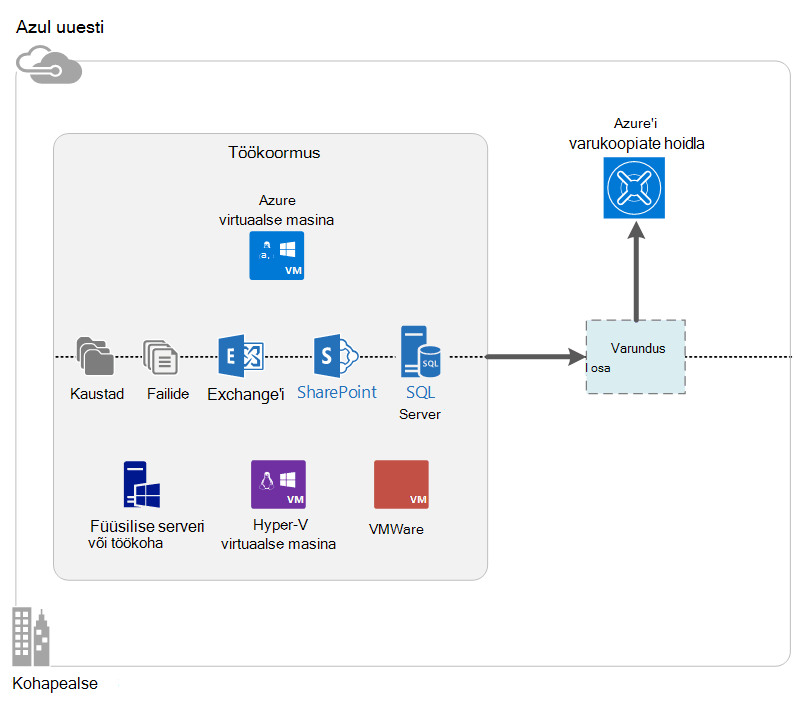

<properties
    pageTitle="Mis on Azure varukoopia? | Microsoft Azure'i"
    description="Azure'i varundamise ja taastamise teenuste abil saate varundamine ja taastamine Windows Server Windows klientarvutite, System Center DPM serverid ja Azure'i virtuaalmasinates andmed ja rakendused."
    services="backup"
    documentationCenter=""
    authors="markgalioto"
    manager="cfreeman"
    editor="tysonn"
    keywords="Varundus ja taaste; taastamise teenused; varukoopia lahendused"/>

<tags
    ms.service="backup"
    ms.workload="storage-backup-recovery"
    ms.tgt_pltfrm="na"
    ms.devlang="na"
    ms.topic="get-started-article"
    ms.date="10/19/2016"
    ms.author="jimpark; trinadhk"/>

# Mis on Azure varukoopia?
Azure'i varukoopiad on teenus, mida kasutada ja Microsofti pilveteenuse andmete taastamine. See asendab olemasoleva kohapealse- või väljapoole varukoopia lahendus pilvepõhist lahenduse, mis on usaldusväärne, turvaline ja maksumus konkurentsianalüüsi. Samuti aitab kaitsta vara, mis töötavad pilveteenuses. Azure'i varukoopiad pakub taastamise tugineb tipptasemel taristu, mis on scalable püsiv ja väga kättesaadav.

[Vaadake videot ülevaade Azure varukoopia](https://azure.microsoft.com/documentation/videos/what-is-azure-backup/)

## Miks kasutada Azure varukoopia?
Traditsiooniliste varukoopia lahendusi, mis on muutunud pilveteenuses käsitleda sarnaselt ketast või lindil lõpp. Kuigi see lähenemine on lihtne, samuti on piiratud. Selle ära täielik on aluseks pilve platvorm ja ebaefektiivne, kallis lahenduse vaste.
Seevastu Azure varukoopia pakub võimas ja taskukohane pilve varukoopia lahendus eelised. Siin on mõned peamised eelised, mida pakub Azure varukoopia.

| Funktsioon | Kasu |
| ------- | ------- |
| Automaatne mäluhaldus | Kohapealse salvestusruumi seadmete jaoks on vaja muutmine kulusid. Azure'i varukoopiad automaatselt eraldab ja haldab varukoopia salvestusruumi ja kasutab maksma-nagu te-kasutusega tarbimine mudel. |
| Piiramatu mastaapimine | Ära kõrge-saadavus garantiid ilma üldkulu hooldus ja jälgimine. Azure'i varukoopiad kasutab aluseks oleva power ja skaala Azure'i pilves, selle nonintrusive autoscaling võimalustega. |
| Mitme talletamise võimalused | Valige varukoopia salvestusruumi vastavalt vajadusele.<li>Kohalik liigsete salvestusruumi Blokeeri bloobimälu sobib hind teadlik kliendid ja see endiselt aitab kaitsta andmeid kohaliku riistvara tõrkeid. <li>Geo-dispersioonanalüüs salvestusruumi Blokeeri bloobimälu pakub kolme rohkem koopiaid andmepunktipaaride andmekeskuses. Need täiendavad koopiad tagada, et teie varukoopia andmed on tugevalt saadaval on Azure saidi tasemel katastroofi siis, kui. |
| Piiramatu andmeedastus | Taastamine toimingu hoidlast varundamise ajal on tasuta mis tahes sealt (väljaminev) andmete edastamiseks. Andmete sissetulev abil Azure on tasuta. Töötab importimine teenuse, kus on saadaval. |
| Andmete krüptimine | Andmete krüptimine võimaldab turvaline edastamine ja salvestusruumi kliendiandmete avaliku pilve. Krüptimise parool säilitatakse allikas ja see on edastatud või talletatud Azure. Krüptovõtme on vaja andmeid taastada, ja ainult kliendil on täielik juurdepääs andmetele teenus. |  
| Rakenduse ühtsete varundamine | Windowsi rakenduse ühtsete varukoopiate aitab tagada, et parandused on vaja ajal taastada, mis vähendab taastamise aja eesmärk. See võimaldab juurde naasmiseks töötab kiiremini. |
| Pikaajaline säilitus. | Selle asemel, et väljapoole lint varukoopia lahendusi, kliendid saavad tagasi registriredaktori Azure'i, mis pakub pilkupüüdvaid lint-like lahenduse madala hinnaga eest maksta. |

## Azure'i varundus komponendid
Kuna varundus on hübriid varukoopia lahendus, koosneb mitmest komponendid, mis koos töötada lubada lõpuni varundamine ja taastamine töövood.

### Juurutamise stsenaariumid

| Komponent | Azure'i saab kasutada? | Juurutatud asutusesisese võib olla? | Target (sihtkoht) salvestusruumi toetatud|
| --- | --- | --- | --- |
| Azure'i varundus agent | 
**Jah**
 
Windows Serveri VM, mis töötab Azure'i saab juurutada agent Azure varukoopia.
 | 
**Jah**
 
Varundus agent saab kasutada mis tahes Windows Server VM või füüsilise kohapeal.
 | 
Azure'i varundus vault
 |
| System Center andmete kaitse Manager (DPM) | 
**Jah**

Lugege lisateavet selle kohta, [Kuidas kaitsta töökoormus Azure süsteemi Center DPM abil](http://blogs.technet.com/b/dpm/archive/2014/09/02/azure-iaas-workload-protection-using-data-protection-manager.aspx).
 | 
**Jah**
 
Lugege lisateavet selle kohta, [Kuidas kaitsta töökoormus ja oma andmekeskuse VMs](https://technet.microsoft.com/library/hh758173.aspx).
 | 
Kohalik manustatud ketas,
 
Azure'i varundus vault,
 
lint (ainult asutusesisene)
 |
| Azure varukoopia Server | 
**Jah**

Lugege lisateavet selle kohta, [Kuidas kaitsta töökoormus Azure Azure varukoopia Serveri abil](backup-azure-microsoft-azure-backup.md).
 | 
**Jah**
 
Lugege lisateavet selle kohta, [Kuidas kaitsta töökoormus Azure Azure varukoopia Serveri abil](backup-azure-microsoft-azure-backup.md).
 | 
Kohalik manustatud ketas,
 
Azure'i varundus vault
 |
| Azure'i varukoopiad (VM laiend) | 
**Jah**

Azure'i struktuuri osa

Spetsialiseerunud [Azure infrastruktuuri nimega on teenus (IaaS) virtuaalmasinates varukoopia](backup-azure-vms-introduction.md).
 | 
**Ei**
 
Varundage oma andmekeskuses virtuaalmasinates System Center DPM abil.
 | 
Azure'i varundus vault
 |

### Komponendi taseme eelised ja piirangud

| Komponent | Eelised | Piirangud | Granulaarsus taastamine |
| --- | --- | --- | --- |
| Azure'i varundus (MARS) agent | <li>Saate varundada failid ja kaustad Windows OS arvutis füüsilise või virtuaalse (VMs saab igal pool kohapealse või Azure)<li>Nõutav eraldi varukoopia server pole<li>Azure'i varukoopiate hoidla kasutab | <li>Kolm korda päeva varundamise/faili taseme taastamine<li>Faili või kausta/maht taseme taastamine ainult, mitte taotlus arvestada<li>Linuxi tugi | failide ja kaustade/maht |
| System Center andmete kaitse Manager | <li>Rakenduse arvestada hetktõmmiste (VSS)<li>Kui võtta varukoopiate täielik paindlikkus<li>Taastamine granulaarsus (kõik)<li>Saate kasutada Azure varukoopia vault<li>Riistvara (kui see on majutatud Hyper-V) | <li>Puudumine heterogeensete tugi (VMware VM varundamine Oracle'i töökoormus varundamine).  | failide ja kaustade/maht / VMs ja rakendused |
| Microsoft Azure varukoopia Server | <li>Rakenduse arvestada hetktõmmiste (VSS)<li>Kui võtta varukoopiate täielik paindlikkus<li>Taastamine granulaarsus (kõik)<li>Saate kasutada Azure varukoopia vault<li>Riistvara (kui see on majutatud Hyper-V)<li>Nõua System Center litsentsi | <li>Puudumine heterogeensete tugi (VMware VM varundamine Oracle'i töökoormus varundamine).<li>Alati nõuab reaalajas Azure tellimuse<li>Lindi varundamise tugi | failide ja kaustade/maht / VMs ja rakendused |
| Azure'i IaaS VM varundamine | <li>Kohalikke varukoopiate Windows/Linux<li>Ilma kindla agenti installi nõutav<li>Pole vaja varukoopia infrastruktuuri struktuuri taseme varundamine | <li>Kord päevas tagasi üles/kettalt taseme taastamine<li>Ei saa varundada kohapealse | VMs Kõik ketast (PowerShelli abil) |

## Saate varundada millised rakendused ja töökoormus?

| Töökoormus | Andmeallika arvutisse | Azure varukoopia lahendus |
| --- | --- |---|
| Failide ja kaustade | Windows Server | 
[Azure'i varundus agent](backup-configure-vault.md),
 
[System Center DPM](backup-azure-dpm-introduction.md) (+ Azure varukoopia agent)
 
[Azure varukoopia Server](backup-azure-microsoft-azure-backup.md) (sh Azure varukoopia agent)
  |
| Failide ja kaustade | Windowsi klient | 
[Azure'i varundus agent](backup-configure-vault.md),
 
[System Center DPM](backup-azure-dpm-introduction.md) (+ Azure varukoopia agent)
 
[Azure varukoopia Server](backup-azure-microsoft-azure-backup.md) (sh Azure varukoopia agent)
  |
| Hyper-V virtuaalse masina (Windows) | Windows Server | 
[System Center DPM](backup-azure-backup-sql.md) (+ Azure varukoopia agent)
 
[Azure varukoopia Server](backup-azure-microsoft-azure-backup.md) (sh Azure varukoopia agent)
 |
| Hyper-V virtuaalse masina (Linux) | Windows Server | 
[System Center DPM](backup-azure-backup-sql.md) (+ Azure varukoopia agent)
 
[Azure varukoopia Server](backup-azure-microsoft-azure-backup.md) (sh Azure varukoopia agent)
  |
| Microsoft SQL Server | Windows Server | 
[System Center DPM](backup-azure-backup-sql.md) (+ Azure varukoopia agent)
 
[Azure varukoopia Server](backup-azure-microsoft-azure-backup.md) (sh Azure varukoopia agent)
  |
| Microsoft SharePointi | Windows Server | 
[System Center DPM](backup-azure-backup-sql.md) (+ Azure varukoopia agent)
 
[Azure varukoopia Server](backup-azure-microsoft-azure-backup.md) (sh Azure varukoopia agent)
   |
| Microsoft Exchange'i |  Windows Server | 
[System Center DPM](backup-azure-backup-sql.md) (+ Azure varukoopia agent)
 
[Azure varukoopia Server](backup-azure-microsoft-azure-backup.md) (sh Azure varukoopia agent)
   |
| Azure'i IaaS VMs (Windows) | - | [Azure'i varukoopiad (VM laiend)](backup-azure-vms-introduction.md) |
| Azure'i IaaS VMs (Linux) | - | [Azure'i varukoopiad (VM laiend)](backup-azure-vms-introduction.md) |

## ARM ja Linux tugi

| Komponent | ARM tugi | Linux (kinnitatud Azure) tugi |
| --- | --- | --- |
| Azure'i varundus (MARS) agent | Jah | Pole (ainult Windows vastavalt agent) |
| System Center andmete kaitse Manager | Jah (külaline Agent) | On võimalik ainult Hyper-V (mitte Azure'i VM) ainult faili ühtsete varundus |
| Azure varukoopia Server (MABS) | Jah (külaline Agent) | Ainult Hyper-V (mitte Azure'i VM) ainult faili ühtsete varundus on võimalik (sama mis DPM) |
| Azure'i IaaS VM varundamine | Jah | Jah |

[AZURE.INCLUDE [learn-about-deployment-models](../../includes/learn-about-deployment-models-include.md)]

## Varundamise ja taastamise Premium salvestusruumi VMs

Azure'i varundus teenuse kaitseb nüüd Premium salvestusruumi VMs.

### Premium salvestusruumi VMs varundamine

Ajal varundamine Premium salvestusruumi VMs, varundamise teenus loob ajutine lavastus asukoht Premium salvestusruumi konto. Lavastus asukoht, nimega "AzureBackup-", on võrdne premium ketast, mis on seotud VM kokku andmete suurust.

>[AZURE.NOTE] Muuta või muuta lavastus asukohta.

Kui Varundustöö lõpetab, kustutatakse lavastus asukoht. Salvestusruumi lavastus asukoha jaoks kasutatud hind vastab kõiki [Premium salvestusruumi hinnad](../storage/storage-premium-storage.md#pricing-and-billing).

### Premium salvestusruumi VMs taastamine

Kas Premium mälu või tavaliste saab taastada Premium salvestusruumi VM. Taastamine Premium salvestusruumi VM taastamise punkti Premium mälu on tüüpilised protsessi taastamine. Siiski võib olla tõhus kindlad Premium salvestusruumi VM taastamise punkti taastamiseks. Seda tüüpi taastamise saab kasutada, kui teil on vaja faile VM alamhulga.

## Funktsioonid
Need viis tabelid summarize kuidas varukoopia funktsioonid käsitletakse iga komponendi.

### Salvestusruumi

| Funktsioon | Azure'i varundus agent | System Center DPM | Azure varukoopia Server | Azure'i varukoopiad (VM laiend) |
| ------- | --- | --- | --- | ---- |
| Azure'i varundus vault | ![Jah][green] | ![Jah][green] | ![Jah][green] | ![Jah][green] |
| Kettaruumi | | ![Jah][green] | ![Jah][green] |  |
| Lindi salvestusruum | | ![Jah][green] |  | |
| Tihendamine (on varukoopiate hoidla) | ![Jah][green] | ![Jah][green]| ![Jah][green] | |
| Varundamist | ![Jah][green] | ![Jah][green] | ![Jah][green] | ![Jah][green] |
| Ketas korduste eemaldamise | | ![Osaliselt][yellow] | ![Osaliselt][yellow]| | |

Varundus vault on eelistatud salvestusruumi target üle kõik komponendid. System Center DPM ja varundamise serveri pakuvad ka võimalus on kohalikule kettale koopia. Ainult System Center DPM annab siiski võimalus kirjutada andmeid lint mäluseadet.

#### Varundamist
Iga komponendi toetab varundamist sõltumata target salvestusruumi (ketas, lindi, varukoopiate hoidla). Varundamist tagab varukoopiate talletusruumi ja tõhusamaks, muutes ainult need pärast viimast varundamist tehtud muudatused.

#### Tihendamine
Varukoopiate on tihendatud vähendamiseks vaja salvestusruumi. Ainult osa, mis ei kasuta tihendamise on VM laiendamine. VM-laiendiga varukoopia kõik andmed kopeeritakse salvestusruumi kliendikonto varukoopiate hoidla piirkonna ilma seda. Ajal minna ilma tihendamise veidi avanemisel kasutatud talletamist, ilma tihendamise andmete säilitamise võimaldab kiiremini taastamine korda.

#### Korduste eemaldamise
Korduste eemaldamise toetatakse System Center DPM ja varundamise Server, kui see on [juurutatud Hyper-V virtuaalse masina](http://blogs.technet.com/b/dpm/archive/2015/01/06/deduplication-of-dpm-storage-reduce-dpm-storage-consumption.aspx). Korduste eemaldamise toimub tasemel host kasutamine Windows Server korduste eemaldamise virtuaalse kõvaketta (VHDs) seotud virtuaalse masina nimega varukoopia säilitamist.

>[AZURE.WARNING] Korduste eemaldamise pole saadaval varundamise komponendid võivad Azure. Kui System Center DPM ja varundamise serveris juurutatud Azure, ei saa olla deduplicated salvestusruumi ketast, mis on seotud VM.

### Turvalisus

| Funktsioon | Azure'i varundus agent | System Center DPM | Azure varukoopia Server | Azure'i varukoopiad (VM laiend) |
| ------- | --- | --- | --- | ---- |
| Võrgu turvalisus (et Azure) | ![Jah][green] |![Jah][green] | ![Jah][green] | ![Osaliselt][yellow]|
| (Azure'i) andmete Turve | ![Jah][green] |![Jah][green] | ![Jah][green] | ![Osaliselt][yellow]|

Kogu varundatud liikluse serverite varundus vault on krüptitud täiustatud krüptimine Standard 256 abil. Turvaline HTTPS-link saadetakse andmed. Varundatud andmete salvestatakse ka varundamise vault krüptitud kujul. Ainult kliendi hoiab andmed avamiseks parooli. Microsoft ei saa dekrüptida varundatud andmete mis tahes hetkel.

>[AZURE.WARNING] Varundatud andmete krüptimiseks kasutatavat võti esineb ainult kliendiga suhtlemise lõpetamine. Microsoft ei kvalifitseeru koopia Azure ja on mis tahes juurdepääs võti. Kui on oluline, Microsoft ei saa taastada varundatud andmete.

Azure VMs varundada nõuab häälestamise krüptimise *sees* virtuaalse masina. Kasutage Windows virtuaalmasinates BitLockeri **dm-crypt** Linuxi kohta. Azure'i varukoopiad Krüpti automaatselt varukoopia andmeid, mis on selle tee kaudu.

### Toetatud töökoormus

| Funktsioon | Azure'i varundus agent | System Center DPM | Azure varukoopia Server | Azure'i varukoopiad (VM laiend) |
| ------- | --- | --- | --- | ---- |
| Windows Server kohapeal - failid ja kaustad | ![Jah][green] | ![Jah][green] | ![Jah][green] | |
| Windowsi kliendi seadme - failid ja kaustad | ![Jah][green] | ![Jah][green] | ![Jah][green] | |
| Hyper-V virtuaalse masina (Windows) | | ![Jah][green] | ![Jah][green] | |
| Hyper-V virtuaalse masina (Linux) | | ![Jah][green] | ![Jah][green] | |
| Microsoft SQL Server | | ![Jah][green] | ![Jah][green] | |
| Microsoft SharePointi | | ![Jah][green] | ![Jah][green] | |
| Microsoft Exchange'i  | | ![Jah][green] | ![Jah][green] | |
| Azure virtuaalse masina (Windows) | | | | ![Jah][green] |
| Azure virtuaalse masina (Linux) | | | | ![Jah][green] |

### Võrgu

| Funktsioon | Azure'i varundus agent | System Center DPM | Azure varukoopia Server | Azure'i varukoopiad (VM laiend) |
| ------- | --- | --- | --- | ---- |
| Võrgu tihendamise (varukoopia serveriga) | | ![Jah][green] | ![Jah][green] | |
| Võrgu tihendamise (et varukoopiate hoidla) | ![Jah][green] | ![Jah][green] | ![Jah][green] | |
| Võrgu protokolli (varukoopia serveriga) | | TCP | TCP | |
| Võrgu protokolli (et varukoopiate hoidla) | HTTPS | HTTPS | HTTPS | HTTPS |

Kuna VM laiend loeb andmed otse Azure storage konto salvestusruum võrgus, ei ole vaja optimeerida seda liikluse. Liiklus on kohalik salvestusruum võrgus Azure andmekeskuses, seega on vähe tihendamise läbilaskevõime kasutuse tõttu.

Kui varundate andmete varukoopia server (DPM või varukoopia Server), saate tihendada varukoopia Serveri esmane serverist-liikluse läbilaskevõime salvestada.

#### Võrgu ahendamine
Azure'i varundus agent pakub ahendamise funktsioon, mis võimaldab teil määrata, kuidas võrgu läbilaskevõime kasutatakse andmeedastuse ajal. Pidurdamise võib olla kasulik, kui teil on vaja, varundada andmete ajal töötada, kuid ei taha häirida muid Interneti-liikluse varundamist. Pidurdamise andmete edastamine kehtib varundamine ja taastamine tegevusi.

### Varundus- ja säilitus.

|  | Azure'i varundus agent | System Center DPM | Azure varukoopia Server | Azure'i varukoopiad (VM laiend) |
| --- | --- | --- | --- | --- |
| Varukoopia frequency (et varukoopiate hoidla) | Kolm varukoopiate päevas | Kahe varukoopiate päevas |Kahe varukoopiate päevas | Päevas ühe varundamine |
| Varukoopia frequency (kettale) | Pole rakendatav | 
SQL Server 15 minuti järel
 
Muud töökoormus kord tunnis
 | 
SQL Server 15 minuti järel
 
Muud töökoormus kord tunnis
 |Pole rakendatav |
| Säilituspoliitika suvandid | Iga päev, iga nädal, iga kuu, iga aasta | Iga päev, iga nädal, iga kuu, iga aasta | Iga päev, iga nädal, iga kuu, iga aasta |Iga päev, iga nädal, iga kuu, iga aasta |
| Säilitusperiood | Kuni 99 aastat | Kuni 99 aastat | Kuni 99 aastat | Kuni 99 aastat |
| Varundus vault punktide taastamine | Piiramatu | Piiramatu | Piiramatu | Piiramatu |
| Taastamise punkte kohalikule kettale | Pole rakendatav | 64 faili serverite,  Rakendus servereid 448 | Faili serverid, 64  Rakendus servereid 448 |Pole rakendatav |
| Taastamise punkte lindile | Pole rakendatav | Piiramatu | Pole rakendatav | Pole rakendatav |

## Mis on vault mandaati fail?

Vault identimisteabe fail on iga varukoopiate hoidla portaali loodud sert. Portaali seejärel lisatud avalik võti Access Control teenus (ACS). Privaatvõti on esitatud kasutajale identimisteabe allalaadimisel ja seejärel sisestatud seadme registreerimise käigus. Privaatvõti autendib masina varundatud andmete saatmiseks on tuvastatud vault teenuses Azure varukoopia.

Vault mandaati kasutatakse ainult registreerimise töövoo käigus. See on Teie vastutate, et vault identimisteabe fail on rikutud pole. Kui see jääb kätte petturitest-kasutaja, saab vault identimisteabe faili vastu sama vault muud seadmed registreerida. Siiski, kuna varundatud andmed on krüptitud kuuluvad ainult kliendi parooli, ei saa olemasoleva varundatud andmete kahjustada. Selle probleemi leevendada, on seatud hoidla mandaat lõpeb 48 tundi. Saate alla laadida hoidla mandaat varukoopia võlvkelder mis tahes arv kordi, registreerimise töövoo käigus kehtib ainult Viimane faili.

## Kuidas erineb Azure varukoopia Azure saidi taastamise?
Paljud kliendid segadusse varukoopia põhjal taastamine ja katastroofiabi. Nii andmete talletamiseks ja sisestage taastamine semantika, kuid nende core väärtust ettepanekud erinevad.

Azure'i varukoopiad toetab andmete kohapealse ja pilveteenuses. Azure'i saidi taastamine koordinaadid virtuaalse masina ja füüsilise-serveri dispersioonanalüüs, Tõrkesiirde ja failback. Mõlemad teenused on oluline, sest teie katastroofi lahendus peab hoidke andmeid turvaliselt ja tagastatav (varukoopia) *ja* hoida oma töökoormus saadaval (saidi taastamine) katkestuste korral.

Järgmised mõisted aitavad teil olulised otsuste varundus ja Avariijärgne taaste ümber.

| Mõiste | Üksikasjad | Varundus | Avariitaastet (DR) |
| ------- | ------- | ------ | ----------------- |
| Taastamine punkti eesmärk (RPO) | Kui enam vaja teha aktsepteeritav andmekao summa. | Varukoopia lahenduste on lai hajuvuse nende aktsepteeritav RPO. Virtuaalse masina varukoopiate on tavaliselt ühe päeva, mis RPO andmebaasi varundamine on RPOs kasvõi 15 minutit. | Katastroofi taastamine lahendused on vähese RPOs. Kopeeri DR saab taha mitu sekundit või minutit. |
| Taastamise aeg eesmärk (RTO) | Aega kulub enam taastada või summa. | Suuremat RPO, kuna andmehulga, mis tuleb varukoopia lahendus töötlemine on tavaliselt palju suurem, mis viib pikem RTOs. Näiteks võib kuluda päevade andmete taastamine lindid, olenevalt aega kulub transport lindi kaudu väljapoole kohta. | Katastroofi taastamine lahendused on väiksem RTOs, sest need on veel sünkroonitud allikas. Vähem muudatused on vaja töödelda. |
| Säilitus. | Kui kaua andmeid on vaja talletamise | Stsenaariumid, mis nõuavad taastamist (andmete rikkumist, kliendid: tahtmatu faili kustutamise, OS tõrge), säilitatakse varundatud andmete tavaliselt 30 päeva või vähem. Nõuetele vastavus vaatevinklist, peate andmed säilitatakse isegi aastaid. Varundatud andmete sobib ideaalvariandis mitte sellisel juhul arhiivimine. | Avariitaastet tuleb ainult taastamist andmeid, mis kulub tavaliselt paar tundi või kuni iga päev. Kohandatud andmehõive kasutatud DR lahenduste tõttu DR andmete kasutamise pikaajalised säilituspoliitika ei ole soovitatav. |

## Järgmised sammud

Proovige lihtne Azure varukoopia. Lisateabe saamiseks vaadake ühte need õpetused

- [Proovige Azure varundus](backup-try-azure-backup-in-10-mins.md)
- [Proovige Azure'i VM varundamine](backup-azure-vms-first-look.md)

Kuna need õpetused aitab teil varundada kiiresti, kuvatakse teie ainult kõige otsesem tee varundada oma andmeid. Saate varundada tüüpi kohta lisateabe soovite, lugege teemat:

- [Windowsi arvuti varundamine](backup-configure-vault.md)
- [Rakenduse töökoormus varundamine](backup-azure-microsoft-azure-backup.md)
- [Varukoopia Azure'i IaaS VMs](backup-azure-vms-prepare.md)

[green]: ./media/backup-introduction-to-azure-backup/green.png
[yellow]: ./media/backup-introduction-to-azure-backup/yellow.png
[red]: ./media/backup-introduction-to-azure-backup/red.png
