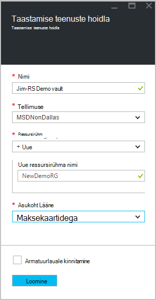
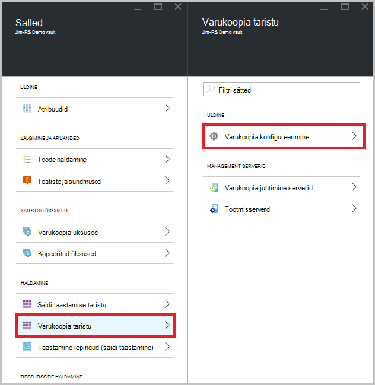

<properties
   pageTitle="Saate teada, kuidas varundada faile ja kaustu Windows Azure'i Azure varundamise ressursihaldur juurutamise näidise | Microsoft Azure'i"
   description="Saate teada, kuidas võlvkelder loomine, kui installite taastamise teenused agendi ja varundada faile ja kaustu Azure Windows Serveri andmeid varundada."
   services="backup"
   documentationCenter=""
   authors="markgalioto"
   manager="cfreeman"
   editor=""
   keywords="Kuidas varundamise; varundamine"/>

<tags
   ms.service="backup"
   ms.workload="storage-backup-recovery"
   ms.tgt_pltfrm="na"
   ms.devlang="na"
   ms.topic="hero-article"
   ms.date="09/27/2016"
   ms.author="markgal;"/>

# Tutvustus: varundamine failid ja kaustad Azure'i varundamise ressursihaldur juurutamise mudeli kasutamine

Selles artiklis selgitatakse, kuidas Windows Server (või Windowsi kliendi) varundamiseks failide ja kaustade Azure'i Azure varundamise ressursihaldur abil. See on mõeldud teile põhitõdesid õpetus. Kui soovite alustada Azure'i varundamise, olete õiges kohas.

Kui soovite rohkem teada Azure varukoopia, lugege selle [Ülevaade](backup-introduction-to-azure-backup.md).

Failide ja kaustade varundamine Azure nõuab järgmiste tegevuste tehke järgmist.

 hankida Azure'i tellimus (kui teil pole veel üks). 
 taastamise teenused vault loomine. 
 vajalikke faile alla laadida. 
 installi ja taastamise teenused agendi register. 
 varundada faile ja kaustu.

## Samm 1: Hankida Azure'i tellimus

Kui teil pole Azure tellimuse, luua [tasuta konto](https://azure.microsoft.com/free/) , mis võimaldab juurdepääsu mis tahes Azure'i teenus.

## Samm 2: Looge võlvikus taastamise teenused

Varundage faile ja kaustu, peate looma taastamise teenused vault ala, kuhu soovite andmed salvestada. Samuti peate otsustada, kuidas soovite kopeeritud salvestusruumi.

### Taastamise teenused vault loomiseks

1. Kui te pole seda juba teinud, [Azure portaali](https://portal.azure.com/) kaudu Azure tellimuse Logi sisse.

2. Jaoturi menüü, klõpsake nuppu **Sirvi** ja tippige ressursid loendis **Taastamise teenused** ja klõpsake käsku **taastamise teenused võlvid**.

      

3. Menüü **võlvid taastamise teenused** nuppu **Lisa**.

    

    Avaneb taastamise teenused vault tera, mis palub teil esitada **nimi**, **tellimuse**, **ressursirühm**ja **asukohaga**.

    

4. Sisestage **nimi**sõbralik nimi, mis tähistavad vault.

5. Klõpsake **tellimuse** saadaolevate tellimuste loendi kuvamiseks.

6. **Ressursirühm** on saadaval loendi kuvamiseks valige või klõpsake nuppu **Uus** , et luua uue ressursirühma.

7. Klõpsake **asukoha** valimiseks piirkonnas vault jaoks. See valik määrab geograafilised piirkond, kus teie varundatud andmete saadetakse.

8. Klõpsake nuppu **Loo**.

    Kui te ei näe oma vault pärast seda, kui see on lõpule viidud, klõpsake nuppu **Värskenda**. Kui loendis värskendab, klõpsake selle nime Vault.

### Määratlemiseks salvestusruumi koondamine
Taastamise teenused vault loomisel saate määratleda, kuidas on kopeeritud salvestusruumi.

1. Klõpsake uue vault avamiseks armatuurlaud.

2. Klõpsake **sätete** teravik, mis avaneb automaatselt armatuurlauale vault, **Varundamise taristu**.

3. Klõpsake varundamise taristu labale **Varundamise konfiguratsiooni** kuvamiseks **salvestusruumi dispersioonanalüüs tüüp**.

    

4. Valige suvandi hoidmise dispersioonanalüüs oma vault.

    

    Vaikimisi on teie vault geograafilise liigne salvestusruumi. Kui kasutate Azure esmane varukoopia salvestusruumi endpoint, jätkake geograafilise liigne salvestusruumi. Kui kasutate Azure-esmane varukoopia salvestusruumi endpoint, valige kohalikult liigsete salvestusruumi, mis vähendab maksumus Azure andmete salvestamiseks. Lisateavet [geograafilise liigne](../storage/storage-redundancy.md#geo-redundant-storage) ja [kohalikult liigsete](../storage/storage-redundancy.md#locally-redundant-storage) talletamise võimalused sellest [Ülevaade](../storage/storage-redundancy.md).

Nüüd, kui olete loonud võlvkelder, failide ja kaustade varundamiseks allalaadimine Microsoft Azure taastamise teenused agendi ja vault mandaadi infrastruktuuri ettevalmistamine.

## Samm 3 - faile alla laadida

1. Klõpsake armatuurlaual taastamise teenused vault **sätted** .

    

2. Klõpsake **Alustamine > varundus** enne sätted.

    

3. Klõpsake nuppu varundus enne **varundamise eesmärk** .

    

4. Valige **kohapealse** , kus on teie töökoormus töötab? menüü.

5. Valige **failid ja kaustad** , mida soovite varukoopia? menüüd ja klõpsake siis nuppu **OK**.

### Laadige alla teenuste taastamise agent

1. Klõpsake **allalaadimine agenti Windows Server või Windowsi kliendi** **ettevalmistamine taristu** tera.

    

2. Klõpsake hüpikakna allalaadimine nuppu **Salvesta** . Vaikimisi **MARSagentinstaller.exe** fail on salvestatud kausta Allalaaditavad failid.

### Hoidla mandaat allalaadimine

1. Klõpsake **allalaadimine > Salvesta** ettevalmistamine taristu enne.

    

## Samm 4 - installi ja registreerimist agent

>[AZURE.NOTE] Azure portaali kaudu võimaldab varundus on tulekul. Sel ajal, kasutage Microsoft Azure taastamise Services Agent asutusesisese varundada faile ja kaustu.

1. Otsige üles ja topeltklõpsake **MARSagentinstaller.exe** allalaaditavad failid kausta (või muud salvestatud asukoht).

2. Microsoft Azure taastamise teenused agendi häälestusviisardi lõpuleviimine. Viisardi lõpuleviimine, peate:

    - Valige installi ja vahemälu kausta asukoht.
    - Kui kasutate puhverserverit Interneti-ühenduse, sisestage oma puhverserveri serveri teave.
    - Esitage oma kasutaja nimi ja parool üksikasjad, kui te ei kasuta autenditud puhverserverit.
    - Sisestage allalaaditud hoidla mandaat
    - Salvestage krüptimine parooli turvalises asukohas.

    >[AZURE.NOTE] Kui kaotate või unustate parooli, ei saa Microsoft spikker varundatud andmete taastamine. Salvestage fail turvalises asukohas. See on vajalik taastamine varukoopia.

Agent on installitud ja teie arvuti on registreerunud vault. Olete valmis, konfigureerida ja ajastada varukoopia.

## Juhis 5: Varundada faile ja kaustu

Algne varukoopia sisaldab kahte põhitoimingute.

- Ajakava varundamine
- Failide ja kaustade varundamine esimest korda

Algne varukoopia tegemiseks saate kasutada Microsoft Azure taastamise teenused agendi.

### Plaanida varundamine

1. Avage Microsoft Azure taastamise teenused agendi. Leiate oma seadme otsides **Microsoft Azure varukoopia**.

    

2. Klõpsake taastamise teenused agendi, **Ajakava varukoopia**.

    

3. Ajakava varundamise viisardi lehel alustamine nuppu **edasi**.

4. Valige üksuste varundamine lehele, klõpsake nuppu **Lisa üksusi**.

5. Valige failid ja kaustad, mida soovite varundada, ja klõpsake **Okay**.

6. Klõpsake nuppu **edasi**.

7. Klõpsake lehel **Määrake varukoopia ajakava** Määrake **varukoopia ajakava** ja klõpsake nuppu **edasi**.

    Saate ajastada iga päev (tempos kuni kolm korda päevas) või nädala varukoopiad.

    

    >[AZURE.NOTE] Lisateavet selle kohta, kuidas määrata varunduse ajakava leiate artiklist [Kasutamine Azure varukoopia asendamine oma lint taristu](backup-azure-backup-cloud-as-tape.md).

8. Valige lehel **Valige säilituspoliitika** **Säilituspoliitika** varukoopia.

    Säilituspoliitika määrab kestus, salvestatakse varukoopia. Asemel ainult nimetades "tasapinnalise poliitika" kõik varukoopia punktid saate määrata ilmnemisel varukoopia põhjal erinevate Säilituspoliitikad. Saate muuta iga päev, nädala, kuu ja aasta säilituspoliitikate teie vajadustele.

9. Valige lehel Valige esialgse varundatud tüüp esialgse varundatud tüüp. Jätke **automaatselt üle võrgu** valitud suvand ja seejärel klõpsake nuppu **edasi**.

    Saate varundada automaatselt võrgu kaudu või saate varundada ühenduseta. Ülejäänud selles artiklis kirjeldatakse varundamiseks automaatselt. Kui eelistate teha varukoopia, ühenduseta ülevaate artiklist [ühenduseta varukoopia töövoo Azure varukoopia](backup-azure-backup-import-export.md) lisateabe saamiseks.

10. Klõpsake lehel Confirmation teave üle ja seejärel klõpsake nuppu **valmis**.

11. Kui viisard on lõpule jõudnud, luua varukoopia ajakava, klõpsake nuppu **Sule**.

### Failide ja kaustade varundamiseks esimest korda

1. Taastamise teenused agent, klõpsake nuppu **Varunda kohe** lõpuleviimiseks esialgne külv võrgu kaudu.

    

2. Klõpsake lehel Confirmation kontrollige sätteid uuesti üles nüüd viisardi abil masina varundamine. Seejärel klõpsake nuppu **Varunda**.

3. Klõpsake viisardi sulgemiseks **sulgeda** . Kui te seda teete enne varundamist lõpetab, viisard endiselt taustal.

Pärast algse varundamine on lõpule jõudnud, kuvatakse **töö valmis** oleku varundamise konsooli.

## Teil on küsimusi?
Kui teil on küsimusi või on mis tahes funktsiooni, mida soovite näha kaasatud, [saatke meile tagasiside](http://aka.ms/azurebackup_feedback).

## Järgmised sammud
- [Windowsi masinad varundamise](backup-configure-vault.md)kohta rohkem üksikasju.
- Nüüd, kui olete varundada faile ja kaustu, saate [hallata oma võlvid ja serverid](backup-azure-manage-windows-server.md).
- Kui teil on vaja taastamine varukoopia, kasutage seda artiklit [Windowsi arvuti failide](backup-azure-restore-windows-server.md)taastamiseks.
