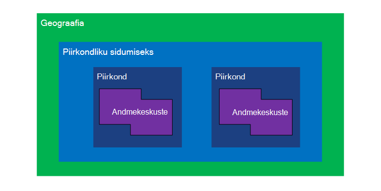
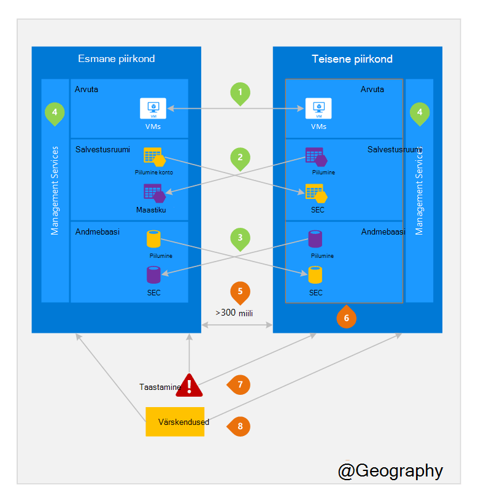

<properties
    pageTitle="Business järjepidevus ja Avariijärgne taaste (BCDR): Azure'i paaris piirkondade | Microsoft Azure'i"
    description="Azure'i piirkondliku paari tagada rakenduste olles andmete keskmist kasutamisel."
    services="site-recovery"
    documentationCenter=""
    authors="rayne-wiselman"
    manager="jwhit"
    editor=""/>

<tags
    ms.service="site-recovery"
    ms.workload="storage-backup-recovery"
    ms.tgt_pltfrm="na"
    ms.devlang="na"
    ms.topic="article"
    ms.date="08/23/2016"
    ms.author="raynew"/>

# Business järjepidevus ja Avariijärgne taaste (BCDR): Azure'i paaris piirkondade

## Mis on seotud piirkondade?

Azure'i töötab mitu kaugemad kogu maailmas. Mõne Azure geograafia on määratletud alal maailmas, mis sisaldab vähemalt ühte Azure'i piirkond. Mis on Azure piirkond on geograafia, mis sisaldab ühe või mitme andmekeskuste ala.

Iga Azure'i piirkonna on ühendatud muu piirkonna sama geograafia, koos teha piirkondlike sidumiseks. Erandiks on Brasiilia Lõuna, mis on ühendatud piirkonnas väljaspool oma geograafia.

Joonis 1 – Azure piirkondliku sidumiseks skeem

| Geograafia     |  Seotud piirkonnad  |                     |
| :-------------| :-------------   | :-------------      |
| Põhja-Ameerika | Põhja Kesk-USA | Lõuna-, Kesk-USA    |
| Põhja-Ameerika | Ida-USA          | Lääne USA.             |
| Põhja-Ameerika | USA Ida 2        | USA Kesk          |
| Põhja-Ameerika | Lääne USA 2        | Lääne Kesk-USA     |
| Euroopa        | Põhja-Euroopa     | Lääne Euroopa         |
| Asia          | Kagu-Aasia  | Ida-Aasia           |
| Hiina         | Ida-Hiina       | Põhja-Hiinas         |
| Jaapan         | Jaapan Ida       | Jaapan Lääne          |
| Brasiilia        | Brasiilia Lõuna (1) | Lõuna-, Kesk-USA    |
| Austraalia     | Austraalia Ida   | Austraalia kodutee |
| USA valitsuse | USA valitsuse Iowa      | USA valitsuse Virginia     |
| India         | Keskse India    | Lõuna India         |
| Kanada        | Kanada Central   | Kanada Ida         |
| SUURBRITANNIA            | Suurbritannia Lääne          | Suurbritannia Lõuna            |

Tabel 1 - Azure'i piirkondliku paari kaardistamine

> (1) Brasiilia Lõuna on kordumatud, kuna see on seotud väljaspool oma geograafia piirkonnas. Brasiilia Lõuna teisene piirkondade Lõuna keskse meile, kuid Lõuna keskse meile 's teisene piirkond ei ole Brasiilia Lõuna.

Soovitame teil korrata üle piirkondliku paari kasu Azure eraldamise ja -saadavus poliitikate töökoormus. Näiteks kavandatud Azure süsteemi värskendused on juurutatud järjest (mitte korraga) andmepunktipaaride piirkondade lõikes. See tähendab, et isegi sel juhul vigane värskenduse, mõlemad piirkonnad ei mõjuta korraga. Lisaks juhul, lai katkestuste, taastamine vähemalt ühe piirkonna välja iga paari prioriteetne.

## Seotud piirkondade näide
Joonis 2 all kuvatakse hüpoteetilist rakendus, mis kasutab piirkondliku sidumiseks katastroofiabi. Roheline arvud esiletõstmine rist-piirkonna tegevuste kolme Azure services (Azure'i arvutada, salvestusruumi ja andmebaasi), ja kuidas need on konfigureeritud piirkondade korrata. Kordumatu eelised juurutamine andmepunktipaaride piirkondades on esile tõstetud oranž arve alusel.

Joonis 2 – hüpoteetilist Azure piirkondliku sidumiseks

## Rist-piirkonna tegevuste
Nimetatud joonisel 2.

 **Azure arvutada (PaaS)** – Arvuta täiendavad ressursid ette, et tagada ressursid on saadaval teises regioonis õnnetuse ajal, peate ette. Lisateavet leiate teemast [Azure paindlikkust tehnilised juhendid](./resiliency/resiliency-technical-guidance.md).

 Azure Storage konto loomisel on vaikimisi konfigureeritud **Azure Storage** - geograafilise liigne salvestusruumi (GRS). GRS, kus on andmete kopeeritud automaatselt kolm korda esmane piirkonnas ja kolm korda andmepunktipaaride piirkonna. Lisateabe saamiseks lugege teemat [Azure koondamise talletussuvandite](storage/storage-redundancy.md).

 **Azure SQL-i andmebaasid** – koos Azure SQL-i Standard Geo-Dispersioonanalüüs, saate konfigureerida asünkroonne dispersioonanalüüs tehingute andmepunktipaaride alale. Premium Geo-kopeerimise abil saate konfigureerida mis tahes alale kopeerimise maailmas; kuid soovitame järgmiste ressursside andmepunktipaaride piirkonna jaoks enamik Avariijärgne taaste stsenaariumid juurutamist. Lisateabe saamiseks vt [Geo-Dispersioonanalüüs Azure SQL-andmebaasis](./sql-database/sql-database-geo-replication-overview.md).

 **Azure ressursi Manager (ARM)** – ARM potentsiaalselt pakub loogilise eraldamise teenuse haldus osade piirkondade lõikes. See tähendab, et ühe piirkonna loogilise tõrkeid on vähem tõenäoliselt mõju teise.

## Piirkondade seotud eelised
Nimetatud joonisel 2.  

**füüsilise eraldamise** – kui võimalik, Azure eelistab vähemalt 300 miili vahel piirkondliku paari andmekeskuses, kuigi see pole võimalik või kõik kaugemad. Füüsilise andmekeskuse vähendab tõenäosuse loodusõnnetuste, rahvarahutuste, toitekatkestuste või füüsilise võrgu katkestuste mõlemad piirkonnad korraga. Eraldamise on piirangutega sees geograafia (geograafia suurus, power/taristu saadavust, määrus jne).  

**antud platvormi dispersioonanalüüs** – nt geograafilise liigne salvestusruumi teatud teenuste pakuvad automaatse dispersioonanalüüs andmepunktipaaride alale.

**piirkond käsu** – laialdane elektrikatkestus, ühe piirkonna taastamise korral prioriteetne iga paari välja. Seotud piirkondade juurutatud rakendused on tagatud on taastatud prioriteet piirkondade hulka. Kui rakendus on juurutatud üle regioonid, mis on seotud, taastamine seniks – halvima, mis on valitud piirkondade võib olla kaks viimast taastada.

**Sequential värskendused** – kavandatud Azure süsteemi värskendusi saadetakse välja andmepunktipaaride piirkondadele järjest (mitte korraga) tööseisakute, vead ja loogiline tõrkeid sel juhul halb värskenduse mõju minimeerimiseks.

**andmete residentuuri** – piirkonnas asub sama nimega selle sidumiseks (välja arvatud Brasiilia Lõuna) geograafia jooksul andmete elukohanõudeid jõustamiseks maksuvabastuse ja õiguse jurisdiktsiooni täitmiseks.

