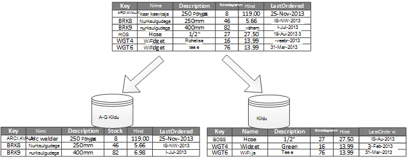
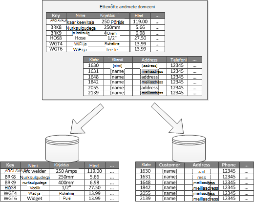
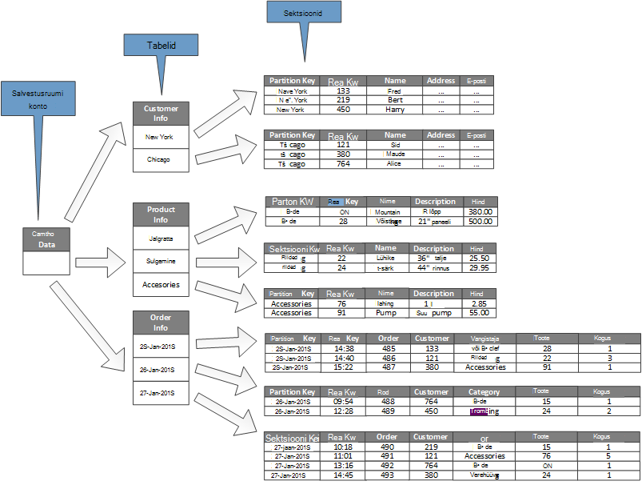

<properties
   pageTitle="Andmete eraldamine juhised | Microsoft Azure'i"
   description="Juhised selle kohta, kuidas hallata ja kasutada eraldi sektsioonide eraldamiseks."
   services=""
   documentationCenter="na"
   authors="dragon119"
   manager="christb"
   editor=""
   tags=""/>

<tags
   ms.service="best-practice"
   ms.devlang="na"
   ms.topic="article"
   ms.tgt_pltfrm="na"
   ms.workload="na"
   ms.date="07/14/2016"
   ms.author="masashin"/>

# Andmete eraldamine juhised

[AZURE.INCLUDE [pnp-header](../includes/guidance-pnp-header-include.md)]

## Ülevaade

Andmed on palju suuremahuliste lahendusi, jagatud eraldi sektsioonid, mida saate hallata ja kasutada eraldi. Eraldamine strateegia tuleb valida hoolikalt maksimeerimiseks eeliste ajal minimeerida negatiivset mõju. Eraldamine aitab parandada skaleeritavus, vähendada ja optimeerida jõudlust. Eraldamine on tagavad süsteemi andmete jagamist mustri kasutamiseks. Näiteks saate arhiivida vanemad, vähem aktiivne (külmetus) andmete odavam andmesalv.

## Miks partition andmeid?

Pilveteenuse rakenduste ja teenuste talletada ja tuua andmeid oma toimingud. Kujunduse salvestab andmed, mida rakendus kasutab saate on olulised jõudluse, jõudlus ja skaleeritavus süsteemi. Üks meetod, mis rakendatakse tavaliselt suuremahuliste süsteemide on eraldi andmeid jagada.

> Termini _eraldamine_ kasutatava juhendi viitab protsessi füüsilise jagades andmete andmeid eraldi poed. See pole sama, mis SQL serveri tabel eraldamine, mis on erinev mõiste.

Andmete eraldamine pakkuda mitmeid eeliseid. Näiteks saate rakendada järgmistel juhtudel:

- **Parandada skaleeritavus**. Kui muudate ühe andmebaasi süsteem, seda jõuavad füüsilise riistvara limiit. Kui jagage andmed üle mitme sektsioonid, mis on majutatud serveris eraldi, saate muudate süsteemi peaaegu lõputult.
- **Jõudluse parandamine**. Andmete Accessi toiminguid iga sektsiooni toimuma andmete maht on väiksem. Eeldusel, et andmed on liigendatud sobival viisil, eraldamine saate muuta teie süsteemi tõhusamaks. Samal ajal saab käitada rohkem kui ühte sektsiooni mõjutavad toimingud. Iga sektsiooni võib asuda lähedal rakendus, mis kasutab seda Võrgu latentsuse minimeerimiseks.
- **Parandada kättesaadavus**. Ühtne tõrge üleliigseid andmeid mitmest serverites aitab vältida. Kui server ei õnnestu, või on kavandatud hooldustööde ainult soovitud andmed partition on saadaval. Toiminguid sektsioonid, saate jätkata. Sektsioonid arvu suurendamine vähendab tõrke serveri suhteline mõju vähendamise protsent andmeid, mis pole saadaval. Iga sektsiooni imitatsiooniga saate vähendada ühe sektsiooni tõrke mõjutavad võimalus. See võimaldab ka kriitiline andmeid, mis peab olema pidevalt ja väga väikese väärtusega andmete põhjal saadaval, mis on väiksem kättesaadavus nõuded (logifailid, nt).
- **Turvalisuse parandamine**. Sõltuvalt andmete ja kuidas see on liigendatud, oleks võimalik eraldi tundliku ja tundliku sisuga andmete erinevad piirded ja serveritest või andmed talletab seetõttu. Turvalisus saab siis spetsiaalselt optimeeritud tundliku loomuga andmeid.
- **Sisesta tegevuse paindlikkus**. Eraldamine pakub mitmeid võimalusi peene häälestamine toimingud, halduse maksimeerimine ja minimeerimine maksumus. Näiteks saate määratleda erinevate strateegiad haldus, jälgimine, varundus ja taaste ja muid haldustoiminguid põhjal iga sektsiooni andmete prioriteedi.
- **Andmete talletamiseks kasutamine tüübile match**. Eraldamine võimaldab iga sektsiooni muud tüüpi andmesalve, põhineb maksumuse ja sisseehitatud funktsioonid, et andmete talletamiseks pakub kasutusele võtta. Näiteks saate suure kahendarvu andmed salvestatakse bloobimälu andmesalve, ajal rohkem liigendatud andmeid saate toimub dokumendi andmebaasi. Lisateabe saamiseks lugege teemat [polyglot ehitamine] mustrite ja tavade juhendist ja [andmetele juurdepääsu väga paindlik lahendusi: SQL-i abil, NoSQL ja polyglot püsimine] Microsofti veebisaidil.

Mõned süsteemid rakendada, eraldamine, kuna see on maksumus, mitte ära. Selle põhjus levinumad põhjused on järgmised.

- Paljude andmete säilitamise süsteemid ei toeta ühendused üle sektsioonid ja võib olla keeruline säilitada viitamistervikluse sektsioonitud süsteemis. On sageli vaja rakendada ühendused ja usaldusväärsuse kontrollimise rakenduse koodi (eraldamine layer), mis võib põhjustada täiendavaid SV- ja rakenduse keerukuse.
- Säilitades sektsioonid ei ole alati triviaalne ülesanne. Kui andmed on hävivad süsteemis peate taastub sektsioonid perioodiliselt väide ja sooja täpid vähendamiseks.
- Mõned levinud tööriistad ei toimi loomulikult sektsioonitud andmetega.

## Sektsioonid kujundamine

Andmeid saab liigendatud erineval viisil: horisontaalselt, vertikaalselt või funktsionaalselt. Valitav strateegia sõltub põhjus jagamine andmed ja rakenduste ja teenuste andmeid kasutavate nõuetele.

> [AZURE.NOTE] Viisil, mis ei sõltu andmete salvestusruumi tehnoloogial selgitatakse eraldamine skeemid kirjeldatud juhised. Ta saab rakendada mitut tüüpi andmete, sh relatsiooniline ja NoSQL andmebaasid.

### Eraldamine strateegiad

Kolm tüüpilised strateegiad eraldamine andmed on:

- **Horisontaalne eraldamine** (sageli nimetatakse _sharding_). See strateegia iga sektsiooni on andmesalve omaette, kuid kõik partitsioonid on sama skeemi. Iga sektsiooni nimetatakse ka _Kildu_ ja hoiab andmeid, nagu määratud rakenduse pood klientide tellimused teatud alamhulk.
- **Vertikaalne eraldamine**. Selle strateegia iga sektsiooni hoiab andmesalve alamhulga üksuste jaoks väljad. Väljade jagatakse vastavalt oma mustri kasutamiseks. Näiteks võidakse sageli külastatud väljad üks vertikaalne sektsioon ja vähem sageli külastatud väljad teise.
- **Funktsionaalne eraldamine**. See strateegia on andmed ühendada vastavalt selle kasutamise iga piiratud konteksti poolt süsteemi. Näiteks pood süsteem, et rakendab eraldi arvete ärifunktsioonide ja toote laoseisu haldamise võivad talletada arve andmeid ühe sektsiooni ja toote varude andmed teise.

See on oluline märkida siin kirjeldatud kolme strateegiad kombineerida. Ta ei ole üksteist välistavad ja soovitame kaaluda need kõik eraldamine kava kujundamisel. Näiteks võib andmeid jagada shards ja seejärel kasutage vertikaalne eraldamine täpsemaks jagada iga Kildu andmed. Samuti otstarbekas sektsiooni andmete tükeldamiseks mitmeks shards (mille saate ka olema vertikaalselt liigendatud).

Siiski saate iga strateegia erinevate nõuete tõsta vastuoluliste küsimusi. Tuleb hinnata ja jääk kõik need eraldamine kava, mis vastab teie süsteemi jõudluse üldise andmete töötlemise eesmärkide kujundamisel. Järgmistes jaotistes uurida iga strateegiad üksikasjalikumalt.

### Horisontaalne eraldamine (sharding)

Joonis 1 näitab horisontaalne eraldamine või sharding ülevaade. Selles näites on toote varude andmed jagatud shards põhjal tootevõti. Iga Kildu hoiab Kildu klahvid (A-G ja H – Z) tähestikuliselt korraldatud järjestikuste erinevaid andmeid.

_Joonis 1. Horisontaalselt eraldamine (sharding) andmete põhjal sektsiooni võti_

Sharding aitab teil laadi jaotada rohkem arvutit, mis vähendab väide ja parandab jõudlust. Muudate süsteemi välja, lisades shards täiendavad serverites töötavad.

Kõige olulisem tegur eraldamine strateegia rakendamisel on valik sharding võti. See võib olla keeruline muuta võtit pärast süsteemi käivitamist. Võti, veenduge, et andmed on liigendatud nii, et töökoormus on nii isegi kui võimalik üle shards.

Pange tähele, et erinevate shards ei sisaldada sarnaseid andmemahtusid. Pigem tähtsamatele tasu on jääk arvu. Mõned shards võib olla väga mahukad, kuid iga üksuse käsitletakse väike arv Accessi toimingud. Muud shards võib olla väiksem, kuid iga üksuse juurde palju sagedamini. See on oluline, et ühe Kildu ei ületaks skaala piirangud (nii läbilaskevõime ja töötlemise ressursside) andmesalve, mida kasutatakse selle Kildu majutada.

Kui kasutate sharding värviskeemi, vältige pääsupunktidega (või kuum sektsioonid) mis võivad mõjutada jõudlust ja kättesaadavust. Näiteks kui kasutate asemel kliendi nime algustäht räsi kliendi identifikaator, saate takistada tasakaalustamata jaotuse, mis on saadud levinud ja vähem levinud esimest tähte. See on tüüpilised meetod, mis aitab jaotada andmete ühtlaselt kogu sektsioonid.

Valige sharding võti, mis vähendab suurte shards tükeldada väiksemaks andmeühikuga, mis tahes tulevaste nõuete small shards liitumist sisse suuremat sektsioonid või muuta skeemiga kirjeldav kogumi sektsioonid talletatud andmed. Neid toiminguid võib olla väga aeganõudev ja võib vaja ühe või mitme shards ühenduseta ajal neid.

Kui shards on kopeeritud, oleks võimalik mõned kujundusmuudatusi võrgus hoida, samal ajal on teistega jagada, ühendatud või uuesti. Süsteemi tekkida vajadus piirata toimingud, mida saab teha neid shards andmeid ajal ümberkonfigureerimine toimub. Näiteks saab selle koopiad andmete märkida inconsistences, mis võivad tekkida ajal shards ümber korraldada ulatust piirata kirjutuskaitstuks.

> Üksikasjalikumat teavet ja juhiseid paljude nende kasutuse ja hea tava võtteid kujundamise andmete poed eeldab, et horisontaalne eraldamine kohta, vt [Sharding mustri].

### Vertikaalne eraldamine

Kõige levinum kasutamine vertikaalne jagamine on selle I/O vähendamiseks ja jõudluse kulusid tõmbamine üksused, mis on kõige sagedamini juurde. 2 joonis kujutab näidet vertikaalne eraldamine. Selles näites hoitakse iga andmete üksuse eri atribuutide eri sektsiooni. Üks sektsioon hoiab andmeid, mis on kättesaadav sagedamini, sh nimi, kirjeldus ja hinna teavet toodete. Teise hoiab maht stock ja järjestatud lõppkuupäeva.

_Joonis 2. Vertikaalselt eraldamine andmeid oma mustri kasutamiseks_

Selles näites rakendus regulaarselt küsib toote nimi, kirjeldus ja hinna klientidele toote üksikasjade kuvamisel. Laoseisu ja toote viimati tellimise kuupäev tootja hoitakse eraldi sektsiooni kuna need kaks kirjet kasutatakse koos.

See eraldamine kava veel eelis, et suhteliselt aeglase andmed (toote nimi, kirjeldus ja hind) on eraldatud dünaamilisemaks andmed (laoseisu ja lõppkuupäeva järjestatud). Rakendus võib olla kasulik vahemälu aeglase mällu andmed, kui sageli pääseb.

Teine tüüpiline stsenaarium eraldamine strateegia on maksimeerimine tundliku teabe turvalisus. Näiteks saate seda teha talletades krediitkaardinumbrid ja vastavate turvalisus kontrollimise numbreid eraldi.

Vertikaalne eraldamine saate vähendada ka samaaegne juurdepääsu, mis on vajalikud andmed summa.

> Vertikaalne eraldamine toimib üksuse tasandil sees andmesalve, osaliselt normaliseerida jaotada see _lai_ üksusest kogumisse _piiritlemiseks_ üksused üksus. See sobib ideaalvariandis mitte nagu HBase ja Cassandra veerusuunitlusega andmete poed. Kui andmete kogumise veergude tõenäoliselt muuta, võite ka kaaluda veeru poed SQL serveri abil.

### Otstarbekas jagamine

Süsteemid, kus on piiratud kontekstis iga erinevate business ala või teenuse rakenduse tuvastada, pakub funktsionaalne eraldamine tehnika eraldamise ja andmed Accessi jõudluse parandamiseks. Teine levinud kasutamine otstarbekas eraldamine on kirjutuskaitstud andmeid, mida kasutatakse aruandluseks lugemis-ja kirjutamisõigusega andmete eraldamiseks. Joonis 3 kuvatakse ülevaade otstarbekas eraldamine, kus varude andmete eraldada kliendiandmete.

_Joonis 3. Piiratud kontekstis või alamdomeen funktsionaalselt eraldamine andmed_

See eraldamine strateegia aitab vähendada andmed Accessi üle erinevate osade süsteem.

## Kujundamise sektsioonid jaoks skaleeritavus.

On oluline, kaaluge suurus ja töökoormus kõigi sektsioonide ja jääk neid nii, et andmed on jaotatud maksimaalne skaleeritavus saavutamiseks. Siiski peab ka partition andmeid, nii, et see ei ületa ühe sektsiooni poe skaleerimise piirangud.

Sektsioonid jaoks skaleeritavus kujundamisel, tehke järgmist.

1. Analüüsida rakenduse mõista andmed Accessi mustrid, näiteks mahu iga päringu poolt tagastatud tulemite hulk, sagedus juurdepääsu, omast latentsus ja serveripoolne arvutada töötlemise nõuded. Paljudel juhtudel nõuavad mõned peamised üksused enamik töötlemine ressursse.
2. Analüüsi abil saate määratleda praegustele ja tulevastele skaleeritavus sihtkohtade, nagu andmete suurus ja töökoormus. Seejärel jaotada andmeid kogu sektsioonid skaleeritavus eesmärgi saavutamiseks. Horisontaalne eraldamine strateegia valimise korral Kildu võti on oluline veenduge, et jaotuse on paaris. Lisateavet leiate teemast [Sharding mustri].
3. Veenduge, et saadaval iga sektsiooni ressursid on piisavalt tegelema skaleeritavus nõuetele andmete maht ja jõudlus. Näiteks võib sõlm, mis majutab sektsiooni kehtestada on raske limiiti salvestusruumi, power või võrgu läbilaskevõime, mis pakub. Kui andmete säilitamise ja töötlemise nõuded võivad need piirangud ületada, võib olla vaja piiritleda eraldamine strateegia kavandamine ja andmete välja täpsemaks tükeldamine. Näiteks üks skaleeritavus võib olla rakenduse põhifunktsioonid logimine andmete eraldamiseks. Tehke seda andmeid eraldi poed abil, et vältida andmete mäluruumi kaudu ei ületaks skaleerimise sõlme. Kui andmete arv ületab sõlm, võib olla vaja kasutada eraldi salvestusruumi sõlmed.
4. Jälgimine süsteemi jaotises Kasuta veendumaks, et andmed on õigesti jaotatud ja et sektsioonid saavad hakkama laadi, et need on määratud. On võimalik kasutamine ei vasta eeldatav analüüsi kasutamine. Sel juhul võib olla võimalik taastub sektsioonid. Selle puudumisel võib olla vaja ümberkujundamiseks süsteemi saada vajalik ülejäänud osa.

Pange tähele, et mõned cloud keskkonnas eraldada rahalisi taristu piirmäärad. Tagada, et teie valitud piiri piirid mis tahes andmete andmesalv, töötlemise võimsus ja läbilaskevõime mahu eeldatava kasvu jaoks piisavalt ruumi.

Näiteks kui kasutate Azure'i tabelimälu, hõivatud Kildu võib nõuda rohkem ressursse on saadaval ühe sektsiooni päringute töötlemiseks. (Pole taotlusi, mida võib käsitleda ühe sektsiooni teatud aja jooksul maht on piiratud. Teemast [Azure storage skaleeritavus ja jõudluse sihtkohtade] lehe üksikasjalikumat teavet Microsofti veebisaidil.)

 Kui see on nii, on Kildu võib vaja olla repartitioned levitada laadi. Kui täissuuruses või läbilaskevõime on need tabelid ületab võimsus salvestusruumi konto, võib olla vaja luua täiendavat salvestusruumi kontod ja tabelid laiali need kontod. Kui salvestusruumi kontod arv ületab kontod, mis on saadaval tellimuse arv, siis see võib olla vaja kasutada mitu tellimust.

## Päringu jõudluse sektsioonid kujundamine

Päringu jõudluse sageli vaja kiirendada väiksemate andmekogumite kasutades ja paralleelselt päringuid. Iga sektsiooni peaks sisaldama väikese osa kogu andmekogumit. Selle mahu vähendamiseks saate parandada päringud. Siiski eraldamine ei ole alternatiiv kavandamise ja konfigureerimise andmebaasi õigesti. Näiteks veenduge, et teil on vajalikud registrid kohas relatsiooniandmebaasist kasutamisel.

Päringu jõudluse sektsioonid kujundamisel, tehke järgmist.

1. Läbi vaadata rakenduse nõuded ja jõudluse:
    - Nõuded business abil saate määratleda kriitilised päringuid, mis peab alati kiiresti teha.
    - Jälgimine süsteemi kindlaks teha aeglaselt toimingupäringud.
    - Luua, milliste päringute teostamise kõige sagedamini. Iga päringu ühekordsest võib-olla vaevaga, kuid ressursid kumulatiivse tarbimine võib oluliselt. See võib olla kasulik andmeid, mis on need päringud toodavate erinevate sektsiooni või isegi vahemälu.
2. Andmed, mida põhjustab aeglase sektsiooni:
    - Piirake iga sektsiooni suurust nii, et päringu vastuse aeg on sihtkoht.
    - Kujundage Kildu võti nii, et rakendus hõlpsalt leida sektsiooni, kui te rakendavad horisontaalne eraldamine. See ei pea päringu skannimiseks iga sektsiooni kaudu.
    - Kaaluge sektsiooni asukoht. Kui võimalik, proovige sektsioonid geograafiliselt rakendused ja kasutajate juurdepääs lähedal asuvate andmete hoidmine.
3. Kui ettevõttel on läbilaskevõime ja päringu jõudluse nõuetele, kasutage otstarbekas eraldamine selle üksuse põhjal. Kui see on endiselt ei vasta nõuetele, rakendada ka horisontaalne eraldamine. Enamikul juhtudel piisab ühe eraldamine strateegia, kuid mõnel juhul on tõhusam kombineerimiseks nii strateegiad.
4. Kaaluge asünkroonne päringud, mis töötavad samal ajal kogu sektsioonid jõudluse parandamiseks.

## Sektsioonid kättesaadavuse kujundamine

Andmete eraldamine saate parandada rakenduste kättesaadavus kogu andmekomplekti ei ole tõrge ühtne ja üksikute kohta andmekomplekti sõltumatult hallatavate. Kriitiliste andmete sisaldavaid sektsioonide imitatsiooniga saate parandada kättesaadavus.

Kujundamine ja rakendamisel sektsioonid, võtke arvesse järgmisi tegureid, mis mõjutavad kättesaadavus.

- **Kuidas kriitilist andmed on äritegevuse**. Mõned andmed võivad sisaldada näiteks arve üksikasjad või tehingu tähtis äriteave. Muud andmed võivad vähem kriitilised funktsionaalseid andmed, nt logifailid, jõudlus jälgi ja jne. Pärast igat tüüpi andmete tuvastamine, kaaluge.
    - Kriitiliste andmete talletamine tugevalt saadaval sektsioonid koos vastav varukoopia plaan.
    - Luua eraldi haldus ja jälgimisega seotud menetlustele või toimingute ja iga andmekomplekti erinevate criticalities jaoks. Viige andmeid, mida samal tasemel kantsiks sama sektsiooni nii, et see saab varundada koos vajaliku sagedusega. Näiteks sektsioonid andmete tehingute reguleerivad tekkida vajadus sagedamini sektsioonid logimine või Jälita teavet reguleerivad varundada.
- **Kuidas saab hallata üksikuid sektsioonid**. Kujundamise sektsioonid sõltumatu haldus ja hooldus pakub mitmeid eeliseid. Näiteks:
    - Sektsiooni nurjumisel seda taastada sõltumatult mõjutamata rakendusi, et juurdepääs andmete sektsioonid eksemplarid.
    - Andmete geograafiliste piirkondade lõikes eraldamine võimaldab kavandatud hooldustööde tipptundide iga asukoha jaoks esineb. Tagama, et sektsioonid on liiga suur, et vältida mis tahes kavandatud hooldustööde lõpule viimise selle aja jooksul.
- **Kas soovite korrata kriitiliste andmete üle sektsioonid**. Selle strateegia saate parandada kättesaadavus ja jõudluse, kuigi saate sisse ka järjepidevuse küsimustes. Võtab aega sünkroonida iga koopia sektsiooni andmetega tehtud muudatusi. Selle aja jooksul erinevate sektsioonid sisaldavad erinevat tüüpi andmete väärtused.

## Kuidas eraldamine mõjutab kujundus ja arengu mõistmine

Kasutades eraldamine lisatakse kujundus ja teie süsteemi keerukuse. Kaaluge eraldamine olulise osana süsteemi kujundus, isegi kui süsteemi algselt sisaldab ainult ühte sektsiooni. Kui valite eraldamine järelmõte, nagu on jõudlus ja skaleeritavus probleemid süsteemi käivitamisel, keerukus tõus, sest teil juba on reaalajas süsteemi säilitada.

Kui värskendate süsteemi lisada eraldamine selles keskkonnas, see on vaja andmete juurdepääsu loogika muutmine. See võib hõlmata ka migreerimine suure hulga levitada seda üle sektsioonid, sageli ajal kasutajaid eeldab saama kasutada süsteemi olemasolevad andmed.

Mõnel juhul eraldamine ei loeta oluline, kuna algse andmekomplekti on väike ja saab hõlpsasti ühe server. See võib olla täidetud süsteemi, mis ei tohiks mastaapimiseks Lisaks selle algse suuruse, kuid palju trükikojas tuleb laiendamiseks nimega arv suureneb kasutajad. See on tavaliselt kaasas kasvu andmete maht.

See on oluline mõista, et eraldamine ei ole alati suurte andmete funktsioon. Näiteks small andmesalve võib olla tugevalt juurde sadu samaaegseid kliente. Sellisel juhul andmete eraldamine aitab vähendada ja parandada läbilaskevõime.

Andmete eraldamine kava kujundamisel võtke arvesse järgmist:

- **Võimaluse korral andmete andmebaasi levinumate toimingute koos hoida iga sektsiooni minimeerimiseks rist-sektsiooni andmed Accessi toimingud**. Päringute üle sektsioonid võib olla aeganõudev rohkem kui ainult ühe sektsioonis päringud, kuid sektsioonid ühe hulk päringute optimeerimine võib kahjustada päringute hulki. Kui te ei saa vältimiseks päringute üle sektsioonid minimeerida töötab paralleelselt päringuid ja tulemuste rakendusest summeerimine päringu aeg. Seda moodust ei pruugi olla võimalik mõnel juhul, näiteks kui on vaja saada tulemuseks ühe päringu ja kasutage seda järgmise päringu.
- **Kui päringute veenduge kasutada suhteliselt staatilise viide andmeid, nt sihtnumber tabelite või toote loendite, kaaluge imitatsiooniga andmed kõikide sektsioonide vähendamiseks eraldi otsing toimingute eri sektsiooni nõue**. Seda moodust saab vähendada ka tõenäosuse viide muutumas "soe" andmekomplekti, on raske liiklus üle kogu süsteemi andmed. Kuid on seostatud sünkroonimisel muudatusi, mis võivad tekkida see viide andmetele lisatasu.
- **Võimaluse korral minimeerida nõuded viitamistervikluse vertikaal- ja funktsionaalne sektsioonid üle**. Need skeemid rakenduse ise vastutab säilitades viitamistervikluse sektsioonid üle, kui andmed on värskendatud ja tarbitud. Päringud, mis peab Liitu andmete kogu mitu sektsiooni käivitage aeglasemalt päringud, mis liituda andmete sama sektsioonis, sest rakendus peab tavaliselt klahvi ja seejärel Võõrvõti vastavalt järjestikust päringute sooritamiseks. Selle asemel, kaaluge imitatsiooniga või tühistage normaliseerida andmeid. Päringu aega, kui on vaja rist-partition ühendused minimeerimiseks üle sektsioonid paralleelsetes päringute sooritamine ja liitumine rakendusest andmete.
- **Kaaluge eraldamine kava võib olla andmete järjepidevuse üle sektsioonid soovitud efekti.** Hinnake, kas tugev järjepidevuse on tegelikult nõue. Selle asemel on levinum lähenemine pilveteenuses rakendada lõpliku järjepidevuse. Iga sektsiooni andmeid värskendatakse eraldi ja rakenduse loogika tagab, et värskendused on kõik lõpule viidud. Käsitlemisel ka selliste vastuolude tekkimist, mis võivad tekkida andmete päringud lõpuks ühtsete toimingu töötamise ajal. Lõpliku järjepidevuse rakendamise kohta leiate lisateavet teemast [andmete järjepidevuse primer].
- **Kaaluge võimalust, kuidas päringute leidke õige partition**. Kui päringu peab skannida kõik partitsioonid nõutav andmete leidmiseks, on oluline mõju avaldada, isegi siis, kui mitu paralleelselt päringuid töötab. Päringud, mida kasutatakse koos vertikaal- ja funktsionaalne eraldamine strateegiad loomulikult saate määrata sektsioonid. Siiski horisontaalne eraldamine (sharding) saab teha asukoha üksuse keeruline, kuna iga Kildu on sama skeem. Tüüpilised sharding lahenduseks on Kildu asukoha jaoks kindlate üksuste andmete otsimiseks kasutatavate kaardi säilitada. See kaart saate rakendada sharding loogika rakenduse või haldab andmesalve, kui see toetab läbipaistev sharding.
- **Kasutades horisontaalne eraldamine strateegia, kaaluge perioodiliselt ümberkorraldamine shards**. See aitab, suurus ja töökoormus pääsupunktidega minimeerimine, maksimeerimine päringu jõudluse ja lahendamiseks füüsilise säilitamise piirangud hajutamine andmed. See on aga keerukas toiming, mis on sageli vaja kasutada kohandatud tööriistas või protsessi.
- **Kui te ise iga sektsiooni pakub täiendavaid kaitse tõrge**. Kui ühe koopia nurjub, saate päringuid suunatud töö koopia.
- **Kui jõuate füüsilised piirid eraldamine strateegia, võib juhtuda laiendamine skaleeritavus mõnele muule tasemele**. Näiteks kui eraldamine on tasemel andmebaasi, peate Leidke või mitme andmebaaside sektsioonid kopeerida. Kui eraldamine on juba andmebaasi tasemel ja füüsilisi piiranguid on probleeme, see tähendab, peate Leidke või partitsioonid mitmelt majutusteenuse kopeerida.
- **Vältida andmete mitu sektsiooni juurdepääsu tehingud**. Mõned andmed salvestab rakendada selgituseks järjepidevuse ja toimingute viitamistervikluse mis muuta andmeid, kuid ainult siis, kui andmed asub sektsiooni ühe. Kui vajate üle mitme sektsioonid selgituseks tugi, tõenäoliselt tuleb teil rakendada seda oma rakenduse loogika osana, kuna kõige eraldamine süsteemid ei toeta kohalikke.

Kõigi andmete poed on vaja mõned funktsionaalseid haldus ja tegevuse jälgimine. Tööülesanded saate vahemikus andmete laadimine, varundada ja andmete taastamine, andmete ümberkorraldamine ning tagada, et süsteem toimib õigesti ja tõhusalt.

Võtke arvesse järgmisi tegureid, mis mõjutavad tegevuste juhtimine.

- **Kuidas rakendada vastav haldus ja töötoimingute, kui andmed on liigendatud**. Järgmised toimingud võivad varundus ja taaste, arhiivimine jälgimine süsteemi ja muude haldustoimingute andmed. Näiteks säilitamine loogilised järjepidevus varundus ja taaste ajal võib olla probleemiks.
- **Kuidas laadimise mitme sektsioonid andmeid ja lisada uusi andmeid, mis on saabuvate muudest allikatest**. Mõned tööriistad ja Utiliidid ei toeta sharded andmete toiminguid nagu õige sektsiooni andmete laadimine. See tähendab, et peate loomiseks või saada uusi tööriistu ja Utiliidid.
- **Arhiivimine ja regulaarselt andmete kustutamiseks tehke järgmist**. Liigse kasvu sektsioonide takistamiseks peate arhiivimine ja kustutavad andmeid regulaarselt (ehk iga kuu). See võib olla vajalik muuta andmete erinevad arhiivi skeemi vastavaks.
- **Leidke andmete terviklusega seotud probleemide kohta**. Kaaluge perioodiliste protsess ühe sektsiooni, mis viitab teises puuduva teabe mis tahes andmete terviklusega seotud probleemide nagu andmete otsimiseks. Protsessi saate kas katse nende probleemide lahendamiseks automaatselt või käsitsi probleemide lahendamiseks operaatoriga teatise tõsta. Näiteks rakenduses Pood tellimuse teave võib toimub üks sektsioon, kuid kirjeid, mida kujutavad endast iga tellimuse võib toimub teise. Tellimuse protsess peab sektsioonid andmete lisamiseks. Kui see nurjub, seal võib kirjeid säilitatakse mis on ilma vastavate järjestuses.

Erinevat tüüpi andmete salvestusruumi tehnoloogiad tavaliselt esitada oma funktsioone, mis toetavad eraldamine. Järgmistes jaotistes on rakendatud andmete poed levinud Azure rakendused soovitud suvandid. Samuti on kirjeldatud kaalutluste kohta saate kõige paremini ära need funktsioonid rakenduste kujundamine.

## Azure'i SQL-andmebaasi eraldamine strateegiad

SQL Azure'i andmebaas on relatsiooniline andmebaas-kui-a-teenus, mis töötab pilveteenuses. See põhineb Microsoft SQL Server. Relatsiooniandmebaasist jagab teabe tabeliteks ja iga tabel sisaldab teavet üksuste ridade reana. Iga rida sisaldab veergude reguleerivad üksuse üksikute väljade andmeid. Lehe [mis on Azure SQL-andmebaasi?] Microsofti veebisaidilt leiate üksikasjaliku dokumentatsiooni loomise ja kasutamise SQL-i andmebaaside kohta.

## Horisontaalne eraldamine elastne andmebaasiga

Ühe SQL-andmebaasi on andmeid, mis võib sisaldada maht on piiratud. Arhitektuuriline tegurid ja samaaegseid ühendusi, mis toetab arv on piiratud läbilaskevõime. SQL-andmebaasi elastne andmebaasi funktsioon toetab puhul SQL-andmebaasi horisontaaltelje skaalat. Elastne andmebaasi kasutamisel saate saate partition andmete sisse shards, mis on levinud üle mitme SQL andmebaase. Saate lisada või eemaldada shards käsitlema andmete maht kasvab ja ühel vaja. Elastne andmebaasi kasutamise aitab vähendada jagades laadi üle andmebaasid.

> [AZURE.NOTE] Elastne andmebaas on lugemisprogrammi Azure'i SQL-andmebaasi ühendused funktsiooni. Olemasoleva SQL-i andmebaasi Federation installide migreeritud elastne andmebaasi kasuliku ühendused migreerimise abil. Teise võimalusena saate rakendada oma sharding süsteem, kui teie stsenaariumi ei saa ümber loomulikult funktsioone, mis on esitatud elastne andmebaasi.

Iga Kildu on rakendada SQL-andmebaasi. Mõne Kildu mahub rohkem kui üks andmekomplekti (nimetatakse ka _shardlet_). Metaandmete, mis kirjeldab shardlets, mis sisaldab säilitab iga andmebaasi. Mõne shardlet võib olla ühe üksuse või see võib olla rühma üksuste ühiskasutusse andmine on sama shardlet võti. Näiteks kui olete rentnikuga rakenduse sharding andmete, shardlet võti võib olla rentniku ID-d ja kõik andmed antud rentniku jaoks saab pidada sama shardlet osana. Muud rentnikud andmeid soovite toimuvad eri shardlets.

Vastutab on programmeerija shardlet klahvi andmekomplekt seostada. Eraldi SQL-andmebaasi toimib globaalne Kildu kaardi haldur. See andmebaas sisaldab loendit shards ja shardlets süsteemi. Kliendi rakendus, mis kasutab andmete ühendab esmalt on globaalne Kildu kaardi halduri andmebaasi trükise Kildu kaart (loetelu shards ja shardlets), siis salvestab kohalikult.

Seejärel rakendus kasutab seda teavet näeksid marsruutimiseks andmete päringute vastav Kildu. See funktsioon on peidus API-d, mis sisalduvad Azure SQL-i andmebaasi elastne andmebaasi kliendi teek, mis on saadaval paketina Nugeti sarja. Microsofti veebisaidi lehele [elastne andmebaasi funktsioonide ülevaate] leiate põhjalikum tutvustus elastne andmebaasi.

> [AZURE.NOTE] Saate kopeerida globaalse Kildu kaardi Manageri andmebaasi viiteaja vähendamiseks ja parandada kättesaadavus. Kui otsustate, kasutades ühte järgmistest Premium hinnakirjad astme andmebaasi, saate konfigureerida aktiivse geo kopeerimine pidevalt andmete kopeerimine erinevate piirkondade andmebaasidega. Iga piirkonna, kus kasutajad on aluseks olev andmebaasikoopia loomine Seejärel konfigureerida rakenduse ühenduse Kildu kaardi hankida see eksemplar.

> Alternatiivne lähenemine on Kildu kaardi halduri andmebaasi tiražeerimine piirkondade Azure SQL-i andmete sünkroonimine või mõne Azure'i andmed Factory müügivõimaluste abil. Seda tüüpi dispersioonanalüüs perioodiliselt töötab ja see on kui Kildu kaart muutub harva. Lisaks Kildu kaardi halduri andmebaas pole hinnad taseme lisatasu abil luua.

Elastne andmebaasi pakub kahte skeemi ja shardlets andmete vastendamise ja nende salvestamise shards.

- **Loendi Kildu kaardi** kirjeldatakse ühe võtme ja soovitud shardlet vahel. Näiteks rentnikuga süsteemis iga rentniku andmeid saab seotud kordumatu võti ja oma shardlet talletatud. Privaatsuse eraldamise tagamiseks (st ühest rentnikust takistada kurnav andmete salvestusruumi ressursside ka teistele kättesaadavaks teha), iga shardlet saab peetud oma Kildu.

_Joonis 4. Rentniku andmete talletamiseks eraldi shards loendi Kildu kaardi abil_

- **Vahemiku Kildu kaardi** kirjeldatakse sidusaid võtme väärtuste kogumi ja soovitud shardlet vahel. Rentnikuga näites kirjeldatud varem alternatiivina rakendamise spetsiaalne shardlets, saate rühmitada kogumi rentnikud (iga oma võti) jooksul sama shardlet andmeid. Selle kava on tavalisest esimene (rentnikud jagada andmete salvestusruumi ressursse), kuid samuti luuakse riski vähendatud andmete privaatsust ja eraldamise.

_Joonis 5. Andmete jaoks mitmesuguseid rentnikud talletamiseks soovitud Kildu vahemiku Kildu kaardi abil_

Pange tähele, et ühe Kildu võib sisaldada mitut shardlets andmeid. Näiteks saate loendi shardlets jaoks eri Mittesidusate rentnike jaoks sama Kildu andmete talletamiseks. Võite ka segada vahemiku shardlets ja loendi shardlets sisse sama Kildu, kuigi ta käsitletakse erinevaid kaarte globaalne Kildu kaardi halduri andmebaasis. (Globaalne Kildu kaardi halduri andmebaas võib sisaldada mitut Kildu kaartide.) Joonis 6 kujutatakse seda moodust.

_Joonis 6. Mitme Kildu rakendamise kaardid_

Teie süsteemi olulised võib olla eraldamine kava, mida soovite rakendada. See võib mõjutada ka määr, kus shards tuleb lisada või eemaldada või määr, millega peab repartitioned andmeid, shards üle. Elastne andmebaasi kasutamisel sektsiooni andmed, võtke arvesse järgmist.

- Rühma andmed, mida kasutatakse koos sama Kildu ja vältida toimingute kohta, mida peavad juurde pääsema andmetele, mis toimub mitme shards. Pidage meeles, et elastne andmebaasi, kus on Kildu on SQL-andmebaasi omaette, ja Azure'i SQL-andmebaasi ei toeta risti andmebaasi ühendused (mis tuleb teha kliendi poolel). Pidage meeles ka seda, et Azure SQL andmebaasis viitamistervikluse piiranguid, päästikute ja ühe andmebaasi salvestatud toimingute ei tohi viidata objektide teise. Seetõttu ei kujundamine süsteem, mis on sõltuvused shards vahel. SQL-andmebaasi sisaldada andmeid sageli kasutatud päringuid ja muude toimingute koopiate tabeleid. Järgmised tabelid pole mõnda kindlat shardlet kuulub. Imitatsiooniga andmed üle shards aitab Liitu andmeid, mis hõlmavad andmebaaside vajadust eemaldada. Ideaalvariandis mitte neid andmeid peaks olema staatiline või aeglase dispersioonanalüüs peegeldav ja vähendada võimalusi muutumist aegunud.

    > [AZURE.NOTE] Kuigi SQL-andmebaasi ei toeta risti andmebaasi ühendused, saate teha rist-Kildu päringute elastne andmebaasi API-ga. Need päringud saate läbipaistev itereerima läbi shardlets, millele viidatakse Kildu kaardil olevad andmed. Elastne andmebaasi API piirid rist-Kildu päringut allapoole arvesse mitmeid üksikuid päringuid (üks iga andmebaasi) ja siis liidab tulemid. Lisateavet leiate teemast [mitme Kildu päringute] lehe Microsofti veebisaidil.

- Shardlets, mis kuuluvad sama Kildu kaart talletatud andmed peaks olema sama skeemi. Ärge looge loendi Kildu kaarti, mis viitab mõni shardlets rentniku andmeid sisaldav ja muud shardlets, mis sisaldab tooteteave. See reegel on jõustatud elastne andmebaasi, kuid andmehaldus ja päringute muutub keerukaid, kui iga shardlet on erinevate skeem. Ainult viidatud näites on hea lahendus on kaks loendi Kildu kaartide loomine: üks, mis viitab rentniku andmed ja teise, mis viitab tooteteave. Pidage meeles, et eri shardlets kuuluvate andmete saab salvestada sama Kildu.

    > [AZURE.NOTE] Rist-Kildu funktsioonide elastne andmebaasi API sõltub iga shardlet sisaldavad sama skeemi Kildu kaart.

- Selgituseks toimingud on toetatud ainult andmeid, mis on sama Kildu ja pole üle shards. Tehingud võib hõlmata shardlets, kui need on osa on sama Kildu. Seetõttu, kui teie äriloogika peab toiminguid, kas sama Kildu probleemse andmete talletamiseks või lõpliku järjepidevuse rakendada. Lisateavet leiate teemast [andmete järjepidevuse primer].
- Paigutada shards lähedale kasutajate juurdepääs nende shards andmed (ehk teisisõnu geo-leidke shards). Selle strateegia abil vähendada latentsus.
- Vältida olukorda, kus segu väga aktiivne (pääsupunktidega) ja suhteliselt passiivsed shards. Laadi ühtlaselt shards proovida. Seda võib vaja räsi shardlet võtmed.
- Kui olete geo asukoha shards, veenduge, et et räsitud võtmed vastendamine shardlets olevad shards talletatud lähedale selle andmetele juurdepääs kasutajatelt.
- Praegu üksnes andmekomplekti SQL-i andmetüübid on toetatud nimega shardlet võtmed; _int, suur täisarv, varbinaar,_ ja _ainuidentifikaatori_. SQL-i _int_ ja _suur täisarv_ tüüpi vastavad C# andmetüüpide _int_ ja _pikk_ ja on sama vahemikud. SQL-i _varbinaar_ tüüp võib käsitleda abil _baitide_ massiivis C# ja SQL-i _uniqueidentier_ tüüp vastab _Guid_ klassi .NET Frameworki.

Nagu nimi viitab, elastne andmebaasi võimaldab lisada ja eemaldada shards, kuna andmete maht ühel vaja ja kasvab süsteemi. API-de Azure'i SQL-andmebaasi elastne andmebaasi kliendi teegis lubada rakenduse loomine ja kustutamine shards dünaamiliselt (ja läbipaistev värskendada Kildu kaardi manager). Siiski eemaldamine on Kildu on hävitava toiming, mis eeldab, et kõik selle Kildu andmed kustutada.

Kui rakendus peab on Kildu tükeldamine kahe eraldi shards või ühendada shards, elastne andmebaas sisaldab eraldi tükeldatud ühendamine teenus. See teenus cloud majutatud teenuse (mis peab olema loodud arendaja) töötab ja migreerib andmeid turvaliselt shards. Lisateabe saamiseks lugege teemat [mastaapimine elastne tükeldatud ühendamine andmebaasiriista abil] Microsofti veebisaidil.

## Azure Storage eraldamine strateegiad

Azure'i salvestusruumi pakub kolme veevõtu andmete haldamise.

- Tabelimälu, mis rakendab scalable struktuuri salvestusruumi. Tabel sisaldab üksused, mis võivad hõlmata atribuudid ja väärtuste kogumi.
- Bloobimälu, mis varustab suured objektid ja failide salvestusruum.
- Salvestusruumi järjekorrad, mis toetavad, usaldusväärseid asünkroonne sõnumside rakenduste vahel.

Tabelimälu ja bloobimälu on põhiosas võti väärtus poed, mis on optimeeritud mahutamiseks struktureeritud ja struktureerimata andmed vastavalt. Salvestusruumi järjekorrad pakuvad lõdvalt seotud, scalable rakenduste süsteem. Tabelimälu, bloobimälu ja salvestusruumi järjekorrad luuakse Azure storage konto kontekstis. Salvestusruumi kontod toetavad kolm vormide koondamise:

- **Kohalik liigsete salvestusruumi**, mis säilitab andmete ühe andmekeskuse kolm eksemplari. Selle vormi koondamise kaitseb riistvara tõrke vastu, aga mitte katastroof, mis hõlmab kogu andmekeskuse.
- **Tsooni liigsete salvestusruumi**, mis säilitab andmete levinud üle erinevate andmekeskuste samas piirkonnas (või kahe geograafiliselt Sule piirkondade) kolm koopiad. Selle vormi koondamise saab kaitsta katastroofid, mis ilmnevad ühe andmekeskuse, kuid ei saa kaitsta suuremahuliste võrgu katkestatakse ühendus, mis mõjutavad kogu piirkonna. Võtke arvesse, et zone liigsete salvestusruumi praegu ainult praegu Blokeeri plekid.
- **Geograafilise liigne salvestusruumi**, mis säilitab andmete kuus koopiad: kolm eksemplaris ühe piirkonna (piirkonna) ja teise kolm eksemplari remote piirkonnas. Selle vormi koondamise pakub kõrgeimat katastroofikaitse.

Microsoft on avaldatud skaleeritavus sihtkohtade Azure Storage. Lisateabe saamiseks vaadake lehte [Azure Storage skaleeritavus ja jõudluse sihtkohtade] Microsofti veebisaidil. Praegu kokku konto mälumaht ei tohi ületada 500 TB. (See sisaldab andmeid, mis toimub suurust tabelimälu ja bloobimälu kui ka tasumata sõnumite hoitava salvestusruum järjekorra).

(Kui 1-KB üksus, bloobimälu või sõnumi suurus) päringu on 20 KBps. Kui teie süsteemi tõenäoliselt ületab need piirangud, kaaluge eraldamine laadi üle mitme salvestusruumi kontod. Ühe Azure'i tellimus, saate luua kuni 100 salvestusruumi kontod. Pange tähele, et need piirangud võivad aja jooksul muutuda.

## Eraldamine Azure'i tabelimälu

Azure'i tabelimälu on võti-väärtus hoida, mis on mõeldud umbes eraldamine. Kõik üksused on talletatud sektsiooni ja sektsioonid haldab ettevõttesiseselt Azure'i tabelimälu. Iga üksuse, mis on talletatud tabelis peab võimaldama kaheosaline klahvi, mis sisaldab:

- **Sektsiooni võti**. See on string väärtus, mis määratleb, milliseid partition Azure'i tabelimälu paneb üksus. Kõigi üksuste sama sektsiooni võti salvestatakse samasse sektsiooni.
- **Rea võti**. See on teise stringi väärtus, mis määrab selle sektsiooni üksus. Sektsiooni kõik üksused sorditakse haito keel, tõusvas järjestuses, see võti. Sektsiooni võti/rea klahvikombinatsioon peab olema kordumatu iga üksuse jaoks ja ei tohi ületada pikkus 1 KB.

Üksuse andmete ülejäänud koosneb rakenduse määratletud väljad. Ilma kindla skeemid jõustatakse ja iga rea võib olla teistsugused rakenduse määratletud väljad. Ainus piirang on maksimaalne maht (sh sektsiooni ja rida klahvid) üksus on praegu 1 MB. Tabeli maksimaalne maht on 200 TB, kuigi need arvud võib tulevikus muutuda. (Kontrollige lehe [Azure Storage skaleeritavus ja jõudluse sihtkohtade] need piirangud viimase teavet Microsofti veebisaidil).

Kui proovite salvestada üksused, mis ületavad võimsus, siis kaaluge mitme tabeli mitmeks. Vertikaalne eraldamine abil saate jagada rühmad, mis on kõige tõenäolisemad juurde koos väljad.

Joonis 7 kuvatakse väljamõeldud pood rakenduse loogiline struktuur näites salvestusruumi konto (Contoso andmed). Salvestusruumi konto sisaldab kolme tabeli: kliendi teavet, toote teave ja tellimuse teave. Iga tabeli on mitu sektsiooni.

Tabelis kliendi teave on andmed liigendatud vastavalt linna, kus asub klient ja rea võti sisaldab kliendi ID. Toote teave tabelis tooted on liigendatud tootekategooria ja rea võti sisaldab tootenumbrit. Tellimuse teave tabelis Tellimused on liigendatud kuupäevast suunati, ja rea võti määrab tellimuse võttis aega. Pange tähele, et kõik andmed on tellinud rida iga sektsiooni klahvi.

_Joonis 7. Tabelite ja partitsioonid salvestusruumi konto näide_

> [AZURE.NOTE] Azure'i tabelimälu lisab ajatempli välja ka iga üksuse. Väli ajatempli haldab tabelimälu ja värskendatakse iga kord, kui üksus on muudetud ja kirjutatud tagasi sektsiooni. Tabeli salvestusteenus kasutab seda välja loodetav kokkulangevus rakendada. (Iga kord, kui rakenduse kirjutab üksuse uuesti tabelimälu, tabeli salvestusteenus võrdleb üksus, mis on kirjutatud ajatempliga väärtus väärtusega, mis toimub tabelimäluga. Kui väärtused on erinevad, tähendab see, et mõnda muusse rakendusse peab muudetud üksuse pärast viimast toomist ja kirjutage toiming nurjub. Ärge muutke väljal oma kood ja selle välja jaoks väärtuse ei määra, kui loote uue üksuse.

Azure'i tabelimälu kasutab partition klahvi, et määrata, kuidas andmete talletamiseks. Kui ettevõte lisatakse tabelisse varem kasutamata sektsiooni võtme, Azure'i tabelimälu loob selle üksuse jaoks uus sektsioon. Muude üksuste sama sektsiooni võti salvestatakse samasse sektsiooni.

See rakendatakse tõhusalt automaatse skaala-out strateegia loomiseks. Iga sektsiooni talletatakse ühes serveris on Azure andmekeskuses tagada, et päringud, mis on andmete toomine ühe sektsiooni kiiresti käivitada. Erinevate sektsioonid saab siiski levitada mitme serverites. Lisaks saate ühe serveri majutada mitu sektsiooni kui need sektsioonid maht on piiratud.

Azure'i tabelimälu oma üksustele kujundamisel võtke arvesse järgmist:

- Valiku sektsiooni võti ja rea väärtused tuleks juhtida kuidas andmed on juurdepääs. Valige sektsiooni võti/rea klahvikombinatsioon, mis toetab enamik päringute. Kõige tõhusam päringute, määrates partition klahvi ja klahvi rea andmeid tuua. Päringud, mis määrata sektsiooni võti ja mitmesuguseid rea klahvid lõpule viia skannimine ühe sektsiooni. See on üsna kiire, kuna andmeid hoitakse rea järjekord. Kui päringud ei määrata, millist sektsiooni skannida, sektsiooni võti nõuda Azure'i tabelimälu skannida iga sektsiooni teie andmete jaoks.

    > [AZURE.TIP] Kui ettevõttel on üks loomulikus klahv, siis seda kasutada partition võti ja määrake tühja stringi rea võti. Kui ettevõttel on kombineeritud klahvi, mis koosneb kahest atribuudid, valige atribuudi muutmisega aeglaseima sektsiooni võti ja teise rea võti. Kui ettevõttel on rohkem kui kaks tootenumbri atribuutide, kasutage literaalide atribuudid sektsiooni ja rida võtmed.

- Kui teete regulaarselt päringud, mis välju peale partition ja rida klahvid kasutamine andmete otsimiseks, kaaluma [index tabeli mustri].
- Kui teil luua sektsiooni klahvide abil monotoonne suurendades või vähendades järjekorras (nt "0001", "0002", "0003" jne) ja iga sektsioon sisaldab ainult piiratud suurt hulka andmeid, siis füüsilise saate Azure'i tabelimälu rühmitada need sektsioonid koos samas serveris. See eeldab, et rakendus tõenäoliselt teha päringuid Mittekülgnevate erinevates sektsioonid (vahemik päringud) on optimeeritud sel juhul. Seda moodust võib põhjustada siiski pääsupunktidega värskendustest ühes serveris, kuna kõik lisamised uute üksuste tõenäoliselt keskendub ühes otsas või teise sidusaid vahemikud. Saate vähendada ka skaleeritavus. Ühtlaselt Laadi rohkem serverid, kaaluge räsi sektsiooni võti teha veel juhuslik jada.
- Azure'i tabelimälu toetab selgituseks toimingute üksused, mis kuuluvad sama sektsiooni. See tähendab, et rakendus saab teha mitu lisa, värskendamine, kustutamine, Asenda või Ühenda toiminguid atomic üksusena (kui tehingu ei sisalda rohkem kui 100 üksused ja last taotluse ei ületa 4 MB). Mitu sektsiooni hõlmavaid toiminguid ei ole selgituseks ja teilt rakendada lõpliku järjepidevuse [andmete järjepidevuse primer]kirjeldatud. Tabelimälu ja tehingute kohta lisateabe saamiseks minge lehele [näite üksus rühma tehingud] Microsofti veebisaidil.
- Anda sektsiooni võti granulaarsus tähelepanu, sest järgmistest põhjustest:
    - Tabeli salvestusteenus ühe suure sektsiooni, mis toimub ühes serveris loomiseks kasutada sama sektsiooni iga üksuse jaoks põhjustab. See takistab skaala läbi ja keskendub selle asemel laadi ühes serveris. Selle tulemusena see lähenemine on ainult sobib mis väheste üksuste haldamine. Seda moodust siiski tagada, et kõik üksused osaleda üksus rühma tehingud.
    - Iga üksuse jaoks kordumatu partition klahvi abil põhjustab tabeli salvestusteenus iga üksuse kohta, kus suure hulga small sektsioonid (olenevalt üksused suurus) jaoks eraldi sektsiooni loomiseks. See lähenemine on rohkem kui ühe sektsiooni võtme abil muutuv, kuid üksus rühma tehingud ei ole võimalik. Päringud, mis toomiseks rohkem kui ühe üksuse võib hõlmata ka, lugemine rohkem kui üks serverist. Siiski kui rakenduse sooritab vahemiku päringud, võtmed partition monotoonne jada abil võib aidata optimeerida need päringud.
    - Sektsiooni võti ühiskasutamine üksuste alamhulga võimaldab teil rühmitada seotud üksuste sama sektsiooni. Toiminguid, mis hõlmavad seotud üksuste teha üksus rühma tehingute ja päringud, mis on seotud üksuste kogumi toomiseks saab täidetud üks serverile.

Azure'i tabelimälu eraldamine andmete kohta lisateabe saamiseks leiate artiklist [Azure storage tabeli kujundus juhend] Microsofti veebisaidil.

## Eraldamine Azure'i bloobimälu

Azure'i bloobimälu võimaldab hoida kahendarvu mahukas--praegu kuni 200 GB suuruseid Blokeeri plekid või lehe plekid 1 TB. (Viimase teabe, minge lehele [Azure Storage skaleeritavus ja jõudluse sihtkohtade] Microsofti veebisaidil.) Stsenaariumid nagu streaming, kus te peate blokeeri plekid abil üles ega alla laadida suuri andmemahtusid kiiresti. Lehe plekid kasutada rakendusi, mis nõuavad juhusliku asemel järjestikune juurdepääsu osa andmeid.

Azure'i salvestusruumi konto lisamine ümbris paanide toimub iga bloobimälu (blokeerimine või lehe). Ümbriste abil saate rühmitada seotud plekid, millel on sama turbenõuetele, kuigi see rühmitus on loogiline, mitte füüsiline. Mõne ümbrises iga bloobimälu on kordumatu nimi.

Bloobimälu on automaatselt liigendatud bloobimälu nime järgi. Iga bloobimälu toimub oma sektsioonis. Sama ümbrises plekid Jaga sektsiooni. See arhitektuur aitab Azure'i bloobimälu koormuse tasakaalustamiseks serverites läbipaistev kuna eri serverites võivad olla erinevad plekid sama ümbrises.

Ühe ploki (Blokeeri bloobimälu) või lehe (lehe bloobimälu) kirjutamise toimingud on aatomi, kuid plokid, lehekülgede või plekid hõlmavaid toiminguid ei ole. Kui vajate järjepidevuse tagamiseks kirjutamine toimingute plokid, lehtede ja plekid, võtma kirjutamiseks lukustamine ühendussündmus bloobimälu abil.

Azure'i bloobimälu toetab iga bloobimälu edastamine määr kuni 60 MB teine või 500 taotlusi sekundis kohta. Kui eeldate, et need piirangud ületades ja bloobimälu andmed on üsna staatiline, siis kaaluge imitatsiooniga plekid Azure sisu kohaletoimetamise võrgu kaudu. Lisateabe saamiseks vaadake lehte [abil kohaletoimetamise sisu võrgu Azure] Microsofti veebisaidil. Täiendavad juhised ja kaalutluste kohta leiate teemast [abil sisu kohaletoimetamise võrk Azure].

## Azure'i salvestusruumi järjekorrad eraldamine

Azure'i salvestusruumi järjekorrad võimaldavad teil rakendada asünkroonne sõnumside protsesside vahel. Azure'i salvestusruumi konto võib olla mõni muu arv järjekorda ja iga järjekorra võib olla mis tahes teadete arv. Ainus piirang on ruumi, mis on salvestusruumi konto jaoks saadaval. Sõnumi maksimaalne maht on 64 KB. Kui vajate sõnumid, mis on suurem kui see, siis kaaluge Azure'i teenus siini järjekorrad asemel.

Iga salvestusruumi järjekorra on salvestusruumi konto, mis sisaldab seda kordumatu nimi. Azure'i piirded järjekorrad nime järgi. Sama sektsiooni, mis kontrollib ühe serveri talletatakse kõigi sõnumite samas järjekorras. Erinevate järjekorrad saab hallata serveritest saldo laadi abil. Järjekorda serverid on läbipaistvaid rakenduste ja kasutajatele.

 Suuremahuliste rakenduses, ärge kasutage sama salvestusruumi kuhjuda läbivalt kogu rakenduse kuna seda moodust võib põhjustada server, mis majutab saada vastuseks tööpunkti järjekorda. Selle asemel kasutada eri järjekorrad otstarbekas erinevaid alasid rakendus. Azure'i salvestusruumi järjekorrad ei toeta tehingute nii suunavad sõnumid eri järjekorrad peaks olema vähe mõju sõnumside järjepidevuse.

Kuni 2000 sõnumite sekundis võib käsitleda on Azure storage järjekorda.  Kui teil on vaja sõnumite suurem juhul, kui see, kaaluge mitmes järjekorras. Globaalne rakenduses, luua eraldi salvestusruumi järjekorrad teenuserakenduse eksemplaride, mis töötavad iga piirkonna käsitlema eraldi salvestusruumi kontod.

## Azure'i teenus siini eraldamine strateegiad

Azure'i teenus siini kasutab sõnumi ta sõnumit, mis saadetakse teenuse siini järjekorda või teema. Vaikimisi on kõik sõnumid, mis saadetakse järjekorda või teema käsitleja oli sama sõnumi ta protsess. See arhitektuur saate paigutada piirang sõnumite järjekord üldine jõudlus. Siiski saate saate ka partition järjekorda või teema loomisel. Tehke seda, seades atribuuti _EnablePartitioning_ järjekorda või teema kirjeldus väärtuseks _true_.

Sektsioonitud järjekorda või teema on jagatud mitme fragmendid, mis toetavad eraldi sõnumi poe ja ta sõnum. Teenuse siini vastuta loomise ja haldamise need fragmendid. Kui rakendus postitab sõnumi sektsioonitud järjekorda või teema, määrab teenuse siini sõnumi fragment järjekorda või teema. Kui rakendus saab sõnumi järjekorda või tellimuse, teenuse siini kontrollib iga fragment saadaval järgmise teate ja edastab siis taotluse töötlemiseks.

Selle struktuuri abil jaotada laadi kogu sõnumi maaklerid ja salvestab sõnumi, skaleeritavus ja parandades kättesaadavus. Kui üks fragment sõnumi ta või sõnumi poe pole ajutiselt saadaval, saate teenuse siini ühest ülejäänud saadaval fragmendid kirju alla laadida.

Teenuse siini määrab sõnumile fragment järgmiselt:

- Kui sõnum kuulub seansi, saadetakse kõik sõnumid sama väärtusega _SeansiId_ atribuudi sama fragment.
- Kui sõnum ei kuulu seansi, kuid saatja on määratud _PartitionKey_ atribuudi väärtust, saadetakse kõik sõnumid, mille väärtus on sama _PartitionKey_ sama fragment.

    > [AZURE.NOTE] Kui _SeansiId_ ja _PartitionKey_ atribuudid on nii määratud, siis ta peab olema seatud sama väärtuse või sõnum on tagasi lükatud.
- Kui sõnumi _SeansiId_ ja _PartitionKey_ atribuutide pole määratud, kuid duplikaatide tuvastamine on lubatud, kasutatakse _MessageId_ atribuuti. Kõik sõnumid, mille sama _MessageId_ liiklus sama fragment.
- Kui sõnumid ei sisalda _SeansiId, PartitionKey,_ või _MessageId_ atribuut, siis teenuse siini määrab sõnumite fragmendid järjest. Kui fragment pole saadaval, teenuse siini liigub järgmisse. See tähendab, et ajutine viga sõnumside infrastruktuuri ei põhjusta sõnumi Saatmistoiming nurjumise.

Võtke arvesse järgmist, kui otsustamisel või kuidas partition teenuse siini sõnumi järjekorda või teema.

- Teenuse siini järjekorrad ja teemade luuakse teenuse siini nimeruum piires. Teenuse siini võimaldab praegu kuni 100 sektsioonitud järjekorrad või teemade kohta nimeruum.
- Iga teenuse siini nimeruum paneb kvootide ressursid, näiteks arv tellimuste kohta teema, samaaegseid saada arv ja vastu võtta taotlusi sekundis ja samaaegseid ühendusi, mis saab luua maksimaalne arv. Nende kvootide on Microsofti veebisaidil lehel [teenuse siini kvootide]dokumenteerida. Kui kavatsete ületada neid väärtusi, seejärel luua täiendavaid nimeruumid oma järjekorrad ja teemade ja nende nimeruumid töö laiali. Näiteks globaalne rakenduses, iga piirkonna eraldi nimeruumid loomine ja konfigureerimine teenuserakenduse eksemplaride lähima nimeruumi järjekorrad ja teemade kasutamine.
- Tehingu osana saadetud sõnumid, peate määrama sektsiooni võti. See võib olla _SeansiId_, _PartitionKey_või _MessageId_ atribuut. Kõik sõnumid, mis saadetakse sama kande peate määrama sama sektsiooni klahvi, kuna need käsitleb sama sõnumi ta protsessi. Erinevate järjekorrad või sama tehingu teemad, ei saa saata sõnumeid.
- Sektsioonitud järjekorrad ja teemade ei saa konfigureerida kustutatakse automaatselt, kui need muutuvad jõude.
- Sektsioonitud järjekorrad ja teemade ei saa praegu kasutada koos selle täiustatud sõnumi järjekord protokolli (AMQP) Kui olete hoone platvormidel või hübriid lahendused.

## Azure'i DocumentDB andmebaaside eraldamine strateegiad

Azure'i DocumentDB on NoSQL andmebaasi saate salvestada dokumente. Dokumendi DocumentDB andmebaasis on JSON seeriasertide objekti või muud andmete esitus. Pole fikseeritud skeemid täitmine peale, et iga dokumendi peab sisaldama kordumatuid ID-ga.

Dokumendid on korraldatud saidikogumid. Saate rühmitada seotud dokumendid kogumi. Näiteks süsteemi, mis säilitab ajaveebis postituste, saate salvestada iga ajaveebipostituse sisu kogumi dokumendina. Saate luua ka saidikogumid iga teema jaoks. Teise võimalusena rentnikuga rakenduses, nagu näiteks süsteemi, kus eri autorid juhtida ja hallata oma ajaveebipostituste saate partition autori Ajaveebid ja iga autori eraldi Saidikogumite loomine. Salvestusruumi, mis on eraldatud saidikogumid on elastne ja vähenda või kasvada vastavalt vajadusele.

Dokumendi saidikogumid kehtestada loomulikus kord ühes andmebaasis asuvate andmete jagamine. Sees, DocumentDB andmebaasi võib ühendada mitu serverid ja proovige võib levinud laadi jagades saidikogumid serverites. Lihtsaim viis rakendada sharding on iga Kildu luua.

> [AZURE.NOTE] Iga DocumentDB andmebaasis on _jõudlusega_ , mis määrab ära läheb ressursid. Jõudluse tase on seostatud _taotluse üksus_ (RU) määr limiit. RU määr limiit määrab mahtu, mis on saadaval ja reserveeritud v.a. kasutada, selle saidikogumi. Kogumi maksumus sõltub selle saidikogumi jaoks valitud jõudlusega. Mida suurem jõudlus tase (ja RU piirangu) suurem tasuta. Saate reguleerida jõudlusega kogumi, kasutades Azure portaali. Lisateabe saamiseks vaadake lehte [jõudluse tasemete DocumentDB] Microsofti veebisaidil.

Kõik andmebaasid on loodud DocumentDB konto kontekstis. Ühe DocumentDB konto võib sisaldada mitut andmebaasid ja seda määrab regioonis andmebaasid on loodud. Iga DocumentDB konto jõustab ka eraldi juurdepääsu reguleerimine. Saate kasutada DocumentDB kontode geo-leidke shards (saidikogumid sees andmebaasid) kasutajad, kellel on vaja neile juurde pääseda lähedale ja Jõusta piirangud nii, et ainult need kasutajad saavad luua.

Iga DocumentDB konto on kvoodi, mis piirab andmebaasid ja saidikogumite, mis võib sisaldada arv ja dokumendi talletusmahtu, mis on saadaval. Need piirangud võivad muutuda, kuid on kirjeldatud lehel [DocumentDB piirangud ja kvootide] Microsofti veebisaidil. Teoreetiliselt on võimalik, et kui otsustate süsteemi, kus kõik shards kuuluvad sama andmebaasi, võib jõuate võimsus talletuslimiidi konto.

Sel juhul peate DocumentDB täiendavate kontode ja andmebaaside loomine ja levitamine shards üle andmebaasidele. Siiski isegi juhul, kui olete tõenäoliselt saavutamiseks andmebaasi maht, on mõistlik kasutada mitut andmebaasi. On põhjus iga andmebaasis on oma kasutajate ja õiguste kogumi, ja see saate kasutada eristamiseks juurdepääsu saidikogumid ühe andmebaasi alusel.

Joonis 8 iseloomustab üksikasjalik struktuuri DocumentDB arhitektuur.

_8-kujund.  Struktuuri DocumentDB arhitektuur_

See on klientrakendusega suunamiseks tavaliselt taotluste vastav Kildu, rakendades oma põhjal mõned andmed, mis määratlevad Kildu võti atribuutide vastendamine süsteem tööülesande. Joonis 9 kuvatakse kaks DocumentDB andmebaase, igas kaks kollektsiooni, mis on ülesannetes shards. Andmed on sharded rentniku ID ja sisaldab andmeid, teatud rentniku jaoks. Andmebaasid on loodud eraldi DocumentDB kontod. Need kontod asuvad samas piirkonnas rentnikud, mille need andmed sisaldavad. Marsruutimise loogika klientrakenduse kasutab rentniku ID Kildu võti.

_Joonis 9. Azure'i DocumentDB andmebaasi kasutamise sharding rakendamine_

Kui otsustada, kuidas partition DocumentDB andmebaasi andmeid, võtke arvesse järgmist.

- **Saadaval DocumentDB andmebaasi ressursid on DocumentDB konto piiranguid kvoodi**. Iga andmebaasi mahub arv saidikogumid (uuesti, on piirang), ja iga saidikogumi on seotud jõudlusega, millega reguleeritakse selle saidikogumi RU määr limiit (reserveeritud läbilaskevõime). Lisateabe saamiseks minge lehele [DocumentDB piirangud ja kvootide] Microsofti veebisaidil.
- **Iga dokumendi peab olema atribuudile, mida saab kasutada kordumatult seda hoitakse kogumis dokument**. Atribuudi erineb Kildu võti, mis määratleb, milliseid saidikogumi hoiab dokument. Kogumi võib sisaldada suure hulga dokumentide. Põhimõtteliselt see on piiratud ainult maksimumpikkus dokumendi ID-ga. Dokumendi ID võib olla kuni 255 märki.
- **Kogu dokumendi suhtes tehete tehingu raames. Tehingute DocumentDB andmebaasid on rakendatud saidikogumi, kus dokument on esitatud.** Kui see toiming nurjus, mis see on tehtud töö on tagasi pöörata. Kuigi dokumendi toimingu, tehtud muudatused kehtivad hetktõmmise taseme eraldi. See tagab kui näiteks taotluse uue dokumendi loomine nurjub, teine kasutaja, kes on päringute andmebaasi samaaegne ei kuvata osaline dokumendiks, mis on seejärel eemaldatud.
- **DocumentDB andmebaasipäringud liidetakse ka saidikogumi tasemel**. Ühe päringu saate tuua andmeid ainult ühe saidikogumi. Kui vajate andmete toomiseks mitme saidikogumid, peate päringu iga saidikogumi eraldi ja ühendamine rakenduse koodis tulemused.
- **DocumentDB andmebaaside toetab programmeeritavat üksust, mida saab kõik talletada koos dokumentidega kogumi**. Nendeks on salvestatud toimingute ja kasutaja määratletud funktsioonid päästikute (kirjutatud JavaScript). Nendeks pääsete juurde mis tahes dokumendi sama kogumis. Lisaks need üksused arvestatakse kas sees ulatuse ümbritseva tehingu (puhul päästik, mis käivitub, kui tulem on loomine, kustutamine või asendamine dokumendi vastu võetud toiming), või alustades uue tehingu (puhul käitatakse konkreetsete kliendi taotluse tulemusena salvestatud protseduur). Kui kood programmeeritavat üksuse põhjustab erandi, tehing on tagasi pöörata. Saate kasutada salvestatud toimingute ja käivitab säilitamiseks terviklus ja järjepidevuse dokumente, kuid need dokumendid tuleb kõik sama saidikogumi osa.
- **Saidikogumite, mida kavatsete hoidke andmebaaside DocumentDB konto peaks olema ei ületa läbilaskevõime määratletud kogumite jõudluse tasemeid**. Lehel [Halda DocumentDB võimsuse] Microsofti veebisaidil on kirjeldatud need piirangud. Kui eeldate, et need piirangud jõudmist, kaaluge tükeldamist saidikogumid üle andmebaasi erinevate DocumentDB kontodel vähendada saidikogumi kohta.

## Azure'i otsingu eraldamine strateegiad

Võimalus otsida andmeid on sageli navigeerimine ja uurimine, mis on esitatud palju veebirakenduste esmane meetod. See aitab kasutajatel leida ressursid kiiresti (näiteks toodete rakenduses Pood) põhjal kombinatsioonid otsingukriteeriumid. Azure'i otsinguteenuse pakub otsingu üle veebisisu ja sisaldab funktsioone, näiteks lähedal vasteid ja lihvitud navigeerimine põhineb ettetippimise, soovitatud päringud. Täielikku kirjeldust need funktsioonid on saadaval lehel [mis on Azure otsing?] Microsofti veebisaidil.

Azure'i otsingu salvestab JSON dokumentide andmebaasi sisu. Määratlege registrid, mis määrata need dokumendid otsitavate väljade ja nende määratlused pakkumiseks Azure'i otsing. Kui kasutaja edastab Otsingutaotluse, kasutab Azure otsingu vajalikud indeksid kattuvad üksuste otsimiseks.

Vähendada, Azure'i otsing kasutatud salvestusruumi saab jagada 1, 2, 3, 4, 6 või 12 sektsioonid ja iga sektsiooni saab korrata 6 korda. Toote sektsioonide arvuga, koopiate arvu nimetatakse _Otsingu üksus_ (SU). Azure'i otsingu ühekordsest võib sisaldada kuni 36 SUS (12 sektsioonid andmebaasi toetab ainult kuni 3 koopiate).

Iga SU, mis on eraldatud on arve teenust. Maht otsitavate sisu suureneb või otsingu taotluste määr kasvab, saate lisada olemasoleva eksemplari Azure'i otsing käsitlema täiendavat laadi SUs. Azure'i otsing ise jaotab dokumentide ühtlaselt üle sektsioonid. Käsitsi eraldamine strateegiad pole praegu toetatud.

Iga sektsiooni võib sisaldada kuni 15 miljonit dokumentide või hõivata 300 GB salvestusruumi (olenevalt sellest, kumb on väiksem). Saate luua kuni 50 registrid. Teenuse muutub ja keerukus dokumentide, Saadaval registrid ja Võrgu latentsuse mõju oleneb. Keskmiselt ühe koopia (1 SU) peaks oskama toime 15 päringutega sekundis (Transpordieelseks), kuigi soovitame läbimiseks oma andmetega, et saada täpsemat mõõtmine läbilaskevõime võrdlemine. Lisateabe saamiseks vaadake lehte [teenuste piirangud Azure'i otsingus] Microsofti veebisaidil.

> [AZURE.NOTE] Piiratud hulk andmetüübid saate talletada otsitavate dokumentide, sh stringid, loogikaväärtusi, arvulised andmed, kuupäeva ja kellaaja andmete ja mõned geograafiliste andmetega. Lisateavet leiate teemast lehe [toetatud andmetüübid (Azure'i otsing)] Microsofti veebisaidil.

Teil on piiratud juhtida, kuidas Azure'i otsingu piirded andmete iga teenuse eksemplari. Siiski globaalses keskkonnas võimalik jõudluse parandamiseks ja vähendada latentsus ja väide täpsemaks eraldamine teenuse ise, kasutades ühte järgmistest strateegiad:

- Azure'i otsingu eksemplari loomine geograafiliste piirkondade ja veenduge, et klientrakendustes suunatud on saadaval näiteks lähima. See strateegia nõuab, et õigeaegne kopeeritud sisu värskendusi üle kõik eksemplarid teenuse.

- Looge kaks astme Azure'i otsing.
    - Kohalikust kataloogiteenusest iga piirkonna, mis sisaldab andmeid, mis on kõige sagedamini selle piirkonna kasutajad. Kasutajad saavad otse taotlusi siin kiiresti, kuid ainult tulemuste.
    - Globaalne teenus, mis hõlmab kõik andmed. Kasutajad saavad otse taotlused siin aeglasemalt, kuid täielikuma tulemuste.

See lähenemine on kõige sobivam, kui seal on andmed, mida otsitakse olulise piirkondliku variatsiooni.

## Azure'i Redis vahemälu eraldamine strateegiad

Azure'i Redis vahemälu pakub ühiskasutusega vahemällu talletamise teenust Redis võti väärtus andmesalve põhineva pilveteenuses. Nagu nimi viitab, Azure'i Redis vahemälu on mõeldud vahemällu lahenduse. Kasutage seda ainult siirdamiseks andmeid ja mitte püsivate andmesalve. Rakendusi, mis kasutavad Azure'i Redis vahemälu tuleks jätkata tööd kui vahemälu pole saadaval. Azure'i Redis vahemälu toetab esmane/teisene dispersioonanalüüs kõrge-saadavus esitada, kuid praegu piirab vahemälu maht 53 GB. Kui vajate rohkem ruumi, kui see, peate looma täiendavad vahemälu. Lisateabe saamiseks minge lehele [Azure'i Redis vahemälu] Microsofti veebisaidil.

Eraldamine Redis andmete poe hõlmab tükeldamise mitmes eksemplaris Redis teenuse andmed. Iga eksemplari kujutab ühe sektsiooni. Azure'i Redis vahemälu abstracts Redis teenuste taga fassaadi ja jätke need otse. Lihtsaim viis rakendada eraldamine on Azure Redis vahemälu mitmes eksemplaris loomine ja andmete laiali.

Iga üksuse andmeid saate seostada identifikaatori (partition key), mis määrab, millised vahemälu talletab andmete üksus. Kliendi rakenduse loogika saate selle identifikaator taotlusi marsruutimiseks vastav sektsioon. Kava on väga lihtne, kuid kui eraldamine kava muutub (nt juhul, kui luuakse täiendavad Azure'i Redis vahemälu eksemplarid), võib osutuda klientrakendustes ümber konfigureerima.

Kohalikke Redis (mitte Azure'i Redis vahemälu) toetab serveripoolne eraldamine Redis rühmitamise põhjal. Klõpsake seda moodust saab jagada andmeid ühtlaselt serverites loob rakendus abil. Salvestab iga Redis server kirjeldav vahemik räsi tutvustatakse, mida on sektsiooni, metaandmete ja sisaldab ka teavet kohta, millised räsi klahvid asuvad teistes serverites sektsioonid.

Klientrakendustes päringuid lihtsalt mõnele osalevate Redis servers (ilmselt kõige lähemal üks). Redis server uurib kliendi taotlus. Kui see võib lahendada kohalikult, teeb taotletud toimingut. Muul juhul edastab see need vastav serverisse sisse logida.

See mudel kasutamise Redis rühmitamise ja on üksikasjalikult kirjeldatud Redis veebisaidi lehel [Redis kobar õpetuse] . Redis rühmitamise on läbipaistev klientrakendustes. Täiendavad Redis serverid saab lisada klaster ja andmeid saab uuesti liigendatud nõudmata kliendid ümber konfigureerida.

> [AZURE.IMPORTANT] Azure'i Redis vahemälu ei toeta praegu Redis rühmitamise. Kui soovite rakendada seda moodust Azure, peate oma Redis serverid kogumi Azure'i virtuaalmasinates Redis installimine ja käsitsi konfigureerimiseks rakendama. Lehe [Töötab Redis CentOS Linux VM Azure] Microsofti veebisaidil tutvustatakse näide, mis näitab, kuidas luua ja konfigureerida Redis sõlm töötab ka Azure VM.

Lehe [Eraldatav: kuidas jagada andmete vahel Redis mitmes eksemplaris] kohta on Redis veebisaidilt leiate veel teavet rakendamise abil Redis eraldamine. Selles jaotises ülejäänud eeldab, et te rakendavad kliendipoolne või puhverserveri abil eraldamine.

Kui otsustada, kuidas andmeid Azure'i Redis vahemälu sektsiooni, võtke arvesse järgmist.

- Azure'i Redis vahemälu funktsioon pole mõeldud püsivat andmesalve toimida, nii, et olenemata saate rakendada, eraldamine kava rakenduse koodis peate saama andmete toomiseks asukoht mis ei ole vahemälu.
- Sama sektsiooni peaks andmeid, mis on sageli koos hoida. Redis on võimas võti-väärtus salvestada, mis pakub väga optimeeritud käsutuses jaoks andmete struktureerimine. Need võib olla üks järgmistest:
    - Lihtne stringide (binaarandmeid pikkus 512 MB)
    - Aggregate tüüpi loendeid (mis võib toimida järjekorrad ja virnadena) näiteks
    - Määrab (järjestatud ja Järjestamata)
    - Hashes (mille saate omavahel seotud väljade rühmitada, nt üksused, mis tähistavad välju objekti)

- Aggregate tüüpi võimaldavad seostada sama klahvi seotud väärtused. Redis klahvi tuvastab loendi määramine, asemel, või räsi andmete üksused, mida see sisaldab. Järgmist tüüpi on saadaval kõigi Azure'i Redis vahemälu ja kirjeldatakse [andmetüübid] lehel Redis veebisaidil. Näiteks osaliselt pood süsteemi, mis jälgib paigutatakse klientide tellimused, iga kliendi üksikasju saab salvestada Redis räsi, mida te ei sisesta, kasutades kliendi ID. Iga räsi mahub kliendi tellimuse ID kogum. Eraldi Redis kogum mahub tellimused, uuesti hashes struktureeritud ja sisestatud abil tellimuse ID-ga. Joonis 10 kuvatakse selle struktuuri. Pange tähele, et Redis rakendada viitamistervikluse, mis tahes vormi nii, et see on arendaja vastutuse säilitada kliendid ja tellimused vahelisi seoseid.

_Joonis 10. Soovitatud struktuuri Redis salvestusruumi registreerimise kliendi tellimused ja nende üksikasjad_

> [AZURE.NOTE] Redis, kõik võtmed on binaarandmeid väärtused (nt Redis stringid) ja võib sisaldada kuni 512 MB andmeid. Põhimõtteliselt klahvi mistahes teavet võivad sisaldada. Kuid soovitame vastuvõtmise ühtsete nimereeglistik klahvid on kirjeldav olevate andmete tüübist ja mis tuvastab üksus, kuid pole liiga pikk. Levinum lähenemine on kujul "entity_type:ID" abil. Näiteks saate "klient: 99" tähistamiseks võti kliendi ID 99 abil.

- Saate rakendada vertikaalne eraldamine talletades seotud teavet eri liitmised sama andmebaasi. Näiteks saate salvestada rakenduse pood sagedamini külastatud teavet toodete üks Redis räsi ja vähem sageli kasutatavate üksikasjalikku teavet teise.
Nii hashes saate kasutada sama toote ID võti osana. Näiteks saate kasutada "toote: _nn_" ( _nn_ on toote ID) on tooteteabe ja "product_details: _nn_" jaoks üksikasjalikud andmed. See strateegia aitab vähendada enamik päringute tõenäoliselt tuua andmeid.
- Saate jaotamine Redis, andmed salvestada, kuid pidage meeles, et see on keeruline ja aeganõudev ülesanne. Redis rühmitamise saate jaotamine andmed automaatselt, kuid see funktsioon pole saadaval Azure Redis vahemälu. Seetõttu, kui loote oma eraldamine kava, proovige iga sektsiooni lubamiseks oodatud andmeid growth aja jooksul piisavalt vaba ruumi jätta. Pidage meeles, et soovitakse Azure'i Redis vahemälu ajutiselt vahemälu andmed ja andmete vahemälus hoida võib olla piiratud aja live (TTL) väärtus määratud eluiga. Suhteliselt hävivad andmete korral TTL võib olla lühike, kuid staatilise andmete TTL võib olla palju aega. Vältige suurte andmehulkade vanade vahemälu kui andmed on tõenäoliselt täita vahemälu. Saate määrata väljatõstmine poliitika, mis põhjustab Azure'i Redis vahemälu andmete eemaldamiseks, kui ruumi on lisatasu.

    > [AZURE.NOTE] Azure'i Redis vahemälu kasutamisel teie määratud (250 MB 53 GB) vahemälu maksimaalne maht, valides sobiv hinnakirjad taseme. Siiski pärast Azure Redis vahemälu on loodud, mida ei saa suurendada (või vähendada) selle suurust.

- Redis pakettidena ja tehinguid ei saa ühendada mitu ühendust, nii, et kõik andmed, mis mõjutab paketi või tehingu peaks toimuma sama andmebaasi (Kildu).

    > [AZURE.NOTE] Toimingute Redis toimingu jada pole tingimata aatomi. Koostage tehingu käsud on kinnitatud ja ootele enne, kui nad käivitada. Kui selles etapis ilmneb tõrge, kogu järjekorra kõrvale. Pärast tehingut on edukalt esitatud, käivitage järjekorras olevad käsud järjestuses. Kui käsk nurjub, vaid selle käsu seiskub. Eelmise ja järgmise kõik käsud järjekorras tehakse. Lisateabe saamiseks minge lehele [tehingud] Redis veebisaidil.

- Redis toetab teatud atomic toimingud. Ainult seda tüüpi toiminguid, toetavad mitme võtmed ja väärtused on MGET ja MSET tehtavad toimingud. MGET toimingute tagastavad klahvid määratud loendi väärtuste kogumi ja MSET toimingute talletada klahvid määratud loendi väärtuste kogumi. Kui peate kasutama neid toiminguid, peab võti ja väärtuse paarideks, millele viidatakse käske MSET ja MGET talletatud sama andmebaasi.

## Sektsioonid ümberkorraldamine

Kui süsteemi tagasimakse tähtaeg ja aru, on parem mustreid, peate eraldamine kava reguleerimine. Näiteks võib üksikute sektsioonid alustada ligi ebaproportsionaalselt hulk liiklus ja muutuvad kuum, mis liigse argument. Lisaks saate võib on alahinnatud mõned sektsioonid andmete maht te lähenemine on need sektsioonid mälumahuga seotud piirangud. Mis tahes põhjus, on mõnikord vaja taastub sektsioonide Laadi veel ühtlaselt.

Mõnel juhul saate andmete salvestusruumi süsteemid, mis pole avalikult nähtavaks tegemine, kuidas andmed on eraldatud serverid automaatselt taastub sektsioonid ressurssidest piires. Muudel juhtudel ümberkorraldamine on haldustoimingut, mis koosneb kahest etapist:

1. Määratlemine uue eraldamine strateegia kindlaks teha:
    - Millised sektsioonid peate olema tükeldamine (või võimaluse korral).
    - Kuidas andmed, et need uue sektsioonid eraldada, kui loote uue sektsiooni võtmed.
2. Migreerimine versioonist vana eraldamine kava mõjutatud andmete sektsioonid uus komplekt.

> [AZURE.NOTE] Vastenduse DocumentDB andmebaasi kogumite serverid on läbipaistev, kuid ikka jõuate mälumaht ja läbilaskevõime piirangute DocumentDB konto. Sel juhul peate oma eraldamine kava ümberkujundamiseks ja andmete migreerimiseks.

Sõltuvalt andmete salvestusruumi tehnoloogia ja kujunduse oma andmete säilitamise süsteemi, võib olla migreerida sektsioonid samal ajal, kui nad on aktiveeritud (online migration) vahel. Kui see ei ole võimalik, peate võib teha probleemse sektsioonid ajutiselt saadaval, kui andmed on ümberpaigutatud (ühenduseta migreerimine).

## Ühenduseta migreerimine

Ühenduseta migreerimise on väidetavalt lihtsaim lähenemine, kuna see vähendab väide esinevate võimalusi. Ärge muutke andmed ajal teisaldada ja ümber.

Põhimõtteliselt selle protsessi sisaldab järgmist:

1. Märgi Kildu ühenduseta.
2. Tükeldatud ühendamine ja uus shards Teisalda andmed.
3. Kinnitage andmed.
4. Kuvage uue shards võrgus.
5. Vana Kildu eemaldada.

Teatud säilitada, saate märkida algse Kildu juhises 1 kirjutuskaitstud asemel mistõttu on saadaval. See võimaldab rakenduste andmeid lugeda, kui see on teisaldatud, kuid mitte seda muuta.

## Online'i migreerimise

Online'i migreerimise on keerulisem viia kuid vähem segab kasutajad, kuna andmed jäävad kogu käigus. Protsess on sarnane ühenduseta migreerimise, mida kasutada, välja arvatud, et algne Kildu ei tähistata ühenduseta (samm 1). Sõltuvalt granulaarsus migreerimisprotsessi (nt kas seda üksuselt üksusele või Kildu, Kildu), võib olla andmete pääsukoodi soovitud klientrakendustes toime lugemine ja kirjutamine andmeid, mis toimub kahes kohas (algse Kildu ja uue Kildu).

Näiteks lahenduse, mis toetab online migration, leiate artiklist [mastaapimine elastne tükeldatud ühendamine andmebaasiriista abil] Microsofti veebisaidil.

## Seotud mustrite ja juhised

Kui arutate strateegiad rakendamise andmete järjepidevuse, järgmised mustrite ka võib stsenaariumist:

- [Andmete järjepidevuse primer] lehe Microsofti veebisaidil kirjeldatakse strateegiad säilitades järjepidevuse jaotatud keskkonnas, nt pilve.
- [Andmete eraldamine juhised] lehe Microsofti veebisaidil antakse ülevaade sellest, kuidas kujundada sektsioonide erinevate kriteeriumidele jaotatud lahendus.
- [Sharding mustri] , nagu on kirjeldatud Microsofti veebisaidil on toodud mõned levinud strateegiad sharding andmed.
- Nagu on kirjeldatud Microsofti veebisaidil [register tabeli mustri] illustreerib andmete üle teisene registrite loomise kohta. Rakenduse saate kiirelt leida seda moodust andmete päringud, mis viitavad kogumi primaarvõtme abil.
- Soovitud [Vaade mustri juhtumiga] , nagu on kirjeldatud Microsofti veebisaidil kirjeldatakse, kuidas luua eelsisestatav vaateid, mis summeeritavaid andmeid kiiresti päringu toiminguid. Seda moodust saab sektsioonitud andmete poes kui sektsioonid, mis sisaldavad andmeid, mis on kokku võetud levitatakse mitmel saidil.
- Microsofti veebisaidil artiklit [Abil Azure'i sisu kohaletoimetamise võrk] annab täiendavad juhised konfigureerimine ja Azure sisu kohaletoimetamise võrgu abil.

## Lisateave

- Lehe [mis on Azure SQL-andmebaasi?] Microsofti veebisaidilt leiate üksikasjalikud dokumendid, mis kirjeldab, kuidas luua ja kasutada SQL andmebaase.
- Microsofti veebisaidi lehele [elastne andmebaasi funktsioonide ülevaate] leiate põhjalik Sissejuhatus elastne andmebaasi.
- Microsofti veebisaidil [mastaapimine elastne tükeldatud ühendamine andmebaasiriista abil] lehe sisaldab teavet haldamine elastne andmebaasi shards tükeldatud ühendamine teenuse abil.
- Microsofti veebisaidi lehel [Azure'i salvestusruumi skaleeritavus ja jõudluse sihtkohtade](https://msdn.microsoft.com/library/azure/dn249410.aspx) dokumentidega Azure Storage praegune suurus ja läbilaskevõime piirangud.
- Microsofti veebisaidi lehele [näite üksus rühma tehingud] annab üksikasjalikku teavet rakendamise selgituseks toimingute üksused, mis on talletatud Azure'i tabelimälu üle.
- Microsofti veebisaidil artiklit [Azure Storage tabeli kujundus juhend] sisaldab üksikasjalikku teavet eraldamine andmete Azure'i tabelimälu.
- Lehe [Kaudu Azure'i sisu kohaletoimetamise võrgu] Microsofti veebisaidil kirjeldatakse, kuidas andmeid hoitakse Azure'i bloobimälu abil Azure'i sisu kohaletoimetamise võrgu korrata.
- Lehe [haldamine DocumentDB võimsuse] Microsofti veebisaidil sisaldab teavet, kuidas Azure'i DocumentDB andmebaaside eraldada ressursid.
- Lehe [mis on Azure otsing?] Microsofti veebisaidilt leiate Azure'i otsingus saadaolevate võimaluste täielikku kirjeldust.
- Microsofti veebisaidil [teenuse piirangud Azure'i otsingus] leht sisaldab teavet iga eksemplari Azure'i otsing.
- Microsofti veebisaidi lehele [toetatud andmetüübid (Azure'i otsing)] Kokkuvõte andmetüübid, mille abil saate otsida dokumente ja registrid.
- Veebisaidil Microsoft [Azure'i Redis vahemälu] lehe leiate Azure'i Redis vahemälu tutvustus.
- Funktsiooni [Eraldatav: kuidas jagada andmete hulgas Redis mitmes eksemplaris] Redis veebisaidi lehele teave selle kohta, kuidas rakendada koos Redis eraldamine.
- Lehe [Töötab Redis CentOS Linux VM Azure] Microsofti veebisaidil tutvustatakse näide, mis näitab, kuidas luua ja konfigureerida Redis sõlm töötab ka Azure VM.
- [Andmetüüpide] lehe Redis veebisaidil kirjeldatakse andmetüübid, mis on saadaval kõige uuemas Redis ja Azure Redis vahemälu.

[Azure'i Redis vahemälu]: http://azure.microsoft.com/services/cache/
[Azure'i salvestusruumi skaleeritavus ja jõudluse sihtkohad]: storage/storage-scalability-targets.md
[Azure'i salvestusruumi tabeli kujundus juhend]: storage/storage-table-design-guide.md
[Polyglot ehitamine]: https://msdn.microsoft.com/library/dn313279.aspx
[Juurdepääs andmetele väga paindlik lahendusi: SQL-i, NoSQL ja Polyglot püsimine]: https://msdn.microsoft.com/library/dn271399.aspx
[Andmete järjepidevuse primer]: http://aka.ms/Data-Consistency-Primer
[Andmete eraldamine juhised]: https://msdn.microsoft.com/library/dn589795.aspx
[Andmetüübid]: http://redis.io/topics/data-types
[DocumentDB piirangud ja kvoote]: documentdb/documentdb-limits.md
[Elastne andmebaasi funktsioonide ülevaade]: sql-database/sql-database-elastic-scale-introduction.md
[Federations Migration Utility]: https://code.msdn.microsoft.com/vstudio/Federations-Migration-ce61e9c1
[Registri tabeli muster]: http://aka.ms/Index-Table-Pattern
[DocumentDB võimsus vajadustele haldamine]: documentdb/documentdb-manage.md
[Mustri materialiseerunud kuvamine]: http://aka.ms/Materialized-View-Pattern
[Mitme Kildu päringud]: sql-database/sql-database-elastic-scale-multishard-querying.md
[Eraldamine: kuidas andmete hulgas Redis mitmes eksemplaris tükeldamine]: http://redis.io/topics/partitioning
[Jõudluse tasemete DocumentDB]: documentdb/documentdb-performance-levels.md
[Toimingute üksus rühma]: https://msdn.microsoft.com/library/azure/dd894038.aspx
[Redis kobar õpetus]: http://redis.io/topics/cluster-tutorial
[Töötab Redis CentOS Linux VM Azure]: http://blogs.msdn.com/b/tconte/archive/2012/06/08/running-redis-on-a-centos-linux-vm-in-windows-azure.aspx
[Skaleerimist elastne andmebaasi tükeldamine ühendamine tööriista abil]: sql-database/sql-database-elastic-scale-overview-split-and-merge.md
[Azure'i Sisuedastusvõrgud abil]: cdn/cdn-create-new-endpoint.md
[Teenuse siini kvoote]: service-bus/service-bus-quotas.md
[Azure'i otsingu teenuse piirangud]:  search/search-limits-quotas-capacity.md
[Sharding muster]: http://aka.ms/Sharding-Pattern
[Toetatud andmetüübid (Azure'i otsing)]:  https://msdn.microsoft.com/library/azure/dn798938.aspx
[Tehinguid]: http://redis.io/topics/transactions
[Mis on Azure otsing?]: search/search-what-is-azure-search.md
[Mis on Azure SQL-andmebaasi?]: sql-database/sql-database-technical-overview.md
