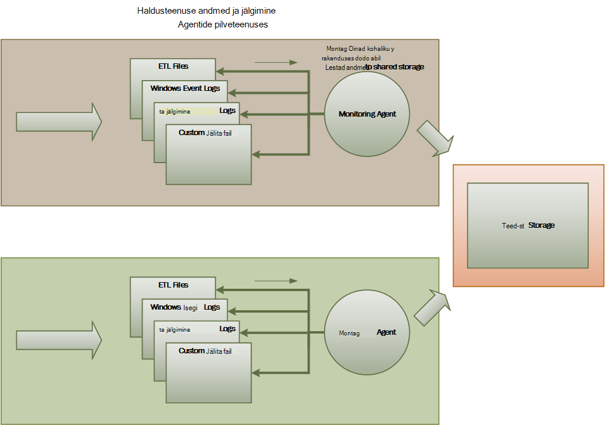
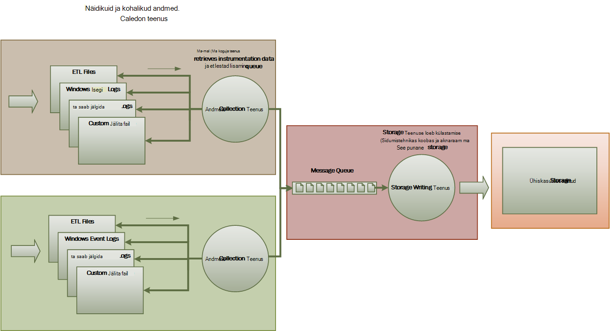
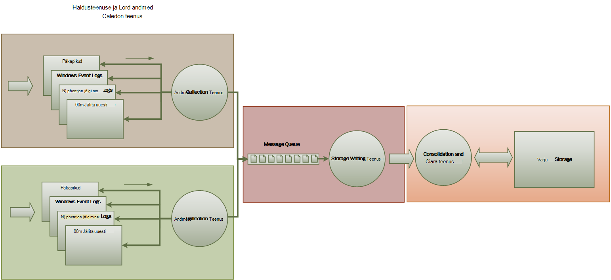

<properties
   pageTitle="Jälgimine ja diagnostika juhised | Microsoft Azure'i"
   description="Head tavad pilveteenuses jaotatud rakenduste jälgimine."
   services=""
   documentationCenter="na"
   authors="dragon119"
   manager="christb"
   editor=""
   tags=""/>

<tags
   ms.service="best-practice"
   ms.devlang="na"
   ms.topic="article"
   ms.tgt_pltfrm="na"
   ms.workload="na"
   ms.date="07/13/2016"
   ms.author="masashin"/>

# <a name="monitoring-and-diagnostics-guidance"></a>Jälgimine ja diagnostika juhised

[AZURE.INCLUDE [pnp-header](../includes/guidance-pnp-header-include.md)]

## <a name="overview"></a>Ülevaade
Jaotatud rakendused ja teenused töötavad pilveteenuses on olemus keerukate tk tarkvara paljudes jooksva moodustavate. Tootmiskeskkonnas, on oluline jälgida soovitud viisil, kus kasutajad kasutada oma süsteemi, Jälita ressursi kasutamine ja üldiselt jälgida seisundi ja teie süsteemi jõudlust. Abil saate seda teavet diagnostika abi avastada ja parandada probleemide ja ka spikker koht võimalike probleemide ja vältida nende tekkimist.

## <a name="monitoring-and-diagnostics-scenarios"></a>Jälgimine ja diagnostika stsenaariumid
Saate jälgida saada ülevaate sellest, kuidas toimib süsteem. On oluline osa kvaliteetse teenuse sihtkohtade haldamine. Levinumad stsenaariumid jälgimisega seotud andmete kogumine on järgmised.

- Tagada, et süsteem oleks terve.
- Jälgimise süsteem ja selle osad kättesaadavus.
- Säilitada, et tagada, et süsteemi läbilaskevõime töö suureneb kogus ootamatult halvendada.
- Tagada, et süsteem vastab teenusetaseme lepinguid (SLAs) loodud klientidega.
- Privaatsust ja turvet süsteemi, kasutajate ja nende andmete kaitsmine.
- Jälgimise toimingud, mis tehakse eesmärgil Auditeerimispoliitika või nõuetele.
- Igapäevane kasutamine süsteem ja trende, mis võivad põhjustada probleeme, kui need on suunatud määrimine jälgimine.
- Probleemid, mis ilmnevad algsest aruandest kuni analüüsi võimalike põhjuste, neid parandada, järgnevad tarkvaravärskendused ja juurutamise jälgimine.
- Toimingute jälitamine ja tarkvara väljalasete silumine.

> [AZURE.NOTE] Selles loendis ei peaks olema terviklik. Selle dokumendi keskendub need stsenaariumid kõige levinum olukorrad läbimiseks jälgimine. Võib olla teised, mis on vähem levinud või on teie keskkonnas.

Järgmistes jaotistes kirjeldatakse neid stsenaariumid üksikasjalikumalt. Teavet iga stsenaariumi puhul on kirjeldatud järgmises vormingus:

1. Stsenaarium lühiülevaade
2. Selle stsenaariumi tüüpilised nõuetele
3. Töötlemata instrumentation andmeid, mis on nõutav stsenaarium ja seda teavet võimalikud allikad
4. Kuidas saab selle toorandmetega analüüsida ja kombineerida, et luua mõtestatud diagnostikateave

## <a name="health-monitoring"></a>Seisundi jälgimine
On terve, kui see on võimalik taotluste ja käivitatud. Seisundi jälgimine eesmärk on praegune seisund süsteemi hetktõmmise loomiseks nii, et saate kontrollida, kas kõik komponendid süsteemi töötavad õigesti.

### <a name="requirements-for-health-monitoring"></a>Nõuded seisundi jälgimine
Tehtemärgi tuleb hoiatada kiiresti (jooksul mõne sekundi) kui mis tahes osa loetakse vigane. Tehtemärk peaks oskama kindlaks teha, milline osa süsteem normaalselt ja millised on probleeme. Süsteemi seisundi saate esile tõstetud liikluse – hele süsteemis:

- Punane vigane (lõpetas süsteem)
- Kollane osaliselt terve (süsteem töötab vähendatud funktsionaalsusega)
- Roheline täiesti terve

Täielik süsteemi seisundi jälgimine võimaldab tehtemärgi süsteemi seisund allsüsteemide ja komponentide oleku vaatamine läbi süvitsi. Näiteks kui üldist süsteemi kujutatud osaliselt terve, tehtemärk peaks oskama suurendada ja määrata, millised funktsioonid pole praegu saadaval.

### <a name="data-sources-instrumentation-and-data-collection-requirements"></a>Andmeallikate, näidikuid ja andmete kogumise nõuded
Lähteandmed, toetama seisundi jälgimine nõutava saab luua tulemusena:

- Kasutaja taotluste täitmine jälgimist. Seda teavet saab kasutada kindlaks teha, millised taotlused õnnestus, ei ole ja kui kaua võtab iga taotluse.
- Sünteetiline kasutaja jälgimine. Selle protsessi jäljendab teostatud kasutaja juhiseid ja järgib eelmääratletud etapisarja. Jäädvustata, iga toimingu tulemuste.
- Logimise erandid, vead ja hoiatused. Selle teabe saate jäädvustata Jälita laused manustatud rakenduse kood, samuti kogutakse teavet sündmuselogide süsteemi viitav teenuste tõttu.
- Mis tahes muu tootja teenused, mis kasutab süsteemi seisundi jälgimine. Selle jälgimise võivad nõuda toomine ja sõelumine seisundi andmed, et nende teenuste pakkumine. See teave võib võtta mitmesuguseid vorminguid.
- Lõpp-punkti jälgimine. See on kirjeldatud jaotises "Kättesaadavus jälgimine" üksikasjalikumalt.
- Kogumise ümbritseva jõudluse teave, näiteks tausta Protsessori kasutuse või tegevuse I/O (sh võrku).

### <a name="analyzing-health-data"></a>Seisundi andmete analüüsimine
Esmane fookus seisundi jälgimine on kiiresti näitab, kas süsteem töötab. Saadaolevad kohe andmete analüüs käivitab teatise kriitilist komponent tuvastamisel nii vigane. (See ei vasta järjestikust sarja ping, näiteks.) Tehtemärk saavad võtta seejärel sobivat meetmed.

Täpsemate süsteemi võivad sõnastikupõhise element, mis sooritavad külm analüüs üle tehtud ja praeguste töökoormus. Külm analüüs saate kohapeal trendide ja määratleda, kas süsteemi tõenäoliselt jääb terve või kas süsteemi on vaja täiendavaid ressursse. See ennustav element põhinema kriitilised jõudluse mõõdikute, näiteks:

- Määra suunatud iga teenuse või põhjalik taotlused.
- Vastuse ajad taotlused.
- Andmed liiguvad ja sealt iga teenuse maht.

Kui mis tahes meetermõõdustik maksumus ületab määratletud lävi, saate süsteemi tõsta teatise lubamiseks ennetavad toimingute tegemiseks vajalik süsteemi seisundi tehtemärk- või autoscaling (kui see on saadaval). Neid toiminguid võib hõlmata lisamise ressursid, üks või mitu teenused, mida on puudumisel või rakendamine pidurdamise alumisel tähtsusega taotlusi taaskäivitada.

## <a name="availability-monitoring"></a>Kättesaadavus jälgimine
Tõeliselt terve süsteemi jaoks on vaja komponendid ja alasüsteemid, mis moodustavad süsteemi on saadaval. Kättesaadavus jälgimise tihedalt seotud seisundi jälgimine. Kuid kohe ülevaate praegune seisund süsteemi seisundi jälgimine näeb, kättesaadavus jälgimine on seotud jälgimine süsteemi ja selle komponentide koostamiseks sees süsteemi kohta.

Mitme Systems teatud komponendid (nt andmebaasi) on konfigureeritud sisseehitatud komponentide lubada kiire Tõrkesiirde raske veana või katkemise korral. Ideaalvariandis mitte pole olulist ilmnenud on selline. Kuid saadavus jälgimise perspektiivi, on vaja koguda nii palju teavet võimalikult sellise põhjuse ja tegevuste nende kordumist vältida tõrkeid.

Andmed, mida on vaja jälgida kättesaadavus võib sõltuda mitmest tegurist madalama taseme. Paljude teguritest võib olla teatud rakenduse, süsteem ja keskkonnas. Tõhusa jälgimise süsteemi sisaldab kättesaadavus andmeid, mis vastab madala teguritest ja seejärel liitmise tal anda süsteemi ülevaadet. Näiteks pood süsteemis business funktsioonid, mis võimaldab kliendi tellimused võib sõltuvad hoidla, kus talletatakse Tellimuse üksikasjad ja makse süsteemi, mis tegeleb rahaliste tehingute maksma need tellimused. Seetõttu on süsteemi-korralduste osa kättesaadavus funktsiooni hoidla ja makse alasüsteemi olemasolu.

### <a name="requirements-for-availability-monitoring"></a>Nõuded kättesaadavus jälgimine
Tehtemärgi tuleks vaadata iga süsteemi ja alamsüsteemi ajalooliste kättesaadavus, ja kasutab seda teavet mis tahes trende, mis võivad põhjustada ühe või mitme allsüsteemide perioodiliselt nurjumise kohapeal. (Tehke teenuste alustada nurjumise teatud ajal päeva, mis vastab tippväärtus töötlemine tundi?)

Jälgimise lahendus peaks andma viivitamatut ja ajalooliste ülevaate kättesaadavus või alasüsteemid puudumist. See peaks olema võimeline kiiresti teavitamine tehtemärgi, kui üks või mitu services fail või kui kasutajad ei saa ühendust teenused. See on iga teenuse jälgimine, vaid ka läbivaatamise iga kasutaja toiminguid, kui need toimingud ei suhelda teenuse proovimisel küsimus. Teatud määral astet ühenduvuse tõrge on tavaline ja võib olla siirdamiseks tõrgete tõttu. Kuid see võib olla kasulik lubada tõsta arvu ühenduvuse määratud alasüsteemi kindla perioodi jooksul toimuvate teatise süsteem.

### <a name="data-sources-instrumentation-and-data-collection-requirements"></a>Andmeallikate, näidikuid ja andmete kogumise nõuded
Koos kohta saate lähteandmed, toetama kättesaadavus jälgimise nõutava loodud tulemusena sünteetiliste kasutaja jälgida ja logida mis tahes erandid, vead ja hoiatused, mis võivad tekkida. Lisaks saab kättesaadavus andmete täita lõpp-punkti jälgimine. Rakenduse saate seada ühe või mitme seisundi lõpp-punktid, iga testimise juurdepääsu süsteemis funktsionaalne ala. Kontroll saate ping iga lõpp-punkti järgides määratletud ajakava ja kogumise tulemused (edu või fail).

Ajalõpud, võrgu ühenduvuse tõrkeid ja ühenduse uuesti katsete tuleb registreerida. Kõik andmed tuleks ajatempliga.

<a name="analyzing-availability-data"></a>
### <a name="analyzing-availability-data"></a>Kättesaadavus andmete analüüsimine
Haldusteenuse andmed tuleb kokku liita ja seotud toetavad analüüsi järgmist tüüpi:

- Süsteem ja allsüsteemide kohe olemasolu.
- Süsteemi ja allsüsteemide määr kättesaadavus tõrge. Ideaalvariandis mitte tehtemärgi peaks oskama teatud tegevuste tõrkeid vastavus: kui süsteemi nurjus toimuva?
- Tõrge määrade süsteemi või mis tahes allsüsteemide kõigis ajalooliste vaate määratud perioodi ja laadi süsteemi (kasutaja taotluste, näiteks arv) kui ilmnes tõrge.
- Süsteemi või mis tahes allsüsteemide puudumist põhjused. Näiteks, millistel põhjustel võib olla teenus ei tööta ühendus katkes, ühendatud, kuid ajastus välja ja ühendatud, kuid tagasi vead.

Saate arvutada protsent kättesaadavus teenuse aja jooksul, kasutades järgmist valemit:

```
%Availability =  ((Total Time – Total Downtime) / Total Time ) * 100
```

See on kasulik SLA eesmärgil. ([SLA jälgimine](#SLA-monitoring) on kirjeldatud allpool kirjeldatud juhised.) _Tööseisakute_ määratlus sõltub teenuse. Näiteks Visual Studio meeskonnatöö koostada teenus määratleb tööseisakute (kokku akumuleeritud minutit) perioodi jooksul koostada teenus pole saadaval. Minutiks käsitletakse pole saadaval, kui kõik pidev HTTP päringuid koostada teenusega kogu minutid kliendi algatatud toimingute tegemiseks või tõrkekood tulemuseks ei tagasta vastuse.

## <a name="performance-monitoring"></a>Jõudluse jälgimine
Kui süsteemi alla rohkem ja rohkem (suurendades maht kasutajad), andmekomplektide, mis nende kasutajate juurdepääs kasvab suurust ning muutub suurem rikkumine ühe või mitu võimalust. Sageli eelneb komponendi tõrge jõudluse vähenemine. Kui te ei saa tuvastada vähenemine, saate teha olukorra aktiivne toiminguid.

Süsteemi jõudluse sõltub mitmest tegurist. Iga tegur on tavaliselt mõõta läbi juhtimismõõdikute (KPI-d), nagu andmebaasitoiminguid sekundis arv või maht võrgu taotlusi, mis on edukalt teenindatud määratud aja jooksul. Mõned nende KPI-d võidakse konkreetsete tulemuslikkuse Mõõdud, nagu teised võivad saadud kombinatsiooni mõõdikute põhjal.

> [AZURE.NOTE] Halb või hea jõudlus määratlemine jaoks on vaja mõista, kus süsteemi peaks saama töötab tasemel. Selleks, et jälgida süsteemi ajal tüüpiline koormuse toimib ja andmehõive jaoks iga KPI aja jooksul. See võib hõlmata töötab süsteemi jäljendatud koormuse testimiskeskkonnas ja õigete andmete kogumine enne juurutamist tootmiskeskkonnas süsteem.

> Te peate tagama, et jälgimine jõudluse huvides mitte koormata süsteem. Võib-olla võimalik dünaamiliselt kohandada üksikasjataseme jõudluse kontrollimise protsessi kogutakse andmete jaoks.

### <a name="requirements-for-performance-monitoring"></a>Nõuded jõudluse jälgimine
Süsteemi jõudluse tutvuda tehtemärgi tavaliselt vajab täpsemat teavet, mis sisaldab järgmist.

- Kasutaja taotlused vanemad.
- Kasutaja samaaegseid taotlusi arv.
- Maht võrguliiklust.
- Millised Business tehingud täidetakse määra.
- Keskmine töötlemise ajal taotlused.

See võib olla kasulik pakuvad tööriistu, mis võimaldavad tehtemärgi abil koht korrelatsiooni, näiteks:

- Nende kasutajate arv, samaaegseid võrreldes taotluse latentsus aegade (kui kaua võtab alustamiseks pärast saatmist kasutaja päringut).
- Nende kasutajate arv, samaaegseid võrreldes Keskmine vastuse aeg (palju aega kulub taotluse pärast selle käivitas processing).
- Taotluste töötlemise vigade arvu ja maht.

See otstarbekas üksikasjalik teave, koos tehtemärgi tuleks hankida süsteemi jõudluse iga komponendi üksikasjalik vaade. Andmed on esitatud tavaliselt madala jõudluse väidab, et jälgida andmeid nagu kaudu.

- Mälu kasutamine.
- Teemade arv.
- CPU töötlemise ajal.
- Koosolekukutse järjekorra pikkus.
- Ketas või võrgu I/O määra ja tõrkeid.
- Kirjutada ja lugeda baitide arv.
- Vahevara näidikud, nt järjekorra pikkus.

Kõik visualiseeringud tuleks lubada tehtemärgi määramiseks aja jooksul. Kuvatavate andmete võib olla hetktõmmise olukorra ja/või ajalooliste vaate jõudlus.

Tehtemärgi peaksid saama teatise põhineva mis tahes jõudluse määratud väärtuse eest, mis tahes teatud ajavahemiku jooksul tõsta.

### <a name="data-sources-instrumentation-and-data-collection-requirements"></a>Andmeallikate, näidikuid ja andmete kogumise nõuded
Võite üksikasjalik jõudlusandmeid (läbilaskevõime, samaaegseid kasutajate arv, tehingud, vigade ja jne) koguda jälgides kasutajate jälgida, kui nad saabuvad ja läbida süsteem. See hõlmab sisaldavad jälgimise aruandes rakenduse koodi, ajastuse standardteave põhilistest punktidest. Vead, erandid ja hoiatused peaks jäädvustatud piisavalt andmeid tõestusmeetodid neid taotlusi nende põhjused. Internet Information Services (IIS) Logi on kasulik muust allikast.

Võimaluse korral tuleks ka jäädvustada jõudlusandmeid välised süsteemid, mis kasutab rakenduse jaoks. Need välised süsteemid võib esitada oma jõudluse hinnale või muude funktsioonide taotlemise jõudlusandmeid. Kui see pole võimalik, kirje teavet, nt alguskellaaeg ja lõppkellaaeg välise süsteemiga, toimingu olekut (edu, fail või Hoiatus) koos iga taotlustest. Näiteks saate kasutada aja taotlused lähenemisviisi Stopper: käivitamine on timer taotluse käivitamisel ja seejärel Peata taotluse lõpulejõudmisel.

Üksikute osade süsteemis madala jõudluse andmeid ei pruugi olla saadaval funktsioone ja teenuseid, nt Windowsi jõudlus hinnale ja Azure diagnostika kaudu.

### <a name="analyzing-performance-data"></a>Jõudluse andmete analüüsimine
Palju analysis töö koosneb liitmise jõudlusandmeid kasutaja taotluse tüüp ja/või või sellega teenus, mis saadetakse iga taotluse alusel. Näide kasutaja taotluse üksuse lisamine ostukorvi või läbimiseks vormistada süsteemi pood.

Teine levinud nõue on valitud protsentiilid jõudluse andmete kokkuvõttev sõnum. Näiteks võib tehtemärgi määratleda vastuse kellaajad 99% taotlusi, 95% taotluste ja taotlusi 70%. Võib olla SLA sihtkohtade või muud eesmärgid määratud iga protsentiili. Poolelioleva tulemused tuleb teatada peaaegu reaalajas aitab tuvastada kohe probleeme. Tulemused summeeritakse ka pikema ajavahemiku statistiline.

Latentsus jõudlust mõjutavad probleemide korral tehtemärgi peaks oskama kiiresti tuvastada põhjus kitsaskohaks uurides iga toimingut, mis sooritavad iga taotluse latentsus. Tulemustega seotud andmete peab seetõttu võimaldavad Osundamisi jõudluse mõõdud iga etapi siduda konkreetse.

Sõltuvalt visualiseeringu nõuetele, võib olla kasulik, luua ja talletada andmeid kuup, mis sisaldab soovitud toorandmetega vaateid. Kuubi andmete võimaldavad sihtotstarbelise keerukate päringute ja andmete jõudluse analüüs.

## <a name="security-monitoring"></a>Turvalisus jälgimine
Kõik trükikojas süsteemid, mis sisaldavad tundlikku teavet rakendama turvalisus struktuuri. Turvalisus süsteemi keerukus on tavaliselt funktsiooni tundlikkuse andmed. Süsteemi, mis nõuab kasutajad autentida, tuleks kirje:

- Kõik sisselogimise katsete, kas nad ei suuda või õnnestub.
- Kaudu--kõiki toiminguid ja ressursid kõigi üksikasjade korrad--autenditud kasutaja.
- Kui kasutaja on seanss ja logib.

Jälgimine võib olla võimalik, et aidata tuvastada süsteemi eest. Näiteks võib suure hulga nurjunud katsete näidata brute-Jõusta rünnak. Mõne ootamatu taotlusi võib olla jaotatud eitamine service (DDoS) rünnak tulemus. Peate olema valmis jälgida kõiki taotlusi sõltumata sellest, taotlused kõigile ressurssidele. Süsteem, mis on sisselogimise haavatavuse võib kogemata jätke ressursid muu maailma kasutaja tegelikult sisse logida ilma.

### <a name="requirements-for-security-monitoring"></a>Nõuded turvalisuse jälgimine
Kõige tähtsamate aspektide turvalisus jälgimine tuleks lubada tehtemärgi abil kiiresti.

- Leia proovitud sissemurdmisest autentimata üksus.
- Tuvastage katsete üksused andmed, mille nad pole antud juurdepääs toiminguid.
- Kindlaks teha, kas süsteemi või mõne osa, on rünnaku väljas või sees. (Nt pahatahtlik autenditud kasutaja võib olla üritades tooks süsteemi alla.)

Nende nõuete toetamiseks teavitatakse tehtemärgi:

- Kui ühe konto teeb korduvate nurjus sisselogimise katsete määratud aja jooksul.
- Kui üks autenditud konto korduvalt proovib juurdepääs keelatud ressursi määratud aja jooksul.
- Kui suure hulga autentimata või volitamata taotlusi tekkida määratud aja jooksul.

Teavet, mis on operaatoriga peaks sisaldama iga taotlus allika hosti aadress. Kui turvalisus rikkumised tulenevad regulaarselt kindla lahtrivahemiku aadressid, võib olla blokeeritud nende hosts.

Võtme osa süsteemi turvalisuse säilitamise on võimalik kiiresti tuvastada toiminguid, mis tavalise muster erineda. Nurjunud ja/või eduka sisselogimise taotluste arv näiteks järgmist teavet saab kuvada visuaalselt tuvastada, kas on kühvli tegevuse ebatavalised ajal abil. (See tegevus on näiteks kasutajad sisse logida veebilehel 3:00 AM ja läbimiseks suure hulga toimingute käivitamisel oma tööpäeva kell 9:00). Seda teavet saate kasutada ka ajapõhiste autoscaling konfigureerida. Näiteks kui tehtemärgi märgib, et teatud ajal päeva sisselogimine suure hulga kasutajate regulaarselt tehtemärk korraldada alustamiseks täiendavad autentimisteenuste töö, ja seejärel sulgege need täiendavad teenused tipp on möödas.

### <a name="data-sources-instrumentation-and-data-collection-requirements"></a>Andmeallikate, näidikuid ja andmete kogumise nõuded
Turvalisus on kõige hajutatud süsteemide kõike osa. Asjakohaste andmete tõenäoliselt genereerida mitme punkti kogu süsteem. Kaaluge Turbeteave ja sündmuse Management (SIEM) lähenemisviisi koguda turvalisusega seotud andmeid, mis tuleneb sündmuste tõstatatud rakendus, võrguseadmed, serverid, tulemüürid, viirusetõrjetarkvara ja muude elementide sissetungimise vältimine.

Turvalisus jälgimine saate lisada tööriistu, mis ei kuulu teie rakenduse andmeid. Nende tööriistade saate kaasata Utiliidid, mis port skannimine tegevuste välise asutused või võrgu filtrid, mis tuvasta katsete autentimata pääsete oma rakenduste ja andmete tuvastamine.

Igal juhul tuleb kogutud andmete lubada ründeoht laadi ja võtta asjakohaseid vastumeetmeid administraator.

### <a name="analyzing-security-data"></a>Turvalisus andmete analüüsimine
Turvalisus jälgimise funktsioon on funktsiooni erinevatest allikatest andmeid tekib. Erinevate vormingud ja detailsuse sageli vaja keerukate siduda see koos ühtse sõnumilõime teabe jäädvustatud andmete analüüs. Lihtsaim juhtudel (nt suure hulga nurjunud sisselogimist või korduvad katsed volitamata juurdepääsu kriitilise ressursside tuvastamine), Lisaks ei pruugi olla võimalik keerukas turvalisus andmete automatiseeritud töötlemine. Selle asemel võib olla eelistada kirjutamine andmed, kuid muidu algversiooni turvaline hoidlasse lubamiseks expert käsitsi analüüsi ajatempliga.

<a name="SLA-monitoring"></a>

## <a name="sla-monitoring"></a>SLA jälgimine
Paljud trükikojas süsteemid, mis toetavad pöörates klientidele garantiid süsteemi jõudluse kohta SLAs kujul. Sisuliselt SLAs märkida, et süsteemi saavad hakkama määratletud mahus töö kokkulepitud ajavahemiku jooksul ja kriitilist teavet kaotamata. SLA jälgimine on seotud et süsteemi saate vastavad mõõta SLAs.

> [AZURE.NOTE] SLA jälgimise tihedalt seotud jõudluse jälgimine. Kuid jälgige jõudlust on seotud tagada, et selle süsteemi funktsioonide _optimaalselt_, SLA jälgimise reguleerib lepinguga kohustusi, mis määratleb, milliseid _optimaalselt_ tegelikult tähendab.

SLAs on sageli määratletud seoses:

- Üldine süsteemi-saadavus. Näiteks võib ettevõtte tagada, et süsteemi saab 99,9% ajast. Vastab rohkem kui 9 tundi tööseisakute aastas või ligikaudu 10 minutit nädalas.
- Funktsionaalseid jõudlus. See on sageli väljendatud hinnaks dollarites ühe või mitme kõrge - vee märgid, näiteks süsteemi toetada kuni 100 000 kasutaja samaaegseid taotlusi või toime 10 000 samaaegseid tehingud.
- Funktsionaalseid aega. Süsteemi võib ka garantiid, millega töötlemise taotlusi määra. Näide on, et kõik tehingud 99% on valmis kahe sekundi ja pole ühe toimingu kauem kui 10 sekundit.

> [AZURE.NOTE] Mõned lepingud trükikojas süsteemid võivad SLAs klienditoe poole. Näide on, et kõik kasutajatoe taotlused on panna vastuse 5 minuti jooksul ja et 99% kõiki probleeme käsitletakse täielikult 1 tööpäeva jooksul. Efektiivse [probleemijälitus](#issue-tracking) (selles jaotises kirjeldatud allpool) on koosoleku SLAs, nagu need.

### <a name="requirements-for-sla-monitoring"></a>Nõuded SLA jälgimine
Kõige kõrgemal tasemel tehtemärgi peaks oskama hetkega kindlaks teha, kas süsteemi on koosoleku kokkulepitud SLAs või mitte. Ja kui tehtemärk peaks ei saa süvitsi alla ja uurida aluseks tegurite määratlemiseks mittevastavate jõudluse põhjused.

Tüüpilised üksikasjalik näidikud, et visuaalselt kujutatud järgmised.

- Protsent teenuse sees.
- Rakenduse läbilaskevõime (mõõdetuna õnnestunud tehingute ja/või toimingute sekundis).
- Eduka/probleemse rakenduse taotluste arv.
- Rakenduse ja vead, erandid ja hoiatuste arv.

Kõigi nende näitajate peaks saama on filtreeritud määratud aja jooksul.

Pilveteenuse rakenduse hõlmab tõenäoliselt arvu valveseadmete komponendid. Tehtemärgi peaks oskama valida üksikasjalik sümbol ja vaadata, kuidas see peamine osa tervise koosneb. Näiteks kui üldise süsteemi sees langeb lubatud väärtus allapoole, tehtemärgi peaks oskama suurendada ja määrata, millised elemendid toetavad selle tõrke.

> [AZURE.NOTE] Süsteemi sees peab olema määratud hoolikalt. Koondamise kasutavas maksimaalse kättesaadavuse tagamiseks süsteemis üksikud eksemplarid elemente, võib nurjuda, kuid süsteemi võib jääda otstarbekas. Esitatud seisundi jälgimine süsteemi sees peaks sisaldama iga elemendi liitväärtuse sees ja ei pruugi olla, kas süsteem on tegelikult peatada. Lisaks tõrkeid olema eraldatud. Nii isegi juhul, kui konkreetset pole saadaval, ülejäänud süsteemi võib jääda saadaval, kuigi vähenemine funktsioonidega. (Pood süsteemis süsteemi tõrke võivad takistada kliendi tellimuste, kuid klient võib olla võimalik, et sirvida tootekataloogi.)

Jaoks teavitamine eesmärgil, tuleks süsteemi tõsta sündmuse kui mis tahes üksikasjalik näidikud määratud piiri. Koostage üksikasjalik indikaator erinevaid tegureid madalama taseme üksikasju tuleks infoturbeküsimustes süsteemile kontekstipõhine andmetena.

### <a name="data-sources-instrumentation-and-data-collection-requirements"></a>Andmeallikate, näidikuid ja andmete kogumise nõuded
Lähteandmed, toetama SLA jälgimise nõutava sarnaneb lähteandmed, täitmise jälgimine koos aspektide seisundi ja-saadavus järelevalvet nõutava. (Vt Lisateavet nende jaotiste.) Saate oma andmete:

- Läbimiseks lõpp-punkti jälgimine.
- Logimise erandid, vead ja hoiatused.
- Kasutaja taotluste täitmine jälgimist.
- Mis tahes muu tootja teenused, mida süsteem kasutab kättesaadavus jälgimine.
- Jõudluse mõõdikute ja hinnale abil.

Kõik andmed peavad ajastatud ja ajatempliga.

### <a name="analyzing-sla-data"></a>SLA andmete analüüsimine
Pildi üldise jõudluse süsteemi loomiseks tuleb liita instrumentation andmed. Kokkuvõtlike andmete peab toetama ka süvitsimineku lubamiseks näitajate aluseks allsüsteemide uurimine. Näiteks peaks olema võimalik:

- Kasutaja taotlused koguarvu arvutada määratud aja jooksul ja määrata kindlaks taotlused edu ja tõrge.
- Vastuse korda kasutaja taotluste süsteemi vastamise aeg ülevaate loomiseks ühendada.
- Analüüsi kasutaja jälgida üldine vastus aega taotluse vastuse korda üksikute üksuste taotluse sisse murda.  
- Kindla ajavahemiku tuleb määrata süsteemi üldine kättesaadavus protsendina sees.
- Analüüsimine protsent aja kättesaadavus üksikute osade ja teenuste süsteemi. See võib hõlmata sõelumine logid, mis on loodud muu tootja teenused.

Paljud trükikojas süsteemid peavad aruande real tulemuslikkuse numbritega kokkulepitud SLAs määratud perioodi, tavaliselt kuu. Selle teabe saab arvutada krediidi või muud tüüpi tagasimakseid klientide kui SLAs pole täidetud selle aja jooksul. Tehnika, mis on kirjeldatud jaotises [analüüsitakse kättesaadavus andmete](#analyzing-availability-data)abil saate arvutada teenuse kättesaadavus.

Korral võib ettevõtte jälgida ka arvu ja laadi juhtumite, mis põhjustas teenuste nurjumise. Õppida, kuidas neid probleeme lahendada kiiresti või kõrvaldada täielikult, aitab vähendada tööseisakute ja vasta SLAs.

## <a name="auditing"></a>Auditi
Sõltuvalt rakenduse, võib olla määratud auditeerimine kasutajate toimingute ja salvestamise kõik andmepääsu kohustuslike või õigusaktid. Auditi saate tõendada selle lingid klientide taotlusi. Mitte-lepingu rikkumine on oluline, palju e-äri süsteemides säilitamiseks usalda kliendi ja ettevõte, mis on rakenduse või teenuse eest vastutav vahel.

### <a name="requirements-for-auditing"></a>Auditi nõuded
Analüütik peab olema võimalus jälgida business toimingute kohta, mida kasutajad tegelevad, et te saate taastada kasutajate toimingute jada. See võib olla vajalik, kui lihtsalt kirje või kohtuekspertiisi juurdlus osana.

Auditilogi teave on väga tundlik. Seda tõenäoliselt sisaldab andmeid, mis tuvastab süsteemi, ja ülesanded, mida nad on läbimiseks kasutajate. Seetõttu auditilogi teabe tõenäoliselt vormis aruandeid, mis on saadaval ainult usaldusväärsete ärianalüütikud asemel interaktiivne süsteem, mis toetab süvitsimineku graafiline toimingud. Analüütik tuleks luua mitmesuguseid aruandeid. Näiteks võib aruannete loendi kõigi kasutajate tegevuste ajal määratud aja jooksul, üksikasjalikult kronoloogiline ülevaade, ühe kasutaja tegevuse või loendis järjestus toimingute eest, mis ühe või mitme ressursid.

### <a name="data-sources-instrumentation-and-data-collection-requirements"></a>Andmeallikate, näidikuid ja andmete kogumise nõuded
Esmane andmeallikate teabe kontrollimine võib sisaldada.

- Kasutaja autentimise haldava süsteemi turvalisus.
- Saate jälitada logid, et salvestada kasutaja tegevus.
- Kõik tuvastamist võimaldav ja käsitamatute võrgu taotlusi jälgida Security logisid.

Auditiandmete ja talletamise, kus vormingu võib juhtida regulatiivsetele nõuetele. Näiteks ei pruugi olla võimalik puhastada andmeid, mis tahes viisil. (See peab olema registreeritud algvormingus.) Accessi toimumiskoha hoidlasse peavad olema kaitstud välistamiseks.

### <a name="analyzing-audit-data"></a>Auditilogi andmete analüüsimine
Analüütik peab olema toorandmetega tervikuna algversiooni juurde pääseda. Peale selle nõude levinud auditilogi aruannete loomiseks, tööriistad andmete analüüsimiseks tõenäoliselt spetsialiseerunud ja hoida välise süsteemiga.

## <a name="usage-monitoring"></a>Kasutus jälgimine
Kasutus jälgimise jälitab funktsioone ja komponentide rakenduse kasutamise. Operaator saab kasutada kogutud andmed:

- Kindlaks teha, millised funktsioonid on suur koormus ja kõik võimalikud pääsupunktidega süsteemi kindlaks teha. Veebiaadresside elementide võib kasu otstarbekas eraldamine või isegi kopeerimise Laadi veel ühtlaselt. Tehtemärgi kasutada ka seda teavet teada, millised funktsioonid kasutatakse harva ja on võimalik leviloendite või asendamine tulevase versiooni süsteem.
- Tavaline kasutamise süsteemi funktsionaalseid sündmuste kohta teabe saamiseks. Näiteks pood saidil, saate salvestada statistika teavet tehingute arv ja klientidele, kes vastutab nende mahtu. Seda teavet saate kasutada võimsuse planeerimine klientide arv kasvab.
- Leia (võib-olla kaudselt) kasutajate rahulolu tagamiseks jõudluse või süsteemi funktsioone. Näiteks kui suure hulga klientide pood süsteemi regulaarselt loobuda oma ostukärud, see võib olla tõttu väljamöllimine funktsioonid.
- Luua arveldusteabe. Trükikojas rakenduse või teenuse rentnikuga võivad nõuda klientide ressursid, et nad kasutavad.
- Jõusta piirmäärasid. Kui kasutaja rentnikuga süsteemis ületab nende töötlemise ajal või ressursi kasutamine määratud perioodi jooksul makstud piirmäära, nende access võib olla piiratud või töötlemine saate rakendus.

### <a name="requirements-for-usage-monitoring"></a>Nõuded kasutuse jälgimine
Süsteemi kasutus tutvuda tehtemärgi tavaliselt vajab täpsemat teavet, mis sisaldab järgmist.

- On töödelda alasüsteemid ja suunatakse iga ressursi taotluste arvu.
- Iga kasutaja sooritav töö.
- Andmete talletamine, mis kirjeldab iga kasutaja asukohta maht.
- Ressursid, et igal kasutajal on juurdepääs.

Tehtemärgi tuleks luua diagrammid. Näiteks graafiku võib kuvada kõige ressursi näljane kasutajad, või kõige sagedamini juurde ressursid või süsteemi funktsioone.

### <a name="data-sources-instrumentation-and-data-collection-requirements"></a>Andmeallikate, näidikuid ja andmete kogumise nõuded
Kasutus jälgimise saab teha üsna kõrge. Saate Pange tähele, algus- ja lõpuaegade iga taotluse ja laad taotluse (lugemine, kirjutamine ja muudeks tegevusteks sõltuvalt kõnealuse ressursi). Saate hankida selle teabe alusel:

- Kasutaja tegevuse jälgimine.
- Hõivamine jõudluse väidab, et iga ressursi kasutamine mõõta.
- Ressursside tarbimine iga kasutaja jälgimine.

Mõõtmine eesmärgil, samuti peate saama tuvastada, millistel kasutajatel on tegemise, milliseid toiminguid ja ressursse, mis kasutavad järgmisi toiminguid. Kogutud teave peaks olema täpne arveldamine piisavalt üksikasjalikke.

<a name="issue-tracking"></a>
## <a name="issue-tracking"></a>Probleemijälgimine
Klientide ja teiste kasutajate võib teatada probleemidest, kui süsteemis esineb ootamatuid sündmusi või käitumine. Probleemijälituse on seotud järgmiste probleemide haldamine, kaasates neid püüete süsteemi aluseks probleemide lahendamiseks ja võimalikud lahendused klientide teavitamine.

### <a name="requirements-for-issue-tracking"></a>Nõuded probleemijälituse
Tehtemärkide sageli teha probleemijälituse eraldi süsteem, mis võimaldab neid kirje ja aruande probleemide üksikasjad abil kasutajad aruande. Need andmed võivad sisaldada kasutaja üritab teha, sümptomid probleem, sündmuste, ja mis tahes tõrge või hoiatusteated, mis on antud tööülesandeid.

### <a name="data-sources-instrumentation-and-data-collection-requirements"></a>Andmeallikate, näidikuid ja andmete kogumise nõuded
Küsimuste jälgimise andmete algse andmeallikas on teatatud probleemi kõigepealt kasutaja. Kasutaja võib olla võimalus sisestage täiendavad andmed näiteks:

- Krahh dump (kui rakendus sisaldab osa, mis töötab kasutaja töölaua).
- Kuva hetktõmmise.
- Kuupäev ja kellaaeg, millal viga, nt kasutaja asukoha keskkonna teabe.

Selle teabe saab aidata silumine peegeldav ja aidata ehitada mahajäämus tarkvara tulevaste väljalasete jaoks.

### <a name="analyzing-issue-tracking-data"></a>Küsimuste jälgimise andmete analüüsimine
Erinevate kasutajate võib aruande sama probleem. Küsimuste jälgimise süsteemi tuleks seostada levinud aruandeid.

Edenemise silumine peegeldav allalaaditavate iga probleemi aruande suhtes. Kui probleem on lahendatud, saate kliendi teavitatakse lahendus.

Kui kasutaja aruannete probleemi, mis on tuntud lahenduse küsimuste jälgimise süsteemi, peaks olema tehtemärk lahendus kasutaja teavitamiseks kohe.

## <a name="tracing-operations-and-debugging-software-releases"></a>Toimingute jälitamine ja tarkvara väljalasete silumine
Kui kasutaja aruannete probleeme, on sageli ainult kasutaja teadlik otsesem mõju, mis on nende toiminguid. Kasutaja saab ainult aru oma tulemuste tehtemärgi, kes vastutab säilitada süsteem. Need funktsioonid on tavaliselt lihtsalt nähtavate sümptom olulise probleeme. Paljudel juhtudel peate analüütik minna kronoloogiline ülevaade, luua probleemi põhjuseks aluseks toimingute kaudu. Seda nimetatakse _root põhjustada analüüsi_.

> [AZURE.NOTE] Algpõhjuse analüüsi võite avastada ebatõhususi rakenduse kujundus. Sel juhul võib olla võimalik töödelda probleemse elemente ja juurutada need järgmises versioonis osana. Selle protsessi nõuab hoolikas kontroll ja jälgida värskendatud komponendid.

### <a name="requirements-for-tracing-and-debugging"></a>Nõuded jälgimine ja silumine
Jälgimise ootamatud sündmused ja muud probleemid, on oluline, et andmed annab piisavalt teavet lubada analüütik jälgida naasmiseks päritolu järgmiste probleemide ja sündmuste toimunud taastada. See teave peab olema piisav analüütik diagnoosida root põhjustada probleeme. Arendaja saab seejärel korduv vältimiseks vajalikud muudatused teha.

### <a name="data-sources-instrumentation-and-data-collection-requirements"></a>Andmeallikate, näidikuid ja andmete kogumise nõuded
Tõrkeotsingu kaasata kõik meetodid (ja nende parameetrid) kasutada luua puu, mis kujutab loogilise voo süsteemi kaudu, kui teatud taotleb kliendi toimingu käigus jälgimine. Erandid ja hoiatused, mis on süsteemi genereeritud tulemusena see vool vaja registreerimise ning sisse loginud.

Toetama silumine, saate süsteemi sisestada konksud, mis võimaldavad tehtemärgi jäädvustada olekus oluline teave süsteem. Või süsteemi suudab valitud toimingute edenemise üksikasjalike üksikasjaliku teabe. Hõivamiseks andmete detailsuse tase saab määrata ka lisakoormust süsteemi ja peaks olema ajutine protsess. Korraldaja kasutab seda toimingut peamiselt väga ebatavalised sarja sündmuste ilmneb ja on raske ise või uue versiooni ühte või mitut süsteemi jaoks on vaja hoolikalt jälgida, tagamaks, et funktsiooni elementide ootuspäraselt.

## <a name="the-monitoring-and-diagnostics-pipeline"></a>Müügivõimaluste jälgimine ja diagnostika
Suuremahuliste jaotatud süsteemi kujutab keeruline ülesanne. Iga eelmises jaotises kirjeldatud juhtudel ei pruugi olla kaaluda eraldi. On tõenäoliselt märgatavat kattumise iga olukorra jaoks nõutava järelevalve ja andmeid, kuigi andmed peate olema töödeldud ja esitatud erineval viisil. Nende huvides võtke diagnostika- ja tervikliku ülevaate.

Müügivõimaluste, mis on näidatud joonisel 1 etappi nimega saab kavandada kogu jälgimine ja diagnostika protsess.


_Joonis 1. Diagnostika- ja tulemas etapid_

Joonis 1 tõstab esile, kuidas diagnostika-ja andmed võivad pärineda mitmesuguste andmeallikatega. Näidikuid ja saidikogumi etappide on seotud allika kaudu, kui andmed on vaja jäädvustata, kindlaks teha, milliseid andmeid jäädvustada, kuidas jäädvustada seda ja kuidas seda andmete vormindamiseks nii, et see saab hõlpsasti kontrollida. Analüüsi/diagnostika esitusala võtab töötlemata andmete ja kasutab seda luua mõtestatud andmeid, mille korraldaja abil saate määratleda süsteemi seisund. Tehtemärk saate kasutada seda teavet võimalike toimingute kohta otsuste tegemiseks ja seejärel siseneda tulemused tagasi näidikuid ja saidikogumi etapid. Visualiseeringu/teavitamine etapi etapp kajastab tarbitavad süsteemi olek. Ta saab kuvada teavet peaaegu reaalajas sarja armatuurlaudade abil. Ja see saate luua aruandeid, diagrammid ja diagrammide andmeid, mis võib aidata leida pikaajalisi trende ajalooliste vaade. Kui teave näitab, et KPI tõenäoliselt ületab lubatud piirid, käivitab selle etapi teatise operaatoriga. Mõnel juhul teatise saate kasutada ka automatiseeritud protsess, mis avaldab, nt autoscaling tegevuste käivitamiseks.

Pange tähele, et neid juhiseid moodustavad pidev flow protsessi, kus samal ajal juhtub etapid. Ideaalvariandis mitte etappide peaks olema dünaamiliselt konfigureeritav. Mõned punktid, eriti siis, kui äsja juurutatud või on probleeme, tuleb kogumiseks laiendatud sagedamini. Muul ajal peaks olema võimalik taastamiseks hõivamine base taseme oluline teave, kinnitamaks, et süsteem töötab korralikult.

Lisaks jälgimise kogu protsessi tuleks kaaluda reaalajas, poolelioleva lahenduse, mis kehtib täpsustamine ja tagasiside tulemusena täiustused. Näiteks võite alustada mõõte palju tegureid süsteemi seisundi määratlemiseks. Analüüsi aja jooksul võidakse mõnda Piiritle hüljata Mõõdud, mis pole oluline, mistõttu saate täpsemalt keskenduda andmed, mida vajate ajal taustamüra vähendada.

## <a name="sources-of-monitoring-and-diagnostic-data"></a>Järelevalve ja andmeallikad
Teavet, mis kasutab jälgimise protsess võib pärineda mitmest allikast, nagu on näidatud joonisel 1. Rakenduse tasandil teave pärineb Jälita logid süsteemi koodi lisada. Arendajate peaksite järgima standard lähenemine jälgimise voo juhtelemendi kaudu oma koodi. Näiteks kirje meetodi abil kuvada Jälita teade, mis määrab nime meetodit, praeguse kellaaja väärtuse iga parameetri ja muud vajalikud andmed. Sisenemis- ja kellaaegu salvestamise võib ka vajalikuks osutuda.

Peaksite Logi kõiki erandid ja hoiatused ja veenduge, et teile jääb täielik Jälita iga pesastatud erandid ja hoiatuste. Ideaalvariandis mitte peaks ka jäädvustada andmeid, mis töötab koodi, tegevuse korrelatsiooni standardteave (jälgimiseks taotlused nagu nad läbida süsteem) kasutaja. Ja logite volitamata juurdepääsu kõik ressursid, nt teatejärjekordi, andmebaaside, failide ja muude sõltuvad teenused. Seda teavet saate kasutada Mõõtmine ja kontrollimise eesmärgil.

Paljud rakendused teha ning raamistiku teekide abil teha levinud toiminguid nagu juurdepääs andmete poe või võrgu kaudu suhtlemiseks. Nende raamistik võib olla konfigureeritav anda oma Jälita sõnumeid ja töötlemata diagnostikateave, nt tehingu hinnad ja andmete edastamine teatud omadustega elementide ja ebaõnnestumist.

> [AZURE.NOTE] Mitme kaasaegse raamistiku automaatselt avaldada jõudlus ja Jälita sündmused. Selle teabe talletamiseks on lihtsalt küsimus on abil tuua ja hoidke seda, kui seda saab töödelda ja analüüsida.

Kui rakendus töötab operatsioonisüsteem võib olla madala kogu süsteemi teave, näiteks jõudluse väidab, et näidata I/O määr, mälu kasutamine ja CPU allikas. Esitada võib ka operatsioonisüsteemi tõrgete (nt faili avada õigesti jätmine).

Peaksite kaaluma aluseks oleva taristu ja töötab teie süsteemi komponendid. Virtuaalmasinates, virtuaalne võrkude ja salvestusruumi teenuste kõik võib muude Diagnostikaandmete ja allikate olulised taristu taseme jõudluse hinnale.

Kui teie rakendus kasutab muud välisteenused, nt veebiserverisse või andmebaasi haldamise süsteem, võivad nende teenuste avaldada oma Jälita teabe, logid ja jõudluse hinnale. Näiteks SQL serveri dünaamilise halduse vaadete SQL serveri andmebaasis tehtud toimingute jälgimiseks ja IIS-i Jälita logib salvestamine veebiserverisse taotlused.

Kui süsteemi komponendid on muudetud ja uus versioon on juurutatud, on oluline saama atribuut probleemid, sündmused ja mõõdikute iga versiooni. See teave peaks olema seotud tagasi väljaanne müügivõimaluste nii, et teatud versiooni komponent probleemid saate kiiresti jälitatud ja parandada.

Turvalisus probleemid võivad ilmneda mis tahes hetkel süsteem. Näiteks võib kasutaja proovige sisse logida mõne sobimatu kasutajanimi või parool. Autenditud kasutaja proovida saada volitamata juurdepääsu ressursile. Või kasutaja võib vigane või aegunud võti krüptitud teabele juurde. Turvalisusega seotud teabe jätmine ja eduka taotlusi alati olema sisse logitud.

[Rakenduse Instrumenting](#instrumenting-an-application) jaotis sisaldab rohkem teavet, mis teil peaks jäädvustada juhiseid. Kuid erinevaid strateegiaid abil saate selle teabe kogumine.

- **Rakenduse/süsteemi jälgimine**. Seda kasutatakse sisemise allikate rakenduse, rakenduse raamistik, operatsioonisüsteemi ja infrastruktuuri. Rakenduse koodi saate luua oma kliendi taotluse elutsükli ajal andmete olulised punktid jälgida. Rakenduse saate lisada jälgimine laused, mis võivad valikuliselt lubatud või keelatud, kuna asjaolude. See võib olla võimalik sisestab diagnostika dünaamiliselt diagnostika raamistiku abil. Tavaliselt pakuvad need raamistiku lisandmoodulite, mida saab seostada erinevate instrumentation punktide koodi ja neid punkte Jälita andmete talletamiseks.

    Lisaks teie kood ja/või aluseks infrastruktuuri tekitaks kriitiliste sündmuste. Jälgimine agentide kuulata nende sündmuste jaoks konfigureeritud, saate salvestada sündmuse teabe.

- **Tegelik kasutaja jälgimine**. Seda moodust kirjete kasutaja ja rakenduse ja märgib iga koosolekukutsete ja kutsele vastamise kulgemist. See teave võib olla kaks eesmärki: seda saab kasutada Mõõtmine kasutus iga kasutaja ja määrata, kas kasutajad saavad sobiva kvaliteediga teenuse (nt kiiresti vastuse korda, madal latentsus ja minimaalsete vead) kasutamist. Jäädvustatud andmete abil saate tuvastada, kus tõrkeid ilmneda kõige sagedamini muret alad. Saate andmeid elementide tuvastamiseks kui süsteem muutub, võib-olla pääsupunktidega rakenduse või mõne muu kitsaskoht tõttu. Kui otsustate seda moodust hoolikalt, võib olla võimalik taastada kasutajate puhul silumine ja katsetamiseks rakenduse kaudu.

    > [AZURE.IMPORTANT] Kaaluge andmed, mida ei jäädvustata jälgides real kasutajad olla väga tundlik, kuna see võib sisaldada konfidentsiaalseid andmeid. Kui salvestate jäädvustatud andmeid, talletage see turvaliselt. Kui soovite andmeid kasutada jõudluse jälgimist või silumine eesmärgil, ribad esmalt välja kõigile isikuandmeid.

- **Sünteetiline kasutaja jälgimine**. Seda moodust te kirjutage oma testi klient, mis jäljendab kasutaja ja sooritab konfigureeritav, kuid tüüpilised toimingute sarja. Saate jälgida testi kliendi tuvastada süsteemi seisund jõudlus. Saate kasutada ka mitmes eksemplaris testi kliendi laadi testimine toimingu osana luua, kuidas stressis vastab süsteemi ja millist jälgimise väljund on loodud järgmistest tingimustest.

    > [AZURE.NOTE] Saate rakendada reaal- ja kasutajale jälgimine, sealhulgas kood, mis jälgi ja meetod kõnede ja teiste kriitilist rakenduse täitmise ajal.

- **Profiili**. Seda moodust suunatud eelkõige jälgimise ja parandamise rakenduse jõudlus. Asemel opsüsteem on reaal- ja kasutajale jälgimise otstarbekas tasemel, sisaldab see madalama taseme teavet kui rakendus töötab. Saate rakendada profiilide perioodiliste valimite täitmise riigi (kindlaks teha, millised koodilõik rakendus töötab antud hetkel aeg) rakenduse abil. Samuti saate haldusteenuse, mis lisab sondid veebisaidil olulised junctures (nt algus- ja lõpuks viis kõne) kood ja kirjete, millised võimalused on ilmnenud, mis ajal ja kaua iga kõne võttis. Seejärel saate määrata, milline osa rakendus võib põhjustada jõudlusprobleemide andmeid analüüsida.

- **Lõpp-punkti jälgimine**. Selle tehnika kasutab diagnostika lõpp, mis rakenduse seab spetsiaalselt jälgimise võimaldamiseks. Lõpp-punkti pakub rada rakenduse kood ja võib tagastada süsteemi seisundi kohta saate teavet. Eri saate keskenduda jälgib funktsioone. Saate kirjutada oma diagnostika klient, mis saadab perioodilise taotluse nende lõpp-punktid ja omandada vastuseid. Seda moodust on kirjeldatud veel [Seisund lõpp-punkti jälgimise mustri](https://msdn.microsoft.com/library/dn589789.aspx) Microsofti veebisaidil.

Puhul lubatud, kasutage kombinatsiooni nende meetodite abil.

<a name="instrumenting-an-application"></a>
## <a name="instrumenting-an-application"></a>Rakenduse instrumenting
Haldusteenuse on oluline osa järelevalve protsessi. Tähendusega otsuseid jõudlus ja süsteemi seisundi kohta saate teha ainult siis, kui te esmalt saada andmeid, mis võimaldab teil teha järgmisi otsuseid. Teave, mida te koguda haldusteenuse abil peaks olema piisav selleks, et saaksite hinnata tulemusi, probleemide diagnoosimine ja otsuste täitmiseks jälgimine (ja silumine) remote tootmise serveris sisselogimist nõudmata käsitsi. Haldusteenuse andmetega koosneb tavaliselt mõõdikute ja teave, mis on kirjutatud Jälita logid.

Jälita Logi sisu võib olla tingitud tekstandmeid, mis on kirjutatud rakenduse või binaarandmeid, mis on loodud Jälita sündmuse tulemusena (kui rakendus kasutab Windowsi sündmuse jälitamise--ETW). Ta saab luua ka süsteemi logid, mis salvestada sündmused, mis osad, nt veebiserverisse infrastruktuuri kaudu. Teksti Logi sõnumid on sageli kujundatud inimese loetav, kuid nad peaksid kirjutatud vormingus, mis võimaldab automaatse süsteemi hõlpsalt meilide sõelumisel.

Mida peaks ka liigitada logid. Ei kirjuta kõik sõnumijälituse andmed ühe Logi, kuid kasutada eraldi logide salvestamiseks Jälita väljund süsteemi erinevaid funktsionaalseid aspekte. Seejärel saate kiiresti filtreerida Logi sõnumid abil lugemise vastav Logi selle asemel protsessi ühe järjena faili. Kunagi kirjutamine teave, mis on sama Logi erinevate turbenõuetele (nt auditilogi teavet ja silumine andmed).

> [AZURE.NOTE] Logi võidakse rakendada failisüsteemi failina või seda võib hoida mõne muu vormingus, nt on bloobimälu bloobimälu sisse. Logiteave võib pidada ka struktureerituma salvestusruumi, nt on tabeli ridadele.

Mõõdikute üldiselt on mõõt või count teatud proportsioonid või ressursi süsteemi teatud ajal seotud sildid või mõõtmed (mõnikord nimetatakse _valimi_). Ühekordsest mõõdiku pole tavaliselt kasulikku eraldi. Selle asemel mõõdikute peavad olema hõivatud aja jooksul. Oluline silmas pidada on millised mõõdikute peaksite ja kui sageli. Andmete jaoks mõõdikute sageli loomisel seada märgatavat täiendavad koormus süsteemi püügiviise mõõdikute harva võib põhjustada teil jääks asjaolud mis tagavad oluline sündmus. Kaalutlused erinevad meetermõõdustik meetermõõdustik. Näiteks Protsessori kasutuse serveris võib erineda oluliselt teise teise, kuid kõrge kasutamine probleemiks ainult juhul, kui see on vanade üle minutite arv.

<a name="information-for-correlating-data"></a>
### <a name="information-for-correlating-data"></a>Teave tõestusmeetodid andmed
Saate hõlpsalt jälgida üksikute süsteemi tasemel jõudluse hinnale, jäädvustada mõõdikute ressursid ja rakenduse Jälita teavet eri logifailid. Kuid teatud liiki jälgimise jälgimise teel vastavusse viia tuuakse mitmest allikast pärit andmete analüüsimise ja diagnostika esitusala. Andmed võib võtta mitme vormi töötlemata andmete ja analüüsi käigus tuleb esitada piisavalt instrumentation andmetega saaksid neid vastendamiseks. Näiteks framework tasemel, tööülesande võib tähistatud jutulõnga ID-ga. Rakenduses, võib selle ülesande kasutaja kasutaja ID-ga seostatud sama töö.

Samuti on tõenäoliselt 1:1 vastendamine teemad ja kasutajale taotlusi, kuna asünkroonsete toimingute võib kasutada sama Teemad rohkem kui üks kasutaja nimel toimingute tegemiseks. Et teevad lisaks ühe päringu võib käsitleda rohkem kui ühe teema järgi täitmise puhul süsteemi kaudu. Võimaluse korral seostada iga taotluse tegevuse kordumatu ID, mis on süsteemi kaudu levitatud osana taotluse kontekstis. (Tehnika loomiseks ja sh tegevuse ID Jälita teave sõltub tehnoloogia, mida kasutatakse Jälita andmete talletamiseks.)

Kõik jälgimisega seotud andmed peaks olema ajatempliga samal viisil. Järjepidevuse kirje koordineeritud maailmaaega abil kõik kuupäevad ja kellaajad. See aitab teil hõlpsam sündmuste Jälita järjestus.

> [AZURE.NOTE] Erinevates ajavööndites ja võrgu arvutites ei saanud sünkroonida. Ei sõltu ajatemplid eraldi kasutamise tõestusmeetodid instrumentation andmeid, mis ulatub üle mitme masinad.

### <a name="information-to-include-in-the-instrumentation-data"></a>Teavet instrumentation andmete kaasamiseks
Peate koguda andmeid instrumentation tegemisel võtke arvesse järgmist:

- Veenduge, et teave jäädvustatud Jälita sündmused on arvuti ja inimeste loetav. Selle teabe, süsteemide automatiseeritud Logi andmete töötlemise hõlbustamiseks ja esitada järjepidevuse toimingute ja tehnika töötajate lugemise logid täpselt määratletud skeemid vastu. Keskkonna teave, näiteks juurutamine keskkonnas, protsess töötab protsessi ja kõne virnas masina kaasata.  
- Luba profiili ainult siis, kui see on vajalik, kuna seda rakendada, on oluline süsteemi pea kohal. Profiili abil instrumentation kirjete sündmuse (nt kõne meetod) iga kord, kui see juhtub, tuleks proovide kirjeid ainult valitud sündmused. Valiku võib olla ajapõhiste (üks kord iga *n* sekundi järel), või sagedus-ga (kui iga *n* taotleb). Kui sageli väga sündmused, profiili instrumentation, võivad põhjustada liiga palju koormust ja ise mõjutavad üldise jõudluse. Sel juhul valimi võib olla parem. Aga kui sündmuste sagedus on madal, valimite võib jäta neid. Sel juhul instrumentation võib olla paremaks.
- Anna piisavalt konteksti lubamiseks määrata iga taotluse allikas arendaja või administraator. See võib sisaldada mingi tegevuse ID, mis tuvastab kindla eksemplari taotluse. See võib sisaldada ka teavet, mida saate kasutada arvutuslikke töö ja kasutatavate ressursside selle tegevuse vastavus. Pange tähele, et see töö võib cross protsess ja arvuti piirid. Jaoks mõõtmine, konteksti peaks sisaldama ka (otseselt või kaudselt kaudu seotud teave) esitatud taotlust põhjustanud kliendi viide. Sellega annab väärtuslik teavet rakenduse oleku ajal, mil andmed salvestati.
- Kirje kõik kutsed, ja asukohtade või regioonid, mis tehakse taotlused. See teave aitab kindlaks teha, kas on mis tahes asukohta kohased pääsupunktidega. See teave võib olla ka kindlaks teha, kas soovite rakenduse või andmed, mida kasutab jaotamine.
- Salvestamine ja jäädvustada erandid üksikasjad hoolikalt. Sageli kriitiline silumine teavet on kehva erandi käsitsemise kaduma. Jäädvustada üksikasjade erandid, mis rakenduse põhjustab, sh sisemine erandid ja muu teave. Kõne virnas võimalusel kaasata.
- Ühtlustamist, andmed, mis rakenduse erinevate elementide talletamiseks, kuna see võib aidata analüüsida sündmused ja nende tõestusmeetodid kasutaja taotlusi. Kaaluge täielik ja konfigureeritav logimine paketi abil teabe kogumine, mitte sõltuvalt arendajatel vastu seda mudelit, mis rakendatakse erinevate osade süsteem. Andmete kogumine tootluse hinnale, nt helitugevuse sisend korral võrgu kasutamine, arv taotlusi, mälukasutust ja Protsessori kasutuse. Mõned taristu teenused võivad pakkuda oma konkreetsete tulemuslikkuse hinnale, näiteks andmebaasi, määr, kus toimub tehingute ja õnnestub või ei kannete arvu ühenduste arv. Rakenduste võidakse määrata ka oma konkreetsete tulemuslikkuse hinnale.
- Logida kõik kõned tehtud välisteenused andmebaasiga nagu, web services või muude teenuste süsteemi tasemel, mis on osa infrastruktuuri. Kirje teavet iga kõne sooritamiseks kulunud aja ja takistavaid kõne. Võimaluse korral jäädvustada kogu teavet uuesti katsete ja siirdamiseks tõrkeid, mis ilmnevad ebaõnnestumist.

### <a name="ensuring-compatibility-with-telemetry-systems"></a>Telemeetria ühilduvuse tagamiseks
Paljudel juhtudel instrumentation andev teavet sündmuste rida luuakse ja töötlemiseks ja analüüsi eraldi telemeetria süsteemi edasi. Telemeetria süsteemi on tavaliselt sõltumatu kindla rakenduse või tehnoloogiat, kuid see eeldab, et teabe jälgimiseks kindlas vormingus, mis on tavaliselt määratletud skeem. Skeemi määrab tõhus leping, mis määratleb andmete väljad ja tüüpi, mis võivad neelata telemeetria süsteem. Skeemi tuleks üldiste lubamiseks saabuvad platvormide ja seadmete vahemiku andmed.

Levinud skeemi peaks sisaldama väljad, mis on levinud instrumentation kõik sündmused, näiteks sündmuse nimi, sündmuse aeg, saatja IP-aadress ja üksikasjad, mis on vajalikud tõestusmeetodid ja muid sündmusi (nt kasutaja ID, seadme ID ja rakenduste ID-d). Pidage meeles, et seadmete mis tahes arv tekitaks sündmusi, nii, et skeemi ei tohiks sõltuda seadme tüüp. Lisaks erinevate seadmete tekitaks sündmuste jaoks sama rakenduse; rakendus ei pruugi toetada rändluse või mõne muu vormi, mitu seadet jaotuse.

Skeemi võivad ka domeeni väljad, mis on seotud konkreetse stsenaarium, mis on levinud üle erinevates rakendustes. See võib olla teavet erandid, rakenduse käivitamine ja Lõpeta sündmusi, ja edu ja/või rikkumine web teenuse API kõned. Kõik rakendused, mis kasutavad sama domeeni väljade peaks eraldavad samu sündmusi, levinud aruandeid ja analytics ehitatakse lubamine.

Lõpuks skeemi võivad sisaldada kohandatud väljade hõivamine rakendusele vastav sündmuste üksikasjad.

### <a name="best-practices-for-instrumenting-applications"></a>Rakenduste instrumenting head tavad
Järgmises loendis on toodud head tavad instrumenting jaotatud rakendus töötab pilveteenuses.

- Tehke logid lihtne ja kergesti sõeluda. Kasutage struktureeritud logimine võimaluse. Olema lühikesed ja kirjeldava log sõnumites.
- Kõik logid, tuvastada allikas ja pakkuda konteksti ja ajastuse teavet iga telefonilogi kirje on kirjutatud.
- Kõik ajatemplid kasutada sama ajavööndi- ja vorming. See aitab vastavusse viia sündmuste riistvara ja teenused töötavad eri piirkondades hõlmavaid toiminguid.
- Logide kategoriseerida ja sõnumite kirjutamiseks sobiv logifaili.
- Avaldada tundlikku teavet süsteemi ja isikliku teabe kasutajate kohta. Seda teavet nühkima enne, kui see on sisse logitud, kuid veenduge, et säilitatakse asjakohased üksikasjad. Näiteks eemaldamine mis tahes andmebaasi ühendusstringi ID ja parooliga, kuid kirjutamise ülejäänud teave Logi nii, et analüütik saate määrata, et süsteemi on juurdepääs õige andmebaasi. Kõik kriitiline erandid sisse logida, kuid luba administraatori jaoks madalam erandid ja hoiatuste logimine sisse ja välja lülitada. Lisaks jäädvustada ja logige uuesti loogika teabega. Andmed võib olla kasulik siirdamiseks süsteemi seisundi jälgimine.
- Saate jälitada välja protsessi helistada, näiteks taotlusi välise veebiteenuste või andmebaasidele.
- Erinevate turbenõuetele sama logifaili ei Logi sõnumid segada. Näiteks ei silumine kirjutamine ja audit sama Logi teave.
- Välja arvatud auditeerimine sündmusi, kontrollige, kas kõnede logimine on fire-ja-unusta toimingute kohta, mida blokeerida äritegevuse edenemist. Auditeerimispoliitika sündmused on suurepärane, kuna need on olulised ettevõtte ning saab liigitada äritegevuse põhiosa.
- Veenduge, et logimine on laiendatav ja ei saa otse sõltuvusi konkreetsete target. Näiteks asemel kirjalikult teabe abil _System.Diagnostics.Trace_, määratlemine abstraktsed liides (nt _ILogger_), mis pakub võimalust logimine ja mida saate rakendada kaudu mis tahes sobival viisil.
- Veenduge, et kõik logimine on tõrkekindel ja käivitab kunagi kaskaadlaadistiku vigu. Logimise peab ei põhjustada erandid.
- Haldusteenuse käsitleda pidev iteratiivsed protsess ja vaadake üle logid regulaarselt, mitte ainult siis, kui seal on probleem.

## <a name="collecting-and-storing-data"></a>Koguda ja andmete talletamine
Saidikogumi esitusala jälgimise käigus on seotud teavet, mis instrumentation genereeritud, vormingu andmed lihtsam analüüsi/diagnostika etapi kasutamine ja salvestamist ümber andmed usaldusväärne laos toomine. Asukohad ja erineva vormingute abil saate toimuvad instrumentation andmed, mida te kogumine erinevate osade jagatud süsteem. Näiteks võib rakenduse koodis jälgi logifailide luua ja luua rakenduse sündmuselogi andmeid, arvestades jõudluse väidab, et klahv aspektide taristu, mis kasutab rakenduse jälgimine saate jäädvustata muid tehnoloogiaid kaudu. Mis tahes muu komponente ja teenuseid, et teie rakendus kasutab võib teavet instrumentation muus vormingus, kasutades eraldi jälgi faili, Bloobivahemälu salvestusruumi või isegi kohandatud andmesalve.

Andmete kogumine toimub sageli saidikogumi teenus, mis saab käivitada autonoomselt rakendus, mis loob instrumentation andmed kaudu. Joonis 2 illustreerib näide selle arhitektuur, esiletõstmine instrumentation andmekogumise alasüsteemi.


_Joonis 2. Haldusteenuse andmete kogumine_

Pange tähele, et see on lihtsustatud vaade. Saidikogumi teenus ei pruugi ühe protsessi ja võib sisaldavad eri arvutites, kus töötab paljudes osadeks, nagu on kirjeldatud järgmistes lõikudes. Lisaks, kui kiiresti tuleb teha mõned telemeetria andmete analüüs (kuum analüüsi, nagu on kirjeldatud jaotises [toetavad kuum, soe, ja külm analüüsi](#supporting-hot-warm-and-cold-analysis) dokumendis hiljem), kohaliku komponendid, mis töötavad väljaspool saidikogumi teenuse võib toimingute analüüsi kohe. Joonis 2 on kujutatud olukord valitud sündmuste jaoks. Pärast töötlemist analüüsi tulemused saab saata otse visualiseerimine ja infoturbeküsimustes alasüsteemi. Andmeid töödeldakse sooja või külma analüüsi toimub salvestusruumi ajal ootab töötlemine.

Azure'i rakendusi ja teenuseid, annab Azure'i diagnostika andmehõive, üks võimalik lahendus. Azure'i diagnostika kogutakse iga MSDN jaoks leiate järgmistest allikatest andmete liitmise see ja seejärel lisatud Azure Storage:

- IIS-i logid
- Logide IIS-i nurjus taotlemine
- Windowsi sündmuste logid
- Jõudluse hinnale
- Puistab ootamatult sulguda
- Azure'i diagnostika taristu logid  
- Kohandatud Tõrkelogide
- .NET EventSource
- ETW manifesti alusel

Lisateavet leiate artiklist [Azure: telemeetria põhitõdesid ja tõrkeotsingu](http://social.technet.microsoft.com/wiki/contents/articles/18146.windows-azure-telemetry-basics-and-troubleshooting.aspx).

### <a name="strategies-for-collecting-instrumentation-data"></a>Haldusteenuse andmete kogumise strateegiad
Elastne laadi pilveteenuste ja, et vältida vajadust süsteemi iga sõlme käsitsi telemeetria andmete toomine, arvestades tuleks üle kanda ühes keskses kohas andmete korraldamine ja konsolideeritud. Süsteemi, mis ulatub üle mitme andmekeskuste, võib olla kasulik esmalt koguda, konsolideerimine, ja regiooni alusel andmete talletamiseks ja seejärel liitmine ühe keskse süsteemi piirkondliku andmed.

Läbilaskevõime kasutuse optimeerida, saate valida, kas edastamine vähem tükkideks nimega pakettidena andmeid. Siiski andmed peavad pole viivitada lõputult, eriti siis, kui see sisaldab kiirete teavet.

#### <a name="pulling-and-pushing-instrumentation-data"></a>_Tõmbamine ja lükkamine instrumentation andmed_
Haldusteenuse andmekogumise alasüsteemi saate aktiivselt instrumentation andmeid tuua mitmesuguste logide ja muudest allikatest iga eksemplari rakendus ( _pull mudeli_). Või see võib toimida passiivne vastuvõtja, mis ootab andmeid saata komponendid, mis moodustavad iga eksemplari rakendus ( _tõuketeatised mudeli_).

Üks rakendamiseks pull mudeli lähenemine on kasutada jälgimisega seotud agentide, mis töötavad kohalikult iga eksemplari rakenduse. Jälgimisega seotud agent on eraldi protsess, mis perioodiliselt toob (tõmbab) telemeetria andmeid koguda kohaliku sõlm ja kirjutab selle teabe otse tsentraliseeritud salvestusruumi, mis kõik eksemplarid rakenduse ühiskasutus. See on süsteem, mis rakendab Azure'i diagnostika. Iga eksemplari Azure veebis või töötaja rolli saab konfigureerida jäädvustada diagnostika-ja muud Jälita teavet, mis on talletatud kohalik. Jälgimisega seotud agent, mis töötab koos iga eksemplari kopeerib Azure Storage määratud andmeid. Artikli [Lubamine diagnostika-ja pilveteenustega Azure'i Virtuaalmasinates](./cloud-services/cloud-services-dotnet-diagnostics.md) leiate täpsemat selle protsessi. Teatud elemente, nt IIS-i logid, krahh puistab ja kohandatud Tõrkelogide, kirjutada Bloobivahemälu salvestusruumi. Windowsi sündmuselogi, ETW sündmused ja jõudluse hinnale andmed on salvestatud tabelimäluga. See on näidatud joonisel 3.



_Joonis 3. Teavet tõmmata ja kirjutage ühine jälgimisega seotud agent abil_

> [AZURE.NOTE] Kasutades jälgimisega seotud agent sobib ideaalvariandis mitte instrumentation andmehõive, mis on toodud loomulikult andmeallikas. Näide on teavet SQL serveri dünaamilise halduse vaadete või mõne Azure'i teenus siini järjekorra pikkus.


See on võimalik kasutada lihtsalt kirjeldatud väikesemahuliste rakenduse, mis töötab teatud sõlmed ühes kohas telemeetria andmete talletamiseks. Siiski võib keerukas, väga paindlik, globaalne pilve rakendus luua suuri andmemahtusid sadu web ja töötaja rollid, andmebaasi shards ja muud teenused. Andmete veeuputusega saate hõlpsalt uputama I/O läbilaskevõime keskse asukoha. Seega teie telemeetria lahendus peab olema scalable takistada süsteemi laieneb töökeskuseks ülesannetes. Ideaalvariandis mitte teie lahendus peaks sisaldama astet koondamise riske kaotada süsteemi nurjumisel olulist jälgimisega seotud teavet (nt Auditeerimispoliitika- või arveldusadministraatorina andmed).

Nende probleemide lahendamiseks saate rakendada järjekordi, nagu on näidatud joonisel 4. See arhitektuur, on kohalik jälgimisega seotud agent (kui see saab õigesti konfigureeritud) või kohandatud andmekogumise teenuse (kui mitte) postituste andmete järjekorda. Eraldi protsessi töötab asünkroonselt (talletamist kirjutamise teenust joonis 4) võtab andmed selles järjekorras ja kirjutab selle jagatud salvestusruumi. Sõnumi järjekorda sobib selle stsenaariumi, kuna see pakub "vähemalt ühe korra" semantika, mis aitavad tagada, et ootel andmed ei lähe kaotsi pärast sisestamist. Saate rakendada talletamist kirjutamise teenust, kasutades eraldi töötaja roll.



_Joonis 4. Järjekorra puhvri instrumentation andmete kasutamine_

Teenuse andmekogumise kohalik saate andmeid järjekorda lisada, kohe pärast seda, kui see on saanud. Kuhjuda toimib ka puhvrit ja kirjutamise teenust talletamist saate alla laadida ja oma tempos andmete kirjutamiseks. Järjekorda toimib vaikimisi on esimesena sisse, brigaadisuuruste. Kuid saate kiirendada need kuhjuda kaudu, kui need sisaldavad andmeid, mida tuleb käsitleda kiiremini sõnumite tähtsuse järjekorda seada. Lisateabe saamiseks lugege teemat [Prioriteet järjekorda](https://msdn.microsoft.com/library/dn589794.aspx) mustri. Teise võimalusena saate erinevate kanalite (nt teenuse siini teemade) erinevatesse sihtkohtadesse sõltuvalt analüütiline töötlemine, mida on vaja vormi andmete suunamiseks.

Skaleeritavus, võite käivitada mitu eksemplari talletamist kirjutamise teenust. Kui suure hulga sündmusi, saate mõne sündmuse jaoturi erinevate Arvuta ressursid andmetöötlus ja andmeid saata.

<a name="consolidating-instrumentation-data"></a>
#### <a name="consolidating-instrumentation-data"></a>_Haldusteenuse andmete konsolideerimine_
Teenuse andmete kogumise toob rakenduse ühekordsest instrumentation andmeid annab lokaliseeritud vaate seisundi ja jõudluse selle eksemplari. Süsteemi seisundi üldine hindamaks on vaja mõned aspektide kohaliku vaadete andmete konsolideerimiseks. Pärast seda, kui andmed on salvestatud, kuid mõnel juhul võite saavutada see nagu andmete kogumist, saate seda teha. Asemel kirjutatakse otse ühine, haldusteenuse andmeid saate läbida andmeid eraldi konsolideerimise teenus, mis ühendab andmete toimib filtri ja puhastus protsess. Näiteks saate ühendada instrumentation andmed, mis sisaldab korrelatsiooni sama teavet nagu tegevuse ID-d. (See on võimalik, et kasutaja alustab business toimingut ühe sõlme ja seejärel saab üle kanda teise sõlme korral sõlm või sõltuvalt sellest, kuidas koormusetasakaalustuseks on konfigureeritud). Seda toimingut saate ka tuvastada ja eemaldada kõik dubleeritud andmed (alati võimalik, kui telemeetria teenus kasutab teatejärjekordi tõuketeatised instrumentation andmetega välja salvestusruumi). Joonis 5 illustreerib näide selle struktuuri.



_Joonis 5. Konsolideerimine ja haldusteenuse andmete puhastamiseks eraldi teenuse abil_

### <a name="storing-instrumentation-data"></a>Haldusteenuse andmete talletamine
Eelmise arutelude on kujutatud pigem lihtsustatud vaade, kus instrumentation andmete talletamise. Tegelikult muudab mõttes abil, mis sobivad kõige soovitud viisil, kus iga tüüp on võimalik kasutada erinevat tüüpi teabe talletamiseks.

Azure'i bloobimälu ja tabeli salvestusruumi olla sarnasusi viisil, kus neile juurde. Kuid neil on toimingud, mida saate teha, kasutades need piirangud ja granulaarsus andmed, mida nad on üsna erinev. Kui vajate rohkem analytical toiminguid või nõuda otsingu võimalusi andmeid, võib olla sobivam kasutada andmete salvestamise, mis pakub võimalusi, mis on optimeeritud teatud tüüpi päringute ja juurdepääs andmetele. Näiteks:

- Jõudluse andmete saate talletatud sihtotstarbelise analüüsi SQL-andmebaasis.
- Jälita logid võib olla paremini salvestatud Azure'i DocumentDB.
- Turbeteabe saate kirjutada HDFS.
- Teave, mis nõuab otsingu saab talletada kuni Elasticsearch (mille saate kiirele otsingud rikkaliku indekseerimise abil).

Saate rakendada täiendavad teenus, mis perioodiliselt toob andmed jagatud salvestusruumi, sektsioonid ja filtrid andmete järgi, siis kirjutab see vastav kogum, salvestab andmed, nagu on näidatud joonisel 6. Alternatiivne lähenemine on see funktsioon kaasamine konsolideerimise ja cleanup protsessi ja kirjutada andmed otse need poed nagu see on tuua, mitte see mõne vahelink salvestamist ühiskasutuses talletuskoht. Iga lähenemine on oma eelised ja puudused. Rakendamise eraldi eraldamine teenus vähendab konsolideerimise ja cleanup teenuse laadi ning võimaldab vähemalt osa sektsioonitud andmed tuleb taastada vajadusel (sõltuvalt sellest, kui palju andmeid on need säilitatakse ühiskasutusega salvestusruumi). Siiski kulub täiendavad ressursid. Samuti võib olla viivituse instrumentation vastuvõtmise iga rakenduse eksemplari ja teisendamine vaidlustatavad teavet andmete vahel.


_Joonis 6. Eraldamine andmed vastavalt analytical ja -nõuded_

Haldusteenuse andmete võidakse nõuda rohkem kui üks eesmärk. Näiteks saab jõudluse hinnale ajalooliste vaade süsteemi jõudluse aja jooksul. See teave võib kombineerida teiste kasutusandmete kliendi arveldusteabe loomiseks. Sel juhul võidakse samad andmed saata rohkem kui üks sihtkohta, nt dokumendi andmebaasi, mis võib toimida pikaajalised poe arveldusteabe hoidmiseks ja mitmedimensiooniliste poe keerukate jõudluse Kasutusanalüüsi töötlemise.

Lisaks peaksite, kuidas kiiresti andmeid on vaja. Andmed, mis sisaldab teavet teavitamine pääse juurde kiiresti, nii, et see peaks olevate andmete kiire salvestamine ja indekseeritud või struktureeritud optimeerida päringud, mis sooritavad infoturbeküsimustes süsteem. Mõnel juhul võib olla vajalik telemeetria teenus, mis iga sõlme vormindada ja salvestada andmed, et kohaliku eksemplari infoturbeküsimustes süsteemi saab kiiresti teatada probleemidest saate. Samade andmete seda võib saata talletamist kirjutamise teenust näidatud eelmise diagrammid ja talletatud ühes keskses kohas, kui see on vaja ka muul eesmärgil.

Teave, mida kasutatakse rohkem analüüsida, aruandlus ja määrimine ajalooliste trendide on väiksem kiireloomulise ja saab salvestada viisil, mis toetab andmete otsimine ja kohapealseid päringuid. Lisateavet leiate jaotisest [toetavad kuum, soe, ja külm analüüsi](#supporting-hot-warm-and-cold-analysis) hiljem selles dokumendis.

#### <a name="log-rotation-and-data-retention"></a>_Log kraadine pööramine ja andmete säilitamine_
Haldusteenuse saate luua suuri andmemahtusid. Mitmes kohas, alustades töötlemata logifailid jälgi faili, ei saa pidada andmed ja muu teabe jäädvustab iga sõlme konsolideeritud, puhastada ja liigendatud vaates ühiskasutuses salvestusruumi olevad andmed. Mõnel juhul, kui andmed on töödeldav ja üle, algse töötlemata lähteandmete saate eemaldada iga sõlme. Muudel juhtudel võib olla vajalik või lihtsalt kasulik töötlemata teabe salvestamiseks. Näiteks silumine eesmärgil loodud andmed võivad kõige paremini jääda töötlemata kujul saadaval, kuid seejärel pärast saab hüljata kiiresti vigu on kõrvaldatud.

Jõudlusandmeid on sageli pikemat eluiga nii, et seda saab kasutada määrimine jõudluse trendide ja võimsuse planeerimine. Konsolideeritud andmed vaate tavaliselt hoitakse online piiratud aja jooksul kiire juurdepääsu lubamine. Pärast seda, seda saab arhiivida või hüljata. Kogutud andmed mõõtmine ja arvete, klientide võib olla vaja lõputult salvestada. Lisaks regulatiivsetele nõuetele võib nõuavad auditeerimine ja turvalisuse huvides kogutud teavet samuti tuleb arhiveerida ja salvestada. Andmed on ka tundliku ja krüptitud või muul viisil kaitstud välistamiseks. Kasutajate paroole või muu teave, mis võib olla kasutada identiteedi pettuse peaks kunagi lindistamine. Sellise üksikasjad tuleks scrubbed andmete enne, kui see on salvestatud.

#### <a name="down-sampling"></a>_Alla-valimite_
See on kasulik nii, et saate kohapeal pikaajalised trendide ajalooliste andmete talletamiseks. Vana andmete salvestamine tervikuna, mitte võib olla võimalik alla valimit andmeid oma vähendamiseks ja salvestada salvestusruumi kulud. Näiteks mitte iga minuti mõõdikud salvestamist saate andmeid konsolideerida on rohkem kui üks kuu vana vormi ülevaade tund tund.

### <a name="best-practices-for-collecting-and-storing-logging-information"></a>Kogumiseks ja salvestamiseks logiteabe head tavad
Järgmises loendis on kokku võetud head tavad talletamiseks ja logimine teabe talletamise.

- Jälgimisega seotud agent või teenuse andmete kogumise protsessi-, teenuse käivitama ja peaks olema lihtne kasutada.
- Väljasta kõik jälgimisega seotud agendi või teenuse andmekogumise tuleks agnostik-vormingus, mida ei sõltu arvuti, operatsioonisüsteemi või võrgu Protocol (protokoll). Näiteks eraldavad teavet omas kirjeldavad kujul, nagu JSON, MessagePack, või Protobuf, mitte ETL/ETW. Kasutades standardne vorming lubab süsteemi ehitada töötlemine torujuhtmete; komponendid, et lugeda, muuta ja andmeid saata kokkulepitud vormingus saab hõlpsasti integreerida.
- Jälgimine ja andmete kogumise protsessi peab olema tõrkekindel ja peate käivitama kaskaadlaadistiku tõrge tingimused.
- Korral siirdamiseks teabe saata andmed valamu, jälgimisega seotud agent või teenuse andmekogumise peaks olema valmis ümber korraldada nii, et uusim teave saadetakse esmalt koguda andmeid. (Jälgimisega seotud agent-andmekogumise teenuse võib valida kukutage vanemate andmeid, või kohalikult salvestada ja edastada seda hiljem jõuda oma äranägemisel.)

## <a name="analyzing-data-and-diagnosing-issues"></a>Andmete analüüsimine ja diagnoosimise probleemid
Diagnostika-ja oluline osa on saada pilt, mille üldine hästi on süsteemi kogutud andmete analüüsimine. Teil on määratletud oma KPI-d ja jõudluse mõõdikute ja on oluline, et aru saada, kuidas saate ülesehitus andmed, mida on kogutud teie andmeanalüüsi nõuetele. See on oluline mõista, kuidas andmeid, mis on jäädvustatud erinevate mõõdikute ja Logi failid on seotud, kuna see teave saab võti jälgimise sündmuste jada ja aidata diagnoosida probleeme tekkida.

[Andmete koondamine instrumentation](#consolidating-instrumentation-data)jaotises kirjeldatud iga osa süsteemi andmed on tavaliselt kohalikult hõivatud, kuid üldiselt veebisaidil muude saitide kaudu osalemiseks süsteemi genereeritud andmed ühendatakse läheb vaja. Selle teabe jaoks on vaja tagada, et andmed ühendatakse täpselt ettevaatlik korrelatsioonikordaja. Näiteks kasutusandmete toimingu jääb sõlm, millele loob kasutaja, veebisaidi majutavas sõlm, mis töötab see toiming ja andmete salvestamine toimus teise sõlme juurde eraldi teenus. See teave peab olema seotud koos anda ülevaate ressursside ja töötlemine kasutus toiming. Mõned eelse töötlemine ja andmete filtreerimise võivad ilmneda sõlme, kus andmed on hõivatud, liitmise ja vorming on tõenäoliste keskse sõlme.

<a name="supporting-hot-warm-and-cold-analysis"></a>
### <a name="supporting-hot-warm-and-cold-analysis"></a>Toetavad kuum, soe ja külm analüüs
Analüüsida ja ümbervormindamist andmete visualiseerimiseks, aruandlus ja teavitamine eesmärgil võib olla keeruline protsess, mis kasutab omad ressursid. Teatud liiki jälgimine on aeg-kriitiline ja andmete tõhusaks kohene analüüs. Seda nimetatakse _kuum analüüsi_. Näiteks analüüsi vajalike teavitamine ja mõned aspekte turvalisus jälgimine (nt tuvastamiseks rünnak süsteem). Selleks on vajalikke andmeid tuleb kiiresti saadaval ja liigendatud tõhusa töötlemiseks. Mõnel juhul võib olla tuleb minna töötlemine üksikuid sõlmi, kus andmeid hoitakse analüüsi.

Muu analüüsi on vähem aega kriitilist ja võib vaja mõned arvutus ja koondamine pärast selle toorandmetega saanud. Seda nimetatakse _soe analüüsi_. Jõudluse analüüs sageli kuulub see. Sel juhul tõenäoliselt isoleeritakse, ühe jõudluse sündmuse statistiline olulisus. (See võib olla põhjustatud või glitch ootamatut kühvli.) Andmete üritused peaks andma süsteemi jõudluse usaldusväärne pilt.

Soe analüüsi saab kasutada ka aidata diagnoosida seisundiga on probleeme. Seisund sündmus on tavaliselt töödeldud kaudu saadaolevad analüüsi ja saate tõsta teatis kohe. Tehtemärgi peaks oskama süvitsi seisund sündmuse põhjuste uurides soe tee andmeid. Andmed peaks sisaldama seisund sündmuste põhjustatud probleemi viiva sündmuste kohta teabe.

Teatud tüüpi jälgida rohkem pikaajalisi andmete loomiseks. Analüüsi saab teha hiljem, võib-olla eelmääratletud skeemi järgi. Mõnel juhul võib analüüsi peate täitma keerukate filtreerimise suuri andmemahtusid hõivatud aja jooksul. Seda nimetatakse _külm analüüs_. Nõue on andmed talletatakse turvaline pärast selle hõivatud. Näiteks kasutuse jälgimine ja auditeerimine nõudmine regulaarselt süsteemi seisundi täpne ülevaade aeg, kuid seda teavet ei ole saadaval kohe pärast seda, kui see on kogutud töötlemiseks.

Tehtemärgi saate kasutada ka külm analüüs andmed ette sõnastikupõhise seisundi analüüsimiseks. Tehtemärk saate määratud aja jooksul ajalooliste teabe kogumine ja seda kasutada koos (vormilt kuum tee) praegune seisund andmetega Andmetrendide, mis võivad põhjustada kiiresti seisundiga on probleeme. Sellisel juhul võib olla vaja tõsta teatise, et tegevuse saavad võtta.

### <a name="correlating-data"></a>Arvega andmed
Andmeid, mis sisaldab instrumentation võib süsteemi oleku hetktõmmise, kuid analüüsi eesmärk on teha neid andmeid vaidlustatavad. Näiteks:

- Mis põhjustas tugev I/O laadimise süsteemi tasemel kindlal ajal?
- See andmebaas toimingute suure hulga liitmisel on?
- On see kajastub andmebaasi vastuse korda, tehingute sekundis arv ja rakenduse vastuse korda samal ajal?

Sel juhul ühe parandusmeetmeid, mis võivad vähendada võib olla Kildu andmed üle rohkem servereid. Lisaks saate erandid tulenevad veaks igale tasandile süsteemi. Erandi ühe taseme võrra sageli käivitab teise vea ülaltoodud tase.

Põhjustest, peate saama eri tüüpi andmete igal tasemel, andes ülevaate süsteem ja rakendused, mis töötavad selle oleksid. Seejärel saate selle teabe abil saate otsustada, kas süsteem toimib vastuvõetavalt või mitte ja kindlaks teha, mida saab teha süsteemi kvaliteedi parandamiseks.

[Arvega andmete teave](#information-for-correlating-data)jaotises kirjeldatud tuleb kontrollida töötlemata instrumentation andmete sisaldab piisavalt konteksti ja tegevuse ID teavet sündmuste tõestusmeetodid nõutav liitmised tugi. Lisaks andmed võivad toimub erinevate vormingutega ja võib olla vaja sõeluda seda teavet teisendamiseks standardne vorming analüüsi jaoks.

### <a name="troubleshooting-and-diagnosing-issues"></a>Tõrkeotsing ja diagnoosimise probleemid
Diagnoosimine nõuab võimalus põhjuse vead või käitu, sh algpõhjuse analüüsi läbimiseks. Tavaliselt nõutava teabe sisaldab järgmist:

- Üksikasjalikku teavet sündmuselogide ja jälgi kogu süsteemi või määratud alasüsteemi määratud ajaakna jooksul.
- Täitke virnas jälgi erandid ja vead mis tahes määratud tasemel vahemikku jäävate süsteemi või selle määratud põhjalik määratud aja jooksul.
- Krahh puistab mis tahes nurjunud protsesside süsteemis või määratud alasüsteemi määratud ajaakna jooksul.
- Tegevuste logib registreerida toiminguid, mis on läbi kõigi kasutajate või valitud kasutajate jaoks määratud aja jooksul.

Tõrkeotsingu eesmärgil sageli andmete analüüsimine nõuab tehnilise ülevaate süsteemi arhitektuur ja eri osad, mida üleminekul lahendus. Selle tulemusena suurel hulgal manuaalset sageli vaja tõlgendada andmeid, luua põhjus probleemide ja soovitame strateegia nende parandamiseks. See võib olla lihtsalt vaja algvormingus koopia selle teabe talletamine ja kättesaadavaks külm analüüs ekspert.

## <a name="visualizing-data-and-raising-alerts"></a>Andmete visualiseerimine ja teatiste tõstmine
Mis tahes järelevalve süsteemi oluline osa on võimalus andmete esitamine nii, et tehtemärgi saate kiiresti kohapeal mis tahes trendide või probleeme. Oluline on ka võimalus tehtemärgi kiiresti teavitada, kui ilmnes oluline sündmus, mis võivad nõuda tähelepanu.

Andmete esitamine saate teha mitmesuguseid, sh visualiseeringu armatuurlaudade, kasutades teavitamine ja teatamine.

### <a name="visualization-by-using-dashboards"></a>Visualiseeringu armatuurlaudade abil
Andmete visualiseerimiseks levinuim viis on kasutada armatuurlaudade, mis kuvab teavet diagramme, diagrammid või mõne muu joonisel reana. Need üksused saate parameetriga ja analüütik peaks oskama valida konkreetses olukorras olulised parameetrid (nt aja jooksul).

Armatuurlaudade saab korraldada hierarhias. Kõrgeima taseme armatuurlaudade iga aspekte süsteemi ülevaate anda, kuid lubamine tehtemärgi süvitsi allapoole üksikasjad. Näiteks armatuurlaud, mis kujutab üldine ketta I/O süsteemi tuleks lubada analüütik vaatamiseks I/O määr iga üksiku ketta teada, kas ühe- või täpsemale seadmed kontoga liikluse ebaproportsionaalselt maht. Armatuurlaua peaks ideaalvariandis mitte kuvada ka seotud teave, näiteks iga taotlus (kasutaja või tegevuse), mis on selles I/O genereerimine allikas. Seda teavet saate kasutada siis määratlemaks, kas (ja kuidas) ühtlaselt Laadi rohkem seadmed, et ja kas töötaksid süsteemi paremini, kui lisati enamates seadmetes.

Armatuurlaua võib kasutada ka värvikoodid või mõne muu visual näpunäidete väärtused, mis kuvatakse Anomaalne või mis on väljaspool vahemikku on näitamiseks. Kasutades eelmises näites:

- Ketta I/O määr, mis on maksimaalne võimsus lähenemas pika aja jooksul (kuum ketas) saate märgitud punase.
- Ketta I/O määr, mis töötab perioodiliselt üle lühikese aja selle ülempiir (soe ketas) saate esile tõstetud kollane.
- Ketas, mis on tavaline kasutus millel saab kuvada roheline.

Pange tähele, et armatuurlaua süsteemi tõhusalt töötada, peab olema toorandmetega töötamiseks. Kui olete hoone oma armatuurlaua süsteemi või armatuurlaua kasutamise koostanud teise, mõistate peate koguda, mis tasanditel granulaarsus ja see peaks vormindamise kasutamine armatuurlaua instrumentation andmeid.

Hea armatuurlaua kuvada ainult teavet, see lubab ka analüütik kujutavad seda teavet erakorralised küsimused. Mõned annab Haldusriistad, mille korraldaja saate teha järgmisi toiminguid ja aluseks olevate andmete uurimine. Teise võimalusena sõltuvalt hoidla, mida kasutatakse selle teabe talletamiseks, võib juhtuda päringu andmed otse või importimine tööriistu nagu Microsoft Exceli täpsemaks analüüsimiseks ja teatamine.

> [AZURE.NOTE] Saate tuleks piirata juurdepääsu armatuurlaudade volitatud töötajatele, kuna see teave võib olla tundlikku. Tuleks kaitsta ka armatuurlaudade abil takistada kasutajatel muuta selle aluseks andmete.

### <a name="raising-alerts"></a>Teatiste tõstmine
Teavitamine on jälgimine ja seadmeid andmete analüüsimine ja genereerimine teatis, kui tuvastatakse oluline sündmus.

Teavitamine aitab tagada, et süsteem jääb terve, reageeri ja turvaline. See on oluline osa mis tahes süsteemi, mis toodab jõudluse, kättesaadavus ja privaatsus garantiid kasutajatele kui andmete võimalik, et peate olema toiminud kohe. Tehtemärgi peate teavitama teatise käivitanud sündmus. Anna saab kasutada ka kasutada näiteks autoscaling süsteemi funktsioonid.

Tavaliselt teavitamine sõltub haldusteenuse järgmised andmed:

- Turvalisus üritused. Kui sündmus logid näitavad, mis korrata autentimist ja/või toimuvad autoriseerimine tõrkeid, võib olla süsteemi rünnaku tehtemärgi teavitama.
- Jõudluse mõõdikute. Süsteemi peab kiiresti vastata, kui mõõdiku kindla jõudluse ületab teatud piiri.
- Teave. Kui tuvastatakse viga, võib olla vaja kiiresti taaskäivitage ühe või mitme allsüsteemide või ei õnnestu üle varukoopia ressursiga. Korduvate vead allsüsteemi võib viidata koostada.

Tehtemärkide võidakse teatis teabe abil palju kohaletoimetamise kanaleid näiteks e-posti, Piipar seadme või SMS-sõnumiga. Teatise võivad ka kuidas kriitiline olukord on märge. Paljud infoturbeküsimustes süsteemid toetavad abonendi rühmad ja kõik tehtemärgid, kes on sama rühma liikmed saavad samu teatised.

Infoturbeküsimustes tuleks luua kohandatavad ja väärtused instrumentation alusandmete kaudu saate hankida parameetrid. Seda moodust võimaldab tehtemärgi andmete filtreerimine ja nende piirmäära või kombinatsioonid väärtused, mis on aktiveeritud. Märkme saate andmeid töötlemata instrumentation mõnel juhul esitada infoturbeküsimustes süsteem. Muudel juhtudel võib olla sobivam kokkuvõtlike andmete esitama. (Nt teatise saab käivitada kui Protsessori hõivatuse sõlm on ületanud 90 protsenti viimase 10 minuti jooksul). Asjakohase teabe kokkuvõte ja konteksti peaks sisaldama ka infoturbeküsimustes süsteemile esitatud üksikasjad. Andmed aitab vähendada võimalust, et valepositiivsete sündmused on reisi teatise.

### <a name="reporting"></a>Aruandlus
Aruandlusteenuste kasutatakse ülevaate süsteemi loomiseks. Selle võib lisada andmeid lisaks praegust teavet. Aruandluse nõuded ise jagunevad kaks põhilist ülesandekategooriat: funktsionaalseid ja turvalisuse aruanne.

Tavaliselt funktsionaalseid aruandlus sisaldab järgmisi asjaolusid.

- Liitmise mõista ressursi kasutamine arvuti üldise või määratud allsüsteemide määratud ajaakna jooksul kasutatavad statistika
- Arvuti üldise või määratud allsüsteemide ressursikasutus trende tuvastamine määratud aja jooksul
- Erandid, mis on ilmnenud süsteemis või määratud allsüsteemide määratud perioodi jooksul jälgimine
- Rakenduse juurutatud ressursside osas tõhusust määratlemine ja kas mahtu, (ja nende seotud kulu) saab vähendada mõjutamata jõudluse asjatult mõistmine

Turvalisus tegevustest jälgimise süsteemi klientide kasutamine. See võib sisaldada.

- Auditi kasutaja toimingud. Selleks, et salvestamise üksikute nõuab, et iga kasutaja teeb koos kuupäevad ja kellaajad. Andmete peaks olema struktureeritud lubamiseks kiiresti töötajatel jada toimingute kohta, mida kasutaja määratud aja jooksul sooritab administraator.
- Kasutaja jälgimine ressursikasutuse. Selleks, kuidas iga taotlemine kasutaja kuvab erinevate ressursse, mis moodustavad süsteem ja kui kaua salvestamine. Administraator peab olema võimalus andmed abil saate luua aruande kasutamine kasutajate poolt määratud perioodil, võib-olla arvete koostamiseks.

Paljudel juhtudel paketi protsesside saate luua aruandeid, mis on määratletud skeemi järgi. (Latentsus ei ole tavaliselt probleemiks.) Kuid need peaks saadaval genereerimine sihtotstarbelise alusel vajaduse korral. Näiteks kui talletate andmeid Azure'i SQL-andmebaasi, nt relatsiooniandmebaasist abil saate tööriist, näiteks SQL serveri aruandlusteenuste ekstraktida ja andmeid vormindada ja esitleda seda aruannete kogumina.

## <a name="related-patterns-and-guidance"></a>Seotud mustrite ja juhised
- [Autoscaling juhised](best-practices-auto-scaling.md) kirjeldatakse, kuidas vähendada halduse kohal vähendamine tehtemärgi pidevalt süsteemi jõudluse jälgimist ja otsuste lisamise või eemaldamise ressursside kohta.
- [Seisund lõpp-punkti jälgimise mustri](https://msdn.microsoft.com/library/dn589789.aspx) kirjeldatakse otstarbekas kontrolli rakenduses intervalliga pääsuõigusega väliste tööriistade kaudu avatud lõpp-punktid.
- [Priority (prioriteet) järjekorda mustri](https://msdn.microsoft.com/library/dn589794.aspx) näitab, kuidas tähtsuse järjekorras olevad sõnumid, et tabaluku on saanud ja saab töödelda enne vähem kiirete sõnumid.

## <a name="more-information"></a>Lisateave
- [Jälgimine, diagnoosimine ja tõrkeotsing Microsoft Azure'i Tabelimäluga](./storage/storage-monitoring-diagnosing-troubleshooting.md)
- [Azure'i: Telemeetria põhitõdesid ja tõrkeotsing](http://social.technet.microsoft.com/wiki/contents/articles/18146.windows-azure-telemetry-basics-and-troubleshooting.aspx)
- [Azure'i pilveteenustega ja Virtuaalmasinates diagnostika lubamine](./cloud-services/cloud-services-dotnet-diagnostics.md)
- [Azure'i Redis vahemälu](https://azure.microsoft.com/services/cache/), [Azure'i DocumentDB](https://azure.microsoft.com/services/documentdb/)ja [Hdinsightiga](https://azure.microsoft.com/services/hdinsight/)
- [Kuidas kasutada teenuse siini järjekorrad](./service-bus-messaging/service-bus-dotnet-get-started-with-queues.md)
- [SQL serveri ärianalüüs Azure'i Virtuaalmasinates](./virtual-machines/virtual-machines-windows-classic-ps-sql-bi.md)
- [Saada teatiste](./monitoring-and-diagnostics/insights-receive-alert-notifications.md) ja [jälitus teenuse seisund](./monitoring-and-diagnostics/insights-service-health.md)
- [Rakenduse ülevaated](./application-insights/app-insights-overview.md)
