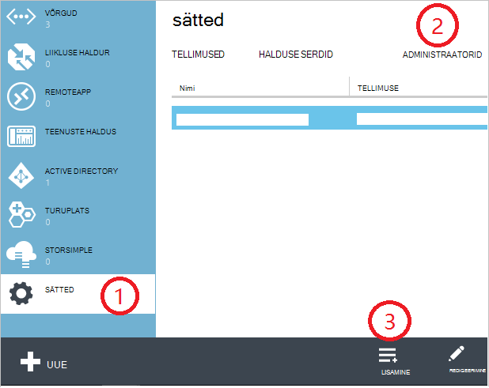

<properties
    pageTitle="Kuidas lisada või muuta Azure Administraatorirollid | Microsoft Azure'i"
    description="Kirjeldab, kuidas Azure'i koostöö administraator, teenuse administraator ja administraatori konto lisamine või muutmine"
    services=""
    documentationCenter=""
    authors="genlin"
    manager="mbaldwin"
    editor=""
    tags="billing"/>

<tags
    ms.service="billing"
    ms.workload="na"
    ms.tgt_pltfrm="na"
    ms.devlang="na"
    ms.topic="article"
    ms.date="08/17/2016"
    ms.author="genli"/>

# Kuidas lisada või muuta Azure Administraatorirollid

On kolme tüüpi administraatorirollid Microsoft Azure.

| Rolli haldus   | Limiit  | Kirjeldus
| ------------- | ------------- |---------------|
|Konto administraator (a a)  | 1 Azure'i konto kohta  |See on isik, kes on sisse või Azure tellimusi ostetud ja on lubatud juurdepääs [Konto Center](https://account.windowsazure.com/Home/Index) ja erinevate haldamisega seotud toiminguid teha. Nendeks on võimalik luua tellimuste, tellimust tühistada, muuta tellimuse arvelduse ja muuta teenuse administraator.
| Teenuse administraator (SA) | 1 Azure tellimuse kohta  |Sellel rollil on lubatud teenuste [Azure portaali](https://portal.azure.com)haldamiseks. Vaikimisi Uus tellimus, on ka kontohaldur teenuse administraator.|
|Koostöö [Azure klassikaline portaalis](https://manage.windowsazure.com) administraator (CA)|200 tellimuse kohta| Selle rolli sama juurdepääsu õigused teenuse administraator on, kuid ei saa muuta liidu tellimusi Azure kataloogid. |

> [AZURE.NOTE] Azure Active Directory Rollipõhine juurdepääsu juhtimine (RBAC) võimaldab kasutajatel lisada mitu rollid. Lisateabe saamiseks lugege teemat [Azure Active Directory rolli vastavalt juurdepääsu reguleerimine](./active-directory/role-based-access-control-configure.md).

> [AZURE.NOTE] Kui vajate rohkem abi, mis tahes hetkel selle artikli teemad, palun [tugiteenuste](https://portal.azure.com/?#blade/Microsoft_Azure_Support/HelpAndSupportBlade) saamiseks teie probleemi lahendada kiiresti.

## Kuidas lisada tellimuse administraator

**Azure'i portaal**

1. [Azure'i portaali](https://portal.azure.com)sisse logida.

2. Valige menüüs jaoturi **tellimuse** > *see tellimus, millele soovite juurde pääseda administraator*.

    

3. Tellimuse tera, valige **sätted**> **Kasutajad**.

    
4. Kasutajate tera, valige käsk **Lisa**>**Valige roll** > **omanik**.

    

    **Märkus**
    - Sama juurdepääsu õigused koostöö administraator on omanik roll. Selle rolli ei saa pääsuõigusega [Azure'i konto keskele](https://account.windowsazure.com/subscriptions).
    - [Azure portaali](https://portal.azure.com) kaudu lisatud omanikud ei saa hallata [Azure klassikaline portaalis](https://manage.windowsazure.com)teenuste.  

5. Tippige meiliaadress, kelle soovite lisamine omanikuna, klõpsake selle kasutaja ja seejärel klõpsake nuppu **Valige**kasutaja.

    

**Azure'i klassikaline portaal**

1. [Azure'i klassikaline portaali](https://manage.windowsazure.com/)sisse logida.

2. Valige navigeerimispaanil **sätted**> **Administraatorid**> **lisamine**.  

    

3. Tippige meiliaadress, kui soovite lisada kaasautorluse administraatorina ja seejärel valige tellimus, mida soovite koostöö administraator juurdepääsu isiku. 

     

Koostöö administraatorina saab lisada järgmised e-posti aadress:

* **Microsofti konto** (endine Windows Live ID)  
 Microsofti Account abil saate Microsofti toodete kõik tarbija rakendusse sisse logida ja pilveteenused, nt Outlooki (Hotmail), Skype'i (MSN), OneDrive, Windows Phone ja Xbox LIVE.
* **Organisatsioonikonto** 
 Organisatsioonikonto on konto, mis on loodud Azure Active Directory. Organisatsioonikonto meiliaadress, mis sarnaneb järgmisega: user@ &lt;oma domeeni&gt;. onmicrosoft.com

### Piirangud ja piirangutega

 * Iga tellimuse on seostatud mõne Azure AD directory (tuntud ka kui vaikimisi kataloogi). Vaikimisi kataloogi tellimus on seostatud leiate [Azure'i klassikaline portaali](https://manage.windowsazure.com/), valige **sätted** > **tellimused**. Kontrollige Tellimuse ID leidmiseks vaikimisi kataloog.

 * Kui olete sisse logitud Microsofti Account, ainult lisamiseks muude Microsofti Accounts või kasutajate vaikimisi kataloogi raames koostööd administraatorina.

 * Kui olete organisatsioonikonto sisse loginud, saate lisada muid ettevõtte kontod ettevõtte koostöö administraatorina. Näiteks abby@contoso.com saate lisada bob@contoso.com teenuse administraator või koostöö administraator, ei saa lisada, kuid john@notcontoso.com kui john@noncontoso.com on vaikimisi kataloogis kasutaja. Kasutajate ettevõtte kontoga sisse logitud, saate jätkata Microsofti Account kasutajate lisamine teenuse administraator või koostöö administraator.

 * Nüüd, kui see on võimalik Azure'i ettevõtte kontoga sisse logida, siis siin on teenuse administraator ja koostöö administraator konto nõuete muudatustest.

    Sisselogimise meetodit| Lisage Microsofti Account või kasutajate vaikimisi Directory CA või SA?  |Sama ettevõte CA või SA lisada organisatsioonikonto? |Muu ettevõtte CA või SA lisada organisatsioonikonto?
    ------------- | ------------- |---------------|---------------
    Microsofti konto |Jah|Ei|Ei
    Organisatsioonikonto|Jah|Jah|Ei

## Kuidas muuta teenuse administraator tellimusele

Ainult konto administraator, saate muuta teenuse administraator tellimusele.

1. Logige sisse [Azure'i konto Center](https://account.windowsazure.com/subscriptions) administraatori konto abil.

2. Valige tellimus, mida soovite muuta.

3. Klõpsake paremas servas asuvas **redigeerimine tellimuse** üksikasjad.  

    

4. Sisestage väljale **Administraator** e-posti aadress uus administraator.  

    

## Kuidas muuta konto administraator

Azure'i konto edastada teisele kontole, leiate [Azure'i tellimuse puhul omandiõiguse](billing-subscription-transfer.md).

## Järgmised sammud

* Kuidas ressursi juurdepääsu kontrollitakse Microsoft Azure kohta lisateabe saamiseks lugege teemat [mõistmine ressursi juurdepääsu Azure](./active-directory/active-directory-understanding-resource-access.md)

* Kuidas Azure Active Directory on seotud Azure tellimuse kohta leiate lisateavet teemast [Kuidas Azure'i tellimused on seostatud Azure Active Directory](./active-directory/active-directory-how-subscriptions-associated-directory.md)

* Kuidas Azure Active Directory on seotud Azure tellimuse kohta leiate lisateavet teemast [administraatorirollide Azure Active Directory 's](./active-directory/active-directory-assign-admin-roles.md)

> [AZURE.NOTE] Kui teil siiski on küsimusi, võtke [tugiteenuste](https://portal.azure.com/?#blade/Microsoft_Azure_Support/HelpAndSupportBlade) saamiseks probleemi lahendada kiiresti.
