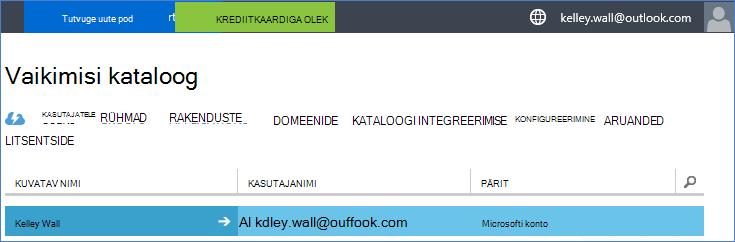
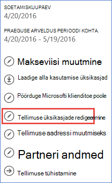
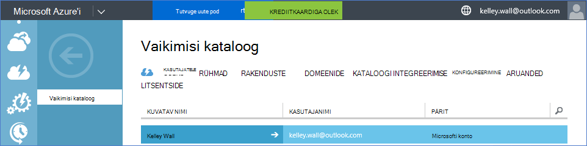

<properties
    pageTitle="Kasutamine Office 365 rentniku Azure tellimuse | Microsoft Azure'i"
    description="Saate teada, kuidas lisada teenusekomplekti Office 365 directory (rentnik) Azure märkimiseks, et seost."
    services=""
    documentationCenter=""
    authors="JiangChen79"
    manager="mbaldwin"
    editor=""
    tags="billing,top-support-issue"/>

<tags
    ms.service="billing"
    ms.workload="na"
    ms.tgt_pltfrm="ibiza"
    ms.devlang="na"
    ms.topic="article"
    ms.date="09/16/2016"
    ms.author="cjiang"/>

# Office 365 rentniku seostada Azure tellimuse
Kui olete ostnud Office 365 ja Azure tellimuste eraldi varem ja nüüd soovite juurdepääsu Office 365 rentniku Azure tellimusest, on lihtne teha. Selles artiklis kirjeldatakse, kuidas.

> [AZURE.NOTE] See artikkel ei kehti Enterprise lepingu (EA) klientidele.

## Kiirülevaate juhised
Oma Office 365 rentniku seostamiseks Azure tellimuse Azure'i konto abil saate lisada oma Office 365 rentniku ja seejärel Office 365 rentniku Azure tellimuse seostada.

## Üksikasjalikud juhised
Selle stsenaariumi korral Kelley seina on kasutaja, kes on Azure tellimuse konto kelley.wall@outlook.com. Kelley on ka Office 365 tellimuse konto kelley.wall@contoso.onmicrosoft.com. Nüüd soovib Kelley juurdepääs Office 365 rentniku Azure'i tellimus.

### Eeltingimused
Seost töötaks õigesti, järgmine kohustuslik tarkvara on vajalikud:

- Teil on vaja teenuse administraator Azure tellimuse identimisteabe. Koostöö administraatorid ei saa käivitada alamhulga juhiseid.
- Teil on vaja Office 365 rentniku üldadministraator identimisteabe.
- E-posti aadressi teenuse administraator peavad sisaldama pole Office 365 rentnik.
- Meiliaadress, et teenuse administraator peab pole sama mis tahes üldadministraator Office 365 rentniku.
- Kui kasutate praegu on Microsofti konto ja organisatsioonikonto meiliaadressiga, ajutiselt muuta teenuse administraator Azure tellimuse kasutada mõne muu Microsofti kontoga. Saate luua uue Microsofti konto [Microsofti konto registreerumislehel](https://signup.live.com/).

Kui soovite muuta oma teenuse administraator, tehke järgmist.

1. Logige sisse [portaali konto haldamine](https://account.windowsazure.com/subscriptions).
2. Valige tellimus, mida soovite muuta.
3. Valige **Redigeeri Tellimuse üksikasjad**.

    

4. Sisestage väljale **Administraator** selle meilikonto aadress, uue teenuse administraator.

    

### Office 365 rentniku seostada Azure tellimuse
Office 365 rentniku seostada Azure tellimuse, toimige järgmiselt.

1.  Logige sisse [kontole haldusportaali](https://account.windowsazure.com/subscriptions) teenuse administraatori identimisteabega.
2.  Valige vasakul paanil **ACTIVE DIRECTORY**.

    

    > [AZURE.NOTE] Näha peaks olema Office 365 rentnik. Kui näete, vahele jätta järgmise juhise juurde.

    

3. Office 365 rentniku Azure tellimusse lisada.

    lisamine. Valige **Uus** > **DIRECTORY** > **kohandatud loomine**.

    

    b. Valige lehel **Lisa directory** **DIRECTORY**, **Kasutage olemasoleva kausta**. Seejärel valige **olen valmis nüüd välja logitud**, ja valige **valmis** .

    

    c. Kui teil on sisse logitud, logige sisse oma Office 365 rentniku globaalne administraatori identimisteave.

    

    d. Valige **Jätka**.

    

    e. Valige **Logi välja kohe**.

    

    f. Logige sisse [kontole haldusportaali](https://account.windowsazure.com/subscriptions) teenuse administraatori identimisteabega.

    

    g. Peaksite nägema oma Office 365 rentniku armatuurlaual.

    

4. Azure'i tellimusega seostatud kataloogi muuta.

    lisamine. Valige **sätted**.

    

    b. Valige oma Azure'i tellimus ja seejärel valige **Redigeeri DIRECTORY**.
    

    c. Valige **Järgmine** .

    

    > [AZURE.WARNING] Saate kõik kaasadministraatorite eemaldatakse hoiatus.

    

    >[AZURE.WARNING] Lisaks ka eemaldatakse kõik [Rollipõhine juurdepääsu reguleerimine (RBAC)](./active-directory/role-based-access-control-configure.md) kasutajad määratud juurdepääsu ressursi rühmi. Hoiatus kuvatakse ainult mainimised kaasadministraatorite eemaldamine.

    

    d. Valige **valmis** .

5. Nüüd saate lisada oma Office 365 ettevõtte kontod nimega kaasadministraatorite Azure Active Directory rentniku.

    lisamine. Valige vahekaart **Administraatorid** ja seejärel valige **Lisa**.

    

    b. Sisestage oma Office 365 rentniku organisatsioonikonto, valige Azure'i tellimus ja seejärel valige **valmis** .

    

    c. Minge tagasi vahekaardile **Administraatorid** . Peaksite nägema organisatsioonikonto, kuvatakse koostöö administraator.

    

6. Järgmine saate testida Accessi kaasautorluse administraatori poole.

    lisamine. Konto haldusportaali väljalogimine.

    b. Avage [konto haldusportaal](https://account.windowsazure.com/subscriptions) või [Azure portaali](https://portal.azure.com/).

    c. Kui Azure'i lehel on link, **logige sisse oma ettevõtte konto**, valige link. Muul juhul selle sammu vahele jätta.

    

    d. Sisestage mandaat koostöö administraator ja valige **sisselogimine**.

    

## Järgmised sammud
Seotud stsenaariumid on järgmised.

- Teil juba on Office 365 tellimus ning olete valmis Azure tellimuse kasutajaks, kuid soovite kasutada olemasoleva Office 365 Kasutajakontod Azure tellimuse.
- On ka Azure abonendi ning soovite saada Office 365 tellimuse kasutajate teie olemasoleva Azure Active Directory eksemplar.

Nende toimingute tegemise kohta leiate teavet teemast [kasutada oma olemasolevat Office 365 konto Azure tellimuse või vastupidi](billing-use-existing-office-365-account-azure-subscription.md).
