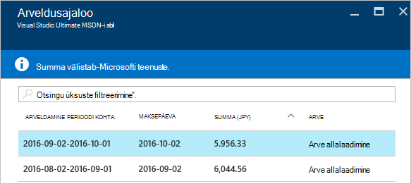

<properties
    pageTitle="Oma Azure'i arveldus arve ja igapäevane kasutamine andmete allalaadimise | Microsoft Azure'i"
    description="Kirjeldab, kuidas oma Azure arvelduse arve ja igapäevane kasutamine andmete allalaadimine"
    services=""
    documentationCenter=""
    authors="genlin"
    manager="mbaldwin"
    editor=""
    tags="billing"
    />

<tags
    ms.service="billing"
    ms.workload="na"
    ms.tgt_pltfrm="na"
    ms.devlang="na"
    ms.topic="article"
    ms.date="10/10/2016"
    ms.author="genli"/>

# Kuidas alla laadida oma Azure'i arve ja iga päev kasutusandmete arveldus

> [AZURE.NOTE] Kui vajate rohkem abi, mis tahes hetkel selle artikli teemad, palun [tugiteenuste](https://portal.azure.com/?#blade/Microsoft_Azure_Support/HelpAndSupportBlade) saamiseks teie probleemi lahendada kiiresti.

Azure'i konto administraatorina saate vaadata arvelduse arve ja igapäevane kasutamine andmete [Azure portaali](https://portal.azure.com) või [Azure'i konto keskele](https://account.windowsazure.com/subscriptions). Siin on kuidas:

## Azure'i portaal

1. Logige sisse [Azure portaali](https://portal.azure.com) konto administraatorina.

    >[AZURE.NOTE] Ainult konto administraator on juurdepääs arvete andmeid. Kuidas teada saada, kes on kontohaldur tellimuse kohta lisateabe saamiseks vt [korduma kippuvad küsimused](billing-subscription-transfer.md#faq).

2. Valige menüüs jaoturi **arveldus**. Enne **arveldus** leiate mõned kasulikku teavet nagu järgmise arve kuupäev.

    
3. Valige jaotises **Tellimuse maksumus** tellimus, mida soovite vaadata.

    
4. Valige **Arveldamine ja kasutamine**.

    

5. Enne **makseajaloo** nuppu **Allalaadimine arve** vaatamiseks arve koopia. Klõpsake arveldusperioodi igapäevane kasutamine andmete kuvamiseks.

    

## Azure'i konto Center

1. Logige sisse [Azure'i konto Center](https://account.windowsazure.com/subscriptions) konto administraatorina.
2. Valige tellimus, mille kohta soovite teavet arve ja kasutamist.
3. Valige **MAKSEAJALOO**.  
4. Saate vaadata oma laused viimase kuue arvelduse perioodide ja praeguse arveldamata perioodi.   
5. Valige **Kuva praeguse lause** kuvamiseks kulude prognoos hinnang on loodud ajal. See teave ainult värskendatakse iga päev ja ei tohi sisaldada kasutuse vaatamiseks. Igakuine arve võib erineda sellest hinnangu.   
6. Valige **Allalaadimine arve** vaatamiseks viimase arve koopia.  
7. Valige **Kasutus alla laadida** alla laadida igapäevane kasutamine andmete CSV-failina. 

> [AZURE.NOTE] Kui teil siiski on küsimusi, võtke [tugiteenuste](https://portal.azure.com/?#blade/Microsoft_Azure_Support/HelpAndSupportBlade) saamiseks probleemi lahendada kiiresti.
