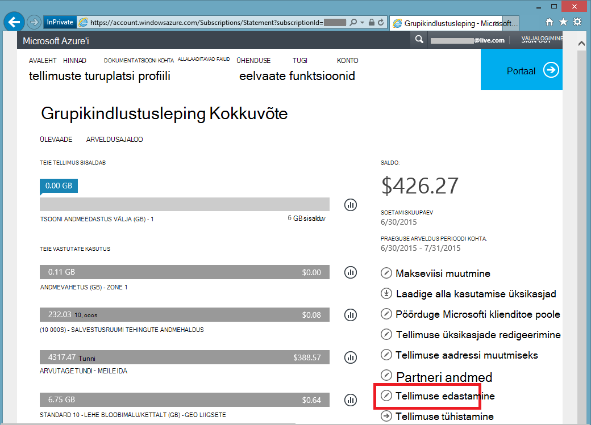

<properties
   pageTitle="Azure'i tellimuse omandiõiguse | Microsoft Azure'i"
   description="Edastamiseks Azure tellimuse mõnele teisele kasutajale, ja mõned korduma kippuvad küsimused (KKK) protsess"
   services=""
   documentationCenter=""
   authors="genlin"
   manager="stevenpo"
   editor=""
   tags="billing,top-support-issue"/>

<tags
   ms.service="billing"
   ms.workload="na"
   ms.tgt_pltfrm="na"
   ms.devlang="na"
   ms.topic="article"
   ms.date="10/10/2016"
   ms.author="genli"/>

# Azure'i tellimuse omandiõiguse

Tehke teile.

- Arveldus omandiõiguse Azure tellimuse kellelegi teisele üle on vajalik?
- Kas soovite muuta konto, mida kasutatakse Azure kasutajaks registreerumist? Võib-olla saate kasutada Microsofti Account, kuid kasutada oma töö- või koolikontoga hoopis mõeldud?
- Soovite teisaldada Azure tellimuse ühest kaustast teise?
- On Office 365 ja Azure erinevate rentnikega ja soovite konsolideerida?

Nüüd selleks hõlpsalt sisse on Microsoft Azure'i konto Center - grupikindlustusleping, MSDN-i, Action Pack või BizSpark tellimused.  Oleme lisanud oma tellimus üle kanda teise kasutaja võimalus. Teisisõnu, saate nüüd muuta konto admin mis tahes grupikindlustusleping, MSDN-i, Action Pack või BizSpark tellimus omanikustaatuse, olenemata sellest, milline riik saate töötada. Azure'i turuplatsi oste edastamise toetavad nüüd need tellimuse puhul.

> [AZURE.NOTE] Tellimuse muutmiseks eri pakkumine lisateabe saamiseks vaadake [vahetamine teise pakkumise Azure tellimust](billing-how-to-switch-azure-offer.md) . Kui vajate rohkem abi, mis tahes hetkel selle artikli teemad, palun [tugiteenuste](https://portal.azure.com/?#blade/Microsoft_Azure_Support/HelpAndSupportBlade) saamiseks teie probleemi lahendada kiiresti.

## Kuidas omanikustaatuse Azure tellimuse üle

> [AZURE.VIDEO transfer-an-azure-subscription]

1.  Logige sisse veebisaidil <https://account.windowsazure.com/Subscriptions>. Peate olema administraator konto teha ka omandi üleminek. Kuidas teada saada, kes on kontohaldur tellimuse kohta lisateabe saamiseks vt [korduma kippuvad küsimused](#faq).

2.  Valige tellimus üle.

3.  Klõpsake suvandit **Tellimus üle kanda** .

    

4.  Järgige viipasid määratud adressaadile.

    

5.  Adressaat saab automaatselt aktsepteerimise lingi e-postiga.

    

6.  Saaja klõpsab link ja järgib juhiseid, sh oma makseteave sisestamine.

    

    

7. Edu! Tellimust on nüüd üle.

## Korduma kippuvad küsimused (KKK)

-   **Kuidas ma tean, kes on kontohaldur tellimuse?**

    Saate kinnitada, kes on tellimuse kontohaldur järgmiselt:

    1. [Azure'i portaali](https://portal.azure.com)sisse logida.
    2. Valige menüü jaoturi **tellimus**.
    3. Valige tellimus, mida soovite kontrollida, ja seejärel valige **sätted**.
    4. Valige **Atribuudid**. Tellimuse kontohaldur kuvatakse väljal **Konto administraator** .  

-   **Kas tellimuse edastamine tulemusena mis tahes teenuse tööseisakute?**

    Pole mingit mõju teenusega. See tõhus tühistab tellimuse arvelduskonto administraatori jaotises ja loob uue jaotise adressaadi konto, kuid Azure'i teenuste seostab uude tellimusse. Tellimuse ID jääb samaks.

-   **Kuidas see muuta kataloogi tellimuse jaoks kasutada?**-   
    Azure'i tellimuse luuakse konto administraator kuuluva kataloogis. Nii, et kataloogi muutmiseks lihtsalt üle tellimuse kataloogis target kasutajakonto. Kui kasutaja on lõpule jõudnud edastamine kinnitamiseks juhised, teisaldamine tellimuse automaatselt siht kataloogi.

-   **Kui ma teise organisatsiooni tellimuse arvelduse omandiõiguse üle võtta, on need jätkuvalt on juurdepääs minu ressursse?**

    Kui tellimus üle teise, on seotud eelmise rentniku kaotavad väliskasutajad juurdepääsu tellimusega. Isegi juhul, kui kasutaja ei ole teenuse administraator või Co-admin enam, nad võivad veel tellimuse muid turvalisus vahendeid kaudu juurdepääsu. Järgmised:
    - Andke kasutajale admin õigused tellimuse ressursside halduse serdid. Lisateabe saamiseks lugege teemat [luua ja üles laadida Azure serdi haldus](https://msdn.microsoft.com/library/azure/gg551722.aspx)
    -   Kiirklahvide teenuste (nt salvestusruumi). Lisateabe saamiseks vt [Vaade, kopeerimine ja uuesti luua salvestusruumi kiirklahvide](storage-create-storage-account.md#view-copy-and-regenerate-storage-access-keys)
    -   Remote juurdepääsu mandaatide teenuste nagu Azure'i Virtuaalmasinates

    See pole täieliku loendi. Adressaadi peaks kaaluma, mis tahes saladusi, kui need on vaja juurdepääsu piiramiseks nende ressursside teenusega seotud värskendamine. Enamik ressursse saab värskendada järgmiselt:

    1.   Valige Azure portaali: [ *https://portal.azure.com*](https://portal.azure.com)

    2.    Klõpsake nuppu Sirvi kõiki -&gt; kõik ressursid

    3.    Valige ressurss. Avaneb ressursi tera.

    4.    Ressursi tera, klõpsake nuppu **sätted**. Siin saate vaadata ja värskendada olemasoleva saladusi.

-   **Kui üle kanda tellimuse arveldustsükli keskel, kas adressaatide maksma kogu arveldamine tsükkel?**

    Saatja on mis tahes kasutamiseks teatati, et edastamise on lõpule viidud kuni maksmise eest vastutav. Adressaat on teatatud edastamine alates hetkest kasutus. Võib olla mõned kasutus, mis hiljem teatati, kuid enne edastamine. See kaasatakse adressaadi arve.

-   **Kas adressaat on juurdepääs kasutus- ja arveldusajaloo?**

    Sel ajal, ainult teavet, mis on ilmnenud sellele adressaadile on viimase arve (või kui tellimus üle enne loodud esimese arve saldo). Kasutus- ja arveldusajaloo ülejäänud Edasta tellimus.

-   **Kas saab muuta ajal ülemineku pakkumine?**

    Pakkumine peab jääma samaks. Teie pakkumise muutmiseks peate, [pöörduge klienditoe poole](http://go.microsoft.com/fwlink/?LinkID=619338).

-   **Tellimuse saate edastada kasutajakonto teises riigis?**

    Ei, sel ajal, kui seda ei toetata. Adressaadi kasutajakonto peab olema sama riik.

-   **Adressaat saab kasutada erinevaid makse süsteem?**

    Jah. On siin piirangud: nüüd makseajaloo tellimuse jagatakse üle kahe kontod. Kuid on see eelis, et seda kõike ilma [pöörduge klienditoe poole](http://go.microsoft.com/fwlink/?LinkID=619338).

-   **Kas makseviisi mõjutada pärast ma üle Azure tellimuse?**

    Selleks, et tellimus üle aktsepteerimiseks krediitkaardi või sarnane makseviis tuleb esitada tellimuse eest maksta. Näiteks kui Bob tellimusele üleminekul Aile ja Aile aktsepteerib edastamise, Aile peab võimaldama ka makseviis, mida ta kasutab tellimuse eest maksta. Kui edastust on lõpule jõudnud, Bob enam ei lisandu ta üle Aile tellimuse.

## Järgmised toimingud pärast tellimuse omandiõiguse vastu võtmist

1. Nüüd olete konto administraator. Läbi vaadata ja värskendada teenuse administraator ja koostöö administraatorid. [Azure'i klassikaline portaali](https://manage.windowsazure.com) administraatorid haldamiseks sätted. [Lisateavet leiate teemast](http://go.microsoft.com/fwlink/?LinkID=533293).
2. Rollipõhine juurdepääsu reguleerimine (RBAC) saate kasutada ka oma tellimust ja teenuste jaoks. Külastage [Azure portaali](https://portal.azure.com) [RBAC kohta lisateavet](http://go.microsoft.com/fwlink/?LinkID=544802)
3. Värskendage selle tellimuse teenustega seotud mandaat. Järgmised:
    - Andke kasutajale admin õigused tellimuse ressursside halduse serdid. Lisateabe saamiseks lugege teemat [Azure serdi loomine ja üleslaadimise haldamiseks](https://msdn.microsoft.com/library/azure/gg551722.aspx)
    -   Kiirklahvide teenuste (nt salvestusruumi). Lisateabe saamiseks vt [Vaade, kopeerimine ja uuesti luua salvestusruumi kiirklahvide](storage-create-storage-account.md#view-copy-and-regenerate-storage-access-keys)
    -   Remote juurdepääsu mandaatide teenuste nagu Azure'i Virtuaalmasinates
4. Värskenda see tellimus, [Azure'i konto Center](https://account.windowsazure.com/Subscriptions)[Lisateavet](http://go.microsoft.com/fwlink/?LinkID=533292) teatiste arveldus  
5.  Kui töötate koos partneriga, kaaluge selle tellimuse partneri ID värskendamine. Saate seda teha [Azure'i konto keskele](https://account.windowsazure.com/Subscriptions).

> [AZURE.NOTE] Kui teil siiski on küsimusi, võtke [tugiteenuste](https://portal.azure.com/?#blade/Microsoft_Azure_Support/HelpAndSupportBlade) saamiseks probleemi lahendada kiiresti.
