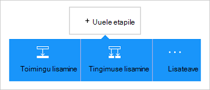

<properties
    pageTitle="Azure'i bloobimälu konnektor rakenduste loogika lisamine | Microsoft Azure'i"
    description="Azure'i bloobimälu konnektor REST API parameetritega ülevaade"
    services=""
    documentationCenter="" 
    authors="MandiOhlinger"
    manager="anneta"
    editor=""
    tags="connectors"/>

<tags
   ms.service="logic-apps"
   ms.devlang="na"
   ms.topic="article"
   ms.tgt_pltfrm="na"
   ms.workload="integration" 
   ms.date="10/18/2016"
   ms.author="mandia"/>

# Azure'i bloobimälu salvestusruumi konnektor kasutamise alustamine
Azure'i bloobimälu on teenus suurte andmehulkade struktureerimata talletamiseks. Sooritada erinevaid toiminguid, näiteks üles, värskendada, leida ja plekid Azure'i bloobimälu kustutamine. 

Azure'i bloobimälu, kus saate:

- Koostamiseks oma töövoo üles uue projekti või faile, mis on viimati värskendatud saada.
- Toimingute abil saate hankida faili metaandmed, faili, failide kopeerimine ja kustutamine. Näiteks tööriista uuendamisel Azure veebisait (päästik) värskendage seejärel bloobimälu (toiming) faili. 

Selles teemas kirjeldatakse, kuidas kasutada bloobimälu salvestusruumi konnektor loogika rakenduses ja ka on loetletud toimingud.

>[AZURE.NOTE] Selle versiooni see artikkel kehtib loogika rakendused üldiselt kättesaadav (GA). 

Loogika rakenduste kohta lisateabe saamiseks lugege teemat [mis on loogika rakendused](../app-service-logic/app-service-logic-what-are-logic-apps.md) ja [loogika rakenduse loomine](../app-service-logic/app-service-logic-create-a-logic-app.md).

## Ühenduse loomine Azure'i bloobimälu

Enne oma loogika rakenduse juurdepääsu mis tahes teenuse, esmalt luua *ühenduse* teenuse. Ühenduse pakub Ühenduvus loogika rakendus ja muu teenus. Näiteks salvestusruumi konto ühenduse loomisel bloobimälu salvestusruumi *ühendus*. Ühenduse loomiseks sisestage mandaat tavaliselt abil juurdepääsu teenuse loote. Nii Azure Storage, sisestage mandaat teie salvestusruumi kontoga ühenduse loomine. 

#### Ühenduse loomine

>[AZURE.INCLUDE [Create a connection to Azure blob storage](../../includes/connectors-create-api-azureblobstorage.md)]
 
## Kasutage käivitamiseks

See konnektor ei saa mis tahes päästikute. Muud päästikute abil saate käivitada loogika rakendus, näiteks Korduvus päästik, lisamispäästiku HTTP Webhook päästikute saadaval muude konnektorid ja palju muud. [Loogika rakenduse loomine](../app-service-logic/app-service-logic-create-a-logic-app.md) pakub näide.

## Kasutage toimingut
    
Toimingu on poolt määratletud loogika rakenduse töövoo toimingu.

1. Valige plussmärk. Kuvatakse mitu valikut: **Lisa toimingu**, **Lisa tingimus**või ühe **rohkem** suvandeid.

    

2. Valige **Lisa toiming**.

3. Tippige väljale tekst "Bloobivahemälu" saadaval toimingute loendit.

     

4. Selles näites valige **AzureBlob - faili metaandmete teed kasutades saada**. Kui ühendus on juba olemas, ja seejärel valige **…** Faili valimiseks (Kuva valija) nuppu.

    

    Kui teilt küsitakse ühendusteabe, seejärel sisestage üksikasjad ühenduse loomine. [Loo ühendus](connectors-create-api-azureblobstorage.md#create-the-connection) selles teemas kirjeldatakse neid atribuute. 

    > [AZURE.NOTE] Selles näites me saame metaandmete faili. Metaandmete kuvamiseks lisada teise toiming, mis loob uue faili mõne muu kasutamisega. Näiteks lisada OneDrive'i toiming, mis loob uue "test" faili metaandmete põhjal. 

5. **Salvestage** muudatused (ülemises vasakus nurgas tööriistariba). Loogika rakenduse salvestatakse ja võib automaatselt lubatud.

> [AZURE.TIP] [Salvestusruumi Explorer](http://storageexplorer.com/) on abil saate hallata mitut salvestusruumi kontod.

## Tehnilised andmed

## Salvestusruumi bloobimälu toimingud

|Toiming|Kirjeldus|
|--- | ---|
|[Hankida faili metaandmed](connectors-create-api-azureblobstorage.md#get-file-metadata)|Selle toimingu saab faili metaandmete faili id abil.|
|[Update-faili](connectors-create-api-azureblobstorage.md#update-file)|See toiming värskendab faili.|
|[Faili kustutamine](connectors-create-api-azureblobstorage.md#delete-file)|See toiming kustutab faili.|
|[Faili metaandmete teed kasutades hankimine](connectors-create-api-azureblobstorage.md#get-file-metadata-using-path)|Selle toimingu saab faili metaandmete tee kaudu.|
|[Faili sisu teed kasutades](connectors-create-api-azureblobstorage.md#get-file-content-using-path)|Selle toimingu saab faili sisu abil tee.|
|[Faili sisu](connectors-create-api-azureblobstorage.md#get-file-content)|Selle toimingu saab faili sisu id abil.|
|[Faili loomine](connectors-create-api-azureblobstorage.md#create-file)|Selle toimingu lisatud faili.|
|[Faili kopeerimine](connectors-create-api-azureblobstorage.md#copy-file)|Selle toimingu kopeerib faili Azure'i bloobimälu.|
|[Ekstrakti archive kausta](connectors-create-api-azureblobstorage.md#extract-archive-to-folder)|Selle toimingu ekstraktib arhiivifaili kausta (näide: zip).|

### Toimingu üksikasjad

Selles jaotises iga toimingu, sh nõutav või valikuline Sisestuskeel atribuudid ja mis tahes vastava väljundi seostatud konnektor teatud üksikasjade kuvamiseks.

#### Hankida faili metaandmed
Selle toimingu saab faili metaandmete faili id abil.  

|Atribuudi nimi| Kuvatav nimi|Kirjeldus|
| ---|---|---|
|ID *|Faili|Valige fail|

Tärn (*) tähendab, et see atribuut on nõutav.

##### Väljundi üksikasjad
BlobMetadata

| Atribuudi nimi | Andmetüüp |
|---|---|
|ID|string|
|Nimi|string|
|DisplayName|string|
|Tee|string|
|LastModified|string|
|Suurus|täisarv|
|Meediumitüübil|string|
|IsFolder|kahendmuutuja|
|ETag|string|
|FileLocator|string|

#### Update-faili
See toiming värskendab faili.  

|Atribuudi nimi| Kuvatav nimi|Kirjeldus|
| ---|---|---|
|ID *|Faili|Valige fail|
|kehateksti *|Faili sisu|Värskendada faili sisu|

Tärn (*) tähendab, et see atribuut on nõutav.

##### Väljundi üksikasjad
BlobMetadata

| Atribuudi nimi | Andmetüüp |
|---|---|
|ID|string|
|Nimi|string|
|DisplayName|string|
|Tee|string|
|LastModified|string|
|Suurus|täisarv|
|Meediumitüübil|string|
|IsFolder|kahendmuutuja|
|ETag|string|
|FileLocator|string|

#### Faili kustutamine
See toiming kustutab faili.  

|Atribuudi nimi| Kuvatav nimi|Kirjeldus|
| ---|---|---|
|ID *|Faili|Valige fail|

Tärn (*) tähendab, et see atribuut on nõutav.

##### Väljundi üksikasjad
Mitte keegi.

#### Faili metaandmete teed kasutades hankimine
Selle toimingu saab faili metaandmete tee kaudu.  

|Atribuudi nimi| Kuvatav nimi|Kirjeldus|
| ---|---|---|
|tee *|Faili tee|Valige fail|

Tärn (*) tähendab, et see atribuut on nõutav.

##### Väljundi üksikasjad
BlobMetadata

| Atribuudi nimi | Andmetüüp |
|---|---|
|ID|string|
|Nimi|string|
|DisplayName|string|
|Tee|string|
|LastModified|string|
|Suurus|täisarv|
|Meediumitüübil|string|
|IsFolder|kahendmuutuja|
|ETag|string|
|FileLocator|string|

#### Faili sisu teed kasutades
Selle toimingu saab faili sisu abil tee.  

|Atribuudi nimi| Kuvatav nimi|Kirjeldus|
| ---|---|---|
|tee *|Faili tee|Valige fail|

Tärn (*) tähendab, et see atribuut on nõutav.

##### Väljundi üksikasjad
Mitte keegi.

#### Faili sisu
Selle toimingu saab faili sisu id abil.  

|Atribuudi nimi| Andmetüüp|Kirjeldus|
| ---|---|---|
|ID *|string|Valige fail|

Tärn (*) tähendab, et see atribuut on nõutav.

##### Väljundi üksikasjad
Mitte keegi.

#### Faili loomine
Selle toimingu lisatud faili.  

|Atribuudi nimi| Kuvatav nimi|Kirjeldus|
| ---|---|---|
|folderPath *|Kausta tee|Valige kaust|
|nimi *|Faili nimi|Üleslaaditava faili nimi|
|kehateksti *|Faili sisu|Faili üleslaadimiseks sisu|

Tärn (*) tähendab, et see atribuut on nõutav.

##### Väljundi üksikasjad
BlobMetadata

| Atribuudi nimi | Andmetüüp | 
|---|---|
|ID|string|
|Nimi|string|
|DisplayName|string|
|Tee|string|
|LastModified|string|
|Suurus|täisarv|
|Meediumitüübil|string|
|IsFolder|kahendmuutuja|
|ETag|string|
|FileLocator|string|

#### Faili kopeerimine
Selle toimingu kopeerib faili Azure'i bloobimälu.  

|Atribuudi nimi| Kuvatav nimi|Kirjeldus|
| ---|---|---|
|andmeallika *|Lähte-url|Määrake URL-i lähtefail|
|sihtkoha *|Sihtkoha faili tee|Määratud sihtkohta faili tee, sh sihtrakenduse nimi|
|ülekirjutamine|Kirjutada?|Olemasoleva faili sihtkoht kirjutatakse peaks (tõene/väär)?  |

Tärn (*) tähendab, et see atribuut on nõutav.

##### Väljundi üksikasjad
BlobMetadata

| Atribuudi nimi | Andmetüüp |
|---|---|
|ID|string|
|Nimi|string|
|DisplayName|string|
|Tee|string|
|LastModified|string|
|Suurus|täisarv|
|Meediumitüübil|string|
|IsFolder|kahendmuutuja|
|ETag|string|
|FileLocator|string|

#### Ekstrakti archive kausta
Selle toimingu ekstraktib arhiivifaili kausta (näide: zip).  

|Atribuudi nimi| Kuvatav nimi|Kirjeldus|
| ---|---|---|
|andmeallika *|Andmeallika arhiivi faili tee|Valige arhiivi faili|
|sihtkoha *|Sihtkausta tee|Valige sisu ekstraktimiseks|
|ülekirjutamine|Kirjutada?|Olemasoleva faili sihtkoht kirjutatakse peaks (tõene/väär)?|

Tärn (*) tähendab, et see atribuut on nõutav.

##### Väljundi üksikasjad
BlobMetadata

| Atribuudi nimi | Andmetüüp |
|---|---|
|ID|string|
|Nimi|string|
|DisplayName|string|
|Tee|string|
|LastModified|string|
|Suurus|täisarv|
|Meediumitüübil|string|
|IsFolder|kahendmuutuja|
|ETag|string|
|FileLocator|string|

## HTTP vastused

Tehes kõned erinevaid toiminguid, saate teatud vastuseid. Järgmises tabelis kirjeldatakse vastuseid ja nende kirjeldused:  

|Nimi|Kirjeldus|
|---|---|
|200|Ok|
|202|Aktsepteeritud|
|400|Vigane päring|
|401|Volitused|
|403|Keelatud|
|404|Ei leitud|
|500|Sisemine serveritõrge. Tundmatu tõrge|
|Vaikimisi|Toiming nurjus.|

## Järgmised sammud

[Loogika rakenduse loomine](../app-service-logic/app-service-logic-create-a-logic-app.md). Tutvuge on saadaval konnektorid loogika rakendustes meie [API-de loendis](apis-list.md).

