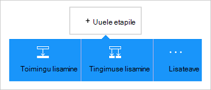

<properties
    pageTitle="Loogika rakenduste Dynamics CRM Online'i konnektor lisamine | Microsoft Azure'i"
    description="Loogika rakenduste teenusega Azure'i rakenduse loomisel. Dynamics CRM Online'i ühenduse pakkuja pakub töötada üksustega Dynamics CRM Online'i API."
    services="logic-apps"    
    documentationCenter=""     
    authors="MandiOhlinger"    
    manager="erikre"    
    editor="" 
    tags="connectors" />

<tags
ms.service="logic-apps"
ms.devlang="na"
ms.topic="article"
ms.tgt_pltfrm="na"
ms.workload="integration"
ms.date="08/15/2016"
ms.author="mandia"/>

# Dynamics CRM Online'i konnektor kasutamise alustamine
Ühenduse loomine Dynamics CRM Online'i uue kirje loomine, värskendamine, üksuse ja palju muud. CRM Online'i, kus saate teha järgmist.

- Koostage oma voog saate CRM Online'i andmete põhjal. 
- Kasuta toiminguid, mis on kirje kustutamiseks saada üksused ja palju muud. Neid toiminguid vastuse saamine, ja seejärel tehke väljund muude toimingute jaoks saadaval. Kui mõni üksus on värskendatud CRM, saate saata meilisõnumi teenusekomplekti Office 365.

Selles teemas kirjeldatakse, kuidas kasutada Dynamics CRM Online'i konnektor loogika rakenduses ja loetletakse ka päästikute ja toimingute.

>[AZURE.NOTE] Selle versiooni see artikkel kehtib loogika rakendused üldiselt kättesaadav (GA).

Loogika rakenduste kohta lisateabe saamiseks lugege teemat [mis on loogika rakendused](../app-service-logic/app-service-logic-what-are-logic-apps.md) ja [loogika rakenduse loomine](../app-service-logic/app-service-logic-create-a-logic-app.md).

## Ühenduse loomine Dynamics CRM Online'i

Enne oma loogika rakenduse juurdepääsu mis tahes teenuse, esmalt luua *ühenduse* teenuse. Ühenduse pakub Ühenduvus loogika rakendus ja muu teenus. Näiteks ühenduse loomine Dynamics, peate esmalt Dynamics CRM Online'i *ühendus*. Ühenduse loomiseks sisestage mandaat tavaliselt abil juurdepääsu teenusele ühenduse loomiseks. Nii koos Dynamics, sisestage mandaat ühenduse loomine Dynamics CRM Online'i kontole.

### Ühenduse loomine

>[AZURE.INCLUDE [Steps to create a connection to Dynamics CRM Online Connection Provider](../../includes/connectors-create-api-crmonline.md)]

## Kasutage käivitamiseks

Käivitamiseks on sündmus, mida saab kasutada määratletud loogika rakenduse töövoo käivitamiseks. Päästikute "küsitlus" teenuse intervall ja sagedus, mida soovite. [Lisateavet päästikute kohta](../app-service-logic/app-service-logic-what-are-logic-apps.md#logic-app-concepts).

1. Loogika rakendus, tippige "dynamics" saada soovitud päästikute loendit:  

    

2. Valige **Dynamics CRM Online'i - kirje loomisel**. Kui ühendus on juba olemas, siis valige ettevõte ja üksuse rippmenüü loendist.

    

    Kui teil palutakse sisse logida, siis sisestage rakendusse üksikasjad ühenduse loomine. [Loo ühendus](connectors-create-api-crmonline.md#create-the-connection) selles teemas on loetletud toimingud. 

    > [AZURE.NOTE] Selles näites loogika rakendus töötab, kui kirje on loodud. See käivitab tulemuste vaatamiseks lisada mõne muu toimingu, mis saadab teile meilisõnumi. Näiteks lisada Office 365 *e-posti saatmine* toiming, mille saate meilisõnumite, kui lisatakse uus kirje. 

3. Klõpsake nuppu **Redigeeri** ja **sagedus** ja **intervall** väärtused. Näiteks kui soovite küsitlus päästik iga 15 minuti järel, seejärel **sagedus** väärtuseks **minutid**ja seada **intervall** **15**. 

    

4. **Salvestage** muudatused (ülemises vasakus nurgas tööriistariba). Loogika rakenduse salvestatakse ja võib automaatselt lubatud.

## Kasutage toimingut

Toimingu on poolt määratletud loogika rakenduse töövoo toimingu. [Lisateavet leiate teemast toimingute kohta](../app-service-logic/app-service-logic-what-are-logic-apps.md#logic-app-concepts).

1. Valige plussmärk. Kuvatakse mitu valikut: **Lisa toimingu**, **Lisa tingimus**või ühe **rohkem** suvandeid.

    

2. Valige **Lisa toiming**.

3. Tippige väljale tekst "dynamics" loendi kõik saadaolevad toimingud.

    

4. Selles näites valige **Dynamics CRM Online'i - kirjet värskendada**. Kui ühendus on juba olemas, siis valige **Ettevõtte nimi**, **Isiku nimi**ja muud atribuudid.  

    

    Kui teilt küsitakse ühendusteabe, seejärel sisestage üksikasjad ühenduse loomine. [Loo ühendus](connectors-create-api-crmonline.md#create-the-connection) selles teemas kirjeldatakse neid atribuute. 

    > [AZURE.NOTE] Selle näite puhul uuendame olemasoleva kirje CRM Online'i. Saate mõne muu päästik väljund kirjet värskendama. Näiteks saate lisada päästik SharePointi *olemasoleva üksuse muutmist* . Lisage CRM Online'i *värskendamine kirje* toiming, mille kasutab SharePointi välju värskendada olemasoleva kirje CRM Online'i. 

5. **Salvestage** muudatused (ülemises vasakus nurgas tööriistariba). Loogika rakenduse salvestatakse ja võib automaatselt lubatud.

## Tehnilised andmed

## Päästikute

|Päästik | Kirjeldus|
|--- | ---|
|[Kui kirje on loodud](connectors-create-api-crmonline.md#when-a-record-is-created)|Käivitab vool CRM objekti loomisel.|
|[Kui kirje on värskendatud](connectors-create-api-crmonline.md#when-a-record-is-updated)|Käivitab vool, kui mõni objekt on muudetud CRM.|
|[Kui kirje on kustutatud](connectors-create-api-crmonline.md#when-a-record-is-deleted)|Käivitab vool CRM objekti kustutamisel.|

## Toimingud

|Toiming|Kirjeldus|
|--- | ---|
|[Loendi kirjete](connectors-create-api-crmonline.md#list-records)|Selle toimingu saab üksuse kirjeid.|
|[Looge uus kirje](connectors-create-api-crmonline.md#create-a-new-record)|See toiming loob uue kirje üksuse.|
|[Andmete hankimine](connectors-create-api-crmonline.md#get-record)|Selle toimingu saab üksuse määratud kirje.|
|[Kirje kustutamine](connectors-create-api-crmonline.md#delete-a-record)|See toiming kustutab mõne üksuse saidikogumi kirje.|
|[Kirje värskendamine](connectors-create-api-crmonline.md#update-a-record)|See toiming värskendab üksuse olemasoleva kirje.|

### Päästiku ja toimingu üksikasjad

Selles jaotises Vt iga päästik ja toimingu, sh nõutav või valikuline Sisestuskeel atribuudid ja mis tahes vastava väljundi seostatud konnektor teatud üksikasjad.

#### Kui kirje on loodud
Käivitab vool CRM objekti loomisel. 

|Atribuudi nimi| Kuvatav nimi|Kirjeldus|
| ---|---|---|
|andmekomplekti *|Ettevõtte nimi|Näiteks Contoso CRM organisatsiooni nimi|
|tabeli *|Isiku nimi|Üksuse nimi|
|$skip|Jäta loendamine|Vahele kirjete arv (vaikimisi = 0)|
|$top|Suurim lubatud Get loendamine|Saada kirjete maksimumarv (vaikimisi = 256)|
|$filter|Päringu filtreerimine|ODATA filter päringu tagastatud kirjete piiramine|
|$orderby|Järjestusalus|Päring ODATA orderBy määratlemiseks järjestuse kirjed|

Tärn (*) tähendab, et see atribuut on nõutav.

##### Väljundi üksikasjad
ItemsList

| Atribuudi nimi | Andmetüüp |
|---|---|
|väärtus|massiiv|

#### Kui kirje on värskendatud
Käivitab vool, kui mõni objekt on muudetud CRM. 

|Atribuudi nimi| Kuvatav nimi|Kirjeldus|
| ---|---|---|
|andmekomplekti *|Ettevõtte nimi|Näiteks Contoso CRM organisatsiooni nimi|
|tabeli *|Isiku nimi|Üksuse nimi|
|$skip|Jäta loendamine|Vahele kirjete arv (vaikimisi = 0)|
|$top|Suurim lubatud Get loendamine|Saada kirjete maksimumarv (vaikimisi = 256)|
|$filter|Päringu filtreerimine|ODATA filter päringu tagastatud kirjete piiramine|
|$orderby|Järjestusalus|Päring ODATA orderBy määratlemiseks järjestuse kirjed|

Tärn (*) tähendab, et see atribuut on nõutav.

##### Väljundi üksikasjad
ItemsList

| Atribuudi nimi | Andmetüüp |
|---|---|
|väärtus|massiiv|

#### Kui kirje on kustutatud
Käivitab vool CRM objekti kustutamisel. 

|Atribuudi nimi| Kuvatav nimi|Kirjeldus|
| ---|---|---|
|andmekomplekti *|Ettevõtte nimi|Näiteks Contoso CRM organisatsiooni nimi|
|tabeli *|Isiku nimi|Üksuse nimi|
|$skip|Jäta loendamine|Vahele kirjete arv (vaikimisi = 0)|
|$top|Suurim lubatud Get loendamine|Saada kirjete maksimumarv (vaikimisi = 256)|
|$filter|Päringu filtreerimine|ODATA filter päringu tagastatud kirjete piiramine|
|$orderby|Järjestusalus|Päring ODATA orderBy määratlemiseks järjestuse kirjed|

Tärn (*) tähendab, et see atribuut on nõutav.

##### Väljundi üksikasjad
ItemsList

| Atribuudi nimi | Andmetüüp |
|---|---|
|väärtus|massiiv|

#### Loendi kirjete
Selle toimingu saab üksuse kirjeid. 

|Atribuudi nimi| Kuvatav nimi|Kirjeldus|
| ---|---|---|
|andmekomplekti *|Ettevõtte nimi|Näiteks Contoso CRM organisatsiooni nimi|
|tabeli *|Isiku nimi|Üksuse nimi|
|$skip|Jäta loendamine|Vahele kirjete arv (vaikimisi = 0)|
|$top|Suurim lubatud Get loendamine|Saada kirjete maksimumarv (vaikimisi = 256)|
|$filter|Päringu filtreerimine|ODATA filter päringu tagastatud kirjete piiramine|
|$orderby|Järjestusalus|Päring ODATA orderBy määratlemiseks järjestuse kirjed|

Tärn (*) tähendab, et see atribuut on nõutav.

##### Väljundi üksikasjad
ItemsList

| Atribuudi nimi | Andmetüüp |
|---|---|
|väärtus|massiiv|

#### Looge uus kirje
See toiming loob uue kirje üksuse. 

|Atribuudi nimi| Kuvatav nimi|Kirjeldus|
| ---|---|---|
|andmekomplekti *|Ettevõtte nimi|Näiteks Contoso CRM organisatsiooni nimi|
|tabeli *|Isiku nimi|Üksuse nimi|

Tärn (*) tähendab, et see atribuut on nõutav.

##### Väljundi üksikasjad
Mitte keegi.

#### Andmete hankimine
Selle toimingu saab üksuse määratud kirje. 

|Atribuudi nimi| Kuvatav nimi|Kirjeldus|
| ---|---|---|
|andmekomplekti *|Ettevõtte nimi|Näiteks Contoso CRM organisatsiooni nimi|
|tabeli *|Isiku nimi|Üksuse nimi|
|ID *|Üksuse identifikaator|Saate määrata kirje ID.|

Tärn (*) tähendab, et see atribuut on nõutav.

##### Väljundi üksikasjad
Mitte keegi.

#### Kirje kustutamine
See toiming kustutab mõne üksuse saidikogumi kirje. 

|Atribuudi nimi| Kuvatav nimi|Kirjeldus|
| ---|---|---|
|andmekomplekti *|Ettevõtte nimi|Näiteks Contoso CRM organisatsiooni nimi|
|tabeli *|Isiku nimi|Üksuse nimi|
|ID *|Üksuse identifikaator|Saate määrata kirje ID.|

Tärn (*) tähendab, et see atribuut on nõutav.

#### Kirje värskendamine
See toiming värskendab üksuse olemasoleva kirje. 

|Atribuudi nimi| Kuvatav nimi|Kirjeldus|
| ---|---|---|
|andmekomplekti *|Ettevõtte nimi|Näiteks Contoso CRM organisatsiooni nimi|
|tabeli *|Isiku nimi|Üksuse nimi|
|ID *|Kirjeidentifikaator|Saate määrata kirje ID.|

Tärn (*) tähendab, et see atribuut on nõutav.

##### Väljundi üksikasjad
Mitte keegi.

## HTTP vastused

Toimingute ja käivitab saate tagastavad ühe või mitme HTTP olek järgmisi koode. 

|Nimi|Kirjeldus|
|---|---|
|200|Ok|
|202|Aktsepteeritud|
|400|Vigane päring|
|401|Volitused|
|403|Keelatud|
|404|Ei leitud|
|500|Sisemine serveritõrge. Tundmatu tõrge.|
|Vaikimisi|Toiming nurjus.|

## Järgmised sammud

[Loogika rakenduse loomine](../app-service-logic/app-service-logic-create-a-logic-app.md). Tutvuge on saadaval konnektorid loogika rakendustes meie [API-de loendis](apis-list.md).

