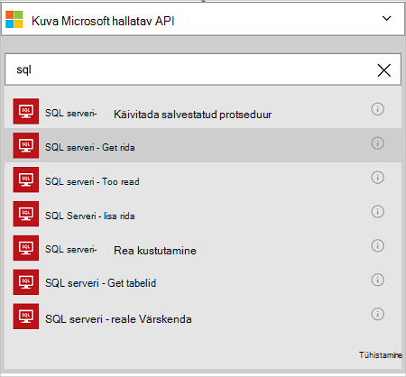
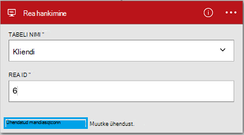

<properties
    pageTitle="Azure'i SQL-andmebaasi konnektor rakenduste loogika lisamine | Microsoft Azure'i"
    description="Azure'i SQL-andmebaasi konnektor REST API parameetritega ülevaade"
    services=""
    documentationCenter="" 
    authors="MandiOhlinger"
    manager="anneta"
    editor=""
    tags="connectors"/>

<tags
   ms.service="logic-apps"
   ms.devlang="na"
   ms.topic="article"
   ms.tgt_pltfrm="na"
   ms.workload="na" 
   ms.date="10/18/2016"
   ms.author="mandia"/>

# Azure'i SQL-andmebaasi konnektor kasutamise alustamine
Azure'i SQL-andmebaasi kasutamisega, luua oma ettevõtte jaoks töövood tabeli andmete haldamine. 

SQL-andmebaasiga, kus saate:

- Koostada oma töövoo lisamise uus klient klientide andmebaasi või tellimuse tellimused andmebaasi värskendamine.
- Saada andmeid sisaldav rida, uue rea lisamine ja kustutamine isegi toimingute abil. Näiteks kui kirje on loodud Dynamics CRM Online'i (päästik), siis rea lisamine Azure SQL andmebaasis (toiming). 

Selles teemas kirjeldatakse, kuidas kasutada SQL-andmebaasi konnektor loogika rakenduses ja ka on loetletud toimingud.

>[AZURE.NOTE] Selle versiooni see artikkel kehtib loogika rakendused üldiselt kättesaadav (GA). 

Loogika rakenduste kohta lisateabe saamiseks lugege teemat [mis on loogika rakendused](../app-service-logic/app-service-logic-what-are-logic-apps.md) ja [loogika rakenduse loomine](../app-service-logic/app-service-logic-create-a-logic-app.md).

## Ühenduse loomine SQL Azure'i andmebaas

Enne oma loogika rakenduse juurdepääsu mis tahes teenuse, esmalt luua *ühenduse* teenuse. Ühenduse pakub Ühenduvus loogika rakendus ja muu teenus. Näiteks SQL-andmebaasiga ühenduse loomisel SQL-andmebaasi *ühendus*. Ühenduse loomiseks sisestage te kasutate tavaliselt loote teenuse mandaat. Jah, SQL-andmebaasi, sisestage mandaat SQL-andmebaasiga ühenduse loomine. 

#### Ühenduse loomine

>[AZURE.INCLUDE [Create the connection to SQL Azure](../../includes/connectors-create-api-sqlazure.md)]

## Kasutage käivitamiseks

See konnektor ei saa mis tahes päästikute. Muud päästikute abil saate käivitada loogika rakendus, näiteks Korduvus päästik, lisamispäästiku HTTP Webhook päästikute saadaval muude konnektorid ja palju muud. [Loogika rakenduse loomine](../app-service-logic/app-service-logic-create-a-logic-app.md) pakub näide.

## Kasutage toimingut
    
Toimingu on poolt määratletud loogika rakenduse töövoo toimingu. [Lisateavet leiate teemast toimingute kohta](../app-service-logic/app-service-logic-what-are-logic-apps.md#logic-app-concepts).

1. Valige plussmärk. Kuvatakse mitu valikut: **Lisa toimingu**, **Lisa tingimus**või ühe **rohkem** suvandeid.

    

2. Valige **Lisa toiming**.

3. Tippige tekstiväljale "sql" loendi kõik saadaolevad toimingud.

     

4. Selles näites valige **SQL serveri - saada rida**. Kui ühendus on juba olemas, siis valige rippmenüü loendist **tabeli nimi** ja sisestage **Reaidentifikaator** soovite taastada.

    

    Kui teilt küsitakse ühendusteabe, seejärel sisestage üksikasjad ühenduse loomine. [Loo ühendus](connectors-create-api-sqlazure.md#create-the-connection) selles teemas kirjeldatakse neid atribuute. 

    > [AZURE.NOTE] Selles näites me tagasi rea tabelist. Selle rea andmete kuvamiseks lisada mõne muu toimingu, mis loob faili tabeli väljade abil. Näiteks OneDrive toimingu väljad Eesnimi ja perekonnanimi kasutava uue faili loomist pilveteenuse salvestusruumi konto lisamine. 

5. **Salvestage** muudatused (ülemises vasakus nurgas tööriistariba). Loogika rakenduse salvestatakse ja võib automaatselt lubatud.

## Tehnilised andmed

## SQL-andmebaasi toimingud
Toimingu on poolt määratletud loogika rakenduse töövoo toimingu. SQL-andmebaasi konnektor sisaldab järgmisi toiminguid. 

|Toiming|Kirjeldus|
|--- | ---|
|[ExecuteProcedure](connectors-create-api-sqlazure.md#execute-stored-procedure)|Käivitab SQL-i salvestatud protseduur|
|[GetRow](connectors-create-api-sqlazure.md#get-row)|Ühe rea toob SQL tabelist|
|[Täitmisaeg](connectors-create-api-sqlazure.md#get-rows)|SQL-i tabeli ridade toob|
|[InsertRow](connectors-create-api-sqlazure.md#insert-row)|Lisab uue rea SQL-i tabelisse|
|[DeleteRow](connectors-create-api-sqlazure.md#delete-row)|Kustutab rea SQL tabelist|
|[GetTables](connectors-create-api-sqlazure.md#get-tables)|Toob tabelid SQL-andmebaasiga|
|[UpdateRow](connectors-create-api-sqlazure.md#update-row)|Mõne olemasoleva SQL tabeli rea värskendused|

### Toimingu üksikasjad

Selles jaotises iga toimingu, sh nõutav või valikuline Sisestuskeel atribuudid ja mis tahes vastava väljundi seostatud konnektor teatud üksikasjade kuvamiseks.

#### Käivitada salvestatud protseduur
Käivitab SQL-i salvestatud toiming.  

| Atribuudi nimi| Kuvatav nimi |Kirjeldus|
| ---|---|---|
|protseduur * | Toimingu nimi | Salvestatud toimingu nime, mida soovite käivitada |
|parameetrite * | Parameetrid | Parameetrid on dünaamilise ja valige salvestatud protseduur põhjal.    Näiteks kui kasutate Adventure Worksi näidisandmebaasi, valige *ufnGetCustomerInformation* salvestatud protseduur. **Kliendi ID** sisendparameetrile kuvatakse. Sisestage "6" või mõne muu kliendi ID-d. |

Tärn (*) tähendab, et see atribuut on nõutav.

##### Väljundi üksikasjad
ProcedureResult: Viib tulemi salvestatud toimingu teostamine

| Atribuudi nimi | Andmetüüp | Kirjeldus |
|---|---|---|
|OutputParameters|objekti|Väljundi parameetrite väärtused |
|Tagastustähis|täisarv|Tagasi kood protseduuri. |
|ResultSets|objekti| Komplektid|

#### Rea hankimine 
Ühe rea toob SQL-i tabelist.  

| Atribuudi nimi| Kuvatav nimi |Kirjeldus|
| ---|---|---|
|tabeli * | Tabeli nimi |SQL-i tabeli nimi|
|ID * | Rea id |Rea toomiseks ainuidentifikaator|

Tärn (*) tähendab, et see atribuut on nõutav.

##### Väljundi üksikasjad
Üksuse

| Atribuudi nimi | Andmetüüp |
|---|---|
|ItemInternalId|string|

#### Ridade hankimine 
SQL-i tabeli ridade toob.  

|Atribuudi nimi| Kuvatav nimi|Kirjeldus|
| ---|---|---|
|tabeli *|Tabeli nimi|SQL-i tabeli nimi|
|$skip|Jäta loendamine|Vahele kirjete arv (vaikimisi = 0)|
|$top|Suurim lubatud Get loendamine|Suurim tuua kirjete arv (vaikimisi = 256)|
|$filter|Päringu filtreerimine|ODATA filtri päringu kirjete arvu piiramine|
|$orderby|Järjestusalus|Päring ODATA orderBy määratlemiseks järjestuse kirjed|

Tärn (*) tähendab, et see atribuut on nõutav.

##### Väljundi üksikasjad
ItemsList

| Atribuudi nimi | Andmetüüp |
|---|---|
|väärtus|massiiv|

#### Rea lisamine 
Lisab SQL-i tabelisse uue rea.  

|Atribuudi nimi| Kuvatav nimi|Kirjeldus|
| ---|---|---|
|tabeli *|Tabeli nimi|SQL-i tabeli nimi|
|üksuse *|Rea|Rea lisamiseks SQL-i määratud tabeli|

Tärn (*) tähendab, et see atribuut on nõutav.

##### Väljundi üksikasjad
Üksuse

| Atribuudi nimi | Andmetüüp |
|---|---|
|ItemInternalId|string|

#### Rea kustutamine 
Kustutab tabeli SQL-i rida.  

|Atribuudi nimi| Kuvatav nimi|Kirjeldus|
| ---|---|---|
|tabeli *|Tabeli nimi|SQL-i tabeli nimi|
|ID *|Rea id|Rea kustutamine ainuidentifikaator|

Tärn (*) tähendab, et see atribuut on nõutav.

##### Väljundi üksikasjad
Mitte keegi.

#### Tabelite hankimine 
Toob tabelid, SQL-i andmebaasist.  

On selle kõne parameetreid pole. 

##### Väljundi üksikasjad 
TablesList

| Atribuudi nimi | Andmetüüp |
|---|---|
|väärtus|massiiv|

#### Real Värskenda 
Mõne olemasoleva SQL tabeli rea värskendused.  

|Atribuudi nimi| Kuvatav nimi|Kirjeldus|
| ---|---|---|
|tabeli *|Tabeli nimi|SQL-i tabeli nimi|
|ID *|Rea id|Rea värskendamiseks ainuidentifikaator|
|üksuse *|Rea|Rea väärtustega värskendatud|

Tärn (*) tähendab, et see atribuut on nõutav.

##### Väljundi üksikasjad  
Üksuse

| Atribuudi nimi | Andmetüüp |
|---|---|
|ItemInternalId|string|

### HTTP vastused

Tehes kõned erinevaid toiminguid, saate teatud vastuseid. Järgmises tabelis kirjeldatakse vastuseid ja nende kirjeldused:  

|Nimi|Kirjeldus|
|---|---|
|200|Ok|
|202|Aktsepteeritud|
|400|Vigane päring|
|401|Volitused|
|403|Keelatud|
|404|Ei leitud|
|500|Sisemine serveritõrge. Tundmatu tõrge|
|Vaikimisi|Toiming nurjus.|

## Järgmised sammud

[Loogika rakenduse loomine](../app-service-logic/app-service-logic-create-a-logic-app.md). Tutvuge on saadaval konnektorid loogika rakendustes meie [API-de loendis](apis-list.md).
