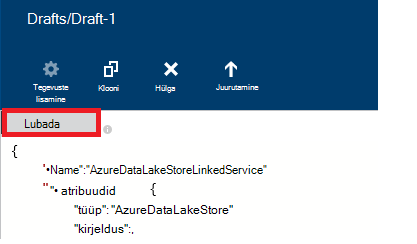

<properties
    pageTitle="Andmete teisaldamine/Azure Lake poest | Azure'i andmed Factory"
    description="Saate teada, kuidas Azure'i Lake andmesalve abil Azure'i andmed Factory ja sealt andmete teisaldamine"
    services="data-factory"
    documentationCenter=""
    authors="linda33wj"
    manager="jhubbard"
    editor="monicar"/>

<tags
    ms.service="data-factory"
    ms.workload="data-services"
    ms.tgt_pltfrm="na"
    ms.devlang="na"
    ms.topic="article"
    ms.date="09/27/2016"
    ms.author="jingwang"/>

# Andmete teisaldamine ja sealt Azure'i Lake andmesalve Azure'i andmed Factory abil
See artikkel kirjeldab, kuidas saate Kopeeri tegevuse on Azure andmete factory andmete teisaldamiseks teise andmesalve ja sealt Azure'i andmed Lake poe kaudu abil. Selles artiklis põhineb [andmete liikumine tegevuste](data-factory-data-movement-activities.md) artikkel, mis tutvustab andmete liikumine ülevaate Kopeeri tegevuse ja toetatud andmete poe kombinatsioonid.

> [AZURE.NOTE]
> Looge konto Azure andmesalve Lake enne Kopeeri tegevuse andmete teisaldamiseks Azure'i andmed Lake poest ja sealt Müügivõimaluste loomine. Azure'i andmesalve Lake kohta leiate teemast [Azure andmesalve Lake alustamine](../data-lake-store/data-lake-store-get-started-portal.md).
>  
> Vaadake üle soovitud [koostada esimese müügivõimaluste õppetükk](data-factory-build-your-first-pipeline.md) üksikasjalikud juhised andmete factory, lingitud teenused, andmekomplektide ja müügivõimaluste loomiseks. Andmete Factory üksuste loomiseks kasutada andmete Factory toimetaja või Visual Studio või Azure PowerShelli JSON pikad.

## Kopeerige andmed viisard
Lihtsaim viis loomiseks kopeerib andmete Azure'i andmesalve Lake on Kopeerige andmed viisardi abil. Vt [õpetus: müügivõimaluste koopia viisardi abil luua](data-factory-copy-data-wizard-tutorial.md) loomiseks Kopeerige andmed viisardi abil müügivõimaluste kiirülevaate selgituse. 

Järgmised näited annavad valimi JSON määratlused kasutatavad loomiseks [Azure portaali](data-factory-copy-activity-tutorial-using-azure-portal.md) või [Visual Studio](data-factory-copy-activity-tutorial-using-visual-studio.md) või [Azure PowerShelli](data-factory-copy-activity-tutorial-using-powershell.md)abil. Andmete kopeerimine ja Azure andmesalve Lake ja Azure'i bloobimälu kuvatakse. Siiski andmete võib olla kopeeritud **otse** mis tahes allikatest mis tahes valamud märgitud [siin](data-factory-data-movement-activities.md#supported-data-stores) Azure'i andmed Factory Kopeeri tegevuse abil.  

## Näide: Andmete kopeerimine Azure'i bloobimälu Azure'i andmesalve Lake
Järgmises näites on kuvatud.

1.  Lingitud teenuse tüüpi [AzureStorage](#azure-storage-linked-service-properties).
2.  Lingitud teenuse tüüpi [AzureDataLakeStore](#azure-data-lake-linked-service-properties).
3.  Mõne Sisestuskeel [andmekomplekti](data-factory-create-datasets.md) tüüpi [AzureBlob](#azure-blob-dataset-type-properties).
4.  Mõne väljundi [andmekomplekti](data-factory-create-datasets.md) tüüpi [AzureDataLakeStore](#azure-data-lake-dataset-type-properties).
4.  [Müügivõimaluste](data-factory-create-pipelines.md) Kopeeri tegevust, mis kasutab [BlobSource](#azure-blob-copy-activity-type-properties) ja [AzureDataLakeStoreSink](#azure-data-lake-copy-activity-type-properties).

Valimi kopeerib aja andmesarja mõne Azure'i bloobimälu Azure'i andmesalve Lake tunnis. Nende proovide kasutatakse atribuutide JSON on kirjeldatud jaotiste jälgimise näidised.

**Azure'i lingitud salvestusteenus:**

    {
      "name": "StorageLinkedService",
      "properties": {
        "type": "AzureStorage",
        "typeProperties": {
          "connectionString": "DefaultEndpointsProtocol=https;AccountName=<accountname>;AccountKey=<accountkey>"
        }
      }
    }

**Azure'i andmed Lake lingitud teenuse:**

    {
        "name": "AzureDataLakeStoreLinkedService",
        "properties": {
            "type": "AzureDataLakeStore",
            "typeProperties": {
                "dataLakeStoreUri": "https://<accountname>.azuredatalakestore.net/webhdfs/v1",
                "sessionId": "<session ID>",
                "authorization": "<authorization URL>"
            }
        }
    }

### Azure'i andmed Lake lingitud teenuse andmete Factory redaktoris loomiseks
Järgmiste toimingute juhised loomise teenuse Azure Lake andmesalve lingitud andmete Factory Editori kasutamise kohta.

1. Klõpsake käsku **uute andmete talletamiseks** ja valige **Azure andmesalve Lake**.
2. Sisestage **dataLakeStoreUri** atribuudi JSON redaktor andmete järve URI.
3. Klõpsake käsku **Autoriseerin** nuppu. Peaksite nägema hüpikakna.

    

4. Sisse logimiseks kasutage oma kasutajanimi ja parool ja klõpsake soovitud JSON atribuudi **Luba** olema määratud väärtuse kohe.
5. (valikuline) Määrata näiteks **account_name**, **subscriptionID**ja **resourceGroupName** valikuliste parameetrite väärtused on JSON (või) soovitud JSON atribuutidest kustutada.
6. Klõpsake **Deploy** käsuriba lingitud teenuse kasutuselevõtuks.

> [AZURE.IMPORTANT] Teie loodud **Autoriseerin** nupu abil autoriseerimine koodi aegub pärast uuesti. **Reauthorize** abil **Autoriseerin** nupule, kui **Luba on aegunud** ja ümberkorraldamine lingitud teenus. Leiate [Azure'i andmed Lake lingitud Store'i](#azure-data-lake-store-linked-service-properties) jaotisest. 

**Azure'i bloobimälu Sisestuskeel andmekomplekti:**

Andmed on te soovite uue bloobimälu tunnis (sagedus: tund, intervall: 1). Kausta tee ja faili nimi soovitud bloobimälu dünaamiliselt hinnatakse sellest osast, mis on töödeldud algusaeg. Kausta tee kasutab aasta, kuu ja päeva osa algusaeg ja faili nimi kasutab tund osa algusaeg. "välise": "true" säte teatab andmete Factory teenus, et tabelis on väliste andmete factory ja ei esitata andmete factory toimingu.

    {
      "name": "AzureBlobInput",
      "properties": {
        "type": "AzureBlob",
        "linkedServiceName": "StorageLinkedService",
        "typeProperties": {
          "folderPath": "mycontainer/myfolder/yearno={Year}/monthno={Month}/dayno={Day}",
          "partitionedBy": [
            {
              "name": "Year",
              "value": {
                "type": "DateTime",
                "date": "SliceStart",
                "format": "yyyy"
              }
            },
            {
              "name": "Month",
              "value": {
                "type": "DateTime",
                "date": "SliceStart",
                "format": "MM"
              }
            },
            {
              "name": "Day",
              "value": {
                "type": "DateTime",
                "date": "SliceStart",
                "format": "dd"
              }
            },
            {
              "name": "Hour",
              "value": {
                "type": "DateTime",
                "date": "SliceStart",
                "format": "HH"
              }
            }
          ]
        },
        "external": true,
        "availability": {
          "frequency": "Hour",
          "interval": 1
        },
        "policy": {
          "externalData": {
            "retryInterval": "00:01:00",
            "retryTimeout": "00:10:00",
            "maximumRetry": 3
          }
        }
      }
    }

**Azure'i andmed Lake väljund andmekomplekti:**

Valimi kopeerib andmete Azure'i andmed Lake poest. Uued andmed on eksemplaride andmete Lake talletada tunnis.

    {
        "name": "AzureDataLakeStoreOutput",
        "properties": {
            "type": "AzureDataLakeStore",
            "linkedServiceName": "AzureDataLakeStoreLinkedService",
            "typeProperties": {
                "folderPath": "datalake/output/"
            },
            "availability": {
                "frequency": "Hour",
                "interval": 1
            }
        }
    }

**Torujuhe Kopeeri tegevuse abil:**

Tulemas on Kopeeri tegevust, mis on konfigureeritud kasutama sisend- ja andmekomplektide ja on plaanitud käivituma tunnis. Tulemas JSON määratlus **Reaallika** tüüp väärtuseks **BlobSource** ja **valamu** tüüp väärtuseks **AzureDataLakeStoreSink**.

    {  
        "name":"SamplePipeline",
        "properties":
        {  
            "start":"2014-06-01T18:00:00",
            "end":"2014-06-01T19:00:00",
            "description":"pipeline with copy activity",
            "activities":
            [  
                {
                    "name": "AzureBlobtoDataLake",
                    "description": "Copy Activity",
                    "type": "Copy",
                    "inputs": [
                    {
                        "name": "AzureBlobInput"
                    }
                    ],
                    "outputs": [
                    {
                        "name": "AzureDataLakeStoreOutput"
                    }
                    ],
                    "typeProperties": {
                        "source": {
                            "type": "BlobSource",
                            "treatEmptyAsNull": true,
                            "blobColumnSeparators": ","
                        },
                        "sink": {
                            "type": "AzureDataLakeStoreSink"
                        }
                    },
                    "scheduler": {
                        "frequency": "Hour",
                        "interval": 1
                    },
                    "policy": {
                        "concurrency": 1,
                        "executionPriorityOrder": "OldestFirst",
                        "retry": 0,
                        "timeout": "01:00:00"
                    }
                }
            ]
        }
    }

## Näide: Andmete kopeerimine Azure'i Lake poest Azure'i bloobimälu
Järgmises näites on kuvatud.

1.  Lingitud teenuse tüüpi [AzureDataLakeStore](#azure-data-lake-linked-service-properties).
2.  Lingitud teenuse tüüpi [AzureStorage](#azure-storage-linked-service-properties).
3.  Mõne Sisestuskeel [andmekomplekti](data-factory-create-datasets.md) tüüpi [AzureDataLakeStore](#azure-data-lake-dataset-type-properties).
4.  Mõne väljundi [andmekomplekti](data-factory-create-datasets.md) tüüpi [AzureBlob](#azure-blob-dataset-type-properties).
5.  [Müügivõimaluste](data-factory-create-pipelines.md) Kopeeri tegevust, mis kasutab [AzureDataLakeStoreSource](#azure-data-lake-copy-activity-type-properties) ja [BlobSink](#azure-blob-copy-activity-type-properties)

Valimi kopeerib aja andmesarja Azure'i andmed Lake poest soovitud Azure'i bloobimälu tunnis. Nende proovide kasutatakse atribuutide JSON on kirjeldatud jaotiste jälgimise näidised.

**Azure'i andmesalve Lake lingitud teenuse:**

    {
        "name": "AzureDataLakeStoreLinkedService",
        "properties": {
            "type": "AzureDataLakeStore",
            "typeProperties": {
                "dataLakeStoreUri": "https://<accountname>.azuredatalakestore.net/webhdfs/v1",
                "sessionId": "<session ID>",
                "authorization": "<authorization URL>"
            }
        }
    }

> [AZURE.NOTE] Vaadake juhiseid teemas eelmise proovi autoriseerimine URL-i hankimine.  

**Azure'i lingitud salvestusteenus:**

    {
      "name": "StorageLinkedService",
      "properties": {
        "type": "AzureStorage",
        "typeProperties": {
          "connectionString": "DefaultEndpointsProtocol=https;AccountName=<accountname>;AccountKey=<accountkey>"
        }
      }
    }

**Azure'i andmed Lake Sisestuskeel andmekomplekti:**

Säte **"välise": true** andmete Factory teenuse teatab, et tabelis on väliste andmete factory ja ei esitata andmete factory toimingu.

    {
        "name": "AzureDataLakeStoreInput",
        "properties":
        {
            "type": "AzureDataLakeStore",
            "linkedServiceName": "AzureDataLakeStoreLinkedService",
            "typeProperties": {
                "folderPath": "datalake/input/",
                "fileName": "SearchLog.tsv",
                "format": {
                    "type": "TextFormat",
                    "rowDelimiter": "\n",
                    "columnDelimiter": "\t"
                }
            },
            "external": true,
            "availability": {
                "frequency": "Hour",
                "interval": 1
            },
            "policy": {
                "externalData": {
                    "retryInterval": "00:01:00",
                    "retryTimeout": "00:10:00",
                    "maximumRetry": 3
                }
            }
        }
    }

**Azure'i bloobimälu väljund andmekomplekti:**

Andmed on kirjutatud uue bloobimälu tunnis (sagedus: tund, intervall: 1). Kausta tee on bloobimälu hinnatakse dünaamiliselt algusaja sellest osast, mis töötlemise põhjal. Kausta tee kasutab aasta, kuu, päev ja tunni osad algusaeg.

    {
      "name": "AzureBlobOutput",
      "properties": {
        "type": "AzureBlob",
        "linkedServiceName": "StorageLinkedService",
        "typeProperties": {
          "folderPath": "mycontainer/myfolder/yearno={Year}/monthno={Month}/dayno={Day}/hourno={Hour}",
          "partitionedBy": [
            {
              "name": "Year",
              "value": {
                "type": "DateTime",
                "date": "SliceStart",
                "format": "yyyy"
              }
            },
            {
              "name": "Month",
              "value": {
                "type": "DateTime",
                "date": "SliceStart",
                "format": "MM"
              }
            },
            {
              "name": "Day",
              "value": {
                "type": "DateTime",
                "date": "SliceStart",
                "format": "dd"
              }
            },
            {
              "name": "Hour",
              "value": {
                "type": "DateTime",
                "date": "SliceStart",
                "format": "HH"
              }
            }
          ],
          "format": {
            "type": "TextFormat",
            "columnDelimiter": "\t",
            "rowDelimiter": "\n"
          }
        },
        "availability": {
          "frequency": "Hour",
          "interval": 1
        }
      }
    }

**Torujuhe Kopeeri tegevusega:**

Tulemas on Kopeeri tegevust, mis on konfigureeritud kasutama sisend- ja andmekomplektide ja on plaanitud käivituma tunnis. Tulemas JSON määratlus **Reaallika** tüüp väärtuseks **AzureDataLakeStoreSource** ja **valamu** tüüp väärtuseks **BlobSink**.

    {  
        "name":"SamplePipeline",
        "properties":{  
            "start":"2014-06-01T18:00:00",
            "end":"2014-06-01T19:00:00",
            "description":"pipeline for copy activity",
            "activities":[  
                {
                    "name": "AzureDakeLaketoBlob",
                    "description": "copy activity",
                    "type": "Copy",
                    "inputs": [
                      {
                        "name": "AzureDataLakeStoreInput"
                      }
                    ],
                    "outputs": [
                      {
                        "name": "AzureBlobOutput"
                      }
                    ],
                    "typeProperties": {
                        "source": {
                            "type": "AzureDataLakeStoreSource",
                        },
                        "sink": {
                            "type": "BlobSink"
                        }
                    },
                    "scheduler": {
                        "frequency": "Hour",
                        "interval": 1
                    },
                    "policy": {
                        "concurrency": 1,
                        "executionPriorityOrder": "OldestFirst",
                        "retry": 0,
                        "timeout": "01:00:00"
                    }
                }
             ]
        }
    }

## Azure'i andmed Lake Store'i lingitud atribuudid

Azure'i andmed factory, mis Azure Storage lingitud teenuse abil saate Azure storage konto linkimine. Järgmises tabelis on ära toodud JSON elementide teatud Azure Storage lingitud teenuse kirjeldus.

| Atribuut | Kirjeldus | Nõutav |
| :-------- | :----------- | :-------- |
| tüüp | Atribuudi tüüp väärtuseks peab olema seatud: **AzureDataLakeStore** | Jah |
| dataLakeStoreUri | Määrake Azure'i andmesalve Lake konto teave. See on järgmises vormingus: https://<Azure Data Lake account name>.azuredatalakestore.net/webhdfs/v1 | Jah |
| luba | **Andmete Factory Editor** **Autoriseerin** nuppu ja sisestage oma mandaat, mis määrab selle atribuudi Luba automaatselt loodud URL-i.  | Jah |
| SeansiId | OAuthi seansi OAuthi autoriseerimine seansi ID. Iga seansi id on kordumatu ja võib kasutada ainult üks kord. See säte luuakse automaatselt, kui andmete Factory redaktori kasutamiseks. | Jah |  
| account_name | Andmete lake konto nimi | Ei |
| subscriptionId | Azure'i Tellimuse ID-ga. | Ei (kui pole määratud, tellimusele, andmete factory kasutatakse). |
| resourceGroupName |  Azure'i ressursirühma nimi | Ei (kui pole määratud, ressursirühm andmete factory, kasutatakse). |

## Turbeloa aegumise 
Saate luua abil **Autoriseerin** nuppu Luba kood aegub pärast uuesti. Erinevat tüüpi kasutajakontode aegumise korda leiate järgmisest tabelist. Võidakse kuvada järgmine tõrketeade sõnum autentimine **Luba on aegunud**: "mandaat toiming tõrge: invalid_grant - AADSTS70002: identimisteabe valideerimisel ilmnes tõrge. AADSTS70008: Esitatud juurdepääsu andmine on aegunud või tühistatud. Jälgimise ID: d18629e8-af88-43c5-88e3-d8419eb1fca1 korrelatsiooni ID: fac30a0c-6be6-4e02-8d69-a776d2ffefd7 ajatempli: 2015-12-15 21-09-31Z ".

| Kasutaja tüüp | Pärast lõppemist |
| :-------- | :----------- | 
| Azure Active Directory ei hallata kasutajakontosid (@hotmail.com, @live.com, jne.). | 12 tundi |
| Kasutajakonto hallatavate, Azure Active Directory (AAD) | 14 päeva pärast viimast sektorit käivitada.   90 päeva, kui mõnda sektorit põhjal OAuthi lingitud teenus töötab vähemalt ühe korra 14 päeva jooksul. |

Kui muudate parooli aegumise Turbeloa varem, luba on aegunud kohe ja kuvatakse tõrketeade, mis on selles jaotises. 

Vältige/lahendamiseks selle vea, kasutades **Autoriseerin** reauthorize nuppu **Luba on aegunud** ja ümberkorraldamine lingitud teenus. Saate luua ka programmiliselt koodiga kohta järgmisest jaotisest **SeansiId** ja **Luba** atribuutide väärtused:

### Genereerida programmiliselt SeansiId ja luba väärtused 

    if (linkedService.Properties.TypeProperties is AzureDataLakeStoreLinkedService ||
        linkedService.Properties.TypeProperties is AzureDataLakeAnalyticsLinkedService)
    {
        AuthorizationSessionGetResponse authorizationSession = this.Client.OAuth.Get(this.ResourceGroupName, this.DataFactoryName, linkedService.Properties.Type);

        WindowsFormsWebAuthenticationDialog authenticationDialog = new WindowsFormsWebAuthenticationDialog(null);
        string authorization = authenticationDialog.AuthenticateAAD(authorizationSession.AuthorizationSession.Endpoint, new Uri("urn:ietf:wg:oauth:2.0:oob"));

        AzureDataLakeStoreLinkedService azureDataLakeStoreProperties = linkedService.Properties.TypeProperties as AzureDataLakeStoreLinkedService;
        if (azureDataLakeStoreProperties != null)
        {
            azureDataLakeStoreProperties.SessionId = authorizationSession.AuthorizationSession.SessionId;
            azureDataLakeStoreProperties.Authorization = authorization;
        }

        AzureDataLakeAnalyticsLinkedService azureDataLakeAnalyticsProperties = linkedService.Properties.TypeProperties as AzureDataLakeAnalyticsLinkedService;
        if (azureDataLakeAnalyticsProperties != null)
        {
            azureDataLakeAnalyticsProperties.SessionId = authorizationSession.AuthorizationSession.SessionId;
            azureDataLakeAnalyticsProperties.Authorization = authorization;
        }
    }

Teemadest [AzureDataLakeStoreLinkedService klassi](https://msdn.microsoft.com/library/microsoft.azure.management.datafactories.models.azuredatalakestorelinkedservice.aspx), [AzureDataLakeAnalyticsLinkedService](https://msdn.microsoft.com/library/microsoft.azure.management.datafactories.models.azuredatalakeanalyticslinkedservice.aspx)ja [AuthorizationSessionGetResponse klassi](https://msdn.microsoft.com/library/microsoft.azure.management.datafactories.models.authorizationsessiongetresponse.aspx) koodis kasutada andmete Factory klassid üksikasjad. Lisage viide **2.9.10826.1824** versiooni **Microsoft.IdentityModel.Clients.ActiveDirectory.WindowsForms.dll** WindowsFormsWebAuthenticationDialog klassi koodis kasutada. 
 

## Azure'i andmed Lake andmekomplekti tüüp atribuudid

JSON jaotised ja atribuute määratlemine andmekomplektide täieliku loendi leiate artiklist [loomine andmekomplektide](data-factory-create-datasets.md) . Jaotiste, nt struktuuri, kättesaadavus ja Andmekomplekt JSON poliitika on sarnased kõigi andmekomplekti tüüpide (Azure SQL, Azure'i bloobimälu, Azure'i tabeli jne).

Jaotise **typeProperties** erineb iga tüüpi andmekomplekti ja teave asukohta, vormindada, olevad andmed. Andmekomplekti typeProperties jaotises tüüp **AzureDataLakeStore** andmekomplekti on järgmised atribuudid.

| Atribuut | Kirjeldus | Nõutav |
| :-------- | :----------- | :-------- |
| folderPath | Container ja Azure andmete Lake kausta tee talletada. | Jah |
| faili nimi | Azure'i andmed Lake poes faili nimi. faili nimi on valikuline ja tõstutundlik.   Kui määrate faili nimi, töötab kindla faili tegevuse (sh Kopeeri).  Kui faili nimi pole määratud, sisaldab Kopeeri Sisestuskeel andmekogumi folderPath kõik failid.  Kui faili nimi soovitud väljundi andmekogumi pole määratud, loodud faili nimi oleks järgmine järgmises vormingus: andmed. <Guid>txt (nt:: Data.0a405f8a-93ff-4c6f-b3be-f69616f1df7a.txt | Ei |
| partitionedBy | partitionedBy on mõni kohustuslik atribuut. Selle abil saate määrata dünaamiline folderPath ja sarja kellaajaandmete faili nimi. Näiteks saate folderPath parameetriga andmete iga tund. Lisateavet ja näited jaotisest [kasutamine partitionedBy atribuut](#using-partitionedby-property) . | Ei |
| vormindamine | Järgmist tüüpi vormingus toetatud: **tekstivorming**, **AvroFormat**, **JsonFormat**, **OrcFormat**, **ParquetFormat**. Need väärtused jaotises Vorming atribuudi **Tüüp** väärtuseks. Vt lisateavet [Täpsustades tekstivorming](#specifying-textformat), [Täpsustades AvroFormat](#specifying-avroformat), [Täpsustades JsonFormat](#specifying-jsonformat), [Täpsustades OrcFormat](#specifying-orcformat)ja [Täpsustades ParquetFormat](#specifying-parquetformat) lõigud. Kui soovite kopeerida faile-on vahel (kahendarvu koopia) salvestab failipõhiste saate vahele jätta vorming jaotisele nii sisend- ja andmekomplekti määratlusi.| Ei
| tihendamine | Määrake tüüp ja taseme tihendamise andmete jaoks. Toetatud tüübid on: **GZip**, **Deflate**, ja **BZip2** ja toetatud tasemed on: **optimaalne** ja **kiireim**. Praegu ei toetata tihendussätted andmete **AvroFormat** või **OrcFormat**. Lisateavet leiate teemast [tihendamise tugiteenuste](#compression-support) jaotises.  | Ei |

### PartitionedBy atribuudi abil
Saate määrata dünaamiline folderPath ja failinimi sarja kellaajaandmete **partitionedBy** jaotis, andmete Factory makrod ja süsteemi muutujad: SliceStart ja SliceEnd, mis näitavad, algus- ja lõpuaegade antud andmete sektorit.

Lugege [Andmekogumite loomine](data-factory-create-datasets.md) ja [plaanimine ja täitmise](data-factory-scheduling-and-execution.md) artikleid mõista aja sarja andmekomplektide, ajastamise ja sektorid rohkem üksikasju.

#### Näide 1

    "folderPath": "wikidatagateway/wikisampledataout/{Slice}",
    "partitionedBy":
    [
        { "name": "Slice", "value": { "type": "DateTime", "date": "SliceStart", "format": "yyyyMMddHH" } },
    ],

Selles näites {sektorit} on asendatud funktsiooniga määratud andmete Factory süsteemi muutuja SliceStart vormingus (YYYYMMDDHH) väärtuse. Funktsiooni SliceStart viitab alguskellaaeg sektorit. Funktsiooni folderPath on erinev iga sektorit. Näide: wikidatagateway/wikisampledataout/2014100103 või wikidatagateway/wikisampledataout/2014100104

#### Näide 2

    "folderPath": "wikidatagateway/wikisampledataout/{Year}/{Month}/{Day}",
    "fileName": "{Hour}.csv",
    "partitionedBy":
     [
        { "name": "Year", "value": { "type": "DateTime", "date": "SliceStart", "format": "yyyy" } },
        { "name": "Month", "value": { "type": "DateTime", "date": "SliceStart", "format": "MM" } },
        { "name": "Day", "value": { "type": "DateTime", "date": "SliceStart", "format": "dd" } },
        { "name": "Hour", "value": { "type": "DateTime", "date": "SliceStart", "format": "hh" } }
    ],

Selles näites ekstraktitakse aasta, kuu, päev ja kellaaeg SliceStart üheks eraldi muutujate, mida kasutatakse atribuutide folderPath ja faili nimi.

[AZURE.INCLUDE [data-factory-file-format](../../includes/data-factory-file-format.md)]
 

### Tihendamise tugi  
Suurte andmekogumite töötlemine, võivad põhjustada SV- ja võrgu kitsaskohtade. Seetõttu salvestab tihendatud andmete saate mitte ainult kiirendamiseks Andmeedastus üle võrgu ja säästa kettaruumi, kuid ka too big andmete töötlemise olulisi jõudlustäiustusi. Praegu on toetatud tihendamise failipõhiste andmete poed nagu Azure'i bloobimälu või kohapealse failisüsteemis.  

Tihendamise andmepaani määramiseks kasutage atribuudi **tihendamise** andmekomplekti JSON, nagu järgmises näites:   

    {  
        "name": "AzureDatalakeStoreDataSet",  
        "properties": {  
            "availability": {  
                "frequency": "Day",  
                "interval": 1  
            },  
            "type": "AzureDatalakeStore",  
            "linkedServiceName": "DataLakeStoreLinkedService",  
            "typeProperties": {  
                "fileName": "pagecounts.csv.gz",  
                "folderPath": "compression/file/",  
                "compression": {  
                    "type": "GZip",  
                    "level": "Optimal"  
                }  
            }  
        }  
    }  
 
**Tihendamine** jaotises on kaks atribuudid.  
  
- **Tüüp:** tihendamise kodekiga, mis võib olla **GZIP**, **Deflate** või **BZIP2**.  
- **Tase:** tihendamise-suhte, mis võib olla **optimaalne** või **kiireim**. 
    - **Kiireim:** Tihendamise toiming tuleb täita nii kiiresti kui võimalik, isegi juhul, kui fail on tihendatud optimaalselt. 
    - **Optimaalne**: tihendamise toiming peaks olema optimaalselt tihendatud, isegi kui toiming võtab rohkem aega. 
    
    Lisateavet leiate teemast [Tihendamise tase](https://msdn.microsoft.com/library/system.io.compression.compressionlevel.aspx) . 

Oletame, et kasutatakse andmekomplekti valimi Kopeeri tegevuse väljund. Kopeeri tegevuse tihendab väljundi andmed koos GZIP kodekiga optimaalse suhe abil ja seejärel kirjutab tihendatud andmete faili, pagecounts.csv.gz Azure'i andmed Lake poest.   

Kui määrate atribuudi tihendamise mõne Sisestuskeel andmekomplekti JSON, loeb tulemas tihendatud andmete allikas. Kui määrate atribuudi mõne väljundi andmekomplekti JSON, kopeerige tegevuse kirjutage tihendatud andmete sihtkohta. Siin on mõned valimi stsenaariumid. 

- Lugege GZIP tihendatud andmete Azure'i andmed Lake poe kaudu lahti see ja kirjutage tulemi andmed Azure SQL-andmebaasi. Määratlege Sisestuskeel Azure'i andmesalve Lake andmekomplekti koos tihendamise JSON atribuudi sel juhul. 
- Lihttekstifail kohapealse failisüsteemi kaudu andmeid lugeda, tihendada, kasutades GZip vorming ja kirjutada tihendatud andmete Azure'i andmesalve Lake. Määratlege väljundi Azure'i andmed Lake andmekomplekti tihendamise JSON atribuudi sel juhul.  
- GZIP tihendatud andmete Azure'i andmed Lake poest, lahti see, kasutades BZIP2 tihendamine, andmete lugemine ja kirjutamine tulemi Azure'i andmed Lake poest. Tihendamise tüübi määramine GZIP ja BZIP2 seadmine sisendit ja väljund andmekomplektide vastavalt.   

## Azure'i andmed Lake Kopeeri tegevuse tüüp atribuudid  
Jaotised ja atribuudid, mis on saadaval tegevuste määratlemiseks täieliku loendi leiate artiklist [Torujuhtmete loomine](data-factory-create-pipelines.md) . Näiteks nimi, kirjeldus, sisestus- ja väljundi tabelite ja poliitika atribuudid on saadaval kõigi tegevuse tüüp.

Tegevuse typeProperties jaotise saadaolevad atribuudid erinevad teiselt iga tegevuse tüüp. Kopeeri tegevuste, nad sõltuvalt allikate ja neeldajate tüübid

**AzureDataLakeStoreSource** toetab **typeProperties** jaotist järgmised atribuudid.

| Atribuut | Kirjeldus | Lubatud väärtus | Nõutav |
| -------- | ----------- | -------------- | -------- |
| Rekursiivsed | Näitab, kas andmed on kirjutuskaitstud rekursiivselt sub kaustad või ainult määratud kausta. | True False (vaikeväärtus) | Ei |

**AzureDataLakeStoreSink** toetab **typeProperties** jaotist järgmised atribuudid.

| Atribuut | Kirjeldus | Lubatud väärtus | Nõutav |
| -------- | ----------- | -------------- | -------- |
| copyBehavior | Saate määrata Kopeeri käitumine. | **PreserveHierarchy:** säilitab faili hierarhia sihtkaust. Suhteline lähtefail allikas kausta tee on identne suhteline tee sihtkaust sihtfail.  **FlattenHierarchy:** kõik failid kaustast allika luuakse sihtkaust esimese taseme. Target (sihtkoht) faile luuakse automaatselt loodud nimega.  **MergeFiles:** liidab kõik failid kaustast andmeallika ühe faili. Kui faili/bloobimälu nimi pole määratud, ühendatud faili nimi oleks määratud nimi; muul juhul oleks automaatselt loodud faili nimi. | Ei |

[AZURE.INCLUDE [data-factory-structure-for-rectangualr-datasets](../../includes/data-factory-structure-for-rectangualr-datasets.md)]

[AZURE.INCLUDE [data-factory-type-conversion-sample](../../includes/data-factory-type-conversion-sample.md)]

[AZURE.INCLUDE [data-factory-column-mapping](../../includes/data-factory-column-mapping.md)]

## Jõudluse ja häälestamine  
Vaata [Kopeeri tegevuse jõudlus ja häälestamine juhend](data-factory-copy-activity-performance.md) Lisateavet peamised tegurid selle mõju jõudlust andmete liikumine (Kopeeri tegevus) Azure'i andmed Factory ja optimeerida seda mitmel viisil.
