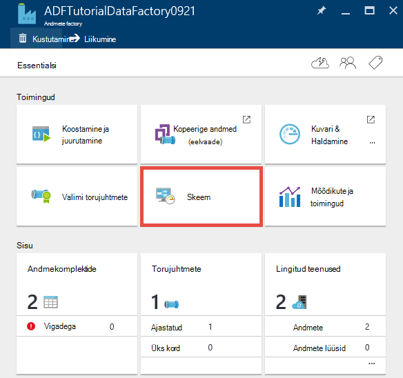

<properties 
    pageTitle="Õpetus: Luua müügivõimaluste Kopeeri tegevuse Azure'i portaalis | Microsoft Azure'i" 
    description="Selles õpetuses loote mõnda Azure'i andmed Factory müügivõimaluste Kopeeri tegevuse Azure'i portaalis andmete Factory redaktori abil." 
    services="data-factory" 
    documentationCenter="" 
    authors="spelluru" 
    manager="jhubbard" 
    editor="monicar"/>

<tags 
    ms.service="data-factory" 
    ms.workload="data-services" 
    ms.tgt_pltfrm="na" 
    ms.devlang="na" 
    ms.topic="get-started-article" 
    ms.date="09/16/2016" 
    ms.author="spelluru"/>

# Õpetus: Luua müügivõimaluste Kopeeri tegevuse Azure'i portaalis
> [AZURE.SELECTOR]
- [Ülevaade ja eeltingimused](data-factory-copy-data-from-azure-blob-storage-to-sql-database.md)
- [Kopeerige viisard](data-factory-copy-data-wizard-tutorial.md)
- [Azure'i portaal](data-factory-copy-activity-tutorial-using-azure-portal.md)
- [Visual Studio](data-factory-copy-activity-tutorial-using-visual-studio.md)
- [PowerShelli](data-factory-copy-activity-tutorial-using-powershell.md)
- [Azure'i ressursihaldur Mall](data-factory-copy-activity-tutorial-using-azure-resource-manager-template.md)
- [REST API-GA](data-factory-copy-activity-tutorial-using-rest-api.md)
- [.NET-I API-GA](data-factory-copy-activity-tutorial-using-dotnet-api.md)

Selle õpetuse näidatakse, kuidas luua ja jälgida Azure'i andmed factory, mis Azure'i portaalis. Müügivõimaluste rakenduses andmete factory kasutab Kopeeri tegevuse Azure'i bloobimälu andmete kopeerimine Azure'i SQL-andmebaasi.

Siin on toimingud, saate teha selle õpetuse osana.

Toiming | Kirjeldus
-----| -----------
[Azure'i andmed on Factory loomine](#create-data-factory) | Selles etapis loote Azure'i andmed factory, mis nimega **ADFTutorialDataFactory**.  
[Looge lingitud teenused](#create-linked-services) | Selles etapis tuleb teil luua kaks lingitud teenuste: **AzureStorageLinkedService** ja **AzureSqlLinkedService**.   Funktsiooni AzureStorageLinkedService lingid Azure salvestusruumi ja AzureSqlLinkedService linke SQL Azure'i andmebaasi soovitud ADFTutorialDataFactory. Sisendandmete jaoks tulemas asub bloobimälu ümbrises Azure'i bloobimälu salvestusruum ja selle väljundi andmed salvestatakse SQL Azure'i andmebaasi tabelisse. Seega saate lisada need kaks andmete poed lingitud teenuste andmete factory.      
[Sisestusmeetodi loomine ja andmekomplektide väljund](#create-datasets) | Eelmises juhises loodud lingitud teenuseid, mis viitavad andmeid talletab sisend andmeid sisaldavad. Selles etapis tuleb määratleda kaks kogumid - **InputDataset** ja **OutputDataset** -, mis tähistavad sisend andmeid, mis on talletatud andmed poed.   InputDataset, teie määratud bloobimälu, lähteandmetega ja selle OutputDataset sisaldava bloobimälu ümbris, teie määratud SQL tabel, mis talletatakse väljundi andmeid. Saate määrata ka muid atribuute, nt struktuuri, kättesaadavus ja poliitika. 
[Müügivõimaluste loomine](#create-pipeline) | Selles etapis loote müügivõimaluste nimega **ADFTutorialPipeline** on ADFTutorialDataFactory sisse.   Saate lisada **Kopeeri tegevuse** kohaletoimetamisel, mis on Azure input koopiaid andmete Bloobivahemälu väljundi Azure SQL-i tabelisse. Kopeeri tegevuse sooritab Azure'i andmed Factory andmete liikumine. See on tootja globaalselt saadaval teenust, mida saate kopeerida andmeid erinevate andmete poed turvaline, usaldusväärseid ja scalable viisil. Vt [Andmete liikumine tegevuste](data-factory-data-movement-activities.md) artikkel Kopeeri tegevuse üksikasjad. 
[Müügivõimaluste jälgimine](#monitor-pipeline) | Selles etapis tuleb jälgida sektoritele sisend- ja tabelid, kasutades Azure portaali.

## Eeltingimused 
Täieliku eeltingimused enne selle õpetuse läbimiseks [Õpetuse ülevaade](data-factory-copy-data-from-azure-blob-storage-to-sql-database.md) artiklis toodud.

## Andmete factory loomine
Selles etapis tuleb teil Azure portaali loomiseks kasutada Azure'i andmed factory, mis nimega **ADFTutorialDataFactory**.

1.  Pärast sisselogimist [Azure portaali](https://portal.azure.com/), klõpsake nuppu **Uus**, valige **ärianalüüsi + Analytics**, ja klõpsake **Andmete Factory**. 

      

6. Klõpsake **uue andmete factory** keel:
    1. Sisestage **ADFTutorialDataFactory** **nimi**. 
    
        

        Azure'i andmed factory nimi peab olema **globaalselt kordumatu**. Kui teile kuvatakse järgmine tõrketeade, muuta andmete factory (nt yournameADFTutorialDataFactory) nime ja proovige uuesti luua. Nimede reeglid andmete Factory artefakte [Andmete Factory - nime andmise reeglid](data-factory-naming-rules.md) teemat.
    
            Data factory name “ADFTutorialDataFactory” is not available  
     
        
    2. Valige oma Azure'i **tellimus**.
    3. Ressursirühma, tehke järgmist.
        1. Valige **Kasuta olemasolevat**ja ressursside olemasolevasse rühma rippmenüü loendist. 
        2. Valige **Loo uus**ja sisestage nimi ressursirühma.   
    
            Osa selle õpetuse juhised Oletame, et kasutada nimi: **ADFTutorialResourceGroup** ressursirühma. Ressursi rühmade kohta leiate teemast [Ressursi kasutamine rühmi, et hallata oma Azure ressursse](../azure-resource-manager/resource-group-overview.md).  
    4. Valige **asukoht** , andmete factory. Rippmenüü loendis kuvatakse ainult need regioonid, mille andmeid Factory teenus ei toeta.
    5. Valige **Kinnita Startboard**.     
    6. Klõpsake nuppu **Loo**.

        > [AZURE.IMPORTANT] Andmete Factory eksemplari loomiseks peate olema [Andmete Factory kaasautori](../active-directory/role-based-access-built-in-roles.md/#data-factory-contributor) roll tasemel tellimuse/ressursi rühma liige.
        >  
        >  Andmete factory nimi võib registreerida DNS-i nimi tulevikus ja seega muutuvad avalikult nähtav.              
9.  Sõnumite/teatise, klõpsake tööriistaribal kellaikooni. 

     
10. Pärast loomist on lõpule jõudnud, kuvatakse **Andmete Factory** tera, nagu pildil näidatud.

    

## Looge lingitud teenused
Lingitud teenuste andmete linkimine või teenused on Azure andmete factory arvutada. Lugege teemat [toetatud andmete talletab](data-factory-data-movement-activities.md##supported-data-stores-and-formats) allikate ja neeldajate Kopeeri tegevuse ei toeta. Vt [arvutada lingitud teenuste](data-factory-compute-linked-services.md) jaoks ei toeta andmete Factory Arvuta teenuste loend. Selles õpetuses ei kasutada mis tahes Arvuta teenust. 

Selles etapis tuleb teil luua kaks lingitud teenuste: **AzureStorageLinkedService** ja **AzureSqlLinkedService**. AzureStorageLinkedService lingitud teenuse lingid konto Azure salvestusruumi ja AzureSqlLinkedService linke Azure SQL-andmebaasi **ADFTutorialDataFactory**. Saate luua müügivõimaluste hiljem selles õpetuses, mis kopeerib bloobimälu container rakenduses AzureStorageLinkedService andmete AzureSqlLinkedService tabelisse SQL-i.

### Lingitud teenuse Azure storage konto loomine
1.  Klõpsake **Andmete Factory** tera, **autor ja juurutamine** paani andmete factory **Editor** käivitamiseks.

     
5. **Redaktori**, klõpsake tööriistaribal nuppu **uute andmete talletamiseks** ja valige rippmenüüst menüü **Azure salvestusruumi** . Peaksite nägema JSON malli loomiseks teenuse Azure storage lingitud parempoolsel paanil. 

        
6. Asendage `<accountname>` ja `<accountkey>` konto nimi ja konto väärtused Azure storage konto jaoks. 

     
6. Klõpsake tööriistaribal nuppu **Deploy** . Nüüd peaks nähtaval juurutatud **AzureStorageLinkedService** puuvaates. 

    

> [AZURE.NOTE]
> Üksikasjad JSON atribuutide kohta leiate [Azure'i bloobimälu, et andmete teisaldamine](data-factory-azure-blob-connector.md#azure-storage-linked-service) .

### Lingitud teenuse SQL Azure'i andmebaasi loomine
1. **Andmete Factory redaktori**, klõpsake tööriistaribal nuppu **uute andmete talletamiseks** ja valige rippmenüüst menüü **Azure'i SQL-andmebaasi** . Peaksite nägema JSON malli loomiseks parempoolsel paanil lingitud Azure SQL-i teenus.
2. Asendage `<servername>`, `<databasename>`, `<username>@<servername>`, ja `<password>` nimedega oma Azure SQL-i server, andmebaasi, konto ja parool. 
3. Luua ja juurutada **AzureSqlLinkedService**tööriistariba käsku **Deploy** .
4. Veenduge, et te ei näe **AzureSqlLinkedService** puuvaates. 

> [AZURE.NOTE]
> Üksikasjad JSON atribuutide kohta leiate [Azure'i SQL-andmebaasi, et andmete teisaldamine](data-factory-azure-sql-connector.md#azure-sql-linked-service-properties) .

## Andmekomplektide loomine
Eelmises juhises loodud lingitud teenuste **AzureStorageLinkedService** ja **AzureSqlLinkedService** Azure Storage konto ja Azure SQL-andmebaasi andmete factory link: **ADFTutorialDataFactory**. Selles etapis tuleb määratleda kaks kogumid - **InputDataset** ja **OutputDataset** -, mis tähistavad sisend andmeid, mis on talletatud andmed salvestab, AzureStorageLinkedService ja AzureSqlLinkedService nimetatud. InputDataset, saate määrata bloobimälu ümbris, mis sisaldab bloobimälu, lähteandmetega ja OutputDataset, teie määratud SQL tabel, mis talletatakse väljundi andmeid. 

### Sisestuskeel andmekomplekti loomine 
Selles etapis loote nimega **InputDataset** , mis viitab bloobimälu container Azure Storage, mis tähistab **AzureStorageLinkedService** lingitud teenuse Andmekomplekt.

1. Klõpsake **redaktoris** andmete Factory **... Lisateavet**nuppu **Uus andmekomplekti**ja valige rippmenüüst menüü **Azure'i bloobimälu** . 

    
2. Asendage JSON parempoolsel paanil järgmised JSON koodilõigu: 

        {
          "name": "InputDataset",
          "properties": {
            "structure": [
              {
                "name": "FirstName",
                "type": "String"
              },
              {
                "name": "LastName",
                "type": "String"
              }
            ],
            "type": "AzureBlob",
            "linkedServiceName": "AzureStorageLinkedService",
            "typeProperties": {
              "folderPath": "adftutorial/",
              "fileName": "emp.txt",
              "format": {
                "type": "TextFormat",
                "columnDelimiter": ","
              }
            },
            "external": true,
            "availability": {
              "frequency": "Hour",
              "interval": 1
            }
          }
        }
        
     Võtke arvesse järgmist. 
    
    - andmekomplekti **Tüüp** on seatud **AzureBlob**.
    - **linkedServiceName** on seatud **AzureStorageLinkedService**. Samm 2 loodud lingitud teenus.
    - **folderPath** on seatud **adftutorial** ümbrises. Saate määrata ka mõne bloobimälu abil atribuudi **nimi** kausta nimi. Kuna siis määrate selle bloobimälu nime, peetakse mõne sisendandmete kõik plekid ümbrises andmeid.  
    - vormingu **Tüüp** väärtuseks **tekstivorming**
    - Koma (**columnDelimiter**) eraldatud tekstifail – **eesnimi** ja **perekonnanimi** – on kaks väljad 
    - **Kättesaadavus** väärtuseks **tunni** (**sagedus** väärtuseks **tund** ja **intervall** väärtuseks **1**). Seega andmete Factory otsitakse sisendandmete iga tund bloobimälu container (**adftutorial**) määratud juurkaustas. 
    
    kui te ei määra **faili nimi** soovitud **Sisestuskeel** andmekomplekti, käsitletakse sisendina kõik failid plekid Sisestuskeel kaustast (**folderPath**). Kui määrate faili nimi soovitud JSON, käsitletakse ainult määratud fail/bloobimälu asn sisestatud.
 
    Kui te ei määra on **väljund tabeli** **nimi** , **folderPath** failid teie enda loodud on nimega järgmises vormingus: andmed. &lt;Guid\&gt;. txt (näide: Data.0a405f8a-93ff-4c6f-b3be-f69616f1df7a.txt.).

    **FolderPath** ja **failinimi** dünaamiliselt põhjal **SliceStart** aja määramiseks kasutage **partitionedBy** atribuuti. Järgmises näites folderPath kasutab aasta, kuu ja päeva SliceStart (sektorit, et töödelda alguskellaaeg) kaudu ja failinimi kasutab funktsiooni SliceStart tund. Näiteks kui tükk on koostatud 2016-09-20T08:00:00, wikidatagateway/wikisampledataout/2016/09/20 on seatud soovitud kaustanimi ja faili nimi on seatud 08.csv. 

            "folderPath": "wikidatagateway/wikisampledataout/{Year}/{Month}/{Day}",
            "fileName": "{Hour}.csv",
            "partitionedBy": 
            [
                { "name": "Year", "value": { "type": "DateTime", "date": "SliceStart", "format": "yyyy" } },
                { "name": "Month", "value": { "type": "DateTime", "date": "SliceStart", "format": "MM" } }, 
                { "name": "Day", "value": { "type": "DateTime", "date": "SliceStart", "format": "dd" } }, 
                { "name": "Hour", "value": { "type": "DateTime", "date": "SliceStart", "format": "hh" } } 
            ],
2. Luua ja juurutada **InputDataset** andmekomplekti tööriistariba käsku **Deploy** . Veenduge, et te ei näe **InputDataset** puuvaates.

> [AZURE.NOTE]
> Üksikasjad JSON atribuutide kohta leiate [Azure'i bloobimälu, et andmete teisaldamine](data-factory-azure-blob-connector.md#azure-blob-dataset-type-properties) .

### Väljundi andmekomplekti loomine
See osa etappi loote väljundi andmekomplekti, mis nimega **OutputDataset**. Tuvastatavate osutab tabelisse SQL Azure SQL andmebaasis, mis tähistab **AzureSqlLinkedService**. 

1. Klõpsake **redaktoris** andmete Factory **... Lisateavet**nuppu **Uus andmekomplekti**ja valige rippmenüüst menüü **Azure SQL-i** . 
2. Asendage JSON parempoolsel paanil järgmised JSON koodilõigu:

        {
          "name": "OutputDataset",
          "properties": {
            "structure": [
              {
                "name": "FirstName",
                "type": "String"
              },
              {
                "name": "LastName",
                "type": "String"
              }
            ],
            "type": "AzureSqlTable",
            "linkedServiceName": "AzureSqlLinkedService",
            "typeProperties": {
              "tableName": "emp"
            },
            "availability": {
              "frequency": "Hour",
              "interval": 1
            }
          }
        }
        
     Võtke arvesse järgmist. 
    
    - andmekomplekti **Tüüp** on seatud **AzureSQLTable**.
    - **linkedServiceName** on seatud **AzureSqlLinkedService** (loodud lingitud teenuse etapp 2).
    - **TableName** on seatud **emp**.
    - Andmebaasi emp tabelis on kolm veergu- **ID**, **eesnimi**ja **perekonnanimi** –. ID on identiteedi veeru, seega peate määrama ainult **eesnimi** ja **perekonnanimi** siin.
    - **Kättesaadavus** väärtuseks **tunni** (**sagedus** **tund** seadmine ja **intervall** väärtuseks **1**).  Andmete Factory loob teenus on väljundi andmete sektorit iga tund **emp** tabeli Azure SQL andmebaasis.

3. Luua ja juurutada **OutputDataset** andmekomplekti tööriistariba käsku **Deploy** . Veenduge, et te ei näe **OutputDataset** puuvaates. 

> [AZURE.NOTE]
> Üksikasjad JSON atribuutide kohta leiate [Azure'i SQL-andmebaasi, et andmete teisaldamine](data-factory-azure-sql-connector.md#azure-sql-linked-service-properties) .

## Müügivõimaluste loomine
Selles etapis tuleb teil luua müügivõimaluste **Kopeeri tegevuse** , mis kasutab **InputDataset** sisendina ja **OutputDataset** väljundina.

1. Klõpsake **redaktoris** andmete Factory **... Veel**, ja klõpsake nuppu **Uus kohaletoimetamisel**. Teise võimalusena võite paremklõpsata **torujuhtmete** puuvaates ja klõpsake nuppu **Uus kohaletoimetamisel**.
2. Asendage JSON parempoolsel paanil järgmised JSON koodilõigu: 
        
        {
          "name": "ADFTutorialPipeline",
          "properties": {
            "description": "Copy data from a blob to Azure SQL table",
            "activities": [
              {
                "name": "CopyFromBlobToSQL",
                "type": "Copy",
                "inputs": [
                  {
                    "name": "InputDataset"
                  }
                ],
                "outputs": [
                  {
                    "name": "OutputDataset"
                  }
                ],
                "typeProperties": {
                  "source": {
                    "type": "BlobSource"
                  },
                  "sink": {
                    "type": "SqlSink",
                    "writeBatchSize": 10000,
                    "writeBatchTimeout": "60:00:00"
                  }
                },
                "Policy": {
                  "concurrency": 1,
                  "executionPriorityOrder": "NewestFirst",
                  "retry": 0,
                  "timeout": "01:00:00"
                }
              }
            ],
            "start": "2016-07-12T00:00:00Z",
            "end": "2016-07-13T00:00:00Z"
          }
        } 

    Võtke arvesse järgmist.

    - Jaotises tegevused on ainult üks tegevust, mille **Tüüp** on seatud **Kopeeri**.
    - Sisestusmeetodi tegevuse jaoks on määratud **InputDataset** ja väljundi tegevuse jaoks on määratud **OutputDataset**.
    - Jaotises **typeProperties** **BlobSource** on määratud Reaallika tüüp ja **SqlSink** on määratud valamu tüüp.

    Asendage praeguse päeva- ja **lõppaeg** väärtus järgmisest päevast **käivitamine** atribuudi väärtust. Saate määrata osa kuupäeva ja kellaaja osa kuupäev aja vahele jätta. Näiteks "2016-02-03", mis võrdub "2016-02-03T00:00:00Z"
    
    Mõlemad käivitamine ja end kuupäevade ja kellaaegade peab olema [ISO](http://en.wikipedia.org/wiki/ISO_8601)-vormingus. Näide: 2016-10-14T16:32:41Z. **Lõpuaeg** pole kohustuslik, kuid kasutame selles õpetuses. 
    
    Kui määrate atribuudi **end** väärtus arvutatakse kui "**start + 48 tundi**". Tulemas lõputult käivitamiseks määrata **9999-09-09** **end** atribuudi väärtust.
    
    Eelmises näites on 24 andmete sektorit iga andmete sektorit on saadud tunnis.
    
4. Luua ja juurutada **ADFTutorialPipeline**tööriistariba käsku **Deploy** . Veenduge, et näete müügivõimaluste puuvaates. 
5. Nüüd sulgege **redaktor** tera, klõpsates nuppu **X**. Klõpsake uuesti, et näha **Andmete Factory** avalehe **ADFTutorialDataFactory** **X** .

**Palju õnne!** Teil on edukalt loodud on Azure andmete factory, lingitud teenused, tabelite ja müügivõimaluste ja ajastatud tulemas.   
 
### Diagrammi vaate factory andmete kuvamine 
1. Klõpsake **Andmete Factory** labale **skeem**.

    
2. Peaksite nägema sarnaselt allolevale pildile skeemi: 

    

    Saate suurendada, vähendamine, suumi 100%, suumi mahutamiseks automaatselt paigutamiseks torujuhtmed ja tabelid ja Kuva pärandi teave (esile enne ja üksused valitud üksuste).  Topeltklõpsake objekti (sisend tabeli või müügivõimaluste) seda atribuutide kuvamiseks. 
3. Paremklõpsake **ADFTutorialPipeline** diagrammivaates ja klõpsake nuppu **Ava kohaletoimetamisel**. 

    
4. Peaksite nägema tegevuste tulemas koos sisend- ja andmekomplektide tegevuste jaoks. Selles õpetuses olete ainult üks tegevuse müügivõimaluste (Kopeeri tegevus) koos InputDataset Sisestuskeel andmekomplekti ja OutputDataset väljundi andmekomplekti nimega.   

    
5. **Andmete factory** lingirea vasakus ülanurgas diagrammi vaatesse naasmiseks klõpsake. Diagrammi vaates kuvatakse kõik torujuhtmete. Selles näites on loodud ainult ühe kohaletoimetamisel.   
 

## Müügivõimaluste jälgimine
Selles juhises saate jälgida, mis toimub on Azure andmete factory Azure portaali. 

### Kuvari müügivõimaluste diagrammivaate abil

1. Klõpsake **diagrammi** kuvamiseks andmete Factory Avaleht andmete factory sulgemiseks **X** . Kui olete veebibrauseri sulgenud, tehke järgmist. 
    2. Liikuge [Azure portaali](https://portal.azure.com/). 
    2. Topeltklõpsake **ADFTutorialDataFactory** **Startboard** klõpsake (või) valige vasakpoolsest menüüst **andmete tehased** ja otsida ADFTutorialDataFactory. 
3. Peaksite nägema count ja tabelite ja müügivõimaluste loodud selle tera nimed.

    
4. Nüüd klõpsake **andmekomplektide** paani.
5. Klõpsake **andmekomplektide** labale **InputDataset**. Tuvastatavate on Sisestuskeel andmekomplekti **ADFTutorialPipeline**jaoks.

       
5. Klõpsake **... (kolmikpunkt)** et näha andmete sektorid.

      

    Märkate, et kõik andmed sektorid kuni praeguse kellaaja on **valmis** , kuna **emp.txt** fail on olemas kogu aeg bloobimälu ümbrises: **adftutorial\input**. Veenduge, et allosas jaotise **viimati nurjunud sektorid** kuvataks pole sektorid.

    Nii **Viimati värskendatud sektorid** ja **viimati nurjus sektorid** loendite on sorditud **viimase värskenduse aja**. 
    
    Filtreerimiseks sektorid tööriistaribal nuppu **Filtreeri** .  
    
    
6. Sulgege labad, kuni näete **andmekomplektide** tera. Klõpsake **OutputDataset**. Tuvastatavate on väljundi andmekomplekti **ADFTutorialPipeline**jaoks.

    
6. Peaksite nägema **OutputDataset** tera, nagu on näidatud järgmisel pildil:

     
7. Pange tähele, et toodeti juba andmete sektorid kuni praeguse kellaaja ja ta selleks **valmis**on. Pole sektorid kuvataks allosas jaotise **probleemi sektorid** .
8. Klõpsake **... (Kolmikpunkt)** Kui soovite vaadata kõik sektorid.

    
9. Klõpsake mis tahes andmete sektorit loendist näete **andmete sektorit** tera.

    
  
    Kui sektorit **valmis** olekus pole, saate vaadata varustava sektoritele, mis ei ole valmis ja blokeerivad kaudu käivitamisel **varustava sektoritele, mis on valmis pole** loendis praegune sektorit.
11. **Andmete sektorit** tera, peaksite nägema kõik töötab loendi allservas. Klõpsake soovitud **tegevuste käivitamine** tera **tegevuste käivitamine üksikasjade** kuvamiseks. 

    
12. Klõpsake nuppu **X** , et sulgeda kõik labad seni, kuni kuvatakse uuesti Avaleht tera **ADFTutorialDataFactory**.
14. (valikuline) Klõpsake avalehel **torujuhtmete** **ADFTutorialDataFactory**, klõpsake **ADFTutorialPipeline** **torujuhtmete** tera ja süvitsi Sisestuskeel tabelite (**Keskmine**) või väljundi (**toodetud**).
15. Käivitage **SQL Server Management Studio**, Azure SQL-i andmebaasiga ühenduse loomiseks ja veenduge, et read on lisatud **emp** andmebaasi tabelisse.

    

### Müügivõimaluste jälgimine ja haldamine rakenduse abil jälgimine
Saate kasutada kuvari & rakenduse jälgida oma torustike haldamine. Täpsemat teavet selle rakenduse kasutamise kohta leiate teemast [jälgimine ja haldamine Azure'i andmed Factory torujuhtmete jälgimine ja haldamine rakenduse abil](data-factory-monitor-manage-app.md).

1. Klõpsake avalehel oma andmete Factory **jälgimine ja haldamine** paani.

     
2. Peaksite nägema **rakenduste jälgimine ja haldamine**. Muuta **algusaeg** ja **lõpuaeg** kaasata start (2016-07 – 12) ja lõpuaegade (2016-07-13) oma müügivõimaluste, ja klõpsake nuppu **Rakenda**. 

     
3. Valige soovitud tegevus akna **Tegevuse Windows** loendist seda üksikasjade kuvamiseks. 
    

## Kokkuvõte 
Selles õpetuses olete loonud mõne Azure'i andmed factory kopeerimiseks andmed on Azure Bloobivahemälu Azure SQL-andmebaasi. Andmete factory, lingitud teenused, andmekomplektide ja müügivõimaluste loomiseks kasutatud Azure portaali. Siin on selles õpetuses tegite üksikasjalik juhiseid.  

1.  Loodud on Azure **andmete factory**.
2.  Loodud **lingitud teenused**.
    1. **Azure Storage** lingitud teenuse konto Azure Storage, mis hoiab sisendandmete link.    
    2. **Azure SQL-i** lingitud teenuse Azure SQL-i andmebaasi, mis hoiab andmeid väljundi link. 
3.  Loodud **andmekomplektide** , mis kirjeldavad sisendandmete ja väljundi andmete gaasijuhtmetena.
4.  **Müügivõimaluste** loodud **Kopeeri tegevuse** koos **BlobSource** allikas ja **SqlSink** nimega valamu.  

## Vt ka
| Teema: | Kirjeldus |
| :---- | :---- |
| [Tegevuste andmete liikumine](data-factory-data-movement-activities.md) | Selles artiklis on toodud üksikasjalikku teavet saate kasutada õpetuse Kopeeri tegevuse kohta. |
| [Plaanimis- ja täitmise](data-factory-scheduling-and-execution.md) | Selles artiklis selgitatakse plaanimis- ja täitmise aspektide Azure'i andmed Factory rakenduse mudel. |
| [Torujuhtmete](data-factory-create-pipelines.md) | See artikkel aitab teil mõista torujuhtmed ja Azure andmete Factory tegevusi. |
| [Andmekomplektide](data-factory-create-datasets.md) | See artikkel aitab teil mõista andmekogumite Azure'i andmed Factory.
| [Jälgimine ja haldamine torustike jälgimise App abil](data-factory-monitor-manage-app.md) | Selles artiklis kirjeldatakse, kuidas jälgida, hallata ja silumine torujuhtmete jälgimine ja haldamine rakenduse abil. 

