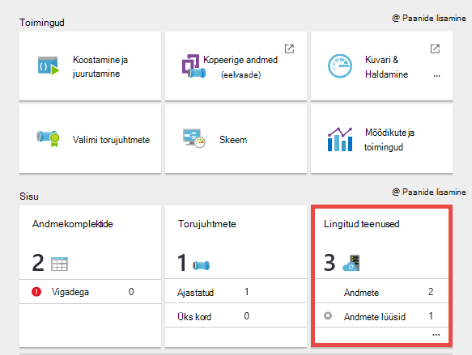

<properties 
    pageTitle="Andmehalduslüüsi andmete Factory | Microsoft Azure'i"
    description="Häälestada andmete lüüsi andmete kohapealse ja pilveteenuse vahel liikumiseks. Azure'i andmed Factory Andmehalduslüüsi abil andmete teisaldamine." 
    services="data-factory" 
    documentationCenter="" 
    authors="linda33wj" 
    manager="jhubbard" 
    editor="monicar"/>

<tags 
    ms.service="data-factory" 
    ms.workload="data-services" 
    ms.tgt_pltfrm="na" 
    ms.devlang="na" 
    ms.topic="article" 
    ms.date="10/11/2016" 
    ms.author="jingwang"/>

# Andmehalduslüüs
Andmehalduslüüs on kliendi agent, mis tuleb teil installida oma kohapealse keskkonna kopeerimiseks andmete vahel pilve ja kohapealsete andmete poed. [Toetatud andmeallikate](data-factory-data-movement-activities.md##supported-data-stores) jaotises loetletud kohapealse andmete salvestab andmed Factory ei toeta. 

> [AZURE.NOTE] Hetkel lüüsi toetab ainult Kopeeri tegevuste ja salvestatud protseduur tegevuse andmete Factory. Ei saa kasutada kohandatud tegevusest lüüsi kohapealse andmeallikatele juurdepääsu. 

Selles artiklis täiendab kiirtutvustus sisse selle [kohapealse ja pilveteenuse vahel saate liikuda andmete andmete](data-factory-move-data-between-onprem-and-cloud.md) artiklis. Kiirtutvustus, saate luua müügivõimaluste kasutava lüüsi asutusesisese SQL serveri andmebaasi andmete teisaldamiseks mõnda Azure'i bloobimälu. Selles artiklis on toodud Andmehalduslüüsi põhjalikumat teavet.   

## Ülevaade

### Data Management Gateway võimalused
Andmehalduslüüsi pakub järgmisi võimalusi.

- Mudeli kohapealsed andmeallikad ja pilveandmeallikad samad andmed factory ja Teisalda andmed sees.
- On ühe paani klaas jälgimise ja halduse nähtavus lüüsi olek keelest Factory andmeid koos.
- Kohapealse andmeallikatele juurdepääsu turvaliselt hallata.
    - Ettevõtte tulemüüri vaja muudatusi. Lüüs on ainult väljaminevad HTTP-põhine ühendused avamiseks internet.
    - Krüptige oma kohapealse andmete salvestab teie serdiga mandaat.
- Andmete tõhus teisaldamine-andmed edastatakse paralleelselt, et ajutiste võrguprobleemide tänu automaatsele uuestiproovimise loogikale.

### Käsk paanivoo ja andmevoo
Kui Kopeeri tegevuse abil saate andmeid kohapealse ja pilveteenuse vahel kopeerida, kasutab tegevuse lüüsi kohapealse andmeallika andmete edastamiseks pilveteenuste ja vastupidi.

Siin üksikasjalik andmete liikumise ja juhised andmete lüüsi eksemplari Kokkuvõte: 

1.  Andmete arendaja loob lüüsi Azure'i andmed Factory [Azure portaali](https://portal.azure.com) või [PowerShelli cmdleti](https://msdn.microsoft.com/library/dn820234.aspx)abil. 
2.  Andmete arendaja loob lingitud mõne kohapealse andmesalve teenust, määrates lüüsi. Lingitud teenuse häälestamise käigus andmete arendaja kasutab säte mandaadi rakenduse autentimistüüpidest ja mandaadi määramiseks.  Sätte identimisteabe rakenduse dialoogi suhtleb andmesalve testimiseks ühendust ja lüüsi salvestada.
3. Lüüsi krüptib identimisteabe sertifikaadiga seostatud lüüsi (esitatud andmed arendaja), enne salvestamist pilves identimisteabe.
4. Andmete Factory teenuse suhtleb lüüsi plaanimine ja haldamine töökohtade kaudu ühiskasutusse antud Azure'i teenus siini järjekorda kasutava juhtelemendi kanali jaoks. Kui koopia tegevuse töökoht peab olema käivitati, andmete Factory järjekorrad taotluse koos mandaadi teavet. Lüüsi algab töö pärast küsitlused järjekorda.
5.  Lüüsi dekrüptib mandaadi sertifikaadiga sama ja seejärel loob sellega ühenduse kohapealse andmesalve proper autentimistüüp ja mandaadi.
6.  Lüüsi kopeerib andmete kohapealse poest pilvepõhist salvestusruumi või vastupidi sõltuvalt Kopeeri tegevuse konfigureerimist andmete kohaletoimetamisel. Selles etapis lüüsi otse suhtleb pilvepõhist salvestusruumi teenused, nt Azure'i bloobimälu turvalise kanali (HTTPS).

### Teave kasutamise lüüsi
- Andmehalduslüüsi ühekordsest saab kasutada mitme kohapealse andmeallikaga. Siiski **ühe lüüsi eksemplari on seotud ainult üks Azure'i andmed factory** ja ei saa ühiskasutusse anda teise andmete factory.
- Teil võib olla **ainult üks eksemplar Andmehalduslüüsi** ühte arvutisse installitud. Oletame, et teil on kaks andmete tehast, mis tuleb kohapealse andmeallikatele juurdepääsu, peate installima lüüside kohapealse arvutites. Teisisõnu, lüüsi on seotud kindlate andmete factory
- Soovitud **lüüs ei pea olema samasse arvutisse andmeallikana**. Siiski võttes lähemale lüüsi andmeallikale vähendab andmeallikaga ühenduse lüüs kestuse. Soovitame installida seadmesse, mis erineb ühte, mis hostib kohapealse andmeallika lüüsi. Kui lüüsi ja andmete allikas on erinevates arvutites, võistlema lüüsi ressursid andmeallikaga.
- Teil võib olla **mitme lüüsi erinevate seadmetega ühenduse sama kohapealse andmeallika**. Näiteks võib teil tekkida kaks lüüside serveeritakse kaks andmete tehast, kuid sama kohapealse andmeallika andmete tehased registreeritud.
- Kui teil on juba lüüsi serveeritakse **Power BI** stsenaarium teie arvutisse installitud, installige **Azure'i andmed Factory eraldi lüüsi** mõnda teise arvutisse.
- Lüüsi tuleb kasutada ka siis, kui kasutate **ExpressRoute**.
- Kohapealse andmeallika (see on tulemüüriga) andmeallika käsitleda isegi siis, kui kasutate **ExpressRoute**. Lüüs kasutama ühenduvuse teenuse ja andmeallika vahel.
- Peate **lüüsi kasutada** ka siis, kui andmesalve on pilves on **Azure IaaS VM**. 

## Installimine

### Eeltingimused
- Toetatud **opsüsteem** on Windows 7, Windows 8/8.1, Windows 10, Windows Server 2008 R2, Windows Server 2012, Windows Server 2012 R2. Andmehalduslüüsi domeenikontrolleri installi pole praegu toetatud.
- .NET Frameworki 4.5.1 või on vaja. Kui installite Windows 7 arvutis lüüsi, installige .NET Framework 4.5 või uuem versioon. Üksikasjad leiate [.NET Framework süsteeminõuded](https://msdn.microsoft.com/library/8z6watww.aspx) . 
- Soovitatav **Konfiguratsioon** lüüsi masina on vähemalt 2 GHz, 4 tuuma, 8 GB RAM-i ja 80 GB vaba.
- Kui majutusseadme talveunne lüüsi vastata andmete päringute. Seetõttu konfigureerida mõnda sobivat **energiarežiim** arvutis enne installimist lüüsi. Kui arvuti on konfigureeritud talveunerežiimi, lüüsi installimise palub sõnumi.
- Peate olema administraator installima ja konfigureerima Andmehalduslüüsi edukalt arvutis. Saate lisada täiendavate kasutajate Windows **Andmete Management Gateway kasutajate** rühma. Selle rühma liikmed saavad lüüsi konfigureerimine tööriista andmete Andmehalduslüüsi Konfigureerimishalduri abil. 

Kopeeri tegevuse käivitatakse ilmneda teatud sageduse, järgmiselt ressursikasutuse (CPU, mälu) seadmesse ka sama mustriga tippväärtus ja jõude korda. Ressursi kasutamine ka sõltub andmehulga ei teisaldataks. Kui mitme eksemplari töö on pooleli, kuvatakse ressursikasutus tippväärtus aegadel minema. 

### Installimise suvandid
Andmehalduslüüsi installimist järgmisel viisil: 

- Laadige MSI install paketi [Microsofti allalaadimiskeskuse](https://www.microsoft.com/download/details.aspx?id=39717)kaudu.  MSI saate kasutada ka olemasoleva Andmehalduslüüsi uusima versiooni täiendamine alles kõik sätted.
- Linki **Laadige alla ja installige andmete lüüsi** jaotises käsitsi häälestamine või EXPRESS HÄÄLESTUS jaotises **otse arvutisse installida** . Artiklist [andmete kohapealse ja pilveteenuse vahel liikumine](data-factory-move-data-between-onprem-and-cloud.md) kasutamise üksikasjalikud juhised kiire häälestus. Käsitsi sammu suunab teid allalaadimiskeskus.  Järgmises jaotises on juhised allalaadimine ja installimine lüüsi allalaadimiskeskuse kaudu. 

### Installi head tavad:
1.  Konfigureerida energiarežiim hosti arvutis lüüsi nii, et seade pole talveunerežiimi. Kui majutusseadme talveunne lüüsi vastata andmete päringute.
2.  Varundage seostatud lüüsi sert.

### Lüüsi allalaadimiskeskuse kaudu installida
1. [Microsofti Andmehalduslüüsi](https://www.microsoft.com/download/details.aspx?id=39717)allalaadimise lehele liikumine 
2. Klõpsake nuppu **Laadi alla**, valige sobiv versioon (**32-bitine** ja **64-bitine**) ja klõpsake nuppu **edasi**. 
3. Käivitage **MSI** otse või salvestage see oma arvuti kõvakettale ja käivitada.
4. Lehel **Tere tulemast** , valige **keel** nuppu **edasi**.
5. **Aktsepteeri** lõppkasutaja litsentsileping ja klõpsake nuppu **edasi**. 
6. Valige **kaust** , lüüsi ja klõpsake nuppu **edasi**. 
7. Lehel **installimiseks valmis** , klõpsake nuppu **Installi**. 
8. Klõpsake nuppu **valmis** installimise lõpuleviimiseks.
9. Saada võti Azure portaalist. Üksikasjalikud juhised järgmisest jaotisest. 
10. Lehel **lüüsi registreerida** **Andmete Andmehalduslüüsi Konfigureerimishalduri** teie arvutis töötab, tehke järgmist. 
    1. Teksti kleepimiseks võti.
    2. Klõpsake nuppu **Kuva lüüsivõtit** võtme teksti.
    3. Klõpsake nuppu **registreeru**. 

### Lüüsi võtme abil registreerida

#### Kui te pole juba loonud loogilise lüüsi portaalis
Lüüsi portaali loomine ja **konfigureerimine** keelest saada võti, järgige juhiseid artiklis [kohapealse ja pilveteenuse vahel andmete teisaldamiseks](data-factory-move-data-between-onprem-and-cloud.md) kiirtutvustus kaudu.    

#### Kui olete juba loonud loogilise lüüsi portaalis
1. Azure'i portaalis **Andmete Factory** tera liikuda, ja klõpsake nuppu **Lingitud teenuste** paani.

    
2. Valige **Lingitud teenuste** labale loogilise **lüüsi** loodud portaalis. 

      
2. Klõpsake **Andmete lüüsi** tera, **Laadige alla ja installige andmete lüüsi**.

       
3. Klõpsake **konfigureerimine** labale **klahvi uuesti luua**. Klõpsake Jah hoiatusteade lugenud hoolikalt.

    
4. Klõpsake nuppu Kopeeri võti. Võti kopeeritakse lõikelauale.
    
     

### Olekuala ikoonid / teatised
Järgmisel pildil on kujutatud osa salve ikoonid, mida näete. 

Kui viite kursori system tray ikoon/teavitussõnum, näete lüüsi/värskendamist klõpsake hüpikakna oleku kohta.

### Pordid ja tulemüüri
On kaks tulemüürid tuleb arvestada: **ettevõtte tulemüüri** töötab keskse ruuteri ettevõte ja **Windowsi tulemüüri** konfigureeritud daemon kohalikus arvutis, kuhu on installitud lüüsi.  

Ettevõtte tulemüüri tasemel, on vaja järgmisi domeene ja Väljaminev pordid konfigureerimine:

| Domeeninimed | Pordid | Kirjeldus |
| ------ | --------- | ------------ |
| *. servicebus.windows.net | 443, 80 | Klõpsake teenuse siini Relay (nõuab 443 juurdepääsu reguleerimine Turbeloa omandamise) TCP kuulajatele | 
| *. servicebus.windows.net | 9350-9354 5671 | Valikuline teenuse siini relay TCP | 
| *. core.windows.net | 443 | HTTPS | 
| *. clouddatahub.net | 443 | HTTPS | 
| Graph.Windows.net | 443 | HTTPS |
| login.Windows.net | 443 | HTTPS | 

Windowsi tulemüüri tasemel nende Väljaminev pordid tavaliselt lubatud. Kui pole, saate konfigureerida domeenid ja portide vastavalt lüüsi arvutisse.

#### Andmete kopeerimine allika andmete poest valamu andmete pood

Veenduge, et tulemüüri reeglid lubatakse õigesti ettevõtte tulemüüri, Windowsi tulemüür arvutis lüüsi ja andmete talletamiseks ise. Lubamine reegleid võimaldab ühenduse mõlema andmeallika ja edukalt valamu lüüsi. Lubada reeglid iga andmesalve, mis on kaasatud kopeerimine.

Kopeerige **kohapealse andmesalve, mis Azure'i SQL-andmebaasi valamu või Azure SQL-i andmebaas valamu**, tehke järgmist. 

- Windowsi tulemüüri nii ettevõtte tulemüüri portide **1433** väljaminev **TCP** side lubamiseks
- Azure SQL serveri IP-aadress lüüsi masina lisamiseks lubatud IP-aadresside loend tulemüüri sätete konfigureerimine. 

### Puhverserveri server kaalutlused
Kui teie ettevõtte keskkonnast kasutab puhverserverit Interneti, konfigureerima Andmehalduslüüsi sobiv puhverserveri sätete kasutamiseks. Saate seada puhverserverist algse registreerimise etapis. 

Lüüsi kasutab puhverserverit ühenduse pilveteenusesse. Klõpsake linki **Muuda** algse installimise käigus. Kuvatakse dialoogiboks **puhverserveri säte** .

On kolm konfiguratsiooni võimalust. 

- **Ärge kasutage puhverserveri**: lüüsi pole konkreetselt kasutada mis tahes puhverserveri pilveteenustega ühendust luua.
- **Kasutage süsteemi puhverserveri**: lüüsi kasutab puhverserveri säte, mis on konfigureeritud diahost.exe.config.  Kui pole puhverserveri on konfigureeritud diahost.exe.config, lüüsi loob pilveteenusesse otse ilma puhverserveri.
- **Kasutage kohandatud puhverserveri**: konfigureerimine säte lüüsi konfiguratsioone kasutamine diahost.exe.config asemel kasutada HTTP-puhverserver.  Aadresside ja portide on nõutav.  Sõltuvalt oma puhverserveri autentimine säte valikulised kasutajanimi ja parool.  Kõik sätted on krüptitud lüüsi mandaadi sertifikaadiga ja talletatud kohalik host lüüsiseadmega.

Andmete haldamine lüüsi hostiteenus taaskäivitamist automaatselt pärast salvestamist värskendatud puhverserveri sätted. 

Pärast lüüsi on edukalt registreeritud, kui soovite vaadata või värskendada puhverserveri sätted, kasutage andmete Andmehalduslüüsi Konfigureerimishalduri. 

1. Käivitage andmete Andmehalduslüüsi Konfigureerimishalduri.
2. Menüü **sätted** aktiveerimine
3. **Määrake HTTP-puhverserver** dialoogiboksi käivitamiseks **HTTP-puhverserver** jaotises **Muuda** linki.  
4. Kui klõpsate nuppu **edasi** , näete oma õiguste seadmine puhverserverist salvestamiseks ja taaskäivitage lüüsi hostiteenus küsiks hoiatus.

Saate vaadata ja värskendada HTTP-puhverserver Configuration Manager tööriista abil. 

> [AZURE.NOTE] Kui häälestate NTLM autentimist puhverserverit, lüüsi hostiteenus töötab domeenikonto. Kui muudate hiljem domeeni konto parooli, ärge unustage sätete konfigureerimise teenuse värskendamine ja taaskäivitage see vastavalt sellele. Selle nõude tõttu soovitame sihtotstarbeline domeeni konto abil juurdepääsu puhverserverit, mis ei nõua värskendamist sageli parool.

### Diahost.exe.config puhverserveri sätete konfigureerimine
Kui valite **kasutamine süsteemi puhverserveri** säte HTTP-puhverserver, kasutab lüüsi puhverserverist diahost.exe.config seadmine.  Kui pole puhverserveri on määratud diahost.exe.config, lüüsi loob pilveteenusesse otse ilma puhverserveri. Järgmist toimingut leiate juhised värskendamine config faili. 

1.  File Exploreris teha turvaliste C:\Program Files\Microsoft halduse Gateway\2.0\Shared\diahost.exe.config varundada algse faili koopia.
2.  Käivita administraatorina töötab Notepad.exe ja avage tekstifail "C:\Program Files\Microsoft andmete haldamise Gateway\2.0\Shared\diahost.exe.config. Leiate vaikimisi sildi system.net nagu on näidatud järgmine kood:

            <system.net>
                <defaultProxy useDefaultCredentials="true" />
            </system.net>   

    Seejärel saate lisada puhverserveri server üksikasjad, nagu on näidatud järgmises näites:

            <system.net>
                  <defaultProxy enabled="true">
                        <proxy bypassonlocal="true" proxyaddress="http://proxy.domain.org:8888/" />
                  </defaultProxy>
            </system.net>

    Täiendavad atribuudid on lubatud puhverserveri sildi sees, nagu scriptLocation nõutav sätete määramiseks. Vaadake süntaks- [puhverserveri elemendi (võrgu sätteid)](https://msdn.microsoft.com/library/sa91de1e.aspx) .

            <proxy autoDetect="true|false|unspecified" bypassonlocal="true|false|unspecified" proxyaddress="uriString" scriptLocation="uriString" usesystemdefault="true|false|unspecified "/>

3. Konfiguratsiooni faili salvestada algsesse asukohta ja seejärel taaskäivitage andmete haldamise lüüsi hostiteenus, mis jätkab soovitud muudatused. Teenuse taaskäivitamiseks: kasutada teenuste applet juhtpaneeli kaudu või **Andmete Andmehalduslüüsi Konfigureerimishalduri** > **Teenuse peatamine** nuppu ja seejärel klõpsake **Teenuse käivitamine**. Kui teenus ei käivitu, on tõenäoline, et süntaks on vale XML-i silt on lisatud rakenduse konfigureerimise faili, mida on redigeeritud.     

Lisaks nende punktide peate ka veenduge, et Microsoft Azure'i on teie ettevõtte nimekiri. Microsoft Azure'i IP-aadresside loend saate [Microsofti allalaadimiskeskusest](https://www.microsoft.com/download/details.aspx?id=41653)alla laadida.

#### Võimalikud sümptomid, tulemüüri ja puhverserveri server seotud probleemide kohta
Kui ilmneb tõrkeid sarnased järgmised, on tõenäoline valest tulemüüri või puhverserveri server, mis blokeerib andmete Factory ühenduse lüüs autentida ise konfiguratsiooni tõttu. Eelmise jaotisest tagamaks, et teie tulemüür ja puhverserveri on õigesti konfigureeritud.

1.  Kui proovite lüüsi registreerida, kuvatakse järgmine tõrketeade: "nurjus võtit lüüsi registreerimiseks. Enne kui proovite lüüsi võti uuesti registreerida, veenduge, et Andmehalduslüüs on ühendatud ja andmete haldamine lüüsi hostiteenus käivitamist."
2.  Kui avate Configuration Manager, kuvatakse olek "Ühendus katkestatud" või "Ühendamine". Kui vaatate Windows sündmuselogide jaotises "Sündmusevaatur" > "Rakenduste ja teenuste logid" > "Andmehalduslüüsi", kuvatakse järgmine tõrketeade tõrketeated:`Unable to connect to the remote server` 
    `A component of Data Management Gateway has become unresponsive and restarts automatically. Component name: Gateway.`

### Avage port 8050 mandaadi krüptimiseks 
Sissetulev port **8050** relay mandaat, mida lüüsi, kui häälestate asutusesisese **Säte identimisteabe** kasutab lingitud teenuse Azure'i portaalis. Lüüsi häälestamise ajal vaikimisi Andmehalduslüüsi installimist avab selle lüüsiseadmega.
 
Kui kasutate muu tootja tulemüüri, saate avada käsitsi pordi 8050. Kui tekib probleem tulemüüri lüüsi häälestamise ajal, proovige installida lüüsi tulemüüri konfigureerimata järgmise käsuga.

    msiexec /q /i DataManagementGateway.msi NOFIREWALL=1

Kui te ei soovi port 8050 lüüsiseadmega avada, kasutage muude, kui see **Säte mandaadi** rakenduse abil konfigureerida andmete poe mandaat. Näiteks võite kasutada [Uut-AzureRmDataFactoryEncryptValue](https://msdn.microsoft.com/library/mt603802.aspx) PowerShelli cmdlet-käsk. Vaadake jaotises [säte identimisteabe ja turbe](#set-credentials-and-securityy) kohta, kuidas andmeid mandaadi talletamine, saate määrata.

## Värskendamine 
Vaikimisi Andmehalduslüüsi värskendatakse automaatselt, kui lüüsi uuem versioon on saadaval. Lüüsi ei värskendata, kuni kõik toimingud on valmis. Pole veel tööülesandeid töötleb lüüsi värskendamist lõpetamiseni. Kui värskendus nurjus, lüüsi tagasi kerida vana versioon. 

Ajastatud värskendamise ajal kuvatakse järgmistes kohtades.

- Azure'i portaalis tera lüüsi atribuudid.
- Avalehe andmete haldamise Andmehalduslüüsi Konfigureerimishalduri
- System tray teavitussõnumi. 

Menüü Avaleht andmete haldamise Andmehalduslüüsi Konfigureerimishalduri kuvab Värskenda ajakava ja viimast lüüsi on installitud/uuendatud. 

Saate installida Värskenda kohe või oodata lüüs määratud ajal automaatselt värskendada. Näiteks järgmisel pildil kuvatakse teade, mis kuvatakse rakenduses Andmehalduslüüsi Konfigureerimishalduri koos kohe installimiseks klõpsake nuppu Update. 

Teavitussõnum süsteemisalves näeks, nagu on näidatud järgmisel pildil: 

Näete värskendamist (käsitsi või automaatse) süsteemisalves olekut. Kui käivitate Andmehalduslüüsi Konfigureerimishalduri järgmine kord, näete teadet, et lüüsi on värskendatud koos lingi, [mis on uut teemat](data-factory-gateway-release-notes.md)teatise ribal.

### Funktsiooni/Keela automaatne uuendamine
Te saate/Keela automaatne uuendamine funktsiooni, tehes järgmist: 

1. Käivitage Windows PowerShelli lüüsiseadmega. 
2. Aktiveerige C:\Program Files\Microsoft andmete haldamise Gateway\2.0\PowerShellScript kaust.
3. Käivita järgmine käsk Lülita automaatne uuendamine funktsiooni väljalülitamine (keelamine).   

        .\GatewayAutoUpdateToggle.ps1  -off

4. Kui soovite uuesti sisse lülitada: 
    
        .\GatewayAutoUpdateToggle.ps1  -on  

## Configuration Manager 
Kui olete installinud lüüsi, võite käivitada andmete Andmehalduslüüsi Konfigureerimishalduri ühel järgmistest viisidest: 

- Tippige aknas **Otsing** **Andmehalduslüüsi** selle kasuliku juurdepääsu. 
- Käivitamine käivitatava **ConfigManager.exe** kaustas: **C:\Program Files\Microsoft andmete haldamise Gateway\2.0\Shared** 
 
### Avaleht
Avalehe võimaldab teil teha järgmisi toiminguid: 

- Vaade (ühendatud pilveteenusesse jne.) lüüsi olekut. 
- **Registreerida** kasutades klahvi portaalist.
- **Lõpetamine** ja start **andmete haldamise lüüsi hostiteenus** lüüsiseadmega.
- Teatud ajal päeva **ajakava värskendused** .
- Saate vaadata kui lüüsi oli **Viimati värskendatud**kuupäeva. 

### Lehe sätted
Sätete lehel saate teha järgmisi toiminguid:

- Vaadata, muuta ja eksportida lüüsi **sert** . Andmeallika identimisteabe krüptimiseks kasutatakse seda serti.
- Saate muuta **HTTPS port** lõpp-punkti. Lüüsi avatakse pordi säte andmeallika identimisteabe. 
- Lõpp-punkti **olek**
- Kuva **SSL-serdi** kasutatakse andmeallikate jaoks identimisteabe määramine SSL-Side portaali ja lüüsi vahel.  

### Diagnostika lehele
Diagnostika lehel saate teha järgmisi toiminguid:

- Luba Paljusõnaline **logimine**, logide kuvamine Sündmusevaatur ja Microsoft logid saata, kui ilmnes tõrge.
- Andmeallika **testi ühendust** .  

### Lehe spikker
Abi lehel kuvatakse järgmine teave:  

- Lüüsi Lühikirjeldus
- Versiooninumbri
- Litsentsileping Võrguspikker ja privaatsusavaldus, mis sisaldab linke.  

## Tõrkeotsing

- Leiate üksikasjalikku teavet lüüsi logib sisse Windowsi sündmuste logid. Leiate need Windowsi **Sündmusevaatur** jaotises **rakenduste ja teenuste logid**abil > **Andmehalduslüüsi**. Lüüsi seotud probleemide tõrkeotsingu, otsige tõrge taseme sündmuste jaoks juhul vaatur.
- Kui lüüs ei toimi pärast saate **muuta serdi**, käivitage **Andmete haldamise lüüsi teenust** Microsoft andmete Andmehalduslüüsi Konfigureerimishalduri tööriista või teenuste juhtpaneeli apleti abil. Kui endiselt kuvatakse tõrge, peate konkreetsete õiguste andmiseks Andmehalduslüüsi kasutajal juurde pääseda serdi serdid Manager (tekst certmgr.msc).  Teenuse vaikimisi kasutajakonto oleks: **NT Service\DIAHostService**. 
- Kui **Mandaadihaldur** rakendus ei mandaadi **krüptimiseks** , kui klõpsate nuppu Krüpti andmeid Factory Editoris, veenduge, et teil on selle rakenduse **lüüsi kohapeal**. Kui ei, käivitage rakendus lüüsiseadmega ja proovige mandaadi krüptimiseks.  
- Kui andmete talletamiseks ühendus või juhi seotud tõrgete kuvamiseks tehke järgmist. 
    - Käivitage **Andmete Andmehalduslüüsi Konfigureerimishalduri** lüüsiseadmega.
    - **Diagnostika** vahekaardi aktiveerimine
    - Valige/Sisestage vastavad väärtused väljadele **testi ühendust selle lüüsi abil kohapealse andmeallika** rühma
    - Klõpsake nuppu **testi ühendust** , et näha, kui saate kohapealse andmeallikaga ühenduse lüüs masina ühenduse teavet ja mandaadi abil. Kui testi ühendust nurjub, kui installite draiveri, taaskäivitage lüüsi seda kättesaamine Viimane muudatus.  

    

### Lüüsi logide saatmine Microsoftile
Kui te ühendust Microsofti Support abi lüüsi probleemide tõrkeotsingu, palutakse teil jagada oma lüüsi logid. Lüüsi versiooni saate hõlpsalt teistega jagada nõutav lüüsi logid kahe nupu klõpsuga Andmehalduslüüsi Konfigureerimishalduri abil.   

1. Lüüsi configuration manager **diagnostika** vahekaardi aktiveerimine.
 
    
2. Klõpsake linki **logide saatmine** näha järgmine dialoogiboks: 

    
3. (valikuline) Klõpsake **vaate logib** logide vaataja üle vaadata.
4. (valikuline) Klõpsake Microsoft online services privaatsusavaldust **Privaatsus** . 
3. Kui olete rahul mida olete üles laadida, klõpsake nuppu **saada logid** tegelikult logid viimase seitsme päeva jooksul Microsoftile saata tõrkeotsingu. Peaksite nägema oleku saada logid toiming, nagu on näidatud järgmisel pildil:

    
4. Kui toiming on lõpule jõudnud, kuvatakse dialoogiboks, nagu on näidatud järgmisel pildil.
    
    
5. Pange kirja **aruande ID-d** ja selle ühiskasutusse Microsoft Support. Aruande ID-d kasutatakse teie lüüsi logid saate üles laadida tõrkeotsingu leidmiseks.  Aruande ID salvestatakse ka Sündmusevaatur oma viide.  Saate otsida seda vaadates sündmuse ID "25" ja märkige ruut kuupäev ja kellaaeg.
    
        

### Arhiivi lüüsi logib lüüsi host arvutisse
On mõnel juhul, kui teil on lüüsi probleemide ja ühiskasutusse ei saa lüüsi logid otse. 

- Käsitsi installida lüüsi ja registreerida lüüsi;
- Proovite lüüsi registreerida regenereeritud tõstuklahviga konfigureerimishaldur; 
- Logide saatmisel ja lüüsi hostiteenus ei saa ühendatud;

Sellisel juhul saate lüüsi logide zip-failina salvestamine ja ühiskasutusse anda, kui kontakt Microsofti tugiteenuste hiljem. Näiteks kui saate tõrketeate ajal registreerimisel lüüsi, nagu näidatud järgmisel pildil:   

Linki **arhiivi lüüsi** logid arhiivimine ja Logide salvestamine ja seejärel ühiskasutusse Microsofti tugiteenuste zip-fail. 

### Lüüs on võrgus vähendatud funktsionaalsusega 
Näete lüüsi olekut **vähendatud funktsionaalsusega** online ühel järgmistest põhjustest.

- Lüüsi ei saa ühendust pilveteenuses teenuse siini kaudu.
- Lüüsi teenuse siini kaudu ei saa ühendust pilveteenuses.

Kui lüüs on võrgus vähendatud funktsionaalsusega, ei pruugi te andmete Factory koopia viisardi abil saate luua andmete torustikele kopeerimise andmete kohapealse andmete poed.

Eraldusvõime/lahendus selle probleemi (online vähendatud funktsionaalsusega) on vastavalt kas lüüsi ei saa ühendust luua pilveteenuses või muul viisil. Järgmised jaotised sisaldavad järgmisi lahendusi. 

#### Lüüsi pilveteenuses teenuse siini kaudu ei saa ühendust luua
Järgmiste juhiste saamiseks lüüsi taastamisel. 

1. Luba Väljaminev pordid 9350-9354 nii Windowsi tulemüür arvutis lüüsi ja ettevõtte tulemüüri. Vaadake teemat [pordid ja tulemüüri](#ports-and-firewall) jaotises üksikasjad.
2. Lüüsi puhverserveri sätete konfigureerimine. Vt [puhverserveri server kaalutlused](#proxy-server-considerations) jaotis üksikasjad. 

Lahenduseks andmete Factory Editor Azure portaali (või) Visual Studio (või kasutada) Azure PowerShelli.

#### Tõrge: Pilveteenuses ei saa ühenduse lüüs teenuse siini kaudu.
Järgmiste juhiste saamiseks lüüsi taastamisel.
 
1. Luba Väljaminev pordid 5671 ja 9350-9354 nii Windowsi tulemüür arvutis lüüsi ja ettevõtte tulemüüri. Vaadake teemat [pordid ja tulemüüri](#ports-and-firewall) jaotises üksikasjad.
2. Lüüsi puhverserveri sätete konfigureerimine. Vt [puhverserveri server kaalutlused](#proxy-server-considerations) jaotis üksikasjad.
3. Staatiline IP piirangud puhverserveri eemaldada. 

Lahendusena saate kasutada andmete Factory Editor Azure portaali (või) Visual Studio (või) Azure PowerShelli.
 
## Lüüsi seadmes teisele liikumine
Selles jaotises antakse juhiseid lüüsi klient ja teisaldamine ühest arvutist teise arvutisse. 

2. Portaalis **andmete Factory avalehele**liikumiseks ja klõpsake paani **Lingitud teenused** . 

     
3. Valige oma lüüsi **Lingitud teenuste** tera **Andmete LÜÜSIDE** osas.
    
    
4. Klõpsake **andmete lüüsi** tera, **Laadige alla ja installige andmete lüüsi**.
    
     
5. Labale **konfigureerimine** nuppu **alla laadida ja installida andmete lüüsi**ja järgige juhiseid, et installida seadmesse andmete lüüsi. 

    
6. **Microsoft andmete Andmehalduslüüsi Konfigureerimishalduri** lahti jätta. 
 
     
7. **Konfigureerimine** tera portaalis, klõpsake käsku **uuesti klahvi** ja hoiatusteade jaoks, klõpsake nuppu **Jah** . Valige **nupp Kopeeri** kõrval võtme tekst, mida võti kopeeritakse lõikelauale. Vana arvutis lüüsi töötamast nagu kiiresti uuesti luua võti.  
    
    
     
8. **Klahv** kleepida tekstivälja lehel **Lüüsi registreerida** **Andmete Andmehalduslüüsi Konfigureerimishalduri** teie arvutis. (valikuline) Märkige ruut **Kuva lüüsivõtit** võtme teksti. 
 
    
9. Klõpsake **registreerida** pilvepõhise teenuse lüüsi registreerimiseks.
10. Klõpsake vahekaardil **sätted** nuppu **Muuda** valige sama sert, mida kasutati ja vana lüüsi, sisestage **parool**ja klõpsake nuppu **valmis**. 
 
    

    Saate eksportida sert vana lüüsi, tehes järgmist: Käivita andmete Andmehalduslüüsi Konfigureerimishalduri vana arvutisse, vahekaardi **sert** , klõpsake nuppu **ekspordi** ja järgige juhiseid. 
10. Pärast registreerimist lüüsi peaksite nägema **registreerimise** määratud **registreeritud** ja **oleku **käivitatud** avalehel Andmehalduslüüsi Konfigureerimishalduri** . 

## Identimisteabe krüptimise 
Andmete Factory Editoris mandaadi krüptimiseks, tehke järgmist.

1. Käivitage **lüüsi seadme**veebibrauser, liikuge [Azure'i portaal](http://portal.azure.com). Otsige oma andmete factory vajadusel avatud andmete factory **Andmete FACTORY** tera ja **Autor & Deploy** andmete Factory Editor käivitamiseks klõpsake.   
1. Klõpsake puuvaates näha selle JSON määratlus või lingitud teenus, mis nõuab Andmehalduslüüsi loomine olemasoleva **lingitud teenuse** (nt: SQL serveri või Oracle'i). 
2. Sisestage lüüsi nime atribuudi **gatewayName** JSON redaktor. 
3. Sisestage serveri nimi **Andmeallika** atribuut **connectionString**.
4. Sisestage andmebaasi nimi **Lähtekataloogi** atribuut **connectionString**.    
5. Mis käivitab klõpsake käsuribal nuppu **Krüpti** – üks kord **Mandaadihaldur** rakendus. Peaksite nägema dialoogiboksi **Säte mandaat** . 
    
6. Dialoogiboksis **Säte identimisteave** tehke järgmist.  
    1.  Valige **autentimise** soovitud andmed Factory teenuse andmebaasiga ühenduse loomiseks kasutada. 
    2.  Sisestage kasutaja, kellel on juurdepääs andmebaasi **kasutajanimi** sätte. 
    3.  Sisestage parool **parool** sätte kasutaja jaoks.  
    4.  Klõpsake nuppu **OK** mandaadi krüptimiseks ja sulgege dialoogiboks. 
5.  **EncryptedCredential** kinnisvara **connectionString** peaksite.      
        
            {
                "name": "SqlServerLinkedService",
                "properties": {
                    "type": "OnPremisesSqlServer",
                    "description": "",
                    "typeProperties": {
                        "connectionString": "data source=myserver;initial catalog=mydatabase;Integrated Security=False;EncryptedCredential=eyJDb25uZWN0aW9uU3R",
                        "gatewayName": "adftutorialgateway"
                    }
                }
            }

Kui portaalis pääseda arvuti, mis erineb lüüsi arvuti peab veenduge, et identimisteabe halduri rakenduse saate luua ühenduse lüüs kohapeal. Kui rakendus ei jõua lüüsi arvutisse, seda ei luba teil andmeallika jaoks identimisteabe määramine ja testida ühendus andmeallikaga.  

**Sätte mandaadi** rakenduse kasutamisel portaali krüptib identimisteabe sertifikaadiga **serdi** vahekaardil **Andmehalduslüüsi Konfigureerimishalduri** lüüsiseadmega määratud. 

Kui otsite mandaadi krüptimiseks API-põhiste lähenemisviisi, saate [New-AzureRmDataFactoryEncryptValue](https://msdn.microsoft.com/library/mt603802.aspx) PowerShelli cmdlet-käsk mandaadi krüptimiseks. Cmdlet kasutab serdi selle lüüsi, mis on konfigureeritud kasutama mandaadi krüptimiseks. Saate lisada krüptitud identimisteabe **connectionString** klõpsake soovitud JSON **EncryptedCredential** element. Kasutate selle JSON cmdlet-käsu [New-AzureRmDataFactoryLinkedService](https://msdn.microsoft.com/library/mt603647.aspx) või andmete Factory redaktor. 

    "connectionString": "Data Source=<servername>;Initial Catalog=<databasename>;Integrated Security=True;EncryptedCredential=<encrypted credential>",

On ühe mitu moodust häälestuse abil andmete Factory redaktor. Kui loote lingitud SQL Serveri teenuse redaktoriga ja teil sisestada mandaat lihttekstiks, identimisteabe krüptitud serdiga andmete Factory teenuse kuulub. See ei kasuta serdi selle lüüsi, mis on konfigureeritud kasutama. Seda moodust võib olla veidi kiirem mõnel juhul, on ebaturvalisem. Soovitame, et järgite lähenemisviisi ainult arengu/testimise eesmärgil. 

## PowerShelli cmdlet-käsud 
Selles jaotises kirjeldatakse, kuidas luua ja Azure PowerShelli cmdlet-käskude kasutamine lüüsi registreerida. 

1. Käivitage **PowerShelli Azure'i** administraatoriõigustes. 
2. Logige sisse oma Azure'i konto, käivitage järgmine käsk ja Azure mandaadi sisestamise. 

    Logi sisse – AzureRmAccount
2. **Uus-AzureRmDataFactoryGateway** cmdlet-käsu abil saate koostada loogiline lüüsi järgmiselt:

        $MyDMG = New-AzureRmDataFactoryGateway -Name <gatewayName> -DataFactoryName <dataFactoryName> -ResourceGroupName ADF –Description <desc>

    **Näiteks käsu ja väljundi**.

        PS C:\> $MyDMG = New-AzureRmDataFactoryGateway -Name MyGateway -DataFactoryName $df -ResourceGroupName ADF –Description “gateway for walkthrough”

        Name              : MyGateway
        Description       : gateway for walkthrough
        Version           :
        Status            : NeedRegistration
        VersionStatus     : None
        CreateTime        : 9/28/2014 10:58:22
        RegisterTime      :
        LastConnectTime   :
        ExpiryTime        :
        ProvisioningState : Succeeded
        Key               : ADF#00000000-0000-4fb8-a867-947877aef6cb@fda06d87-f446-43b1-9485-78af26b8bab0@4707262b-dc25-4fe5-881c-c8a7c3c569fe@wu#nfU4aBlq/heRyYFZ2Xt/CD+7i73PEO521Sj2AFOCmiI

    
4. Azure'i PowerShelli, aktiveerige kaust: * *C:\Program Files\Microsoft andmete haldamise Gateway\2.0\PowerShellScript\**. Käivitage * *RegisterGateway.ps1* * seotud kohaliku muutuja * *$Key** nagu on näidatud järgmine käsk. See skript registreerib kliendi agent, mis installitakse teie arvutisse loogiline lüüsi loomist varem koos.

        PS C:\> .\RegisterGateway.ps1 $MyDMG.Key
        
        Agent registration is successful!

    IsRegisterOnRemoteMachine parameetri abil saate kaugarvutis lüüsi registreerida. Näide:
        
        .\RegisterGateway.ps1 $MyDMG.Key -IsRegisterOnRemoteMachine true

5. **Get-AzureRmDataFactoryGateway** cmdlet-käsu abil saate hankida lüüside loendist oma andmete factory. Kui **olek** on kuvatud **võrgus**, tähendab see, lüüsi on kasutamiseks valmis.

        Get-AzureRmDataFactoryGateway -DataFactoryName <dataFactoryName> -ResourceGroupName ADF

Saate eemaldada **Eemalda-AzureRmDataFactoryGateway** cmdlet-käsu abil lüüsi ja värskendada **Set-AzureRmDataFactoryGateway** cmdlet-käskude kasutamine lüüsi kirjeldust. Süntaks ja muud üksikasjad need cmdlet-käskude kohta leiate teemast andmete Factory cmdleti viide.  

### Loendi lüüside PowerShelli abil

    Get-AzureRmDataFactoryGateway -DataFactoryName jasoncopyusingstoredprocedure -ResourceGroupName ADF_ResourceGroup

### Lüüsi PowerShelli kaudu eemaldamine
    
    Remove-AzureRmDataFactoryGateway -Name JasonHDMG_byPSRemote -ResourceGroupName ADF_ResourceGroup -DataFactoryName jasoncopyusingstoredprocedure -Force 

## Järgmised sammud
- Vt [kohapealse ja pilveteenuse vahel saate liikuda andmete andmete](data-factory-move-data-between-onprem-and-cloud.md) artikkel. Kiirtutvustus, saate luua müügivõimaluste kasutava lüüsi asutusesisese SQL serveri andmebaasi andmete teisaldamiseks mõnda Azure'i bloobimälu.  
