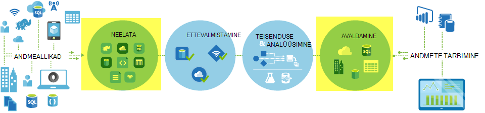
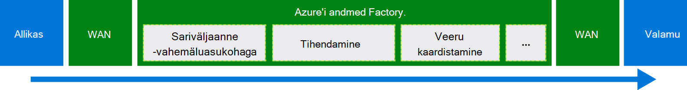
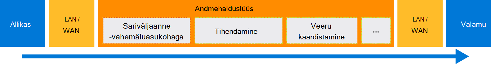

<properties
    pageTitle="Andmete teisaldamine, kopeerimine tegevuse abil | Microsoft Azure'i"
    description="Lisateavet andmete liikumine andmete Factory torujuhtmetes: andmete migreerimine pilve poed ja poest kohapealse ja pilveteenuse poe vahel. Kopeeri toiminguga."
    keywords="Kopeerige andmed, andmete liikumise, andmete migreerimise andmete edastamine"
    services="data-factory"
    documentationCenter=""
    authors="linda33wj"
    manager="jhubbard"
    editor="monicar"/>

<tags
    ms.service="data-factory"
    ms.workload="data-services"
    ms.tgt_pltfrm="na"
    ms.devlang="na"
    ms.topic="article"
    ms.date="09/22/2016"
    ms.author="jingwang"/>

# Andmete teisaldamine, kopeerimine tegevuse abil

## Ülevaade
Azure'i andmed Factory, saate Kopeeri tegevuse Kopeerige andmed erinevaid kujundeid erinevate kohapealse ja cloud Azure'i andmeallikad. Pärast andmete kopeerimist, seda saab täpsemaks muutnud ja analüüsida. Saate Kopeeri tegevuse teisendamiseks ja analüüsi tulemuste ärianalüüsi (BI) ja rakendus tarbimine avaldada.

Kopeeri tegevuse on tootja turvaline, usaldusväärseid, scalable, ja [globaalselt saadaval teenus](#global). Selles artiklis on toodud andmete liikumise Factory andmed ja kopeerige tegevuse üksikasjad.

Esmalt vaatame andmete migreerimise esinemisviisi kaks cloud andmete poed ja hoida kohapealse Date ja pilveteenuse andmete poe vahel.

> [AZURE.NOTE] Üldiselt tegevuste kohta lisateabe saamiseks lugege teemat [mõistmine torujuhtmed ja tegevusi](data-factory-create-pipelines.md).

### Kopeerige andmed kahe pilve andmete poed vahel
Nii lähte-kui ka valamu andmete poed on pilves, kopeerige tegevuse kontrollimisel allika andmete kopeerimine valamu järgmised etapid. Teenuse volitusi Kopeeri tegevuse:

1. Loeb andmete allikas andmesalve.
2. Sooritab sariväljaanne/vahemäluasukohaga, tihendab mahukaid, vastendades veerg ja tippige teisendamine. See on need toimingud konfiguratsioone Sisestuskeel andmekomplekti, väljundi andmekomplekti ja kopeerige tegevuse alusel.
3.  Sihtkoha andmesalve kirjutab andmed.

Teenuse valib automaatselt optimaalse piirkond teha andmete liikumine. Selles piirkonnas on tavaliselt üks valamu andmesalve kõige lähemal.

### Kopeerige andmed mõne andmesalve kohapealse ja pilveteenuse andmete poe vahel
Turvaline andmete teisaldamiseks mõne andmesalve kohapealse ja pilveteenuse andmete poe vahel installida Andmehalduslüüsi kohapealse arvuti. Andmehalduslüüs on agent, mis võimaldab hübriid andmete liikumine ja töötlemine. Andmete talletamine ise või eraldi arvutisse mis on juurdepääs andmesalve, saate selle samasse arvutisse installida.

Selle stsenaariumi korral Andmehalduslüüsi sooritab sariväljaanne/vahemäluasukohaga, tihendab mahukaid, vastendades veerg ja tippige teisendamine. Andmevoo Azure'i andmed Factory teenuse kaudu. Selle asemel Andmehalduslüüsi otse kirjutab andmed sihtkoha pood.

Vt [kohapealse ja pilveteenuse vahel saate liikuda andmete andmete](data-factory-move-data-between-onprem-and-cloud.md) Sissejuhatus ja ülevaade. See agent kohta lisateabe saamiseks vt [Andmehalduslüüsi](data-factory-data-management-gateway.md) .

Samuti saate teisaldada andmed ja toetatud andmete poed, mis on majutatud IaaS Azure'i virtuaalmasinates (VM), kasutades Andmehalduslüüsi. Sel juhul saate installida sama VM Andmehalduslüüsi, nagu andmete talletamiseks ise või eraldi VM mis on juurdepääs andmesalve.

## Toetatud andmete ja vormingud
[AZURE.INCLUDE [data-factory-supported-data-stores](../../includes/data-factory-supported-data-stores.md)]

Kui teil on vaja liikuda andmete lisamine andmete talletada, et Kopeeri tegevuse ei toeta, kasutamine on **Kohandatud tegevuse** andmete Factory oma loogika andmete teisaldamine/kopeerimine. Loomise ja kasutamise kohandatud toimingute kohta leiate teemast [kasutamise kohandatud tegevuste on Azure andmete Factory kohaletoimetamisel](data-factory-use-custom-activities.md).

### Toetatud failivormingud
Kopeeri tegevuse abil saate faile kopeerida – on kaks faili-i põhiste andmete salvestab, nt Azure'i bloobimälu, failisüsteemi ja HDFS vahel. Selleks saate vahele jätta [Vorming jaotis](data-factory-create-datasets.md) sisend- ja andmekomplekti määratlusi. Andmed kopeeritakse tõhus ilma mis tahes sariväljaanne/vahemäluasukohaga.

Kopeeri tegevuse ka loeb ja kirjutab määratud vormingus failide: teksti, Avro, ORC, parkett ja JSON. Saate teha järgmisi Kopeeri tegevusi, näiteks:

-   Kopeerige andmed: Azure'i bloobimälu vormingus tekst (CSV) ja Azure SQL-andmebaasi kirjutada.
-   Failide kopeerimine (CSV) vormingus asutusesisese failisüsteemi kaudu ja kirjutada Azure'i bloobimälu Avro vormingus.
-   Kopeerige andmed Azure'i SQL-andmebaasi ja kirjutada HDFS asutusesisese ORC vormingus.

## Globaalne olemasolevate andmete liikumine
Azure'i andmed Factory on saadaval ainult USA Lääne, Ida-USA ja Põhja-Euroopa piirkondade. Siiski volitusi Kopeeri tegevuse teenus on saadaval globaalselt järgmistes regioonides ja kaugemad. Globaalne saadaval topoloogia tagab tõhusa andmete liikumise, mis tavaliselt hoiab ära rist-piirkond humala. Vaadake [teenuste regiooniti](https://azure.microsoft.com/regions/#services) andmete Factory ja piirkonnas olevaid andmeid liikumine.

### Kopeerige andmed pilve andmete poed vahel
Kui nii lähte-kui ka valamu andmete poed on pilves, kasutab andmete Factory teenuse juurutamise piirkonnas, mis on kõige lähemal valamu sama geograafia andmete teisaldamiseks. Järgmises tabelis vastendamiseks viidata:

Piirkonna sihtkoht andmesalve | Piirkond, mida kasutatakse andmete liikumine
:----------------------------------- | :----------------------------
Ida-USA | Ida-USA
Ida-USA 2 | Ida-USA 2
Lääne USA. | Lääne USA.
Lääne USA 2 | Lääne USA.
Kesk-USA | Kesk-USA
Lääne Kesk-USA | Kesk-USA
Põhja Kesk-USA | Põhja Kesk-USA
Lõuna-, Kesk-USA | Lõuna-, Kesk-USA
Põhja-Euroopa | Põhja-Euroopa
Lääne Euroopa | Lääne Euroopa
Kagu-Aasia | Kagu-Aasia
Ida-Aasia | Kagu-Aasia
Jaapan Ida | Jaapan Ida
Jaapan Lääne | Jaapan Ida
Brasiilia Lõuna | Brasiilia Lõuna
Austraalia Ida | Austraalia Ida
Austraalia kodutee | Austraalia kodutee
Keskse India | Keskse India
Lõuna India | Keskse India
Lääne India | Keskse India

> [AZURE.NOTE] Kui sama piirkonna sihtkoht andmesalve eelmises loendis pole, nurjub Kopeeri tegevuse asemel läbi alternatiivne piirkond.

### Kopeerige andmed mõne andmesalve kohapealse ja pilveteenuse andmete poe vahel
Kui andmed kopeeritakse kohapealse (või Azure'i virtuaalmasinates/IaaS) ja cloud poed [Andmehalduslüüsi](data-factory-data-management-gateway.md) sooritab andmete liikumist kohapealse masina või virtuaalse masina. Andmete flow klienditeenindusele pilves, kui te ei kasuta [etapiviisilise Kopeeri](data-factory-copy-activity-performance.md#staged-copy) võimalus. Sel juhul andmevahetus kaudu lavastus Azure'i bloobimälu enne, kui see on kirjutatud valamu andmesalve.

## Müügivõimaluste Kopeeri tegevuse loomine
Saate luua müügivõimaluste Kopeeri tegevuse mitmel viisil:

### Kopeeri viisardi abil
Andmete Factory Kopeeri viisardi abil saate luua müügivõimaluste Kopeeri tegevuse. See müügivõimaluste võimaldab teil toetatud allikatest pärit andmete kopeerimine sihtkohta *JSON kirjutamata* määratlused lingitud teenused, andmekomplektide ja torujuhtmete. [Andmete Factory Kopeeri viisardi](data-factory-copy-wizard.md) kohta vaadake teavet viisard.  

### JSON skriptide abil
Azure'i portaalis, Visual Studio või Azure PowerShelli andmete Factory redaktori abil saate luua müügivõimaluste JSON määratlus (Kopeeri tegevuse abil). Seejärel saate juurutamist andmete Factory tulemas loomiseks. Näha [õpetus: kasutamine Kopeeri tegevusest on Azure andmete Factory müügivõimaluste](data-factory-copy-data-from-azure-blob-storage-to-sql-database.md) õpetuse üksikasjalikke juhiseid.    

JSON atribuutide (nt nimi, kirjeldus, sisestus- ja väljundi tabelite ja poliitikate) on saadaval kõigi tegevuste jaoks. Atribuudid, mis on saadaval on `typeProperties` tegevuse osas erinevad iga tegevuse tüüp.

Kopeeri tegevuste, on `typeProperties` jaotis erineb sõltuvalt allikate tüübid ja valamud. Klõpsake andmeallika/valamu [Toetatud andmeallikate ja valamud](#supported-data-stores) jaotises teave selle andmesalve toetab Kopeeri tegevuse tüüp atribuudid.   

Siin on näide JSON määratlus.

    {
      "name": "ADFTutorialPipeline",
      "properties": {
        "description": "Copy data from Azure blob to Azure SQL table",
        "activities": [
          {
            "name": "CopyFromBlobToSQL",
            "type": "Copy",
            "inputs": [
              {
                "name": "InputBlobTable"
              }
            ],
            "outputs": [
              {
                "name": "OutputSQLTable"
              }
            ],
            "typeProperties": {
              "source": {
                "type": "BlobSource"
              },
              "sink": {
                "type": "SqlSink",
                "writeBatchSize": 10000,
                "writeBatchTimeout": "60:00:00"
              }
            },
            "Policy": {
              "concurrency": 1,
              "executionPriorityOrder": "NewestFirst",
              "retry": 0,
              "timeout": "01:00:00"
            }
          }
        ],
        "start": "2016-07-12T00:00:00Z",
        "end": "2016-07-13T00:00:00Z"
      }
    }

Ajakava, mis on määratletud väljundi andmekomplekti määrab, millal tegevuse töötab (näide: **päeva**, sagedus **päevana**intervall **1**). Tegevuse kopeerib andmed on Sisestuskeel andmekomplekti (**Allikas**) on väljundi andmekomplekti (**valamu**).

Saate määrata rohkem kui üks sisestuskeel andmekomplekti Kopeeri tegevusele. Neid kasutatakse enne tegevuse käitatakse sõltuvused kontrollida. Ainult esimese andmekomplekti andmed kopeeritakse siiski sihtkoha andmekomplekti. Lisateavet leiate teemast [koosoleku plaanimine ja täitmise](data-factory-scheduling-and-execution.md).  

## Jõudluse ja häälestamine
Vaadake teemat [Kopeeri tegevuse jõudlus ja häälestamise juhend](data-factory-copy-activity-performance.md), kus kirjeldatakse olulisi tegureid, mis mõjutavad Azure'i andmed Factory andmete liikumine (Kopeeri tegevus). Samuti on loetletud sisemise testimise käigus toimivuse ja käsitletakse erinevaid viise, kuidas optimeerida Kopeeri tegevuse.

## Ajastamise ja järjestikune kopeerimine
Üksikasjalikku teavet selle kohta, kuidas plaanimis- ja täitmise toimib andmete Factory teemast [koosoleku plaanimine ja täitmise](data-factory-scheduling-and-execution.md) . On võimalik käivitada mitme eksemplari toimingute üksteise järel järjestikku/tellitud viisil. Vaadake jaotist [tellitud Kopeeri](data-factory-scheduling-and-execution.md#ordered-copy) .

## Dokumenditeisenduste tüüp
Erinevat tüüpi andmete poed on erinevate kohalikke tüüp. Kopeeri tegevuse sooritab automaatne tüüpide teisendused allikatüüpide valamu tüüpi järgmised kaheastmelise lähenemisviisi kaudu.

1. Teisendada kohalikke allikatüüpide .NET tüüp.
2. Teisendada .NET kohalikke valamu tüüp.

.Net-i tippige andmete poe kohalikke tüüp süsteemist kaardistamine on vastavaid andmeid poe artiklis. (Linki kindlate [andmete toetatud](#supported-data-stores) tabeli). Saate need vastendused määramiseks vastavat tüüpi teie tabelite loomisel, et Kopeeri tegevuse sooritab õige teisendused.

## Järgmised sammud
- Kopeeri tegevuse kohta lisateavet leiate [Azure'i bloobimälu Azure'i SQL-andmebaasi andmeid kopeerida](data-factory-copy-data-from-azure-blob-storage-to-sql-database.md).
- Kohapealse andmete poest andmete teisaldamine pilve andmete poe kohta leiate teemast [andmete teisaldamine kohapealsesse Cloud andmed talletatakse](data-factory-move-data-between-onprem-and-cloud.md).
