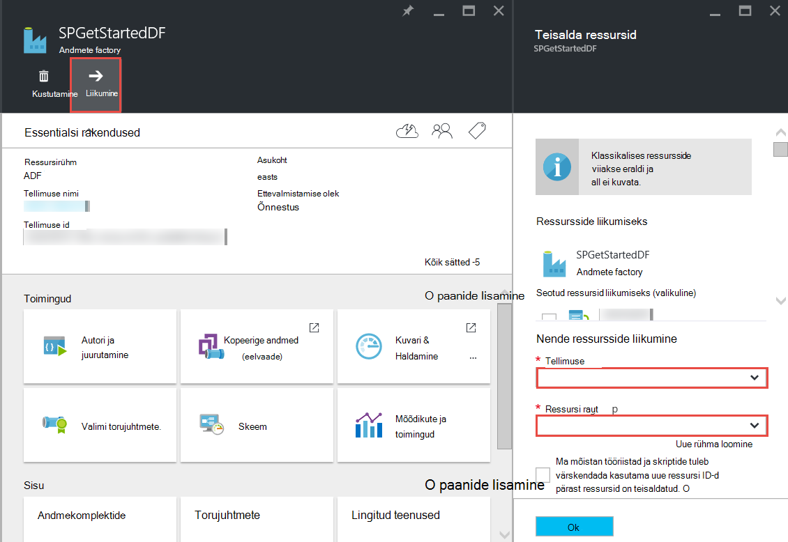

<properties 
    pageTitle="Azure'i andmed Factory - korduma kippuvad küsimused" 
    description="Korduma kippuvad küsimused Azure'i andmete hankimise kohta." 
    services="data-factory" 
    documentationCenter="" 
    authors="sharonlo101" 
    manager="jhubbard" 
    editor="monicar"/>

<tags 
    ms.service="data-factory" 
    ms.workload="data-services" 
    ms.tgt_pltfrm="na" 
    ms.devlang="na" 
    ms.topic="article" 
    ms.date="09/12/2016" 
    ms.author="shlo"/>

# Azure'i andmed Factory - korduma kippuvad küsimused

## Üldised küsimused

### Mis on Azure andmete Factory?

Andmete Factory on pilvepõhist andmete integreerimise teenuse selle **automatiseerib liikumine ja andmete teisendus**. Seadmed tooraine ja muutuda valmis käivituva factory, nagu andmete Factory orchestrates olemasolevad teenused, mis töötlemata andmete kogumise ja muuta see valmis kasutada teavet. 
 
Andmete Factory võimaldab teil luua nii kohapealse ja pilveteenuse andmete salvestab samuti Arvuta teenused, nt Windows Azure Hdinsightiga ja Azure Lake andmeanalüüsi protsessi/transformatsioon andmete vahel andmete teisaldamiseks Andmepõhiste töövood. Kui olete loonud kohaletoimetamisel, mis sooritavad toiming, mille peate, saate ajastada töötamine perioodiliselt (tunni, kord päevas, kord nädalas jne).   

Üksikasjalikumat teavet teemast [Ülevaade ja klahvi põhimõtet](data-factory-introduction.md) . 

### Kui leiate Azure'i andmed Factory üksikasjad hinnad?

Lugege teemat [andmete Factory hinnad üksikasjade lehe] [ adf-pricing-details] jaoks Azure'i andmed Factory hinnakirjad üksikasjad.  

### Kuidas alustada Azure'i andmed Factory?

- Azure'i andmed Factory ülevaate leiate teemast [Azure'i andmed Factory tutvustus](data-factory-introduction.md).
- Juhendi **Teisalda andmete** kopeerimine tegevuse kohta, leiate [Azure'i bloobimälu Azure SQL-andmebaasiga andmete kopeerimine](data-factory-copy-data-from-azure-blob-storage-to-sql-database.md).
- Õpetuse kohta, kuidas **muuta andmete** kasutamine Hdinsightiga taru tegevuse. Vt [protsess andmete käitades taru skripti Hadoopi kobar](data-factory-build-your-first-pipeline.md) 
  
### Mis on andmete Factory saadaval?
Andmete Factory on saadaval **USA Lääne** ja **Põhja-Europe**. Arvuta ja salvestusruumi teenuseid kasutada andmete tehased võib olla mujal. Lugege teemat [toetatud regioonide](data-factory-introduction.md#supported-regions). 
 
### Millised piirangud andmete tehased/torujuhtmete/tegevuste/andmekomplektide arv?
 
[Azure'i tellimus ja teenuste piirangud, kvootide ja piiranguid](../azure-subscription-service-limits.md#data-factory-limits) artikli teemast **Azure andmete Factory piirangud** jaotises.

### Mis on Azure andmete Factory teenusega loome Arendaja kogemus?

Saate Autor/luua andmete tehased, kasutades ühte järgmistest:

- **Azure'i portaalis**  
   The andmete Factory labad Azure'i portaalis pakuvad rikkaliku kasutajaliidese tehased ad lingitud andmeteenused loomiseks. **Andmete Factory Editori**, milles on ka portaali, võimaldab teil hõlpsasti luua lingitud teenused, tabelite, andmekogumi ja torujuhtmete JSON määratlused neid artefakte määramisega. Näide portaali/redaktori abil luua ja juurutada andmete factory leiate [koostada oma esimese andmete müügivõimaluste Azure'i portaalis](data-factory-build-your-first-pipeline-using-editor.md) .

- **Visual Studio**  
   Visual Studio abil saate luua ka Azure'i andmed factory. Üksikasjad leiate [koostada oma esimese andmete müügivõimaluste Visual Studio abil](data-factory-build-your-first-pipeline-using-vs.md) . 

- **Azure'i PowerShelli**  
   vt [loomine ja kuvari Azure'i andmed Factory Azure PowerShelli kaudu](data-factory-build-your-first-pipeline-using-powershell.md) õpetuse/selgituse loomise andmete factory, PowerShelli kaudu. Lugege teemat [Andmete Factory cmdleti viide] [ adf-powershell-reference] sisu MSDN-i teeki täielik dokumentatsiooni andmete Factory cmdlet-käske.
   
- **.NET Klassiteek**  
   andmete Factory .NET SDK abil saate luua programmiliselt andmete tehased. Vt [loomine, jälgimine ja haldamine andmete tehased kasutades .NET SDK](data-factory-create-data-factories-programmatically.md) loomine andmete factory, kasutades .NET SDK ülevaadet. Teemast [Andmete Factory klassi teegi juhend] [ msdn-class-library-reference] andmete Factory .NET SDK täielik dokumentatsiooni.

- **REST API**  
   luua ja juurutada andmete tehased saate kasutada ka esitatud Azure'i andmed Factory teenuse REST API-ga. Teemast [Andmete Factory REST API juhend] [ msdn-rest-api-reference] täielik dokumentatsiooni andmete Factory REST API.
 
- **Azure'i ressursihaldur malli** 
   näha [õpetus: koostada oma esimese Azure'i andmed factory Azure'i ressursihaldur malli abil](data-factory-build-your-first-pipeline-using-arm.md) küsiks üksikasjad. 

### Kas andmete factory saab ümber nimetada?
Ei. Muud Azure ressursid, nagu on Azure andmete factory nime ei saa muuta. 

### Andmete factory saate teisaldada ühe Azure tellimuse teise? 
Jah. Kasutada **teisaldamine** nuppu teie andmete factory tera nagu on näidatud järgmisel joonisel. 

### Mis on andmete Factory ei toeta Arvuta keskkondade?
Järgmises tabelis loetletakse Arvuta keskkonnad andmete Factory ja tegevused, mida saate kasutada neid ei toeta. 

| Arvutage keskkonnas | tegevuste |
| ------------------- | -------- | 
| [Nõudmisel Hdinsightiga kobar](data-factory-compute-linked-services.md#azure-hdinsight-on-demand-linked-service) või [Hdinsightile oma kobar](data-factory-compute-linked-services.md#azure-hdinsight-linked-service) | [DotNet](data-factory-use-custom-activities.md), [taru](data-factory-hive-activity.md), [siga](data-factory-pig-activity.md), [MapReduce](data-factory-map-reduce.md), [Hadoop Streaming](data-factory-hadoop-streaming-activity.md) | 
| [Azure'i paketi](data-factory-compute-linked-services.md#azure-batch-linked-service) | [DotNet](data-factory-use-custom-activities.md) |  
| [Azure'i masina õpetused](data-factory-compute-linked-services.md#azure-machine-learning-linked-service) | [Arvuti Õppekeskuse tegevusi: paketi täitmise ja Update ressurss](data-factory-azure-ml-batch-execution-activity.md) |
| [Azure'i andmeanalüüsi Lake](data-factory-compute-linked-services.md#azure-data-lake-analytics-linked-service) | [Andmete Lake Analytics U-SQL-is](data-factory-usql-activity.md)
| [Azure SQL-i](data-factory-compute-linked-services.md#azure-sql-linked-service), [SQL Azure'i andmebaas](data-factory-compute-linked-services.md#azure-sql-data-warehouse-linked-service), [SQL Server](data-factory-compute-linked-services.md#sql-server-linked-service) | [Salvestatud protseduur](data-factory-stored-proc-activity.md)

## Tegevuste – KKK
### Mis on tegevused, mida saate kasutada andmete Factory müügivõimaluste erinevat tüüpi? 

- [Andmete liikumine tegevusi](data-factory-data-movement-activities.md) andmete teisaldamiseks.
- Protsessi transformatsiooni lisamiseks andmete [Tegevusi andmete teisendamiseks](data-factory-data-transformation-activities.md) . 

### Kui toimingu käivitada?
Andmetabelis väljundi **kättesaadavus** Otsingukonfiguratsiooni säte määratleb, kui tegevuse töötab. Kui määratud on Sisestuskeel andmekomplektide, tegevuse kontrollib, kas kõik sisendandmete sõltuvused on täidetud (st **valmis** riik) enne selle algust, kus töötab. 

## Kopeerige tegevus – KKK
### Kas see on parem on mitu tegevustega müügivõimaluste või eraldi müügivõimaluste iga tegevuse? 
Torujuhtmete peaksid esitlusega sidumiseks seotud tegevusi. Kui neid andmekomplektide ei ole tarbitud muu tegevuse väljaspool tulemas, saate hoida tegevuste ühe teel. Sellisel viisil ei peate ahelas müügivõimaluste aktiivsed perioodid, et need omavahel joondada. Andmetervikluse sisemise tulemas tabelite paremini säilib ka tulemas värskendamisel. Müügivõimaluste värskenduse põhiosas lõpetab kõik tulemas tegevust, nende eemaldab ja loob nende uuesti. Kaudu loome perspektiivi, samuti võib oleks mugavam vaadata üks JSON-fail tulemas on seotud tegevusi andmete voogu.

### Mis on toetatud andmete?
[AZURE.INCLUDE [data-factory-supported-data-stores](../../includes/data-factory-supported-data-stores.md)]

### Mis on toetatud failivormingud? 
[AZURE.INCLUDE [data-factory-file-format](../../includes/data-factory-file-format.md)]

### Kus on koopia toimingut teha? 
Vt jaotisest [globaalselt olemasolevate andmete liikumine](data-factory-data-movement-activities.md#global) . Lühidalt, kui ka kohapealse andmesalve on kaasatud, kopeerimine toimub kohapealse keskkonna Andmehalduslüüsi. Ja siis andmete liikumine on kaks cloud salvestab, on Kopeeri tehe sama geograafia valamu kohta kõige lähemal piirkonna. 

## Hdinsightiga tegevus – KKK

### Regioonid, mis toetab Hdinsightiga?

Järgmises artiklis jaotisest geograafiline kättesaadavus: või [Hdinsightiga hinnad üksikasjad][hdinsight-supported-regions].

### Piirkond, mis kasutavad kuvatakse nõudmisel Hdinsightiga kobar?

Kui on olemas määratud koos klaster talletamist piirkonna luuakse nõudmisel Hdinsightiga kobar.    

### Kuidas täiendavat salvestusruumi kontod klaster Hdinsightiga siduda?

Kui kasutate oma Hdinsightiga kobar (BYOC - tuua oma kobar), leiate järgmistest teemadest: 

- [Alternatiivsete salvestusruumi kontod ja Metastores on Hdinsightiga kobar kasutamine][hdinsight-alternate-storage]
- [Täiendav salvestusruum kontod Hdinsightiga taru kasutamine][hdinsight-alternate-storage-2]

Nõudmisel kobar, mis on loodud andmete Factory teenuse kasutamisel saate määrata täiendavat salvestusruumi Kontod soovitud Hdinsightiga lingitud teenus, et andmete Factory teenuse saab teie nimel registreerida. JSON määratluses nõudmisel lingitud teenus, **additionalLinkedServiceNames** atribuudi abil saate määrata alternatiivse salvestusruumi kontod, nagu on näidatud järgmises JSON koodilõigu:
 
    {
        "name": "MyHDInsightOnDemandLinkedService",
        "properties":
        {
            "type": "HDInsightOnDemandLinkedService",
            "typeProperties": {
                "clusterSize": 1,
                "timeToLive": "00:01:00",
                "linkedServiceName": "LinkedService-SampleData",
                "additionalLinkedServiceNames": [ "otherLinkedServiceName1", "otherLinkedServiceName2" ] 
            }
        }
    } 

Ülaltoodud näites otherLinkedServiceName1 ja otherLinkedServiceName2 tähistavad lingitud teenused, mille määratlused sisaldavad identimisteavet, mida Hdinsightiga kobar vajab alternatiivse salvestusruumi kontod.

## Sektorite – KKK

### Miks on minu Sisestuskeel sektorid pole valmis olekus?  
Levinud viga pole säte **välise** atribuudi väärtuseks **true** Sisestuskeel andmekomplekti kohta, kui sisendandmete on väliste andmete factory, (mitte andmed factory toodetud). 

Järgmises näites, peate ainult määratud **välise** true **dataset1**sees.  

**DataFactory1** Müügivõimaluste 1: -> dataset1 nυuded1 -> dataset2 -> activity2 -> dataset3 müügivõimaluste 2: dataset3 -> activity3 -> dataset4

Kui teil on mõne muu andmete factory koos kohaletoimetamisel, mis viib dataset4 (toodetud müügivõimaluste 2 andmete factory 1), märgi dataset4 on välised andmekomplekti Kuna andmekomplekti toodab erinevat tüüpi andmete factory (DataFactory1, mitte DataFactory2).  

**DataFactory2**    
Müügivõimaluste 1: -> dataset4 activity4 -> dataset5

Kui välise atribuut on õigesti seatud, veenduge, kas sisendandmete on olemas Sisestuskeel andmekomplekti määratluses määratud asukohta. 

### Kuidas tükk keskööst, millal on iga päev toodetud sektorit kui mõnel muul ajal käivitada?
Atribuudi **offset** abil saate määrata sektorit koostatud soovitud aeg. Vaadake [andmekomplekti-saadavus](data-factory-create-datasets.md#Availability) osa selle atribuudi üksikasjad. Siin on lihtne näide:

    "availability":
    {
        "frequency": "Day",
        "interval": 1,
        "offset": "06:00:00"
    }

Igapäevane sektorid algavad asemel vaikimisi keskööst **6 kohta** .     

### Kuidas saab mõnda sektorit uuesti käivitada?
Käivitage tükk ühel järgmistest viisidest: 

- Soovitud tegevus akna või sektorit uuesti jälgimine ja haldamine rakenduse abil. Vaadake [Käivita uuesti valitud tegevuse windows](data-factory-monitor-manage-app.md#re-run-selected-activity-windows) olevaid juhiseid.   
- Jaoks sektorit Azure'i portaalis **Andmete sektorit** enne käsu ribal nuppu **Käivita** .
- Käivitage cmdlet **Set-AzureRmDataFactorySliceStatus** olekuks, on **Ootel** jaoks sektorit.   
    
        Set-AzureRmDataFactorySliceStatus -Status Waiting -ResourceGroupName $ResourceGroup -DataFactoryName $df -TableName $table -StartDateTime "02/26/2015 19:00:00" -EndDateTime "02/26/2015 20:00:00" 

Teemast [Set-AzureRmDataFactorySliceStatus] [ set-azure-datafactory-slice-status] cmdlet-käsu kohta lisateavet. 

### Kui kaua kulus töötlemine on?
Tegevuste aknas Exploreri jälgimine ja haldamine rakenduse abil saate teada, kui kaua kulus töötlemiseks andmete sektorit. Üksikasjad leiate [Tegevuse akna Explorer](data-factory-monitor-manage-app.md#activity-window-explorer) . 

Saate teha ka järgmist Azure'i portaalis.  

1. Klõpsake **Andmete FACTORY** enne oma andmete Factory **andmekomplektide** paani.
2. Klõpsake kindla andmekomplekti **andmekomplektide** enne.
3. Valige sektorit, mida olete huvitatud **tabeli** enne loendist **Viimatised sektorid** .
4. Klõpsake tegevuse **Andmete sektorit** enne **Tegevuse käivitatakse** loendist Käivita. 
5. Klõpsake **atribuutide** paani **Tegevuste käivitamine üksikasju** enne. 
6. Peaksite nägema välja **kestus** väärtusega. See väärtus on sektorit kuluv aeg.   

### Kuidas peatada esitatava sektorit?
Kui vajate piirkonnast ja täitmise lõpetada, saate kasutada cmdlet-käsk [Peata-AzureRmDataFactoryPipeline](https://msdn.microsoft.com/library/mt603721.aspx) . Praegu peatamise tulemas peatada sektorit täitmised, mis on pooleli. Kui pooleli täitmised lõpetanud, pole eest sektorit on kätte.

Kui soovite peatada kõik täitmised kohe, oleks ainus viis tulemas kustutada ja uuesti luua. Kui otsustate kustutada tulemas, peate kustutama tabelite ja lingitud teenused, mis kasutab funktsiooni kohaletoimetamisel. 

[create-factory-using-dotnet-sdk]: data-factory-create-data-factories-programmatically.md
[msdn-class-library-reference]: https://msdn.microsoft.com/library/dn883654.aspx
[msdn-rest-api-reference]: https://msdn.microsoft.com/library/dn906738.aspx

[adf-powershell-reference]: https://msdn.microsoft.com/library/dn820234.aspx 
[azure-portal]: http://portal.azure.com
[set-azure-datafactory-slice-status]: https://msdn.microsoft.com/library/mt603522.aspx

[adf-pricing-details]: http://go.microsoft.com/fwlink/?LinkId=517777
[hdinsight-supported-regions]: http://azure.microsoft.com/pricing/details/hdinsight/
[hdinsight-alternate-storage]: http://social.technet.microsoft.com/wiki/contents/articles/23256.using-an-hdinsight-cluster-with-alternate-storage-accounts-and-metastores.aspx
[hdinsight-alternate-storage-2]: http://blogs.msdn.com/b/cindygross/archive/2014/05/05/use-additional-storage-accounts-with-hdinsight-hive.aspx
 
