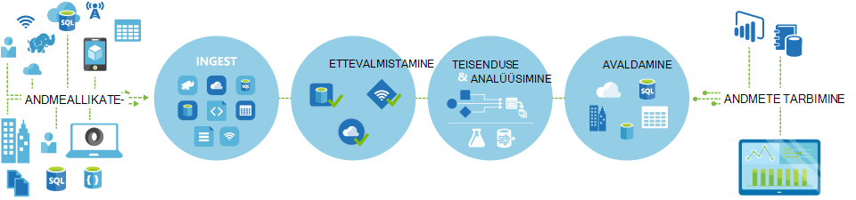
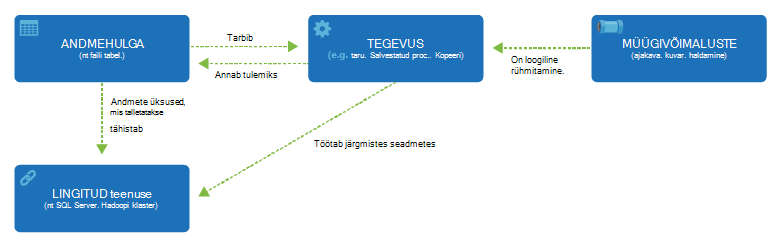

<properties 
    pageTitle="Sissejuhatus andmete Factory andmete integreerimise teenust | Microsoft Azure'i" 
    description="Siit saate teada, mis on Azure andmete Factory: pilveteenuste andmete integreerimine teenus, mis orchestrates automatiseerib liikumine ja andmete teisendus." 
    keywords="andmete integreerimine, cloud andmete integreerimine, mis on azure andmete factory"
    services="data-factory" 
    documentationCenter="" 
    authors="sharonlo101" 
    manager="jhubbard" 
    editor="monicar"/>

<tags 
    ms.service="data-factory" 
    ms.workload="data-services" 
    ms.tgt_pltfrm="na" 
    ms.devlang="na" 
    ms.topic="get-started-article" 
    ms.date="09/22/2016" 
    ms.author="shlo"/>

# Azure'i andmed Factory teenus, andmete integreerimise teenust pilves tutvustus

## Mis on Azure andmete Factory? 
Andmete Factory on pilvepõhist andmete integreerimine teenus, mis orchestrates ja automatiseerib **liikumine** ja andmete **teisendus** . Saate luua andmete integreerimise lahendusi andmete Factory teenuse abil saate neelata erinevad andmed salvestab andmed, transformatsioon/protsessi andmed ja seejärel tulemi andmed andmete avaldamine. 

Andmete Factory teenus võimaldab teil luua andmete torustikud teisaldada ja muuta andmete ja seejärel käivitage torujuhtmete määratud intervalliga (tunni, iga päev, iga nädal, jne). See sisaldab ka rikkalike visualiseeringute kuvamiseks pärandi ja teie andmete torujuhtmete sõltuvuste ja jälgida kõiki oma andmete torujuhtmete ühe ühendatud vaates hõlpsasti täpselt probleemid ja jälgimine teatiste häälestamine.

**joonis1.** Neelata mitmesugustest andmeallikatest pärinevate andmete ettevalmistamine, muuta, ja andmete analüüsimiseks ja avaldage valmis kasutada andmete tarbimine.

## Torujuhtmed ja tegevuste
Andmete Factory lahenduse, saate luua ühe või mitme andmete **torujuhtmete**. Müügivõimaluste on loogiline rühmitamine tegevuse. Neid kasutatakse rühma tegevuste ühikuks, mis koos toimingu. 

**Tegevuste** määratleda toiminguid sooritada oma andmete põhjal. Näiteks võib kasutada Kopeeri tegevuse ühe andmesalve andmete kopeerimine teise andmesalve. Samuti võite kasutada taru tegevust, mis töötab ka Windows Azure Hdinsightiga kobar muuta või andmete analüüsimine taru päringu. Andmete Factory toetab kahte tüüpi tegevusi: andmete liikumine ja andmete teisendus tegevus. 
  
## Tegevuste andmete liikumine 
[AZURE.INCLUDE [data-factory-supported-data-stores](../../includes/data-factory-supported-data-stores.md)]

Vaadake teemat [Andmete liikumine tegevuste](data-factory-data-movement-activities.md) artikli üksikasjade. 

## Tegevusi andmete teisendamiseks
[AZURE.INCLUDE [data-factory-transformation-activities](../../includes/data-factory-transformation-activities.md)]

Vt [Tegevusi andmete teisendamiseks](data-factory-data-transformation-activities.md) artikkel rohkem teavet.

Kui teil on vaja liikuda andmete lisamine andmete talletamiseks, et Kopeeri tegevuse ei toetavad, või muuta andmeid, kasutades oma loogika, luua ka **kohandatud .NET tegevuse**. Loomise ja kasutamise kohandatud toimingute kohta leiate teemast [kasutamise kohandatud tegevuste on Azure andmete Factory kohaletoimetamisel](data-factory-use-custom-activities.md).

## Lingitud teenused
Lingitud teenuste määratlemine andmete Factory välised ressursid ühenduse loomiseks vajalik teave (näited: Azure'i salvestusruumi, asutusesisese SQL Server Windows Azure Hdinsightiga). Lingitud teenuseid kasutatakse andmete Factory kaks otstarbel:

- Tähistada on **andmete talletamiseks** , sealhulgas, kuid mitte ainult, asutusesisese SQL Serveri Oracle'i andmebaasiga, failide ühiskasutus või Azure'i bloobimälu kontot. Jaotisest [andmete liikumine tegevuste](data-factory-data-movement-activities.md) loendi jaoks toetatud andmete poed. 
- Tähistada on **arvutada ressursi** majutavad toimingu teostamine. Näiteks HDInsightHive tegevuse töötab ka Hdinsightiga Hadoopi kobar. Vaadake [tegevusi andmete teisendamiseks](data-factory-data-transformation-activities.md) osa loendi jaoks toetatud Arvuta keskkonnas. 

## Andmekomplektide 
Lingitud teenuste andmete linkimine on Azure andmete factory. Andmekomplektide tähistavad kasutatavad andmestruktuurid ja salvestab andmed. Näiteks sisaldab teenuse Azure Storage lingitud ühenduse teavet andmete Factory Azure Storage konto ühenduse. Mõne Azure'i bloobimälu andmekomplekti saate määrata bloobimälu container ja kaust, millest tulemas lugege andmed Azure'i bloobimälu. Samuti lingitud Azure SQL-i teenuse leiate Azure'i SQL-andmebaasi ühenduse teavet ja on Azure SQL-i andmekomplekti määrab tabeli, mis sisaldab andmeid.   

## Andmete Factory üksuste suhe
Andmete Factory on mõni klahv üksused, mis koos töötada määratlemine sisend ja väljund andmete, töötlemise sündmusi, ajakava ja ressursse, mis on vaja käivitada soovitud andmete voogu.

**joonis 2.** Andmekomplekti, tegevuse, müügivõimaluste ja lingitud teenuse seoseid

Nelja lihtsa mõisted lingitud teenused, andmekomplektide, tegevused ja torujuhtmete, olete valmis alustada! Saate [luua oma esimese kohaletoimetamisel](data-factory-build-your-first-pipeline.md). 

## Toetatud Regioonide
Praegu saate luua andmete tehased **Lääne USA**, **Ida-USA**ja **Põhja-Euroopa** piirkondades. Andmete factory pääsete juurde andmete ja arvutada teenuste teiste Azure'i piirkondade vahel andmete andmete teisaldamiseks või andmete töötlemise abil arvutada teenused. 

Azure'i andmed Factory ise ei Salvesta andmeid. See võimaldab teil luua Andmepõhiste puhul korraldab [toetatud andmete](data-factory-data-movement-activities.md#supported-data-stores) ja abil [arvutada teenuste](data-factory-compute-linked-services.md) või asutusesiseses keskkonnas andmete töötlemise vahel liikumine. Samuti saate [jälgimine ja haldamine töövoogude](data-factory-monitor-manage-pipelines.md) abil nii programmiline ja UI menetlustele. 

Ehkki Azure'i andmed Factory on saadaval ainult **USA Lääne**, **Ida-USA**ja **Põhja-Euroopa** regioonid, anda andmete liikumise andmete Factory teenus on saadaval [kogu maailmas](data-factory-data-movement-activities.md#global) mitmes piirkonnas. Juhuks, kui andmete poe asub tulemüüriga seejärel installitud [Andmehalduslüüs](data-factory-move-data-between-onprem-and-cloud.md) kohapealse keskkonna viib andmete asemel. 

Näiteks Oletame, et teie Arvuta keskkonnas, näiteks Windows Azure Hdinsightiga kobar ja Azure arvuti koolitus hakkab otsa Lääne Euroopa piirkond. Saate luua ja kasutada Azure'i andmed Factory näiteks Põhja-Euroopa ja selle abil plaanida oma Arvuta keskkonnas Lääne Euroopa tööd. Kulub mõne millisekundiga andmete Factory käivitamiseks töö Arvuta keskkonna jaoks, kuid ei muutu aja töö teie töökeskkonna kohta.

Me ei kavatse on Azure andmete Factory iga geograafia Azure'i tulevikus ei toeta.
  
## Järgmised sammud
Saate teada, kuidas luua andmete tehast andmete torujuhtmete, järgige järgmises õpetused üksikasjalikke juhiseid. 

Õppeteema | Kirjeldus
-------- | -----------
[Müügivõimaluste andmeid, mis töötleb andmeid, kasutades Hadoopi kobar koostamine](data-factory-build-your-first-pipeline.md) | Selles õpetuses koostate oma esimese Azure'i andmed factory abil andmete müügivõimaluste **protsesside andmete** taru skripti käivitades mõne kobar Windows Azure Hdinsightiga (Hadoopi). |
[Andmete müügivõimaluste andmete teisaldamiseks ühelt teisele kaks cloud andmete poed koostamine](data-factory-copy-data-from-azure-blob-storage-to-sql-database.md) | Selles õpetuses loote andmete factory müügivõimaluste koos selle **teisaldab andmed** bloobimälu SQL-andmebaasiga.
[Andmete müügivõimaluste andmete mõne andmesalve kohapealse ja pilveteenuse andmesalve, kasutades Andmehalduslüüsi vahel liikuda koostamine](data-factory-move-data-between-onprem-and-cloud.md) | Selles õpetuses koostate andmete factory müügivõimaluste ja selle **andmete viib** **asutusesisese** SQL serveri andmebaasi mõne Azure'i bloobimälu. Funktsiooni kiirtutvustus osana installimist ja konfigureerimist Andmehalduslüüsi teie arvutis. 
