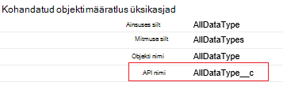
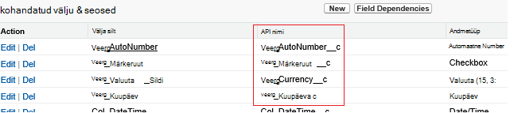

<properties
    pageTitle="Teisaldage andmed, kasutades andmete Factory Salesforce'i | Microsoft Azure'i"
    description="Lisateavet andmete teisaldamiseks Salesforce'i Azure'i andmed Factory abil."
    services="data-factory"
    documentationCenter=""
    authors="linda33wj"
    manager="jhubbard"
    editor="monicar"/>

<tags
    ms.service="data-factory"
    ms.workload="data-services"
    ms.tgt_pltfrm="na"
    ms.devlang="na"
    ms.topic="article"
    ms.date="10/25/2016"
    ms.author="jingwang"/>

# Teisaldage andmed Salesforce'i Azure'i andmed Factory abil
See artikkel kirjeldab, kuidas saate Kopeeri tegevuse on Azure andmete factory Salesforce'i andmete kopeerimine mis tahes andmesalve, mis on loetletud [Toetatud andmeallikate ja valamud](data-factory-data-movement-activities.md#supported-data-stores) tabeli valamu veerus. Selles artiklis põhineb [andmete liikumine tegevuste](data-factory-data-movement-activities.md) artikkel, mis annab ülevaate andmete liikumine Kopeeri tegevuste ja toetatud andmete poe kombinatsioonide.

Azure'i andmed Factory toetab praegu ainult jooksva andmete Salesforce'i [toetatud valamu andmete stores]((data-factory-data-movement-activities.md#supported-data-stores), kuid ei toeta teisaldada andmeid muudest andmetest talletab Salesforce'i abil.

## Eeltingimused
- Kasutage ühte Salesforce'i järgmised väljaanded: arendaja väljaande, profiväljaanne, Enterprise'i või piiramatu Edition.
- API õigus peab olema lubatud. Vt [lubamine API Salesforce'i juurdepääsu õigusi määrata?](https://www.data2crm.com/migration/faqs/enable-api-access-salesforce-permission-set/)
- Salesforce'i andmete kopeerimine kohapealse andmete poed peavad teil olema vähemalt andmete Management Gateway 2.0 installitud asutusesiseses keskkonnas.

## Salesforce'i taotluse piirangud
Salesforce'i on nii kokku API taotlusi ja API samaaegseid taotlusi piirangud. Üksikasjalikku [Salesforce'i arendaja piirangud](http://resources.docs.salesforce.com/200/20/en-us/sfdc/pdf/salesforce_app_limits_cheatsheet.pdf) artikli jaotisest "API taotlemine piirangud". Märkus Kui samaaegseid taotlusi arv ületab, pidurdamise ilmneb ja te näete juhusliku tõrkeid; Kui taotluste arv ületab, Salesforce konto on blokeeritud 24 tundi; Samuti võite saada tõrke "REQUEST_LIMIT_EXCEEDED" mõlemal juhul.

## Kopeerige andmed viisard
Lihtsaim viis loomiseks kopeerib andmete Salesforce'i toetatud valamu andmete poe on kasutada andmete kopeerimine viisard. Vt [õpetus: müügivõimaluste koopia viisardi abil luua](data-factory-copy-data-wizard-tutorial.md) kiirülevaate selgituse müügivõimaluste loomiseks Kopeerige andmed viisardi abil.

Järgmises näites sisaldab valimi JSON määratlused kasutatavad loomiseks [Azure portaali](data-factory-copy-activity-tutorial-using-azure-portal.md), [Visual Studio](data-factory-copy-activity-tutorial-using-visual-studio.md)või [Azure PowerShelli](data-factory-copy-activity-tutorial-using-powershell.md)abil. Andmete kopeerimine Salesforce'i Azure'i bloobimälu kuvatakse. Siiski saate andmeid kopeerida kõiki valamud märgitud [siin](data-factory-data-movement-activities.md#supported-data-stores) Azure'i andmed Factory Kopeeri tegevuse abil.   

## Näide: Andmete kopeerimine Salesforce'i mõne Azure'i bloobimälu
See näide kopeerib andmete Salesforce'i on Azure'i bloobimälu tunnis. JSON atribuudid, mida kasutatakse nendes näidetes kirjeldatakse jaotiste pärast näited. Saate kopeerida andmed otse mis tahes Azure'i andmed Factory Kopeeri tegevuse abil [andmete liikumine tegevuste](data-factory-data-movement-activities.md#supported-data-stores) artiklis loetletud valamud.

Siin on andmed Factory esemeid peate loomiseks rakendada seda stsenaariumi. Tehke loendis jaotistes Lisateavet nende toimingute kohta.

- Lingitud teenuse tüüpi [Salesforce'i](#salesforce-linked-service-properties)
- Lingitud teenuse tüüpi [AzureStorage](data-factory-azure-blob-connector.md#azure-storage-linked-service-properties)
- Sisestuskeel [andmekomplekti](data-factory-create-datasets.md) [RelationalTable](#salesforce-dataset-properties) tüüp
- Väljundi [andmekomplekti](data-factory-create-datasets.md) tüüpi [AzureBlob](data-factory-azure-blob-connector.md#azure-blob-dataset-type-properties)
- [Müügivõimaluste](data-factory-create-pipelines.md) Kopeeri tegevust, mis kasutab [RelationalSource](#relationalsource-type-properties) ja [BlobSink](data-factory-azure-blob-connector.md#azure-blob-copy-activity-type-properties)

**Salesforce'i lingitud teenus**

Selles näites kasutatakse **Salesforce'i** lingitud teenus. Vt [Salesforce'i lingitud teenuse](#salesforce-linked-service-properties) atribuudid, mida toetavad lingitud teenuse jaoks.  Lugege teemat [Turbeloa](https://help.salesforce.com/apex/HTViewHelpDoc?id=user_security_token.htm) juhised selle kohta, kuidas lähtestamine või tuua Turbeloa.

    {
        "name": "SalesforceLinkedService",
        "properties":
        {
            "type": "Salesforce",
            "typeProperties":
            {
                "username": "<user name>",
                "password": "<password>",
                "securityToken": "<security token>"
            }
        }
    }

**Azure'i lingitud salvestusteenus**

    {
      "name": "AzureStorageLinkedService",
      "properties": {
        "type": "AzureStorage",
        "typeProperties": {
          "connectionString": "DefaultEndpointsProtocol=https;AccountName=<accountname>;AccountKey=<accountkey>"
        }
      }
    }

**Salesforce'i andmekomplekti Sisestuskeel**

    {
        "name": "SalesforceInput",
        "properties": {
            "linkedServiceName": "SalesforceLinkedService",
            "type": "RelationalTable",
            "typeProperties": {
                "tableName": "AllDataType__c"  
            },
            "availability": {
                "frequency": "Hour",
                "interval": 1
            },
            "external": true,
            "policy": {
                "externalData": {
                    "retryInterval": "00:01:00",
                    "retryTimeout": "00:10:00",
                    "maximumRetry": 3
                }
            }
        }
    }

Andmete Factory teenuse säte **välise** **true** teatab, et andmekomplekti on väliste andmete factory ja ei esitata andmete factory toimingu.

> [AZURE.IMPORTANT] Mis tahes kohandatud objekt on vaja API nime "__c" osa.

**Azure'i bloobimälu väljundi andmekomplekti**

Andmed on kirjutatud uue bloobimälu tunnis (sagedus: tund, intervall: 1).

    {
        "name": "AzureBlobOutput",
        "properties":
        {
            "type": "AzureBlob",
            "linkedServiceName": "AzureStorageLinkedService",
            "typeProperties":
            {
                "folderPath": "adfgetstarted/alltypes_c"
            },
            "availability":
            {
                "frequency": "Hour",
                "interval": 1
            }
        }
    }

**Müügivõimaluste Kopeeri tegevus**

Tulemas sisaldab Kopeeri tegevust, mis on konfigureeritud kasutada ülaltoodud sisend ja väljund andmekomplektide, ja plaanitud käivitamiseks tunnis. JSON määratlus müügivõimaluste **Reaallika** tüüp väärtuseks **RelationalSource**ja **valamu** tüüp väärtuseks **BlobSink**.

Vaadake [RelationalSource atribuudid](#relationalsource-type-properties) atribuudid, mida toetavad selle RelationalSource loendit.

    {  
        "name":"SamplePipeline",
        "properties":{  
            "start":"2016-06-01T18:00:00",
            "end":"2016-06-01T19:00:00",
            "description":"pipeline with copy activity",
            "activities":[  
            {
                "name": "SalesforceToAzureBlob",
                "description": "Copy from Salesforce to an Azure blob",
                "type": "Copy",
                "inputs": [
                {
                    "name": "SalesforceInput"
                }
                ],
                "outputs": [
                {
                    "name": "AzureBlobOutput"
                }
                ],
                "typeProperties": {
                    "source": {
                        "type": "RelationalSource",
                        "query": "SELECT Id, Col_AutoNumber__c, Col_Checkbox__c, Col_Currency__c, Col_Date__c, Col_DateTime__c, Col_Email__c, Col_Number__c, Col_Percent__c, Col_Phone__c, Col_Picklist__c, Col_Picklist_MultiSelect__c, Col_Text__c, Col_Text_Area__c, Col_Text_AreaLong__c, Col_Text_AreaRich__c, Col_URL__c, Col_Text_Encrypt__c, Col_Lookup__c FROM AllDataType__c"             
                    },
                    "sink": {
                        "type": "BlobSink"
                    }
                },
                "scheduler": {
                    "frequency": "Hour",
                    "interval": 1
                },
                "policy": {
                    "concurrency": 1,
                    "executionPriorityOrder": "OldestFirst",
                    "retry": 0,
                    "timeout": "01:00:00"
                }
            }
            ]
        }
    }

> [AZURE.IMPORTANT] Mis tahes kohandatud objekt on vaja API nime "__c" osa.

## Salesforce'i lingitud teenuse atribuudid

Järgmises tabelis on ära toodud JSON elemente, mis on omased Salesforce'i lingitud teenuse kirjeldused.

| Atribuut | Kirjeldus | Nõutav |
| -------- | ----------- | -------- |
| tüüp | Atribuudi tüüp väärtuseks peab olema seatud: **Salesforce'i**. | Jah |
| kasutajanimi |Määrake kasutajanimi, kasutajakonto. | Jah |
| parooli | Kasutajakonto parooli määrata.  | Jah |
| securityToken | Määrake Turbeloa, kasutajakonto. Lugege teemat [Turbeloa](https://help.salesforce.com/apex/HTViewHelpDoc?id=user_security_token.htm) juhised selle kohta, kuidas lähtestamine või tuua turvalisuse luba. Üldiselt turvalisus sõned kohta lisateabe saamiseks lugege teemat [Turvalisus ja API](https://developer.salesforce.com/docs/atlas.en-us.api.meta/api/sforce_api_concepts_security.htm).  | Jah |

## Salesforce'i andmekomplekti atribuudid

Jaotised ja andmekomplektide määratlemiseks saadaolevate atribuutide täieliku loendi leiate artiklist [loomine andmekomplektide](data-factory-create-datasets.md) . Jaotiste, nt struktuuri, kättesaadavus ja Andmekomplekt JSON poliitika on sarnased kõigi andmekomplekti tüüpide (Azure SQL Azure'i bloobimälu, Azure'i tabeli ja jne).

Jaotise **typeProperties** erineb iga tüüpi andmekomplekti ja andmesalve olevate andmete asukoha teave. TypeProperties jaotises andmekomplekt tüüpi **RelationalTable** on järgmised atribuudid.

| Atribuut | Kirjeldus | Nõutav |
| -------- | ----------- | -------- |
| tableName | Salesforce'i tabeli nimi. | Ei, (kui on **päringu** **RelationalSource** on määratud) |

> [AZURE.IMPORTANT]  Mis tahes kohandatud objekt on vaja API nime "__c" osa.

## RelationalSource atribuudid

Jaotised ja atribuudid, mis on saadaval tegevuste määratlemiseks täieliku loendi leiate artiklist [loomine torujuhtmete](data-factory-create-pipelines.md) . Atribuudid, näiteks nimi, kirjeldus, sisendi ja väljundi tabelite ja erinevad poliitikad on saadaval kõigi tegevuste jaoks.

Teisalt, erinevad atribuudid, mis on saadaval jaotises typeProperties tegevuse, iga tegevuse tüüp. Kopeeri tegevuste, need sõltuvad allikate ja neeldajate tüübid.

Kopeeri tegevust, kui allika tüüp **RelationalSource** (mis sisaldab Salesforce'i), on järgmised atribuudid on saadaval jaotises typeProperties:

| Atribuut | Kirjeldus | Lubatud väärtus | Nõutav |
| -------- | ----------- | -------------- | -------- |
| päringu | Kohandatud päringu abil saate andmeid lugeda. | Päringu SQL-92 või päringu [Salesforce'i objekti päringu keele (SOQL)](https://developer.salesforce.com/docs/atlas.en-us.soql_sosl.meta/soql_sosl/sforce_api_calls_soql.htm) . Näide: `select * from MyTable__c`. | Ei, (kui **tableName** **andmekomplekti** on määratud) |

> [AZURE.IMPORTANT] Mis tahes kohandatud objekt on vaja API nime "__c" osa.

## Näpunäiteid

### Kus abil andmete toomine klausel kuupäeva ja kellaaja veerg
Kui saate määrata SOQL või SQL-i päring, pöörake tähelepanu kuupäeva ja kellaaja vormingus vahe. Näiteks:

- **SOQL näidis**: $$Text.Format ("Id, nimi, BillingCity, kus konto LastModifiedDate valimine > = {0:yyyy-MM-ddTHH:mm:ssZ} ja LastModifiedDate < {1:yyyy-MM-ddTHH:mm:ssZ}", WindowStart, WindowEnd)
- **SQL-i näidis**: $$Text.Format ("valige * konto kus LastModifiedDate: > = {{ts\'{0:yyyy-MM-dd HH:mm:ss}\'}} ja LastModifiedDate < {{ts\'{1:yyyy-MM-dd HH:mm:ss}\'}}", WindowStart, WindowEnd) ".

### Andmete toomine Salesforce'i aruandest
Saate tuua andmeid Salesforce'i aruannete, määrates päring `{call "<report name>"}`, nt `"query": "{call \"TestReport\"}"`.

### Toomine Salesforce'i prügikastist kustutatud kirjed
Päringu pehmete Salesforce'i prügikastist kustutatud kirjeid, saate määrata **"IsDeleted = 1"** päringus. Näiteks 

- Päringu ainult kustutatud kirjed, määrake "valige *MyTable__c * *kus IsDeleted = 1**"
- Päringu kõik kirjed, sh olemasoleva ja on kustutatud, määrake "valige *MyTable__c * *kus IsDeleted = 0 või IsDeleted = 1**"

[AZURE.INCLUDE [data-factory-structure-for-rectangualr-datasets](../../includes/data-factory-structure-for-rectangualr-datasets.md)]

### Salesforce'i vastendus tüüp
Salesforce'i tüüp | . NET põhinev tüüp
--------------- | ---------------
Automaatne Number | String
Märkeruut | Kahendmuutuja
Valuuta | Kahekordne
Kuupäev | Kuupäev ja kellaaeg
Kuupäev/kellaaeg | Kuupäev ja kellaaeg
E-posti | String
ID | String
Otsing ja seos | String
Hulgivaliku märkeloendi | String
Arv | Kahekordne
% | Kahekordne
Telefoni | String
Märkeloendi | String
Teksti | String
Tekstiala | String
Tekstiala (pikk) | String
Tekstiala (RTF) | String
Tekst (krüptitud) | String
URL-I | String

[AZURE.INCLUDE [data-factory-column-mapping](../../includes/data-factory-column-mapping.md)]
[AZURE.INCLUDE [data-factory-structure-for-rectangualr-datasets](../../includes/data-factory-structure-for-rectangualr-datasets.md)]

## Jõudluse ja häälestamine  
Lugege [Kopeeri tegevuse jõudlus ja häälestamise juhend](data-factory-copy-activity-performance.md) Lisateavet peamised tegurid selle mõju jõudlust andmete liikumine (Kopeeri tegevus) Azure'i andmed Factory ja optimeerida seda mitmel viisil.
