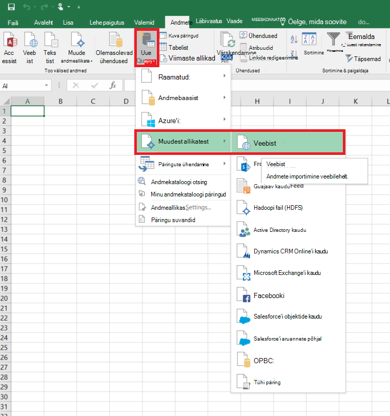
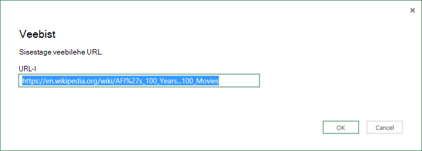
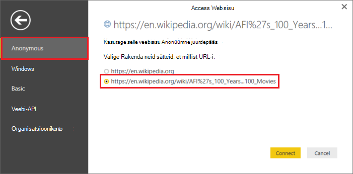
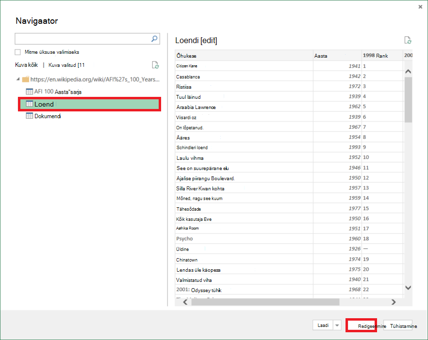
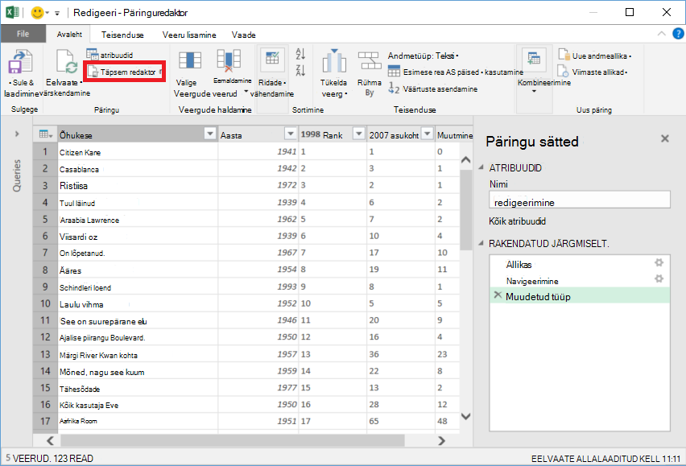
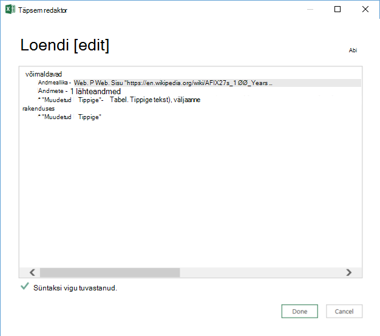

<properties 
    pageTitle="Teisaldage andmed Veebitabeli | Azure'i andmed Factory" 
    description="Teada, kuidas andmete teisaldamiseks asutusesisesest tabeli abil Azure'i andmed Factory veebilehele." 
    services="data-factory" 
    documentationCenter="" 
    authors="linda33wj" 
    manager="jhubbard" 
    editor="monicar"/>

<tags 
    ms.service="data-factory" 
    ms.workload="data-services" 
    ms.tgt_pltfrm="na" 
    ms.devlang="na" 
    ms.topic="article" 
    ms.date="09/26/2016" 
    ms.author="jingwang"/>

# Teisaldage andmed tabeli veebiallika Azure'i andmed Factory abil
Selles artiklis kirjeldatakse, kuidas saate Kopeeri tegevuse on Azure andmete factory veebilehele tabeli andmete kopeerimine teise andmesalve. Selles artiklis põhineb [andmete liikumine tegevuste](data-factory-data-movement-activities.md) artikkel, mis annab ülevaate andmete liikumine Kopeeri tegevuste ja toetatud andmete poe kombinatsioone.

Andmete factory toetab praegu ainult jooksva veebitabeli muid andmeid talletab andmeid, kuid ei liigu andmeid muudest andmetest talletab Web tabeli sihtkohta.

> [AZURE.NOTE] Selle Web konnektori toetab praegu ainult ekstraktimine tabeli sisu HTML-lehele.

## Näide: Andmete kopeerimine veebitabeli Azure'i bloobimälu

Allpool näidis kuvatakse:

1.  Lingitud teenuse tüüpi [Web](#web-linked-service-properties).
2.  Lingitud teenuse tüüpi [AzureStorage](data-factory-azure-blob-connector.md#azure-storage-linked-service-properties).
3.  Mõne Sisestuskeel [andmekomplekti](data-factory-create-datasets.md) tüüpi [WebTable](#WebTable-dataset-properties).
4.  Mõne väljundi [andmekomplekti](data-factory-create-datasets.md) tüüpi [AzureBlob](data-factory-azure-blob-connector.md#azure-blob-dataset-type-properties).
4.  [Müügivõimaluste](data-factory-create-pipelines.md) Kopeeri tegevust, mis kasutab [WebSource](#websource-copy-activity-type-properties) ja [BlobSink](data-factory-azure-blob-connector.md#azure-blob-copy-activity-type-properties).

Valimi kopeerib andmete veebitabeli on Azure'i bloobimälu tunnis. Nende proovide kasutatakse atribuutide JSON on kirjeldatud jaotiste jälgimise näidised. 

Järgmises näites kujutatakse veebitabeli andmete kopeerimine mõnda Azure'i bloobimälu. Siiski saate andmeid kopeerida otse mis tahes valamud, mis on märgitud [Andmete liikumine tegevusi](data-factory-data-movement-activities.md) artikli Azure'i andmed Factory Kopeeri tegevuse abil. 

**Web lingitud teenus** Selles näites kasutatakse lingitud veebiteenuse abil anonüümne autentimine. Vaadake [Web lingitud teenuse](#web-linked-service-properties) osa autentimine, saate kasutada erinevat tüüpi. 

    {
        "name": "WebLinkedService",
        "properties":
        {
            "type": "Web",
            "typeProperties":
            {
                "authenticationType": "Anonymous",
                "url" : "https://en.wikipedia.org/wiki/"
            }
        }
    }

**Azure'i lingitud salvestusteenus**

    {
      "name": "AzureStorageLinkedService",
      "properties": {
        "type": "AzureStorage",
        "typeProperties": {
          "connectionString": "DefaultEndpointsProtocol=https;AccountName=<accountname>;AccountKey=<accountkey>"
        }
      }
    }

**WebTable Sisestuskeel andmekomplekti** Andmete Factory teenuse säte **välise** **true** teatab, et andmekomplekti on väliste andmete factory ja ei esitata andmete factory toimingu.

> [AZURE.NOTE] Vaadake [saada register html-lehele tabeli](#get-index-of-a-table-in-an-html-page) osa saada index tabeli, HTML-leht üksikasjalikud juhised.  

    
    {
        "name": "WebTableInput",
        "properties": {
            "type": "WebTable",
            "linkedServiceName": "WebLinkedService",
            "typeProperties": {
                "index": 1,
                "path": "AFI's_100_Years...100_Movies"
            },
            "external": true,
            "availability": {
                "frequency": "Hour",
                "interval":  1
            }
        }
    }

**Azure'i bloobimälu väljund andmekomplekti**

Andmed on kirjutatud uue bloobimälu tunnis (sagedus: tund, intervall: 1). 

    {
        "name": "AzureBlobOutput",
        "properties":
        {
            "type": "AzureBlob",
            "linkedServiceName": "AzureStorageLinkedService",
            "typeProperties":
            {
                "folderPath": "adfgetstarted/Movies"
            },
            "availability":
            {
                "frequency": "Hour",
                "interval": 1
            }
        }
    }

**Torujuhe Kopeeri tegevus**

Tulemas sisaldab Kopeeri tegevust, mis on konfigureeritud kasutada ülaltoodud sisend ja väljund andmekomplektide ja plaanitud käivitamiseks tunnis. Tulemas JSON määratlus **Reaallika** tüüp väärtuseks **WebSource** ja **valamu** tüüp väärtuseks **BlobSink**. 

Vaadake selle WebSource ei toeta atribuutide loendi [WebSource atribuudid](#websource-copy-activity-type-properties) . 
    
    {  
        "name":"SamplePipeline",
        "properties":{  
        "start":"2014-06-01T18:00:00",
        "end":"2014-06-01T19:00:00",
        "description":"pipeline with copy activity",
        "activities":[  
          {
            "name": "WebTableToAzureBlob",
            "description": "Copy from a Web table to an Azure blob",
            "type": "Copy",
            "inputs": [
              {
                "name": "WebTableInput"
              }
            ],
            "outputs": [
              {
                "name": "AzureBlobOutput"
              }
            ],
            "typeProperties": {
              "source": {
                "type": "WebSource"
              },
              "sink": {
                "type": "BlobSink"
              }
            },
           "scheduler": {
              "frequency": "Hour",
              "interval": 1
            },
            "policy": {
              "concurrency": 1,
              "executionPriorityOrder": "OldestFirst",
              "retry": 0,
              "timeout": "01:00:00"
            }
          }
          ]
       }
    }

## Web lingitud teenuse atribuudid

Järgmises tabelis toodud JSON elementide teatud lingitud veebiteenuse kirjeldus.

| Atribuut | Kirjeldus | Nõutav |
| -------- | ----------- | -------- | 
| tüüp | Atribuudi tüüp väärtuseks peab olema seatud: **Web** | Jah | 
| URL-i | Veebiallika URL-i | Jah |
| authenticationType | Anonüümne või tavaline. | Jah |
| Kasutajanimi | Elementaarautentimine kasutajanimi. | Jah (Lihttekstautentimine)
| parooli | Elementaarautentimine parool. | Jah (Lihttekstautentimine)

### Anonüümne autentimine abil

    {
        "name": "web",
        "properties":
        {
            "type": "Web",
            "typeProperties":
            {
                "authenticationType": "Anonymous",
                "url" : "https://en.wikipedia.org/wiki/"
            }
        }
    }

### Tavaline autentimist kasutades
    
    {
        "name": "web",
        "properties":
        {
            "type": "Web",
            "typeProperties":
            {
                "authenticationType": "basic",
                "url" : "http://myit.mycompany.com/",
                "userName": "Administrator",
                "password": "password"
            }
        }
    }

## WebTable andmekomplekti atribuudid

Jaotised ja atribuute määratlemine andmekomplektide täieliku loendi leiate artiklist [loomine andmekomplektide](data-factory-create-datasets.md) . Jaotiste, nt struktuuri, kättesaadavus ja Andmekomplekt JSON poliitika on sarnased kõigi andmekomplekti tüüpide (Azure SQL, Azure'i bloobimälu, Azure'i tabeli jne).

Jaotise **typeProperties** erineb iga tüüpi andmekomplekti ja andmesalve olevate andmete asukoha teave. Andmekomplekti typeProperties jaotises tüüp **WebTable** on järgmised atribuudid

Atribuut | Kirjeldus | Nõutav
:-------- | :----------- | :--------
tüüp    | andmekomplekti tüüp. peab olema seatud **WebTable** | Jah
tee | Suhteline URL ressursi, mis sisaldab tabelit. | Ei. Kui tee pole määratud, kasutatakse ainult lingitud teenuse määratlus määratud URL. 
index | Tabeli Ressursi register. Vaadake [saada register html-lehele tabeli](#get-index-of-a-table-in-an-html-page) osa saada registri tabeli, HTML-leht üksikasjalikud juhised. | Jah

**Näide:**

    {
        "name": "WebTableInput",
        "properties": {
            "type": "WebTable",
            "linkedServiceName": "WebLinkedService",
            "typeProperties": {
                "index": 1,
                "path": "AFI's_100_Years...100_Movies"
            },
            "external": true,
            "availability": {
                "frequency": "Hour",
                "interval":  1
            }
        }
    }

## WebSource - atribuutide kopeerimine tegevuse tüüp

Jaotised ja atribuudid, mis on saadaval tegevuste määratlemiseks täieliku loendi leiate artiklist [Torujuhtmete loomine](data-factory-create-pipelines.md) . Näiteks nimi, kirjeldus, sisestus- ja väljundi tabelite ja poliitika atribuudid on saadaval kõigi tegevuse tüüp. 

Tegevuse typeProperties jaotise saadaolevad atribuudid erinevad teiselt iga tegevuse tüüp. Kopeeri tegevuste, need sõltuvad allikate ja neeldajate tüübid.

Praegu, kui allika Kopeeri tegevuse tüüp **WebSource**, pole täiendavad atribuudid on toetatud. 

## Saada index tabeli, HTML-leht

1. Käivitage **Excel 2016** ja menüü **andmed** .  
2. Klõpsake tööriistaribal nuppu **Uus päring** , osutage käsule **Muust allikast** ja nuppu **Veebist**.
    
     
3. Sisestage dialoogiboksis **Veebist** **URL** , mida soovite kasutada lingitud teenuse JSON (näiteks: https://en.wikipedia.org/wiki/) koos määrate andmekogumi tee (nt: AFI % 27s_100_Years... 100_Movies), ja klõpsake nuppu **OK**. 

     

    Selles näites kasutatakse URL: https://en.wikipedia.org/wiki/AFI%27s_100_Years...100_Movies 
4.  Kui kuvatakse dialoogiboks **Accessi veebisisu** , valige õige **URL-i**, **autentimine**, ja klõpsake nuppu **Ühenda**. 

    
5.  Klõpsake **tabeli** üksuse puuvaates tabeli sisu vaatamine ja seejärel klõpsake nuppu allosas nuppu **Redigeeri** .  

     

5. **Päringuredaktori** aken, klõpsake tööriistaribal nuppu **Täpsem redaktor** .

    

6. Dialoogiboksi Täpsem redaktor "Allikas" kõrval olev number on indeks.

     

Kui kasutate rakendust Excel 2013, [Microsoft Power Query for Exceli](https://www.microsoft.com/download/details.aspx?id=39379) abil saate registri. Vt [ühenduse loomine veebilehega](https://support.office.com/article/Connect-to-a-web-page-Power-Query-b2725d67-c9e8-43e6-a590-c0a175bd64d8) artikkel üksikasju. Juhised on sarnased, kui kasutate [Microsoft Power BI lauaarvuti jaoks](https://powerbi.microsoft.com/desktop/). 

[AZURE.INCLUDE [data-factory-column-mapping](../../includes/data-factory-column-mapping.md)]

[AZURE.INCLUDE [data-factory-structure-for-rectangualr-datasets](../../includes/data-factory-structure-for-rectangualr-datasets.md)]

## Jõudluse ja häälestamine  
Vaata [Kopeeri tegevuse jõudlus ja häälestamine juhend](data-factory-copy-activity-performance.md) Lisateavet peamised tegurid selle mõju jõudlust andmete liikumine (Kopeeri tegevus) Azure'i andmed Factory ja optimeerida seda mitmel viisil.
