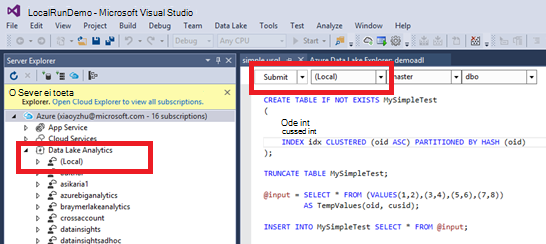

<properties
   pageTitle="Arendamise U-SQL-i skriptide abil andmete Lake tööriistad Visual Studio | Azure'i"
   description="Saate teada, kuidas installida Visual Studios, kuidas luua ja testi U-SQL-i skriptide Lake Andmeriistad. "
   services="data-lake-analytics"
   documentationCenter=""
   authors="edmacauley"
   manager="jhubbard"
   editor="cgronlun"/>

<tags
   ms.service="data-lake-analytics"
   ms.devlang="na"
   ms.topic="get-started-article"
   ms.tgt_pltfrm="na"
   ms.workload="big-data"
   ms.date="05/16/2016"
   ms.author="edmaca"/>

# Õpetus: arendamise U-SQL-i skriptide abil andmete Lake tööriistad Visual Studio

[AZURE.INCLUDE [get-started-selector](../../includes/data-lake-analytics-selector-get-started.md)]

Saate teada, kuidas installida Lake Andmeriistad Visual Studio ja kirjutamine ja testida U-SQL-i skriptide Data Lake Tools for Visual Studio abil.

A-SQL-is on hyper-scalable, hõlpsalt laiendatav keel ettevalmistamiseks, mis võimaldab transformeerida ja andmete järves ja lisaks kõigi andmete analüüsimine. Lisateavet leiate teemast [A – SQL-i viide] (http://go.microsoft.com/fwlink/p/?LinkId=691348).

##Eeltingimused

- **Visual Studio 2015, Visual Studio 2013 update 4 või Visual Studio 2012. Ettevõtte (Ultimate/Premium), professionaalse ühenduse väljaannetes toetatud; Kiire edition ei toetata. Visual Studio "15" pole praegu toetatud ja mis kohta.**
- **Microsoft Azure'i SDK .net-i versioon 2.7.1 või kohale**.  Installige see [Web platvormi Installeri](http://www.microsoft.com/web/downloads/platform.aspx)abil.
- **[Andmete Lake tööriistade Visual Studio](http://aka.ms/adltoolsvs)**.

    Kui andmete Lake Tools for Visual Studio on installitud, kuvatakse "Andmeanalüüsi Lake" sõlm Server Explorer jaotises "Azure" sõlme (saate avada Server explorer, vajutades klahvikombinatsiooni Ctrl + Alt + S).

- **Järgmised kaks jaotist [Azure portaali kasutamise alustamine Azure'i andmeanalüüsi Lake](data-lake-analytics-get-started-portal.md)läbida**.

    - [Azure'i andmeanalüüsi Lake konto loomine](data-lake-analytics-get-started-portal.md#create_adl_analytics_account).
    - [Lake andmesalv vaikekonto SearchLog.tsv üles laadida](data-lake-analytics-get-started-portal.md#update-data-to-the-default-adl-storage-account).

    Teie mugavuse huvides valimi PowerShelli skripti loomise andmete Lake analüütiline teenuse ja allika andmete faili üleslaadimine leiate [Appx-A PowerShelli valimi õpetuse ettevalmistamine](data-lake-analytics-data-lake-tools-get-started.md#appx-a-powershell-sample-for-preparing-the-tutorial).

    Andmete Lake tööriistad ei toeta loomise andmete Lake Analyticsi kontod. Seega peate looma selle Azure'i portaalis, Azure PowerShelli, .NET SDK või Azure CLI. Andmeanalüüsi Lake töö käivitamiseks peate mõned andmed. Ehkki Lake Andmeriistad toetab üleslaadimisel andmeid, kasutage portaali üles laadida Näidisandmete selles õpetuses hõlbustamiseks jälgimiseks.

## Azure'i ühendamine

**Ühenduse loomiseks Lake andmeanalüüsi**

1. Avage Visual Studio.
2. Klõpsake menüü **Vaade** nuppu **Server Explorer** serveri Exploreri avamiseks. Või vajutage **[CTRL] + [ALT] + S**.
3. Paremklõpsake **Azure**, klõpsake "Ühenduse abil Microsoft Azure'i tellimus" ja seejärel järgige juhiseid.
4. **Server Explorer**, laiendage **Azure**ja seejärel laiendage **Lake andmeanalüüsi**. Oma andmete Lake Analyticsi kontod loendi peab näete, kui on olemas. Visual Studio ei saa luua andmete Lake Analyticsi kontod. Konto loomiseks vaadake teemat [Azure portaali kasutamise alustamine Azure'i andmeanalüüsi Lake](data-lake-analytics-get-started-portal.md) või [Alustamine Azure'i Lake andmeanalüüsi Azure PowerShelli kaudu](data-lake-analytics-get-started-powershell.md).

## Allika andmete failide üleslaadimine

**Eelnevalt nõutud** jaotises mõned andmed on üles laaditud on õpetuses.  

Juhuks, kui soovite kasutada oma andmetega, siit leiate toiminguid üleslaadimise Lake Andmeriistad andmeid.

**Failide üleslaadimine sõltuvad Azure'i andmed Lake kontole**

1. **Server Explorer**, laiendage **Azure**, laiendage **Lake andmeanalüüsi**, laiendage Lake andmeanalüüsi kontole, laiendage **Salvestusruumi kontod**. Näete peab Lake andmesalv vaikekonto ja lingitud Lake andmesalv kontod ja lingitud Azure Storage kontod. Andmete Lake vaikekonto on silt "Vaikekonto salvestusruumi".
2. Paremklõpsake Vaikimisi Lake andmesalv konto ja klõpsake **Explorer**.  Avab Visual Studio Explorer paan Lake Andmeriistad.  Vasak, seda näitab puuvaates, sisu kuvamine on õigus.
3. Otsige sirvides üles kaust, kuhu soovite faile, laadida
4. Paremklõpsake mõnda tühja ala ja seejärel suvandit **üleslaadimine**.

    

**Failide üleslaadimiseks seotud Azure'i bloobimälu salvestusruumi konto**

1. **Server Explorer**, laiendage **Azure**, laiendage **Lake andmeanalüüsi**, laiendage Lake andmeanalüüsi kontole, laiendage **Salvestusruumi kontod**. Näete peab Lake andmesalv vaikekonto ja lingitud Lake andmesalv kontod ja lingitud Azure Storage kontod.
2. Laiendage Azure Storage konto.
3. Paremklõpsake ümbris, kuhu soovite faile üles laadida, ja klõpsake **Explorer**. Kui teil pole ümbris, peate esmalt looma Azure portaali, Azure PowerShelli või muude tööriistade abil.
4. Otsige sirvides üles kaust, kuhu soovite faile, laadida
5. Paremklõpsake mõnda tühja ala ja seejärel klõpsake **Laadi üles**.

## U-SQL skriptide töötada

Andmeanalüüsi Lake töö kirjutada U-SQL-i keeles. A-SQL-i kohta leiate lisateavet teemast [Alustamine U-SQL-i keele](data-lake-analytics-u-sql-get-started.md) ja [U-SQL-i keele viide](http://go.microsoft.com/fwlink/?LinkId=691348).

**Luua ja esitada Lake andmeanalüüsi töö**

1. Klõpsake menüü **fail** nuppu **Uus**ja seejärel klõpsake nuppu **projekti**.
2. Valige **U-SQL-i projekti** tüüp.

    

3. Klõpsake nuppu **OK**. Visual studio loob lahenduse **Script.usql** faili abil.
4. Sisestage järgmine skript **Script.usql**.

        @searchlog =
            EXTRACT UserId          int,
                    Start           DateTime,
                    Region          string,
                    Query           string,
                    Duration        int?,
                    Urls            string,
                    ClickedUrls     string
            FROM "/Samples/Data/SearchLog.tsv"
            USING Extractors.Tsv();

        @res =
            SELECT *
            FROM @searchlog;        

        OUTPUT @res   
            TO "/Output/SearchLog-from-Data-Lake.csv"
        USING Outputters.Csv();

    A-SQL-skripti abil **Extractors.Tsv()**andmefailis loeb ja loob siis CSV-faili abil **Outputters.Csv()**.

    Kui lähtefail kopeerida mõnda muusse ei muuta kaks teed.  Kui see ei eksisteeri, loob Lake andmeanalüüsi väljund kausta.

    Lihtsam on kasutada suhtelised teed failid vaikimisi andmete Lake kontod. Samuti saate absoluutne teed.  Näide

        adl://<Data LakeStorageAccountName>.azuredatalakestore.net:443/Samples/Data/SearchLog.tsv

    Failide lingitud salvestusruumi kontod juurdepääsuks peate kasutama absoluutne teed.  Lingitud Azure Storage konto talletatud failide süntaks on järgmine:

        wasb://<BlobContainerName>@<StorageAccountName>.blob.core.windows.net/Samples/Data/SearchLog.tsv

    >[AZURE.NOTE] Azure'i bloobimälu container avaliku plekid või avaliku ümbriste juurdepääsuõigused pole praegu toetatud.  

    Pange tähele järgmisi funktsioone.

    - **IntelliSense'i**

        Nime automaatselt lõpetatud ja liikmed kuvatakse Reahulk, tunnid, andmebaaside, skeemide ja kasutaja määratletud objektide (UDOs).

        IntelliSense'i kataloogi üksuste (andmebaase, skeemid, tabelid, UDOs jne) on seotud Arvuta kontole. Märkige ruut aktiivse Arvuta arvelduskonto, andmebaasi ja skeemi ülemisel tööriistaribal ja loendite rippmenüü kaudu sisse lülitada.

    - **Laienda* veerud**

        Klõpsake paremal *, näete sinise allakriipsutuse alla soovitud *. Liikuge kursoriga sinise allakriipsutuse kohta ja seejärel klõpsake allanoolt.
        

        Klõpsake **Veeru laiendamise**tööriista asendab selle * nimedega veerg.

    - **Automaatne vormindamine**

        Kasutajad saavad muuta taane U-SQL-i skripti põhineb koodi redigeerimine jaotises struktuur -> Täpsemalt:

        - Dokumendi vormindamine (Ctrl + E, D): Vormingud kogu dokumendis   
        - Valiku vorming (Ctrl + K, klahvikombinatsiooni Ctrl + F): Vormindab valiku. Kui valikut, vormindab selle otsetee kursor on rea.  

        Kogu vormingu reeglite on konfigureeritav riistad -> Suvandid -> teksti redaktor - > SIP -> vorming.  
    - **Nutikas taande**

        Andmete Lake Tools for Visual Studio on võimalik taanet avaldiste automaatselt skriptide kirjutamise ajal. See funktsioon on vaikimisi keelatud, kasutajad peavad selle kaudu kontrollimine U lubada-SQL -> suvandite ja sätete -> Parameetrid -> Luba nutikas taanet.

    - **Minge määratluse ja kogu viiteid otsimine**

        Paremklõpsake Reahulk, parameeter, veerg ja UDO jne nimi ja klõpsake käsku avage abil määratlus (F12) võimaldab teil oma määratlus liikuda. Klõpsates leidmine kogu viiteid (Shift + F12), kuvatakse kogu viiteid.

    - **Azure'i tee lisamine**

        Selle asemel, et uuendatakse Azure faili tee ja tippige selle käsitsi kirjutamisel skripti, andmete Lake Tools for Visual Studio abil on lihtne: Paremklõpsake redaktoris, klõpsake nuppu Lisa Azure'i tee. Liikuge dialoogiboksis Azure'i bloobimälu brauseri faili. Klõpsake nuppu **OK**. faili tee, lisatakse teie kood.

5. Määrake Lake andmeanalüüsi konto, andmebaasi ja skeemi. Saate valida **(local)** testimise eesmärgil kohalik skripti käivitamiseks. Lisateavet leiate teemast [Käivitada U-SQL kohalikult](#run-u-sql-locally).

    

    Lisateavet leiate teemast [kasutamine U-SQL-i kataloogi](data-lake-analytics-use-u-sql-catalog.md).

5. **Lahenduste Explorer**, paremklõpsake **Script.usql**ja klõpsake **Skripti koostamine**. Veenduge paanil väljundi tulemi.
6. **Lahenduste Explorer**, paremklõpsake **Script.usql**ja klõpsake **Skripti esitada**. Teise võimalusena võite klõpsata ka **Edasta** Script.usql paani kaudu.  Vt eelmise kuvatõmmis.  Klõpsake nuppu Saada advance suvandite abil esitada kõrval asuvat allanoolt.
7. Määrake **Töö nimi**, kontrollige **Analytics konto**ja klõpsake nuppu **Edasta**. Tulemuste esitamise ja töö link on saadaval Visual Studios annab akna Lake Andmetööriistad kui esitamise on lõpule viidud.

    

8. Peate klõpsama menüüd uusima töö oleku kuvamine ja kuva värskendamiseks nuppu Värskenda. Kui töö edu, kuvatakse teie **Töö Graphi** **Metaandmete andmete toimingute** **Oleku ajaloo**, **diagnostika**:

    

    * Töö kokkuvõte. Kuva kokkuvõtva teabe praeguse töö, nt: olek edenemist, täitmisaeg, käitusaja nimi, esitaja jne.   
    * Töö üksikasjad. Üksikasjalikku teavet selle töö on esitatud, sh skripti, ressursside tipp täitmise vaade.
    * Töö graafik. Nelja graafikud on esitatud visualiseerida projekti teave: edenemise, andmete lugemine, andmete kirjutada, täitmisaeg, keskmine täitmisaeg kohta sõlm, sisendi läbilaskevõime, väljundi jõudlus.
    * Metaandmete toimingud. See näitab kõigi metaandmete toimingud.
    * Maakond ajalugu.
    * Diagnostika. Andmete Lake Tools for Visual Studio diagnoosida töö täitmise automaatselt. Kuvatakse teatisi, kui on mõned vigu või oma töökoha jõudlusprobleeme. Vaadake lisateavet osa diagnostika (link TBD) töö.

**Kui soovite töö oleku kontrollimine**

1. Server Explorer, laiendage **Azure**, laiendage **Lake andmeanalüüsi**, laiendage Lake andmeanalüüsi konto nimi
2. Topeltklõpsake **töö** tööde nimekirja.
2. Klõpsake töö oleku kuvamine.

**Töö väljundi kuvamiseks**

1. **Server Explorer**, laiendamine **Azure**, laiendamine **Lake andmeanalüüsi**, laiendamine Lake andmeanalüüsi kontole, laiendage **Salvestusruumi kontod**, paremklõpsake Lake andmesalv vaikekonto, ja klõpsake **Explorer**.
2.  **Väljund** sisaldava kausta avamiseks topeltklõpsake
3.  Topeltklõpsake **SearchLog adltools.csv kaudu**.

###Töö taasesitus

Töö taasesituse võimaldab teil vaadata töö täitmise edenemist ja jõudluse kõrvalekaldeid ja kitsaskohtade visuaalselt tuvastada. Seda funktsiooni saab kasutada enne töö lõpulejõudmist täitmise (st ajal töö töötab aktiivselt) kui ka pärast täitmine on lõpule viidud. Tehke taasesitus töö käitamisel võimaldab kasutajal taasesitamine edenemine, kuni praeguse kellaaja.

**Töö täitmise edenemise kuvamiseks**  

1. Klõpsake **Laadi kasutajaprofiili** paremas ülanurgas. Vt eelmine pilt.
2. Klõpsake alumises vasakus nurgas töö täitmise edenemist vaatamiseks klõpsake nuppu Esita.
3. Taasesitusel, klõpsake nuppu **paus** peatada või otse lohistage riba edenemine teatud asukohta.

###Intensiivsuskaardi

Andmete Lake Tools for Visual Studio pakub kasutaja valitav värvi-kihtide näidata progressi, andmete I/O, täitmisaeg, I/O läbilaskevõime iga etapi töö vaates. Selle kaudu kasutajate saate välja selgitada võimalikud probleemid ja töö atribuudid jaotuse otse ja intuitiivselt. Saate valida andmeallika loendist ripploendis kuvada.  

## Käivitage U-SQL kohalikult

A-SQL-i kohaliku teenuse käivitamine Visual Studio abil saate:

- Skripte U-SQL-i kohalikult, C# assemblereid koos.
- Silumine C# assemblereid kohalikult.
- Loo/Kustuta/vaade kohaliku andmebaasi, assemblereid, skeemide ja tabelite serveri Exploreris, just nagu saate teha Azure'i andmeanalüüsi Lake teenuse.

Visual Studio *kohaliku* konto kuvatakse ja installer loob mõne *DataRoot* kaust asub *C:\LocalRunRoot*. Kasutatakse DataRoot kaust:

- Poe metaandmete sh tabelid, DBs, TVFs jne.
- Teatud skripti: kui suhteline tee viidatakse sisend teed, vaatame üles soovitud DataRoot (kui ka lisatav skript tee, kui see kasutaja sisend)
- DataRoot kausta ei viidata, kui proovite kogum ja seda kasutada suhteline tee (vt lisateavet osa "Kasuta assemblereid kui teed kohaliku Käivita")

Järgmises videos näitab U-SQL-i kohaliku Käivita funktsiooni:

>[AZURE.VIDEO usql-localrun]

### Teadaolevate probleemide ja piirangutega

- Ei saa luua tabel/DB jne Server Explorer kohalik konto.
- Kui viidatud suhteline tee:

    - Nii script (EKSTRAKTIDA * FROM "/ tee/abc")-otsitakse DataRoot tee nii skripti tee.
    - Skripti väljundi (väljundi "tee/abc"): DataRoot tee kasutatakse väljund kausta.
    - Komplekti registreerimisel (komplekti loomine xyz: "/ tee/abc"): otsitakse skripti tee, kuid mitte DataRoot.
    - Registreeritud TVF/vaate või muude üksuste metaandmete: otsitakse DataRoot tee, kuid mitte skripti tee.

    Andmete Lake teenuse parandusfunktsiooni skripte, salvestusruumi vaikekonto kasutatakse juurkausta ja otsitakse vastavalt sellele.

### U-SQL skriptide kohalikult testimine
Juhised arendamise U-SQL-i skriptide, vt [arendamise U-SQL skriptid](#develop-and-test-u-sql-scripts). Luua ja käivitada U-SQL-i skriptide kohalikult, valige ripploendist kobar **(Local)** , ja klõpsake nuppu **Edasta.** Veenduge, et teil on õiged andmed viidatud – kas viidata absoluutne tee või kaustas DataRoot andmed panna.

Saate ka paremklõpsake skripti ja seejärel klõpsake nuppu **Käivita kohaliku kavandamine** kontekstimenüüs, või vajutage klahvikombinatsiooni **CTRL + F5** käivitamiseks kohalik käivitamine.

### Kasutage assemblereid kohalik käivitamine

On kaks võimalust käivitamiseks kohandatud C# failid.

- Kirjutage faili koodide komplektide ja koosolekutel automaatselt registreeritud ja lähevad pärast script on lõpule jõudnud.
- C# komplekti projekti loomine ja registreerimist väljundi dll kohaliku konto kaudu skript all. Pange tähele, et tee on sõltuv skripti, mitte DataRoot kausta.

### Skripte ja C# assemblereid kohalikult silumine

Saate silumine C# assemblereid, esitamise ja registreerimise seda Azure andmeteenuse Lake Analytics ilma. Saate seada katkestuspunktid nii faili koodide ja viidatud C# projekti.

**Kui soovite silumine koodide faili kohaliku kood**
1.  Murdepunkte koodide fail.
2.  Vajutage klahvi **F5** kohalik skripti silumine.

Visual Studio 2015 toimib ainult järgmist. Vanema Visual Studio peate EEP faile käsitsi lisada.

**Kui soovite kohaliku viidatud projekti C# koodi silumine**
1.  C# komplekti projekti loomine ja selle väljundi dll loomiseks ehitada.
2.  DLL-i abil U-SQL-lauses registreerimine

        CREATE ASSEMBLY assemblyname FROM @"..\..\path\to\output\.dll";
3.  Murdepunkte C# koodi.
4.  Vajutage klahvi **F5** ja viitamine C# dll kohalik skripti silumine.  

##Vt ka

Alustamine Lake andmeanalüüsi erineva tööriista abil järgmistest teemadest.

- [Azure'i portaalis Lake andmeanalüüsi kasutamise alustamine](data-lake-analytics-get-started-portal.md)
- [Alustamine Lake andmeanalüüsi Azure PowerShelli abil](data-lake-analytics-get-started-powershell.md)
- [Kasutades .NET SDK Lake andmeanalüüsi kasutamise alustamine](data-lake-analytics-get-started-net-sdk.md)
- [Silumine C# koodi U-SQL-tööde haldamine](data-lake-analytics-debug-u-sql-jobs.md)

Lisateavet arengu teemade vaatamiseks tehke järgmist.

- [Ajaveebide abil Lake andmeanalüüsi analüüs](data-lake-analytics-analyze-weblogs.md)
- [Arendamise U-SQL-i skriptide abil andmete Lake tööriistad Visual Studio](data-lake-analytics-data-lake-tools-get-started.md)
- [Azure'i andmed Lake Analytics U-SQL-i keele kasutamise alustamine](data-lake-analytics-u-sql-get-started.md)
- [Arendamise U-SQL-i kasutaja määratletud tehtemärgid Lake andmeanalüüsi projektide jaoks](data-lake-analytics-u-sql-develop-user-defined-operators.md)

##Appx-A PowerShelli valimi õpetuse ettevalmistamine

Järgmist PowerShelli skripti valmistab konto Azure Lake andmeanalüüsi ja lähteandmed, nii saate [Töötada U-SQL-i](data-lake-analytics-data-lake-tools-get-started.md#develop-u-sql-scripts)skripte vahele jätta.

    #region - used for creating Azure service names
    $nameToken = "<Enter an alias>"
    $namePrefix = $nameToken.ToLower() + (Get-Date -Format "MMdd")
    #endregion

    #region - service names
    $resourceGroupName = $namePrefix + "rg"
    $dataLakeStoreName = $namePrefix + "adas"
    $dataLakeAnalyticsName = $namePrefix + "adla"
    $location = "East US 2"
    #endregion

    # Treat all errors as terminating
    $ErrorActionPreference = "Stop"

    #region - Connect to Azure subscription
    Write-Host "`nConnecting to your Azure subscription ..." -ForegroundColor Green
    try{Get-AzureRmContext}
    catch{Login-AzureRmAccount}
    #endregion

    #region - Create an Azure Data Lake Analytics service account
    Write-Host "Create a resource group ..." -ForegroundColor Green
    New-AzureRmResourceGroup `
        -Name  $resourceGroupName `
        -Location $location

    Write-Host "Create a Data Lake account ..."  -ForegroundColor Green
    New-AzureRmDataLakeStoreAccount `
        -ResourceGroupName $resourceGroupName `
        -Name $dataLakeStoreName `
        -Location $location

    Write-Host "Create a Data Lake Analytics account ..."  -ForegroundColor Green
    New-AzureRmDataLakeAnalyticsAccount `
        -Name $dataLakeAnalyticsName `
        -ResourceGroupName $resourceGroupName `
        -Location $location `
        -DefaultDataLake $dataLakeStoreName

    Write-Host "The newly created Data Lake Analytics account ..."  -ForegroundColor Green
    Get-AzureRmDataLakeAnalyticsAccount `
        -ResourceGroupName $resourceGroupName `
        -Name $dataLakeAnalyticsName  
    #endregion

    #region - prepare the source data
    Write-Host "Import the source data ..."  -ForegroundColor Green
    $localFolder = "C:\Tutorials\Downloads\" # A temp location for the file.
    $storageAccount = "adltutorials"  # Don't modify this value.
    $container = "adls-sample-data"  #Don't modify this value.

    # Create the temp location  
    New-Item -Path $localFolder -ItemType Directory -Force

    # Download the sample file from Azure Blob storage
    $context = New-AzureStorageContext -StorageAccountName $storageAccount -Anonymous
    $blobs = Azure\Get-AzureStorageBlob -Container $container -Context $context
    $blobs | Get-AzureStorageBlobContent -Context $context -Destination $localFolder

    # Upload the file to the default Data Lake Store account    
    Import-AzureRmDataLakeStoreItem -AccountName $dataLakeStoreName -Path $localFolder"SearchLog.tsv" -Destination "/Samples/Data/SearchLog.tsv"

    Write-Host "List the source data ..."  -ForegroundColor Green
    Get-AzureRmDataLakeStoreChildItem -Account $dataLakeStoreName -Path  "/Samples/Data/"
    #endregion
