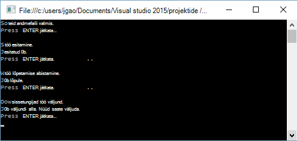

<properties 
   pageTitle="Azure'i Lake andmeanalüüsi kasutades .NET SDK alustamine | Azure'i" 
   description="Saate teada, kuidas kasutada .NET SDK Lake andmesalve kontode loomine, Lake andmeanalüüsi töökohtade loomine ja edastab kirjutatud U-SQL-i tööd. " 
   services="data-lake-analytics" 
   documentationCenter="" 
   authors="edmacauley" 
   manager="jhubbard" 
   editor="cgronlun"/>
 
<tags
   ms.service="data-lake-analytics"
   ms.devlang="na"
   ms.topic="hero-article"
   ms.tgt_pltfrm="na"
   ms.workload="big-data" 
   ms.date="10/26/2016"
   ms.author="edmaca"/>

# Õpetus: alustamine Azure'i Lake andmeanalüüsi .NET SDK abil

[AZURE.INCLUDE [get-started-selector](../../includes/data-lake-analytics-selector-get-started.md)]

Saate teada, kuidas kasutada esitada töid kirjutatud Lake andmeanalüüsi [U -](data-lake-analytics-u-sql-get-started.md) SQL Azure'i .NET SDK. Andmeanalüüsi Lake kohta leiate lisateavet teemast [Azure andmeanalüüsi Lake ülevaade](data-lake-analytics-overview.md).

Selles õpetuses arendate C# konsooli rakendus U-SQL-i tööd, mis loeb vahekaardi eraldatud väärtuste (TSV) fail ja teisendab selle komaga eraldatud väärtuste (CSV) faili esitada. Läbida samas õpetuse muude toetatud tööriistade abil, klõpsake vahekaarte artiklit peal.

##Eeltingimused

Enne alustamist selles õpetuses, peab teil olema järgmised:

- **Visual Studio 2015, Visual Studio 2013 update 4, või Visual Studio 2012 ja Visual C++ installitud**.
- **Microsoft Azure'i SDK .net-i versiooni 2.5 või kohale**.  Installige see [Web platvormi Installeri](http://www.microsoft.com/web/downloads/platform.aspx)abil.
- **An Azure'i andmeanalüüsi Lake konto**. Lugege teemat [Haldamine Lake andmeanalüüsi Azure'i .NET SDK abil](data-lake-analytics-manage-use-dotnet-sdk.md).

##Konsooli rakenduse loomine

Selles õpetuses töötlete mõne otsingu logid.  Otsingu log talletatud andmed Lake poe või Azure'i bloobimälu. 

Valimi otsingu Logi leiate avaliku Azure'i bloobimälu ümbrises. Rakenduse, kuvatakse faili allalaadimiseks oma töökoha ja laadige fail vaikekonto Lake andmesalve Lake andmeanalüüsi kontole.

**Luua skripti U-SQL-is**

Andmete Lake Analytics töö kirjutada U-SQL-i keeles. A-SQL-i kohta leiate lisateavet teemast [Alustamine U-SQL-i keele](data-lake-analytics-u-sql-get-started.md) ja [U-SQL keele viide](http://go.microsoft.com/fwlink/?LinkId=691348).

Järgmise U-SQL skripti **SampleUSQLScript.txt** faili loomine ja paigutage fail soovitud **C:\temp\* * tee.  Tee on kõva järgmise toimingu jaoks loodud rakenduse .net-i.  

    @searchlog =
        EXTRACT UserId          int,
                Start           DateTime,
                Region          string,
                Query           string,
                Duration        int?,
                Urls            string,
                ClickedUrls     string
        FROM "/Samples/Data/SearchLog.tsv"
        USING Extractors.Tsv();
    
    OUTPUT @searchlog   
        TO "/Output/SearchLog-from-Data-Lake.csv"
    USING Outputters.Csv();

A-SQL-skripti abil **Extractors.Tsv()**andmefailis loeb ja loob siis CSV-faili abil **Outputters.Csv()**. 

C# programmi, peate faili **/Samples/Data/SearchLog.tsv** ja **/Output/** kausta.    

Lihtsam on kasutada suhtelised teed failid vaikimisi andmete Lake kontod. Samuti saate absoluutne teed.  Näide 

    adl://<Data LakeStorageAccountName>.azuredatalakestore.net:443/Samples/Data/SearchLog.tsv
    
Failide lingitud salvestusruumi kontod juurdepääsuks peate kasutama absoluutne teed.  Lingitud Azure Storage konto talletatud failide süntaks on järgmine:

    wasb://<BlobContainerName>@<StorageAccountName>.blob.core.windows.net/Samples/Data/SearchLog.tsv

>[AZURE.NOTE] Praegu Azure'i andmeteenuse Lake teadaolev probleem.  Kui rakendus valimi katkeb või tekib tõrge, peate käsitsi kustutada andmesalve Lake & Lake andmeanalüüsi kontod, mis loob skript.  Kui olete tuttav Azure portaali, [hallata Azure Lake andmeanalüüsi abil Azure portaali](data-lake-analytics-manage-use-portal.md) juhend aitavad teil alustada.       

**Rakenduse loomine**

1. Avage Visual Studio.
2. Looge C# konsooli rakendus.
3. Avage Nugeti pakett halduskonsooli ja käivitage järgmine käsk:

        Install-Package Microsoft.Azure.Management.DataLake.Analytics -Pre
        Install-Package Microsoft.Azure.Management.DataLake.Store -Pre
        Install-Package Microsoft.Azure.Management.DataLake.StoreUploader -Pre
        Install-Package Microsoft.Rest.ClientRuntime.Azure.Authentication -Pre
        Install-Package WindowsAzure.Storage

       
5. Program.cs, kleepige järgmine kood:

        using System;
        using System.IO;
        using System.Collections.Generic;
        using System.Threading;
        using Microsoft.Rest;
        using Microsoft.Rest.Azure.Authentication;
        using Microsoft.Azure.Management.DataLake.Store;
        using Microsoft.Azure.Management.DataLake.StoreUploader;
        using Microsoft.Azure.Management.DataLake.Analytics;
        using Microsoft.Azure.Management.DataLake.Analytics.Models;
        using Microsoft.WindowsAzure.Storage.Blob;

        namespace SdkSample
        {
          class Program
          {
            private const string SUBSCRIPTIONID = "<Enter Your Azure Subscription ID>";
            private const string CLIENTID = "1950a258-227b-4e31-a9cf-717495945fc2";
            private const string DOMAINNAME = "common"; // Replace this string with the user's Azure Active Directory tenant ID or domain name, if needed.

            private static string _adlaAccountName = "<Enter an Existing Data Lake Analytics Account Name>";
            private static string _adlsAccountName = "<Enter the default Data Lake Store Account Name>";

            private static DataLakeAnalyticsAccountManagementClient _adlaClient;
            private static DataLakeStoreFileSystemManagementClient _adlsFileSystemClient;
            private static DataLakeAnalyticsJobManagementClient _adlaJobClient;
        
            private static void Main(string[] args)
            {
                string localFolderPath = @"c:\temp\";

                // Connect to Azure
                var creds = AuthenticateAzure(DOMAINNAME, CLIENTID);

                SetupClients(creds, SUBSCRIPTIONID);

                // Transfer the source file from a public Azure Blob container to Data Lake Store.
                CloudBlockBlob blob = new CloudBlockBlob(new Uri("https://adltutorials.blob.core.windows.net/adls-sample-data/SearchLog.tsv"));
                blob.DownloadToFile(localFolderPath + "SearchLog.tsv", FileMode.Create); // from WASB
                UploadFile(localFolderPath + "SearchLog.tsv", "/Samples/Data/SearchLog.tsv"); // to ADLS
                WaitForNewline("Source data file prepared.", "Submitting a job.");

                // Submit the job
                Guid jobId = SubmitJobByPath(localFolderPath + "SampleUSQLScript.txt", "My First ADLA Job");
                WaitForNewline("Job submitted.", "Waiting for job completion.");

                // Wait for job completion
                WaitForJob(jobId);
                WaitForNewline("Job completed.", "Downloading job output.");

                // Download job output
                DownloadFile(@"/Output/SearchLog-from-Data-Lake.csv", localFolderPath + "SearchLog-from-Data-Lake.csv");
        
                WaitForNewline("Job output downloaded. You can now exit.");
            }
        
            public static ServiceClientCredentials AuthenticateAzure(
                string domainName,
                string nativeClientAppCLIENTID)
            {
                // User login via interactive popup
                SynchronizationContext.SetSynchronizationContext(new SynchronizationContext());
                // Use the client ID of an existing AAD "Native Client" application.
                var activeDirectoryClientSettings = ActiveDirectoryClientSettings.UsePromptOnly(nativeClientAppCLIENTID, new Uri("urn:ietf:wg:oauth:2.0:oob"));
                return UserTokenProvider.LoginWithPromptAsync(domainName, activeDirectoryClientSettings).Result;
            }

            public static void SetupClients(ServiceClientCredentials tokenCreds, string subscriptionId)
            {
                _adlaClient = new DataLakeAnalyticsAccountManagementClient(tokenCreds);
                _adlaClient.SubscriptionId = subscriptionId;

                _adlaJobClient = new DataLakeAnalyticsJobManagementClient(tokenCreds);

                _adlsFileSystemClient = new DataLakeStoreFileSystemManagementClient(tokenCreds);
            }

            public static void UploadFile(string srcFilePath, string destFilePath, bool force = true)
            {
                var parameters = new UploadParameters(srcFilePath, destFilePath, _adlsAccountName, isOverwrite: force);
                var frontend = new DataLakeStoreFrontEndAdapter(_adlsAccountName, _adlsFileSystemClient);
                var uploader = new DataLakeStoreUploader(parameters, frontend);
                uploader.Execute();
            }

            public static void DownloadFile(string srcPath, string destPath)
            {
                var stream = _adlsFileSystemClient.FileSystem.Open(_adlsAccountName, srcPath);
                var fileStream = new FileStream(destPath, FileMode.Create);

                stream.CopyTo(fileStream);
                fileStream.Close();
                stream.Close();
            }

            // Helper function to show status and wait for user input
            public static void WaitForNewline(string reason, string nextAction = "")
            {
                Console.WriteLine(reason + "\r\nPress ENTER to continue...");

                Console.ReadLine();

                if (!String.IsNullOrWhiteSpace(nextAction))
                    Console.WriteLine(nextAction);
            }

            // List all Data Lake Analytics accounts within the subscription
            public static List<DataLakeAnalyticsAccount> ListADLAAccounts()
            {
                var response = _adlaClient.Account.List();
                var accounts = new List<DataLakeAnalyticsAccount>(response);

                while (response.NextPageLink != null)
                {
                    response = _adlaClient.Account.ListNext(response.NextPageLink);
                    accounts.AddRange(response);
                }

                Console.WriteLine("You have %i Data Lake Analytics account(s).", accounts.Count);
                for (int i = 0; i < accounts.Count; i++)
                {
                    Console.WriteLine(accounts[i].Name);
                }

                return accounts;
            }
            public static Guid SubmitJobByPath(string scriptPath, string jobName)
            {
                var script = File.ReadAllText(scriptPath);

                var jobId = Guid.NewGuid();
                var properties = new USqlJobProperties(script);
                var parameters = new JobInformation(jobName, JobType.USql, properties, priority: 1, degreeOfParallelism: 1, jobId: jobId);
                var jobInfo = _adlaJobClient.Job.Create(_adlaAccountName, jobId, parameters);

                return jobId;
            }

            public static JobResult WaitForJob(Guid jobId)
            {
                var jobInfo = _adlaJobClient.Job.Get(_adlaAccountName, jobId);
                while (jobInfo.State != JobState.Ended)
                {
                    jobInfo = _adlaJobClient.Job.Get(_adlaAccountName, jobId);
                }
                return jobInfo.Result.Value;
            }
          }
        }

6. Vajutage klahvi **F5** käivitage rakendus. Väljund on näiteks:

    

7. Märkige ruut väljundfail.  Vaikimisi tee ja faili nimi on c:\Temp\SearchLog-from-Data-Lake.csv.

## Vt ka

- Muude tööriistade abil sama õpetuse vaatamiseks klõpsake menüü lülitid lehe ülaosas.
- Keerukama päringu, leiate artiklist [analüüsi veebisaidi logid Azure'i Lake andmeanalüüsi abil](data-lake-analytics-analyze-weblogs.md).
- Alustamiseks U-SQL-i rakenduste arendamise, lugege teemat [arendada U-SQL-i skriptide abil andmete Lake Tools for Visual Studio](data-lake-analytics-data-lake-tools-get-started.md).
- U-SQL-i, leiate [Azure'i andmed Lake Analytics U-SQL-i keele alustamine](data-lake-analytics-u-sql-get-started.md), ja [U-SQL-i keele viide](http://go.microsoft.com/fwlink/?LinkId=691348).
- Haldamise toiminguid, vt [haldamine Azure'i Lake andmeanalüüsi abil Azure portaali](data-lake-analytics-manage-use-portal.md).
- Andmeanalüüsi Lake ülevaate saamiseks vt [Azure'i andmeanalüüsi Lake ülevaade](data-lake-analytics-overview.md).
