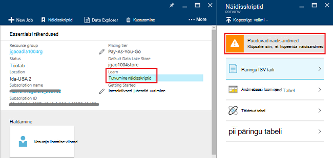
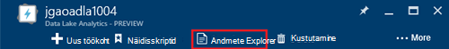
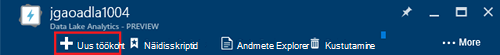
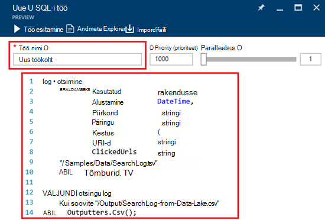
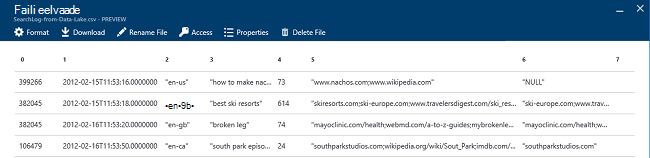

<properties 
   pageTitle="Azure'i Lake andmeanalüüsi Azure'i portaalis alustamine | Azure'i" 
   description="Saate teada, kuidas kasutada Azure portaali Lake andmeanalüüsi konto loomine, Lake andmeanalüüsi töö U-SQL-i abil luua ja esitage töö. " 
   services="data-lake-analytics" 
   documentationCenter="" 
   authors="edmacauley" 
   manager="jhubbard" 
   editor="cgronlun"/>
 
<tags
   ms.service="data-lake-analytics"
   ms.devlang="na"
   ms.topic="hero-article"
   ms.tgt_pltfrm="na"
   ms.workload="big-data" 
   ms.date="10/06/2016"
   ms.author="edmaca"/>

# Õpetus: alustamine Azure'i Lake andmeanalüüsi Azure'i portaalis

[AZURE.INCLUDE [get-started-selector](../../includes/data-lake-analytics-selector-get-started.md)]

Saate teada, kuidas kasutada Azure portaali loomine Azure'i andmed Lake Analyticsi kontod, määratlemine Lake andmeanalüüsi töö [U-SQL-i](data-lake-analytics-u-sql-get-started.md)ja edastab Lake andmeanalüüsi teenuse tööd. Andmeanalüüsi Lake kohta leiate lisateavet teemast [Azure andmeanalüüsi Lake ülevaade](data-lake-analytics-overview.md).

Selles õpetuses arendate tööd, mis loeb vahekaardi eraldatud väärtuste (TSV) fail ja teisendab komaeraldusega väärtuste (CSV) faili. Läbida samas õpetuse muude toetatud tööriistade abil, klõpsake selle jaotise ülaosas vahekaarte. Kui esimene tööpäevad õnnestub, saate alustada kirjutamiseks keerukamaid andmete teisendused SQL-U.

##Eeltingimused

Enne alustamist selles õpetuses, peab teil olema järgmised üksused:

- **An Azure'i tellimus**. Leiate [Azure'i saada tasuta prooviversioon](https://azure.microsoft.com/pricing/free-trial/).

##Andmeanalüüsi Lake konto loomine

Saate kasutada mis tahes töö peab teil olema Lake andmeanalüüsi konto.

Iga Lake andmeanalüüsi konto on mõni [Azure andmesalve Lake]() konto sõltuvus.  Selle konto nimetatakse Lake andmesalve konto.  Saate luua Lake andmesalve konto eelnevalt, või Lake andmeanalüüsi konto loomisel. Selles õpetuses loote Lake andmesalve konto Lake andmeanalüüsi kontoga.

**Andmeanalüüsi Lake konto loomine**

1. [Azure'i portaali](https://portal.azure.com)sisse logida.
2. Klõpsake nuppu **Uus**, klõpsake **ärianalüüsi + Kasutusanalüüsi**ja klõpsake **Lake andmeanalüüsi**.
3. Tippige või valige järgmised väärtused:

    

    - **Nimi**: Lake andmeanalüüsi konto nimi.
    - **Tellimus**: valige Azure'i tellimus, kasutatakse Analytics konto.
    - **Ressursirühm**. Valige olemasolev Azure'i ressursirühm või looge uus. Azure'i ressursihaldur võimaldab teil töö ressurssidega oma rakenduse rühmana. Lisateavet leiate teemast [Azure ressursihaldur ülevaade](resource-group-overview.md). 
    - **Asukoht**. Valige Lake andmeanalüüsi konto keskuse sellise Azure'i andmed. 
    - **Lake andmesalve**: iga Lake andmeanalüüsi konto on sõltuvad Lake andmesalve konto. Funktsiooni Lake andmeanalüüsi ja sõltuvad Lake andmesalve konto asuma samas Azure andmekeskuse. Järgige juhiseid, et Lake andmesalve uue konto loomine või valige olemasoleva.

8. Klõpsake nuppu **Loo**. See viib teid portaali avakuva. Uue paani lisatakse selle StartBoard silt näitab "Juurutamine Azure'i Lake andmeanalüüsi". Mõni hetk Lake andmeanalüüsi konto loomiseks. Kui konto on loodud, avaneb portaali raseerimisterast uus konto.

Pärast Lake andmeanalüüsi konto loomist saate lisada täiendavad Lake andmesalve kontod ja Azure salvestusruumi kontod. Juhised leiate teemast [konto haldamine lake andmeanalüüsi andmeallikad](data-lake-analytics-manage-use-portal.md#manage-account-data-sources).

##Allika andmete ettevalmistamine

Selles õpetuses töötlete mõne otsingu logid.  Otsingu Logi saab salvestada dData Lake poe või Azure'i bloobimälu. 

Azure'i portaal sisaldab kasutajaliidese mõned näidisfailide andmete kopeerimiseks vaikekonto andmesalve Lake, mis sisaldavad logifaili otsimine.

**Näidisfailide andmete kopeerimine**

1. Avage [Azure portaali](https://portal.azure.com)konto Lake andmeanalüüsi.  Teemast loomist ja selle konto avamise portaalis [andmete haldamine Lake Analyticsi kontod](data-lake-analytics-get-started-portal.md#manage-accounts) .
3. Laiendage **Essentialsi** paani ja seejärel käsku **Uuri näidisskriptid**. Avab teise tera **Näidisskriptid**nimega.

    

4. Klõpsake nuppu **Proovi puuduvad andmed** näidisfailide andmete kopeerimiseks. Kui see on valmis, kuvatakse portaali **andmete näidis värskendamine õnnestus**.
7. Klõpsake keelest andmete Lake analytics konto ülaosas **Andmete Explorer** . 

    

    Avaneb kaks noad. Üks on **Andmete Explorer**ja teine on vaikimisi Lake andmesalve konto.
8. Klõpsake vaikimisi Lake andmesalve konto tera, laiendage kaust ja klõpsake **andmete** kausta laiendamiseks **näidised** . Peab kuvatakse järgmised failid ja kaustad.

    - AmbulanceData /
    - AdsLog.tsv
    - SearchLog.tsv
    - Version.txt
    - WebLog.log
    
    Selles õppetükis saate SearchLog.tsv.

Praktikas saate kas programmide rakenduste kirjutada andmeid lingitud salvestusruumi kontod või andmete üles laadida. Failide üleslaadimise teemast [laadige Lake andmesalve andmed](data-lake-analytics-manage-use-portal.md#upload-data-to-adls) või [andmed bloobimälu](data-lake-analytics-manage-use-portal.md#upload-data-to-wasb).

##Luua ja esitada Lake andmeanalüüsi tööde haldamine

Kui olete valmis lähteandmed, saate alustada arendamise U-SQL-i skripti.  

**Esitada tööd**

1. Keelest andmete Lake analytics konto portaalis, klõpsake nuppu **Uus töökoht**. 

    

    Kui te ei näe tera, vt [portaalist andmete Lake Analytics konto avamise](data-lake-analytics-manage-use-portal.md#access-adla-account).
2. **Töö nimi**ja järgmine U-SQL skript sisestamine

        @searchlog =
            EXTRACT UserId          int,
                    Start           DateTime,
                    Region          string,
                    Query           string,
                    Duration        int?,
                    Urls            string,
                    ClickedUrls     string
            FROM "/Samples/Data/SearchLog.tsv"
            USING Extractors.Tsv();
        
        OUTPUT @searchlog   
            TO "/Output/SearchLog-from-Data-Lake.csv"
        USING Outputters.Csv();

    

    A-SQL-skripti abil **Extractors.Tsv()**andmefailis loeb ja loob siis CSV-faili abil **Outputters.Csv()**. 
    
    Ärge muutke kaks teede kui lähtefail kopeerimine teise asukohta.  Andmeanalüüsi Lake loob väljund kausta, kui see pole olemas.  Sel juhul kasutame lihtne, suhteline teed.  
    
    Lihtsam on kasutada suhtelised teed vaikimisi andmete Lake kontod salvestatud failid. Samuti saate absoluutne teed.  Näide 
    
        adl://<Data LakeStorageAccountName>.azuredatalakestore.net:443/Samples/Data/SearchLog.tsv
      

    U-SQL-i kohta leiate lisateavet teemast [Alustamine Azure andmete Lake Analytics U-SQL-i keele](data-lake-analytics-u-sql-get-started.md) ja [U-SQL-i keele viide](http://go.microsoft.com/fwlink/?LinkId=691348).
     
3. Klõpsake **Töö esitamine** algusest.   
4. Oodake, kuni töö olekuks on muudetud **õnnestus**. Saate vaadata töö tegemiseks kulunud umbes üks minut.
    
    Töö ei, lugege teemat [jälgimine ja tõrkeotsing Lake andmeanalüüsi töö](data-lake-analytics-monitor-and-troubleshoot-jobs-tutorial.md).

5. Tera allosas **väljundi** vahekaarti ja klõpsake **SearchLog-alla-andmete Lake.csv**. Saate eelvaade, laadige alla, ümber nimetada ja kustutada väljundfail.

    

##Vt ka

- Keerukama päringu, leiate artiklist [analüüsi veebisaidi logid Azure'i Lake andmeanalüüsi abil](data-lake-analytics-analyze-weblogs.md).
- Alustamiseks U-SQL-i rakenduste arendamise, lugege teemat [arendada U-SQL-i skriptide abil andmete Lake Tools for Visual Studio](data-lake-analytics-data-lake-tools-get-started.md).
- A-SQL-is leiate teemast [Azure andmete Lake Analytics U-SQL-i keele kasutamise alustamine](data-lake-analytics-u-sql-get-started.md).
- Haldamise toiminguid, vt [haldamine Azure'i Lake andmeanalüüsi abil Azure portaali](data-lake-analytics-manage-use-portal.md).
- Andmeanalüüsi Lake ülevaate saamiseks vt [Azure'i andmeanalüüsi Lake ülevaade](data-lake-analytics-overview.md).
- Muude tööriistade abil sama õpetuse vaatamiseks klõpsake menüü lülitid lehe ülaosas.
- Logiteave diagnostika vt [juurdepääs diagnostika logid Azure'i Lake andmeanalüüsi jaoks](data-lake-analytics-diagnostic-logs.md)
