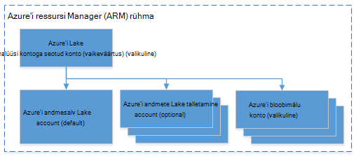

<properties 
   pageTitle="Azure'i Lake andmeanalüüsi Azure'i käsurea liidest kasutades haldamine | Azure'i" 
   description="Saate teada, kuidas andmed Lake Analyticsi kontod, andmeallikate, töö ja Azure CLI kasutamine kasutajate haldamine" 
   services="data-lake-analytics" 
   documentationCenter="" 
   authors="edmacauley" 
   manager="jhubbard" 
   editor="cgronlun"/>
 
<tags
   ms.service="data-lake-analytics"
   ms.devlang="na"
   ms.topic="article"
   ms.tgt_pltfrm="na"
   ms.workload="big-data" 
   ms.date="05/16/2016"
   ms.author="edmaca"/>

# Azure'i andmed Lake Andmekaevandustööriistade abil Azure'i käsurea liides (CLI) haldamine

[AZURE.INCLUDE [manage-selector](../../includes/data-lake-analytics-selector-manage.md)]

Saate teada, kuidas hallata Azure'i andmed Lake Analyticsi kontod, andmeallikate, kasutajate ja abil soovitud Azure. Muude tööriistade abil halduse teema kuvamiseks klõpsake menüü valimine ülaltoodud.

**Eeltingimused**

Enne alustamist selles õpetuses, peab teil olema järgmised:

- **An Azure'i tellimus**. Leiate [Azure'i saada tasuta prooviversioon](https://azure.microsoft.com/pricing/free-trial/).
- **Azure'i CLI**. Vt [installida ja konfigureerida Azure CLI](../xplat-cli-install.md).
    - Alla ja installige see demo lõpuleviimiseks **väljalaske-eelse** [Azure'i CLI tööriistad](https://github.com/MicrosoftBigData/AzureDataLake/releases) .
- **Autentimist**kasutades järgmine käsk:

        azure login
    Autentimisel töökoha või kooli kontoga kohta leiate lisateavet teemast [Azure tellimuse: Azure'i CLI ühenduse loomine](../xplat-cli-connect.md).
- **Azure'i ressursihaldur režiimi aktiveerimine**, kasutades järgmine käsk:

        azure config mode arm

**Loendi Lake andmesalve ja Lake andmeanalüüsi käsud:**

    azure datalake store
    azure datalake analytics

<!-- ################################ -->
<!-- ################################ -->
## Konto haldamine

Enne Lake andmeanalüüsi töökohtade töötab, peab teil olema Lake andmeanalüüsi konto. Erinevalt Windows Azure Hdinsightiga ei maksate Analyticsi kontot kui see ei tööta tööd.  Maksate ainult kellaaja, kui see töötab tööd.  Lisateabe saamiseks vt [Azure'i andmed Lake Analytics ülevaade](data-lake-analytics-overview.md).  

###Kontode loomine

    azure datalake analytics account create "<Data Lake Analytics Account Name>" "<Azure Location>" "<Resource Group Name>" "<Default Data Lake Account Name>"

###Värskendage kontod

Järgmine käsk värskendab olemasolevaid andmeid Lake Analytics konto atribuudid
    
    azure datalake analytics account set "<Data Lake Analytics Account Name>"

###Kontode loend

Loendi andmete Lake Analyticsi kontod 

    azure datalake analytics account list

Loendi andmete Lake Analyticsi kontod sees teatud ressursirühm

    azure datalake analytics account list -g "<Azure Resource Group Name>"

Kindlate andmete Lake Analytics konto üksikasjade

    azure datalake analytics account show -g "<Azure Resource Group Name>" -n "<Data Lake Analytics Account Name>"

###Andmete Lake Analyticsi kontod kustutada

    azure datalake analytics account delete "<Data Lake Analytics Account Name>"

<!-- ################################ -->
<!-- ################################ -->
## Konto andmeallikate haldamine

Andmeanalüüsi Lake toetab praegu järgmiste andmeallikatega:

- [Azure'i andmesalve Lake](../data-lake-store/data-lake-store-overview.md)
- [Azure'i salvestusruum](../storage/storage-introduction.md)

Kasutusanalüüsi konto loomisel määrate konto Azure andmesalv Lake olevat salvestusruumi vaikekonto. ADL salvestusruumi vaikekonto kasutatakse töö metaandmete ja töö auditilogide talletamiseks. Pärast seda, kui olete loonud Analytics konto, saate lisada täiendavad andmed Lake salvestusruumi kontod ja/või Azure Storage konto. 

### ADL salvestusruumi vaikekonto otsimine

    azure datalake analytics account show "<Data Lake Analytics Account Name>"

Väärtus on loetletud jaotises Atribuudid: datalakeStoreAccount:name.

### Täiendavate Azure'i bloobimälu salvestusruumi kontode lisamine

    azure datalake analytics account datasource add -n "<Data Lake Analytics Account Name>" -b "<Azure Blob Storage Account Short Name>" -k "<Azure Storage Account Key>"

>[AZURE.NOTE] Toetatakse ainult bloobimälu salvestusruumi lühike nimed.  Ärge kasutage FQDN, näiteks "myblob.blob.core.windows.net".

### Lake andmesalve täiendavaid kontosid lisada

    azure datalake analytics account datasource add -n "<Data Lake Analytics Account Name>" -l "<Data Lake Store Account Name>" [-d]

[-d] on valikuline parameeter, näitamaks, kas andmete lisamisest ei andmete Lake vaikekonto. 

### Värskendage olemasolevas andmeallikas

Olemasoleva Lake andmesalve konto vaikesätteks seadmiseks tehke järgmist.

    azure datalake analytics account datasource set -n "<Data Lake Analytics Account Name>" -l "<Azure Data Lake Store Account Name>" -d
      
Olemasoleva bloobimälu salvestusruumi konto võti värskendamiseks tehke järgmist.

    azure datalake analytics account datasource set -n "<Data Lake Analytics Account Name>" -b "<Blob Storage Account Name>" -k "<New Blob Storage Account Key>"

### Loendi andmeallikatega.

    azure datalake analytics account show "<Data Lake Analytics Account Name>"
    

### Andmeallikate kustutamiseks tehke järgmist.

Lake andmesalve konto kustutamiseks tehke järgmist.

    azure datalake analytics account datasource delete "<Data Lake Analytics Account Name>" "<Azure Data Lake Store Account Name>"

Bloobimälu salvestusruumi konto kustutamiseks tehke järgmist.

    azure datalake analytics account datasource delete "<Data Lake Analytics Account Name>" "<Blob Storage Account Name>"

## Hallata

Saate luua töö peab teil olema Lake andmeanalüüsi konto.  Lisateavet leiate teemast [haldamine Lake andmeanalüüsi kontod](#manage-accounts).

### Loendi tööde haldamine

    azure datalake analytics job list -n "<Data Lake Analytics Account Name>"

### Projekti üksikasjade

    azure datalake analytics job show -n "<Data Lake Analytics Account Name>" -j "<Job ID>"
    
### Esitage tööde haldamine

> [AZURE.NOTE] Vaikimisi prioriteet töö on 1000 ja vaikimisi paralleelsus tööd on 1.

    azure datalake analytics job create  "<Data Lake Analytics Account Name>" "<Job Name>" "<Script>"

### Loobu tööde haldamine

Loendi käsu abil saate otsida töö id ja seejärel kasutage Loobu töö.

    azure datalake analytics job list -n "<Data Lake Analytics Account Name>"
    azure datalake analytics job cancel "<Data Lake Analytics Account Name>" "<Job ID>"

## Kataloogi haldamine

A-SQL-i kataloogi kasutatakse struktureerimine andmed ja koodi nii, et ta saab jagada U-SQL-i skripte. Kataloogi võimaldab võimalike andmetega Azure'i andmed Lake kõrgeim jõudlus. Lisateavet leiate teemast [kasutamine U-SQL-i kataloogi](data-lake-analytics-use-u-sql-catalog.md).
 
###Loendiüksuste kataloogi

    #List databases
    azure datalake analytics catalog list -n "<Data Lake Analytics Account Name>" -t database

    #List tables
    azure datalake analytics catalog list -n "<Data Lake Analytics Account Name>" -t table
    
Andmebaasi, skeemi, komplekti, välise andmeallikaga, tabeli, tabelis hinnatud funktsioon või tabeli statistika sisaldavad tüübid.

###Kataloogi salajane loomine

    azure datalake analytics catalog secret create -n "<Data Lake Analytics Account Name>" <databaseName> <hostUri> <secretName>

### Kataloogi salajane muutmine

    azure datalake analytics catalog secret set -n "<Data Lake Analytics Account Name>" <databaseName> <hostUri> <secretName>

###Kataloogi salajane kustutamine

    azure datalake analytics catalog secrete delete -n "<Data Lake Analytics Account Name>" <databaseName> <hostUri> <secretName>

<!-- ################################ -->
<!-- ################################ -->
## ARM rühmade kasutamine

Rakendused on tavaliselt valmistatud palju komponendid, näiteks web appi, andmebaasi, andmebaasi server, salvestusruumi ja 3 tootja teenused. Azure'i ressursi Manager (ARM) võimaldab teil töö ressurssidega oma rakenduse rühmana, nimetatakse ka Azure ressursirühma. Juurutada, värskendamine, jälgida või kustutada kõik ressursse rakenduse ühe ja koordineeritud toiming. Malli kasutamine juurutamiseks ja sellel mallil saate töötada viibite, nt katsetamine, lavastus ja tootmise. Arveldamine selgitada oma ettevõtte jaoks soovitud kulude terve rühma vaatamine. Lisateavet leiate teemast [Azure ressursihaldur ülevaade](../azure-resource-manager/resource-group-overview.md). 

Andmeanalüüsi Lake teenus võib sisaldada järgmisi komponente.

- Azure'i andmed Lake Analytics konto
- Nõutav Azure andmesalv Lake vaikekonto
- Täiendavad Azure'i andmed Lake salvestusruumi kontod
- Täiendava salvestusruumi Azure'i kontod

Saate luua kõik ühes RÜHMAS rühm, kuhu neid hõlpsam hallata neid komponendid.

Andmeanalüüsi Lake konto ja kontod sõltuvad salvestusruumi peab asuma samas Azure data Centeri kaudu.
ARM rühma aga võib asuda mõnes muus andmekeskuse.  

##Vt ka 

- [Microsoft Azure'i andmed Lake Analytics ülevaade](data-lake-analytics-overview.md)
- [Azure'i portaalis Lake andmeanalüüsi kasutamise alustamine](data-lake-analytics-get-started-portal.md)
- [Azure'i Lake andmeanalüüsi Azure'i portaalis haldamine](data-lake-analytics-manage-use-portal.md)
- [Jälgimine ja Azure andmeanalüüsi Lake töö Azure'i portaalis tõrkeotsing](data-lake-analytics-monitor-and-troubleshoot-jobs-tutorial.md)

