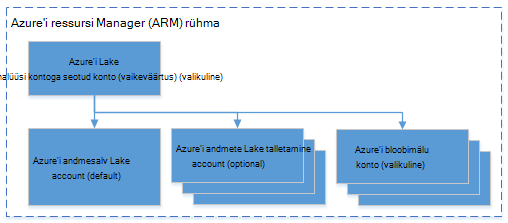

<properties 
   pageTitle="Azure'i Lake andmeanalüüsi Azure'i .NET SDK abil hallata | Azure'i" 
   description="Saate teada, kuidas Lake andmeanalüüsi töö, andmeallikate, kasutajate haldamine. " 
   services="data-lake-analytics" 
   documentationCenter="" 
   authors="mumian" 
   manager="jhubbard" 
   editor="cgronlun"/>
 
<tags
   ms.service="data-lake-analytics"
   ms.devlang="na"
   ms.topic="article"
   ms.tgt_pltfrm="na"
   ms.workload="big-data" 
   ms.date="09/23/2016"
   ms.author="jgao"/>

# Azure'i andmed Lake Andmekaevandustööriistade abil Azure'i .NET SDK haldamine

[AZURE.INCLUDE [manage-selector](../../includes/data-lake-analytics-selector-manage.md)]

Saate teada, kuidas hallata Azure'i andmed Lake Analyticsi kontod, andmeallikate, kasutajate ja Azure .NET SDK abil. Muude tööriistade abil halduse teemade kuvamiseks klõpsake menüü valimine ülaltoodud.

**Eeltingimused**

Enne alustamist selles õpetuses, peab teil olema järgmised:

- **An Azure'i tellimus**. Leiate [Azure'i saada tasuta prooviversioon](https://azure.microsoft.com/pricing/free-trial/).

<!-- ################################ -->
<!-- ################################ -->

## Azure'i andmeanalüüsi Lake ühendamine

Vajate järgmist Nuget-paketid:

    Install-Package Microsoft.Rest.ClientRuntime.Azure.Authentication -Pre
    Install-Package Microsoft.Azure.Common 
    Install-Package Microsoft.Azure.Management.ResourceManager -Pre
    Install-Package Microsoft.Azure.Management.DataLake.Analytics -Pre

Järgmine kood näidis näitab, kuidas ühendada Azure ja olemasolevate andmete Lake Analyticsi kontod, Azure tellimuse jaotises loendi.

    using System;
    using System.Collections.Generic;
    using System.Threading;

    using Microsoft.Rest;
    using Microsoft.Rest.Azure.Authentication;

    using Microsoft.Azure.Management.ResourceManager;
    using Microsoft.Azure.Management.DataLake.Store;
    using Microsoft.Azure.Management.DataLake.Analytics;
    using Microsoft.Azure.Management.DataLake.Analytics.Models;

    namespace ConsoleAcplication1
    {
        class Program
        {

            private const string SUBSCRIPTIONID = "<Enter Your Azure Subscription ID>";
            private const string CLIENTID = "1950a258-227b-4e31-a9cf-717495945fc2";
            private const string DOMAINNAME = "common"; // Replace this string with the user's Azure Active Directory tenant ID or domain name, if needed.

            private static DataLakeAnalyticsAccountManagementClient _adlaClient;

            private static void Main(string[] args)
            {

                var creds = AuthenticateAzure(DOMAINNAME, CLIENTID);

                _adlaClient = new DataLakeAnalyticsAccountManagementClient(creds);
                _adlaClient.SubscriptionId = SUBSCRIPTIONID;

                var adlaAccounts = ListADLAAccounts();

                Console.WriteLine("You have %i Data Lake Analytics account(s).", adlaAccounts.Count);
                for (int i = 0; i < adlaAccounts.Count; i ++)
                {
                    Console.WriteLine(adlaAccounts[i].Name);
                }

                System.Console.WriteLine("Press ENTER to continue");
                System.Console.ReadLine();
            }

            public static ServiceClientCredentials AuthenticateAzure(
            string domainName,
            string nativeClientAppCLIENTID)
            {
                // User login via interactive popup
                SynchronizationContext.SetSynchronizationContext(new SynchronizationContext());
                // Use the client ID of an existing AAD "Native Client" application.
                var activeDirectoryClientSettings = ActiveDirectoryClientSettings.UsePromptOnly(nativeClientAppCLIENTID, new Uri("urn:ietf:wg:oauth:2.0:oob"));
                return UserTokenProvider.LoginWithPromptAsync(domainName, activeDirectoryClientSettings).Result;
            }

            public static List<DataLakeAnalyticsAccount> ListADLAAccounts()
            {
                var response = _adlaClient.Account.List();
                var accounts = new List<DataLakeAnalyticsAccount>(response);

                while (response.NextPageLink != null)
                {
                    response = _adlaClient.Account.ListNext(response.NextPageLink);
                    accounts.AddRange(response);
                }

                return accounts;
            }
        }
    }

## Konto haldamine

Enne Lake andmeanalüüsi töökohtade töötab, peab teil olema Lake andmeanalüüsi konto. Erinevalt Windows Azure Hdinsightiga ei maksate Analyticsi kontot kui see ei tööta tööd.  Maksate ainult kellaaja, kui see töötab tööd.  Lisateabe saamiseks vt [Azure'i andmed Lake Analytics ülevaade](data-lake-analytics-overview.md).  

###Kontode loomine

Järgmises näites käivitamiseks peab olema ka Azure ressursihalduse rühma ja Lake andmesalve konto.

Järgmine kood näitab, kuidas luua ressursirühma:

    public static async Task<ResourceGroup> CreateResourceGroupAsync(
        ServiceClientCredentials credential,
        string groupName,
        string subscriptionId,
        string location)
    {

        Console.WriteLine("Creating the resource group...");
        var resourceManagementClient = new ResourceManagementClient(credential)
        { SubscriptionId = subscriptionId };
        var resourceGroup = new ResourceGroup { Location = location };
        return await resourceManagementClient.ResourceGroups.CreateOrUpdateAsync(groupName, resourceGroup);
    }

Järgmine kood näitab, kuidas luua Lake andmesalve konto:

    var adlsParameters = new DataLakeStoreAccount(location: _location);
    _adlsClient.Account.Create(_resourceGroupName, _adlsAccountName, adlsParameters);

Järgmine kood näitab, kuidas luua Lake andmeanalüüsi konto:

    var defaultAdlsAccount = new List<DataLakeStoreAccountInfo> { new DataLakeStoreAccountInfo(adlsAccountName, new DataLakeStoreAccountInfoProperties()) };
    var adlaProperties = new DataLakeAnalyticsAccountProperties(defaultDataLakeStoreAccount: adlsAccountName, dataLakeStoreAccounts: defaultAdlsAccount);
    var adlaParameters = new DataLakeAnalyticsAccount(properties: adlaProperties, location: location);
    var adlaAccount = _adlaClient.Account.Create(resourceGroupName, adlaAccountName, adlaParameters);

###Kontode loend

Teemast [Azure andmeanalüüsi Lake ühenduse](#connect_to_azure_data_lake_analytics).

###Konto otsimine

Kui kuvatakse loendi andmete Lake Analyticsi kontod objekti, saate järgmine konto leidmiseks:

    Predicate<DataLakeAnalyticsAccount> accountFinder = (DataLakeAnalyticsAccount a) => { return a.Name == adlaAccountName; };
    var myAdlaAccount = adlaAccounts.Find(accountFinder);

###Andmete Lake Analyticsi kontod kustutada

Järgmised koodilõigu kustutab Lake andmeanalüüsi konto:

    _adlaClient.Account.Delete(resourceGroupName, adlaAccountName);

<!-- ################################ -->
<!-- ################################ -->
## Konto andmeallikate haldamine

Andmeanalüüsi Lake toetab praegu järgmiste andmeallikatega:

- [Azure'i andmesalv Lake](../data-lake-store/data-lake-store-overview.md)
- [Azure'i salvestusruum](../storage/storage-introduction.md)

Kasutusanalüüsi konto loomisel määrate konto Azure andmesalv Lake olevat salvestusruumi vaikekonto. Lake andmesalve vaikekonto kasutatakse töö metaandmete ja töö auditilogide talletamiseks. Pärast seda, kui olete loonud Analytics konto, saate lisada täiendavad andmed Lake salvestusruumi kontod ja/või Azure Storage konto. 

### Lake andmesalve vaikekonto otsimine

Leiate selle artikli konto Lake andmeanalüüsi konto leidmiseks. Seejärel kasutage järgmist:

    string adlaDefaultDataLakeStoreAccountName = myAccount.Properties.DefaultDataLakeStoreAccount;

## Azure'i ressursihaldur rühmade kasutamine

Rakendused on tavaliselt valmistatud palju komponendid, näiteks web appi, andmebaasi, andmebaasi server, salvestusruumi ja 3 tootja teenused. Azure'i ressursihaldur võimaldab teil töö ressurssidega oma rakenduse rühmana, nimetatakse ka Azure ressursirühma. Juurutada, värskendamine, jälgida või kustutada kõik ressursse rakenduse ühe, koordineeritud toiming. Malli kasutamine juurutamiseks ja sellel mallil saate töötada viibite, nt katsetamine, lavastus ja tootmise. Arveldamine selgitada oma ettevõtte jaoks soovitud kulude terve rühma vaatamine. Lisateavet leiate teemast [Azure ressursihaldur ülevaade](../azure-resource-manager/resource-group-overview.md). 

Andmeanalüüsi Lake teenus võib sisaldada järgmisi komponente.

- Azure'i andmed Lake Analytics konto
- Nõutav Azure andmesalv Lake vaikekonto
- Täiendavad Azure'i andmed Lake salvestusruumi kontod
- Täiendava salvestusruumi Azure'i kontod

Saate luua nende komponentide ressursside haldamine ühes rühmas kergemaks haldamine.

Andmeanalüüsi Lake konto ja kontod sõltuvad salvestusruumi peab asuma samas Azure andmekeskuse.
Ressursside haldamine jaotises siiski võib asuda mõnes muus andmekeskuse.  

##Vt ka 

- [Microsoft Azure'i andmed Lake Analytics ülevaade](data-lake-analytics-overview.md)
- [Azure'i portaalis Lake andmeanalüüsi kasutamise alustamine](data-lake-analytics-get-started-portal.md)
- [Azure'i Lake andmeanalüüsi Azure'i portaalis haldamine](data-lake-analytics-manage-use-portal.md)
- [Jälgimine ja Azure andmeanalüüsi Lake töö Azure'i portaalis tõrkeotsing](data-lake-analytics-monitor-and-troubleshoot-jobs-tutorial.md)

