<properties 
   pageTitle="Azure'i Lake andmeanalüüsi Azure'i portaalis haldamine | Azure'i" 
   description="Saate teada, kuidas Lake andmeanalüüsi kontroll, andmeallikad, kasutajad, ja-tööde haldamine." 
   services="data-lake-analytics" 
   documentationCenter="" 
   authors="edmacauley" 
   manager="jhubbard" 
   editor="cgronlun"/>
 
<tags
   ms.service="data-lake-analytics"
   ms.devlang="na"
   ms.topic="article"
   ms.tgt_pltfrm="na"
   ms.workload="big-data" 
   ms.date="10/06/2016"
   ms.author="edmaca"/>

# Azure'i Lake andmeanalüüsi Azure'i portaalis haldamine

[AZURE.INCLUDE [manage-selector](../../includes/data-lake-analytics-selector-manage.md)]

Saate teada, kuidas Azure'i andmed Lake Analyticsi kontod, konto andmeallikad, kasutajad, ja-tööde haldamine Azure'i portaalis. Muude tööriistade abil halduse teemade vaatamiseks klõpsake lehe ülaosas.

**Eeltingimused**

Enne alustamist selles õpetuses, peab teil olema järgmised üksused:

- **An Azure'i tellimus**. Leiate [Azure'i saada tasuta prooviversioon](https://azure.microsoft.com/pricing/free-trial/).

<!-- ################################ -->
<!-- ################################ -->
## Konto haldamine

Enne Lake andmeanalüüsi töökohtade töötab, peab teil olema Lake andmeanalüüsi konto. Erinevalt Windows Azure Hdinsightiga maksate Lake andmeanalüüsi konto töö käivitamisel.  Maksate ainult kellaaja, kui see töötab tööd.  Lisateabe saamiseks vt [Azure'i andmed Lake Analytics ülevaade](data-lake-analytics-overview.md).  

**Andmeanalüüsi Lake konto loomine**

1. [Azure'i portaali](https://portal.azure.com)sisse logida.
2. Nuppu **Uus**, klõpsake **ärianalüüsi + Kasutusanalüüsi**ja klõpsake **Lake andmeanalüüsi**.
3. Tippige või valige järgmised väärtused:

    

    - **Nimi**: Lake andmeanalüüsi konto nimi.
    - **Tellimus**: valige Azure'i tellimus, kasutatakse Analytics konto.
    - **Ressursirühm**. Valige olemasolev Azure'i ressursirühm või looge uus. Azure'i ressursihaldur võimaldab teil töö ressurssidega oma rakenduse rühmana. Lisateavet leiate teemast [Azure ressursihaldur ülevaade](resource-group-overview.md). 
    - **Asukoht**. Valige Lake andmeanalüüsi konto keskuse sellise Azure'i andmed. 
    - **Lake andmesalve**: iga Lake andmeanalüüsi konto on sõltuvad Lake andmesalve konto. Funktsiooni Lake andmeanalüüsi ja sõltuvad Lake andmesalve konto asuma samas Azure andmekeskuse. Järgige juhiseid, et Lake andmesalve uue konto loomine või valige olemasoleva.

8. Klõpsake nuppu **Loo**. See viib teid portaali avakuva. Uue paani lisatakse selle StartBoard silt näitab "Juurutamine Azure'i Lake andmeanalüüsi". Mõni hetk Lake andmeanalüüsi konto loomiseks. Kui konto on loodud, avaneb portaali raseerimisterast uus konto.

Pärast Lake andmeanalüüsi konto loomist saate lisada täiendavad Lake andmesalve kontod ja Azure salvestusruumi kontod. Juhised leiate teemast [konto haldamine lake andmeanalüüsi andmeallikad](data-lake-analytics-manage-use-portal.md#manage-account-data-sources).

**Accessi/Ava Lake andmeanalüüsi konto**

1. [Azure'i portaali](https://portal.azure.com/)sisse logida.
2. Klõpsake vasakul menüüs **Lake andmeanalüüsi** .  Kui te ei näe seda, klõpsake nuppu **rohkem teenuseid**ja klõpsake jaotises **ärianalüüsi + Analytics** **Lake andmeanalüüsi** .
3. Klõpsake Lake andmeanalüüsi kontot, mida soovite juurde pääseda. Uue tera avaneb see konto.

**Andmeanalüüsi Lake konto kustutamine**

1. Avage Lake andmeanalüüsi konto, mille soovite kustutada. Juhised leiate teemast [Accessi andmed Lake Analyticsi kontod](#access-adla-account).
2. Klõpsake nuppu menüü peal tera nuppu **Kustuta** .
3. Tippige konto nimi ja seejärel klõpsake käsku **Kustuta**.

Andmeanalüüsi Lake konto kustutamisel ei kustutata sõltuvad Lake andmesalve kontod. Juhised Lake andmesalv kontod kustutada, vt [Kustuta andmesalve Lake konto](data-lake-store-get-started-portal.md#delete-azure-data-lake-store-account).

<!-- ################################ -->
<!-- ################################ -->
## Konto andmeallikate haldamine

Andmeanalüüsi Lake toetab praegu järgmiste andmeallikatega:

- [Azure'i andmesalve Lake](../data-lake-store/data-lake-store-overview.md)
- [Azure'i salvestusruum](../storage/storage-introduction.md)

Andmeanalüüsi Lake konto loomisel määrate konto Azure andmesalve Lake olevat salvestusruumi vaikekonto. Lake andmesalve vaikekonto kasutatakse töö metaandmete ja töö auditilogide talletamiseks. Pärast andmete Lake Analytics konto loomist saate lisada täiendavad Lake andmesalve kontod ja/või Azure Storage konto. 

**Andmete Lake salvestusruumi vaikekonto leidmiseks**

- Avage Lake andmeanalüüsi konto, mida soovite hallata. Juhised leiate teemast [Accessi andmed Lake Analyticsi kontod](#access-adla-account). Vaikimisi andmete Lake poest toodud **olulised**:

    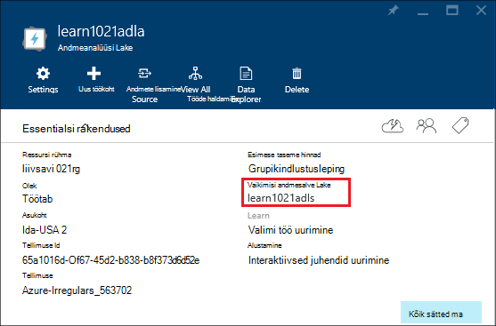

**Lisada täiendavad andmeallikad**

1. Avage Lake andmeanalüüsi konto, mida soovite hallata. Juhised leiate teemast [Accessi andmed Lake Analyticsi kontod](#access-adla-account).
2. Klõpsake nuppu **sätted** ja seejärel klõpsake nuppu **Andmeallikad**. Näete peab seal loetletud Lake andmesalve vaikekonto. 
3. Klõpsake **andmeallika lisamine**.

    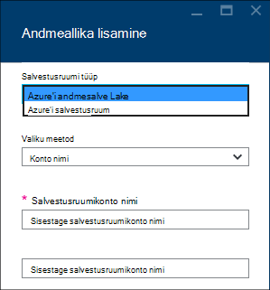

    Azure'i andmesalve Lake konto lisamiseks peate konto nimi ja juurdepääsu konto on võimalik, et see päring.
    Mõne Azure'i bloobimälu lisamiseks peate salvestusruumi konto ja konto võti, liikudes portaali konto salvestusruumi leitav.

**Andmeallikate analüüsimiseks**  

1. Avage Analytics konto, mida soovite hallata. Juhised leiate teemast [Accessi andmed Lake Analyticsi kontod](#access-adla-account).
2. Klõpsake nuppu **sätted** ja seejärel käsku **Andmete Explorer**. 
 
    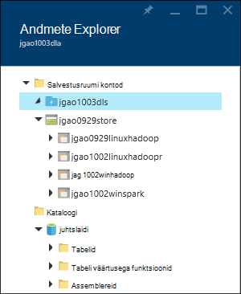
    
3. Klõpsake Lake andmesalve konto konto avamiseks.

    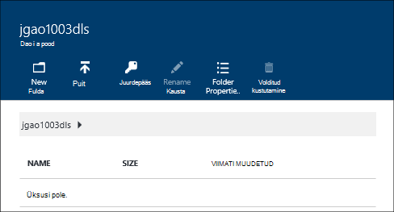
    
    Iga Lake andmesalve konto, saate
    
    - **Uue kausta**: lisage uus kaust.
    - **Üles laadida**: failide üleslaadimine salvestusruumi konto oma töökoha.
    - **Accessi**: konfigureerimine Accessi õigused.
    - **Kausta ümbernimetamine**: kausta ümbernimetamine.
    - **Kausta atribuudid**: Kuva faili või kausta atribuudid, näiteks WASB tee, WEBHDFS tee, viimase muutmise aja jne.
    - **Kustutage kaust**: kausta kustutamine.

**Lake andmesalve kontole faile üles laadida**

1. Portaalist, klõpsake vasakul menüüs nuppu **Sirvi** ja klõpsake **Lake andmesalve**.
2. Klõpsake Lake andmesalve konto, mille soovite üles laadida andmed. Lake andmesalv vaikekonto, leiate [siit](#default-adl-account).
3. Klõpsake **Andmete Explorer** ülalt menüüst.
4. Klõpsake käsku **Uus kaust** uue kausta loomiseks või klõpsake muuta kausta kausta nimi.
6. Ülalt menüüst faili üleslaadimiseks klõpsake **Laadi üles** .

**Azure'i bloobimälu salvestusruumi kontole faile üles laadida**

Lugege teemat [andmete Hadoopi töökohta, Hdinsightiga üles laadida](../hdinsight/hdinsight-upload-data.md).  Teave kehtib Lake andmeanalüüsi.

## Kasutajate haldamine

Andmeanalüüsi Lake kasutab Azure Active Directory Rollipõhine juurdepääsu reguleerimine. Andmeanalüüsi Lake konto loomisel "Tellimuse administraatorid" rolli on lisatud kontole. Saate lisada täiendavad kasutajad ja turberühmad järgmised rollid:

|Roll|Kirjeldus|
|----|-----------|
|Omanik|Saate hallata kõik, sh ressurssidele.|
|Kaasautor|Portaali; esitada ja jälgida töö. Edastab tööd saaks kaasautori peab lugeda või kirjutada luba Lake andmesalve kontod.|
|DataLakeAnalyticsDeveloper | Esitage, jälgimine ja tühistada tööde haldamine.  Need kasutajad saate tühistada ainult oma tööd. Ta ei saa hallata oma konto, näiteks kasutajate lisamine, õiguste muutmine või kustutamine konto. Tööde saaks neile vajalikule lugemis- või kirjutamisõigused Lake andmesalve kontod     | 
|Lugeja|Võimaldab teil vaadata kõike, kuid mitte muuta.|  
|DevTest Labs kasutaja|Saate kuvada kõik ja ühenduse, virtuaalse masinad start, uuesti ja sulgemine.|  
|Kasutaja juurdepääs administraator|Saate hallata kasutajate juurdepääsu Azure ressursse.|  

Azure Active Directory kasutajad ja turberühmad loomise kohta leiate teavet teemast [mis on Azure Active Directory](../active-directory/active-directory-whatis.md).

**Kasutajad või turberühmad Lake andmeanalüüsi konto lisamiseks**

1. Avage Analytics konto, mida soovite hallata. Juhised leiate teemast [Accessi andmed Lake Analyticsi kontod](#access-adla-account).
2. Klõpsake nuppu **sätted**ja klõpsake käsku **Kasutajad**. Võite klõpsata ka **Accessi** **Essentialsi** tiitliriba, nagu on näidatud järgmine pilt:

    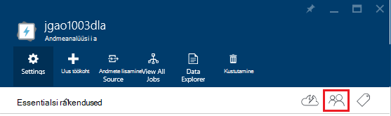
3. **Kasutaja** keelest, klõpsake nuppu **Lisa**.
4. Valige roll, kasutaja lisamine ja seejärel klõpsake nuppu **OK**.

**Märkus: Kui selle kasutaja või turberühma peab esitada töid, tuleb antakse õigused Lake andmesalve ka. Lisateabe saamiseks vt [turvaline Lake andmesalve talletatavad andmed](../data-lake-store/data-lake-store-secure-data.md).**

<!-- ################################ -->
<!-- ################################ -->
## Hallata

Saate kasutada mis tahes U-SQL-tööde haldamine peab teil olema Lake andmeanalüüsi konto.  Lisateavet leiate teemast [haldamine Lake andmeanalüüsi kontod](#manage-data-lake-analytics-accounts).

**Töö loomine**

1. Avage Analytics konto, mida soovite hallata. Juhised leiate teemast [Accessi andmed Lake Analyticsi kontod](#access-adla-account).
2. Klõpsake nuppu **uus töökoht**.

    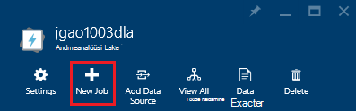

    Kuvatakse peab sarnaselt uue tera.

    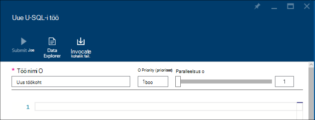

    Saate konfigureerida iga töö

  	|Nimi|Kirjeldus|
  	|----|-----------|
  	|Töö nimi|Sisestage töö nimi.|
  	|Priority (prioriteet)|Väiksem väärtus on suurem prioriteet. Kui kaks töökohta on mõlemad järjekorras, üks madalam prioriteet töötab esimest|
  	|Paralleelsus |Max Arvuta protsesside, mis võib juhtuda, samal ajal arv. See arv saate parandada jõudlust, kuid saate ka suurendada maksumus.|
  	|Skripti|Sisestage U-SQL-skript töö.|

    Sama liidest kasutades saate uurida linki andmeallikad, ja lingitud andmeallikate täiendavaid faile lisada. 
3. Klõpsake **Töö esitada** , kui soovite esitada töö.

**Esitada tööd**

[Luua Lake andmeanalüüsi projektide](#create-job)kuvamiseks.

**Töö jälgimiseks**

1. Avage Analytics konto, mida soovite hallata. Juhised leiate teemast [Accessi andmed Lake Analyticsi kontod](#access-adla-account). Töö haldus paneel näitab lihtne töö kohta:

    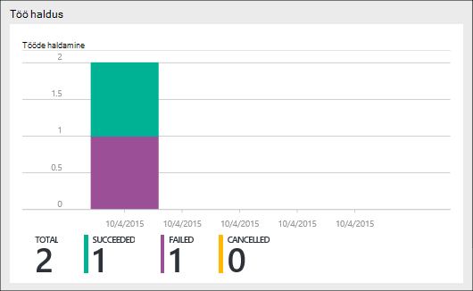

3. Klõpsake **Töö haldus** , nagu on näidatud eelmise kuvatõmmis.

    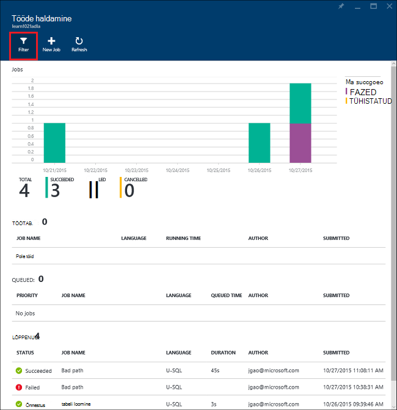

4. Klõpsake töö loenditest. Või klõpsake **filtri** abil saate otsida tööd.

    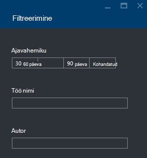

    Saate filtreerida **Ajavahemiku**, **Töö nimi**ja **Autor**tööde haldamine.
5. Klõpsake **uuesti** , kui soovite uuesti töö.

**Töö uuesti**

[Kuvari andmeanalüüsi Lake projektide](#monitor-jobs)kuvamiseks.

##Kuvari konto kasutamine

**Jälgida konto kasutamine**

1. Avage Analytics konto, mida soovite hallata. Juhised leiate teemast [Accessi andmed Lake Analyticsi kontod](#access-adla-account). Paani kasutus näitab kasutamine.

    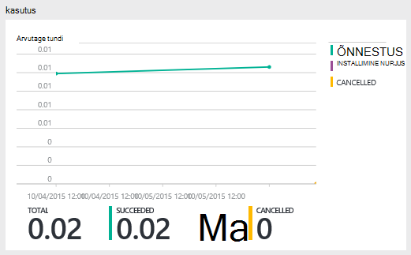

2. Topeltklõpsake paanil kuvamiseks rohkem üksikasju.

##Vaate U-SQL-i kataloogi

[A-SQL-i kataloogi](data-lake-analytics-use-u-sql-catalog.md) kasutatakse struktureerimine andmed ja koodi nii, et ta saab jagada U-SQL-i skripte. Kataloogi võimaldab võimalike andmetega Azure'i andmed Lake kõrgeim jõudlus. Azure portaali, siis on vaadata U-SQL-i kataloogi.

**A-SQL-i kataloogi sirvimiseks**

1. Avage Analytics konto, mida soovite hallata. Juhised leiate teemast [Accessi andmed Lake Analyticsi kontod](#access-adla-account).
2. Klõpsake **Andmete Explorer** ülalt menüüst.
3. Laiendage **kataloogi**, laiendage **juhtslaidi**, laiendage **tabelite või **väärtusega Tabelifunktsioonid**, või **assemblereid **. Järgmine pilt kuvatakse ühe tabeli hinnatud funktsiooni.

    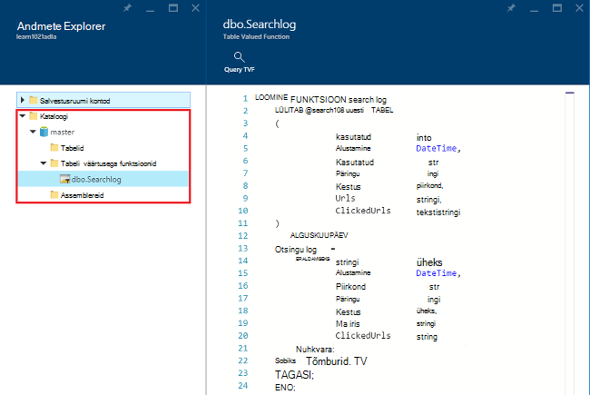

<!-- ################################ -->
<!-- ################################ -->
## Azure'i ressursihaldur rühmade kasutamine

Rakendused on tavaliselt valmistatud palju komponendid, näiteks web appi, andmebaasi, andmebaasiserver, salvestusruumi ja muu tootja teenused. Azure'i ressursihaldur võimaldab teil töö ressurssidega oma rakenduse rühmana, nimetatakse ka Azure ressursirühma. Saate juurutada, värskendamine, jälgida või kustutada kõik ressursse rakenduse ühe ja koordineeritud toiming. Malli kasutamine juurutamiseks ja sellel mallil saate töötada viibite, nt katsetada, lavastus ja tootmise. Arveldamine selgitada oma ettevõtte jaoks soovitud kulude terve rühma vaatamine. Lisateavet leiate teemast [Azure ressursihaldur ülevaade](../azure-resource-manager/resource-group-overview.md). 

Andmeanalüüsi Lake teenus võib sisaldada järgmisi komponente.

- Azure'i andmed Lake Analytics konto
- Nõutud vaikimisi Azure'i andmesalve Lake konto
- Täiendavad Azure'i andmesalve kontod
- Täiendava salvestusruumi Azure'i kontod

Saate luua nende komponentide ressursside haldamine ühes rühmas kergemaks haldamine.

Andmeanalüüsi Lake konto ja kontod sõltuvad salvestusruumi peab asuma samas Azure andmekeskuse.
Ressursihalduse rühma siiski võib asuda mõnes muus andmekeskuse.  

##Vt ka 

- [Microsoft Azure'i andmed Lake Analytics ülevaade](data-lake-analytics-overview.md)
- [Azure'i portaalis Lake andmeanalüüsi kasutamise alustamine](data-lake-analytics-get-started-portal.md)
- [Azure'i Lake andmeanalüüsi Azure PowerShelli kaudu hallata](data-lake-analytics-manage-use-powershell.md)
- [Jälgimine ja Azure andmeanalüüsi Lake töö Azure'i portaalis tõrkeotsing](data-lake-analytics-monitor-and-troubleshoot-jobs-tutorial.md)

