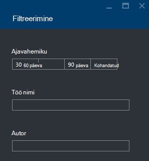

<properties 
   pageTitle="Azure'i andmeanalüüsi Lake töö Azure'i portaalis tõrkeotsing | Azure'i" 
   description="Saate teada, kuidas kasutada Azure portaali tõrkeotsingu Lake andmeanalüüsi tööde haldamine. " 
   services="data-lake-analytics" 
   documentationCenter="" 
   authors="edmacauley" 
   manager="jhubbard" 
   editor="cgronlun"/>
 
<tags
   ms.service="data-lake-analytics"
   ms.devlang="na"
   ms.topic="article"
   ms.tgt_pltfrm="na"
   ms.workload="big-data" 
   ms.date="05/16/2016"
   ms.author="edmaca"/>

# Tõrkeotsing: Azure'i portaalis Azure andmeanalüüsi Lake tööde haldamine

Saate teada, kuidas kasutada Azure portaali tõrkeotsingu Lake andmeanalüüsi tööde haldamine.

Selles õpetuses on puudub allika faili probleem häälestamise ja kasutada Azure portaali probleemi tõrkeotsinguks.

**Eeltingimused**

Enne alustamist selles õpetuses, peab teil olema järgmised:

- **Ametinimetuse põhiteadmisi Lake andmeanalüüsi protsess**. Teemast [Azure Lake andmeanalüüsi Azure'i portaalis alustamine](data-lake-analytics-get-started-portal.md).
- **A Lake andmeanalüüsi konto**. Teemast [Azure Lake andmeanalüüsi Azure'i portaalis alustamine](data-lake-analytics-get-started-portal.md#create-adl-analytics-account).
- **Kopeerige Näidisandmete vaikimisi Lake andmesalve kontole**.  Vaadake [lähteandmed ettevalmistamine](data-lake-analytics-get-started-portal.md#prepare-source-data)

##Esitage Lake andmeanalüüsi töö

Nüüd loote U-SQL töö halb allikas faili nimi.  

**Esitada töö**

1. Azure'i portaalis, klõpsake **Microsoft Azure'i** ülemises vasakus nurgas.
2. Klõpsake paani teie Lake andmeanalüüsi konto nimi.  See on kinnitatud siin konto loomisel.
Kui konto on kinnitatud olemas, lugege teemat [avatud konto Analyticsi portaalist](data-lake-analytics-manage-use-portal.md#access-adla-account).
3. Klõpsake nuppu **Uus töökoht** ülalt menüüst.
4. Töö nimi ja järgmine U-SQL skript sisestamine

        @searchlog =
            EXTRACT UserId          int,
                    Start           DateTime,
                    Region          string,
                    Query           string,
                    Duration        int?,
                    Urls            string,
                    ClickedUrls     string
            FROM "/Samples/Data/SearchLog.tsv1"
            USING Extractors.Tsv();
        
        OUTPUT @searchlog   
            TO "/output/SearchLog-from-adls.csv"
        USING Outputters.Csv();

    Skripti määratletud lähtefail on **/Samples/Data/SearchLog.tsv1**, kus võib **/Samples/Data/SearchLog.tsv**.
     
5. Klõpsake **Töö esitamine** algusest. Avatakse uus töö üksikasjapaani. Tiitliribal, kuvatakse see töö olek. Kulub paar minutit, et lõpetada. Võite klõpsata **värskendamine** saada Viimane olek.
6. Oodake, kuni töö olek on **nurjunud**muutunud.  Kui töö on **õnnestus**, sellepärast ei /Samples kausta eemaldada. **Eelnevalt nõutud** jaotisest õpetuse alguses.

Võib tekkida – miks kulub nii palju aega väike töö.  Pidage meeles, et Lake andmeanalüüsi eesmärk on suur andmete töötlemiseks.  Paistab, et kui suurt hulka andmeid, kasutades oma hajutatud süsteemi töötlemine.

Vaatame Oletame, et teie esitatud töö ja sulgege portaali.  Järgmise jaotise, saate teada, kuidas tõrkeotsingu töö.

## Töö tõrkeotsing

Viimase jaotises olete saatnud töö ja töö nurjus.  

**Kõigi projektide kuvamiseks**

1. Klõpsake **Microsoft Azure'i** Azure portaalis ülemises vasakus nurgas.
2. Klõpsake paani teie Lake andmeanalüüsi konto nimi.  Kokkuvõte töö kuvatakse paani **Töö haldus** .

    
    
    Töö haldus annab teile lühidalt töö olek. Pange tähele, on nurjunud töö.
   
3. Klõpsake paani projektide kuvamiseks **Töö haldus** . Tööd on liigitatud **töötab**, ja **Ootel** **lõpetatud**. Näete peab teie **lõpetatud** jaotises nurjunud töö. See on esimene loendis. Kui teil on palju tööd, võite klõpsata **filtreerimine** aitab teil tööd leida.

    

4. Nurjunud töö loendist uus laba töö üksikasjad avamiseks klõpsake.

    
    
    Pange tähele, **uuesti** nuppu. Pärast selle probleemi lahendamiseks saate olete uuesti töö.

5. Klõpsake käsku esiletõstetud osa eelmise screenshot tõrke üksikasjade avamiseks.  Kuvatakse teeb midagi.

    

    See teade, et allikas kausta ei leitud.
    
6. Klõpsake **dubleerimine skripti**.
7. Värskenda **saatja** tee järgmist:

    "/ Samples/Data/SearchLog.tsv"

8. Klõpsake **töö esitada**.

##Vt ka

- [Azure'i andmed Lake Analytics ülevaade](data-lake-analytics-overview.md)
- [Azure'i Lake andmeanalüüsi Azure PowerShelli kaudu alustamine](data-lake-analytics-get-started-powershell.md)
- [Azure'i Lake andmeanalüüsi ja Visual Studio abil U-SQL-i kasutamise alustamine](data-lake-analytics-u-sql-get-started.md)
- [Azure'i Lake andmeanalüüsi Azure'i portaalis haldamine](data-lake-analytics-manage-use-portal.md)

