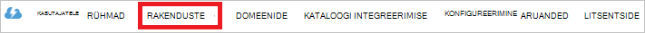

<properties
   pageTitle="Autentimiseks Lake andmesalve Active Directory abil | Microsoft Azure'i"
   description="Saate teada, kuidas autentimiseks Lake andmesalve Active Directory abil"
   services="data-lake-store"
   documentationCenter=""
   authors="nitinme"
   manager="jhubbard"
   editor="cgronlun"/>

<tags
   ms.service="data-lake-store"
   ms.devlang="na"
   ms.topic="article"
   ms.tgt_pltfrm="na"
   ms.workload="big-data"
   ms.date="10/17/2016"
   ms.author="nitinme"/>

# Teenuse-teenus Lake andmesalve Azure Active Directory abil autentimine

> [AZURE.SELECTOR]
- [Teenusest autentimine](data-lake-store-authenticate-using-active-directory.md)
- [Lõppkasutaja autentimine](data-lake-store-end-user-authenticate-using-active-directory.md)

Azure'i andmesalve Lake kasutab Azure Active Directory autentimine. Enne loome rakendus, mis töötab koos Azure andmesalve Lake või Azure andmeanalüüsi Lake, peate esmalt otsustama, kuidas soovite autentida rakenduse Azure Active Directory (Azure AD). On kaks peamist võimalust saadaval.

* Lõppkasutaja autentimise ja 
* Teenusest autentimist. 

Mõlemad võimalused tulemuseks on varustatud OAuth 2.0 luba, mis toob seotud iga taotlus Azure'i andmesalve Lake või Azure Lake andmeanalüüsi rakenduse.

See artikkel räägib kuidas luua Azure AD veebirakenduse, teenusest autentimine. Juhised Azure AD rakenduse konfigureerimise lõppkasutaja autentimise vt [lõppkasutaja autentimise andmete Lake poe kaudu Azure Active Directory](data-lake-store-end-user-authenticate-using-active-directory.md).

## Eeltingimused

* Azure'i tellimuse. Leiate [Azure'i saada tasuta prooviversioon](https://azure.microsoft.com/pricing/free-trial/).
* Teie tellimuse ID-ga. Saate neid Azure'i portaalis. Näiteks on saadaval keelest Lake andmesalve konto.

    

* Azure AD domeeninime. Saate neid libistamisel hiire Azure portaali ülemises paremas nurgas. Pildil domeeninimi on **contoso.microsoft.com**ja GUID sulgudes on rentniku ID-ga. 

    

## Teenusest autentimine

See on soovitatav, kui soovite rakenduse automaatselt autentida Azure AD, ilma vajaduseta lõppkasutaja oma mandaat. Rakenduse saab autentida enda jaoks seni, kuni selle mandaadid ei sobi, mida saab kohandada, et olla aastat.

### Mida on vaja kasutada seda meetodit või mitte?

* Azure'i AD domeeni nimi. See on juba loendis käesoleva artikli nõutav.

* Azure'i AD **veebirakenduse**.

* Kliendi ID Azure AD veebirakenduse jaoks.

* Kliendi salajane Azure AD veebirakenduse jaoks.

* Veebirakenduse Azure AD Turbeloa lõpp-punkti.

* Accessi veebirakenduse Azure AD lubamine on Lake andmesalve faili või kausta või Lake andmeanalüüsi konto, mida soovite töötada.

Juhised on Azure AD veebirakenduse loomine ja konfigureerimine eelnimetatud nõuete jaotisest [luua Active Directory rakenduse](#create-an-active-directory-application) allpool.

>[AZURE.NOTE] Vaikimisi Azure AD rakendus on konfigureeritud kasutama kliendi salajane, mille saate alla laadida rakendusest Azure AD. Kui soovite Azure AD Rakenduse serdi asemel kasutada, peate looma Azure AD veebirakenduse abil Azure PowerShelli, nagu on kirjeldatud aadressil [loomine teenuse põhisumma serdiga](../resource-group-authenticate-service-principal.md#create-service-principal-with-certificate).

## Active Directory rakenduse loomine

Selles jaotises me teada, kuidas loomiseks ja konfigureerimiseks teenusest autentimine Azure'i AD-veebirakenduse Azure'i andmed Lake poe Azure Active Directory abil. 

### Samm 1: Azure Active Directory rakenduse loomine

>[AZURE.NOTE] Azure'i portaali kasutada alltoodud juhiseid. Saate luua ka Azure AD [Azure PowerShelli](../resource-group-authenticate-service-principal.md) või rakendus [Azure'i CLI](../resource-group-authenticate-service-principal-cli.md).

1. Logige sisse oma Azure'i kontosse [klassikaline portaali](https://manage.windowsazure.com/)kaudu.

2. Valige vasakul paanil **Active Directory** .

     
     
3. Valige Active Directory, mida soovite luua uue rakenduse kasutamine. Kui teil on rohkem kui üks Active Directory, soovite tavaliselt luua rakenduse kataloogis, kus asub teie tellimus. Saate ainult teie tellimus rakenduste tellimuse sama kataloogis ressursile juurdepääsu anda.  

     
    
    
3. Rakenduste kataloogi kuvamiseks klõpsake nuppu **rakendused**.

     

4. Kui te pole loonud rakenduse selle kausta enne peaksite nägema midagi sarnast järgmisel pildil. Klõpsake **rakenduse lisamine**

     

     Või klõpsake käsku **Lisa** alumise paani.

     

6. Rakenduse nimi ja valige rakendus, mida soovite luua. Selles õpetuses soovitud **Rakendus ja/või WEB Veebiteenuste** loomine ja klõpsake nuppu edasi.

     

7. Sisestage oma rakenduse atribuudid. **Logi-ON URL-i**, sisestage URI veebisaidile, mis kirjeldab rakenduse. Veebisaidi olemasolu ei kontrollita. **Rakenduse ID URI**, esitage URI, mille abil tuvastatakse teie rakendus.

     

    Klõpsake viisardi lõpuleviimine ja luua rakenduse märke.

### Samm 2: Hankida kliendi id, kliendi salajane ja Turbeloa lõpp-punkti

Kui programmiliselt logimine, peate rakenduse ID-d. Kui rakendus töötab vastavalt oma mandaat, te peate mõne autentimise võti.

1. Klõpsake vahekaarti **konfigureerimine** konfigureerida rakenduse parool.

     

2. Kopeerige **Kliendi ID**.
  
     

3. Kui rakendus töötab jaotises oma mandaat, liikuge kerides jaotiseni **võtmed** ja valige, kui kaua soovite parool on lubatud.

     

4. Valige **Salvesta** võtme loomiseks.

    

    Salvestatud võti kuvatakse ja saate selle kopeerida. Te ei saa võti hiljem kuulata, seega peab kopeerige see kohe.

    

5. Turbeloa lõpp-punkti tuua, valides ekraani allservas **Vaade lõpp-punktid** ja toomine **OAuthi 2.0 Turbeloa lõpp-punkti** välja puhul väärtus, nagu allpool näidatud.  

    

### Samm 3: Määrata Azure AD rakendus Azure'i andmesalve Lake konto faili või kausta (ainult teenusest autentimine)

1. Uue [Azure portaali](https://portal.azure.com) sisse logida ja avage Azure'i andmesalve Lake konto, mille soovite seostada varem loodud Azure Active Directory rakendus.

1. Klõpsake oma Lake andmesalve konto blade **Andmete Explorer**.

    ![Loo kataloogide Lake andmesalve konto] (./media/data-lake-store-authenticate-using-active-directory/adl.start.data.explorer.png "Andmete Lake konto loomine kataloogid")

2. **Andmete Explorer** tera, klõpsake faili või kausta, mida soovite juurdepääsu Azure AD rakendus ja siis käsku **juurdepääs**. Faili juurdepääsu konfigureerimiseks tuleb klõpsata **Accessi** **Faili eelvaate** keelest.

    ![Määrake ACL andmete Lake failisüsteemis] (./media/data-lake-store-authenticate-using-active-directory/adl.acl.1.png "Määrake ACL andmete Lake failisüsteemis")

3. **Accessi** tera loetletakse standard juurdepääsu ja kohandatud Accessi juba määratud juurkausta. Klõpsake ikooni **Lisa** Kohandatud tase ACL lisamiseks.

    ![Standard- ja kohandatud loend Accessi] (./media/data-lake-store-authenticate-using-active-directory/adl.acl.2.png "Standard- ja kohandatud loend Accessi")

4. Klõpsake ikooni **Lisa** **Lisada kohandatud Accessi** tera avamiseks. See tera, klõpsake nuppu **Valige kasutaja või rühma**ja seejärel **Valige kasutaja või rühma** tera, otsige lõite Azure Active Directory turberühma. Kui teil on palju rühmi, et otsida, kasutage tekstivälja ülaosas filtreerimiseks klõpsake rühma nime. Klõpsake nuppu Lisa ja seejärel klõpsake nuppu, **Valige**soovitud rühm.

    ![Lisa rühm] (./media/data-lake-store-authenticate-using-active-directory/adl.acl.3.png "Lisa rühm")

5. Klõpsake nuppu **Valige õigused**, valige õigused ja kas soovite määrata vaikimisi ACL õigused, kasutada ACL või mõlemad. Klõpsake nuppu **OK**.

    ![Rühmale õiguste määramine] (./media/data-lake-store-authenticate-using-active-directory/adl.acl.4.png "Rühmale õiguste määramine")

    Lake andmesalve ja Access vaikimisi ACL õiguste kohta leiate lisateavet teemast [Andmete Lake poes juurdepääsu reguleerimine](data-lake-store-access-control.md).

6. **Lisada kohandatud Accessi** tera, klõpsake nuppu **OK**. Äsja lisatud jaotises seotud õigusi, kus on loetletud kohe **juurdepääsu** tera.

    ![Rühmale õiguste määramine] (./media/data-lake-store-authenticate-using-active-directory/adl.acl.5.png "Rühmale õiguste määramine") 

## Järgmised sammud

Selles artiklis on Azure AD veebirakenduse loodud ja kogutud teavet, mida vajate oma klientrakendustes, et te autori, kasutades .NET SDK, Java SDK jne. Nüüd jätkake järgmisi artikleid, mis rääkida, kuidas kasutada Azure AD veebirakenduse Lake andmesalve esmalt autentimiseks ja seejärel muid toiminguid pood.

- [Azure'i Lake andmesalve kasutades .NET SDK kasutamise alustamine](data-lake-store-get-started-net-sdk.md)
- [Azure'i Lake andmesalve Java SDK kasutamise alustamine](data-lake-store-get-started-java-sdk.md)
