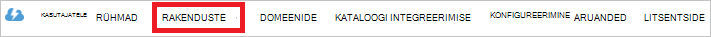

<properties
   pageTitle="Autentimiseks Lake andmesalve Active Directory abil | Microsoft Azure'i"
   description="Saate teada, kuidas autentimiseks Lake andmesalve Active Directory abil"
   services="data-lake-store"
   documentationCenter=""
   authors="nitinme"
   manager="jhubbard"
   editor="cgronlun"/>

<tags
   ms.service="data-lake-store"
   ms.devlang="na"
   ms.topic="article"
   ms.tgt_pltfrm="na"
   ms.workload="big-data"
   ms.date="10/17/2016"
   ms.author="nitinme"/>

# Lõppkasutaja Lake andmesalve Azure Active Directory abil autentimine

> [AZURE.SELECTOR]
- [Teenusest autentimine](data-lake-store-authenticate-using-active-directory.md)
- [Lõppkasutaja autentimine](data-lake-store-end-user-authenticate-using-active-directory.md)

Azure'i andmesalve Lake kasutab Azure Active Directory autentimine. Enne loome rakendus, mis töötab koos Azure andmesalve Lake või Azure andmeanalüüsi Lake, peate esmalt otsustama, kuidas soovite autentida rakenduse Azure Active Directory (Azure AD). On kaks peamist võimalust saadaval.

* Lõppkasutaja autentimise ja 
* Teenusest autentimist. 

Mõlemad võimalused tulemuseks on varustatud OAuth 2.0 luba, mis toob seotud iga taotlus Azure'i andmesalve Lake või Azure Lake andmeanalüüsi rakenduse.

See artikkel räägib kuidas lõppkasutaja autentimise Azure'i AD-veebirakenduse loomine Juhised Azure AD rakenduse konfigureerimise-teenusest autentimise vt [teenusest autentimine andmete Lake poe kaudu Azure Active Directory](data-lake-store-authenticate-using-active-directory.md).

## Eeltingimused

* Azure'i tellimuse. Leiate [Azure'i saada tasuta prooviversioon](https://azure.microsoft.com/pricing/free-trial/).
* Teie tellimuse ID-ga. Saate neid Azure'i portaalis. Näiteks on saadaval keelest Lake andmesalve konto.

    

* Azure AD domeeninime. Saate neid libistamisel hiire Azure portaali ülemises paremas nurgas. Pildil domeeninimi on **contoso.microsoft.com**ja GUID sulgudes on rentniku ID-ga. 

    

## Lõppkasutaja autentimine

See on soovitatav, kui soovite lõppkasutaja rakenduse kaudu Azure AD sisse logida. Rakenduse saab juurdepääsu Azure ressursse samal tasemel Accessi lõppkasutaja sisse loginud. Teie lõppkasutaja on vaja oma volitusi perioodiliselt, et säilitamiseks Accessi rakenduse.

Tulemus on lõppkasutaja, logige sisse on, et teie taotlus on juurdepääsu sümboolse ja Värskenda luba. Juurdepääsu luba saab manustatud Lake andmesalve või Lake andmeanalüüsi iga taotlus ja see kehtib vaikimisi tund. Värskenda luba saab hankida uue juurdepääsu luba ja see kehtib kuni kaks nädalat vaikimisi, kui kasutada regulaarselt. Saate kaks lähenemisviisi lõppkasutaja Logi sisse.

### Kasutades OAuth 2.0 hüpikaknas

Rakenduse käivitab lõppkasutaja saate sisestada oma volitusi OAuth 2.0 autoriseerimine hüpikaknas. See hüpikakna töötab ka Azure AD kahekordne autentimine (2FA) protsess, kui nõutav. 

>[AZURE.NOTE] See meetod veel ei toetata rakenduses on Azure AD autentimiseks teeki (ADAL) Python või Java.

### Otse läbides kasutajatunnust

Rakenduse saate sisestada otse kasutajatunnust Azure AD. See meetod toimib ainult ettevõtte ID kasutajakontode; See ei ühildu koos isiklik / "live ID" kasutajakonto, kaasa arvatud lõpus on @outlook.com või @live.com. Lisaks selle meetodi ei ühildu Kasutajakontod, mis nõuavad Azure AD kahekordne autentimine (2FA).

### Mida on vaja kasutada seda meetodit või mitte?

* Azure'i AD domeeni nimi. See on juba loendis käesoleva artikli nõutav.

* Azure'i AD **veebirakenduse**

* Kliendi ID Azure AD veebirakenduse jaoks

* Vasta URI Azure AD veebirakenduse jaoks

* Delegeeritud õiguste määramine

Juhised on Azure AD veebirakenduse loomine ja konfigureerimine eelnimetatud nõuete jaotisest [luua Active Directory rakenduse](#create-an-active-directory-application) allpool. 

## Active Directory rakenduse loomine

Selles jaotises me teada, kuidas luua ja Azure AD veebirakenduse, lõppkasutaja autentimise konfigureerimine Azure'i andmed Lake poe Azure Active Directory abil.

### Samm 1: Azure Active Directory rakenduse loomine

>[AZURE.NOTE] Azure'i portaali kasutada alltoodud juhiseid. Saate luua ka Azure AD [Azure PowerShelli](../resource-group-authenticate-service-principal.md) või rakendus [Azure'i CLI](../resource-group-authenticate-service-principal-cli.md).

1. Logige sisse oma Azure'i kontosse [klassikaline portaali](https://manage.windowsazure.com/)kaudu.

2. Valige vasakul paanil **Active Directory** .

     
     
3. Valige Active Directory, mida soovite luua uue rakenduse kasutamine. Kui teil on rohkem kui üks Active Directory, soovite tavaliselt luua rakenduse kataloogis, kus asub teie tellimus. Saate ainult teie tellimus rakenduste tellimuse sama kataloogis ressursile juurdepääsu anda.  

     
    
    
3. Rakenduste kataloogi kuvamiseks klõpsake nuppu **rakendused**.

     

4. Kui te pole loonud rakenduse selle kausta enne peaksite nägema midagi sarnast järgmisel pildil. Klõpsake **rakenduse lisamine**

     

     Või klõpsake käsku **Lisa** alumise paani.

     

6. Rakenduse nimi ja valige rakendus, mida soovite luua. Selles õpetuses soovitud **Rakendus ja/või WEB Veebiteenuste** loomine ja klõpsake nuppu edasi.

     

7. Sisestage oma rakenduse atribuudid. **Logi-ON URL-i**, sisestage URI veebisaidile, mis kirjeldab rakenduse. Veebisaidi olemasolu ei kontrollita. **Rakenduse ID URI**, esitage URI, mille abil tuvastatakse teie rakendus.

     

    Klõpsake viisardi lõpuleviimine ja luua rakenduse märke.

### Samm 2: Kliendi id hankimine, vastake URI ja delegeeritud õiguste määramine

1. Klõpsake vahekaarti **konfigureerimine** konfigureerida rakenduse parool.

     

2. Kopeerige **Kliendi ID**.
  
     

3. Kopeerige jaotises **ühekordse sisselogimise** **Vasta URI**.

    

4. Klõpsake jaotises **õigused muudes rakendustes**, nuppu **Lisa rakendus**

    

5. Viisardis **õiguste muudes rakendustes** valige **Azure'i andmed järv** ja **Windows** **Azure'i teenuse juhtimise API**, ja klõpsake märke.

6. Vaikimisi **Delegeeritud õiguste** äsja lisatud teenuste väärtuseks null. Klõpsake **Delegeeritud õigused** ripploendis Azure'i andmed Lake ja Windows Azure'i halduse teenuse ja valige väärtuste määramiseks 1 saadaval märkeruudud. Tulemus peaks välja nägema järgmine.

     

7. Klõpsake nuppu **Salvesta**.

## Järgmised sammud

Selles artiklis on Azure AD veebirakenduse loodud ja kogutud teavet, mida vajate oma klientrakendustes, et te autori, kasutades .NET SDK, Java SDK jne. Nüüd jätkake järgmisi artikleid, mis rääkida, kuidas kasutada Azure AD veebirakenduse Lake andmesalve esmalt autentimiseks ja seejärel muid toiminguid pood.

- [Azure'i Lake andmesalve kasutades .NET SDK kasutamise alustamine](data-lake-store-get-started-net-sdk.md)
- [Azure'i Lake andmesalve Java SDK kasutamise alustamine](data-lake-store-get-started-java-sdk.md)
