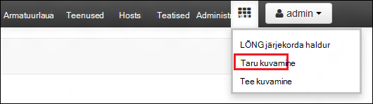
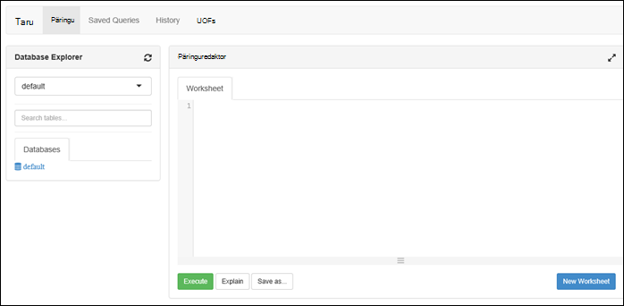

<properties
   pageTitle="Azure'i Lake andmesalve portaalis Hdinsightiga kogumite loomine | Azure'i"
   description="Azure portaali abil saate luua ja Azure andmesalve Lake Hdinsightiga kogumite kasutamine"
   services="data-lake-store,hdinsight" 
   documentationCenter=""
   authors="nitinme"
   manager="jhubbard"
   editor="cgronlun"/>

<tags
   ms.service="data-lake-store"
   ms.devlang="na"
   ms.topic="article"
   ms.tgt_pltfrm="na"
   ms.workload="big-data"
   ms.date="10/21/2016"
   ms.author="nitinme"/>

# Luua ka Hdinsightiga kobar Lake andmesalve Azure'i portaalis

> [AZURE.SELECTOR]
- [Portaalis](data-lake-store-hdinsight-hadoop-use-portal.md)
- [PowerShelli kasutamine](data-lake-store-hdinsight-hadoop-use-powershell.md)
- [Ressursihaldur abil](data-lake-store-hdinsight-hadoop-use-resource-manager-template.md)

Saate teada, kuidas luua Hdinsightiga kobar, (Hadoopi, HBase, säde või Storm) juurdepääsu Azure andmesalve Lake Azure portaali abil. Mõned olulised kaalutlused selles versioonis:

* **Jaoks säde kogumite (Linux) ja Hadoopi kogumite (Windows ja Linux)**, Lake andmesalve saab kasutada ainult konto täiendav salvestusruum. Sellise rühmad salvestusruumi vaikekonto ikkagi Azure'i salvestusruumi plekid (WASB).

* **Jaoks Storm kogumite (Windows ja Linux)**, Lake andmesalve saab kasutada andmete kirjutamise Storm topoloogia. Lake andmesalve saab kasutada ka salvestamiseks viide andmeid, siis saab lugeda, Storm topoloogia. Lisateabe saamiseks vt [Lake andmesalve kasutamine Storm topoloogia](#use-data-lake-store-in-a-storm-topology).

* **(Windows ja Linux) jaoks HBase kogumite**, Lake andmesalve saab kasutada on vaikimisi nii, et täiendav salvestusruum. Lisateavet leiate teemast [Lake andmesalve kasutamine koos HBase kogumite](#use-data-lake-store-with-hbase-clusters).

> [AZURE.NOTE] Pange tähele, et mõned olulised punktid. 
> 
> * Võimalus luua Hdinsightiga kogumite juurdepääsu Lake andmesalve on saadaval ainult Hdinsightiga versioonid 3,2 ja 3.4 (for Windows kui ka Linux Hadoopi, HBase ja torm kogumid). Säde kogumite Linux, see suvand on ainult Hdinsightiga 3.4 kogumite saadaval.
>
> * Eespool nimetatud Lake andmesalve on saadaval vaikimisi salvestusruumi teatava kobar (HBase) ja muude kobar (Hadoopi, säde, Storm) täiendav salvestusruum. Kasutades Lake andmesalve konto täiendav salvestusruum mõjutada jõudlust või kirjutuskaitse säilitamist kaudu klaster võimalus. Kui andmesalve Lake kasutatakse täiendav salvestusruum stsenaariumi kirjutada kobar seotud faile (nt logid jne) vaikimisi salvestusruumi (Azure'i plekid), ajal andmed, mida soovite töödelda saab salvestada Lake andmesalve konto.

## Eeltingimused

Enne alustamist selles õpetuses, peab teil olema järgmised:

- **An Azure'i tellimus**. Leiate [Azure'i saada tasuta prooviversioon](https://azure.microsoft.com/pricing/free-trial/).

- **Azure'i andmesalve Lake konto**. Järgige veebisaidil [Alustamine Azure'i Lake andmesalve Azure'i portaalis](data-lake-store-get-started-portal.md). 

- **Näidisandmete Azure'i andmesalve Lake kontole üles laadida**. Kui olete loonud konto, teha järgmist üles laadida mõningaid näidisandmeid. Peate andmed allpool olevat õpetuse käivitada töö Hdinsightiga kobar, mis Lake andmesalve andmeid.

    * [Loo oma andmete Lake salvestada kausta](data-lake-store-get-started-portal.md#createfolder).
    * [Teie andmete Lake poodi faili üleslaadimine](data-lake-store-get-started-portal.md#uploaddata). Kui otsite Näidisandmete üles laadida, saate kausta **Kiirabi andmed** [Azure'i andmed Lake Git hoidla](https://github.com/Azure/usql/tree/master/Examples/Samples/Data/AmbulanceData).

- **Azure Active Directory teenuse põhilise**. Selle õpetuse juhised leiate juhised, kuidas luua teenuse põhisumma Azure AD. Siiski peate olema administraator Azure AD saama loomine teenuse põhisumma. Kui olete Azure AD administraator, saate selle nõutav vahele jätta ja jätkata õpetuse.
    
    **Kui te ei ole administraator Azure AD**, ei saa luua teenuse põhilise nõutav toimingute. Sellisel juhul Azure AD administraator peate esmalt looma teenuse põhisumma enne saate luua ka Hdinsightiga kobar Lake andmesalve. Lisaks teenuse põhilise tuleb luua serdiga, nagu on kirjeldatud aadressil [põhisumma serdiga teenuse](../resource-group-authenticate-service-principal.md#create-service-principal-with-certificate).

## Kas te kiiremini tundma õppida videod?

Vaadake järgmisi videoid mõista ettevalmistamise Hdinsightiga kogumite juurdepääsuga andmete Lake poest.

* [Mõne Hdinsightiga kobar Lake andmesalve juurdepääsu loomine](https://mix.office.com/watch/l93xri2yhtp2)
* Kui klaster on häälestatud, [Accessi andmete Lake andmesalve taru ja siga skriptide abil](https://mix.office.com/watch/1n9g5w0fiqv1q)

## Azure'i andmesalve Lake juurdepääsu mõne Hdinsightiga kobar loomine

Selles jaotises saate luua Hdinsightiga Hadoopi kobar, mis kasutab Lake andmesalve soovitud täiendav salvestusruum. See väljaanne jaoks Hadoopi kobar, Lake andmesalve saab kasutada ainult mõne täiendav salvestusruum nimega klaster jaoks. Vaikimisi salvestusruumi ikkagi Azure storage plekid (WASB). Tuleb esmalt loome salvestusruumi konto ja salvestusruumi ümbriste klaster jaoks nõutavad.

1. Uue [Azure portaali](https://portal.azure.com)sisse logida.

2. Järgige juhiseid artiklis [loomine Hadoopi kogumite rakenduses Hdinsightiga](../hdinsight/hdinsight-provision-clusters.md#create-using-the-preview-portal) ettevalmistamise mõne Hdinsightiga kobar käivitamiseks.

3. Enne **Valikuline konfiguratsiooni** , klõpsake nuppu **Andmeallika**. **Andmeallika** tera, nagu **Ida-USA 2**salvestusruumi konto ja salvestusruumi container, üksikasjad määrata **asukoha** määramine, ja klõpsake **Kobar AAD identiteedi**.

    ![Lisa teenus põhisumma Hdinsightiga kobar] (./media/data-lake-store-hdinsight-hadoop-use-portal/hdi.adl.1.png "Lisa teenus põhisumma Hdinsightiga kobar")

4. **Kobar AAD identiteedi** enne, saate valida mõne olemasoleva teenuse põhilise või looge uus.

    * **Looge uus teenuse põhilise**

        * **Kobar AAD identiteedi** tera, klõpsake nuppu **Loo uus**, klõpsake **Teenuse põhilise**ja seejärel andke labale **loomine teenuse põhilise** luua uue teenuse põhilise väärtused. Osana mis sert ja Azure Active Directory rakenduse luuakse ka. Klõpsake nuppu **Loo**.

            ![Lisa teenus põhisumma Hdinsightiga kobar] (./media/data-lake-store-hdinsight-hadoop-use-portal/hdi.adl.2.png "Lisa teenus põhisumma Hdinsightiga kobar")

        * **Kobar AAD identiteedi** enne, klõpsake nuppu **Halda ADLS juurdepääs**. Paanil kuvatakse tellimusega seotud Lake andmesalve kontod. Siiski saate määrata ainult konto, mille lõite õigusi. Valige konto, mille soovite seostada Hdinsightiga kobar ja seejärel klõpsake nuppu **Salvesta õigused**õiguste lugemine ja kirjutamine ja käivitamine.

            ![Lisa teenus põhisumma Hdinsightiga kobar] (./media/data-lake-store-hdinsight-hadoop-use-portal/hdi.adl.3.png "Lisa teenus põhisumma Hdinsightiga kobar")

        * Klõpsake **Kobar AAD identiteedi** enne, **Laadige alla serdi** põhisumma loodud teenusega seotud serdi allalaadimiseks. See on kasulik, kui soovite kasutada sama teenuse peamine tulevikus täiendavad Hdinsightiga kogumite loomisel. Klõpsake nuppu **Vali**.

            ![Lisa teenus põhisumma Hdinsightiga kobar] (./media/data-lake-store-hdinsight-hadoop-use-portal/hdi.adl.4.png "Lisa teenus põhisumma Hdinsightiga kobar")

    * **Valige olemasolev teenuse peamise**

        * **Kobar AAD identiteedi** tera, klõpsake käsku **Kasuta olemasolevat**, klõpsake **Teenuse põhilise**ja **Valige teenuse põhilise** tera, otsige üles olemasolevaid teenuse peamise. Klõpsake teenuse põhilist nime ja seejärel nuppu **Vali**.

            ![Lisa teenus põhisumma Hdinsightiga kobar] (./media/data-lake-store-hdinsight-hadoop-use-portal/hdi.adl.5.png "Lisa teenus põhisumma Hdinsightiga kobar")

        * Enne **Kobar AAD identiteedi** , laadige üles sert (pfx) seotud teenuse põhisumma valitud ja seejärel andke serdi parool.

5. Klõpsake nuppu **Halda ADLS Access** ja klõpsake nuppu **Valige faili õigused**. 

    ![Lisa teenus põhisumma Hdinsightiga kobar] (./media/data-lake-store-hdinsight-hadoop-use-portal/hdi.adl.5.existing.save.png "Lisa teenus põhisumma Hdinsightiga kobar")

6. Valige **Valige faili õigused** blade **konto** rippmenüü Lake andmesalve konto, mille soovite Hdinsightiga kobar-ga seostatud. Tera on loetletud failid ja kaustad valitud Lake andmesalve konto jaoks saadaval. 
 
    ![Sisesta juurdepääsu andmesalve Lake] (./media/data-lake-store-hdinsight-hadoop-use-portal/hdi-adl-permission-1.png "Sisesta juurdepääsu andmesalve Lake")

    Pärast seda, määratleda õiguste kohta on valitud failid ja kaustad. Kaustade, määrata ka, kas õigused kehtivad kausta ainult või kaust ja kõik lapse üksused kausta. Saate selle valiku, valides sobiv väärtus on **Rakenduskoht** ripploendi. Luba eemaldamiseks klõpsake ikooni **kustutamine**

    ![Sisesta juurdepääsu andmesalve Lake] (./media/data-lake-store-hdinsight-hadoop-use-portal/hdi-adl-permission-2.png "Sisesta juurdepääsu andmesalve Lake")

    Korrake neid juhiseid seotud failide ja kaustade muude Lake andmesalve kontodelt. Kui olete õiguste määramise lõpetanud, klõpsake nuppu **Valige** tera allosas.

7. Tera **valitud õiguste määramine** läbi vaadata sisestatud õiguste ja seejärel käsku **Käivita** , et anda need õigused.

    ![Sisesta juurdepääsu andmesalve Lake] (./media/data-lake-store-hdinsight-hadoop-use-portal/hdi-adl-permission-3.png "Sisesta juurdepääsu andmesalve Lake")

    Veerus olek kuvatakse edenemist. Kui kõik õigused, mis on edukalt määratud, klõpsake nuppu **valmis**. 

6. Klõpsake **Valige** **Kobar AAD identiteedi** ja **Andmeallika** labad ja jätkake kobar töid, nagu on kirjeldatud aadressil [loomine Hadoopi kogumite Hdinsightiga sisse](../hdinsight/hdinsight-hadoop-create-linux-clusters-portal.md).

7. Kui klaster on ette valmistatud, saate kontrollida teenuse põhilise seostatakse Hdinsightiga kobar. Klõpsake selleks keelest kobar **Kobar AAD identiteedi** seotud teenuse põhilise kuvamiseks.

    ![Lisa teenus põhisumma Hdinsightiga kobar] (./media/data-lake-store-hdinsight-hadoop-use-portal/hdi.adl.6.png "Lisa teenus põhisumma Hdinsightiga kobar")

## Käivitage test tööde haldamine Hdinsightiga klaster kasutada Azure andmesalve Lake

Pärast seda, kui olete konfigureerinud mõne Hdinsightiga kobar, käivitada kobar testida, et Hdinsightiga kobar on juurdepääs andmete Azure'i Lake poes test tööde haldamine. Selleks me käivitada mõne taru päringute suunatud Lake andmesalve.

### Jaoks Linux kobar

1. Avage kobar höövlitera kobar, mille te just ette valmistatud ja seejärel käsku **armatuurlaua**. Avatakse Ambari kobar Linuxi jaoks. Kui Ambari, küsitakse teilt, kas soovite autentida saidile. Administraator (vaikimisi administraator), sisestage konto nimi ja parool, mida kasutasite klaster loomisel.

    ![Käivitage kobar armatuurlaud] (./media/data-lake-store-hdinsight-hadoop-use-portal/hdiadlcluster1.png "Käivitage kobar armatuurlaud")

    Saate ka liikuda otse Ambari minnes https://CLUSTERNAME.azurehdinsight.net veebibrauseris (kus **CLUSTERNAME** on Hdinsightiga klaster nimi).

2. Avage taru vaade. Valige loendis Saadaolevad vaated ( **administraatori** link ja klõpsake lehe paremal asuvat nuppu) kõrval menüüst leht ruutude määramine. Valige **taru** vaade.

    

3. Peaksite nägema Järgmine leht:

    

4. Lehe jaotises **Päringuredaktori** kleepige töölehe HiveQL järgmine tekst:

        CREATE EXTERNAL TABLE vehicles (str string) LOCATION 'adl://mydatalakestore.azuredatalakestore.net:443/mynewfolder'

5. **Päringuredaktori** päringu käivitamiseks allservas nuppu **Käivita** . Jaotise **Päringutulemite protsess** peaks kuvatakse **Päringuredaktori** all ja kuvada teavet töö kohta.

6. Kui päring on lõpule jõudnud, kuvatakse **Protsessi päringutulemite** jaotise toimingu tulemusi. Vahekaardi **tulemuste** peaks sisaldama järgmist teavet:

7. Käivitage järgmine päring kinnitamaks, et tabel on loodud.

        SHOW TABLES;

    Vahekaardi **tulemuste** peaks kuva järgmist:

        hivesampletable
        vehicles

    **on varem loodud tabel.** **hivesampletable** on saadaval kõigi Hdinsightiga rühmades vaikimisi valimi tabeli.

8. Saate ka päringut **sõidukite** tabeli andmete toomiseks.

        SELECT * FROM vehicles LIMIT 5;

### For Windows kobar

1. Avage kobar höövlitera kobar, mille te just ette valmistatud ja seejärel käsku **armatuurlaua**.

    ![Käivitage kobar armatuurlaud] (./media/data-lake-store-hdinsight-hadoop-use-portal/hdiadlcluster1.png "Käivitage kobar armatuurlaud")

    Küsimise korral sisestage administraatori identimisteave klaster.

2. Avatakse Microsoft Azure Hdinsightiga päringu konsooli. Klõpsake **redaktoris taru**.

    ![Avatud taru redaktor] (./media/data-lake-store-hdinsight-hadoop-use-portal/hdiadlcluster2.png "Avatud taru redaktor")

3. Taru redaktoris, sisestage järgmine päring ja klõpsake nuppu **Edasta**.

        CREATE EXTERNAL TABLE vehicles (str string) LOCATION 'adl://mydatalakestore.azuredatalakestore.net:443/mynewfolder'

    Selles päringus taru loome tabeli andmete Lake poe talletatud andmed `adl://mydatalakestore.azuredatalakestore.net:443/mynewfolder`. Selles asukohas on näidisfaili andmete üleslaaditud peaks olema varasemas versioonis.

    **Töö seansi** tabeli all kuvatakse olek töö muutmine **Initializing**, **kus töötab**, **lõpule viidud**. Võite klõpsata ka lõpetatud projekti kohta lisateabe saamiseks **Kuva üksikasjad** .

    ![Tabeli loomine] (./media/data-lake-store-hdinsight-hadoop-use-portal/hdiadlcluster3.png "Tabeli loomine")

4. Käivitage järgmine päring kinnitamaks, et tabel on loodud.

        SHOW TABLES;

    Klõpsake nuppu **Kuva üksikasjad** selle päringu ja väljund peaks kuva järgmist:

        hivesampletable
        vehicles

    **on varem loodud tabel.** **hivesampletable** on saadaval kõigi Hdinsightiga rühmades vaikimisi valimi tabeli.

5. Saate ka päringut **sõidukite** tabeli andmete toomiseks.

        SELECT * FROM vehicles LIMIT 5;

## Accessi andmete Lake poe HDFS käskude kasutamine

Kui olete konfigureerinud Hdinsightiga kobar Lake andmesalve kasutada, saate HDFS shell käsud juurdepääs store.

### Jaoks Linux kobar

Selle jaotise kuvatakse SSH klaster sisse ja käivitage HDFS käsud. Windows ei paku sisseehitatud SSH klient. Soovitame kasutada **kitt**, mille saate alla laadida [http://www.chiark.greenend.org.uk/~sgtatham/putty/download.html](http://www.chiark.greenend.org.uk/~sgtatham/putty/download.html).

PuTTY kasutamise kohta leiate lisateavet teemast [Kasutamine SSH koos Linux-põhine Hadoopi Hdinsightiga Windows](../hdinsight/hdinsight-hadoop-linux-use-ssh-windows.md).

Kui ühendus on loodud, kasutage järgmist HDFS failisüsteemi käsku Lake andmesalve faili.

    hdfs dfs -ls adl://<Data Lake Store account name>.azuredatalakestore.net:443/

See peaks loendis andmesalve Lake varem üleslaaditud faili.

    15/09/17 21:41:15 INFO web.CaboWebHdfsFileSystem: Replacing original urlConnectionFactory with org.apache.hadoop.hdfs.web.URLConnectionFactory@21a728d6
    Found 1 items
    -rwxrwxrwx   0 NotSupportYet NotSupportYet     671388 2015-09-16 22:16 adl://mydatalakestore.azuredatalakestore.net:443/mynewfolder

Saate kasutada ka funktsiooni `hdfs dfs -put` Lake andmesalve mõned failide üleslaadimine ja seejärel kasutage käsku `hdfs dfs -ls` kontrollida, kas failid on edukalt üles.

### For Windows kobar

1. Uue [Azure portaali](https://portal.azure.com)sisse logida.

2. Klõpsake nuppu **Sirvi**, klõpsake **Hdinsightiga kogumite**ja klõpsake Hdinsightiga kobar loodud.

3. Klõpsake **Kaugtöölaua**labale kobar ja seejärel **Kaugtöölaua** tera, klõpsake käsku **Ühenda**.

    ![Remote üheks HDI kobar] (./media/data-lake-store-hdinsight-hadoop-use-portal/ADL.HDI.PS.Remote.Desktop.png "Azure'i ressursi rühma loomine")

    Küsimise korral sisestage esitatud serveri töölaua kasutaja mandaat.

4. Kaugseanss, käivitage Windows PowerShelli ja Azure Lake andmesalve faili HDFS failisüsteemi käskude abil.

        hdfs dfs -ls adl://<Data Lake Store account name>.azuredatalakestore.net:443/

    See peaks loendis andmesalve Lake varem üleslaaditud faili.

        15/09/17 21:41:15 INFO web.CaboWebHdfsFileSystem: Replacing original urlConnectionFactory with org.apache.hadoop.hdfs.web.URLConnectionFactory@21a728d6
        Found 1 items
        -rwxrwxrwx   0 NotSupportYet NotSupportYet     671388 2015-09-16 22:16 adl://mydatalakestore.azuredatalakestore.net:443/mynewfolder

    Saate kasutada ka funktsiooni `hdfs dfs -put` Lake andmesalve mõned failide üleslaadimine ja seejärel kasutage käsku `hdfs dfs -ls` kontrollida, kas failid on edukalt üles.

## Kasutage andmete Lake poe säde kobar

Selles jaotises kasutate Jupyter märkmiku saadaval Hdinsightiga säde kogumite töö, mis loeb andmeid andmesalve Lake konto, saate seotud Hdinsightiga säde kobar, Azure'i salvestusruumi bloobimälu vaikekonto asemel käivitamiseks.

1. Kopeerige üle Näidisandmete seostatud säde kobar Azure'i andmed Lake Poe kontoga seostatud klaster salvestusruumi vaikimisi konto (WASB). [ADLCopy tööriista](http://aka.ms/downloadadlcopy) abil saate teha. Laadige alla ja installige tööriist link.

2. Avage käsuviip ja liikuge kausta, kuhu AdlCopy on installitud, tavaliselt `%HOMEPATH%\Documents\adlcopy`.

3. Source container teatud bloobimälu kopeerimiseks andmete Lake poe järgmine käsk:

        AdlCopy /source https://<source_account>.blob.core.windows.net/<source_container>/<blob name> /dest swebhdfs://<dest_adls_account>.azuredatalakestore.net/<dest_folder>/ /sourcekey <storage_account_key_for_storage_container>

    Selles õpetuses mõeldud kopeerimine **HVAC.csv** andmete näidisfaili veebisaidil **/HdiSamples/HdiSamples SensorSampleData hvac/** Azure andmesalve Lake kontole. Koodilõigu peaks välja nägema.

        AdlCopy /Source https://mydatastore.blob.core.windows.net/mysparkcluster/HdiSamples/HdiSamples/SensorSampleData/hvac/HVAC.csv /dest swebhdfs://mydatalakestore.azuredatalakestore.net/hvac/ /sourcekey uJUfvD6cEvhfLoBae2yyQf8t9/BpbWZ4XoYj4kAS5Jf40pZaMNf0q6a8yqTxktwVgRED4vPHeh/50iS9atS5LQ==

    >[AZURE.WARNING] Veenduge, et teil on faili ja tee nimed, kasutades algsuurtähti.

4. Teil palutakse sisestada mandaat Azure'i tellimus, mille olete oma Lake andmesalve konto. Kuvatakse järgmine väljund.

        Initializing Copy.
        Copy Started.
        100% data copied.
        Copy Completed. 1 file copied.

    Jaotises kausta **/hvac** Lake andmesalve konto kopeeritakse andmefaili (**HVAC.csv**).

4. [Azure portaali](https://portal.azure.com/)kaudu startboard, klõpsake paani klaster säde (kui te kinnitatud selle startboard). Samuti saate liikuda klaster jaotises **Sirvi kõiki** > **Hdinsightiga kogumite**.   

2. Keelest säde kobar **Kiirlingid**nuppu ja klõpsake keelest **Kobar armatuurlaua** **Jupyter märkmik**. Kui kuvatakse vastav viip, sisestage administraatori identimisteave klaster.

    > [AZURE.NOTE] Võib-olla ka jõuate Jupyter märkmiku jaoks klaster, avades järgmine URL brauseri. Klaster nime __CLUSTERNAME__ asendamiseks tehke järgmist.
    >
    > `https://CLUSTERNAME.azurehdinsight.net/jupyter`

2. Looge uus märkmik. Klõpsake nuppu **Uus**ja seejärel klõpsake nuppu **PySpark**.

    ![Jupyter uue märkmiku loomine] (./media/data-lake-store-hdinsight-hadoop-use-portal/hdispark.note.jupyter.createnotebook.png "Jupyter uue märkmiku loomine")

3. Uus märkmik on loodud ja nimega **Untitled.pynb**avada. 

4. Kuna te abil PySpark tuum märkmiku loonud, peate looma kõik kontekstides otseselt. Säde ja taru konteksti luuakse automaatselt teie eest, kui käivitate kood esimest lahtrit. Saate alustada importimise tüübid vaja seda stsenaariumi. Selleks järgmised koodilõigu kleepige lahtrisse ja vajutage klahvikombinatsiooni **SHIFT + ENTER**.

        from pyspark.sql.types import *
        
    Iga kord, kui käivitate töö Jupyter, kuvatakse teie web brauseri akna pealkiri **(hõivatud)** olek koos märkmiku pealkirja. Näete ka ühtlase ringi kõrval paremas ülanurgas **PySpark** teksti. Pärast töö on lõpule viidud, see muudab tühi ringi.

     ![Jupyter märkmiku töö olek] (./media/data-lake-store-hdinsight-hadoop-use-portal/hdispark.jupyter.job.status.png "Jupyter märkmiku töö olek")

4. Näidisandmete laadimine ajutise tabeli abil kopeeritud andmete Lake poe konto **HVAC.csv** fail. Pääsete andmete Lake andmesalve konto abil järgmine URL mudel.

        adl://<data_lake_store_name>.azuredatalakestore.net/<path_to_file>

    Tühi lahter, kleepige kood järgmises näites, **MYDATALAKESTORE** asendamine oma Lake andmesalve konto nimi ja vajutage klahvikombinatsiooni **SHIFT + ENTER**. Näites kood registrite andmete nimetatakse **tehnosüsteemide**ajutine tabelisse.

        # Load the data
        hvacText = sc.textFile("adl://MYDATALAKESTORE.azuredatalakestore.net/hvac/HVAC.csv")
        
        # Create the schema
        hvacSchema = StructType([StructField("date", StringType(), False),StructField("time", StringType(), False),StructField("targettemp", IntegerType(), False),StructField("actualtemp", IntegerType(), False),StructField("buildingID", StringType(), False)])
        
        # Parse the data in hvacText
        hvac = hvacText.map(lambda s: s.split(",")).filter(lambda s: s[0] != "Date").map(lambda s:(str(s[0]), str(s[1]), int(s[2]), int(s[3]), str(s[6]) ))
        
        # Create a data frame
        hvacdf = sqlContext.createDataFrame(hvac,hvacSchema)
        
        # Register the data fram as a table to run queries against
        hvacdf.registerTempTable("hvac")

5. Kuna kasutate PySpark tuum, nüüd otse käivitada SQL-päringu ajutise tabeli **hvac** vastloodud, kasutades funktsiooni `%%sql` maagiline. Lisateavet selle `%%sql` maagiline, samuti muud magics saadaval PySpark tuum, lugege teemat [tuumad Jupyter märkmikke säde Hdinsightiga kogumite saadaval](hdinsight-apache-spark-jupyter-notebook-kernels.md#why-should-i-use-the-new-kernels).
        
        %%sql
        SELECT buildingID, (targettemp - actualtemp) AS temp_diff, date FROM hvac WHERE date = \"6/1/13\"

5. Pärast töö on lõpule viidud, kuvatakse järgmine tabeli väljund vaikimisi.

    ![Tabeli väljundit päringu tulem] (./media/data-lake-store-hdinsight-hadoop-use-portal/tabular.output.png "Tabeli väljundit päringu tulem")

    Saate vaadata ka muid visualiseeringuid kasutada ka tulemusi. Näiteks sama väljundi jaoks soovitud ala Graphi näeks järgmist.

    ![Diagrammi ala päringu tulem] (./media/data-lake-store-hdinsight-hadoop-use-portal/area.output.png "Diagrammi ala päringu tulem")

6. Pärast lõpetamist töötab rakendus, peaksite sulgumist ressursside vabastamiseks märkmik. Selleks märkmikku menüü **fail** nuppu **Sule ja peatada**. See on Sule ja Sule märkmik.

## Kasutage Lake andmesalve Storm topoloogia

Saate kirjutamise andmete Storm topoloogia Lake andmesalve. Juhised leiate [Kasutamine Azure'i andmed Lake poe Apache tormi Hdinsightiga](../hdinsight/hdinsight-storm-write-data-lake-store.md)saavutada selle stsenaariumi.

## Kogumite Lake andmesalve kasutamine koos HBase

HBase kogumite, saate Lake andmesalve vaikimisi salvestusruumi samuti täiendav salvestusruum. Selleks:

1.  Valige **Andmeallikas** labale **HBase andmete asukoht**, **Lake andmesalve** .
2.  Valige Lake andmesalve, mida soovite kasutada nime või looge uus.
3.  Lõpetuseks, määrake **HBase juurkausta** Lake andmesalve sees. Kui andmesalve Lake kontot ei saa juurkausta, looge uus.

    ![Andmete Lake poe HBase] (./media/data-lake-store-hdinsight-hadoop-use-portal/hbase-data-lake-store.png "Azure'i ressursi rühma loomine")

### Vaikimisi salvestusruumi nimega Lake andmesalve HBase kogumite kasutamisel peaksite arvesse võtma

* Saate sama Lake andmesalve konto rohkem kui üks HBase kobar. **HBase juurkausta** kobar (ülal ekraanipildi samm # 4) varustavate peab olema kordumatu. Te **ei tohi** kasutada sama juurkausta üle kahe eri HBase kogumite.
* Isegi juhul, kui te kasutate Lake andmesalve konto vaikimisi salvestusruumi, talletatakse HBase kobar logifailid rakenduses on Azure salvestusruumi plekid (WASB) seotud klaster. See on esile tõstetud sinine väljale ekraanipildi kohal.

## Vt ka

* [PowerShelli: Loomine Lake andmesalve kasutada mõne Hdinsightiga kobar](data-lake-store-hdinsight-hadoop-use-powershell.md)

[makecert]: https://msdn.microsoft.com/library/windows/desktop/ff548309(v=vs.85).aspx
[pvk2pfx]: https://msdn.microsoft.com/library/windows/desktop/ff550672(v=vs.85).aspx
